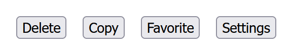
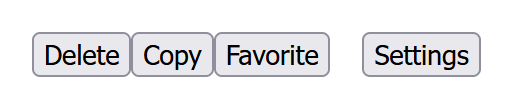

---
{
  title: "Transparent Elements",
  description: "There are specific instances where you may want to have a wrapper element in a framework that renders to nothing in the DOM. This is how.",
  published: "2024-03-11T12:06:00.000Z",
  authors: ["crutchcorn"],
  tags: ["react", "angular", "vue", "webdev"],
  attached: [],
  order: 6,
  collection: "framework-field-guide-fundamentals-v1-1",
  noindex: true,
  version: "v1.1",
  upToDateSlug: "ffg-fundamentals-transparent-elements",
}
---

Whew! That last chapter was a doozy. Let's slow things down a bit for this chapter: Short and sweet.

Let's think back to the ["Dynamic HTML"](/posts/ffg-fundamentals-v1-1-dynamic-html) and ["Intro to Components"](/posts/ffg-fundamentals-v1-1-intro-to-components) chapters, where we were building our `File ` and `FileList` components:

<!-- ::start:tabs -->

# React

```jsx
const File = ({ href, fileName, isSelected, onSelected, isFolder }) => {
	const [inputDate, setInputDate] = useState(new Date());

	// ...

	return (
		<button
			onClick={onSelected}
			style={
				isSelected
					? { backgroundColor: "blue", color: "white" }
					: { backgroundColor: "white", color: "blue" }
			}
		>
			{fileName}
			{isFolder ? <span>Type: Folder</span> : <span>Type: File</span>}
			{!isFolder && <FileDate inputDate={inputDate} />}
		</button>
	);
};

const FileList = () => {
	// ...

	return (
		// ...
		<ul>
			{filesArray.map((file, i) => (
				<li key={file.id}>
					{(!onlyShowFiles || !file.isFolder) && (
						<File
							isSelected={selectedIndex === i}
							onSelected={() => onSelected(i)}
							fileName={file.fileName}
							href={file.href}
							isFolder={file.isFolder}
						/>
					)}
				</li>
			))}
		</ul>
		// ...
	);
};
```

<!-- ::start:no-ebook -->
<iframe data-frame-title="React Transparent Files Before - StackBlitz" src="pfp-code:./ffg-fundamentals-react-transparent-files-before-50?template=node&embed=1&file=src%2Fmain.jsx"></iframe>
<!-- ::end:no-ebook -->

# Angular

```angular-ts
@Component({
	selector: "file-item",
	standalone: true,
	imports: [FileDateComponent],
	template: `
		<button
			(click)="selected.emit()"
			[style]="
				isSelected
					? 'background-color: blue; color: white'
					: 'background-color: white; color: blue'
			"
		>
			{{ fileName }}
			@if (isFolder) {
				<span>Type: Folder</span>
			} @else {
				<span>Type: File</span>
			}
			@if (!isFolder) {
				<file-date [inputDate]="inputDate" />
			}
		</button>
	`,
})
class FileComponent implements OnInit, OnDestroy {
	@Input() fileName!: string;
	@Input() href!: string;
	@Input() isSelected!: boolean;
	@Input() isFolder!: boolean;
	@Output() selected = new EventEmitter();
	inputDate = new Date();

	// ...
}

@Component({
	selector: "file-list",
	standalone: true,
	imports: [FileComponent],
	template: `
		<!-- ... -->
		<ul>
			@for (file of filesArray; let i = $index; track file.id) {
				<li>
					@if (onlyShowFiles ? !file.isFolder : true) {
						<file-item
							(selected)="onSelected(i)"
							[isSelected]="selectedIndex === i"
							[fileName]="file.fileName"
							[href]="file.href"
							[isFolder]="file.isFolder"
						/>
					}
				</li>
			}
		</ul>
		<!-- ... -->
	`,
})
class FileListComponent {
	// ...
}
```

<!-- ::start:no-ebook -->
<iframe data-frame-title="Angular Transparent Files Before - StackBlitz" src="pfp-code:./ffg-fundamentals-angular-transparent-files-before-50?template=node&embed=1&file=src%2Fmain.ts"></iframe>
<!-- ::end:no-ebook -->

# Vue

```vue
<!-- File.vue -->
<script setup>
import { ref, onMounted, onUnmounted } from "vue";
import FileDate from "./FileDate.vue";

const props = defineProps(["isSelected", "isFolder", "fileName", "href"]);

const emit = defineEmits(["selected"]);

const inputDate = ref(new Date());
// ...
</script>

<template>
	<button
		v-on:click="emit('selected')"
		:style="
			isSelected
				? 'background-color: blue; color: white'
				: 'background-color: white; color: blue'
		"
	>
		{{ fileName }}
		<span v-if="isFolder">Type: Folder</span>
		<span v-else>Type: File</span>
		<FileDate v-if="!isFolder" :inputDate="inputDate" />
	</button>
</template>
```

```vue
<!-- FileList.vue -->
<script setup>
// ...
</script>

<template>
	<!-- ... -->
	<ul>
		<li v-for="(file, i) in filesArray" :key="file.id">
			<File
				v-if="onlyShowFiles ? !file.isFolder : true"
				@selected="onSelected(i)"
				:isSelected="selectedIndex === i"
				:fileName="file.fileName"
				:href="file.href"
				:isFolder="file.isFolder"
			/>
		</li>
	</ul>
	<!-- ... -->
</template>
```

<!-- ::start:no-ebook -->
<iframe data-frame-title="Vue Transparent Files Before - StackBlitz" src="pfp-code:./ffg-fundamentals-vue-transparent-files-before-50?template=node&embed=1&file=src%2FFileList.vue"></iframe>
<!-- ::end:no-ebook -->

<!-- ::end:tabs -->

While this theoretically _works_, there's a significant problem with it. Let's take a look at what the HTML looks like when rendering with `onlyShowFiles=true` and the following `filesArray`:

```javascript
[
	{
		fileName: "File one",
		href: "/file/file_one",
		isFolder: false,
		id: 1,
	},
	{
		fileName: "Folder one",
		href: "",
		isFolder: true,
		id: 2,
	},
];
```

Because our conditional statement is on the `li` when rendered to the DOM, it might look something like this:

```html
<!-- ... -->
<ul>
	<li>
		<!-- File Component -->
		<button>...</button>
	</li>
	<li></li>
</ul>
<!-- ... -->
```

While this might not seem like a big problem at first, the fact that there's an empty `li` in the middle of our `ul` introduces three issues:

1. It will leave an empty space created by any styling you have applied to the `li`.
2. [Any assistive technologies, like screen readers](/posts/intro-to-web-accessibility), will read out that there's an empty item, which is a confusing behavior for those users.
3. Any search engines reading data off of your page may incorrectly assume that your list is intentionally empty, thus potentially impacting your ranking on sites.

Solving these issues is where something called "transparent elements" comes into play. See, ideally, what we want to have is something like a tag that renders to _nothing_.

<!-- ::in-content-ad title="Consider supporting" body="Donating any amount will help towards further development of the Framework Field Guide." button-text="Sponsor my work" button-href="https://github.com/sponsors/crutchcorn/" -->

This means that if we could instead generate something like the following pseudo-syntax in framework code:

```html
<ul>
	<nothing>
		<li>
			<button>...</button>
		</li>
	</nothing>
	<nothing></nothing>
</ul>
```

We could render this into the DOM itself:

```html
<ul>
	<li>
		<button>...</button>
	</li>
</ul>
```

Luckily for us, each of the three frameworks provides a method for doing so, simply with a different syntax. Let's see how each framework does so:

<!-- ::start:tabs -->

# React

In React, we use something called a "Fragment" in place of the `nothing` component.

```jsx
import { Fragment } from "react";

// ...

<ul>
	{filesArray.map((file, i) => (
		<Fragment key={file.id}>
			{(!onlyShowFiles || !file.isFolder) && (
				<li>
					<File
						isSelected={selectedIndex === i}
						onSelected={() => onSelected(i)}
						fileName={file.fileName}
						href={file.href}
						isFolder={file.isFolder}
					/>
				</li>
			)}
		</Fragment>
	))}
</ul>;
```

<!-- ::start:no-ebook -->
<iframe data-frame-title="React Transparent Files After - StackBlitz" src="pfp-code:./ffg-fundamentals-react-transparent-files-after-51?template=node&embed=1&file=src%2Fmain.jsx"></iframe>
<!-- ::end:no-ebook -->

## `Fragment` Alternative Syntax {#fragment-alt-syntax}

`Fragment` also has an alternative syntax in JSX. Instead of `<Fragment></Fragment>`, you can simply do `<></>`. This shorthand removes the need for the import and makes the above code sample read like this:

```jsx
<ul>
	{filesArray.map((file, i) => (
		<>
			{(!onlyShowFiles || !file.isFolder) && (
				<li>
					<File />
				</li>
			)}
		</>
	))}
</ul>
```

> You may notice that `<>` syntax for `Fragment` does not have a `key` associated with it. This is because the `<>` syntax does not allow you to have props associated with it.
>
> However, this means that your loop will still misbehave and add performance overhead as a penalty for not including `key` ([as we discussed in the "Dynamic HTML" chapter](/posts/ffg-fundamentals-v1-1-dynamic-html)). For this reason, when inside a `map` loop, you'll want to use `Fragment` with a `key` property associated with it.

# Angular

Angular's version of the `nothing` element is the `ng-container` element.

```angular-html
<ul>
	@for (file of filesArray; let i = $index; track file.id) {
		<ng-container>
			@if (onlyShowFiles ? !file.isFolder : true) {
				<li>
					<file-item
						(selected)="onSelected(i)"
						[isSelected]="selectedIndex === i"
						[fileName]="file.fileName"
						[href]="file.href"
						[isFolder]="file.isFolder"
					/>
				</li>
			}
		</ng-container>
	}
</ul>
```

<!-- ::start:no-ebook -->
<iframe data-frame-title="Angular Transparent Files After - StackBlitz" src="pfp-code:./ffg-fundamentals-angular-transparent-files-after-51?template=node&embed=1&file=src%2Fmain.ts"></iframe>
<!-- ::end:no-ebook -->

However, unlike React and Vue; we don't need to use `ng-container` in this example. Angular allows us to have multiple elements at the root of any control flow block, so we can remove the `ng-container` and have the following:

```angular-html
<ul>
	@for (file of filesArray; let i = $index; track file.id) {
		@if (onlyShowFiles ? !file.isFolder : true) {
			<li>
				<file-item
					(selected)="onSelected(i)"
					[isSelected]="selectedIndex === i"
					[fileName]="file.fileName"
					[href]="file.href"
					[isFolder]="file.isFolder"
				/>
			</li>
		}
	}
</ul>
```

This has the same effect as the previous example, but with less code. We'll continue to use `ng-container` in this chapter to keep the examples consistent with other frameworks, but there's little need for it in most modern Angular codebases.

# Vue

To render out something akin to a `nothing` element, we can use a [`template`](https://developer.mozilla.org/en-US/docs/Web/HTML/Element/template) element with a `v-for` or `v-if` associated with it.

```vue
<template>
	<ul>
		<template v-for="(file, i) of filesArray" :key="file.id">
			<li v-if="onlyShowFiles ? !file.isFolder : true">
				<File
					@selected="onSelected(i)"
					:isSelected="selectedIndex === i"
					:fileName="file.fileName"
					:href="file.href"
					:isFolder="file.isFolder"
				/>
			</li>
		</template>
	</ul>
</template>
```

<!-- ::start:no-ebook -->
<iframe data-frame-title="Vue Transparent Files After - StackBlitz" src="pfp-code:./ffg-fundamentals-vue-transparent-files-after-51?template=node&embed=1&file=src%2FFileList.vue"></iframe>
<!-- ::end:no-ebook -->

<!-- ::end:tabs -->

# Stacking Transparent Elements {#stacking-transparent-els}

Just as a quick note, not only can these `nothing` elements be used once, but they can be stacked back-to-back to do... Well, nothing!

Here are some code samples that render out the following:

```html
<p>Test</p>
```

<!-- ::start:tabs -->

## React

```jsx
<>
	<>
		<>
			<p>Test</p>
		</>
	</>
</>
```

<!-- ::start:no-ebook -->
<iframe data-frame-title="React Stacked Transparent - StackBlitz" src="pfp-code:./ffg-fundamentals-react-stacked-transparent-52?template=node&embed=1&file=src%2Fmain.jsx"></iframe>
<!-- ::end:no-ebook -->

## Angular

```html
<ng-container>
	<ng-container>
		<ng-container>
			<p>Test</p>
		</ng-container>
	</ng-container>
</ng-container>
```

<!-- ::start:no-ebook -->
<iframe data-frame-title="Angular Stacked Transparent - StackBlitz" src="pfp-code:./ffg-fundamentals-angular-stacked-transparent-52?template=node&embed=1&file=src%2Fmain.ts"></iframe>
<!-- ::end:no-ebook -->

## Vue

While the other frameworks have a more 1:1 mapping between our pseudo-syntax `nothing`, Vue has a slightly different approach due to its reuse of the [existing HTML `<template>` tag](https://developer.mozilla.org/en-US/docs/Web/HTML/Element/template).

By default, if you render a `template` in Vue in any other place besides the root, it will render nothing to the screen:

```vue
<template>
	<template>
		<p>Test</p>
	</template>
</template>
```

> It's worth mentioning that even if it shows nothing on screen, the `template` element is still in the DOM itself, waiting to be used in other ways. While explaining "why" an HTML `template` element renders nothing by default is outside the scope of this book, it is expected behavior.

However, if you add a `v-for`, `v-if`, or a `v-slot` (we'll touch on what a `v-slot` is in [our "Accessing Children" chapter](/posts/ffg-fundamentals-v1-1-accessing-children#passing-values-to-projected-content)), it will remove the `<template>` and only render out the children.

This means that both:

```vue
<template>
	<template v-if="true">
		<p>Test</p>
	</template>
</template>
```

And:

```vue
<template>
	<template v-if="true">
		<template v-if="true">
			<template v-if="true">
				<p>Test</p>
			</template>
		</template>
	</template>
</template>
```

Will both render out to the following HTML:

```html
<p>Test</p>
```

<!-- ::start:no-ebook -->
<iframe data-frame-title="Vue Stacked Transparent - StackBlitz" src="pfp-code:./ffg-fundamentals-vue-stacked-transparent-52?template=node&embed=1&file=src%2FApp.vue"></iframe>
<!-- ::end:no-ebook -->

> Of course, these rules don't apply to the root-level `template`, that acts as a container for our template code. It's a bit confusing at first, but makes sense when you practice more.

<!-- ::end:tabs -->

# Challenge {#challenge}

Now that we understand how to render a transparent element (transparent to the DOM, anyway), let's build out an example where this would be useful.

Namely, let's assume that we want to build out a bar of buttons with a gap between them:



To do this with HTML, we might have the following template and styling:

```html
<div
	style="
    display: 'inline-flex',
	gap: 1rem;
  "
>
	<button>Delete</button>
	<button>Copy</button>
	<button>Favorite</button>
	<button>Settings</button>
</div>
```

However, what if we wanted to only display the first three buttons:

- Delete
- Copy
- Favorite

Only when a file is selected?

Let's build this out using our favorite frameworks:

<!-- ::start:tabs -->

## React

```jsx
const FileActionButtons = ({ onDelete, onCopy, onFavorite }) => {
	return (
		<div>
			<button onClick={onDelete}>Delete</button>
			<button onClick={onCopy}>Copy</button>
			<button onClick={onFavorite}>Favorite</button>
		</div>
	);
};

const ButtonBar = ({
	onSettings,
	onDelete,
	onCopy,
	onFavorite,
	fileSelected,
}) => {
	return (
		<div
			style={{
				display: "flex",
				gap: "1rem",
			}}
		>
			{fileSelected && (
				<FileActionButtons
					onDelete={onDelete}
					onCopy={onCopy}
					onFavorite={onFavorite}
				/>
			)}
			<button onClick={onSettings}>Settings</button>
		</div>
	);
};
```

## Angular

```angular-ts
@Component({
	selector: "file-action-buttons",
	standalone: true,
	template: `
		<div>
			<button (click)="delete.emit()">Delete</button>
			<button (click)="copy.emit()">Copy</button>
			<button (click)="favorite.emit()">Favorite</button>
		</div>
	`,
})
class FileActionButtonsComponent {
	@Output() delete = new EventEmitter();
	@Output() copy = new EventEmitter();
	@Output() favorite = new EventEmitter();
}

@Component({
	selector: "button-bar",
	standalone: true,
	imports: [FileActionButtonsComponent],
	template: `
		<div style="display: flex; gap: 1rem">
			@if (fileSelected) {
				<file-action-buttons
					(delete)="delete.emit()"
					(copy)="copy.emit()"
					(favorite)="favorite.emit()"
				/>
			}
			<button (click)="settings.emit()">Settings</button>
		</div>
	`,
})
class ButtonBarComponent {
	@Input() fileSelected!: boolean;

	@Output() delete = new EventEmitter();
	@Output() copy = new EventEmitter();
	@Output() favorite = new EventEmitter();
	@Output() settings = new EventEmitter();
}
```

## Vue

```vue
<!-- FileActionButtons.vue -->
<script setup>
const emit = defineEmits(["delete", "copy", "favorite"]);
</script>

<template>
	<div>
		<button @click="emit('delete')">Delete</button>
		<button @click="emit('copy')">Copy</button>
		<button @click="emit('favorite')">Favorite</button>
	</div>
</template>
```

```vue
<!-- ButtonBar.vue -->
<script setup>
import FileActionButtons from "./FileActionButtons.vue";

const props = defineProps(["fileSelected"]);
const emit = defineEmits(["delete", "copy", "favorite", "settings"]);
</script>

<template>
	<div style="display: flex; gap: 1rem">
		<FileActionButtons
			v-if="props.fileSelected"
			@delete="emit('delete')"
			@copy="emit('copy')"
			@favorite="emit('favorite')"
		/>
		<button @click="emit('settings')">Settings</button>
	</div>
</template>
```

<!-- ::end:tabs -->

> Oh no! The rendered output isn't as we expected!



That's because when we used a `div` for our `FileActionButtons` component, it bypassed the `gap` property of CSS. To fix this, we can use our handy dandy `nothing` element:

<!-- ::start:tabs -->

## React

```jsx
// FileActionButtons
<>
	<button onClick={onDelete}>Delete</button>
	<button onClick={onCopy}>Copy</button>
	<button onClick={onFavorite}>Favorite</button>
</>
```

<!-- ::start:no-ebook -->

<details>

<summary>Final code output</summary>

<iframe data-frame-title="React Dynamic Challenge - StackBlitz" src="pfp-code:./ffg-fundamentals-react-transparent-challenge-53?template=node&embed=1&file=src%2Fmain.jsx"></iframe>

</details>

<!-- ::end:no-ebook -->

## Angular

```angular-ts {5-9,11-17}
@Component({
	selector: "file-action-buttons",
	standalone: true,
	template: `
		<ng-container>
			<button (click)="delete.emit()">Delete</button>
			<button (click)="copy.emit()">Copy</button>
			<button (click)="favorite.emit()">Favorite</button>
		</ng-container>
	`,
	styles: [
		`
			:host {
				display: contents;
			}
		`,
	],
})
class FileActionButtonsComponent {
	// ...
}
```

We can even simplify this by removing the `ng-container`, since Angular supports multiple elements at the root of the component template.

```angular-ts {4-15}
@Component({
	selector: "file-action-buttons",
	standalone: true,
	template: `
		<button (click)="delete.emit()">Delete</button>
		<button (click)="copy.emit()">Copy</button>
		<button (click)="favorite.emit()">Favorite</button>
	`,
	styles: [
		`
			:host {
				display: contents;
			}
		`,
	],
})
class FileActionButtonsComponent {
	// ...
}
```

> Unlike the other frameworks we're talking about, Angular's components add in an HTML element in the DOM.
>
> For example, here, our rendered markup looks like:
>
> ```html
> <div style="display: flex; gap: 1rem;">
> 	<file-action-buttons>
> 		<button>Delete</button>
> 		<button>Copy</button>
> 		<button>Favorite</button>
> 	</file-action-buttons>
> 	<button>Settings</button>
> </div>
> ```
>
> This causes our `gap` root to not apply to the inner buttons. To sidestep this, we need to use `styles` and tell our `host` component to treat the `button`s container as if it doesn't exist.

<!-- ::start:no-ebook -->

<details>

<summary>Final code output</summary>

<iframe data-frame-title="Angular Dynamic Challenge - StackBlitz" src="pfp-code:./ffg-fundamentals-angular-transparent-challenge-53?template=node&embed=1&file=src%2Fmain.ts"></iframe>

</details>

<!-- ::end:no-ebook -->

## Vue

Because Vue's root `<template>` can support multiple elements without the need for `v-if`, `v-for`, or `v-slot`, we can do the following:

```vue
<!-- FileActionButtons.vue -->
<template>
	<button @click="emit('delete')">Delete</button>
	<button @click="emit('copy')">Copy</button>
	<button @click="emit('favorite')">Favorite</button>
</template>

<!-- ... -->
```

<!-- ::start:no-ebook -->

<details>

<summary>Final code output</summary>

<iframe data-frame-title="Vue Dynamic Challenge - StackBlitz" src="pfp-code:./ffg-fundamentals-vue-transparent-challenge-53?template=node&embed=1&file=src%2FFileActionButtons.vue"></iframe>

</details>

<!-- ::end:no-ebook -->

<!-- ::end:tabs -->
