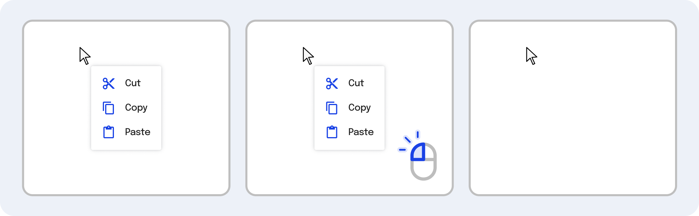
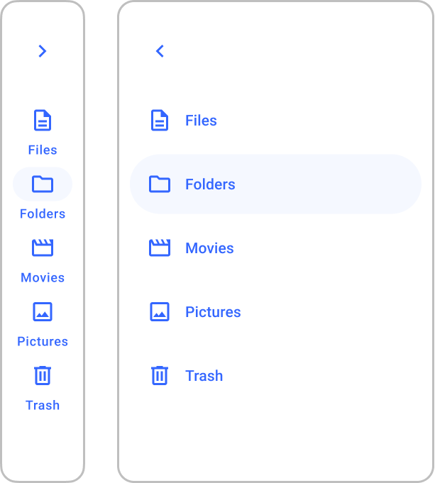

---
{
  title: "Component Reference",
  description: "While you usually want to pass data to child components, sometimes you need to access arbitrary data from the child without needing to explicitly pass the data.",
  published: "2024-03-11T12:09:00.000Z",
  authors: ["crutchcorn"],
  tags: ["react", "angular", "vue", "webdev"],
  attached: [],
  order: 9,
  collection: "framework-field-guide-fundamentals",
  version: "v2",
}
---

In our previous chapter, we built context menu functionality into our `App` component. This functionality allowed us to right-click on an element and get a list of actions we could take.



This code works as we'd expect, but it doesn't follow a fundamental pattern of React, Angular, or Vue: It's not componentized.

Let's fix this by moving our context menu code into its own component. This way, we're able to do refactors more easily, code cleanup, and more.

<!-- ::start:tabs -->

## React

```jsx
const ContextMenu = ({ isOpen, x, y, onClose }) => {
	const [contextMenu, setContextMenu] = useState();

	useEffect(() => {
		if (!contextMenu) return;
		const closeIfOutsideOfContext = (e) => {
			const isClickInside = contextMenu.contains(e.target);
			if (isClickInside) return;
			onClose(false);
		};
		document.addEventListener("click", closeIfOutsideOfContext);
		return () => document.removeEventListener("click", closeIfOutsideOfContext);
	}, [contextMenu]);

	if (!isOpen) return null;

	return (
		<div
			ref={(el) => setContextMenu(el)}
			tabIndex={0}
			style={{
				position: "fixed",
				top: y,
				left: x,
				background: "white",
				border: "1px solid black",
				borderRadius: 16,
				padding: "1rem",
			}}
		>
			<button onClick={() => onClose()}>X</button>
			This is a context menu
		</div>
	);
};

function App() {
	const [mouseBounds, setMouseBounds] = useState({
		x: 0,
		y: 0,
	});

	const [isOpen, setIsOpen] = useState(false);

	function onContextMenu(e) {
		e.preventDefault();
		setIsOpen(true);
		setMouseBounds({
			x: e.clientX,
			y: e.clientY,
		});
	}

	return (
		<>
			<div style={{ marginTop: "5rem", marginLeft: "5rem" }}>
				<div onContextMenu={onContextMenu}>Right click on me!</div>
			</div>
			<ContextMenu
				isOpen={isOpen}
				onClose={() => setIsOpen(false)}
				x={mouseBounds.x}
				y={mouseBounds.y}
			/>
		</>
	);
}
```

<!-- ::start:no-ebook -->
<iframe data-frame-title="React Comp Ref Intro - StackBlitz" src="pfp-code:./ffg-fundamentals-react-comp-ref-intro-66?template=node&embed=1&file=src%2Fmain.jsx"></iframe>
<!-- ::end:no-ebook -->

## Angular

```angular-ts
@Component({
	selector: "context-menu",
	standalone: true,
	template: `
		@if (isOpen) {
			<div
				tabIndex="0"
				#contextMenu
				[style]="
					'
			position: fixed;
			top: ' +
					y +
					'px;
			left: ' +
					x +
					'px;
			background: white;
			border: 1px solid black;
			border-radius: 16px;
			padding: 1rem;
		  '
				"
			>
				<button (click)="close.emit()">X</button>
				This is a context menu
			</div>
		}
	`,
})
class ContextMenuComponent implements AfterViewInit, OnDestroy {
	@ViewChild("contextMenu") contextMenu!: ElementRef<HTMLElement>;

	@Input() isOpen!: boolean;
	@Input() x!: number;
	@Input() y!: number;

	@Output() close = new EventEmitter();

	closeIfOutsideOfContext = (e: MouseEvent) => {
		const contextMenuEl = this.contextMenu?.nativeElement;
		if (!contextMenuEl) return;
		const isClickInside = contextMenuEl.contains(e.target as HTMLElement);
		if (isClickInside) return;
		this.close.emit();
	};

	ngAfterViewInit() {
		document.addEventListener("click", this.closeIfOutsideOfContext);
	}

	ngOnDestroy() {
		document.removeEventListener("click", this.closeIfOutsideOfContext);
	}
}

@Component({
	selector: "app-root",
	standalone: true,
	imports: [ContextMenuComponent],
	template: `
		<div style="margin-top: 5rem; margin-left: 5rem">
			<div #contextOrigin (contextmenu)="open($event)">Right click on me!</div>
		</div>
		<context-menu
			(close)="close()"
			[isOpen]="isOpen"
			[x]="mouseBounds.x"
			[y]="mouseBounds.y"
		/>
	`,
})
class AppComponent {
	isOpen = false;

	mouseBounds = {
		x: 0,
		y: 0,
	};

	close() {
		this.isOpen = false;
	}

	open(e: MouseEvent) {
		e.preventDefault();
		this.isOpen = true;
		this.mouseBounds = {
			x: e.clientX,
			y: e.clientY,
		};
	}
}
```

<!-- ::start:no-ebook -->
<iframe data-frame-title="Angular Comp Ref Intro - StackBlitz" src="pfp-code:./ffg-fundamentals-angular-comp-ref-intro-66?template=node&embed=1&file=src%2Fmain.ts"></iframe>
<!-- ::end:no-ebook -->

## Vue

```vue
<!-- ContextMenu.vue -->
<script setup>
import { ref, onMounted, onUnmounted } from "vue";

const props = defineProps(["isOpen", "x", "y"]);

const emit = defineEmits(["close"]);

const contextMenuRef = ref(null);

function closeIfOutside(e) {
	const contextMenuEl = contextMenuRef.value;
	if (!contextMenuEl) return;
	const isClickInside = contextMenuEl.contains(e.target);
	if (isClickInside) return;
	emit("close");
}

onMounted(() => {
	document.addEventListener("click", closeIfOutside);
});

onUnmounted(() => {
	document.removeEventListener("click", closeIfOutside);
});
</script>

<template>
	<div
		v-if="props.isOpen"
		ref="contextMenuRef"
		tabIndex="0"
		:style="`
      position: fixed;
      top: ${props.y}px;
      left: ${props.x}px;
      background: white;
      border: 1px solid black;
      border-radius: 16px;
      padding: 1rem;
    `"
	>
		<button @click="emit('close')">X</button>
		This is a context menu
	</div>
</template>
```

```vue
<!-- App.vue -->
<script setup>
import { ref } from "vue";
import ContextMenu from "./ContextMenu.vue";

const isOpen = ref(false);

const mouseBounds = ref({
	x: 0,
	y: 0,
});

const close = () => {
	isOpen.value = false;
};

const open = (e) => {
	e.preventDefault();
	isOpen.value = true;
	mouseBounds.value = {
		x: e.clientX,
		y: e.clientY,
	};
};
</script>

<template>
	<div style="margin-top: 5rem; margin-left: 5rem">
		<div @contextmenu="open($event)">Right click on me!</div>
	</div>
	<ContextMenu
		:isOpen="isOpen"
		:x="mouseBounds.x"
		:y="mouseBounds.y"
		@close="close()"
	/>
</template>
```

<!-- ::start:no-ebook -->
<iframe data-frame-title="Vue Comp Ref Intro - StackBlitz" src="pfp-code:./ffg-fundamentals-vue-comp-ref-intro-66?template=node&embed=1&file=src%2FApp.vue"></iframe>
<!-- ::end:no-ebook -->

<!-- ::end:tabs -->

You may have noticed that during this migration, we ended up removing a crucial accessibility feature: **We're no longer running `focus` on the context menu when it opens.**

Why was it removed, and how can we add it back?

# Introducing Component Reference {#introducing-component-reference}

**The reason we removed the context menu's focus management is to keep control of the context menu in the parent.**

While we could have kept the `.focus()` logic in the component using [a component side effect handler](/posts/ffg-fundamentals-side-effects), this muddies the water a bit. Ideally, in a framework, **you want your parent to be in charge of the child component's behavior**.

This allows you to re-use your context menu component in more places, should you theoretically ever want to use the component without forcing a focus change.

To do this, let's move the `.focus` method out of our component. Moving from this:

```javascript
/* This is valid JS, but is only pseudocode of what each framework is doing */
// Child component
function onComponentRender() {
	document.addEventListener("click", closeIfOutsideOfContext);
	contextMenu.focus();
}

// Parent component
function openContextMenu(e) {
	e.preventDefault();
	setOpen(true);
}
```

To this:

```javascript
/* This is valid JS, but is only pseudocode of what each framework is doing */
// Child component
function onComponentRender() {
	document.addEventListener("click", closeIfOutsideOfContext);
}

// Parent component
function openContextMenu(e) {
	e.preventDefault();
	setOpen(true);
	contextMenu.focus();
}
```

While this might seem like a straightforward change at first, there's a new problem present: Our `contextMenu` is now inside a component. As a result, we need to [access not only the underlying DOM node using element reference](/posts/ffg-fundamentals-element-reference) but the `ContextMenu` component instance as well.

<!-- ::in-content-ad title="Consider supporting" body="Donating any amount will help towards further development of the Framework Field Guide." button-text="Sponsor my work" button-href="https://github.com/sponsors/crutchcorn/" -->

Luckily for us, each framework enables us to do just that! Before we implement the `focus` logic, let's dive into how component reference works:

<!-- ::start:tabs -->

## React

React has two APIs that help us gain insights into a component's internals from its parent:

- [`forwardRef`](#forward-ref)
- [`useImperativeHandle`](#imperative-handle)

Let's start with the basics: `forwardRef`.

### `forwardRef` {#forward-ref}

`forwardRef` does what it says on the tin: It allows you to forward a `ref` property through a component instance.

See, in React, `ref` is a special property. This means that to be used properly, React has to have a special syntax to enable its expected functionality.

As a result, the following code does not work:

```jsx
const Component = ({ ref, style }) => {
	return <div ref={ref} style={style} />;
};

const App = () => {
	return (
		<Component
			ref={(el) => alert(el)}
			style={{ height: 100, width: 100, backgroundColor: "red" }}
		/>
	);
};
```

<!-- ::start:no-ebook -->
<iframe data-frame-title="React Broken forwardRef - StackBlitz" src="pfp-code:./ffg-fundamentals-react-broken-forward-ref-67?template=node&embed=1&file=src%2Fmain.jsx"></iframe>
<!-- ::end:no-ebook -->

Doing this will result in our `ref` callback not being called as expected, alongside two error messages explaining why:

> Warning: Component: `ref` is not a prop. Trying to access it will result in `undefined` being returned. If you need to access the same value within the child component, you should pass it as a different prop. (https://reactjs.org/link/special-props)

> Warning: Function components cannot be given refs. Attempts to access this ref will fail. Did you mean to use `forwardRef()`?

To solve this, we have two options:

1. Rename our `ref` property to another name, like `divRef`:

```jsx {1-3,8}
const Component = ({ divRef, style }) => {
	return <div ref={divRef} style={style} />;
};

const App = () => {
	return (
		<Component
			divRef={(el) => alert(el)}
			style={{ height: 100, width: 100, backgroundColor: "red" }}
		/>
	);
};
```

<!-- ::start:no-ebook -->
<iframe data-frame-title="React Renamed Ref - StackBlitz" src="pfp-code:./ffg-fundamentals-react-renamed-ref-67?template=node&embed=1&file=src%2Fmain.jsx"></iframe>
<!-- ::end:no-ebook -->

2. Use the `forwardRef` API, as suggested by the error message originally printed.

```jsx {1-5,10}
import { forwardRef } from "react";

const Component = forwardRef((props, ref) => {
	return <div ref={ref} style={props.style} />;
});

const App = () => {
	return (
		<Component
			ref={(el) => alert(el)}
			style={{ height: 100, width: 100, backgroundColor: "red" }}
		/>
	);
};
```

<!-- ::start:no-ebook -->
<iframe data-frame-title="React Working forwardRef - StackBlitz" src="pfp-code:./ffg-fundamentals-react-working-forward-ref-67?template=node&embed=1&file=src%2Fmain.jsx"></iframe>
<!-- ::end:no-ebook -->

As we can see, `forwardRef` accepts slightly modified component functions. While the first argument might look familiar as our place to access properties, our special property `ref` is passed as a second argument.

We can then _forward_ that `ref` to wherever we want to gain access to an underlying DOM node in the child.

But what if we wanted _more_ control over our child component? What if we wanted to access data and methods from the child component using a `ref`?

Luckily, `useImperativeHandle` does just that!

### `useImperativeHandle` {#imperative-handle}

While `forwardRef` enables us to pass a `ref` to a child component, `useImperativeHandle` allows us to fully customize this `ref` to our heart's content.

```jsx {1,4-12}
import { forwardRef, useImperativeHandle } from "react";

const Component = forwardRef((props, ref) => {
	useImperativeHandle(ref, () => {
		// Anything returned here will be assigned to the forwarded `ref`
		return {
			pi: 3.14,
			sayHi() {
				alert("Hello, world");
			},
		};
	});

	return <div style={props.style} />;
});

const App = () => {
	return (
		<Component
			ref={(el) => console.log(el)}
			style={{ height: 100, width: 100, backgroundColor: "red" }}
		/>
	);
};
```

<!-- ::start:no-ebook -->
<iframe data-frame-title="React useImperativeHandle - StackBlitz" src="pfp-code:./ffg-fundamentals-react-use-imperative-handle-67?template=node&embed=1&file=src%2Fmain.jsx"></iframe>
<!-- ::end:no-ebook -->

Here, we can assign properties, functions, or any other JavaScript values to the forwarded `ref`. If we look at the output of our `ref` callback from `App` it shows up the object that we assigned using `useImperativeHandle`:

```javascript
({ pi: 3.14, sayHi: sayHi() });
```

That `sayHi` function still works, too! If we change `App` to the following:

```jsx {2,5}
const App = () => {
	const compRef = useRef();
	return (
		<>
			<button onClick={() => compRef.current.sayHi()}>Say hi</button>
			<Component ref={compRef} />
		</>
	);
};
```

<!-- ::start:no-ebook -->
<iframe data-frame-title="React useImperativeHandle Fn Use - StackBlitz" src="pfp-code:./ffg-fundamentals-react-use-imperative-handle-fn-use-67?template=node&embed=1&file=src%2Fmain.jsx"></iframe>
<!-- ::end:no-ebook -->

It will output `Hello, world`, just as we would expect it to!

### `useImperativeHandle` Dependency Array {#useimperativehandle-dep-array}

Let's stop and think about how `useImperativeHandle` works under the hood for a moment.

We know that `useRef` creates an object with the shape of:

```javascript
({ current: initialValue });
```

Which you can then mutate without triggering a re-render.

```jsx
const App = () => {
	const numberOfRenders = useRef(0);

	numberOfRenders.current += 1;

	return null;
};
```

Now, let's say that we didn't have access to `useImperativeHandle`, but still wanted to pass a value from a child component to a parent via the passed `ref`. That might look something like this:

```jsx
const Child = forwardRef((props, ref) => {
	ref.current += 1;

	return null;
});

const Parent = () => {
	const numberOfChildRenders = useRef(0);

	return <Child ref={numberOfChildRenders} />;
};
```

But wait a moment! If we think back to [our Side Effects chapter](/posts/ffg-fundamentals-side-effects), we'll remember that mutating state outside a component's local values is an example of a side effect.


Because this kind of in-render side effect mutation can cause strange issues and edge-cases with React, we need to make sure that we're using `useEffect` or `useLayoutEffect`.

Because our code ideally should happen during our render (rather than afterward), let's opt to use `useLayoutEffect`.

Changing the previous code to use `useLayoutEffect` looks something like this:

```jsx
const Child = forwardRef((props, ref) => {
	useLayoutEffect(() => {
		ref.current += 1;
	});

	return null;
});
```

This is similar to how `useImperativeHandle` works under the hood. It's so similar, in fact, that it's effectively how the hook is written [in React's source code itself](https://jser.dev/react/2021/12/25/how-does-useImperativeHandle-work/).

> But wait! `useLayoutEffect` has the option to pass an array to it so that you can avoid re-running the side effect. Does that work in `useImperativeHandle` as well?

Indeed, it does, astute reader! Instead of:

```jsx
useLayoutEffect(() => {
	ref.current = someVal;
}, [someVal]);
```

We might do the following instead:

```jsx
useImperativeHandle(ref, () => someVal, [someVal]);
```

## Angular

Just as we can use `ViewChild` to access an underlying DOM node, we can do the same thing with a component reference. In fact, we can use a template reference variable just like we would to access the DOM node.

```angular-ts {1,24,27}
import { AfterViewInit, Component, ViewChild } from "@angular/core";

@Component({
	selector: "child-comp",
	standalone: true,
	template: `<div
		style="height: 100px; width: 100px; background-color: red;"
	></div>`,
})
class ChildComponent {
	pi = 3.14;
	sayHi() {
		alert("Hello, world");
	}
}

@Component({
	selector: "parent-comp",
	standalone: true,
	imports: [ChildComponent],
	template: `<child-comp #childVar />`,
})
class ParentComponent implements AfterViewInit {
	@ViewChild("childVar") childComp!: ChildComponent;

	ngAfterViewInit() {
		console.log(this.childComp);
	}
}
```

<!-- ::start:no-ebook -->
<iframe data-frame-title="Angular Comp Ref Log - StackBlitz" src="pfp-code:./ffg-fundamentals-angular-comp-ref-log-67?template=node&embed=1&file=src%2Fmain.ts"></iframe>
<!-- ::end:no-ebook -->

Doing this, we'll see the console output:

```javascript
/* Object */ ({ pi: 3.14 });
```

But how do we know that this is properly the `ChildComponent` instance? Simple! We'll `console.log` `childComp.constructor` and we'll see:

```angular-ts
class ChildComponent {}
```

This means that, as a result, we can also call the `sayHi` method:

```angular-ts
@Component({
	selector: "parent-comp",
	standalone: true,
	imports: [ChildComponent],
	template: `
		<button (click)="sayHiFromChild()">Say hi</button>
		<child-comp #childVar />
	`,
})
class ParentComponent {
	@ViewChild("childVar") childComp!: ChildComponent;

	sayHiFromChild() {
		this.childComp.sayHi();
	}
}
```

And it will alert:

```
Hello, world
```

<!-- ::start:no-ebook -->
<iframe data-frame-title="Angular Comp Ref Alert - StackBlitz" src="pfp-code:./ffg-fundamentals-angular-comp-ref-alert-67?template=node&embed=1&file=src%2Fmain.ts"></iframe>
<!-- ::end:no-ebook -->

## Vue

Using the same `ref` API as element nodes, you can access a component's instance:

```vue
<!-- Child.vue -->
<script setup>
const pi = 3.14;

function sayHi() {
	alert("Hello, world");
}
</script>

<template>
	<p>Hello, template</p>
</template>
```

```vue
<!-- Parent.vue -->
<script setup>
import { ref, onMounted } from "vue";
import Child from "./Child.vue";

const childComp = ref();

onMounted(() => {
	console.log(childComp.value);
});
</script>

<template>
	<Child ref="childComp" />
</template>
```

<!-- ::start:no-ebook -->
<iframe data-frame-title="Vue Comp Ref Log - StackBlitz" src="pfp-code:./ffg-fundamentals-vue-comp-ref-log-67?template=node&embed=1&file=src%2FParent.vue"></iframe>
<!-- ::end:no-ebook -->

If we look at our console output, we might see something unexpected:

```javascript
/* Proxy */ ({
	"<target>": {
		/*…*/
	},
	"<handler>": {
		/*…*/
	},
});
```

This is because Vue uses Proxies under the hood to power component state. Rest assured, however, this `Proxy` is still our component instance.

### Exposing Component Variables to References {#exposing-comp-vars}

We're not able to do much with this component instance currently. If we change out `Parent` component to `console.log`, the `pi` value from `Child`:

```vue
<!-- Parent.vue -->
<script setup>
import { ref, onMounted } from "vue";
import Child from "./Child.vue";

const childComp = ref();

onMounted(() => {
	alert(childComp.value.pi);
});
</script>

<template>
	<Child ref="childComp" />
</template>
```

<!-- ::start:no-ebook -->
<iframe data-frame-title="Vue Broken Expose Comp Ref - StackBlitz" src="pfp-code:./ffg-fundamentals-vue-broken-expose-comp-ref-67?template=node&embed=1&file=src%2FParent.vue"></iframe>
<!-- ::end:no-ebook -->

We'll see that `childComp.value.pi` is `undefined` currently. This is because, by default, Vue's `setup script` does not "expose" internal variables to component references externally.

To fix this, we can use Vue's `defineExpose` global API to allow parent components to access a child component's variables and methods:

```vue
<!-- Child.vue -->
<script setup>
const pi = 3.14;

function sayHi() {
	alert("Hello, world");
}

defineExpose({
	pi,
	sayHi,
});
</script>

<template>
	<p>Hello, template</p>
</template>
```

Because we now have access to the component instance, we can access data and call methods similar to how we're able to access data and call methods from an element reference.

```vue
<!-- Parent.vue -->
<script setup>
import { ref, onMounted } from "vue";
import Child from "./Child.vue";

const childComp = ref();

onMounted(() => {
	alert(childComp.value.pi);
	childComp.value.sayHi();
});
</script>

<template>
	<Child ref="childComp" />
</template>
```

<!-- ::start:no-ebook -->
<iframe data-frame-title="Vue Expose Comp Ref - StackBlitz" src="pfp-code:./ffg-fundamentals-vue-expose-comp-ref-67?template=node&embed=1&file=src%2FParent.vue"></iframe>
<!-- ::end:no-ebook -->

<!-- ::end:tabs -->

# Using Component Reference to Focus Our Context Menu {#using-comp-ref}

Now that we sufficiently understand what component references look like in each framework, let's add it to our `App` component to re-enable focusing our `ContextMenu` component when it opens.

> Remember, if you see:
>
> ```javascript
> setTimeout(() => {
> 	doSomething();
> }, 0);
> ```
>
> It means that we want to defer the `doSomething` call until after all other tasks are complete. We're using this in our code samples to say:
>
> "Wait until the element is rendered to run `.focus()` on it"

<!-- ::start:tabs -->

## React

```jsx {1,4-6,12,26,28-35,41}
const ContextMenu = forwardRef(({ isOpen, x, y, onClose }, ref) => {
	const [contextMenu, setContextMenu] = useState();

	useImperativeHandle(ref, () => ({
		focus: () => contextMenu && contextMenu.focus(),
	}));

	// ...

	return (
		// Attributes removed for brevity
		<div ref={(el) => setContextMenu(el)}>{/* ... */}</div>
	);
});

function App() {
	const [mouseBounds, setMouseBounds] = useState({
		x: 0,
		y: 0,
	});

	// ...

	const [isOpen, setIsOpen] = useState(false);

	const contextMenuRef = useRef();

	useEffect(() => {
		if (isOpen) {
			setTimeout(() => {
				if (!contextMenuRef.current) return;
				contextMenuRef.current.focus();
			}, 0);
		}
	}, [isOpen, mouseBounds]);

	return (
		<>
			{/* ... */}
			<ContextMenu
				ref={contextMenuRef}
				isOpen={isOpen}
				onClose={() => setIsOpen(false)}
				x={mouseBounds.x}
				y={mouseBounds.y}
			/>
		</>
	);
}
```

<!-- ::start:no-ebook -->
<iframe data-frame-title="React Focused Comp Ref - StackBlitz" src="pfp-code:./ffg-fundamentals-react-focused-comp-ref-68?template=node&embed=1&file=src%2Fmain.ts"></iframe>
<!-- ::end:no-ebook -->

## Angular

```angular-ts {7,15,23-25,39,48,69}
@Component({
	selector: "context-menu",
	standalone: true,
	template: `
		@if (isOpen) {
		<!-- Attributes removed for brevity -->
			<div #contextMenu>
				<button (click)="close.emit()">X</button>
				This is a context menu
			</div>
		}
	`,
})
class ContextMenuComponent implements AfterViewInit, OnDestroy {
	@ViewChild("contextMenu") contextMenu!: ElementRef<HTMLElement>;

	@Input() isOpen!: boolean;
	@Input() x!: number;
	@Input() y!: number;

	@Output() close = new EventEmitter();

	focus() {
		this.contextMenu?.nativeElement?.focus();
	}

	// ...
}

@Component({
	selector: "app-root",
	standalone: true,
	imports: [ContextMenuComponent],
	template: `
		<div style="margin-top: 5rem; margin-left: 5rem">
			<div #contextOrigin (contextmenu)="open($event)">Right click on me!</div>
		</div>
		<context-menu
			#contextMenu
			(close)="close()"
			[isOpen]="isOpen"
			[x]="mouseBounds.x"
			[y]="mouseBounds.y"
		/>
	`,
})
class AppComponent {
	@ViewChild("contextMenu") contextMenu!: ContextMenuComponent;

	isOpen = false;

	mouseBounds = {
		x: 0,
		y: 0,
	};

	close() {
		this.isOpen = false;
	}

	open(e: MouseEvent) {
		e.preventDefault();
		this.isOpen = true;
		this.mouseBounds = {
			x: e.clientX,
			y: e.clientY,
		};
		setTimeout(() => {
			this.contextMenu.focus();
		}, 0);
	}
}
```

<!-- ::start:no-ebook -->
<iframe data-frame-title="Angular Focused Comp Ref - StackBlitz" src="pfp-code:./ffg-fundamentals-angular-focused-comp-ref-68?template=node&embed=1&file=src%2Fmain.ts"></iframe>
<!-- ::end:no-ebook -->

## Vue

```vue {9,13-15,17-19}
<!-- ContextMenu.vue -->
<script setup>
import { ref, onMounted, onUnmounted } from "vue";

const props = defineProps(["isOpen", "x", "y"]);

const emit = defineEmits(["close"]);

const contextMenuRef = ref(null);

// ...

function focusMenu() {
	contextMenuRef.value.focus();
}

defineExpose({
	focusMenu,
});
</script>

<template>
	<div
		v-if="props.isOpen"
		ref="contextMenuRef"
		tabIndex="0"
		:style="`
      position: fixed;
      top: ${props.y}px;
      left: ${props.x}px;
      background: white;
      border: 1px solid black;
      border-radius: 16px;
      padding: 1rem;
    `"
	>
		<button @click="emit('close')">X</button>
		This is a context menu
	</div>
</template>
```

```vue {13,27,37}
<!-- App.vue -->
<script setup>
import { ref } from "vue";
import ContextMenu from "./ContextMenu.vue";

const isOpen = ref(false);

const mouseBounds = ref({
	x: 0,
	y: 0,
});

const contextMenu = ref();

const close = () => {
	isOpen.value = false;
};

const open = (e) => {
	e.preventDefault();
	isOpen.value = true;
	mouseBounds.value = {
		x: e.clientX,
		y: e.clientY,
	};
	setTimeout(() => {
		contextMenu.value.focusMenu();
	}, 0);
};
</script>

<template>
	<div style="margin-top: 5rem; margin-left: 5rem">
		<div @contextmenu="open($event)">Right click on me!</div>
	</div>
	<ContextMenu
		ref="contextMenu"
		:isOpen="isOpen"
		:x="mouseBounds.x"
		:y="mouseBounds.y"
		@close="close()"
	/>
</template>
```

<!-- ::start:no-ebook -->
<iframe data-frame-title="Vue Focused Comp Ref - StackBlitz" src="pfp-code:./ffg-fundamentals-vue-focused-comp-ref-68?template=node&embed=1&file=src%2FContextMenu.vue"></iframe>
<!-- ::end:no-ebook -->

<!-- ::end:tabs -->

# Challenge {#challenge}

This information about component reference isn't just theoretically useful. You're able to apply it to your codebase to enable new methods of building out components.

Let's see that in action by building a sidebar component that's able to expand and collapse.



To add an extra special interaction with this sidebar, **let's make it so that when the user shrinks their screen to a certain size, it will automatically collapse the sidebar**.

To do this, we'll:

1. Set up our `App` component to handle a left and main column.
2. Make a sidebar that can collapse and expand to grow and shrink the main column.
3. Automatically expand or collapse the sidebar as the browser grows and shrinks.

Let's dive in.

## Step 1: Setup App Component Layout {#challenge-step-1}

Let's start creating our sidebar!

Our first step in doing so will be creating a layout file that includes a left-hand sidebar and a main content area on the right side.

To do that might look something like this:

<!-- ::start:tabs -->

### React

```jsx
const Layout = ({ sidebar, sidebarWidth, children }) => {
	return (
		<div style={{ display: "flex", flexWrap: "nowrap", minHeight: "100vh" }}>
			<div
				style={{
					width: `${sidebarWidth}px`,
					height: "100vh",
					overflowY: "scroll",
					borderRight: "2px solid #bfbfbf",
				}}
			>
				{sidebar}
			</div>
			<div style={{ width: "1px", flexGrow: 1 }}>{children}</div>
		</div>
	);
};

const App = () => {
	return (
		<Layout sidebar={<p>Sidebar</p>} sidebarWidth={150}>
			<p style={{ padding: "1rem" }}>Hi there!</p>
		</Layout>
	);
};
```

### Angular

```angular-ts
@Component({
	selector: "app-layout",
	standalone: true,
	template: `
		<div style="display: flex; flex-wrap: nowrap; min-height: 100vh">
			<div
				[style]="
					'width: ' +
					sidebarWidth +
					'px;' +
					'height: 100vh;' +
					'overflow-y: scroll;' +
					'border-right: 2px solid #bfbfbf;'
				"
			>
				<ng-content select="[sidebar]" />
			</div>
			<div style="width: 1px; flex-grow: 1">
				<ng-content />
			</div>
		</div>
	`,
})
class LayoutComponent {
	@Input() sidebarWidth!: number;
}

@Component({
	selector: "app-root",
	standalone: true,
	imports: [LayoutComponent],
	template: `
		<app-layout [sidebarWidth]="150">
			<p sidebar>Sidebar</p>
			<p style="padding: 1rem">Hi there!</p>
		</app-layout>
	`,
})
class AppComponent {}
```

### Vue

```vue
<!-- Layout.vue -->
<script setup>
const props = defineProps(["sidebarWidth"]);
</script>

<template>
	<div style="display: flex; flex-wrap: nowrap; min-height: 100vh">
		<div
			:style="`
          width: ${props.sidebarWidth}px;
          height: 100vh;
          overflow-y: scroll;
          border-right: 2px solid #bfbfbf;
        `"
		>
			<slot name="sidebar" />
		</div>
		<div style="width: 1px; flex-grow: 1">
			<slot />
		</div>
	</div>
</template>
```

```vue
<!-- App.vue -->
<script setup>
import Layout from "./Layout.vue";
</script>

<template>
	<Layout :sidebarWidth="150">
		<template #sidebar><p>Sidebar</p></template>
		<p style="padding: 1rem">Hi there!</p>
	</Layout>
</template>
```

<!-- ::end:tabs -->

## Step 2: Make a Collapsible Sidebar {#challenge-step-2}

Now that we have a rough sidebar, we'll make it so that the user can manually collapse the sidebar.

This can be done by having an `isCollapsed` state that the user toggles with a button.

When `isCollapsed` is `true`, it will only show the toggle button, but when `isCollapsed` is `false`, it should display the full sidebar's contents.

We'll also set up constants to support different widths of this sidebar area if it's collapsed or not.

<!-- ::start:tabs -->

### React

```jsx
const Sidebar = ({ toggle }) => {
	const [isCollapsed, setIsCollapsed] = useState(false);

	const setAndToggle = (v) => {
		setIsCollapsed(v);
		toggle(v);
	};
	const toggleCollapsed = () => {
		setAndToggle(!isCollapsed);
	};

	if (isCollapsed) {
		return <button onClick={toggleCollapsed}>Toggle</button>;
	}

	return (
		<div>
			<button onClick={toggleCollapsed}>Toggle</button>
			<ul style={{ padding: "1rem" }}>
				<li>List item 1</li>
				<li>List item 2</li>
				<li>List item 3</li>
				<li>List item 4</li>
				<li>List item 5</li>
				<li>List item 6</li>
			</ul>
		</div>
	);
};

const collapsedWidth = 100;
const expandedWidth = 150;

const App = () => {
	const [width, setWidth] = useState(expandedWidth);

	return (
		<Layout
			sidebarWidth={width}
			sidebar={
				<Sidebar
					toggle={(isCollapsed) => {
						if (isCollapsed) {
							setWidth(collapsedWidth);
							return;
						}
						setWidth(expandedWidth);
					}}
				/>
			}
		>
			<p style={{ padding: "1rem" }}>Hi there!</p>
		</Layout>
	);
};
```

### Angular

```angular-ts
@Component({
	selector: "app-sidebar",
	standalone: true,
	template: `
		@if (isCollapsed) {
			<button (click)="toggleCollapsed()">Toggle</button>
		}
		@if (!isCollapsed) {
			<div>
				<button (click)="toggleCollapsed()">Toggle</button>
				<ul style="padding: 1rem">
					<li>List item 1</li>
					<li>List item 2</li>
					<li>List item 3</li>
					<li>List item 4</li>
					<li>List item 5</li>
					<li>List item 6</li>
				</ul>
			</div>
		}
	`,
})
class SidebarComponent {
	@Output() toggle = new EventEmitter<boolean>();

	isCollapsed = false;

	setAndToggle(v: boolean) {
		this.isCollapsed = v;
		this.toggle.emit(v);
	}

	toggleCollapsed() {
		this.setAndToggle(!this.isCollapsed);
	}
}

@Component({
	selector: "app-root",
	standalone: true,
	imports: [LayoutComponent, SidebarComponent],
	template: `
		<app-layout [sidebarWidth]="width">
			<app-sidebar sidebar (toggle)="onToggle($event)" />
			<p style="padding: 1rem">Hi there!</p>
		</app-layout>
	`,
})
class AppComponent {
	collapsedWidth = 100;
	expandedWidth = 150;

	width = this.expandedWidth;

	onToggle(isCollapsed: boolean) {
		if (isCollapsed) {
			this.width = this.collapsedWidth;
			return;
		}
		this.width = this.expandedWidth;
	}
}
```

### Vue

```vue
<!-- Sidebar.vue -->
<script setup>
import { ref } from "vue";

const emit = defineEmits(["toggle"]);

const isCollapsed = ref(false);

function setAndToggle(v) {
	isCollapsed.value = v;
	emit("toggle", v);
}

function toggleCollapsed() {
	setAndToggle(!isCollapsed.value);
}
</script>

<template>
	<button v-if="isCollapsed" @click="toggleCollapsed()">Toggle</button>
	<div v-if="!isCollapsed">
		<button @click="toggleCollapsed()">Toggle</button>
		<ul style="padding: 1rem">
			<li>List item 1</li>
			<li>List item 2</li>
			<li>List item 3</li>
			<li>List item 4</li>
			<li>List item 5</li>
			<li>List item 6</li>
		</ul>
	</div>
</template>
```

```vue
<!-- App.vue -->
<script setup>
import Layout from "./Layout.vue";
import Sidebar from "./Sidebar.vue";
import { ref } from "vue";

const collapsedWidth = 100;
const expandedWidth = 150;

const width = ref(expandedWidth);

function onToggle(isCollapsed) {
	if (isCollapsed) {
		width.value = collapsedWidth;
		return;
	}
	width.value = expandedWidth;
}
</script>

<template>
	<Layout :sidebarWidth="width">
		<template #sidebar>
			<Sidebar @toggle="onToggle($event)" />
		</template>
		<p style="padding: 1rem">Hi there!</p>
	</Layout>
</template>
```

<!-- ::end:tabs -->

## Step 3: Auto-Collapse Sidebar on Small Screens {#challenge-step-3}

Finally, let's auto-collapse the sidebar on screens smaller than 600px wide.

We can do this using [a side effect handler](/posts/ffg-fundamentals-side-effects) to add a listener for screen resizes.

Then, we'll use framework-specific code similar to the following pseudocode to expand or collapse the sidebar based on the screen size:

```javascript
const onResize = () => {
	if (window.innerWidth < widthToCollapseAt) {
		sidebarRef.collapse();
	} else if (sidebar.isCollapsed) {
		sidebarRef.expand();
	}
};

window.addEventListener("resize", onResize);

// Later

window.removeEventListener("resize", onResize);
```

Let's implement it:

<!-- ::start:tabs -->

### React

```tsx
const Sidebar = forwardRef(({ toggle }, ref) => {
	const [isCollapsed, setIsCollapsed] = useState(false);

	const setAndToggle = (v) => {
		setIsCollapsed(v);
		toggle(v);
	};

	useImperativeHandle(
		ref,
		() => ({
			collapse: () => {
				setAndToggle(true);
			},
			expand: () => {
				setAndToggle(false);
			},
			isCollapsed: isCollapsed,
		}),
		[isCollapsed, setAndToggle],
	);

	const toggleCollapsed = () => {
		setAndToggle(!isCollapsed);
	};

	if (isCollapsed) {
		return <button onClick={toggleCollapsed}>Toggle</button>;
	}

	return (
		<div>
			<button onClick={toggleCollapsed}>Toggle</button>
			<ul style={{ padding: "1rem" }}>
				<li>List item 1</li>
				<li>List item 2</li>
				<li>List item 3</li>
				<li>List item 4</li>
				<li>List item 5</li>
				<li>List item 6</li>
			</ul>
		</div>
	);
});

const collapsedWidth = 100;
const expandedWidth = 150;
const widthToCollapseAt = 600;

const App = () => {
	const [width, setWidth] = useState(expandedWidth);

	const sidebarRef = useRef();

	useEffect(() => {
		const onResize = () => {
			if (window.innerWidth < widthToCollapseAt) {
				sidebarRef.current.collapse();
			} else if (sidebarRef.current.isCollapsed) {
				sidebarRef.current.expand();
			}
		};

		window.addEventListener("resize", onResize);

		return () => window.removeEventListener("resize", onResize);
	}, [sidebarRef]);

	return (
		<Layout
			sidebarWidth={width}
			sidebar={
				<Sidebar
					ref={sidebarRef}
					toggle={(isCollapsed) => {
						if (isCollapsed) {
							setWidth(collapsedWidth);
							return;
						}
						setWidth(expandedWidth);
					}}
				/>
			}
		>
			<p style={{ padding: "1rem" }}>Hi there!</p>
		</Layout>
	);
};
```

<!-- ::start:no-ebook -->

<details>

<summary>Final code output</summary>

<iframe data-frame-title="React Comp Ref Challenge - StackBlitz" src="pfp-code:./ffg-fundamentals-react-comp-ref-challenge-69?template=node&embed=1&file=src%2Fmain.jsx"></iframe>

</details>

<!-- ::end:no-ebook -->

### Angular

```angular-ts
@Component({
	selector: "app-sidebar",
	standalone: true,
	template: `
		@if (isCollapsed) {
			<button (click)="toggleCollapsed()">Toggle</button>
		}
		@if (!isCollapsed) {
			<div>
				<button (click)="toggleCollapsed()">Toggle</button>
				<ul style="padding: 1rem">
					<li>List item 1</li>
					<li>List item 2</li>
					<li>List item 3</li>
					<li>List item 4</li>
					<li>List item 5</li>
					<li>List item 6</li>
				</ul>
			</div>
		}
	`,
})
class SidebarComponent {
	@Output() toggle = new EventEmitter<boolean>();

	isCollapsed = false;

	setAndToggle(v: boolean) {
		this.isCollapsed = v;
		this.toggle.emit(v);
	}

	collapse() {
		this.setAndToggle(true);
	}

	expand() {
		this.setAndToggle(false);
	}

	toggleCollapsed() {
		this.setAndToggle(!this.isCollapsed);
	}
}

@Component({
	selector: "app-root",
	standalone: true,
	imports: [LayoutComponent, SidebarComponent],
	template: `
		<app-layout [sidebarWidth]="width">
			<app-sidebar #sidebar sidebar (toggle)="onToggle($event)" />
			<p style="padding: 1rem">Hi there!</p>
		</app-layout>
	`,
})
class AppComponent implements OnInit, OnDestroy {
	@ViewChild("sidebar", { static: true }) sidebar!: SidebarComponent;

	collapsedWidth = 100;
	expandedWidth = 150;
	widthToCollapseAt = 600;

	width = this.expandedWidth;

	onToggle(isCollapsed: boolean) {
		if (isCollapsed) {
			this.width = this.collapsedWidth;
			return;
		}
		this.width = this.expandedWidth;
	}

	onResize = () => {
		if (window.innerWidth < this.widthToCollapseAt) {
			this.sidebar.collapse();
		} else if (this.sidebar.isCollapsed) {
			this.sidebar.expand();
		}
	};

	ngOnInit() {
		window.addEventListener("resize", this.onResize);
	}

	ngOnDestroy() {
		window.removeEventListener("resize", this.onResize);
	}
}
```

<!-- ::start:no-ebook -->

<details>

<summary>Final code output</summary>

<iframe data-frame-title="Angular Comp Ref Challenge - StackBlitz" src="pfp-code:./ffg-fundamentals-angular-comp-ref-challenge-69?template=node&embed=1&file=src%2Fmain.ts"></iframe>

</details>

<!-- ::end:no-ebook -->

### Vue

```vue
<!-- Sidebar.vue -->
<script setup>
import { ref } from "vue";

const emits = defineEmits(["toggle"]);

const isCollapsed = ref(false);

const setAndToggle = (v) => {
	isCollapsed.value = v;
	emits("toggle", v);
};

const collapse = () => {
	setAndToggle(true);
};

const expand = () => {
	setAndToggle(false);
};

const toggleCollapsed = () => {
	setAndToggle(!isCollapsed.value);
};

defineExpose({
	expand,
	collapse,
	isCollapsed,
});
</script>

<template>
	<button v-if="isCollapsed" @click="toggleCollapsed()">Toggle</button>
	<div v-if="!isCollapsed">
		<button @click="toggleCollapsed()">Toggle</button>
		<ul style="padding: 1rem">
			<li>List item 1</li>
			<li>List item 2</li>
			<li>List item 3</li>
			<li>List item 4</li>
			<li>List item 5</li>
			<li>List item 6</li>
		</ul>
	</div>
</template>
```

```vue
<!-- App.vue -->
<script setup>
import { onMounted, onUnmounted, ref } from "vue";
import Layout from "./Layout.vue";
import Sidebar from "./Sidebar.vue";

const collapsedWidth = 100;
const expandedWidth = 150;
const widthToCollapseAt = 600;

const sidebar = ref();

const width = ref(expandedWidth);

const onToggle = (isCollapsed) => {
	if (isCollapsed) {
		width.value = collapsedWidth;
		return;
	}
	width.value = expandedWidth;
};

const onResize = () => {
	if (window.innerWidth < widthToCollapseAt) {
		sidebar.value.collapse();
	} else if (sidebar.value.isCollapsed) {
		sidebar.value.expand();
	}
};

onMounted(() => {
	window.addEventListener("resize", onResize);
});

onUnmounted(() => {
	window.removeEventListener("resize", onResize);
});
</script>

<template>
	<Layout :sidebarWidth="width">
		<template #sidebar>
			<Sidebar ref="sidebar" @toggle="onToggle($event)" />
		</template>
		<p style="padding: 1rem">Hi there!</p>
	</Layout>
</template>
```

<!-- ::start:no-ebook -->

<details>

<summary>Final code output</summary>

<iframe data-frame-title="Vue Comp Ref Challenge - StackBlitz" src="pfp-code:./ffg-fundamentals-vue-comp-ref-challenge-69?template=node&embed=1&file=src%2FApp.vue"></iframe>

</details>

<!-- ::end:no-ebook -->

<!-- ::end:tabs -->

Now, when the user makes their screen too small, the sidebar automatically collapses. This makes the rest of our app
much easier to interact with on mobile devices.

> Truth be told, this is not necessarily how I would build this component in production. Instead, I might ["raise the state"](/posts/master-react-unidirectional-data-flow) of "collapsed" from the `Sidebar` component to the `App` component.
>
> This would give us greater flexibility in controlling our sidebar's `isCollapsed` state without having to use a component reference.
>
> However, if you're building a UI library meant to interact with multiple applications, sometimes having this state lowered can allow you to reduce boilerplate between apps that share this component.
