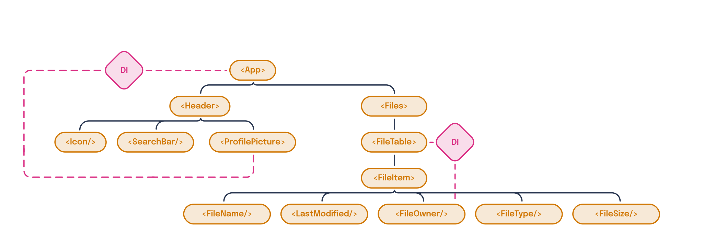
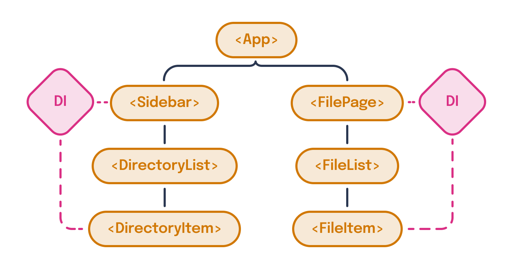

---
{
  title: "Dependency Injection",
  description: "Passing around props suck. They're repetitive, get out of sync, and are easy to forget to pass. What if there was a better way to pass data between different parts of your app?",
  published: "2024-03-11T12:11:00.000Z",
  authors: ["crutchcorn"],
  tags: ["react", "angular", "vue", "webdev"],
  attached: [],
  order: 11,
  collection: "framework-field-guide-fundamentals",
  version: "v2",
}
---

One of the core tenets of components we've used repeatedly in the book is the idea of component inputs or properties.

While component inputs are undoubtedly helpful, they can be challenging to use at scale when you need the same set of data across multiple layers of components.

For example, let's look back at the files app we've been developing throughout the book.


Here, we have a list of files and the user's profile picture in the corner of the screen. Here's an example of what our data for the page looks like:

```javascript
const APP_DATA = {
	currentUser: {
		name: "Corbin Crutchley",
		profilePictureURL: "https://avatars.githubusercontent.com/u/9100169",
	},
	collection: [
		{
			name: "Movies",
			type: "folder",
			ownerName: null,
			size: 386547056640,
		},
		{
			name: "Concepts",
			type: "folder",
			ownerName: "Kevin Aguillar",
			size: 0,
		},
	],
};
```

> This data has been shortened to keep focus on the topic at hand.

With this data, we can render out most of the UI within our mockup above.

Let's use this data to build out some of the foundations of our application. For example, say that every time we see an `ownerName` of `null`, we'll replace it with the `currentUser`'s `name` field.

To do this, we'll need to pass both our `collection` and `currentUser` down to every child component.

Let's use some pseudocode and mock out what those components might look like with data passing from the parent to the child:

```jsx
// This is not real code, but demonstrates how we might structure our data passing
// Don't worry about syntax, but do focus on how data is being passed between components
const App = {
	data: APP_DATA,
	template: (
		<div>
			<Header currentUser="data.currentUser" />
			<Files files="data.collection" currentUser="data.currentUser" />
		</div>
	),
};

const Header = {
	props: ["currentUser"],
	template: (
		<div>
			<Icon />
			<SearchBar />
			<ProfilePicture currentUser="props.currentUser" />
		</div>
	),
};

const ProfilePicture = {
	props: ["currentUser"],
	template: ,
};

const Files = {
	props: ["currentUser", "files"],
	template: (
		<FileTable>
			{props.files.map((file) => (
				<FileItem file="file" currentUser="props.currentUser" />
			))}
		</FileTable>
	),
};

const FileItem = {
	props: ["currentUser", "file"],
	template: (
		<tr>
			<FileName file="props.file" />
			<LastModified file="props.file" />
			<FileOwner file="props.file" currentUser="props.currentUser" />
			<FileType file="props.file" />
			<FileSize file="props.file" />
		</tr>
	),
};

const FileOwner = {
	props: ["currentUser", "file"],
	data: {
		userNameToShow: props.file.ownerName || props.currentUser.name,
	},
	template: <td>{{ userNameToShow }}</td>,
};

render(App);
```

While this isn't real code, we can make a discovery by looking at our code laid out like this: We're passing `currentUser` to almost every single component!

If we chart out what the flow of data looks like, our `currentUser` property is being passed like so:


While it's obnoxious to pass `currentUser` in every component, we need that data in all of these components, so we can't simply remove the inputs, can we?

Well, we can! Sort of...

While we _can't_ outright remove the ability to pass the data from the parent to the children, what we **can** do is pass these components _implicitly_ instead of _explicitly_. This means that instead of telling the child component what data it should accept, we simply hand off data regardless of whether it's needed or not. From there, it's the child component's job to raise its hand and ask for data.

Think of this like a buffet of food. Instead of serving food directly to the customer's table, the customer comes to the table with all the food, takes what they want, and is satisfied with the results all the same.


We do this method of implicit data passing using a methodology called "**dependency injection**".

# Providing Basic Values with Dependency Injection {#basic-values}

When we talk about dependency injection, we're referring to a method of providing data from a parent component down to a child component through implicit means.

Using dependency injection, we can change our method of providing data to implicitly pass data to the entire application. Doing so allows us to redesign the app and simplify how data is fetched to reflect something like this:


Here, `FileOwner` and `ProfilePicture` are grabbing data from the `App` provided value rather than having to go through every individual component.

React, Angular, and Vue all have methods for injecting data implicitly into child components using dependency injection. Let's start with the most basic method of dependency injection by providing some primitive values, like a number or string, down to a child component.

<!-- ::start:tabs -->

## React

In the React world, all dependency injections are powered by a `createContext` method, which you then `Provide` to your child components. You consume the provided data from those child components with a `useContext` hook.

```jsx
import { createContext, useContext } from "react";

// We start by creating a context name
const HelloMessageContext = createContext();

function Parent() {
	return (
		// Then create a provider for this context
		<HelloMessageContext.Provider value={"Hello, world!"}>
			<Child />
		</HelloMessageContext.Provider>
	);
}

function Child() {
	// Later, we use `useContext` to consume the value from dependency injection
	const helloMessage = useContext(HelloMessageContext);
	return <p>{helloMessage}</p>;
}
```

<!-- ::start:no-ebook -->
<iframe data-frame-title="React DI Basic Values String - StackBlitz" src="pfp-code:./ffg-fundamentals-react-di-basic-values-string-82?template=node&embed=1&file=src%2Fmain.jsx"></iframe>
<!-- ::end:no-ebook -->

## Angular

While React and Vue both have minimal APIs to handle dependency injection, Angular's dependency injection API is simultaneously more complex and powerful.

In Angular, it all starts with an `InjectionToken` of some kind. We'll start by importing Angular `InjectionToken` API and creating a new token we can use later.

```angular-ts
import { InjectionToken } from "@angular/core";

const WELCOME_MESSAGE_TOKEN = new InjectionToken<string>("WELCOME_MESSAGE");
```

We'll then use this token to create a `provider` that we pass to a component's `providers` list:

```angular-ts
@Component({
	selector: "app-root",
	changeDetection: ChangeDetectionStrategy.OnPush,
	imports: [ChildComponent],
	template: `<child-comp />`,
	providers: [{ provide: WELCOME_MESSAGE_TOKEN, useValue: "Hello, world!" }],
})
class AppComponent {}
```

This API uses `useValue` to provide the value associated with the token we pass.

Finally, we use an `inject` function in our component class to tell Angular, "We want this value in our component."

```angular-ts
import { inject } from "@angular/core";

@Component({
	selector: "child-comp",
	changeDetection: ChangeDetectionStrategy.OnPush,
	template: `<p>{{ welcomeMsg }}</p>`,
})
class ChildComponent {
	welcomeMsg: string = inject(WELCOME_MESSAGE_TOKEN);

	constructor() {
		console.log(this.welcomeMsg);
	}
}
```

<!-- ::start:no-ebook -->
<iframe data-frame-title="Angular DI Basic Values String - StackBlitz" src="pfp-code:./ffg-fundamentals-angular-di-basic-values-string-82?template=node&embed=1&file=src%2Fmain.ts"></iframe>
<!-- ::end:no-ebook -->

## Vue

Vue's dependency injection API only has two parts to it:

1. A `provide` method is used to provide values from the parent component.
2. An `inject` method is used to get the provided values in the child component.

```vue
<!-- Parent.vue -->
<script setup>
import { provide } from "vue";
import Child from "./Child.vue";

provide("WELCOME_MESSAGE", "Hello, world!");
</script>

<template>
	<Child />
</template>
```

```vue
<!-- Child.vue -->
<script setup>
import { inject } from "vue";

const welcomeMsg = inject("WELCOME_MESSAGE");
</script>

<template>
	<p>{{ welcomeMsg }}</p>
</template>
```

<!-- ::start:no-ebook -->
<iframe data-frame-title="Vue DI Basic Values String - StackBlitz" src="pfp-code:./ffg-fundamentals-vue-di-basic-values-string-82?template=node&embed=1&file=src%2FParent.vue"></iframe>
<!-- ::end:no-ebook -->

<!-- ::end:tabs -->

Here, we expect this component to show a `<p>` tag that renders out `"Hello, world!"`.

While this is convenient for passing simple values to multiple parts of the app, most usages of dependency injection tend to have more complex data provided. Let's extend this logic to provide an object to children instead.

<!-- ::start:tabs -->

## React

As we mentioned before, all of React's dependency injection logic uses `createContext`, `Provider`, and `useContext`. As such, to provide an object is a minimal change from before, done by changing the `value` we pass to our provider:

```jsx
const HelloMessageContext = createContext();

const Child = () => {
	const helloMessage = useContext(HelloMessageContext);
	return <p>{helloMessage.message}</p>;
};

const Parent = () => {
	const helloMessageObject = { message: "Hello, world!" };

	return (
		<HelloMessageContext.Provider value={helloMessageObject}>
			<Child />
		</HelloMessageContext.Provider>
	);
};
```

<!-- ::start:no-ebook -->
<iframe data-frame-title="React DI Basic Values Object - StackBlitz" src="pfp-code:./ffg-fundamentals-react-di-basic-values-object-83?template=node&embed=1&file=src%2Fmain.jsx"></iframe>
<!-- ::end:no-ebook -->

## Angular

Because Angular's `useValue` accepts any arbitrary value, we can pass it an object to move away from a string injection:

```angular-ts {4,16}
@Component({
	selector: "child-comp",
	changeDetection: ChangeDetectionStrategy.OnPush,
	template: `<p>{{ welcomeMsg.message }}</p>`,
})
class ChildComponent {
	welcomeMsg = inject(WELCOME_MESSAGE_TOKEN);
}

@Component({
	selector: "app-root",
	changeDetection: ChangeDetectionStrategy.OnPush,
	imports: [ChildComponent],
	template: `<child-comp />`,
	providers: [
		{ provide: WELCOME_MESSAGE_TOKEN, useValue: { message: "Hello, world!" } },
	],
})
class AppComponent {}
```

<!-- ::start:no-ebook -->
<iframe data-frame-title="Angular DI Basic Values Object - StackBlitz" src="pfp-code:./ffg-fundamentals-angular-di-basic-values-object-83?template=node&embed=1&file=src%2Fmain.ts"></iframe>
<!-- ::end:no-ebook -->

While this functions, it's not very clean. In particular, some headaches present with this method include:

- Duplicative TypeScript typings between `inject` usage and `useValue` providing
  - Mismatches can cause `undefined` bugs intentionally

Luckily for us, Angular provides a better solution for this problem than `useValue` and `InjectionToken`.

Instead, let's create a class that we mark with an `@Injectable` decorator:

```angular-ts
import { Injectable } from "@angular/core";

@Injectable()
class InjectedValue {
	message = "Hello, world";
}
```

Here, we're telling Angular to treat our `InjectedValue` class as a `InjectionToken` that we can use by name in our `providers`.

```angular-ts
@Component({
	selector: "app-root",
	changeDetection: ChangeDetectionStrategy.OnPush,
	imports: [ChildComponent],
	providers: [InjectedValue],
	template: `<child-comp />`,
})
class AppComponent {}
```

Now that our `InjectedValue` is a known type, we can remove our explicit type declaration to our consuming `inject` function in `ChildComponent`

```angular-ts
@Component({
	selector: "child-comp",
	changeDetection: ChangeDetectionStrategy.OnPush,
	template: `<div>{{ injectedValue.message }}</div>`,
})
class ChildComponent {
	injectedValue = inject(InjectedValue);

	constructor() {
		console.log(this.injectedValue);
	}
}
```

Much cleaner!

<!-- ::start:no-ebook -->
<iframe data-frame-title="Angular DI Injectable - StackBlitz" src="pfp-code:./ffg-fundamentals-angular-di-injectable-83?template=node&embed=1&file=src%2Fmain.ts"></iframe>
<!-- ::end:no-ebook -->

## Vue

Like React, Vue's simple dependency injection API means that we only need to change our `provide` value to an object, and we're off to the races!

```vue
<!-- Parent.vue -->
<script setup>
import { provide } from "vue";
import Child from "./Child.vue";

const welcomeObj = { message: "Hello, world!" };
provide("WELCOME_MESSAGE", welcomeObj);
</script>

<template>
	<Child />
</template>
```

```vue
<!-- Child.vue -->
<script setup>
import { inject } from "vue";

const welcomeMsgObj = inject("WELCOME_MESSAGE");
</script>

<template>
	<p>{{ welcomeMsgObj.message }}</p>
</template>
```

<!-- ::start:no-ebook -->
<iframe data-frame-title="Vue DI Basic Values Object - StackBlitz" src="pfp-code:./ffg-fundamentals-vue-di-basic-values-object-83?template=node&embed=1&file=src%2FParent.vue"></iframe>
<!-- ::end:no-ebook -->

<!-- ::end:tabs -->

# Changing Values after Injection {#change-values}

While providing values from a parent node down to a child component is useful on its own, it's made even more potent by the inclusion of data manipulation.

For example, what happens when your user wants to change their name with some kind of rename functionality? You should be able to change how the data is stored in your dependency injection to propagate those changes immediately throughout your whole application.

<!-- ::start:tabs -->

## React

Because our `Provider` can pass down values of any kind, we can combine this with `useState` to allow React to update the values for children.

```jsx
const HelloMessageContext = createContext();

const Child = () => {
	const helloMessage = useContext(HelloMessageContext);
	return <p>{helloMessage}</p>;
};

const Parent = () => {
	const [message, setMessage] = useState("Initial value");
	return (
		<HelloMessageContext.Provider value={message}>
			<Child />
			<button onClick={() => setMessage("Updated value")}>
				Update the message
			</button>
		</HelloMessageContext.Provider>
	);
};
```

<!-- ::start:no-ebook -->
<iframe data-frame-title="React Change After Val Inject - StackBlitz" src="pfp-code:./ffg-fundamentals-react-change-val-after-inject-84?template=node&embed=1&file=src%2Fmain.jsx"></iframe>
<!-- ::end:no-ebook -->

When we update the `message` value, it will trigger a re-render on the `Child` component and, in turn, update the displayed message.

## Angular

Because we've marked our `InjectedValue` class as an `Injectable`, we can have the parent component request access in the `constructor` to mutate the class instance.

```angular-ts
@Injectable()
class InjectedValue {
	message = signal("Initial value");
}

@Component({
	selector: "child-comp",
	changeDetection: ChangeDetectionStrategy.OnPush,
	template: `<p>{{ injectedValue.message() }}</p>`,
})
class ChildComponent {
	injectedValue = inject(InjectedValue);
}

@Component({
	selector: "app-root",
	changeDetection: ChangeDetectionStrategy.OnPush,
	imports: [ChildComponent],
	providers: [InjectedValue],
	template: `
		<child-comp />
		<button (click)="updateMessage()">Update the message</button>
	`,
})
class AppComponent {
	// We can access the `injectedValue` from the same component we provide it from
	injectedValue = inject(InjectedValue);

	updateMessage() {
		this.injectedValue.message.set("Updated value");
	}
}
```

<!-- ::start:no-ebook -->
<iframe data-frame-title="Angular Change Val After Inject - StackBlitz" src="pfp-code:./ffg-fundamentals-angular-change-val-after-inject-84?template=node&embed=1&file=src%2Fmain.ts"></iframe>
<!-- ::end:no-ebook -->

## Vue

Vue's minimal API surface allows us to compose `ref` and `provide` usage to provide values that we can change after injection.

```vue
<!-- Parent.vue -->
<script setup>
import { provide, ref } from "vue";
import Child from "./Child.vue";

const welcomeMessage = ref("Initial value");
provide("WELCOME_MESSAGE", welcomeMessage);

function updateMessage() {
	welcomeMessage.value = "Updated value";
}
</script>

<template>
	<Child />
	<button @click="updateMessage()">Update the message</button>
</template>
```

```vue
<!-- Child.vue -->
<script setup>
import { inject } from "vue";

// Worth mentioning, `welcomeMessage` is now _not_ a string, but rather a `ref`
// If you needed to use `welcomeMessage` inside of `<script setup>`, you'd
// need to use `.value`
const welcomeMessage = inject("WELCOME_MESSAGE");
</script>

<template>
	<p>{{ welcomeMessage }}</p>
</template>
```

<!-- ::start:no-ebook -->
<iframe data-frame-title="Vue Change Val After Inject - StackBlitz" src="pfp-code:./ffg-fundamentals-vue-change-val-after-inject-84?template=node&embed=1&file=src%2FParent.vue"></iframe>
<!-- ::end:no-ebook -->

<!-- ::end:tabs -->

## Changing Injected Values from Child {#change-injected-values}

The previous section showed how to change the injected value from the component's root. But what if we wanted to change the injected value from the child component instead of from the root?

Because dependency injection _usually_ only goes in one direction (from the parent to the child), it's not immediately clear how we can do this.

Despite this, each framework provides us the tools to update injected values from the children themselves. Let's see how that's done:

<!-- ::start:tabs -->

### React

Previously, we used the ability to use `useState` in our `Provider` to handle data changes from the parent provider. Continuing on this pattern, we'll utilize `useState` once again to handle changes in a child component.

This works because React's `useContext` enables us to pass data of _any_ kind, functions included. This means that we can pass both the getter and setter functions of `useState`, like so:

```jsx
const HelloMessageContext = createContext();

function Parent() {
	const [message, setMessage] = useState("Initial value");
	// We can pass both the setter and getter
	const providedValue = { message, setMessage };
	return (
		<HelloMessageContext.Provider value={providedValue}>
			<Child />
		</HelloMessageContext.Provider>
	);
}

function Child() {
	// And later, access them both as if they were local to the component
	const { message, setMessage } = useContext(HelloMessageContext);
	return (
		<>
			<p>{message}</p>
			<button onClick={() => setMessage("Updated value")}>
				Update the message
			</button>
		</>
	);
}
```

<!-- ::start:no-ebook -->
<iframe data-frame-title="React Change Val From Child - StackBlitz" src="pfp-code:./ffg-fundamentals-react-change-val-from-child-85?template=node&embed=1&file=src%2Fmain.jsx"></iframe>
<!-- ::end:no-ebook -->

#### Using a Reducer Pattern {#reducer-pattern}

Despite `useState` and `useContext` making a powerful combination for data passing and updating in dependency injection, it's far from a perfect solution when dealing with large data sets.

For example, what happens if we want to implement a counter that includes an `increment` and `decrement` function?

We could pass each individual function through the `Provider`:

```jsx
function App() {
	const [count, setCount] = useState(0);

	const increment = () => {
		setCount(count + 1);
	};

	const decrement = () => {
		setCount(count - 1);
	};

	const set = (val) => {
		setCount(val);
	};

	const providedValue = { count, increment, decrement, set };
	return (
		<CounterContext.Provider value={providedValue}>
			<Child />
		</CounterContext.Provider>
	);
}
```

<!-- ::start:no-ebook -->
<iframe data-frame-title="React Homegrown Reducer - StackBlitz" src="pfp-code:./ffg-fundamentals-react-homegrown-reducer-85?template=node&embed=1&file=src%2Fmain.jsx"></iframe>
<!-- ::end:no-ebook -->

But doing so creates a substantial amount of noise: each function has a dedicated variable and needs to be passed independently for the `useContext` to work as intended.

---

This is where `useReducer` might come into play. Let's take a step back for a moment and remove the `useContext` method.

A "reducer" pattern involves a list of actions that the user can take. These actions are provided the current `state` value, which will be updated based on the returned value from the reducer.

Let's take a look at the most basic version of a `reducer` that can only count up from `0`:

```jsx
import { useReducer } from "react";

const initialState = { count: 0 };

function reducer(state, action) {
	return { count: state.count + 1 };
}

function App() {
	const [state, dispatch] = useReducer(reducer, initialState);
	return (
		<>
			<p>{state.count}</p>
			<button onClick={() => dispatch()}>Add one</button>
		</>
	);
}
```

<!-- ::start:no-ebook -->
<iframe data-frame-title="React Basic useReducer - StackBlitz" src="pfp-code:./ffg-fundamentals-react-basic-use-reducer-85?template=node&embed=1&file=src%2Fmain.jsx"></iframe>
<!-- ::end:no-ebook -->

Whenever `dispatch` is called, it will run the `reducer` with no arguments for `action`, and React will automatically pass `state` for us. Then, when we `return` inside of the reducer, React will automatically keep track of the returned value as the new `state` value.

However, this isn't particularly useful and seems like more boilerplate than needed for what's effectively a simple `useState`. To make `useReducer` more worthwhile, we need to add more actions.

For example, we'll have an `increment` and `decrement` action that will add one and remove one from the `state`, respectively.

```jsx
const initialState = { count: 0 };

function reducer(state, action) {
	switch (action.type) {
		case "increment":
			return { count: state.count + 1 };
		case "decrement":
			return { count: state.count - 1 };
		default:
			return state;
	}
}

function App() {
	const [state, dispatch] = useReducer(reducer, initialState);
	return (
		<>
			<p>{state.count}</p>
			<button onClick={() => dispatch({ type: "increment" })}>Add one</button>
			<button onClick={() => dispatch({ type: "decrement" })}>
				Remove one
			</button>
		</>
	);
}
```

<!-- ::start:no-ebook -->
<iframe data-frame-title="React useReducer Multi Action - StackBlitz" src="pfp-code:./ffg-fundamentals-react-use-reducer-multi-action-85?template=node&embed=1&file=src%2Fmain.jsx"></iframe>
<!-- ::end:no-ebook -->

Here, we can pass a `type` object as a parameter of `reducer`'s `action`, run a `switch`/`case` over it, and return relevant data changes as needed.

But that's not all we can do with a reducer! We can also pass in what's often called a `payload` to set raw data to our `state` as well:

```jsx
const initialState = { count: 0 };

function reducer(state, action) {
	switch (action.type) {
		case "increment":
			return { count: state.count + 1 };
		case "decrement":
			return { count: state.count - 1 };
		case "set":
			return { count: action.payload };
		default:
			return state;
	}
}

function App() {
	const [state, dispatch] = useReducer(reducer, initialState);
	return (
		<>
			<p>{state.count}</p>
			<button onClick={() => dispatch({ type: "increment" })}>Add one</button>
			<button onClick={() => dispatch({ type: "decrement" })}>
				Remove one
			</button>
			<button onClick={() => dispatch({ type: "set", payload: 0 })}>
				Set to zero
			</button>
		</>
	);
}
```

<!-- ::start:no-ebook -->
<iframe data-frame-title="React useReducer Payload - StackBlitz" src="pfp-code:./ffg-fundamentals-react-use-reducer-payload-85?template=node&embed=1&file=src%2Fmain.jsx"></iframe>
<!-- ::end:no-ebook -->

> It's worth mentioning that [the reducer pattern is not unique to React](https://dev.to/reedbarger/what-is-a-reducer-in-javascript-a-complete-introduction-with-examples-ip1). That said, React is unique in that it has a built-in method to build reducers, unlike many other frameworks.

#### Reducer Patterns within Contexts {#reducer-patterns-within-contexts}

Just like we were able to pass the `setValue` function from `useState`, we can pass both `state` and `dispatch` using our `context`'s `Provide` and utilize `useContext` to inject those values into our child components.

```jsx
const CounterContext = createContext();

const initialState = { count: 0 };

function reducer(state, action) {
	switch (action.type) {
		case "increment":
			return { count: state.count + 1 };
		case "decrement":
			return { count: state.count - 1 };
		case "set":
			return { count: action.payload };
		default:
			return state;
	}
}

function Parent() {
	const [state, dispatch] = useReducer(reducer, initialState);
	const providedValue = { state, dispatch };
	return (
		<CounterContext.Provider value={providedValue}>
			<Child />
		</CounterContext.Provider>
	);
}

function Child() {
	const { state, dispatch } = useContext(CounterContext);
	return (
		<>
			<p>{state.count}</p>
			<button onClick={() => dispatch({ type: "increment" })}>Add one</button>
			<button onClick={() => dispatch({ type: "decrement" })}>
				Remove one
			</button>
			<button onClick={() => dispatch({ type: "set", payload: 0 })}>
				Set to zero
			</button>
		</>
	);
}
```

<!-- ::start:no-ebook -->
<iframe data-frame-title="React Reducer Within Contexts - StackBlitz" src="pfp-code:./ffg-fundamentals-react-reducer-within-contexts-85?template=node&embed=1&file=src%2Fmain.jsx"></iframe>
<!-- ::end:no-ebook -->

### Angular

Because we can inject a whole class instance into a child component, we can use methods in said class to mutate data of the injected class instance.

```angular-ts
@Injectable()
class InjectedValue {
	message = signal("Hello, world");
	// `this` is referring to the `InjectedValue` instance
	changeMessage(val: string) {
		this.message.set(val);
	}
}

@Component({
	selector: "child-comp",
	changeDetection: ChangeDetectionStrategy.OnPush,
	template: `
		<div>{{ injectedValue.message }}</div>
		<button (click)="changeMessage()">Change message</button>
	`,
})
class ChildComponent {
	injectedValue = inject(InjectedValue);

	changeMessage() {
		// This will update the value of the class, and
		// re-render the component to reflect the new value
		this.injectedValue.changeMessage("Updated value");
	}
}

@Component({
	selector: "app-root",
	changeDetection: ChangeDetectionStrategy.OnPush,
	imports: [ChildComponent],
	providers: [InjectedValue],
	template: `<child-comp />`,
})
class ParentComponent {}
```

<!-- ::start:no-ebook -->
<iframe data-frame-title="Angular Change Val From Child - StackBlitz" src="pfp-code:./ffg-fundamentals-angular-change-val-from-child-85?template=node&embed=1&file=src%2Fmain.ts"></iframe>
<!-- ::end:no-ebook -->

### Vue

In our previous example, we used `provide` to inject a `ref` into the child component. Because of Vue's reactivity system, we can use this `ref` to change the `.value` of the `ref` in the child to modify the value injected across the app.

```vue
<!-- Parent.vue -->
<script setup>
import { provide, ref } from "vue";
import Child from "./Child.vue";

const welcomeMessage = ref("Initial value");
provide("WELCOME_MESSAGE", welcomeMessage);
</script>

<template>
	<Child />
</template>
```

```vue
<!-- Child.vue -->
<script setup>
import { inject } from "vue";

const welcomeMessage = inject("WELCOME_MESSAGE");

function updateMessage() {
	welcomeMessage.value = "Updated value";
}
</script>

<template>
	<p>{{ welcomeMessage }}</p>
	<button @click="updateMessage()">Update the message</button>
</template>
```

<!-- ::start:no-ebook -->
<iframe data-frame-title="Vue Change Val from Child - StackBlitz" src="pfp-code:./ffg-fundamentals-vue-change-val-from-child-85?template=node&embed=1&file=src%2FParent.vue"></iframe>
<!-- ::end:no-ebook -->

<!-- ::end:tabs -->

# Optional Injected Values {#optional-injected-values}

Let's think back to the start of this chapter. The original goal of introducing dependency injection was to enable the sharing of user login information throughout multiple components.

While you might expect the user's login information to always be present, what if it wasn't? What if, when the user first creates their account, they opt out of inputting their name and profile picture? Even if this seems unlikely, a robust application should handle edge cases like this.

Luckily, React, Angular, and Vue can all withstand an empty value provided through dependency injection by marking the value as "optional."

<!-- ::start:tabs -->

## React

In React, handling optionally injected values doesn't require a new API. We can still use the `useContext` hook in the child component, even without a provider.

```jsx
const HelloMessageContext = createContext();

function Parent() {
	// Notice no provider was set
	return <Child />;
}

function Child() {
	// `messageData` is `undefined` if nothing is injected
	const messageData = useContext(HelloMessageContext);

	// If no value is passed, we can simply
	// not render anything in this component
	if (!messageData) return null;

	return <p>{messageData}</p>;
}
```

When this is done, `useContext` is `undefined` if no value is injected for a particular named context.

<!-- ::start:no-ebook -->
<iframe data-frame-title="React Optional Injected Vals - StackBlitz" src="pfp-code:./ffg-fundamentals-react-optional-injected-vals-86?template=node&embed=1&file=src%2Fmain.jsx"></iframe>
<!-- ::end:no-ebook -->

## Angular

In Angular, we provide values to be injected using the `providers` array on a component.

```angular-ts
@Injectable()
class InjectedValue {
	message = "Initial value";
}

@Component({
	selector: "child-comp",
	changeDetection: ChangeDetectionStrategy.OnPush,
	template: `<p>{{ injectedValue.message }}</p>`,
})
class ChildComponent {
	injectedValue = inject(InjectedValue);
}

@Component({
	selector: "app-root",
	changeDetection: ChangeDetectionStrategy.OnPush,
	imports: [ChildComponent],
	providers: [InjectedValue],
	template: `<child-comp />`,
})
class ParentComponent {}
```

However, if we remove the `providers` from `ParentComponent` to test our application without any user data, like so:

```angular-ts
@Component({
	selector: "app-root",
	changeDetection: ChangeDetectionStrategy.OnPush,
	imports: [ChildComponent],
	template: `<child-comp />`,
})
class ParentComponent {}
```

We get the following error:

> ```
> ERROR NullInjectorError: R3InjectorError(AppModule)[InjectedValue -> InjectedValue -> InjectedValue]:
>   NullInjectorError: No provider for InjectedValue!
> ```

<!-- ::start:no-ebook -->
<iframe data-frame-title="Angular Optional Injected Vals Err - StackBlitz" src="pfp-code:./ffg-fundamentals-angular-optional-injected-vals-err-86?template=node&embed=1&file=src%2Fmain.ts"></iframe>
<!-- ::end:no-ebook -->

This is because our `inject` function inside `ChildComponent` is marked as a required dependency by default, hence the error.

Fortunately, there's a way to tell Angular to mark that dependency as "optional" by passing a second argument to the `inject` function:

```angular-ts
@Injectable()
class InjectedValue {
	message = "Hello, world";
}

@Component({
	selector: "child-comp",
	changeDetection: ChangeDetectionStrategy.OnPush,
	template: `
		@if (injectedValue) {
			<div>{{ injectedValue.message }}</div>
		}
		@if (!injectedValue) {
			<div>There is no injected value</div>
		}
	`,
})
class ChildComponent {
	injectedValue = inject(InjectedValue, { optional: true });

	constructor() {
		// undefined
		console.log(this.injectedValue);
	}
}

@Component({
	selector: "app-root",
	changeDetection: ChangeDetectionStrategy.OnPush,
	imports: [ChildComponent],
	template: `<child-comp />`,
})
class ParentComponent {}
```

Now, we get no error when `injectedValue` is not provided. Instead, we get a value of `null`, which we can guard against using `@if` inside our template.

<!-- ::start:no-ebook -->
<iframe data-frame-title="Angular Optional Injected Vals - StackBlitz" src="pfp-code:./ffg-fundamentals-angular-optional-injected-vals-86?template=node&embed=1&file=src%2Fmain.ts"></iframe>
<!-- ::end:no-ebook -->

## Vue

Much like React's dependency injection system, when using Vue's `inject` without a parent `provide`, the `inject` defaults its value to `undefined`.

```vue
<!-- Parent.vue -->
<script setup>
import Child from "./Child.vue";
</script>

<template>
	<Child />
</template>
```

```vue
<!-- Child.vue -->
<script setup>
import { inject } from "vue";

const welcomeMessage = inject("WELCOME_MESSAGE");

// undefined
console.log(welcomeMessage);
</script>

<template>
	<p v-if="welcomeMessage">{{ welcomeMessage }}</p>
	<p v-if="!welcomeMessage">There is no welcome message</p>
</template>
```

<!-- ::start:no-ebook -->
<iframe data-frame-title="Vue Optional Injected Vals - StackBlitz" src="pfp-code:./ffg-fundamentals-vue-optional-injected-vals-86?template=node&embed=1&file=src%2FParent.vue"></iframe>
<!-- ::end:no-ebook -->

> You may see a warning like this in your `console` if you do this:
>
> `[Vue warn]: injection "WELCOME_MESSAGE" not found. `
>
> This is normal and expected — keep calm and code on.

<!-- ::end:tabs -->

## Default Values for Optional Values {#default-values}

While it's good that our code is now more resilient against missing data, it's not a great user experience to simply have parts of the app missing when said data isn't present.

Instead, let's decide that when the user doesn't have a provided name, let's provide a default value of "Unknown Name" throughout our app. To do this, we'll need to provide that default value in our dependency injection system.

<!-- ::start:tabs -->

### React

Because of React's minimalistic dependency injection API, providing a default value to an optionally injected value can be done using [JavaScript's built-in "OR" operator (`||`)](https://developer.mozilla.org/en-US/docs/Web/JavaScript/Reference/Operators/Logical_OR).

```jsx
function Child() {
	const injectedMessageData = useContext(HelloMessageContext);

	const messageData = injectedMessageData || "Hello, world!";

	return <p>{messageData}</p>;
}
```

<!-- ::start:no-ebook -->
<iframe data-frame-title="React Default Vals for Optional - StackBlitz" src="pfp-code:./ffg-fundamentals-react-default-vals-for-optional-87?template=node&embed=1&file=src%2Fmain.jsx"></iframe>
<!-- ::end:no-ebook -->

### Angular

<!-- Editor's note: Marking an item as `optional` has a default value of `null`, not `undefined`: https://github.com/angular/angular/issues/25395 -->

When an `inject` function is marked as `{optional: true}`, the default value (when nothing is provided) is `null`.

As such, we can use [JavaScript's built-in "OR" operator (`||`)](https://developer.mozilla.org/en-US/docs/Web/JavaScript/Reference/Operators/Logical_OR) to default to a different value as our default:

```angular-ts
@Component({
	selector: "child-comp",
	changeDetection: ChangeDetectionStrategy.OnPush,
	template: `<p>{{ injectedValue.message }}</p>`,
})
class ChildComponent {
	injectedValue = inject(InjectedValue, { optional: true }) || { message: "Default Value" };
}
```

<!-- ::start:no-ebook -->
<iframe data-frame-title="Angular Default Vals for Optional - StackBlitz" src="pfp-code:./ffg-fundamentals-angular-default-vals-for-optional-87?template=node&embed=1&file=src%2Fmain.ts"></iframe>
<!-- ::end:no-ebook -->

### Vue

Vue is the only framework of the three that supports a built-in way to provide a default value for dependency-injected values. To do this, pass a second argument to the `inject` method, and it will be used as your default value.

```vue
<!-- Child.vue -->
<script setup>
import { inject } from "vue";

const welcomeMessage = inject("WELCOME_MESSAGE", "Default value");

// "Default value"
console.log(welcomeMessage);
</script>

<template>
	<p>{{ welcomeMessage }}</p>
</template>
```

<!-- ::start:no-ebook -->
<iframe data-frame-title="Vue Default Vals for Optional - StackBlitz" src="pfp-code:./ffg-fundamentals-vue-default-vals-for-optional-87?template=node&embed=1&file=src%2FParent.vue"></iframe>
<!-- ::end:no-ebook -->

<!-- ::end:tabs -->

# Application Wide Providers {#app-wide-providers}

In our example codebase, we structured an application where `userData` is used all over the app. Instead of having an injected value for this data, it would be ideal to have access to this information anywhere in the component tree.

<!-- ::start:tabs -->

## React

We can reuse our `Provider` knowledge and use a `Provider` at the top-level `App` component to provide values at the root of a React application.

```jsx
function App() {
	const [message, setMessage] = useState("Initial value");
	const providedValue = { message, setMessage };
	return (
		<HelloMessageContext.Provider value={providedValue}>
			<Child />
		</HelloMessageContext.Provider>
	);
}
```

### Consolidate Providers and Your Logic {#consolidate-providers}

When working with providers that needs state of some kind, you may want to keep your `useState` and `<Context.Provider>` code in the same place.

To centralize these APIs, we can use the concept of componentization. Start by moving your provider and logic into a new component, then allow the user to pass child components to the new `HelloMessageProvider` component:

```jsx
// This can be named anything! It's a component like any other
const HelloMessageProvider = ({ children }) => {
	const [message, setMessage] = useState("Initial value");
	const providedValue = { message, setMessage };
	return (
		<HelloMessageContext.Provider value={providedValue}>
			{children}
		</HelloMessageContext.Provider>
	);
};

function App() {
	return (
		<HelloMessageProvider>
			<Child />
		</HelloMessageProvider>
	);
}
```

These children of `HelloMessageProvider` are then passed the `HelloMessageContext` through React's dependency injection system.

### Provider Christmas Trees Are Okay! {#provider-christmas-trees}

When you have a large enough application, you may end up having an `App` component that looks like this:

```jsx
const App = () => {
	const { isDarkMode, paperTheme, updateLocalDarkMode, localDarkMode } =
		useLocalDarkMode();

	return (
		<NavigationContainer theme={isDarkMode ? darkNavTheme : lightNavTheme}>
			<PaperProvider theme={paperTheme}>
				<StatusBar
					barStyle={isDarkMode ? "light-content" : "dark-content"}
					backgroundColor={"transparent"}
				/>
				<SetDarkModeContext.Provider
					value={{
						setDarkMode: updateLocalDarkMode,
						localDarkMode,
					}}
				>
					<ColorSchemeProvider mode={isDarkMode ? "dark" : "light"}>
						<ErrorBoundary FallbackComponent={CustomFallback}>
							<Provider store={store}>
								<AppContents />
							</Provider>
						</ErrorBoundary>
					</ColorSchemeProvider>
				</SetDarkModeContext.Provider>
			</PaperProvider>
		</NavigationContainer>
	);
};
```

> [This is actual source code pulled from one of my prior production React Native projects called GitShark](https://github.com/oceanbit/GitShark/blob/main/src/App.tsx#L156-L176).

This code is colloquially called the "Provider Christmas Tree" because of its formatted structure.

Despite looking ugly, this code is okay! If you _really_ want to break things up, take one step further in componentizing your codebase and move similar providers into their own `StyleProvider` component to help flatten this code:

```jsx
const StyleProvider = ({ children }) => {
	return (
		<PaperProvider theme={paperTheme}>
			<StatusBar
				barStyle={isDarkMode ? "light-content" : "dark-content"}
				backgroundColor={"transparent"}
			/>
			<SetDarkModeContext.Provider
				value={{
					setDarkMode: updateLocalDarkMode,
					localDarkMode,
				}}
			>
				<ColorSchemeProvider mode={isDarkMode ? "dark" : "light"}>
					{children}
				</ColorSchemeProvider>
			</SetDarkModeContext.Provider>
		</PaperProvider>
	);
};

const App = () => {
	const { isDarkMode, paperTheme, updateLocalDarkMode, localDarkMode } =
		useLocalDarkMode();

	return (
		<NavigationContainer theme={isDarkMode ? darkNavTheme : lightNavTheme}>
			<ErrorBoundary FallbackComponent={CustomFallback}>
				<Provider store={store}>
					<StyleProvider>
						<AppContents />
					</StyleProvider>
				</Provider>
			</ErrorBoundary>
		</NavigationContainer>
	);
};
```

> Remember, the order of these providers can matter and can cause bugs if out-of-order!

## Angular

While other frameworks require you to explicitly provide your dependency-injected values at the root of your application, Angular does not.

Remember when we used `@Injectable` to mark a class as an injectable class instance? Well, this decorator has a trick up its sleeve: [the `providedIn` property](https://angular.dev/guide/ngmodules/providers#providing-a-service).

When you pass `{providedIn: 'root'}` to the `@Injectable` decorator, you no longer have to explicitly place the class inside a `providers` array; instead, Angular will simply provide this class to the root of your application.

```angular-ts
@Injectable({ providedIn: "root" })
class InjectedValue {
	message = "Hello, world";
}

@Component({
	selector: "child-comp",
	changeDetection: ChangeDetectionStrategy.OnPush,
	template: `<div>{{ injectedValue.message }}</div>`,
})
class ChildComponent {
	injectedValue = inject(InjectedValue);

	constructor() {
		// This will include the `message` property, alongside
		// any other methods and properties on the class instance
		console.log(this.injectedValue);
	}
}

@Component({
	selector: "app-root",
	changeDetection: ChangeDetectionStrategy.OnPush,
	imports: [ChildComponent],
	template: `<child-comp />`,
})
class ParentComponent {}
```

<!-- ::start:no-ebook -->
<iframe data-frame-title="Angular App Wide Providers - StackBlitz" src="pfp-code:./ffg-fundamentals-angular-app-wide-providers-88?template=node&embed=1&file=src%2Fmain.ts"></iframe>
<!-- ::end:no-ebook -->

In Angular, these globally provided values are called "Services." They're often used to break up and move application logic out of components to be more widely reused.

## Vue

Providing a value at your application's root in Vue is similar to providing a value anywhere else in your codebase. Add a `provide` method call inside your root `App` component; your data is now provided globally.

```vue
<!-- App.vue -->
<script setup>
import { provide, ref } from "vue";
import Child from "./Child.vue";

const welcomeMessage = ref("Hello, world!");
provide("WELCOME_MESSAGE", welcomeMessage);
</script>

<template>
	<Child />
</template>
```

<!-- ::end:tabs -->

These globally provided values are also called "singletons." When using a singleton, it's important to remember that data is shared between every component. If we have three components that all use one provided value and mutate said value, it will update all the consuming components.

## Application Wide Providers _Can_ Cause Performance Problems {#app-wide-providers-performance}

Generally, keeping your data providers as close to the intended component as possible is suggested. For example, if you have the following component structure:

```html
<App>
	<PageLayout>
		<HomePage>
			<Files>
				<FileTable>
					<FileItem>
						<FileOwner />
						<FileType />
					</FileItem>
				</FileTable>
			</Files>
		</HomePage>
	</PageLayout>
</App>
```

You have two choices to `provide` the data:

1. At the root of your component structure (`App`)
2. At the closest source of location (`FileTable`)

Between these two options, you should _generally_ opt to use #2, which would place your data injection closer to the components that need said data.


While this isn't always possible, the justification for doing so is that any changes made to the injected values must propagate downwards and find the component that needs to be re-rendered.

While some frameworks like Vue handle this gracefully and only re-render the components that actually use the injected values, React and Angular differ.

<!-- ::in-content-ad title="Consider supporting" body="Donating any amount will help towards further development of the Framework Field Guide." button-text="Sponsor my work" button-href="https://github.com/sponsors/crutchcorn/" -->

Let's assume that we go with an application-wide provider. In React and Angular, **when we change the value of the provider, the framework must search through the entire component tree to find the components that need to be re-rendered**.

**React even re-renders all the child components of `App` when using `useContext`** to provide changing data.

This problem can be solved by external tooling, such as [React Redux](https://blog.isquaredsoftware.com/2021/01/context-redux-differences/) or [Angular Redux](https://angular-redux.js.org/), as they introduce a more optimized mechanism for detecting component data changes.

Luckily, your knowledge of these frameworks' built-in dependency injection APIs will help you immensely while using these external tools.

# Overwriting Dependency Injection Specificity {#overwriting-specificity}

Large apps get complicated fast. Consider the following example:

You have an app that provides user data at the application's root - the `App` component. However, you need to replace that user data at a lower-level component for the rest of the component tree.

For these instances, these larger apps can replace dependency injection values mid-tree, like so:



While rare, this ability is a compelling feature you can leverage in your applications.

A child component will have its dependency injection resolved from the closest parent. This means that if you have two providers, but one is closer, it will read from the closer parent.

This means that if we have the following structure:

```jsx
<App>
	<Child>
		<GrandChild>
			<GreatGrandChild />
		</GrandChild>
	</Child>
</App>
```

And both `App` and `GrandChild` inject values into the same named context, then `GreatGrandChild` will display information from `GrandChild` rather than `App`:

<!-- ::start:tabs -->

## React

```jsx
const NameContext = createContext("");

function App() {
	return (
		<NameContext.Provider value="Corbin">
			<Child />
		</NameContext.Provider>
	);
}

function Child() {
	const name = useContext(NameContext);
	return (
		<>
			<p>Name: {name}</p>
			<GrandChild />
		</>
	);
}

// Notice the new provider here, it will supplement the `App` injected value
// for all child components of `GrandChild`
function GrandChild() {
	return (
		<NameContext.Provider value="Kevin">
			<GreatGrandChild />
		</NameContext.Provider>
	);
}

function GreatGrandChild() {
	const name = useContext(NameContext);
	return <p>Name: {name}</p>;
}
```

<!-- ::start:no-ebook -->
<iframe data-frame-title="React Overwriting Specificity - StackBlitz" src="pfp-code:./ffg-fundamentals-react-overwriting-specificity-89?template=node&embed=1&file=src%2Fmain.jsx"></iframe>
<!-- ::end:no-ebook -->

## Angular

```angular-ts
@Injectable()
class NameValue {
	name = "";
}

@Component({
	selector: "great-grand-child",
	changeDetection: ChangeDetectionStrategy.OnPush,
	template: `<p>Name: {{ nameValue.name }}</p>`,
})
class GreatGrandChildComponent {
	nameValue = inject(NameValue);
}

@Component({
	selector: "grand-child",
	changeDetection: ChangeDetectionStrategy.OnPush,
	// Notice the new provider here, it will supplement the `App` injected value
	// for all child components of `grand-child`
	providers: [{ provide: NameValue, useValue: { name: "Kevin" } }],
	imports: [GreatGrandChildComponent],
	template: `<great-grand-child />`,
})
class GrandChildComponent {}

@Component({
	selector: "child-comp",
	changeDetection: ChangeDetectionStrategy.OnPush,
	imports: [GrandChildComponent],
	template: `
		<p>Name: {{ nameValue.name }}</p>
		<grand-child />
	`,
})
class ChildComponent {
	nameValue = inject(NameValue);
}

@Component({
	selector: "app-root",
	changeDetection: ChangeDetectionStrategy.OnPush,
	providers: [{ provide: NameValue, useValue: { name: "Corbin" } }],
	imports: [ChildComponent],
	template: `<child-comp />`,
})
class AppComponent {}
```

<!-- ::start:no-ebook -->
<iframe data-frame-title="Angular Overwriting Specificity - StackBlitz" src="pfp-code:./ffg-fundamentals-angular-overwriting-specificity-89?template=node&embed=1&file=src%2Fmain.ts"></iframe>
<!-- ::end:no-ebook -->

## Vue

```vue
<!-- App.vue -->
<script setup>
import { provide } from "vue";
import Child from "./Child.vue";

provide("NAME", "Corbin");
</script>

<template>
	<Child />
</template>
```

```vue
<!-- Child.vue -->
<script setup>
import { inject } from "vue";
import GrandChild from "./GrandChild.vue";

const name = inject("NAME");
</script>

<template>
	<p>Name: {{ name }}</p>
	<GrandChild />
</template>
```

```vue
<!-- GrandChild.vue -->
<script setup>
import { provide } from "vue";
import GreatGrandChild from "./GreatGrandChild.vue";

// Notice the new provider here, it will supplement the `App` injected value
// for all child components of `GrandChild`
provide("NAME", "Kevin");
</script>

<template>
	<GreatGrandChild />
</template>
```

```vue
<!-- GreatGrandChild.vue -->
<script setup>
import { inject } from "vue";

const name = inject("NAME");
</script>

<template>
	<p>Name: {{ name }}</p>
</template>
```

<!-- ::start:no-ebook -->
<iframe data-frame-title="Vue Overwriting Specificity - StackBlitz" src="pfp-code:./ffg-fundamentals-vue-overwriting-specificity-89?template=node&embed=1&file=src%2FApp.vue"></iframe>
<!-- ::end:no-ebook -->

<!-- ::end:tabs -->

Earlier, we discussed how dependency injection is like a buffet of data; components act like customers grabbing food from an all-you-can-eat data buffet.

Let's continue that analogy:

Assume you're at a buffet with three tables of food. These tables, in order of proximity to yourself, are:

- Chicken, closest to you
- Chicken, second closest to you
- Fish, farthest away


If you're hungry for chicken, you're not likely to walk farther to get the same food and will instead pick the closest table with chicken on it to get your food from.

This is similar to how a component will try to find the closest source of data for a requested data type in the component tree.

# Finding Specific Injected Values {#finding-specific-injected-values}

Just because we can have multiple providers throughout an application doesn't mean that there's no order to how your component grabs specifically requested data.

Let's take that same analogy from before with the three buffet tables. Now, assume that the person looking to get food is a pescatarian; they don't eat meat unless it's from a fish.

Despite chicken being closer to them, they'll go out of their way to find the table with fish on it.


Likewise, if you have a data provider hosting entirely unrelated data from what your child component is looking for, it might not pick up the correct data.

<!-- ::start:tabs -->

### React

```jsx
const NameContext = createContext("");
const FavFoodContext = createContext("");

function App() {
	return (
		<NameContext.Provider value="Corbin">
			<Child />
		</NameContext.Provider>
	);
}

function Child() {
	return <GrandChild />;
}

function GrandChild() {
	return (
		<FavFoodContext.Provider value={"Ice Cream"}>
			<GreatGrandChild />
		</FavFoodContext.Provider>
	);
}

function GreatGrandChild() {
	// Despite the `FavFoodContext` being closer, this is
	// specifically looking for the `NameContext` and will
	// go further up in the tree to find that data from `App`
	const name = useContext(NameContext);
	// Meanwhile, this will search for the context that pertains to its name
	const favFood = useContext(FavFoodContext);
	return (
		<>
			<p>Name: {name}</p>
			<p>Favorite food: {favFood}</p>
		</>
	);
}
```

<!-- ::start:no-ebook -->
<iframe data-frame-title="React Finding Specific Vals - StackBlitz" src="pfp-code:./ffg-fundamentals-react-finding-specific-vals-90?template=node&embed=1&file=src%2Fmain.jsx"></iframe>
<!-- ::end:no-ebook -->

### Angular

```angular-ts
@Injectable()
class NameValue {
	name = "";
}

@Injectable()
class FavFoodValue {
	favFood = "";
}

@Component({
	selector: "great-grand-child",
	changeDetection: ChangeDetectionStrategy.OnPush,
	template: `
		<p>Name: {{ nameValue.name }}</p>
		<p>Favorite food: {{ favFoodValue.favFood }}</p>
	`,
})
class GreatGrandChildComponent {
	// Despite the `FavFoodContext` being closer, this is
	// specifically looking for the `NameValue` and will
	// go further up in the tree to find that data from `app-root`
	nameValue = inject(NameValue);
	// Meanwhile, this will search for the context that pertains to its name
	favFoodValue = inject(FavFoodValue);
}

@Component({
	selector: "grand-child",
	changeDetection: ChangeDetectionStrategy.OnPush,
	providers: [{ provide: FavFoodValue, useValue: { age: "Ice Cream" } }],
	imports: [GreatGrandChildComponent],
	template: `<great-grand-child />`,
})
class GrandChildComponent {}

@Component({
	selector: "child-comp",
	changeDetection: ChangeDetectionStrategy.OnPush,
	imports: [GrandChildComponent],
	template: `<grand-child />`,
})
class ChildComponent {}

@Component({
	selector: "app-root",
	changeDetection: ChangeDetectionStrategy.OnPush,
	providers: [{ provide: NameValue, useValue: { name: "Corbin" } }],
	imports: [ChildComponent],
	template: `<child-comp />`,
})
class AppComponent {}
```

<!-- ::start:no-ebook -->
<iframe data-frame-title="Angular Finding Specific Vals - StackBlitz" src="pfp-code:./ffg-fundamentals-angular-finding-specific-vals-90?template=node&embed=1&file=src%2Fmain.ts"></iframe>
<!-- ::end:no-ebook -->

### Vue

```vue
<!-- App.vue -->
<script setup>
import { provide } from "vue";
import Child from "./Child.vue";

provide("NAME", "Corbin");
</script>

<template>
	<Child />
</template>
```

```vue
<!-- Child.vue -->
<script setup>
import GrandChild from "./GrandChild.vue";
</script>

<template>
	<GrandChild />
</template>
```

```vue
<!-- GrandChild.vue -->
<script setup>
import { provide } from "vue";
import GreatGrandChild from "./GreatGrandChild.vue";

provide("FAV_FOOD", "Ice Cream");
</script>

<template>
	<GreatGrandChild />
</template>
```

```vue
<!-- GreatGrandChild.vue -->
<script setup>
import { inject } from "vue";

// Despite the `AGE` being closer, this is
// specifically looking for the `NAME` and will
// go further up in the tree to find that data from `App`
const name = inject("NAME");
// Meanwhile, this will search for the context that pertains to its name
const favFood = inject("FAV_FOOD");
</script>

<template>
	<p>Name: {{ name }}</p>
	<p>Favorite food: {{ favFood }}</p>
</template>
```

<!-- ::start:no-ebook -->
<iframe data-frame-title="Vue Finding Specific Vals - StackBlitz" src="pfp-code:./ffg-fundamentals-vue-finding-specific-vals-90?template=node&embed=1&file=src%2FApp.vue"></iframe>
<!-- ::end:no-ebook -->

<!-- ::end:tabs -->

This specificity-seeking behavior of your dependency injection consumer is helpful to ensure your data retains its "shape" between injector sites.

> What's my data's "shape"?

# The Importance of Consistency in Provided Data {#importance-of-consistency}

The idea of data's "shape" is that two pieces of data share enough related data to be considered "similar" in "shape."

For example, if you have the following object:

```javascript
const obj1 = { a: 1, b: 2 };
```

It would be considered to have the same "shape" as this other object:

```javascript
const obj2 = { a: 2, b: 3 };
```

Even if the two objects contain slightly different values. The "shape" of an object is defined by:

1. The names of the properties
2. The types of data being stored in each property
3. The number of properties

While the above have the same shapes, here's some examples that don't:

```javascript
const obj1 = { a: 1, b: 2 };
const obj2 = { c: 1, d: 2 };

isSameShape(obj1, obj2); // false
```

```javascript
const obj1 = { a: 1, b: 2 };
const obj2 = { a: "1", b: 2 };

isSameShape(obj1, obj2); // false
```

```javascript
const obj1 = { a: 1, b: 2 };
const obj2 = { a: 1, b: 2, c: 3 };

isSameShape(obj1, obj2, "exact"); // false
isSameShape(obj1, obj2, "similar"); // true
```

While #1 and #2 are strict requirements, the number of properties can shift slightly and still be considered a similar "shape," even if it's not an exact match.

You can visualize an object's _shape_ by comparing two geometrical shapes to one another: A triangle is not the same as a diamond.


> Why does this matter? How does this pertain to frontend frameworks?

This concept of "retaining shape" between dependency injection providers is critical. Assume you have the following code:

<!-- ::start:tabs -->

## React

```jsx
const UserContext = createContext({});

function App() {
	const user = { name: "Corbin Crutchley" };
	return (
		<UserContext.Provider value={user}>
			<Child />
		</UserContext.Provider>
	);
}

function Child() {
	return <GrandChild />;
}

function GrandChild() {
	const otherUser = { firstName: "Corbin", lastName: "Crutchley" };
	return (
		<UserContext.Provider value={otherUser}>
			<GreatGrandChild />
		</UserContext.Provider>
	);
}

function GreatGrandChild() {
	const user = useContext(UserContext);
	// Nothing will display, because we switched the user
	// type halfway through the component tree
	return <p>Name: {user.name}</p>;
}
```

<!-- ::start:no-ebook -->
<iframe data-frame-title="React Data Consistency - StackBlitz" src="pfp-code:./ffg-fundamentals-react-data-consistency-91?template=node&embed=1&file=src%2Fmain.jsx"></iframe>
<!-- ::end:no-ebook -->

## Angular

```angular-ts
@Injectable()
class UserValue {
	name = "";
}

@Component({
	selector: "great-grand-child",
	changeDetection: ChangeDetectionStrategy.OnPush,
	template: ` <p>Name: {{ user.name }}</p> `,
})
class GreatGrandChildComponent {
	// Nothing will display, because we switched the user
	// type halfway through the component tree
	user = inject(UserValue);
}

@Component({
	selector: "grand-child",
	changeDetection: ChangeDetectionStrategy.OnPush,
	providers: [
		{
			provide: UserValue,
			useValue: { firstName: "Corbin", lastName: "Crutchley" },
		},
	],
	imports: [GreatGrandChildComponent],
	template: `<great-grand-child />`,
})
class GrandChildComponent {}

@Component({
	selector: "child-comp",
	changeDetection: ChangeDetectionStrategy.OnPush,
	imports: [GrandChildComponent],
	template: `<grand-child />`,
})
class ChildComponent {}

@Component({
	selector: "app-root",
	changeDetection: ChangeDetectionStrategy.OnPush,
	providers: [{ provide: UserValue, useValue: { name: "Corbin Crutchley" } }],
	imports: [ChildComponent],
	template: `<child-comp />`,
})
class AppComponent {}
```

<!-- ::start:no-ebook -->
<iframe data-frame-title="Angular Data Consistency - StackBlitz" src="pfp-code:./ffg-fundamentals-angular-data-consistency-91?template=node&embed=1&file=src%2Fmain.ts"></iframe>
<!-- ::end:no-ebook -->

## Vue

```vue
<!-- App.vue -->
<script setup>
import { provide } from "vue";
import Child from "./Child.vue";

provide("USER", { name: "Corbin" });
</script>

<template>
	<Child />
</template>
```

```vue
<!-- Child.vue -->
<script setup>
import GrandChild from "./GrandChild.vue";
</script>

<template>
	<GrandChild />
</template>
```

```vue
<!-- GrandChild.vue -->
<script setup>
import { provide } from "vue";
import GreatGrandChild from "./GreatGrandChild.vue";

provide("USER", { firstName: "Corbin", lastName: "Crutchley" });
</script>

<template>
	<GreatGrandChild />
</template>
```

```vue
<!-- GreatGrandChild.vue -->
<script setup>
import { inject } from "vue";

// Nothing will display, because we switched the user
// type halfway through the component tree
const user = inject("USER");
</script>

<template>
	<p>Name: {{ user.name }}</p>
</template>
```

<!-- ::start:no-ebook -->
<iframe data-frame-title="Vue Data Consistency - StackBlitz" src="pfp-code:./ffg-fundamentals-vue-data-consistency-91?template=node&embed=1&file=src%2FApp.vue"></iframe>
<!-- ::end:no-ebook -->

<!-- ::end:tabs -->

If we were to read through the `App` component and the `GreatGrandChild` component, we wouldn't expect to see any problems. But if we look at the final render, we'll see the following markup:

```html
<p>Name:</p>
```

This bug was introduced because we switched the _shape_ of the object midway through the component tree.

> This consistency in shape doesn't just help prevent errors, either. Keeping a similar shape throughout multiple function calls is how you're able to implicitly improve your app's performance through an internal browser optimization called ["Monomorphic inline caching"](https://marcradziwill.com/blog/mastering-javascript-high-performance/#ic).
>
> The above link is intended to help

## Variance in Injected Data {#variance-in-injected-data}

This required consistency in injected data doesn't mean that the data provided by each provider must be exactly the same.

Just as each buffet table might have different spices on the same kind of food for each plate, so too can the individual data providers inject variance into their provided values.

For example, while methods of an injected object should accept the same props and should generally return the same values, you can change the logic inside injected objects:

<!-- ::start:tabs -->

### React

<!-- ::start:no-ebook -->

```jsx
const GreeterContext = createContext({
	greeting: "",
	changeGreeting: (newGreeting) => {},
});

function App() {
	const [greeting, setGreeting] = useState("");
	const value = { greeting, changeGreeting: setGreeting };
	return (
		<GreeterContext.Provider value={value}>
			<Child />
		</GreeterContext.Provider>
	);
}

function Child() {
	return <GrandChild />;
}

function GrandChild() {
	const [greeting, setGreeting] = useState("✨ Welcome 💯");

	// New ✨ sparkly ✨ functionality adds some fun! 💯
	const changeGreeting = (newVal) => {
		if (!newVal.includes("✨")) {
			newVal += "✨";
		}
		if (!newVal.includes("💯")) {
			newVal += "💯";
		}

		setGreeting(newVal);
	};

	const value = { greeting, changeGreeting };
	return (
		<GreeterContext.Provider value={value}>
			<GreatGrandChild />
		</GreeterContext.Provider>
	);
}

function GreatGrandChild() {
	const { greeting, changeGreeting } = useContext(GreeterContext);
	return (
		<div>
			<p>{greeting}, user!</p>
			<label>
				<div>Set a new greeting</div>
				<input
					value={greeting}
					onChange={(e) => changeGreeting(e.target.value)}
				/>
			</label>
		</div>
	);
}
```

<!-- ::end:no-ebook -->

<!-- ::start:only-ebook -->

```jsx
const GreeterContext = createContext({
	greeting: "",
	changeGreeting: (newGreeting) => {},
});

function App() {
	const [greeting, setGreeting] = useState("");
	const value = { greeting, changeGreeting: setGreeting };
	return (
		<GreeterContext.Provider value={value}>
			<Child />
		</GreeterContext.Provider>
	);
}

function Child() {
	return <GrandChild />;
}

function GrandChild() {
	const [greeting, setGreeting] = useState(":D Welcome :P");

	// New :D functionality adds some fun! :P
	const changeGreeting = (newVal) => {
		if (!newVal.includes(":D")) {
			newVal += ":D";
		}
		if (!newVal.includes(":P")) {
			newVal += ":P";
		}

		setGreeting(newVal);
	};

	const value = { greeting, changeGreeting };
	return (
		<GreeterContext.Provider value={value}>
			<GreatGrandChild />
		</GreeterContext.Provider>
	);
}

function GreatGrandChild() {
	const { greeting, changeGreeting } = useContext(GreeterContext);
	return (
		<div>
			<p>{greeting}, user!</p>
			<label>
				<div>Set a new greeting</div>
				<input
					value={greeting}
					onChange={(e) => changeGreeting(e.target.value)}
				/>
			</label>
		</div>
	);
}
```

<!-- ::end:only-ebook -->

<!-- ::start:no-ebook -->
<iframe data-frame-title="React Data Variance - StackBlitz" src="pfp-code:./ffg-fundamentals-react-data-variance-92?template=node&embed=1&file=src%2Fmain.jsx"></iframe>
<!-- ::end:no-ebook -->

### Angular

<!-- ::start:no-ebook -->

```angular-ts
@Injectable({ providedIn: "root" })
class MessageValue {
	greeting = signal("");

	changeGreeting(val: string) {
		this.greeting.set(val);
	}
}

@Component({
	selector: "great-grand-child",
	changeDetection: ChangeDetectionStrategy.OnPush,
	template: `
		<div>
			<p>{{ messageValue.greeting }}, user!</p>
			<label>
				<div>Set a new greeting</div>
				<input [value]="messageValue.greeting" (input)="changeVal($event)" />
			</label>
		</div>
	`,
})
class GreatGrandChildComponent {
	// Nothing will display, because we switched the user
	// type halfway through the component tree
	messageValue = inject(MessageValue);

	changeVal(e: any) {
		this.messageValue.changeGreeting(e.target.value);
	}
}

@Injectable({ providedIn: "root" })
class SparklyMessageValue {
	greeting = signal("✨ Welcome 💯");

	// New ✨ sparkly ✨ functionality adds some fun! 💯
	changeGreeting(newVal: string) {
		if (!newVal.includes("✨")) {
			newVal += "✨";
		}
		if (!newVal.includes("💯")) {
			newVal += "💯";
		}
		this.greeting.set(newVal);
	}
}

@Component({
	selector: "grand-child",
	changeDetection: ChangeDetectionStrategy.OnPush,
	providers: [
		{
			provide: MessageValue,
			// Overwrite the previous injected class with a new implementation
			useClass: SparklyMessageValue,
		},
	],
	imports: [GreatGrandChildComponent],
	template: `<great-grand-child />`,
})
class GrandChildComponent {}

@Component({
	selector: "child-comp",
	changeDetection: ChangeDetectionStrategy.OnPush,
	imports: [GrandChildComponent],
	template: `<grand-child />`,
})
class ChildComponent {}

@Component({
	selector: "app-root",
	changeDetection: ChangeDetectionStrategy.OnPush,
	imports: [ChildComponent],
	template: `<child-comp />`,
})
class AppComponent {}
```

<!-- ::end:no-ebook -->

<!-- ::start:only-ebook -->

```angular-ts
@Injectable({ providedIn: "root" })
class MessageValue {
	greeting = signal("");

	changeGreeting(val: string) {
		this.greeting.set(val);
	}
}

@Component({
	selector: "great-grand-child",
	changeDetection: ChangeDetectionStrategy.OnPush,
	template: `
		<div>
			<p>{{ messageValue.greeting }}, user!</p>
			<label>
				<div>Set a new greeting</div>
				<input [value]="messageValue.greeting" (input)="changeVal($event)" />
			</label>
		</div>
	`,
})
class GreatGrandChildComponent {
	// Nothing will display, because we switched the user
	// type halfway through the component tree
	messageValue = inject(MessageValue);

	changeVal(e: any) {
		this.messageValue.changeGreeting(e.target.value);
	}
}

@Injectable({ providedIn: "root" })
class SparklyMessageValue {
	greeting = signal(":D Welcome :P");

	// New :D functionality adds some fun! :P
	changeGreeting(newVal: string) {
		if (!newVal.includes(":D")) {
			newVal += ":D";
		}
		if (!newVal.includes(":P")) {
			newVal += ":P";
		}
		this.greeting.set(newVal);
	}
}

@Component({
	selector: "grand-child",
	changeDetection: ChangeDetectionStrategy.OnPush,
	providers: [
		{
			provide: MessageValue,
			// Overwrite the previous injected class with a new implementation
			useClass: SparklyMessageValue,
		},
	],
	imports: [GreatGrandChildComponent],
	template: `<great-grand-child />`,
})
class GrandChildComponent {}

@Component({
	selector: "child-comp",
	changeDetection: ChangeDetectionStrategy.OnPush,
	imports: [GrandChildComponent],
	template: `<grand-child />`,
})
class ChildComponent {}

@Component({
	selector: "app-root",
	changeDetection: ChangeDetectionStrategy.OnPush,
	imports: [ChildComponent],
	template: `<child-comp />`,
})
class AppComponent {}
```

<!-- ::end:only-ebook -->

Here, we're using `useClass` in our `provider`s array to replace an `Injectable` class implementation with another one.

<!-- ::start:no-ebook -->
<iframe data-frame-title="Angular Data Variance - StackBlitz" src="pfp-code:./ffg-fundamentals-angular-data-variance-92?template=node&embed=1&file=src%2Fmain.ts"></iframe>
<!-- ::end:no-ebook -->

### Vue

```vue
<!-- App.vue -->
<script setup>
import { ref, provide } from "vue";
import Child from "./Child.vue";

const greeting = ref("");

function changeGreeting(val) {
	greeting.value = val;
}

provide("MESSAGE", { greeting, changeGreeting });
</script>

<template>
	<Child />
</template>
```

```vue
<!-- Child.vue -->
<script setup>
import GrandChild from "./GrandChild.vue";
</script>

<template>
	<GrandChild />
</template>
```

<!-- ::start:no-ebook -->

```vue
<!-- GrandChild.vue -->
<script setup>
import { provide, ref } from "vue";
import GreatGrandChild from "./GreatGrandChild.vue";

const greeting = ref("✨ Welcome 💯");

// New ✨ sparkly ✨ functionality adds some fun! 💯
function changeGreeting(newVal) {
	if (!newVal.includes("✨")) {
		newVal += "✨";
	}
	if (!newVal.includes("💯")) {
		newVal += "💯";
	}
	greeting.value = newVal;
}

provide("MESSAGE", { greeting, changeGreeting });
</script>

<template>
	<GreatGrandChild />
</template>
```

<!-- ::end:no-ebook -->

<!-- ::start:only-ebook -->

```vue
<!-- GrandChild.vue -->
<script setup>
import { provide, ref } from "vue";
import GreatGrandChild from "./GreatGrandChild.vue";

const greeting = ref(":D Welcome :P");

// New :D functionality adds some fun! :P
function changeGreeting(newVal) {
	if (!newVal.includes(":D")) {
		newVal += ":D";
	}
	if (!newVal.includes(":P")) {
		newVal += ":P";
	}
	greeting.value = newVal;
}

provide("MESSAGE", { greeting, changeGreeting });
</script>

<template>
	<GreatGrandChild />
</template>
```

<!-- ::end:only-ebook -->

```vue
<!-- GreatGrandChild.vue -->
<script setup>
import { inject } from "vue";

const { greeting, changeGreeting } = inject("MESSAGE");
</script>

<template>
	<div>
		<p>{{ greeting }}, user!</p>
		<label>
			<div>Set a new greeting</div>
			<input :value="greeting" @input="changeGreeting($event.target.value)" />
		</label>
	</div>
</template>
```

<!-- ::start:no-ebook -->
<iframe data-frame-title="Vue Data Variance - StackBlitz" src="pfp-code:./ffg-fundamentals-vue-data-variance-92?template=node&embed=1&file=src%2FApp.vue"></iframe>
<!-- ::end:no-ebook -->

<!-- ::end:tabs -->

Here, we see two variants of the same `Greeter` injected value. One is more serious: "Set the value without changing it," while the other injected value adds some emoji to spice up your greetings!

You can think of this as variance within a geometrical shape's color. If you have two triangles, but one is red, and one is blue, you can still recognize the triangles as the same shape.


While the first set of shapes and the second set of shapes are not the _same_, they are still the same _shape_.

# Challenge {#challenge}

Earlier, in our [element reference](/posts/ffg-fundamentals-element-reference) and [component reference](/posts/ffg-fundamentals-component-reference) chapters, we built out a context menu component to show additional actions a user could take by right-clicking on a file.


This component has all the key features we need to act as a custom context menu:

- Opens on right-click

- Closes when the user clicks outside it

- Focusing when open

While we've done good work on the component thus far, it's missing something critical: Functionality.

Let's fix that by adding a list of actions the user can take when the context menu is open. Here's the catch: The actions the user can take depend on what part of the app they're right-clicking on.


We could solve this in a few ways, but they all boil down to persisting a list of actions the user can take depending on which part of the component tree they're in.

Sound familiar?

Let's use dependency injection to provide a different list of actions based on which part of the component tree they're a part of, like so:



This will consist of multiple steps:

1. Creating an app layout that includes an empty sidebar and file page to fill in later

2. Creating a file list on the file page and a directory list in the sidebar

3. Add a context menu to the list of items with a static list of actions

4. Update the context menu to grab data from a dependency injection node

5. Make the list of actions function as expected

Strap in — this is going to be a long challenge. By the end of it, we'll have a functioning application shell with a real-world example of dependency injection.

## Step 1: Creating an Initial App Layout {#challenge-step-1}

To start, we'll need a layout component that includes a basic sidebar and main contents.


That might look something like this in HTML:

```html
<div style="display: flex; flex-wrap: nowrap; min-height: 100vh ">
	<div
		style="
        width: 150px;
        background-color: lightgray;
        border-right: 1px solid gray;
      "
	>
		<div style="padding: 1rem">
			<h1 style="font-size: 1.25rem">Directories</h1>
		</div>
	</div>
	<div style="width: 1px; flex-grow: 1">
		<div style="padding: 1rem">
			<h1>Files</h1>
		</div>
	</div>
</div>
```

This is readable in HTML on a small scale, but as we grow, this markup (and logic) will rapidly grow in complexity.

Let's break this out into three different components:

- `Layout`
- `Sidebar`
- `FileList`

Like so:

```html
<Layout>
	<Sidebar />
	<FileList />
</Layout>
```

Where `Sidebar` is injected into the `lightgray`

> While we've used a single file for most of our code samples prior, let's break out this code to individual files
> and utilize `import` and `export` to share the code between these files.

<!-- ::start:tabs -->

### React

```jsx
// App.jsx
import { Layout } from "./Layout";
import { Sidebar } from "./Sidebar";
import { FileList } from "./FileList";

export function App() {
	return (
		<Layout sidebar={<Sidebar />}>
			<FileList />
		</Layout>
	);
}
```

```jsx
// Layout.jsx
export const Layout = ({ sidebar, children }) => {
	return (
		<div style={{ display: "flex", flexWrap: "nowrap", minHeight: "100vh" }}>
			<div
				style={{
					width: 150,
					backgroundColor: "lightgray",
					borderRight: "1px solid gray",
				}}
			>
				{sidebar}
			</div>
			<div style={{ width: 1, flexGrow: 1 }}>{children}</div>
		</div>
	);
};
```

```jsx
// Sidebar.jsx
export const Sidebar = () => {
	return (
		<div style={{ padding: "1rem" }}>
			<h1 style={{ fontSize: "1.25rem" }}>Directories</h1>
		</div>
	);
};
```

```jsx
// FileList.jsx
export const FileList = () => {
	return (
		<div style={{ padding: "1rem" }}>
			<h1>Files</h1>
		</div>
	);
};
```

### Angular

```angular-ts
// app.component.ts
import { Component } from "@angular/core";
import { LayoutComponent } from "./layout.component";
import { SidebarComponent } from "./sidebar.component";
import { FileListComponent } from "./file-list.component";

@Component({
	selector: "app-root",
	changeDetection: ChangeDetectionStrategy.OnPush,
	imports: [LayoutComponent, SidebarComponent, FileListComponent],
	template: `
		<app-layout>
			<app-sidebar sidebar />
			<file-list />
		</app-layout>
	`,
})
export class AppComponent {}
```

```angular-ts
// layout.component.ts
import { Component } from "@angular/core";

@Component({
	selector: "app-layout",
	changeDetection: ChangeDetectionStrategy.OnPush,
	template: `
		<div style="display: flex; flex-wrap: nowrap; min-height: 100vh ">
			<div
				style="
              width: 150px;
              background-color: lightgray;
              border-right: 1px solid gray;
            "
			>
				<ng-content select="sidebar" />
			</div>
			<div style="width: 1px; flex-grow: 1">
				<ng-content />
			</div>
		</div>
	`,
})
export class LayoutComponent {}
```

```angular-ts
// file-list.component.ts
import { Component } from "@angular/core";

@Component({
	selector: "file-list",
	changeDetection: ChangeDetectionStrategy.OnPush,
	template: `
		<div style="padding: 1rem">
			<h1>Files</h1>
		</div>
	`,
})
export class FileListComponent {}
```

```angular-ts
// sidebar.component.ts
import { Component } from "@angular/core";

@Component({
	selector: "app-sidebar",
	changeDetection: ChangeDetectionStrategy.OnPush,
	template: `
		<div style="padding: 1rem">
			<h1 style="font-size: 1.25rem">Directories</h1>
		</div>
	`,
})
export class SidebarComponent {}
```

### Vue

```vue
<!-- App.vue -->
<script setup>
import Layout from "./Layout.vue";
import Sidebar from "./Sidebar.vue";
import FileList from "./FileList.vue";
</script>

<template>
	<Layout>
		<template #sidebar>
			<Sidebar />
		</template>
		<FileList />
	</Layout>
</template>
```

```vue
<!-- Layout.vue -->
<script setup></script>

<template>
	<div style="display: flex; flex-wrap: nowrap; min-height: 100vh">
		<div
			style="
        width: 150px;
        background-color: lightgray;
        border-right: 1px solid gray;
      "
		>
			<slot name="sidebar" />
		</div>
		<div style="width: 1px; flex-grow: 1">
			<slot />
		</div>
	</div>
</template>
```

```vue
<!-- Sidebar.vue -->
<script setup></script>

<template>
	<div style="padding: 1rem">
		<h1 style="font-size: 1.25rem">Directories</h1>
	</div>
</template>
```

```vue
<!-- FileList.vue -->
<script setup></script>

<template>
	<div style="padding: 1rem">
		<h1>Files</h1>
	</div>
</template>
```

<!-- ::end:tabs -->

## Step 2: Add File and Directory List {#challenge-step-2}

Now that we have the scaffolding established for our directory and file lists, let's add in some items to display to the user!

We should have a list that includes:

- A numerical ID
- The name of the directory or file

Then, we'll display the directory and files using a shared `File` component. This `File` component will need:

- To be displayed in a `for` loop (or equivalent)
- An input for the item's `name`
- To display a button for each item's name

<!-- ::start:tabs -->

### React

Let's start by building out our `File` component with a button and a `name` input:

```jsx
// File.jsx
export const File = ({ name }) => {
	return (
		<button style={{ display: "block", width: "100%", marginBottom: "1rem" }}>
			{name}
		</button>
	);
};
```

Then, we can this component into our `Sidebar` and `FileList` components to display a static list of directories and files:

```jsx
// Sidebar.jsx
import { File } from "./File";

const directories = [
	{
		name: "Movies",
		id: 1,
	},
	{
		name: "Documents",
		id: 2,
	},
	{
		name: "Etc",
		id: 3,
	},
];

export const Sidebar = () => {
	return (
		<div style={{ padding: "1rem" }}>
			<h1 style={{ fontSize: "1.25rem" }}>Directories</h1>
			{directories.map((directory) => {
				return <File key={directory.id} name={directory.name} />;
			})}
		</div>
	);
};
```

```jsx
// FileList.jsx
import { File } from "./File";

const files = [
	{
		name: "Testing.wav",
		id: 1,
	},
	{
		name: "Secrets.txt",
		id: 2,
	},
	{
		name: "Other.md",
		id: 3,
	},
];

export const FileList = () => {
	return (
		<div style={{ padding: "1rem" }}>
			<h1>Files</h1>
			{files.map((file) => {
				return <File key={file.id} name={file.name} />;
			})}
		</div>
	);
};
```

### Angular

Let's start by building out our `File` component with a button and a `name` input:

```angular-ts
// file.component.ts
import { Component, Input } from "@angular/core";

@Component({
	selector: "file-item",
	changeDetection: ChangeDetectionStrategy.OnPush,
	template: `
		<button style="display: block; width: 100%; margin-bottom: 1rem">
			{{ name() }}
		</button>
	`,
})
export class FileComponent {
	name = input.required<string>();
}
```

Then, we can this component into our `Sidebar` and `FileList` components to display a static list of directories and files:

```angular-ts
// file-list.component.ts
import { Component } from "@angular/core";
import { FileComponent } from "./file.component";

@Component({
	selector: "file-list",
	changeDetection: ChangeDetectionStrategy.OnPush,
    imports: [FileComponent],
	template: `
		<div style="padding: 1rem">
			<h1>Files</h1>
			@for (file of files; track file.id) {
				<file-item [name]="file.name" />
			}
		</div>
	`,
})
export class FileListComponent {
	files = [
		{
			name: "Testing.wav",
			id: 1,
		},
		{
			name: "Secrets.txt",
			id: 2,
		},
		{
			name: "Other.md",
			id: 3,
		},
	];
}
```

```angular-ts
// sidebar.component.ts
import { Component } from "@angular/core";
import { FileComponent } from "./file.component";

@Component({
	selector: "app-sidebar",
	changeDetection: ChangeDetectionStrategy.OnPush,
	imports: [FileComponent],
	template: `
		<div style="padding: 1rem">
			<h1 style="font-size: 1.25rem">Directories</h1>
			@for (directory of directories; track directory.id) {
				<file-item [name]="directory.name" />
			}
		</div>
	`,
})
export class SidebarComponent {
	directories = [
		{
			name: "Movies",
			id: 1,
		},
		{
			name: "Documents",
			id: 2,
		},
		{
			name: "Etc",
			id: 3,
		},
	];
}
```

### Vue

Let's start by building out our `File` component with a button and a `name` input:

```vue
<!-- File.vue -->
<script setup>
const props = defineProps(["name"]);
</script>

<template>
	<button style="display: block; width: 100%; margin-bottom: 1rem">
		{{ props.name }}
	</button>
</template>
```

Then, we can this component into our `Sidebar` and `FileList` components to display a static list of directories and files:

```vue
<!-- FileList.vue -->
<script setup>
import File from "./File.vue";

const files = [
	{
		name: "Testing.wav",
		id: 1,
	},
	{
		name: "Secrets.txt",
		id: 2,
	},
	{
		name: "Other.md",
		id: 3,
	},
];
</script>

<template>
	<div style="padding: 1rem">
		<h1>Files</h1>
		<File
			v-for="file of files"
			:key="file.id"
			:name="file.name"
			:id="file.id"
		/>
	</div>
</template>
```

```vue
<!-- Sidebar.vue -->
<script setup>
import File from "./File.vue";

const directories = [
	{
		name: "Movies",
		id: 1,
	},
	{
		name: "Documents",
		id: 2,
	},
	{
		name: "Etc",
		id: 3,
	},
];
</script>

<template>
	<div style="padding: 1rem">
		<h1 style="font-size: 1.25rem">Directories</h1>
		<File
			v-for="directory of directories"
			:key="directory.id"
			:name="directory.name"
			:id="directory.id"
		/>
	</div>
</template>
```

<!-- ::end:tabs -->

## Step 3: Add Context Menu with Static Actions {#challenge-step-3}

Next, we'll add a context menu. We'll start by [taking our context menu from our "Component Reference" chapter](/posts/ffg-fundamentals-component-reference#using-comp-ref) and adapting it to our needs here. Namely, let's change the following to our context menu over the previous version:

- Only allow one context menu to be opened at a time
- Add a list of actions that the user can take in the context menu

We can do the first by adding in some JavaScript akin to the following:

```javascript
const closeIfContextMenu = () => {
	if (!isDialogOpen) return;
	closeDialog();
};

document.addEventListener("contextmenu", closeIfContextMenu);
```

This bit of code will allow us to close other context menu instances when a new one is open.

Then, for the list of actions, we'll start by hard-coding an array into the `ContextMenu` component.

This array should include a label that's visible to the end user and a function that should be run when
the action is taken.

<!-- ::start:tabs -->

### React

Let's start by taking our previous context menu and adding in the `"contextmenu"` listener and action array:

```jsx {22-35,37-48}
// ContextMenu.jsx
export const ContextMenu = forwardRef(
	({ isOpen, x, y, onClose, data }, ref) => {
		const [contextMenu, setContextMenu] = useState();

		useImperativeHandle(ref, () => ({
			focus: () => contextMenu && contextMenu.focus(),
		}));

		useEffect(() => {
			if (!contextMenu) return;
			const closeIfOutsideOfContext = (e) => {
				const isClickInside = contextMenu.contains(e.target);
				if (isClickInside) return;
				onClose(false);
			};
			document.addEventListener("click", closeIfOutsideOfContext);
			return () =>
				document.removeEventListener("click", closeIfOutsideOfContext);
		}, [contextMenu, onClose]);

		// Only allow one context menu to be opened at a time
		useEffect(() => {
			const closeIfContextMenu = () => {
				if (!isOpen) return;
				onClose(false);
			};
			// Inside a timeout to make sure the initial context menu does not close the menu
			setTimeout(() => {
				document.addEventListener("contextmenu", closeIfContextMenu);
			}, 0);
			return () => {
				document.removeEventListener("contextmenu", closeIfContextMenu);
			};
		}, [isOpen, onClose]);

		const actions = useMemo(() => {
			return [
				{
					label: "Copy",
					fn: (data) => alert(`Copied ${data}`),
				},
				{
					label: "Delete",
					fn: (data) => alert(`Deleted ${data}`),
				},
			];
		});

		if (!isOpen) {
			return null;
		}

		return (
			<div
				ref={(el) => setContextMenu(el)}
				tabIndex={0}
				style={{
					position: "fixed",
					top: y,
					left: x,
					background: "white",
					border: "1px solid black",
					borderRadius: 16,
					padding: "1rem",
				}}
			>
				<button onClick={() => onClose()}>X</button>
				<ul>
					{actions.map((action) => (
						<li>
							<button
								onClick={() => {
									action.fn(data);
									onClose(false);
								}}
							>
								{action.label}
							</button>
						</li>
					))}
				</ul>
			</div>
		);
	},
);
```

Now, we'll use this new component in our `File` component:

```jsx
// File.jsx
import { useState, useRef, useEffect } from "react";
import { ContextMenu } from "./ContextMenu";

export const File = ({ name, id }) => {
	const [mouseBounds, setMouseBounds] = useState({
		x: 0,
		y: 0,
	});
	const [isOpen, setIsOpen] = useState(false);
	function onContextMenu(e) {
		e.preventDefault();
		setIsOpen(true);
		setMouseBounds({
			x: e.clientX,
			y: e.clientY,
		});
	}

	const contextMenuRef = useRef();

	useEffect(() => {
		if (isOpen) {
			setTimeout(() => {
				if (contextMenuRef.current) {
					contextMenuRef.current.focus();
				}
			}, 0);
		}
	}, [isOpen, mouseBounds]);

	return (
		<>
			<button
				onContextMenu={onContextMenu}
				style={{ display: "block", width: "100%", marginBottom: "1rem" }}
			>
				{name}
			</button>
			<ContextMenu
				data={id}
				ref={contextMenuRef}
				isOpen={isOpen}
				onClose={() => setIsOpen(false)}
				x={mouseBounds.x}
				y={mouseBounds.y}
			/>
		</>
	);
};
```

Finally, we need to make sure to pass the `file.id` to `<File id={file.id}/>` component:

```jsx
// FileList.jsx
import { File } from "./File";

const files = [
	{
		name: "Testing.wav",
		id: 1,
	},
	{
		name: "Secrets.txt",
		id: 2,
	},
	{
		name: "Other.md",
		id: 3,
	},
];

export const FileList = () => {
	return (
		<div style={{ padding: "1rem" }}>
			<h1>Files</h1>
			{files.map((file) => {
				return <File key={file.id} name={file.name} id={file.id} />;
			})}
		</div>
	);
};
```

```jsx
// Sidebar.jsx
import { File } from "./File";

const directories = [
	{
		name: "Movies",
		id: 1,
	},
	{
		name: "Documents",
		id: 2,
	},
	{
		name: "Etc",
		id: 3,
	},
];

export const Sidebar = () => {
	return (
		<div style={{ padding: "1rem" }}>
			<h1 style={{ fontSize: "1.25rem" }}>Directories</h1>
			{directories.map((directory) => {
				return (
					<File key={directory.id} name={directory.name} id={directory.id} />
				);
			})}
		</div>
	);
};
```

### Angular

Just like we did with React, let's take our previous context menu and add in the `"contextmenu"` listener and action array:

```angular-ts {48-57,68-71,75-88}
@Component({
	selector: "context-menu",
	changeDetection: ChangeDetectionStrategy.OnPush,
	template: `
		@if (isOpen && actions) {
			<div
				#contextMenu
				tabIndex="0"
				style="
        position: fixed;
        top: {{ y() }}px;
        left: {{ x() }}px;
        background: white;
        border: 1px solid black;
        border-radius: 16px;
        padding: 1rem;
				"
			>
				<button (click)="close.emit(false)">X</button>
				<ul>
					@for (action of actions; track action) {
						<li>
							<button (click)="action.fn(data); close.emit(false)">
								{{ action.label }}
							</button>
						</li>
					}
				</ul>
			</div>
		}
	`,
})
export class ContextMenuComponent {
	contextMenuRef = viewChild("contextMenu", { read: ElementRef });
	isOpen = input.required<boolean>();
	x = input.required<number>();
	y = input.required<number>();
	data = input.required<any>();

	close = output<boolean>();

	actions = [
		{
			label: "Copy",
			fn: (data: string) => alert(`Copied ${data}`),
		},
		{
			label: "Delete",
			fn: (data: string) => alert(`Deleted ${data}`),
		},
	];

	closeIfOutside = (e: MouseEvent) => {
		const contextMenuEl = this.contextMenuRef()?.nativeElement;
		if (!contextMenuEl) return;
		const isClickInside = contextMenuEl.contains(e.target);
		if (isClickInside) return;
		this.close.emit(false);
	};

	// Only allow one context menu to be opened at a time
	closeIfContextMenu = () => {
		if (!this.isOpen) return;
		this.close.emit(false);
	};

	constructor() {
		let previousIsOpen = false;
		effect((onCleanup) => {
			const isSame = previousIsOpen === this.isOpen();
			previousIsOpen = this.isOpen();
			if (isSame) return;
			// Inside a timeout to make sure the initial context menu does not close the menu
			setTimeout(() => {
				document.addEventListener("contextmenu", this.closeIfContextMenu);
			}, 0);

			onCleanup(() => {
				document.removeEventListener("contextmenu", this.closeIfContextMenu);
			});
		});

		effect((onCleanup) => {
			document.addEventListener("click", this.closeIfOutside);

			onCleanup(() => {
				document.removeEventListener("click", this.closeIfOutside);
			});
		});
	}

	focusMenu() {
		this.contextMenuRef()?.nativeElement.focus();
	}
}
```

We'll then use this new component in our `File` component:

```angular-ts
// file.component.ts
import { Component, Input, ViewChild } from "@angular/core";
import { ContextMenuComponent } from "./context-menu.component";

@Component({
	selector: "file-item",
	standalone: true,
	imports: [ContextMenuComponent],
	template: `
		<button
			(contextmenu)="onContextMenu($event)"
			style="display: block; width: 100%; margin-bottom: 1rem"
		>
			{{ name }}
		</button>
		<context-menu
			#contextMenu
			[data]="id"
			[isOpen]="isOpen"
			(close)="setIsOpen(false)"
			[x]="mouseBounds.x"
			[y]="mouseBounds.y"
		/>
	`,
})
export class FileComponent {
	@ViewChild("contextMenu", { static: true })
	contextMenu!: ContextMenuComponent;
	@Input() name!: string;
	@Input() id!: number;

	mouseBounds = {
		x: 0,
		y: 0,
	};

	isOpen = false;

	setIsOpen = (v: boolean) => (this.isOpen = v);

	onContextMenu(e: MouseEvent) {
		e.preventDefault();
		this.isOpen = true;
		this.mouseBounds = {
			x: e.clientX,
			y: e.clientY,
		};
		setTimeout(() => {
			this.contextMenu.focusMenu();
		}, 0);
	}
}
```

And, again, pass the `file.id` to `<file-item [id]="file.id"/>` component:

```angular-ts
@Component({
	selector: "file-list",
	standalone: true,
	imports: [FileComponent],
	template: `
		<div style="padding: 1rem">
			<h1>Files</h1>
			@for (file of files) {
				<file-item [name]="file.name" [id]="file.id" />
			}
		</div>
	`,
})
export class FileListComponent {
	// ...
}
```

```angular-ts
@Component({
	selector: "app-sidebar",
	standalone: true,
	imports: [FileComponent],
	template: `
		<div style="padding: 1rem">
			<h1 style="font-size: 1.25rem">Directories</h1>
			@for (directory of directories; track directory.id) {
				<file-item [name]="directory.name" [id]="directory.id" />
			}
		</div>
	`,
})
export class SidebarComponent {
	// ...
}
```

### Vue

Lastly, Vue. Again, we'll add `ContextMenu` from before and add in the `"contextmenu"` event and actions array:

```vue {9-18,30-34,36-49}
<!-- ContextMenu.vue -->
<script setup>
import { ref, onMounted, onUnmounted, watch } from "vue";

const props = defineProps(["isOpen", "x", "y", "data"]);

const emit = defineEmits(["close"]);

const actions = [
	{
		label: "Copy",
		fn: (data) => alert(`Copied ${data}`),
	},
	{
		label: "Delete",
		fn: (data) => alert(`Deleted ${data}`),
	},
];

const contextMenuRef = ref(null);

function closeIfOutside(e) {
	const contextMenuEl = contextMenuRef.value;
	if (!contextMenuEl) return;
	const isClickInside = contextMenuEl.contains(e.target);
	if (isClickInside) return;
	emit("close");
}

// Only allow one context menu to be opened at a time
const closeIfContextMenu = () => {
	if (!props.isOpen) return;
	emit("close");
};

// This must live in a watch, as `onMounted` will run whether the `isOpen` boolean is set or not
watch(
	() => props.isOpen,
	(_, __, onCleanup) => {
		// Inside a timeout to make sure the initial context menu does not close the menu
		setTimeout(() => {
			document.addEventListener("contextmenu", closeIfContextMenu);
		}, 0);

		onCleanup(() =>
			document.removeEventListener("contextmenu", closeIfContextMenu),
		);
	},
);

onMounted(() => {
	document.addEventListener("click", closeIfOutside);
});

onUnmounted(() => {
	document.removeEventListener("click", closeIfOutside);
});

function focusMenu() {
	contextMenuRef.value.focus();
}

defineExpose({
	focusMenu,
});
</script>

<template>
	<div
		v-if="props.isOpen"
		ref="contextMenuRef"
		tabIndex="0"
		:style="`
          position: fixed;
          top: ${props.y}px;
          left: ${props.x}px;
          background: white;
          border: 1px solid black;
          border-radius: 16px;
          padding: 1rem;
        `"
	>
		<button @click="emit('close')">X</button>
		<ul>
			<li v-for="action of actions">
				<button
					@click="
						action.fn(data);
						emit('close', false);
					"
				>
					{{ action.label }}
				</button>
			</li>
		</ul>
	</div>
</template>
```

Use this new component in the `File` component:

```vue
<!-- File.vue -->
<script setup>
import { ref } from "vue";
import ContextMenu from "./ContextMenu.vue";

const props = defineProps(["name", "id"]);

const mouseBounds = ref({
	x: 0,
	y: 0,
});
const isOpen = ref(false);

const setIsOpen = (v) => (isOpen.value = v);

const contextMenu = ref();

function onContextMenu(e) {
	e.preventDefault();
	isOpen.value = true;
	mouseBounds.value = {
		x: e.clientX,
		y: e.clientY,
	};
	setTimeout(() => {
		contextMenu.value.focusMenu();
	}, 0);
}
</script>

<template>
	<button
		@contextmenu="onContextMenu($event)"
		style="display: block; width: 100%; margin-bottom: 1rem"
	>
		{{ props.name }}
	</button>
	<ContextMenu
		:data="props.id"
		ref="contextMenu"
		:isOpen="isOpen"
		@close="setIsOpen(false)"
		:x="mouseBounds.x"
		:y="mouseBounds.y"
	/>
</template>
```

Lastly, we need to make sure to pass the `file.id` to `<File :id="file.id"/>` component:

```vue
<!-- FileList.vue -->
<script setup>
// ...
</script>

<template>
	<div style="padding: 1rem">
		<h1>Files</h1>
		<File
			v-for="file of files"
			:key="file.id"
			:name="file.name"
			:id="file.id"
		/>
	</div>
</template>
```

```vue
<!-- Sidebar.vue -->
<script setup>
// ...
</script>

<template>
	<div style="padding: 1rem">
		<h1 style="font-size: 1.25rem">Directories</h1>
		<File
			v-for="directory of directories"
			:key="directory.id"
			:name="directory.name"
			:id="directory.id"
		/>
	</div>
</template>
```

<!-- ::end:tabs -->

## Step 4: Adding Dependency Injection to Context Menu {#challenge-step-4}

Now that we have our `ContextMenu` component established, let's move forward with adding in dependency injection to our components.

To do this, we'll need to:

- Create any pre-requisite dependency provider files
- Provide actions from our `FileList` and `Sidebar` components
- Inject the values into our `ContextMenu` component

<!-- ::start:tabs -->

### React

To use context in React, let's start by having a shared file to create our context from. This will be where we import from to provide and inject values:

```jsx
// ContextMenuContext.js
import { createContext } from "react";

const ContextMenuContext = createContext({
	actions: [],
});
```

Then we can use this context in our `ContextMenu` component:

```jsx
const ContextMenu = forwardRef(({ isOpen, x, y, onClose, data }, ref) => {
	const context = useContext(ContextMenuContext);

	// ...

	const actions = useMemo(() => {
		if (!context) return [];
		return context.actions;
	}, [context]);

	// ....
});
```

Finally, we need to make sure to set up our `ContextMenuContext` provider in each of our landmarks:

```jsx
// Sidebar.jsx

// ...

const Sidebar = () => {
	return (
		<ContextMenuContext.Provider
			value={{
				actions: [
					{
						label: "Copy directory name",
						fn: (data) => alert(`You copied ${data}`),
					},
				],
			}}
		>
			{/* ... */}
		</ContextMenuContext.Provider>
	);
};
```

```jsx
// FileList.jsx

// ...

const FileList = () => {
	return (
		<ContextMenuContext.Provider
			value={{
				actions: [
					{
						label: "Rename",
						fn: (data) => alert(`You renamed ${data}`),
					},
					{
						label: "Delete",
						fn: (data) => alert(`You deleted ${data}`),
					},
				],
			}}
		>
			{/* ... */}
		</ContextMenuContext.Provider>
	);
};
```

### Angular

Let's use an `Injectable` to provide and inject the values between parts of our app:

```angular-ts
// context.ts
import { Injectable } from "@angular/core";

@Injectable()
export class ActionTypes {
	actions = [] as Array<{ label: string; fn: (id: number) => void }>;
}
```

Then, we can use this service in our `ContextMenu` component:

```angular-ts
// context-menu.component.ts
function injectAndGetActions() {
	const context = inject(ActionTypes);
	if (!context) return [];
	return context.actions;
}

@Component({
	selector: "context-menu",
	// ...
})
export class ContextMenuComponent {
	// ...

	actions = injectAndGetActions();

	// ...
}
```

Finally, we need to make sure to set up our `ActionTypes` provider in each of our landmarks:

```angular-ts
// sidebar.component.ts

// ...

@Injectable()
class SidebarDirectories {
	actions = [] as any[];
}

function injectAndAssignActions(actions: any[]) {
	const sidebarDirectories = inject(ActionTypes);
	sidebarDirectories.actions = actions;
	return sidebarDirectories;
}

@Component({
	selector: "app-sidebar",
	changeDetection: ChangeDetectionStrategy.OnPush,
	imports: [FileComponent],
	providers: [
		{
			provide: ActionTypes,
			useClass: SidebarDirectories,
		},
	],
	template: ` <!-- ... --> `,
})
export class SidebarComponent {
	// ...
	sidebarDirectories = injectAndAssignActions([
		{
			label: "Copy directory name",
			fn: (data: string) => alert(`You copied ${data}`),
		},
	]);
}
```

```angular-ts
// file-list.component.ts

// ...

@Injectable()
class FileListActions {
	actions = [] as any[];
}

function injectAndAssignActions(actions: any[]) {
	const sidebarDirectories = inject(ActionTypes);
	sidebarDirectories.actions = actions;
	return sidebarDirectories;
}

@Component({
	selector: "file-list",
	changeDetection: ChangeDetectionStrategy.OnPush,
	imports: [FileComponent],
	providers: [
		{
			provide: ActionTypes,
			useClass: FileListActions,
		},
	],
	template: ` <!-- ... --> `,
})
export class FileListComponent {
	// ...

	fileListActions = injectAndAssignActions([
		{
			label: "Rename",
			fn: (data: string) => alert(`You renamed ${data}`),
		},
		{
			label: "Delete",
			fn: (data: string) => alert(`You deleted ${data}`),
		},
	]);
}
```

### Vue

First, we set up a `provide`r in Vue that adds an array of actions to be passed to our File implementation:

```vue
<!-- Sidebar.vue -->
<script setup>
// ...

provide("ContextMenu", {
	actions: [
		{
			label: "Copy directory name",
			fn: (data) => alert(`You copied ${data}`),
		},
	],
});
</script>

<template>
	<!-- ... -->
</template>
```

```vue
<!-- FileList.vue -->
<script setup>
// ...

provide("ContextMenu", {
	actions: [
		{
			label: "Rename",
			fn: (data) => alert(`You renamed ${data}`),
		},
		{
			label: "Delete",
			fn: (data) => alert(`You deleted ${data}`),
		},
	],
});
</script>

<template>
	<!-- ... -->
</template>
```

Then, we can use this provided value in our `ContextMenu` component:

```vue
<!-- ContextMenu.vue -->
<script setup>
// ...

const context = inject("ContextMenu");

const actions = computed(() => {
	if (!context) return [];
	return context.actions;
});

// ...
</script>

<template>
	<!-- ... -->
</template>
```

<!-- ::end:tabs -->

## Step 5: Adding Functionality to the Context Menu {#challenge-step-5}

Last but not least, we need to make sure that our context menu is able to, you know, actually _do_ something.

Let's add the following actions to our project:

| Type      | Action    |
| --------- | --------- |
| Directory | Copy name |
| File      | Rename    |
| File      | Delete    |

To do this, we can still leverage an array for our directories and files but add functions to our `actions` array
that update the file/directory array and trigger a re-render.

As for the "Copy name" action, we'll use the browser's [`navigator.clipboard` API](https://developer.mozilla.org/en-US/docs/Web/API/Navigator/clipboard) to copy the text into the user's clipboard:

```javascript
navigator.clipboard.writeText("Text to copy to clipboard");
```

<!-- ::start:tabs -->

### React

```jsx
// Sidebar.tsx
const directories = [
	{
		name: "Movies",
		id: 1,
	},
	{
		name: "Documents",
		id: 2,
	},
	{
		name: "Etc",
		id: 3,
	},
];

const getDirectoryById = (id) => {
	return directories.find((dir) => dir.id === id);
};

const onCopy = (id) => {
	const dir = getDirectoryById(id);
	// Some browsers still do not support this
	if (navigator?.clipboard?.writeText) {
		navigator.clipboard.writeText(dir.name);
		alert("Name is copied");
	} else {
		alert("Unable to copy directory name due to browser incompatibility");
	}
};

const Sidebar = () => {
	return (
		<ContextMenuContext.Provider
			value={{
				actions: [
					{
						label: "Copy directory name",
						fn: onCopy,
					},
				],
			}}
		>
			{/*	... */}
		</ContextMenuContext.Provider>
	);
};
```

```jsx
// FileList.jsx
const FileList = () => {
	const [files, setFiles] = useState([
		{
			name: "Testing.wav",
			id: 1,
		},
		{
			name: "Secrets.txt",
			id: 2,
		},
		{
			name: "Other.md",
			id: 3,
		},
	]);

	const getFileIndexById = (id) => {
		return files.findIndex((file) => file.id === id);
	};

	const onRename = (id) => {
		const fileIndex = getFileIndexById(id);
		const file = files[fileIndex];
		const newName = prompt(
			`What do you want to rename the file ${file.name} to?`,
		);
		if (!newName) return;
		setFiles((v) => {
			const newV = [...v];
			newV[fileIndex] = {
				...file,
				name: newName,
			};
			return newV;
		});
	};

	const onDelete = (id) => {
		const fileIndex = getFileIndexById(id);
		setFiles((v) => {
			const newV = [...v];
			newV.splice(fileIndex, 1);
			return newV;
		});
	};

	return (
		<ContextMenuContext.Provider
			value={{
				actions: [
					{
						label: "Rename",
						fn: onRename,
					},
					{
						label: "Delete",
						fn: onDelete,
					},
				],
			}}
		>
			{/*	... */}
		</ContextMenuContext.Provider>
	);
};
```

<!-- ::start:no-ebook -->

<details>

<summary>Final code output</summary>

<iframe data-frame-title="React DI Challenge - StackBlitz" src="pfp-code:./ffg-fundamentals-react-di-challenge-93?template=node&embed=1&file=src%2Fmain.jsx"></iframe>

</details>

<!-- ::end:no-ebook -->

### Angular

```angular-ts
// sidebar.component.ts

// ...

@Component({
	selector: "app-sidebar",
	// ...
})
export class SidebarComponent {
	directories = [
		{
			name: "Movies",
			id: 1,
		},
		{
			name: "Documents",
			id: 2,
		},
		{
			name: "Etc",
			id: 3,
		},
	];

	getDirectoryById = (id: number) => {
		return this.directories.find((dir) => dir.id === id);
	};

	onCopy = (id: number) => {
		const dir = this.getDirectoryById(id)!;
		// Some browsers still do not support this
		if (navigator?.clipboard?.writeText) {
			navigator.clipboard.writeText(dir.name);
			alert("Name is copied");
		} else {
			alert("Unable to copy directory name due to browser incompatibility");
		}
	};

	sidebarDirectories = injectAndAssignActions([
		{
			label: "Copy directory name",
			fn: this.onCopy,
		},
	]);
}
```

```angular-ts
// file-list.component.ts

// ...

@Component({
	selector: "file-list",
	// ...
})
export class FileListComponent {
	files = signal([
		{
			name: "Testing.wav",
			id: 1,
		},
		{
			name: "Secrets.txt",
			id: 2,
		},
		{
			name: "Other.md",
			id: 3,
		},
	]);

	getFileIndexById = (id: number) => {
		return this.files().findIndex((file) => file.id === id);
	};

	onRename = (id: number) => {
		const fileIndex = this.getFileIndexById(id)!;
		const file = this.files()[fileIndex];
		const newName = prompt(
			`What do you want to rename the file ${file.name} to?`,
		);
		if (!newName) return;
		const newFiles = this.files();
		newFiles[fileIndex] = {
			...file,
			name: newName,
		};
		this.files.set(newFiles);
	};

	onDelete = (id: number) => {
		const fileIndex = this.getFileIndexById(id);
		const newFiles = this.files();
		newFiles.splice(fileIndex, 1);
		this.files.set(newFiles);
	};

	fileListActions = injectAndAssignActions([
		{
			label: "Rename",
			fn: this.onRename,
		},
		{
			label: "Delete",
			fn: this.onDelete,
		},
	]);
}
```

<!-- ::start:no-ebook -->

<details>

<summary>Final code output</summary>

<iframe data-frame-title="Angular DI Challenge - StackBlitz" src="pfp-code:./ffg-fundamentals-angular-di-challenge-93?template=node&embed=1&file=src%2Fmain.ts"></iframe>

</details>

<!-- ::end:no-ebook -->

### Vue

```vue
<!-- Sidebar.vue -->
<script setup>
// ...

const directories = [
	{
		name: "Movies",
		id: 1,
	},
	{
		name: "Documents",
		id: 2,
	},
	{
		name: "Etc",
		id: 3,
	},
];

const getDirectoryById = (id) => {
	return directories.find((dir) => dir.id === id);
};

const onCopy = (id) => {
	const dir = getDirectoryById(id);
	// Some browsers still do not support this
	if (navigator?.clipboard?.writeText) {
		navigator.clipboard.writeText(dir.name);
		alert("Name is copied");
	} else {
		alert("Unable to copy directory name due to browser incompatibility");
	}
};

provide("ContextMenu", {
	actions: [
		{
			label: "Copy directory name",
			fn: onCopy,
		},
	],
});
</script>

<template>
	<!-- ... -->
</template>
```

```vue
<!-- FileList.vue -->
<script setup>
// ...

const files = ref([
	{
		name: "Testing.wav",
		id: 1,
	},
	{
		name: "Secrets.txt",
		id: 2,
	},
	{
		name: "Other.md",
		id: 3,
	},
]);

const getFileIndexById = (id) => {
	return files.value.findIndex((file) => file.id === id);
};

const onRename = (id) => {
	const fileIndex = getFileIndexById(id);
	const file = files.value[fileIndex];
	const newName = prompt(
		`What do you want to rename the file ${file.name} to?`,
	);
	if (!newName) return;
	files.value[fileIndex] = {
		...file,
		name: newName,
	};
};

const onDelete = (id) => {
	const fileIndex = getFileIndexById(id);
	files.value.splice(fileIndex, 1);
};

provide("ContextMenu", {
	actions: [
		{
			label: "Rename",
			fn: onRename,
		},
		{
			label: "Delete",
			fn: onDelete,
		},
	],
});
</script>

<template>
	<!-- ... -->
</template>
```

<!-- ::start:no-ebook -->

<details>

<summary>Final code output</summary>

<iframe data-frame-title="Vue DI Challenge - StackBlitz" src="pfp-code:./ffg-fundamentals-vue-di-challenge-93?template=node&embed=1&file=src%2FApp.vue"></iframe>

</details>

<!-- ::end:no-ebook -->

<!-- ::end:tabs -->

<!-- Editor's note: We're explicitly not going to teach the following features of Angular's DI, unless I can be convinced otherwise: -->

<!-- `@Inject` decorator, as a future version of Angular will break them due to ECMA compatible -->

<!-- `@Self` and `@SkipSelf` - too complex, not features in other frameworks -->

<!-- `@Host` - for the same reasons as `@Self` -->

<!-- `factory(() => {})` - this is getting too in the weeds of OOP paradigms IMO -->

<!-- `'platform'` and `'any'` in `provideIn` - Too niche and nuanced for THIS book. Maybe in Internals -->
