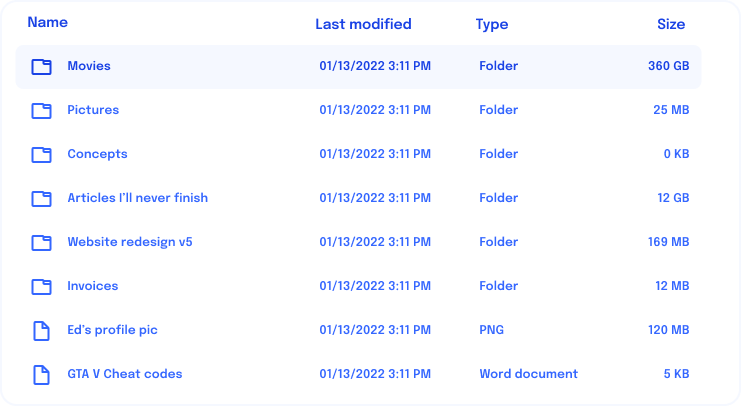

---
{
  title: "Derived Values",
  description: "Often in application development, you'll want to base one variable's value off of another. There are a few ways of doing this - some easier than others.",
  published: "2024-03-11T12:05:00.000Z",
  authors: ["crutchcorn"],
  tags: ["react", "angular", "vue", "webdev"],
  attached: [],
  order: 5,
  collection: "framework-field-guide-fundamentals",
  version: "v2",
}
---

We've previously touched on how to pass values to a component as properties earlier in the book:

<!-- ::start:tabs -->

# React

```jsx
const FileDate = ({ inputDate }) => {
	const [dateStr, setDateStr] = useState(formatDate(inputDate));
	const [labelText, setLabelText] = useState(formatReadableDate(inputDate));

	return <span aria-label={labelText}>{dateStr}</span>;
};
```

# Angular

```angular-ts
@Component({
	selector: "file-date",
	changeDetection: ChangeDetectionStrategy.OnPush,
	template: `<span [attr.aria-label]="labelText()">{{ dateStr() }}</span>`,
})
class FileDateComponent {
	inputDate = input.required<Date>();

	dateStr = signal("");
	labelText = signal("");

	constructor() {
		afterRender(() => {
			this.dateStr.set(formatDate(this.inputDate()));
			this.labelText.set(formatReadableDate(this.inputDate()));
		});
	}
}
```

# Vue

```vue
<!-- FileDate.vue -->
<script setup>
// ...

const props = defineProps(["inputDate"]);

const dateStr = ref(formatDate(props.inputDate));
const labelText = ref(formatReadableDate(props.inputDate));

// ...
</script>

<template>
	<span :aria-label="labelText">{{ dateStr }}</span>
</template>
```

<!-- ::end:tabs -->

You may notice that we're deriving two values from the same property. This works fine at first, but an issue arises with how we're doing things when we realize that our `formatDate` and `formatReadableDate` methods are only running once during the initial render.

Because of this, if we pass in an updated `inputDate` to the `FileDate` component, the values of `formatDate` and `formatReadableDate` will become out of sync from the parent's passed `inputDate`.

<!-- ::start:tabs -->

# React

```jsx
const File = ({ href, fileName, isSelected, onSelected, isFolder }) => {
	const [inputDate, setInputDate] = useState(new Date());

	useEffect(() => {
		// Check if it's a new day every 10 minutes
		const timeout = setTimeout(
			() => {
				const newDate = new Date();
				if (inputDate.getDate() === newDate.getDate()) return;
				setInputDate(newDate);
			},
			10 * 60 * 1000,
		);

		return () => clearTimeout(timeout);
	}, [inputDate]);

	// JSX shortened for focus
	// This may not show the most up-to-date `formatDate` or `formatReadableDate`
	return <FileDate inputDate={inputDate} />;
};
```

<!-- ::start:no-ebook -->
<iframe data-frame-title="React Refreshing File Date - StackBlitz" src="pfp-code:./ffg-fundamentals-react-refreshing-file-date-45?template=node&embed=1&file=src%2Fmain.jsx"></iframe>
<!-- ::end:no-ebook -->

# Angular

```angular-ts
@Component({
	selector: "file-item",
	changeDetection: ChangeDetectionStrategy.OnPush,
	imports: [FileDateComponent],
	template: `
		<!-- ... -->
		<!-- This may not show the most up-to-date 'formatDate' or 'formatReadableDate' -->
		@if (!isFolder()) {
			<file-date [inputDate]="inputDate()" />
		}
		<!-- ... -->
	`,
})
class FileComponent {
	// ...
	inputDate = signal(new Date());

	constructor() {
		effect((onCleanup) => {
			// Check if it's a new day every 10 minutes
			const interval = setInterval(
				() => {
					const newDate = new Date();
					if (this.inputDate().getDate() === newDate.getDate()) return;
					this.inputDate.set(newDate);
				},
				10 * 60 * 1000,
			);

			onCleanup(() => {
				clearInterval(interval);
			});
		});
	}
}
```

<!-- ::start:no-ebook -->
<iframe data-frame-title="Angular Refreshing File Date - StackBlitz" src="pfp-code:./ffg-fundamentals-angular-refreshing-file-date-45?template=node&embed=1&file=src%2Fmain.ts"></iframe>
<!-- ::end:no-ebook -->

# Vue

```vue
<!-- File.vue -->
<script setup>
import { ref, onMounted, onUnmounted } from "vue";
import FileDate from "./FileDate.vue";

// ...

const inputDate = ref(new Date());
const interval = ref(null);

onMounted(() => {
	// Check if it's a new day every 10 minutes
	interval.value = setInterval(
		() => {
			const newDate = new Date();
			if (inputDate.value.getDate() === newDate.getDate()) return;
			inputDate.value = newDate;
		},
		10 * 60 * 1000,
	);
});

onUnmounted(() => {
	clearInterval(interval.value);
});
</script>

<template>
	<!-- ... -->
	<!-- This may not show the most up-to-date `formatDate` or `formatReadableDate` -->
	<FileDate v-if="isFolder" :inputDate="inputDate" />
	<!-- ... -->
</template>
```

<!-- ::start:no-ebook -->
<iframe data-frame-title="Vue Refreshing File Date - StackBlitz" src="pfp-code:./ffg-fundamentals-vue-refreshing-file-date-45?template=node&embed=1&file=src%2FFile.vue"></iframe>
<!-- ::end:no-ebook -->

<!-- ::end:tabs -->

While the above `File` component updates `inputDate` correctly, our `FileDate` component is never listening for the changed input value and, as such, never recomputed the `formatDate` or `formatReadableDate` value to display to the user.

How can we fix this?

# Method 1: Prop Listening {#prop-listening}

The first - and arguably easiest to mentally model - method to solve this disparity between prop value and display value is to simply listen for when a property's value has been updated and re-calculate the display value.

Luckily, we can use [our existing knowledge of side effects](/posts/ffg-fundamentals-side-effects) to do so:

<!-- ::start:tabs -->

## React

```jsx {5-9}
const FileDate = ({ inputDate }) => {
	const [dateStr, setDateStr] = useState(formatDate(inputDate));
	const [labelText, setLabelText] = useState(formatReadableDate(inputDate));

	useEffect(() => {
		setDateStr(formatDate(inputDate));
		setLabelText(formatReadableDate(inputDate));
		// Every time `inputDate` changes, it'll trigger a render and therefore call the `useEffect`
	}, [inputDate]);

	return <span aria-label={labelText}>{dateStr}</span>;
};
```

<!-- ::start:no-ebook -->
<iframe data-frame-title="React Prop Listening - StackBlitz" src="pfp-code:./ffg-fundamentals-react-prop-listening-46?template=node&embed=1&file=src%2Fmain.jsx"></iframe>
<!-- ::end:no-ebook -->

## Angular

```angular-ts {13-19}
@Component({
	selector: "file-date",
	changeDetection: ChangeDetectionStrategy.OnPush,
	template: `<span [attr.aria-label]="labelText()">{{ dateStr() }}</span>`,
})
class FileDateComponent {
	inputDate = input.required<Date>();

	dateStr = signal("");
	labelText = signal("");

	constructor() {
		/**
		 * effect runs for EVERY change of signals read in the effect
		 */
		effect(() => {
			this.dateStr.set(formatDate(this.inputDate()));
			this.labelText.set(formatReadableDate(this.inputDate()));
		});
	}
}
```

<!-- ::start:no-ebook -->
<iframe data-frame-title="Angular Prop Listening - StackBlitz" src="pfp-code:./ffg-fundamentals-angular-prop-listening-46?template=node&embed=1&file=src%2Fmain.ts"></iframe>
<!-- ::end:no-ebook -->

## Vue

```vue {3,12-18}
<!-- FileDate.vue -->
<script setup>
import { ref, watch } from "vue";

// ...

const props = defineProps(["inputDate"]);

const dateStr = ref(formatDate(props.inputDate));
const labelText = ref(formatReadableDate(props.inputDate));

watch(
	() => props.inputDate,
	(newDate, oldDate) => {
		dateStr.value = formatDate(newDate);
		labelText.value = formatReadableDate(newDate);
	},
);
</script>

<template>
	<span :aria-label="labelText">{{ dateStr }}</span>
</template>
```

<!-- ::start:no-ebook -->
<iframe data-frame-title="Vue Prop Listening - StackBlitz" src="pfp-code:./ffg-fundamentals-vue-prop-listening-46?template=node&embed=1&file=src%2FFileDate.vue"></iframe>
<!-- ::end:no-ebook -->

Vue's `watch` logic allows you to track a given property or state value changes based on its key.

Here, we're watching the `inputDate` props key and, when changed, updating `dateStr` and `labelText` based off of the new property value.

<!-- ::end:tabs -->

While this method works, it tends to introduce duplicate developmental logic. For example, notice how we have to repeat the declaration of the `dateStr` and `labelText` values twice: Once when they're initially defined and again inside the property listener.

Luckily for us, there's an easy solution for this problem called "computed values."

# Method 2: Computed Values {#computed-values}

Our previous method of deriving a value from a property follows two steps:

1. Set an initial value
2. Update and recompute the value when its base changes

However, what if we could instead simplify this idea to a single step:

1. Run a function over a value and live update as it changes.

This may remind you of a similar pattern we've used already for [live updated text](/posts/ffg-fundamentals-intro-to-components#reactivity) and [attribute binding](/posts/ffg-fundamentals-intro-to-components#attr-binding).

Luckily for us, all three frameworks have a way of doing just this!

<!-- ::start:tabs -->

## React

```jsx {1,4-5}
import { useMemo } from "react";

const FileDate = ({ inputDate }) => {
	const dateStr = useMemo(() => formatDate(inputDate), [inputDate]);
	const labelText = useMemo(() => formatReadableDate(inputDate), [inputDate]);

	return <span aria-label={labelText}>{dateStr}</span>;
};
```

<!-- ::start:no-ebook -->
<iframe data-frame-title="React Computed Values - StackBlitz" src="pfp-code:./ffg-fundamentals-react-computed-values-47?template=node&embed=1&file=src%2Fmain.jsx"></iframe>
<!-- ::end:no-ebook -->

`useMemo` is a method for computing values based on an input or series of inputs. This works because it does the computation and regenerates the calculation whenever the second argument array's values have changed in a render.

Like `useEffect`, this array's values' changes are only tracked when the component is rendered. Unlike `useEffect`, however, there's no option to remove the second array argument entirely.

Instead, if you want to recalculate the logic in every render, you'd remove the `useMemo` entirely. So, for simple computations, you can take this code:

```jsx
const AddComp = ({ baseNum, addNum }) => {
	const val = useMemo(() => baseNum + addNum, [baseNum, addNum]);
	return <p>{val}</p>;
};
```

And refactor it to look like this:

```jsx
const AddComp = ({ baseNum, addNum }) => {
	const val = baseNum + addNum;
	return <p>{val}</p>;
};
```

> While it's technically possible to use this trick to never use `useMemo`, your application's performance will suffer drastically. That said, it's a bit of a science to know when and where to use `useMemo`. [We'll touch on this more in our third book titled "Internals".](https://framework.guide)

## Angular

Angular is able to derive state from a signal using a function to transform the signal being read and a `computed` method:

```angular-ts {1,15-16}
import { Component, input, computed, ChangeDetectionStrategy } from "@angular/core";

@Component({
	selector: "file-date",
	changeDetection: ChangeDetectionStrategy.OnPush,
	template: `
		<span [attr.aria-label]="labelText()">
			{{ dateStr() }}
		</span>
	`,
})
class FileDateComponent {
	inputDate = input.required<Date>();

	dateStr = computed(() => formatDate(this.inputDate()));
	labelText = computed(() => formatReadableDate(this.inputDate()));
}
```

<!-- ::start:no-ebook -->

<iframe data-frame-title="Angular Computed Values - StackBlitz" src="pfp-code:./ffg-fundamentals-angular-computed-values-47?template=node&embed=1&file=src%2Fmain.ts"></iframe>

<!-- ::end:no-ebook -->

> Angular has another method of deriving state called "Pipes". You can learn all about Angular pipes in our ["Complete guide to Angular pipes" article](/posts/angular-pipes-a-complete-guide).

## Vue

```vue {3,9-10}
<!-- FileDate.vue -->
<script setup>
import { computed } from "vue";

// ...

const props = defineProps(["inputDate"]);

const dateStr = computed(() => formatDate(props.inputDate));
const labelText = computed(() => formatReadableDate(props.inputDate));
</script>

<template>
	<span :aria-label="labelText">{{ dateStr }}</span>
</template>
```

<!-- ::start:no-ebook -->
<iframe data-frame-title="Vue Computed Values - StackBlitz" src="pfp-code:./ffg-fundamentals-vue-computed-values-47?template=node&embed=1&file=src%2FFileDate.vue"></iframe>
<!-- ::end:no-ebook -->

Instead of using `ref` to construct a set of variables and then re-initializing the values once we `watch` a `prop`, we can simply tell Vue to do that same process for us using `computed` props.

<!-- ::start:no-ebook -->

Vue is able to ✨ magically ✨ detect what data inside the `computed` function is dynamic, just like `watchEffect`. When this dynamic data is changed, it will automatically re-initialize the variable it's assigned to with a new value returned from the inner function.

<!-- ::end:no-ebook -->

<!-- ::start:only-ebook -->

Vue is able to magically detect what data inside the `computed` function is dynamic, just like `watchEffect`. When this dynamic data is changed, it will automatically re-initialize the variable it's assigned to with a new value returned from the inner function.

<!-- ::end:only-ebook -->

These `computed` props are then accessible in the same way a `data` property is, both from the template and from Vue's `<script>` alike.

<!-- ::end:tabs -->

# Non-Prop Derived Values {#non-derived-vals}

While we've primarily used component inputs to demonstrate derived values today, both of the methods we've used thus far work for the internal component state and inputs.

<!-- ::in-content-ad title="Consider supporting" body="Donating any amount will help towards further development of the Framework Field Guide." button-text="Sponsor my work" button-href="https://github.com/sponsors/crutchcorn/" -->

Let's say that we have a piece of state called `number` in our component and want to display the doubled value of this property without passing this state to a new component:

<!-- ::start:tabs -->

## React

```jsx
const CountAndDoubleComp = () => {
	const [number, setNumber] = useState(0);
	const doubleNum = useMemo(() => number * 2, [number]);

	return (
		<div>
			<p>{number}</p>
			<p>{doubleNum}</p>
			<button onClick={() => setNumber(number + 2)}>Add one</button>
		</div>
	);
};
```

<!-- ::start:no-ebook -->
<iframe data-frame-title="React Non-Prop Derived - StackBlitz" src="pfp-code:./ffg-fundamentals-react-non-prop-derived-48?template=node&embed=1&file=src%2Fmain.jsx"></iframe>
<!-- ::end:no-ebook -->

## Angular

```angular-ts
@Component({
	selector: "count-and-double",
	changeDetection: ChangeDetectionStrategy.OnPush,
	template: `
		<div>
			<p>{{ number() }}</p>
			<p>{{ doubleNum() }}</p>
			<button (click)="addOne()">Add one</button>
		</div>
	`,
})
class CountAndDoubleComponent {
	number = signal(0);
	doubleNum = computed(() => this.number() * 2);

	addOne() {
		this.number.set(this.number() + 1);
	}
}
```

<!-- ::start:no-ebook -->

<iframe data-frame-title="Angular Non-Prop Derived - StackBlitz" src="pfp-code:./ffg-fundamentals-angular-non-prop-derived-48?template=node&embed=1&file=src%2Fmain.ts"></iframe>
<!-- ::end:no-ebook -->

### Writable Derived State {#linked-signal}

What if we wanted to have a bit of derived state that you can write temporary updates to that get reset when you update the base signal?

Luckily for us, we can do this using Angular's `linkedSignal`: 

```angular-ts
import {
  Component,
  ChangeDetectionStrategy,
  linkedSignal,
  signal,
} from '@angular/core';

@Component({
  selector: 'count-and-double',
  changeDetection: ChangeDetectionStrategy.OnPush,
  template: `
    <div>
      <p>{{ number() }}</p>
      <button (click)="addOne()">Add one</button>
      <p>{{ doubleNum() }}</p>
      <button (click)="addOneToDouble()">Add one</button>
    </div>
  `,
})
class CountAndDoubleComponent {
  number = signal(0);
  doubleNum = linkedSignal(() => this.number() * 2);

  addOne() {
    this.number.set(this.number() + 1);
  }

  addOneToDouble() {
    this.doubleNum.set(this.doubleNum() + 1);
  }
}
```

Now we can add `1` to `doubleNum()` any time we want, but when we update `number()` it resets `doubleNum()` to the calculated value of `number() * 2`.

<!-- ::start:no-ebook -->

<iframe data-frame-title="Angular linkedSignal - StackBlitz" src="pfp-code:./ffg-fundamentals-angular-linked-signal-48?template=node&embed=1&file=src%2Fmain.ts"></iframe>

<!-- ::end:no-ebook -->

## Vue

```vue
<!-- CountAndDouble.vue -->
<script setup>
import { ref, computed } from "vue";

const number = ref(0);

function addOne() {
	number.value++;
}

const doubleNum = computed(() => number.value * 2);
</script>

<template>
	<div>
		<p>{{ number }}</p>
		<p>{{ doubleNum }}</p>
		<button @click="addOne()">Add one</button>
	</div>
</template>
```

<!-- ::start:no-ebook -->
<iframe data-frame-title="Vue Non-Prop Derived - StackBlitz" src="pfp-code:./ffg-fundamentals-vue-non-prop-derived-48?template=node&embed=1&file=src%2FCountAndDouble.vue"></iframe>
<!-- ::end:no-ebook -->

<!-- ::end:tabs -->

In this component, we can see two numbers — one doubling the value of the other. We then have a button that allows us to increment the first number, and therefore, using a derived value, the second number also updates.

# Challenge {#challenge}

While building through our continued file hosting application, let's think through how our `Size` can be calculated to be displayed in the UI like so:



File sizes are usually measured in how many bytes it takes to store the file. However, this isn't exactly useful information past a certain size. Let's instead use the following JavaScript to figure out how large a file size is, given the number of bytes:

```javascript
const kilobyte = 1024;
const megabyte = kilobyte * 1024;
const gigabyte = megabyte * 1024;

function formatBytes(bytes) {
	if (bytes < kilobyte) {
		return `${bytes} B`;
	} else if (bytes < megabyte) {
		return `${Math.floor(bytes / kilobyte)} KB`;
	} else if (bytes < gigabyte) {
		return `${Math.floor(bytes / megabyte)} MB`;
	} else {
		return `${Math.floor(bytes / gigabyte)} GB`;
	}
}
```

> Fun code challenge for you at home — can you write the above in fewer lines of code? 🤔

With this JavaScript, we can use a derived value to display the relevant display size. Let's build this out using a dedicated `DisplaySize` component:

<!-- ::start:tabs -->

## React

```jsx
function DisplaySize({ bytes }) {
	const humanReadableSize = useMemo(() => formatBytes(bytes), [bytes]);
	return <p>{humanReadableSize}</p>;
}

const kilobyte = 1024;
const megabyte = kilobyte * 1024;
const gigabyte = megabyte * 1024;

function formatBytes(bytes) {
	if (bytes < kilobyte) {
		return `${bytes} B`;
	} else if (bytes < megabyte) {
		return `${Math.floor(bytes / kilobyte)} KB`;
	} else if (bytes < gigabyte) {
		return `${Math.floor(bytes / megabyte)} MB`;
	} else {
		return `${Math.floor(bytes / gigabyte)} GB`;
	}
}
```

<!-- ::start:no-ebook -->

<details>

<summary>Final code output</summary>

<iframe data-frame-title="React Derived Challenge - StackBlitz" src="pfp-code:./ffg-fundamentals-react-derived-challenge-49?template=node&embed=1&file=src%2Fmain.jsx"></iframe>

</details>

<!-- ::end:no-ebook -->

## Angular

```angular-ts
const kilobyte = 1024;
const megabyte = kilobyte * 1024;
const gigabyte = megabyte * 1024;

function formatBytes(bytes: number) {
	if (bytes < kilobyte) {
		return `${bytes} B`;
	} else if (bytes < megabyte) {
		return `${Math.floor(bytes / kilobyte)} KB`;
	} else if (bytes < gigabyte) {
		return `${Math.floor(bytes / megabyte)} MB`;
	} else {
		return `${Math.floor(bytes / gigabyte)} GB`;
	}
}

@Component({
	selector: "display-size",
	changeDetection: ChangeDetectionStrategy.OnPush,
	template: `<p>{{ readableBytes() }}</p>`,
})
class DisplaySizeComponent {
	bytes = input.required<number>();

	readableBytes = computed(() => formatBytes(this.bytes()));
}
```

<!-- ::start:no-ebook -->

<details>

<summary>Final code output</summary>

<iframe data-frame-title="Angular Derived Challenge - StackBlitz" src="pfp-code:./ffg-fundamentals-angular-derived-challenge-49?template=node&embed=1&file=src%2Fmain.ts"></iframe>

</details>

<!-- ::end:no-ebook -->

## Vue

```vue
<!-- DisplaySize.vue -->
<script setup>
import { computed } from "vue";

const props = defineProps(["bytes"]);
const humanReadableSize = computed(() => formatBytes(props.bytes));

const kilobyte = 1024;
const megabyte = kilobyte * 1024;
const gigabyte = megabyte * 1024;

function formatBytes(bytes) {
	if (bytes < kilobyte) {
		return `${bytes} B`;
	} else if (bytes < megabyte) {
		return `${Math.floor(bytes / kilobyte)} KB`;
	} else if (bytes < gigabyte) {
		return `${Math.floor(bytes / megabyte)} MB`;
	} else {
		return `${Math.floor(bytes / gigabyte)} GB`;
	}
}
</script>

<template>
	<p>{{ humanReadableSize }}</p>
</template>
```

<!-- ::start:no-ebook -->

<details>

<summary>Final code output</summary>

<iframe data-frame-title="Vue Derived Challenge - StackBlitz" src="pfp-code:./ffg-fundamentals-vue-derived-challenge-49?template=node&embed=1&file=src%2FDisplaySize.vue"></iframe>

</details>

<!-- ::end:no-ebook -->

<!-- ::end:tabs -->
