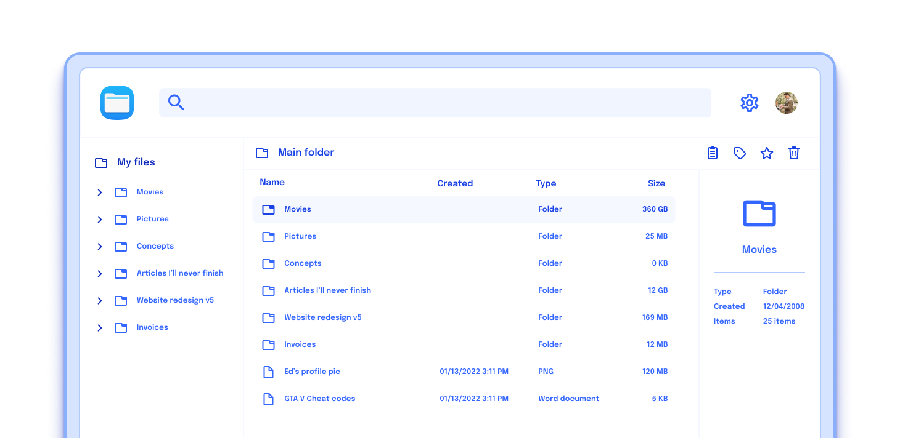
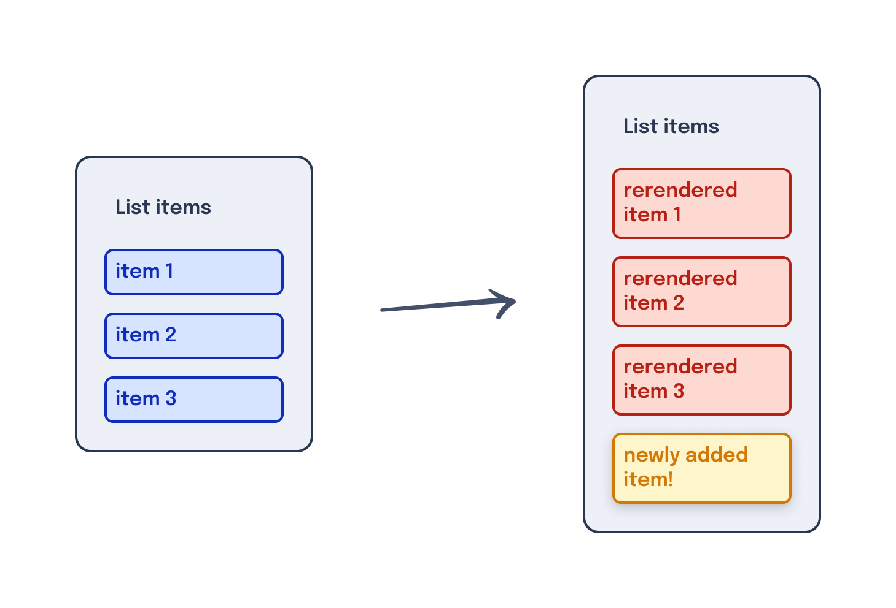

---
{
  title: "Dynamic HTML",
  description: "One of the primary advantages of using a framework is the ability to quickly generate dynamic HTML from JavaScript logic. Let's walk through some examples.",
  published: "2024-03-11T12:03:00.000Z",
  authors: ["crutchcorn"],
  tags: ["react", "angular", "vue", "webdev"],
  attached: [],
  order: 3,
  collection: "framework-field-guide-fundamentals",
  version: "v2",
}
---

Previously, we learned how to create components for our file application. These components included a way to create a component tree, add inputs to each component to pass data, and add an output of data back to a parent component.

Where we last left off, we manually input a list of files, which included file names and dates inside a `button`. Let's take a look back at our existing file component to start:

<!-- ::start:tabs -->

### React

```jsx
const File = ({ href, fileName, isSelected, onSelected }) => {
	// `href` is temporarily unused
	return (
		<button
			onClick={onSelected}
			style={
				isSelected
					? { backgroundColor: "blue", color: "white" }
					: { backgroundColor: "white", color: "blue" }
			}
		>
			{fileName}
			<FileDate inputDate={new Date()} />
		</button>
	);
};
```

<!-- ::start:no-ebook -->
<iframe data-frame-title="React Outputs - StackBlitz" src="pfp-code:../ffg-fundamentals-intro-to-components/ffg-fundamentals-react-outputs-15?template=node&embed=1&file=src%2Fmain.jsx"></iframe>
<!-- ::end:no-ebook -->

### Angular

```angular-ts
@Component({
	selector: "file-item",
	imports: [FileDateComponent],
	changeDetection: ChangeDetectionStrategy.OnPush,
	template: `
		<button
			(click)="selected.emit()"
			[style]="
				isSelected()
					? 'background-color: blue; color: white'
					: 'background-color: white; color: blue'
			"
		>
			{{ fileName() }}
			<file-date [inputDate]="inputDate" />
		</button>
	`,
})
class FileComponent {
	fileName = input.required<string>();
	// `href` is temporarily unused
	href = input.required<string>();
	isSelected = input<boolean>(false);
	selected = output();

	inputDate = new Date();
}
```

<!-- ::start:no-ebook -->
<iframe data-frame-title="Angular Outputs - StackBlitz" src="pfp-code:../ffg-fundamentals-intro-to-components/ffg-fundamentals-angular-outputs-15?template=node&embed=1&file=src%2Fmain.ts"></iframe>
<!-- ::end:no-ebook -->

### Vue

```vue
<!-- File.vue -->
<script setup>
import FileDate from "./FileDate.vue";
const inputDate = new Date();

// `href` is temporarily unused
const props = defineProps(["isSelected", "fileName", "href"]);

const emit = defineEmits(["selected"]);
</script>

<template>
	<button
		v-on:click="emit('selected')"
		:style="
			isSelected
				? 'background-color: blue; color: white'
				: 'background-color: white; color: blue'
		"
	>
		{{ fileName }}
		<FileDate :inputDate="inputDate" />
	</button>
</template>
```

<!-- ::start:no-ebook -->
<iframe data-frame-title="Vue Outputs - StackBlitz" src="pfp-code:../ffg-fundamentals-intro-to-components/ffg-fundamentals-vue-outputs-15?template=node&embed=1&file=src%2FFile.vue"></iframe>
<!-- ::end:no-ebook -->

<!-- ::end:tabs -->

This is a strong basis for a component without needing many changes.

We would love to add the ability to see folders listed alongside files. While we _could_ - and arguably should - add in a component that copies/pastes the code from the `File` component to create a new `Folder` component, let's reuse what we already have!

To do this, we'll create a new property called `isFolder`, which hides the date when set to true.

# Conditional Rendering {#conditional-rendering}

One way we can hide the `date` from displaying the user is by reusing an HTML attribute we introduced in the last chapter's challenge: [`hidden`](https://developer.mozilla.org/en-US/docs/Web/HTML/Global_attributes/hidden).

```html
<div hidden="true">
	<!-- This won't display to the user -->
	<FileDate />
</div>
```

This works but introduces a potential problem; while the contents are not _shown_ to the user (and are similarly [hidden from screen-readers](/posts/intro-to-web-accessibility#css)), they _are_ still present within the DOM.

This means that a large number of these HTML elements marked as `hidden` will still be in the DOM. They can still impact performance and memory usage as if they **were** being displayed to the user.

This might sound counterintuitive at first, but in-memory, non-displayed UI elements have their place; they're particularly useful when building animation systems that visually transition items in and out of view.

To sidestep these performance concerns, React, Angular, and Vue all have a method to "conditionally render" HTML elements based off of a boolean. This means that if you pass `false`, it will entirely remove the child HTML elements from the DOM.

Let's see what that looks like in usage:

<!-- ::start:tabs -->

### React

```jsx {2}
const ConditionalRender = ({ bool }) => {
	return <div>{bool && <p>Text here</p>}</div>;
};
```

<!-- ::start:no-ebook -->
<iframe data-frame-title="React Conditional Render - StackBlitz" src="pfp-code:./ffg-fundamentals-react-conditional-render-17?template=node&embed=1&file=src%2Fmain.jsx"></iframe>
<!-- ::end:no-ebook -->

We're using React's `{}` JavaScript binding to add an [`AND` statement](https://developer.mozilla.org/en-US/docs/Web/JavaScript/Reference/Operators/Logical_AND). This works by using Boolean logic of ["short-circuiting"](https://developer.mozilla.org/en-US/docs/Web/JavaScript/Reference/Operators/Logical_AND#short-circuit_evaluation). This means that if we have:

```javascript
const val = true || {};
```

`val` will be set to `{}`, while if we have:

```javascript
const val = false || {};
```

`val` will be set to `false`.

React then uses this return value to render the value when the condition inside the curly braces is **not** `undefined` or `null`.

This means that these examples **will** render their contained values:

```jsx
<div>{0}</div>
<div>{"Hello"}</div>
<div>{true || <Comp/>}</div>
<div>{true}</div>
// Renders as
<div>0</div>
<div>Hello</div>
<div><Comp/></div>
<div>true</div>
```

But the following examples **will not** render their contained values:

```jsx
<div>{undefined}</div>
<div>{false}</div>
// Both render as
<div></div>
```

### Angular

```angular-ts {5-7}
@Component({
	selector: "conditional-render",
	changeDetection: ChangeDetectionStrategy.OnPush,
	template: `<div>
		@if (bool()) {
			<p>Text here</p>
		}
	</div>`,
})
class ConditionalRenderComponent {
	bool = input.required<boolean>();
}
```

<!-- ::start:no-ebook -->
<iframe data-frame-title="Angular Conditional Render - StackBlitz" src="pfp-code:./ffg-fundamentals-angular-conditional-render-17?template=node&embed=1&file=src%2Fmain.ts"></iframe>
<!-- ::end:no-ebook -->

Here, we're using a special syntax called ["Control Flow Blocks"](https://angular.dev/guide/templates/control-flow) wrapping our `p` tag to stop rendering the element if `bool` is `false`.

### Vue

```vue {2,6}
<script setup>
const props = defineProps(["bool"]);
</script>

<template>
	<div><p v-if="bool">Text here</p></div>
</template>
```

<!-- ::start:no-ebook -->
<iframe data-frame-title="Vue Conditional Render - StackBlitz" src="pfp-code:./ffg-fundamentals-vue-conditional-render-17?template=node&embed=1&file=src%2FConditionalRender.vue"></iframe>
<!-- ::end:no-ebook -->

Unlike Angular, where you need to import the ability to conditionally render an element, Vue treats `v-if` as a global attribute that can be added to any element or component.

<!-- ::end:tabs -->

In this example, when we pass `bool` as `true`, the component's HTML is rendered as:

```html
<div><p>Text here</p></div>
```

But when `bool` is set to `false`, it instead renders the following HTML:

```html
<div></div>
```

This is possible because React, Angular, and Vue control what is rendered on the screen. Using this, they can remove or add HTML rendered to the DOM with nothing more than a boolean instruction.

Knowing this, let's add conditional rendering to our application.

## Conditional Rendering Our Date {#conditional-render-date}

Right now, we have a list of files to present to the user. However, if we look back at our mockups, we'll notice that we wanted to list folders alongside files.



Luckily for us, our `File` component already manages much of the behavior we'd like to have with a potential `Folder` component as well. For example, just like files, we want to select a folder when the user has clicked on it so that we can select multiple files and folders at once.

However, unlike files, folders do not have a creation date since there may be ambiguity of what the "Last modified" date would mean for a folder. Is the last modified date when the folder was renamed? Or was it when a file within said folder was last modified? It's unclear, so we'll axe it.

Despite this difference in functionality, we can still reuse our `File` component for folders as well. We can reuse this component by conditionally rendering the date if we know we're showing a folder instead of a file.

Let's add an input to our `File` component called `isFolder` and prevent the date from rendering if said input is set to `true``.

<!-- ::start:tabs -->

### React

```jsx {12}
const File = ({ href, fileName, isSelected, onSelected, isFolder }) => {
	return (
		<button
			onClick={onSelected}
			style={
				isSelected
					? { backgroundColor: "blue", color: "white" }
					: { backgroundColor: "white", color: "blue" }
			}
		>
			{fileName}
			{!isFolder && <FileDate inputDate={new Date()} />}
		</button>
	);
};

const FileList = () => {
	return (
		<ul>
			<li>
				<File fileName="File one" href="/file/file_one" />
			</li>
			<li>
				<File fileName="Folder one" href="/file/folder_one/" isFolder={true} />
			</li>
		</ul>
	);
};
```

<!-- ::start:no-ebook -->
<iframe data-frame-title="React Conditional Date - StackBlitz" src="pfp-code:./ffg-fundamentals-react-conditional-date-18?template=node&embed=1&file=src%2Fmain.jsx"></iframe>
<!-- ::end:no-ebook -->

### Angular

```angular-ts {16-18,44}
@Component({
	selector: "file-item",
	imports: [FileDateComponent],
	changeDetection: ChangeDetectionStrategy.OnPush,
	template: `
		<button
			(click)="selected.emit()"
			[style]="
				isSelected()
					? 'background-color: blue; color: white'
					: 'background-color: white; color: blue'
			"
		>
			{{ fileName() }}

			@if (!isFolder()) {
				<file-date [inputDate]="inputDate" />
			}
		</button>
	`,
})
class FileComponent {
	fileName = input.required<string>();
	href = input.required<string>();
	isSelected = input(false);
	isFolder = input(false);
	selected = output();
	inputDate = new Date();
}

@Component({
	selector: "file-list",
	imports: [FileComponent],
	changeDetection: ChangeDetectionStrategy.OnPush,
	template: `
		<ul>
			<li>
				<file-item fileName="File one" href="/file/file_one" />
			</li>
			<li>
				<file-item
					fileName="Folder one"
					href="/file/folder_one/"
					[isFolder]="true"
				/>
			</li>
		</ul>
	`,
})
class FileListComponent {}
```

<!-- ::start:no-ebook -->
<iframe data-frame-title="Angular Conditional Date - StackBlitz" src="pfp-code:./ffg-fundamentals-angular-conditional-date-18?template=node&embed=1&file=src%2Fmain.ts"></iframe>
<!-- ::end:no-ebook -->

### Vue

```vue {21}
<!-- File.vue -->
<script setup>
import FileDate from "./FileDate.vue";
const inputDate = new Date();

const props = defineProps(["isSelected", "isFolder", "fileName", "href"]);

const emit = defineEmits(["selected"]);
</script>

<template>
	<button
		v-on:click="emit('selected')"
		:style="
			isSelected
				? 'background-color: blue; color: white'
				: 'background-color: white; color: blue'
		"
	>
		{{ fileName }}
		<FileDate v-if="!isFolder" :inputDate="inputDate" />
	</button>
</template>
```

```vue {12}
<!-- FileList.vue -->
<script setup>
import File from "./File.vue";
</script>

<template>
	<ul>
		<li>
			<File fileName="File one" href="/file/file_one" />
		</li>
		<li>
			<File fileName="Folder one" href="/file/folder_one/" :isFolder="true" />
		</li>
	</ul>
</template>
```

<!-- ::start:no-ebook -->
<iframe data-frame-title="Vue Conditional Date - StackBlitz" src="pfp-code:./ffg-fundamentals-vue-conditional-date-18?template=node&embed=1&file=src%2FFile.vue"></iframe>
<!-- ::end:no-ebook -->

<!-- ::end:tabs -->

# Conditional Branches {#conditional-branch}

We're now able to conditionally show the user the last modified date depending on the `isFolder` boolean. However, it may still be unclear to the user what is a folder and what is a file, as we don't have this information clearly displayed to the user yet.

Let's use conditional rendering to show the type of item displayed based on the `isFolder` boolean.

<!-- ::start:tabs -->

## React

```jsx
<div>
	{isFolder && <span>Type: Folder</span>}
	{!isFolder && <span>Type: File</span>}
</div>
```

## Angular

```angular-html
<div>
	@if (isFolder()) {
		<span>Type: Folder</span>
	}
	@if (!isFolder()) {
		<span>Type: File</span>
	}
</div>
```

## Vue

```html
<div>
	<span v-if="isFolder">Type: Folder</span>
	<span v-if="!isFolder">Type: File</span>
</div>
```

<!-- ::end:tabs -->

While working on this, it might become clear that we're effectively reconstructing an [`if ... else` statement](https://developer.mozilla.org/en-US/docs/Web/JavaScript/Reference/Statements/if...else), similar to the following logic in JavaScript.

```javascript
// This is pseudocode for the above using JavaScript as the syntax
if (isFolder) return "Type: Folder";
else return "Type: File";
```

Like the JavaScript environment these frameworks run in, they also implement a similar `else`-style API for this exact purpose.

<!-- ::start:tabs -->

## React

One of the benefits of React's JSX templating language is that you're able to embed JavaScript directly inside an element. This embedded JavaScript will then render the return value of the JavaScript inside.

For example, we can use [a JavaScript ternary](https://developer.mozilla.org/en-US/docs/Web/JavaScript/Reference/Operators/Conditional_Operator) to return a different value if a boolean is `true` or `false`:

```javascript
// Will show "Folder" if `isFolder` is true, otherwise show "File"
const displayType = isFolder ? "Folder" : "File";
```

We can combine this information with JSX's ability to treat a tag as a value you can assign to memory to create a `if...else`-style render in React:

```jsx
<div>{isFolder ? <span>Type: Folder</span> : <span>Type: File</span>}</div>
```

<!-- ::start:no-ebook -->
<iframe data-frame-title="React Conditional Branches - StackBlitz" src="pfp-code:./ffg-fundamentals-react-conditional-branches-19?template=node&embed=1&file=src%2Fmain.jsx"></iframe>
<!-- ::end:no-ebook -->

Here, if `isFolder` is `true`, the following will be rendered:

```html
<div><span>Type: Folder</span></div>
```

Otherwise, if `isFolder` is `false`, this will be rendered:

```html
<div><span>Type: File</span></div>
```

## Angular

```angular-html
<div>
	@if (isFolder()) {
		<span>Type: Folder</span>
	} @else {
		<span>Type: File</span>
	}
</div>
```

<!-- ::start:no-ebook -->
<iframe data-frame-title="Angular Conditional Branches - StackBlitz" src="pfp-code:./ffg-fundamentals-angular-conditional-branches-19?template=node&embed=1&file=src%2Fmain.ts"></iframe>

<!-- ::end:no-ebook -->

## Vue

```html
<div>
	<span v-if="isFolder">Type: Folder</span>
	<span v-else>Type: File</span>
</div>
```

Here, Vue's `if...else` syntax looks fairly similar to the JavaScript pseudo-syntax we displayed above.

> It's worth noting that a `v-else` tag **must** immediately follow a `v-if` tag; otherwise, it won't work.

<!-- ::start:no-ebook -->
<iframe data-frame-title="Vue Conditional Branches - StackBlitz" src="pfp-code:./ffg-fundamentals-vue-conditional-branches-19?template=node&embed=1&file=src%2FFile.vue"></iframe>
<!-- ::end:no-ebook -->

<!-- ::end:tabs -->

## Expanded Branches {#expanded-branches}

While an `if ... else` works wonders if you only have a single Boolean value you need to check, you'll often need more than a single conditional branch to check against.

For example, what if we added an `isImage` Boolean to differentiate between images and other file types?

While we could move back to a simple `if` statement for each condition:

<!-- ::start:tabs -->

### React

```jsx
<div>
	{isFolder && <span>Type: Folder</span>}
	{!isFolder && isImage && <span>Type: Image</span>}
	{!isFolder && !isImage && <span>Type: File</span>}
</div>
```

### Angular

```angular-html
<div>
	@if (isFolder()) {
		<span>Type: Folder</span>
	}
	@if (!isFolder() && isImage()) {
		<span>Type: Image</span>
	}
	@if (!isFolder() && !isImage()) {
		<span>Type: File</span>
	}
</div>
```

### Vue

```html
<span v-if="isFolder">Type: Folder</span>
<span v-if="!isFolder && isImage">Type: Image</span>
<span v-if="!isFolder && !isImage">Type: File</span>
```

<!-- ::end:tabs -->

This can get hard to read with multiple conditionals in a row. As a result, these frameworks have tools that you can use to make things a bit more readable.

<!-- ::start:tabs -->

### React

We can chain together ternary operations to treat them as nested `if` statements.

By doing so, we can represent the following JavaScript pseudo-syntax:

```js
function getType() {
	// JavaScript
	if (isFolder) {
		return "Folder";
	} else {
		if (isImage) {
			return "Image";
		} else {
			return "File";
		}
	}
}
```

As the following React JSX

```jsx
<div>
	{isFolder ? (
		<span>Type: Folder</span>
	) : isImage ? (
		<span>Type: Image</span>
	) : (
		<span>Type: File</span>
	)}
</div>
```

### Angular

We're able to reuse much of the same logic as JavaScript:

```js
function getType() {
	if (isFolder) return "Folder";
	else if (isImage) return "Image";
	else return "File";
}
```

To recreate an `if...else` using Angular's Control Flow syntax.

```angular-html
<div>
	@if (isFolder()) {
		<span>Type: Folder</span>
	@else if (isImage()) {
			<span>Type: Image</span>
	} @else {
		<span>Type: File</span>
	}
</div>
```

In addition to the `if/else` syntax, Angular also has a mechanism for utilizing [`switch/case` statements](https://developer.mozilla.org/en-US/docs/Web/JavaScript/Reference/Statements/switch). These switch/case statements work by matching a value from a `case` to the `switch` value. So, if you had:

```angular-html
<div>
	@switch (type()) {
		@case ("folder") {
			<span>Type: Folder</span>
		}
		@case ("image") {
			<span>Type: Image</span>
		}
		@default {
			<span>Type: File</span>
		}
	}
</div>
```

It would render:

```html
<div><span>Type: Folder</span></div>
```

Because the `@switch` value of `'folder'` matched the `@case` value of `'folder'`.

Using this tool, we can even set the `@switch` value to `true` and add a conditional into the `@case`.

```angular-html
<div>
	@switch (true) {
		@case (isFolder()) {
			<span>Type: Folder</span>
		}
		@case (isImage()) {
			<span>Type: Image</span>
		}
		@default {
			<span>Type: File</span>
		}
	}
</div>
```

### Vue

Just as Vue's `v-if/v-else` attributes match JavaScript's `if...else` syntax, we can reuse similar logic to JavaScript's:

```js
function getType() {
	if (isFolder) return "Folder";
	else if (isImage) return "Image";
	else return "File";
}
```

Using Vue's `v-else-if` attribute:

```html
<div>
	<span v-if="isFolder">Type: Folder</span>
	<span v-else-if="isImage">Type: Image</span>
	<span v-else>Type: File</span>
</div>
```

Once again, the `v-else-if` and `v-else` tags must follow one another to work as intended.

<!-- ::end:tabs -->

# Rendering Lists {#rendering-lists}

While we've primarily focused on improvements to our `File` component in this chapter, let's take another look at our original `FileList` component.

<!-- ::start:tabs -->

## React

```jsx
const FileList = () => {
	const [selectedIndex, setSelectedIndex] = useState(-1);

	const onSelected = (idx) => {
		if (selectedIndex === idx) {
			setSelectedIndex(-1);
			return;
		}
		setSelectedIndex(idx);
	};

	return (
		<ul>
			<li>
				<File
					isSelected={selectedIndex === 0}
					onSelected={() => onSelected(0)}
					fileName="File one"
					href="/file/file_one"
					isFolder={false}
				/>
			</li>
			<li>
				<File
					isSelected={selectedIndex === 1}
					onSelected={() => onSelected(1)}
					fileName="File two"
					href="/file/file_two"
					isFolder={false}
				/>
			</li>
			<li>
				<File
					isSelected={selectedIndex === 2}
					onSelected={() => onSelected(2)}
					fileName="File three"
					href="/file/file_three"
					isFolder={false}
				/>
			</li>
		</ul>
	);
};
```

## Angular

```angular-ts
@Component({
	selector: "file-list",
	changeDetection: ChangeDetectionStrategy.OnPush,
	imports: [FileComponent],
	template: `
		<ul>
			<li>
				<file
					(selected)="onSelected(0)"
					[isSelected]="selectedIndex() === 0"
					fileName="File one"
					href="/file/file_one"
					[isFolder]="false"
				/>
			</li>
			<li>
				<file
					(selected)="onSelected(1)"
					[isSelected]="selectedIndex() === 1"
					fileName="File two"
					href="/file/file_two"
					[isFolder]="false"
				/>
			</li>
			<li>
				<file
					(selected)="onSelected(2)"
					[isSelected]="selectedIndex() === 2"
					fileName="File three"
					href="/file/file_three"
					[isFolder]="false"
				/>
			</li>
		</ul>
	`,
})
class FileListComponent {
	selectedIndex = signal(-1);

	onSelected(idx: number) {
		if (this.selectedIndex() === idx) {
			this.selectedIndex.set(-1);
			return;
		}
		this.selectedIndex.set(idx);
	}
}
```

## Vue

```vue
<script setup>
import { ref } from "vue";
import File from "./File.vue";

const selectedIndex = ref(-1);

function onSelected(idx) {
	if (selectedIndex.value === idx) {
		selectedIndex.value = -1;
		return;
	}
	selectedIndex.value = idx;
}
</script>

<template>
	<ul>
		<li>
			<File
				@selected="onSelected(0)"
				:isSelected="selectedIndex === 0"
				fileName="File one"
				href="/file/file_one"
				:isFolder="false"
			/>
		</li>
		<li>
			<File
				@selected="onSelected(1)"
				:isSelected="selectedIndex === 1"
				fileName="File two"
				href="/file/file_two"
				:isFolder="false"
			/>
		</li>
		<li>
			<File
				@selected="onSelected(2)"
				:isSelected="selectedIndex === 2"
				fileName="File three"
				href="/file/file_three"
				:isFolder="false"
			/>
		</li>
	</ul>
</template>
```

<!-- ::end:tabs -->

Upon second glance, something that might immediately jump out at you is just how long these code samples are! Interestingly, this is primarily due to the copy-pasted nature of our `File` component being repeated.

What's more, this method of hard-coding file components means that we cannot create new files in JavaScript and display them in the DOM.

Let's fix that by replacing the copy-pasted components with a loop and an array.

<!-- ::start:tabs -->

## React

React uses [JavaScript's built-in `Array.map` method](https://developer.mozilla.org/en-US/docs/Web/JavaScript/Reference/Global_Objects/Array/map) to loop through each item and map them to some React component.

```jsx {1-17,34-44}
const filesArray = [
	{
		fileName: "File one",
		href: "/file/file_one",
		isFolder: false,
	},
	{
		fileName: "File two",
		href: "/file/file_two",
		isFolder: false,
	},
	{
		fileName: "File three",
		href: "/file/file_three",
		isFolder: false,
	},
];

const FileList = () => {
	const [selectedIndex, setSelectedIndex] = useState(-1);

	const onSelected = (idx) => {
		if (selectedIndex === idx) {
			setSelectedIndex(-1);
			return;
		}
		setSelectedIndex(idx);
	};

	// This code sample is missing something and will throw a warning in development mode.
	// We'll explain more about this later.
	return (
		<ul>
			{filesArray.map((file, i) => (
				<li>
					<File
						isSelected={selectedIndex === i}
						onSelected={() => onSelected(i)}
						fileName={file.fileName}
						href={file.href}
						isFolder={file.isFolder}
					/>
				</li>
			))}
		</ul>
	);
};
```

We can then use the second argument inside the `map` to gain access to the index of the looped item.

<!-- ::start:no-ebook -->
<iframe data-frame-title="React Rendering Lists - StackBlitz" src="pfp-code:./ffg-fundamentals-react-rendering-lists-20?template=node&embed=1&file=src%2Fmain.jsx"></iframe>
<!-- ::end:no-ebook -->

## Angular

Just as how the previous `@if` control flow block is used to conditionally render items, Angular uses a different block to render a list of items: `@for`.

```angular-ts {7-17,32-48}
@Component({
	selector: "file-list",
    changeDetection: ChangeDetectionStrategy.OnPush,
	imports: [FileComponent],
	template: `
		<ul>
			@for (file of filesArray; track file; let i = $index) {
				<li>
					<file-item
						(selected)="onSelected(i)"
						[isSelected]="selectedIndex() === i"
						[fileName]="file.fileName"
						[href]="file.href"
						[isFolder]="file.isFolder"
					/>
				</li>
			}
		</ul>
	`,
})
class FileListComponent {
	selectedIndex = signal(-1);

	onSelected(idx: number) {
		if (this.selectedIndex() === idx) {
			this.selectedIndex.set(-1);
			return;
		}
		this.selectedIndex.set(idx);
	}

	filesArray = [
		{
			fileName: "File one",
			href: "/file/file_one",
			isFolder: false,
		},
		{
			fileName: "File two",
			href: "/file/file_two",
			isFolder: false,
		},
		{
			fileName: "File three",
			href: "/file/file_three",
			isFolder: false,
		},
	];
}
```

<!-- ::start:no-ebook -->
<iframe data-frame-title="Angular Rendering Lists - StackBlitz" src="pfp-code:./ffg-fundamentals-angular-rendering-lists-20?template=node&embed=1&file=src%2Fmain.ts"></iframe>
<!-- ::end:no-ebook -->

Inside our `@for`, `$index` may not seem like it is being defined; however, Angular declares it whenever you attempt to utilize `@for` under the hood. Assigning it to a template variable using `let` allows you to use it as the index of the looped item.

Likewise, there may be some questions as to what `track: file` is doing. [We'll answer this in our next section: "Keys"](#keys)

## Vue

Vue provides a `v-for` global attribute that does for lists what `v-if` does for conditional rendering:

```vue {6-22,38-46}
<!-- FileList.vue -->
<script setup>
import { ref } from "vue";
import File from "./File.vue";

const filesArray = [
	{
		fileName: "File one",
		href: "/file/file_one",
		isFolder: false,
	},
	{
		fileName: "File two",
		href: "/file/file_two",
		isFolder: false,
	},
	{
		fileName: "File three",
		href: "/file/file_three",
		isFolder: false,
	},
];

const selectedIndex = ref(-1);

function onSelected(idx) {
	if (selectedIndex.value === idx) {
		selectedIndex.value = -1;
		return;
	}
	selectedIndex.value = idx;
}
</script>

<template>
	<ul>
		<!-- This will throw a warning, more on that soon -->
		<li v-for="(file, i) in filesArray">
			<File
				@selected="onSelected(i)"
				:isSelected="selectedIndex === i"
				:fileName="file.fileName"
				:href="file.href"
				:isFolder="file.isFolder"
			/>
		</li>
	</ul>
</template>
```

Inside our `v-for`, we're accessing both the value of the item (`file`) and the index of the looped item (`i`).

<!-- ::start:no-ebook -->
<iframe data-frame-title="Vue Rendering Lists - StackBlitz" src="pfp-code:./ffg-fundamentals-vue-rendering-lists-20?template=node&embed=1&file=src%2FFileList.vue"></iframe>
<!-- ::end:no-ebook -->

<!-- ::end:tabs -->

If we look at the rendered output, we can see that all three files are listed as expected!

Using this code as a base, we could extend this file list to any number of files just by adding another item to the hard-coded `filesArray` list; no templating code changes are required!

## Keys {#keys}

Regardless of the framework, you may have encountered an error in the previous code sample that read like the following:

<!-- ::start:no-ebook -->
<!-- ::start:tabs -->

### React

> Warning: Each child in a list should have a unique "key" prop.

### Angular

> NG5002: @for loop must have a "track" expression

### Vue

> Elements in iteration expect to have 'v-bind:key' directives

<!-- ::end:tabs -->
<!-- ::end:no-ebook -->

<!-- ::start:only-ebook -->

**React**

> Warning: Each child in a list should have a unique "key" prop.

**Angular**

> NG5002: @for loop must have a "track" expression

**Vue**

> Elements in iteration expect to have 'v-bind:key' directives

<!-- ::end:only-ebook -->

This is because, in these frameworks, you're expected to pass a special property called the `key` (or, `track` in Angular), which the respective framework uses to keep track of which item is which.

<!-- ::in-content-ad title="Consider supporting" body="Donating any amount will help towards further development of the Framework Field Guide." button-text="Sponsor my work" button-href="https://github.com/sponsors/crutchcorn/" -->

Without this `key` prop, the framework doesn't know which elements have been unchanged and, therefore, must destroy and recreate each element in the array for every list re-render. This can cause massive performance problems and stability headaches.

> If you're confused, no worries — there was a lot of technical speech in that last paragraph. Continue reading to see what this means in practical terms and don't be afraid to come back and re-read this section when you're done with the chapter.

Say you have the following:

<!-- ::start:tabs -->

### React

```jsx
const WordList = () => {
	const [words, setWords] = useState([]);

	const addWord = () => {
		const newWord = getRandomWord();
		// Remove ability for duplicate words
		if (words.includes(newWord)) return;
		setWords([...words, newWord]);
	};

	const removeFirst = () => {
		const newWords = [...words];
		newWords.shift();
		setWords(newWords);
	};

	return (
		<div>
			<button onClick={addWord}>Add word</button>
			<button onClick={removeFirst}>Remove first word</button>
			<ul>
				{words.map((word) => {
					return (
						<li>
							{word.word}
							<input type="text" />
						</li>
					);
				})}
			</ul>
		</div>
	);
};

const wordDatabase = [
	{ word: "who", id: 1 },
	{ word: "what", id: 2 },
	{ word: "when", id: 3 },
	{ word: "where", id: 4 },
	{ word: "why", id: 5 },
	{ word: "how", id: 6 },
];

function getRandomWord() {
	return wordDatabase[Math.floor(Math.random() * wordDatabase.length)];
}
```

<!-- ::start:no-ebook -->
<iframe data-frame-title="React Unkeyed Demo - StackBlitz" src="pfp-code:./ffg-fundamentals-react-unkeyed-demo-21?template=node&embed=1&file=src%2Fmain.jsx"></iframe>
<!-- ::end:no-ebook -->

### Angular

```angular-ts
@Component({
	selector: "word-list",
	changeDetection: ChangeDetectionStrategy.OnPush,
	template: `
		<div>
			<button (click)="addWord()">Add word</button>
			<button (click)="removeFirst()">Remove first word</button>
			<ul>
				@for (word of words(); track word) {
					<li>
						{{ word.word }}
						<input type="text" />
					</li>
				}
			</ul>
		</div>
	`,
})
class WordListComponent {
	words = signal<Word[]>([]);

	addWord() {
		const newWord = getRandomWord();
		// Remove ability for duplicate words
		if (this.words().includes(newWord)) return;
		this.words.set([...this.words(), newWord]);
	}

	removeFirst() {
		const newWords: Word[] = [];
        newWords.shift();
		this.words.set(newWords);
	}
}

const wordDatabase = [
	{ word: "who", id: 1 },
	{ word: "what", id: 2 },
	{ word: "when", id: 3 },
	{ word: "where", id: 4 },
	{ word: "why", id: 5 },
	{ word: "how", id: 6 },
];

function getRandomWord() {
	return wordDatabase[Math.floor(Math.random() * wordDatabase.length)];
}

interface Word {
	word: string;
	id: number;
}
```

<!-- ::start:no-ebook -->
<iframe data-frame-title="Angular Unkeyed Demo - StackBlitz" src="pfp-code:./ffg-fundamentals-angular-unkeyed-demo-21?template=node&embed=1&file=src%2Fmain.ts"></iframe>
<!-- ::end:no-ebook -->

### Vue

```vue
<!-- WordList.vue -->
<script setup>
import { ref } from "vue";

const wordDatabase = [
	{ word: "who", id: 1 },
	{ word: "what", id: 2 },
	{ word: "when", id: 3 },
	{ word: "where", id: 4 },
	{ word: "why", id: 5 },
	{ word: "how", id: 6 },
];

function getRandomWord() {
	return wordDatabase[Math.floor(Math.random() * wordDatabase.length)];
}

const words = ref([]);

function addWord() {
	const newWord = getRandomWord();
	// Remove ability for duplicate words
	if (words.value.includes(newWord)) return;
	words.value.push(newWord);
}

function removeFirst() {
	words.value.shift();
}
</script>

<template>
	<div>
		<button @click="addWord()">Add word</button>
		<button @click="removeFirst()">Remove first word</button>
		<ul>
			<li v-for="word in words">
				{{ word.word }}
				<input type="text" />
			</li>
		</ul>
	</div>
</template>
```

<!-- ::start:no-ebook -->
<iframe data-frame-title="Vue Unkeyed Demo - StackBlitz" src="pfp-code:./ffg-fundamentals-vue-unkeyed-demo-21?template=node&embed=1&file=src%2FWordList.vue"></iframe>
<!-- ::end:no-ebook -->

<!-- ::end:tabs -->

Without using some kind of `key` prop (or, when you use `track obj` without a property in Angular), your list will be destroyed and recreated every time you run `addWord`.

This can be demonstrated by typing some text into the `input` and pressing the `"Remove first word"` button. When you do so, the typed text behaves in a strange way.

In Angular, the input text simply disappears. In React and Vue, however, the text moves to the line of the word below the one you originally typed inside.

Both of these behaviors are quite peculiar — we've seemingly not modified the `li` that contains the `input` in question; why are its contents moving or being removed entirely?

The reason the input text changes is that the framework **isn't able to detect which item in your array has changed** and, as a result, marks all DOM elements as "outdated". **These "outdated" elements are then destroyed by the framework, only to be immediately reconstructed** to ensure the most up-to-date information is displayed to the user.



Instead, **we can tell the framework which list item is which with a unique "key"** associated with every list item. This key is then able to **allow the framework to intelligently prevent the destruction of items that were not changed** in a list data change.


Let's see how we can do this in each framework.

<!-- ::start:tabs -->

### React

```jsx {5}
<div>
	<button onClick={addWord}>Add word</button>
	<ul>
		{words.map((word) => {
			return <li key={word.id}>{word.word}</li>;
		})}
	</ul>
</div>
```

Here, we're using the `key` property to tell React which `li` is related to which `word` via the `word`'s unique `id` field.

<!-- ::start:no-ebook -->
<iframe data-frame-title="React Keyed Demo - StackBlitz" src="pfp-code:./ffg-fundamentals-react-keyed-demo-22?template=node&embed=1&file=src%2Fmain.jsx"></iframe>
<!-- ::end:no-ebook -->

### Angular

While Angular doesn't have quite the same API for `key` as React and Vue, Angular instead uses a `track` keyword to figure out which item is which.

```angular-ts {8}
@Component({
	selector: "word-list",
	standalone: true,
	template: `
		<div>
			<button (click)="addWord()">Add word</button>
			<ul>
				@for (word of words(); track word.id) {
					<li>{{ word.word }}</li>
				}
			</ul>
		</div>
	`,
})
class WordListComponent {
	words = signal<Word[]>([]);

	// ...
}
```

<!-- ::start:no-ebook -->
<iframe data-frame-title="Angular Keyed Demo - StackBlitz" src="pfp-code:./ffg-fundamentals-angular-keyed-demo-22?template=node&embed=1&file=src%2Fmain.ts"></iframe>
<!-- ::end:no-ebook -->

Using a tracker without a property accessor (`track obj` vs `track obj.id`) is a way to opt-out of this behavior, as it will track the object reference (`===`) of the object in the array. This is useful when you don't have a unique identifier for each item in the array, but is highly discouraged due to the aforementioned performance and behavior benefits of having a unique identifier.

> To learn more about object reference tracking, [see our article explaining how memory addresses are tracked in JavaScript.](/posts/object-mutation)

### Vue

```vue {6}
<!-- WordList.vue -->
<template>
	<div>
		<button @click="addWord()">Add word</button>
		<ul>
			<li v-for="word in words" :key="word.id">{{ word.word }}</li>
		</ul>
	</div>
</template>

<!-- ... -->
```

Here, we're using the `key` property to tell Vue which `li` is related to which `word` via the `word`'s unique `id` field.

<!-- ::start:no-ebook -->
<iframe data-frame-title="Vue Keyed Demo - StackBlitz" src="pfp-code:./ffg-fundamentals-vue-keyed-demo-22?template=node&embed=1&file=src%2FWordList.vue"></iframe>
<!-- ::end:no-ebook -->

<!-- ::end:tabs -->

Now, when we re-render the list, the framework is able to know exactly which items have and have not changed.

As such, it will only re-render the new items, leaving the old and unchanged DOM elements alone.

## Keys as Render Hints {#keys-as-hints}

As we mentioned earlier, the `key` property is used by the framework to figure out which element is which. Change this `key` property for a given element, and it will be destroyed and recreated as if it were a fresh node.

While this is most applicable within lists, this is also true outside them; assign a `key` to an element and change it, and it will be recreated from scratch.

For example, let's assume we have a basic `input` that we want to be able to reset when a button is pressed.

To do this, we can assign a `key` property to the `input` and change the value of said `key` to force a re-creation of the `input`.

<!-- ::start:tabs -->

### React

```jsx {8}
function KeyExample() {
	const [num, setNum] = useState(0);

	const increase = () => setNum(num + 1);

	return (
		<div>
			<input key={num} />
			<button onClick={increase}>Increase</button>
			<p>{num}</p>
		</div>
	);
}
```

<!-- ::start:no-ebook -->
<iframe data-frame-title="React Key Render Hint - StackBlitz" src="pfp-code:./ffg-fundamentals-react-key-render-hint-23?template=node&embed=1&file=src%2Fmain.jsx"></iframe>
<!-- ::end:no-ebook -->

### Angular

Because Angular does not have the same API as the `key` property, it is unable to follow the same behavior as Vue and React in this instance. Therefore, this section is more useful in understanding the underlying DOM diffing logic as opposed to functional coding advice for Angular in particular.

This isn't necessarily a bad thing, however. We'll touch on this more in a bit, but using `key` in this way is often an antipattern.

### Vue

```vue {13}
<!-- KeyExample.vue -->
<script setup>
import { ref } from "vue";

const num = ref(0);

function increase() {
	num.value++;
}
</script>

<template>
	<input :key="num" />
	<button @click="increase()">Increase</button>
	<p>{{ num }}</p>
</template>
```

<!-- ::start:no-ebook -->
<iframe data-frame-title="Vue Key Render Hint - StackBlitz" src="pfp-code:./ffg-fundamentals-vue-key-render-hint-23?template=node&embed=1&file=src%2FKeyExample.vue"></iframe>
<!-- ::end:no-ebook -->

<!-- ::end:tabs -->

This refresh works because we are not persisting the [`input`'s `value`](https://developer.mozilla.org/en-US/docs/Web/API/HTMLInputElement), and therefore, when `key` is updated and a new `input` is rendered in its place, the in-memory DOM value is reset and not bound again.

This reset is what's causing the `input` to blank out after a button press.

> This idea of an element's "reference" to a framework's understanding of an element can be a bit confusing.
>
> [In a future chapter, we'll learn more about how each framework handles these references under the hood.](/posts/ffg-fundamentals-element-reference)

# Putting It to Production {#using-in-prod}

Since we now understand the stability and performance benefits of providing a key to our lists, let's add them to our `FileList` components.

<!-- ::start:tabs -->

## React

```jsx {6,36}
const filesArray = [
	{
		fileName: "File one",
		href: "/file/file_one",
		isFolder: false,
		id: 1,
	},
	{
		fileName: "File two",
		href: "/file/file_two",
		isFolder: false,
		id: 2,
	},
	{
		fileName: "File three",
		href: "/file/file_three",
		isFolder: false,
		id: 3,
	},
];

const FileList = () => {
	const [selectedIndex, setSelectedIndex] = useState(-1);

	const onSelected = (idx) => {
		if (selectedIndex === idx) {
			setSelectedIndex(-1);
			return;
		}
		setSelectedIndex(idx);
	};

	return (
		<ul>
			{filesArray.map((file, i) => (
				<li key={file.id}>
					<File
						isSelected={selectedIndex === i}
						onSelected={() => onSelected(i)}
						fileName={file.fileName}
						href={file.href}
						isFolder={file.isFolder}
					/>
				</li>
			))}
		</ul>
	);
};
```

## Angular

```angular-ts {7,37}
@Component({
  selector: "file-list",
  changeDetection: ChangeDetectionStrategy.OnPush,
  imports: [FileComponent],
  template: `
		<ul>
			@for (file of filesArray; track file.id; let i = $index) {
				<li>
					<file-item
						(selected)="onSelected(i)"
						[isSelected]="selectedIndex() === i"
						[fileName]="file.fileName"
						[href]="file.href"
						[isFolder]="file.isFolder"
					/>
				</li>
			}
		</ul>
	`,
})
class FileListComponent {
  selectedIndex = signal(-1);

  onSelected(idx: number) {
    if (this.selectedIndex() === idx) {
      this.selectedIndex.set(-1);
      return;
    }
    this.selectedIndex.set(idx);
  }

  filesArray: File[] = [
    {
      fileName: "File one",
      href: "/file/file_one",
      isFolder: false,
      id: 1,
    },
    {
      fileName: "File two",
      href: "/file/file_two",
      isFolder: false,
      id: 2,
    },
    {
      fileName: "File three",
      href: "/file/file_three",
      isFolder: false,
      id: 3,
    },
  ];
}

interface File {
  fileName: string;
  href: string;
  isFolder: boolean;
  id: number;
}
```

## Vue

```vue {11,40}
<!-- FileList.vue -->
<script setup>
import { ref } from "vue";
import File from "./File.vue";

const filesArray = [
	{
		fileName: "File one",
		href: "/file/file_one",
		isFolder: false,
		id: 1,
	},
	{
		fileName: "File two",
		href: "/file/file_two",
		isFolder: false,
		id: 2,
	},
	{
		fileName: "File three",
		href: "/file/file_three",
		isFolder: false,
		id: 3,
	},
];

const selectedIndex = ref(-1);

function onSelected(idx) {
	if (selectedIndex.value === idx) {
		selectedIndex.value = -1;
		return;
	}
	selectedIndex.value = idx;
}
</script>

<template>
	<ul>
		<li v-for="(file, i) in filesArray" :key="file.id">
			<File
				@selected="onSelected(i)"
				:isSelected="selectedIndex === i"
				:fileName="file.fileName"
				:href="file.href"
				:isFolder="file.isFolder"
			/>
		</li>
	</ul>
</template>
```

<!-- ::end:tabs -->

# Using It All Together {#using-together}

Let's use our newfound knowledge of conditional and list rendering and combine them in our application.

Say that our users want to filter our `FileList` to only display files and not folders. We can enable this functionality by adding a conditional statement inside our template loop!

<!-- ::start:tabs -->

## React

```jsx {4-5,9,13}
const FileList = () => {
	// ...

	const [onlyShowFiles, setOnlyShowFiles] = useState(false);
	const toggleOnlyShow = () => setOnlyShowFiles(!onlyShowFiles);

	return (
		<div>
			<button onClick={toggleOnlyShow}>Only show files</button>
			<ul>
				{filesArray.map((file, i) => (
					<li>
						{(!onlyShowFiles || !file.isFolder) && (
							<File
								key={file.id}
								isSelected={selectedIndex === i}
								onSelected={() => onSelected(i)}
								fileName={file.fileName}
								href={file.href}
								isFolder={file.isFolder}
							/>
						)}
					</li>
				))}
			</ul>
		</div>
	);
};
```

<!-- ::start:no-ebook -->
<iframe data-frame-title="React Using It Together - StackBlitz" src="pfp-code:./ffg-fundamentals-react-using-it-together-24?template=node&embed=1&file=src%2Fmain.jsx"></iframe>
<!-- ::end:no-ebook -->

## Angular

```angular-ts {7,9,11,27-31}
@Component({
	selector: "file-list",
	standalone: true,
	imports: [FileComponent],
	template: `
		<div>
			<button (click)="toggleOnlyShow()">Only show files</button>
			<ul>
				@for (file of filesArray; track file.id; let i = $index) {
					<li>
						@if (onlyShowFiles() ? !file.isFolder : true) {
							<file-item
								(selected)="onSelected(i)"
								[isSelected]="selectedIndex() === i"
								[fileName]="file.fileName"
								[href]="file.href"
								[isFolder]="file.isFolder"
							/>
						}
					</li>
				}
			</ul>
		</div>
	`,
})
class FileListComponent {
	onlyShowFiles = signal(false);

	toggleOnlyShow() {
		this.onlyShowFiles.set(!this.onlyShowFiles());
	}

	// ...
}
```

<!-- ::start:no-ebook -->
<iframe data-frame-title="Angular Using It Together - StackBlitz" src="pfp-code:./ffg-fundamentals-angular-using-it-together-24?template=node&embed=1&file=src%2Fmain.ts"></iframe>
<!-- ::end:no-ebook -->

## Vue

```vue {7,9-11,16,18,20}
<!-- FileList.vue -->
<script setup>
import { ref } from "vue";

// ...

const onlyShowFiles = ref(false);

function toggleOnlyShow() {
	onlyShowFiles.value = !onlyShowFiles.value;
}
</script>

<template>
	<div>
		<button @click="toggleOnlyShow()">Only show files</button>
		<ul>
			<li v-for="(file, i) in filesArray" :key="file.id">
				<File
					v-if="onlyShowFiles ? !file.isFolder : true"
					@selected="onSelected(i)"
					:isSelected="selectedIndex === i"
					:fileName="file.fileName"
					:href="file.href"
					:isFolder="file.isFolder"
				/>
			</li>
		</ul>
	</div>
</template>
```

<!-- ::start:no-ebook -->
<iframe data-frame-title="Vue Using It Together - StackBlitz" src="pfp-code:./ffg-fundamentals-vue-using-it-together-24?template=node&embed=1&file=src%2FFileList.vue"></iframe>
<!-- ::end:no-ebook -->

<!-- ::end:tabs -->

> While this code works, there's a silent-yet-deadly bug present. While we'll explain what that bug is within our ["Partial DOM Application"](/posts/ffg-fundamentals-transparent-elements) chapter, I'll give you a hint: It has to do with conditionally rendering the `File` component instead of the `li` element.

# Challenge {#challenge}

In our last chapter's challenge, we started to create dropdown file structure sidebar components.


We did this by hard-coding each of our `ExpandableDropdown` components as individual tags:

<!-- ::start:tabs -->

## React

```jsx
const ExpandableDropdown = ({ name, expanded, onToggle }) => {
	return (
		<div>
			<button onClick={onToggle}>
				{expanded ? "V " : "> "}
				{name}
			</button>
			<div hidden={!expanded}>More information here</div>
		</div>
	);
};

const Sidebar = () => {
	const [moviesExpanded, setMoviesExpanded] = useState(false);
	const [picturesExpanded, setPicturesExpanded] = useState(false);
	const [conceptsExpanded, setConceptsExpanded] = useState(false);
	const [articlesExpanded, setArticlesExpanded] = useState(false);
	const [redesignExpanded, setRedesignExpanded] = useState(false);
	const [invoicesExpanded, setInvoicesExpanded] = useState(false);
	return (
		<div>
			<h1>My Files</h1>
			<ExpandableDropdown
				name="Movies"
				expanded={moviesExpanded}
				onToggle={() => setMoviesExpanded(!moviesExpanded)}
			/>
			<ExpandableDropdown
				name="Pictures"
				expanded={picturesExpanded}
				onToggle={() => setPicturesExpanded(!picturesExpanded)}
			/>
			<ExpandableDropdown
				name="Concepts"
				expanded={conceptsExpanded}
				onToggle={() => setConceptsExpanded(!conceptsExpanded)}
			/>
			<ExpandableDropdown
				name="Articles I'll Never Finish"
				expanded={articlesExpanded}
				onToggle={() => setArticlesExpanded(!articlesExpanded)}
			/>
			<ExpandableDropdown
				name="Website Redesigns v5"
				expanded={redesignExpanded}
				onToggle={() => setRedesignExpanded(!redesignExpanded)}
			/>
			<ExpandableDropdown
				name="Invoices"
				expanded={invoicesExpanded}
				onToggle={() => setInvoicesExpanded(!invoicesExpanded)}
			/>
		</div>
	);
};
```

## Angular

```angular-ts
@Component({
	selector: "expandable-dropdown",
	changeDetection: ChangeDetectionStrategy.OnPush,
	template: `
		<div>
			<button (click)="toggle.emit()">
				{{ expanded() ? "V" : ">" }}
				{{ name() }}
			</button>
			<div [hidden]="!expanded()">More information here</div>
		</div>
	`,
})
class ExpandableDropdownComponent {
	name = input.required<string>();
	expanded = input.required<boolean>();
	toggle = output();
}

@Component({
	selector: "app-sidebar",
	changeDetection: ChangeDetectionStrategy.OnPush,
	imports: [ExpandableDropdownComponent],
	template: `
		<div>
			<h1>My Files</h1>
			<expandable-dropdown
				name="Movies"
				[expanded]="moviesExpanded()"
				(toggle)="moviesExpanded.set(!moviesExpanded())"
			/>
			<expandable-dropdown
				name="Pictures"
				[expanded]="picturesExpanded()"
				(toggle)="picturesExpanded.set(!picturesExpanded())"
			/>
			<expandable-dropdown
				name="Concepts"
				[expanded]="conceptsExpanded()"
				(toggle)="conceptsExpanded.set(!conceptsExpanded())"
			/>
			<expandable-dropdown
				name="Articles I'll Never Finish"
				[expanded]="articlesExpanded()"
				(toggle)="articlesExpanded.set(!articlesExpanded())"
			/>
			<expandable-dropdown
				name="Website Redesigns v5"
				[expanded]="redesignExpanded()"
				(toggle)="redesignExpanded.set(!redesignExpanded())"
			/>
			<expandable-dropdown
				name="Invoices"
				[expanded]="invoicesExpanded()"
				(toggle)="invoicesExpanded.set(!invoicesExpanded())"
			/>
		</div>
	`,
})
class SidebarComponent {
	moviesExpanded = signal(true);
	picturesExpanded = signal(false);
	conceptsExpanded = signal(false);
	articlesExpanded = signal(false);
	redesignExpanded = signal(false);
	invoicesExpanded = signal(false);
}
```

## Vue

```vue
<!-- ExpandableDropdown.vue -->
<script setup>
const props = defineProps(["name", "expanded"]);
const emit = defineEmits(["toggle"]);
</script>

<template>
	<div>
		<button @click="emit('toggle')">
			{{ expanded ? "V" : ">" }}
			{{ name }}
		</button>
		<div :hidden="!expanded">More information here</div>
	</div>
</template>
```

```vue
<!-- Sidebar.vue -->
<script setup>
import { ref } from "vue";
import ExpandableDropdown from "./ExpandableDropdown.vue";

const moviesExpanded = ref(false);
const picturesExpanded = ref(false);
const conceptsExpanded = ref(false);
const articlesExpanded = ref(false);
const redesignExpanded = ref(false);
const invoicesExpanded = ref(false);
</script>

<template>
	<div>
		<h1>My Files</h1>
		<ExpandableDropdown
			name="Movies"
			:expanded="moviesExpanded"
			@toggle="moviesExpanded = !moviesExpanded"
		/>
		<ExpandableDropdown
			name="Pictures"
			:expanded="picturesExpanded"
			@toggle="picturesExpanded = !picturesExpanded"
		/>
		<ExpandableDropdown
			name="Concepts"
			:expanded="conceptsExpanded"
			@toggle="conceptsExpanded = !conceptsExpanded"
		/>
		<ExpandableDropdown
			name="Articles I'll Never Finish"
			:expanded="articlesExpanded"
			@toggle="articlesExpanded = !articlesExpanded"
		/>
		<ExpandableDropdown
			name="Website Redesigns v5"
			:expanded="redesignExpanded"
			@toggle="redesignExpanded = !redesignExpanded"
		/>
		<ExpandableDropdown
			name="Invoices"
			:expanded="invoicesExpanded"
			@toggle="invoicesExpanded = !invoicesExpanded"
		/>
	</div>
</template>
```

<!-- ::end:tabs -->

What's more, we used the `hidden` HTML attribute to visually hide the collapsed content.

Let's use what we learned in this chapter to improve both of these challenges. In this challenge, we'll:

1. Use a list instead of hard-coding each `ExpandableDropdown` individually
2. Use an object map to keep track of each dropdown's `expanded` property
3. Migrate the usage of the `hidden` attribute to conditionally render instead

## Migrating hard-coded Elements to a List {#challenge-migrating-to-list}

Let's start by creating an array of strings that we can use to render each dropdown with.

> Don't worry about the `expanded` functionality yet, for now let's hard-code `expanded` to `false` and point the toggle capability to an empty function.
>
> We'll come back to this soon.

<!-- ::start:tabs -->

### React

```jsx
const categories = [
	"Movies",
	"Pictures",
	"Concepts",
	"Articles I'll Never Finish",
	"Website Redesigns v5",
	"Invoices",
];

const Sidebar = () => {
	const onToggle = () => {};

	return (
		<div>
			<h1>My Files</h1>
			{categories.map((cat) => (
				<ExpandableDropdown
					key={cat}
					name={cat}
					expanded={false}
					onToggle={() => onToggle()}
				/>
			))}
		</div>
	);
};
```

### Angular

```angular-ts
@Component({
	selector: "app-sidebar",
    changeDetection: ChangeDetectionStrategy.OnPush,
	imports: [ExpandableDropdownComponent],
	template: `
		<div>
			<h1>My Files</h1>
			@for (cat of categories; track cat) {
				<expandable-dropdown
					[name]="cat"
					[expanded]="false"
					(toggle)="onToggle()"
				/>
			}
		</div>
	`,
})
class SidebarComponent {
	categories = [
		"Movies",
		"Pictures",
		"Concepts",
		"Articles I'll Never Finish",
		"Website Redesigns v5",
		"Invoices",
	];

	onToggle() {}
}
```

### Vue

```vue
<!-- Sidebar.vue -->
<script setup>
import ExpandableDropdown from "./ExpandableDropdown.vue";

const categories = [
	"Movies",
	"Pictures",
	"Concepts",
	"Articles I'll Never Finish",
	"Website Redesigns v5",
	"Invoices",
];

const onToggle = () => {};
</script>

<template>
	<div>
		<h1>My Files</h1>
		<ExpandableDropdown
			v-for="cat of categories"
			:key="cat"
			:name="cat"
			:expanded="false"
			@toggle="onToggle()"
		/>
	</div>
</template>
```

<!-- ::end:tabs -->

Now that we've got an initial list of dropdowns rendering, let's move forward with re-enabling the `expanded` functionality.

To do this, we'll use an object map that uses the name of the category as the key and the `expanded` state as the key's value:

```js
({
	// This is expanded
	"Articles I'll Never Finish": true,
	// These are not
	Concepts: false,
	Invoices: false,
	Movies: false,
	Pictures: false,
	"Website Redesigns v5": false,
});
```

To create this object map, we can create a function called `objFromCategories` that takes our string array and constructs the above from above:

```javascript
function objFromCategories(categories) {
	let obj = {};
	for (let cat of categories) {
		obj[cat] = false;
	}
	return obj;
}
```

Let's see this in use:

<!-- ::start:tabs -->

### React

```jsx
const categories = [
	"Movies",
	"Pictures",
	"Concepts",
	"Articles I'll Never Finish",
	"Website Redesigns v5",
	"Invoices",
];

const Sidebar = () => {
	const [expandedMap, setExpandedMap] = useState(objFromCategories(categories));

	const onToggle = (cat) => {
		const newExpandedMap = { ...expandedMap };
		newExpandedMap[cat] = !newExpandedMap[cat];
		setExpandedMap(newExpandedMap);
	};

	return (
		<div>
			<h1>My Files</h1>
			{categories.map((cat) => (
				<ExpandableDropdown
					key={cat}
					name={cat}
					expanded={expandedMap[cat]}
					onToggle={() => onToggle(cat)}
				/>
			))}
		</div>
	);
};

function objFromCategories(categories) {
	let obj = {};
	for (let cat of categories) {
		obj[cat] = false;
	}
	return obj;
}
```

### Angular

```angular-ts
@Component({
	selector: "app-sidebar",
    changeDetection: ChangeDetectionStrategy.OnPush,
	imports: [ExpandableDropdownComponent],
	template: `
		<div>
			<h1>My Files</h1>
			@for (cat of categories; track cat) {
				<expandable-dropdown
					[name]="cat"
					[expanded]="expandedMap()[cat]"
					(toggle)="onToggle(cat)"
				/>
			}
		</div>
	`,
})
class SidebarComponent {
	categories = [
		"Movies",
		"Pictures",
		"Concepts",
		"Articles I'll Never Finish",
		"Website Redesigns v5",
		"Invoices",
	];

	expandedMap = signal(objFromCategories(this.categories));

    onToggle(cat: string) {
		const newExtendedMap = this.expandedMap();
		newExtendedMap[cat] = !newExtendedMap[cat];
		this.expandedMap.set(newExtendedMap);
	}
}

function objFromCategories(categories: string[]) {
	const obj: Record<string, boolean> = {};
	for (const cat of categories) {
		obj[cat] = false;
	}
	return obj;
}
```

### Vue

```vue
<!-- Sidebar.vue -->
<script setup>
import { ref } from "vue";
import ExpandableDropdown from "./ExpandableDropdown.vue";

const categories = [
	"Movies",
	"Pictures",
	"Concepts",
	"Articles I'll Never Finish",
	"Website Redesigns v5",
	"Invoices",
];

const expandedMap = ref(objFromCategories(categories));

const onToggle = (cat) => {
	expandedMap.value[cat] = !expandedMap.value[cat];
};

function objFromCategories(categories) {
	let obj = {};
	for (let cat of categories) {
		obj[cat] = false;
	}
	return obj;
}
</script>

<template>
	<h1>My Files</h1>
	<ExpandableDropdown
		v-for="cat of categories"
		:key="cat"
		:name="cat"
		:expanded="expandedMap[cat]"
		@toggle="onToggle(cat)"
	/>
</template>
```

<!-- ::end:tabs -->

## Conditionally Rendering Hidden Content {#challenge-conditionally-rendering}

Now that we've migrated our dropdowns to use a list instead of hard-coding each component instance, let's migrate our dropdown's collapsed content to conditionally render instead of using the `hidden` HTML attribute.

<!-- ::start:tabs -->

### React

```jsx
const ExpandableDropdown = ({ name, expanded, onToggle }) => {
	return (
		<div>
			<button onClick={onToggle}>
				{expanded ? "V " : "> "}
				{name}
			</button>
			{expanded && <div>More information here</div>}
		</div>
	);
};
```

<!-- ::start:no-ebook -->

<details>

<summary>Final code output</summary>

<iframe data-frame-title="React Dynamic Challenge - StackBlitz" src="pfp-code:./ffg-fundamentals-react-dynamic-challenge-25?template=node&embed=1&file=src%2Fmain.jsx"></iframe>

</details>

<!-- ::end:no-ebook -->

### Angular

```angular-ts
@Component({
	selector: "expandable-dropdown",
	changeDetection: ChangeDetectionStrategy.OnPush,
	template: `
		<div>
			<button (click)="toggle.emit()">
				{{ expanded() ? "V" : ">" }}
				{{ name() }}
			</button>
			@if (expanded()) {
				<div>More information here</div>
			}
		</div>
	`,
})
class ExpandableDropdownComponent {
	name = input.required<string>();
	expanded = input.required<boolean>();
	toggle = output();
}
```

<!-- ::start:no-ebook -->

<details>

<summary>Final code output</summary>

<iframe data-frame-title="Angular Dynamic Challenge - StackBlitz" src="pfp-code:./ffg-fundamentals-angular-dynamic-challenge-25?template=node&embed=1&file=src%2Fmain.ts"></iframe>

</details>

<!-- ::end:no-ebook -->

### Vue

```vue
<!-- ExpandableDropdown.vue -->
<script setup>
const props = defineProps(["name", "expanded"]);
const emit = defineEmits(["toggle"]);
</script>

<template>
	<div>
		<button @click="emit('toggle')">
			{{ expanded ? "V" : ">" }}
			{{ name }}
		</button>
		<div v-if="expanded">More information here</div>
	</div>
</template>
```

<!-- ::start:no-ebook -->

<details>

<summary>Final code output</summary>

<iframe data-frame-title="Vue Dynamic Challenge - StackBlitz" src="pfp-code:./ffg-fundamentals-vue-dynamic-challenge-25?template=node&embed=1&file=src%2FExpandableDropdown.vue"></iframe>

</details>

<!-- ::end:no-ebook -->

<!-- ::end:tabs -->
