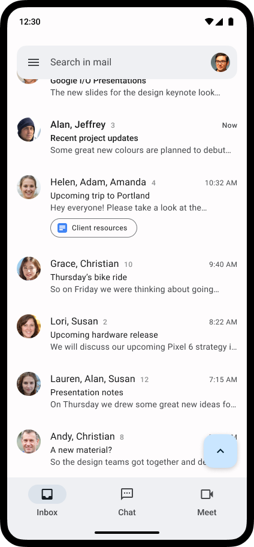
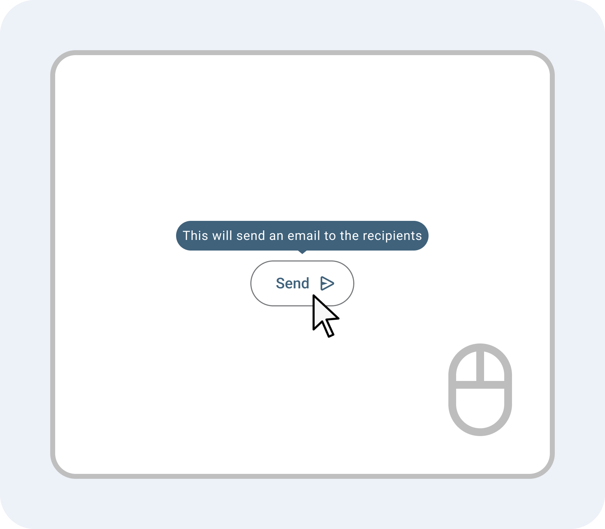
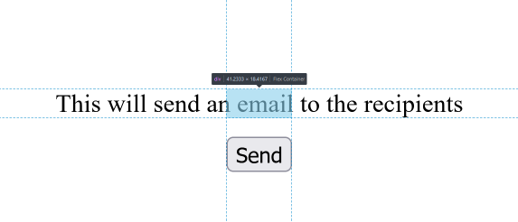
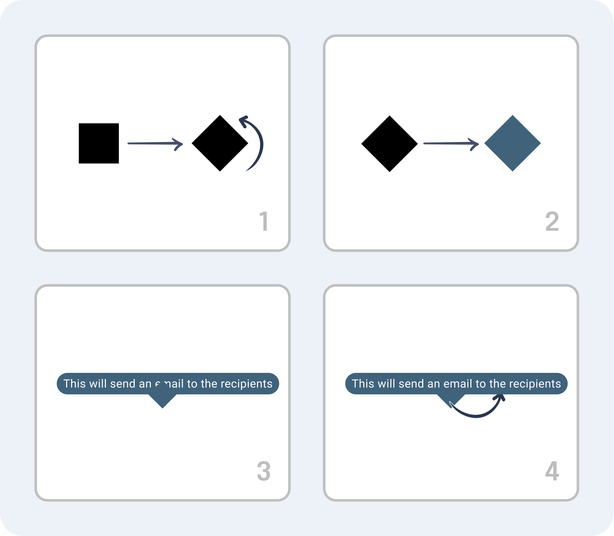

---
{
  title: "Element Reference",
  description: "React, Angular, and Vue provide powerful APIs that let you avoid DOM manipulations most of the time. But sometimes you need to access the underlying DOM. Here's how.",
  published: "2024-03-11T12:08:00.000Z",
  authors: ["crutchcorn"],
  tags: ["react", "angular", "vue", "webdev"],
  attached: [],
  order: 8,
  collection: "framework-field-guide-fundamentals",
  version: "v2",
}
---

While React, Angular, and Vue all provide simple built-in APIs to access events, inputs, and other bindings to underlying HTML elements; sometimes it's just not enough.

For example, let's say that we want to build a right-click menu so that a user can see a relevant list of actions associated with the file the user is currently hovering over:


We're able to build some of this functionality with the APIs we've covered thus far, namely, we can:

- Using our framework's event binding to listen to the browser's [`contextmenu`](https://developer.mozilla.org/en-US/docs/Web/API/Element/contextmenu_event) event which lets us know when the user has right-clicked
- Conditionally rendering the context menu's elements until relevant
- Binding the `style` attribute to position the popup's `x` and `y` value

<!-- ::start:tabs -->

# React

```jsx
/**
 * This code sample is inaccessible and generally not
 * production-grade. It's missing:
 * - Focus on menu open
 * - Closing upon external click
 *
 * Read on to learn how to add these
 */
function App() {
	const [mouseBounds, setMouseBounds] = useState({
		x: 0,
		y: 0,
	});

	const [isOpen, setIsOpen] = useState(false);

	function onContextMenu(e) {
		e.preventDefault();
		setIsOpen(true);
		setMouseBounds({
			// Mouse position on click
			x: e.clientX,
			y: e.clientY,
		});
	}

	return (
		<>
			<div style={{ marginTop: "5rem", marginLeft: "5rem" }}>
				<div onContextMenu={onContextMenu}>Right click on me!</div>
			</div>
			{isOpen && (
				<div
					style={{
						position: "fixed",
						top: `${mouseBounds.y}px`,
						left: `${mouseBounds.x}px`,
						background: "white",
						border: "1px solid black",
						borderRadius: 16,
						padding: "1rem",
					}}
				>
					<button onClick={() => setIsOpen(false)}>X</button>
					This is a context menu
				</div>
			)}
		</>
	);
}
```

<!-- ::start:no-ebook -->
<iframe data-frame-title="React Intro Context Menu - StackBlitz" src="pfp-code:./ffg-fundamentals-react-intro-context-menu-61?template=node&embed=1&file=src%2Fmain.jsx"></iframe>
<!-- ::end:no-ebook -->

# Angular

```angular-ts
/**
 * This code sample is inaccessible and generally not
 * production-grade. It's missing:
 * - Focus on menu open
 * - Closing upon external click
 *
 * Read on to learn how to add these
 */
@Component({
	selector: "app-root",
	changeDetection: ChangeDetectionStrategy.OnPush,
	template: `
		<div style="margin-top: 5rem; margin-left: 5rem">
			<div (contextmenu)="open($event)">Right click on me!</div>
		</div>
		@if (isOpen()) {
			<div
				style="
      position: fixed;
      top: {{ mouseBounds().y }}px;
      left: {{ mouseBounds().x }}px;
      background: white;
      border: 1px solid black;
      border-radius: 16px;
      padding: 1rem;
				"
			>
				<button (click)="close()">X</button>
				This is a context menu
			</div>
		}
	`,
})
class AppComponent {
	isOpen = signal(false);

	mouseBounds = signal({
		x: 0,
		y: 0,
	});

	close() {
		this.isOpen.set(false);
	}

	open(e: MouseEvent) {
		e.preventDefault();
		this.isOpen.set(true);
		this.mouseBounds.set({
			// Mouse position on click
			x: e.clientX,
			y: e.clientY,
		});
	}
}
```

<!-- ::start:no-ebook -->
<iframe data-frame-title="Angular Intro Context Menu - StackBlitz" src="pfp-code:./ffg-fundamentals-angular-intro-context-menu-61?template=node&embed=1&file=src%2Fmain.ts"></iframe>
<!-- ::end:no-ebook -->

# Vue

```vue
<!-- App.vue -->

<!-- This code sample is inaccessible and generally not -->
<!--  production-grade. It's missing:                   -->
<!--  - Focus on menu open                              -->
<!--  - Closing upon external click                     -->
<!--                                                    -->
<!--  Read on to learn how to add these                 -->
<script setup>
import { ref } from "vue";

const isOpen = ref(false);

const mouseBounds = ref({
	x: 0,
	y: 0,
});

const close = () => {
	isOpen.value = false;
};

const open = (e) => {
	e.preventDefault();
	isOpen.value = true;
	mouseBounds.value = {
		// Mouse position on click
		x: e.clientX,
		y: e.clientY,
	};
};
</script>

<template>
	<div style="margin-top: 5rem; margin-left: 5rem">
		<div @contextmenu="open($event)">Right click on me!</div>
	</div>
	<div
		v-if="isOpen"
		:style="`
      position: fixed;
      top: ${mouseBounds.y}px;
      left: ${mouseBounds.x}px;
      background: white;
      border: 1px solid black;
      border-radius: 16px;
      padding: 1rem;
    `"
	>
		<button @click="close()">X</button>
		This is a context menu
	</div>
</template>
```

<!-- ::start:no-ebook -->
<iframe data-frame-title="Vue Intro Context Menu - StackBlitz" src="pfp-code:./ffg-fundamentals-vue-intro-context-menu-61?template=node&embed=1&file=src%2FApp.vue"></iframe>
<!-- ::end:no-ebook -->

<!-- ::end:tabs -->

This works relatively well until we think about two features that are missing:

- Listening for any click outside the popup's contents
- Focusing on the popup's contents when the user right-clicks, keyboard shortcuts apply to the popup immediately

While these features are _possible_ without any newly introduced APIs, they'd both require you to use browser APIs such as [`document.querySelector`](https://developer.mozilla.org/en-US/docs/Web/API/Document/querySelector) to eject away from the framework's limitations.

In those rare events, you want to eject away from the framework controlling your access to HTML nodes; each framework enables you to access the underlying DOM nodes without using browser APIs specifically. This allows our code to still retain full control over the underlying elements while remaining within the reactivity systems these frameworks provide.

In this chapter, we'll learn:

- How to reference the underlying DOM element
- How to reference an array of elements
- Adding focus and external click listening to the context menu
- A code challenge to re-enforce knowledge

# Basic Element References {#basic-el-references}

<br/>
<!-- ::in-content-ad title="Consider supporting" body="Donating any amount will help towards further development of the Framework Field Guide." button-text="Sponsor my work" button-href="https://github.com/sponsors/crutchcorn/" -->

<!-- ::start:tabs -->

## React

In React, there's no simpler demonstration of an element reference than passing a function to an element's `ref` property.

```jsx
const RenderParagraph = () => {
	// el is HTMLElement
	return <p ref={(el) => console.log({ el: el })}>Check your console</p>;
};
```

<!-- ::start:no-ebook -->
<iframe data-frame-title="React Ref Property - StackBlitz" src="pfp-code:./ffg-fundamentals-react-ref-property-62?template=node&embed=1&file=src%2Fmain.jsx"></iframe>
<!-- ::end:no-ebook -->

In this example, once the paragraph tags renders, it will `console.log` the underlying HTML DOM node.

> You may be wondering where the `ref` property has come from, since it's not a known [`HTMLElement`](https://developer.mozilla.org/en-US/docs/Web/API/HTMLElement) property. This is because `ref` is a reserved property by React for this special case.

Knowing that we can pass a function to gain access to the HTML DOM node, we can pass a function that adds an event listener to the HTML element.

```jsx
const RenderButton = () => {
	// el is HTMLElement
	const addClickListener = (el) => {
		el.addEventListener("click", () => {
			alert("User has clicked!");
		});
	};

	return <button ref={addClickListener}>Click me!</button>;
};
```

<!-- ::start:no-ebook -->
<iframe data-frame-title="React addEventListener - StackBlitz" src="pfp-code:./ffg-fundamentals-react-add-event-listener-62?template=node&embed=1&file=src%2Fmain.jsx"></iframe>
<!-- ::end:no-ebook -->

> This is just used as an example of what you can do with the underlying HTML element. While there _are_ perfectly valid reasons for using `ref` to `addEventListener` (we'll touch on one such case later on), it's usually suggested to use `onClick` style event bindings instead.

### `useState` `ref`s {#use-state-refs}

However, this is a problem because our `addEventListener` is never cleaned up! Remember, this is part of the API that `useEffect` provides.

As a result, let's store the value of `el` into a `useState`, then pass that value into a `useEffect`, which will then add the event listener:

```jsx
const CountButton = () => {
	const [count, setCount] = useState(0);
	const [buttonEl, setButtonEl] = useState();

	const storeButton = (el) => {
		setButtonEl(el);
	};

	useEffect(() => {
		// Initial render will not have `buttonEl` defined, subsequent renders will
		if (!buttonEl) return;
		const clickFn = () => {
			/**
			 * We need to use `v => v + 1` instead of `count + 1`, otherwise `count` will
			 * be stale and not update further than `1`. More details in the next paragraph.
			 */
			setCount((v) => v + 1);
		};

		buttonEl.addEventListener("click", clickFn);

		return () => {
			buttonEl.removeEventListener("click", clickFn);
		};
	}, [buttonEl]);

	return (
		<>
			<button ref={storeButton}>Add one</button>
			<p>Count is {count}</p>
		</>
	);
};
```

<!-- ::start:no-ebook -->
<iframe data-frame-title="React useState Ref - StackBlitz" src="pfp-code:./ffg-fundamentals-react-use-state-ref-62?template=node&embed=1&file=src%2Fmain.jsx"></iframe>
<!-- ::end:no-ebook -->

> Once again: You should be using `onClick` to bind a method, this is only to demonstrate how element `ref`s work

You'll notice in this example that within our `useEffect`, we're using a function to update `setCount`. This is because otherwise, we will run into a ["Stale Closure"](/posts/ffg-fundamentals-side-effects#stale-values), which means that our `count` value will never update past `1`.

### Why Aren't We Using `useRef`? {#why-not-useref}

[If you think back to an earlier chapter in the book, "Side Effects", you may remember our usage of a hook called "`useRef`"](/posts/ffg-fundamentals-side-effects#changing-data-without-rendering). Sensibly, based on the name, it's very commonly used with an element's `ref` property. In fact, it's so commonly used to store an element's reference that it even has a shorthand:

```jsx
const App = () => {
	const divRef = useRef();

	// Ta-da! No need to pass a function when using `useRef` and `ref` together
	return <div ref={divRef} />;
};
```

Knowing this, why aren't we using `useRef` in the previous button counter example? Well, the answer goes back to the "Side Effects" chapter once again. Back in the said chapter, [we explained how `useRef` doesn't trigger `useEffect`s as one might otherwise expect](/posts/ffg-fundamentals-side-effects#useref-dont-trigger-useeffect).

Let's look at how using an element reference using `useRef` could cause havoc when binding an event via `addEventListener`. Here, we can see an example of what `useRef` might look like in our `CountButton` example:

```jsx
const CountButton = () => {
	const [count, setCount] = useState(0);
	const buttonRef = useRef();

	useEffect(() => {
		const clickFn = () => {
			setCount((v) => v + 1);
		};

		buttonRef.current.addEventListener("click", clickFn);

		return () => {
			buttonRef.current.removeEventListener("click", clickFn);
		};
		// Do not use a useRef inside of a useEffect like this, it will likely cause bugs
	}, [buttonRef.current]);

	return (
		<>
			<button ref={buttonRef}>Add one</button>
			<p>Count is {count}</p>
		</>
	);
};
```

<!-- ::start:no-ebook -->
<iframe data-frame-title="React useRef Fragile - StackBlitz" src="pfp-code:./ffg-fundamentals-react-use-ref-fragile-62?template=node&embed=1&file=src%2Fmain.jsx"></iframe>
<!-- ::end:no-ebook -->

This works as we would expect because `buttonRef` is defined before the first run of `useEffect`. However, let's add a short delay to the `button`'s rendering. We can do this using a `setTimeout` and another `useEffect`:

```jsx
// This code intentionally doesn't work to demonstrate how `useRef`
//  might not work with `useEffect` as you might think
const CountButton = () => {
	const [count, setCount] = useState(0);
	const buttonRef = useRef();

	const [showButton, setShowButton] = useState(false);

	useEffect(() => {
		const interval = setInterval(() => {
			setShowButton(true);
		}, 1000);

		return () => clearInterval(interval);
	}, []);

	useEffect(() => {
		const clickFn = () => {
			setCount((v) => v + 1);
		};

		if (!buttonRef.current) return;
		buttonRef.current.addEventListener("click", clickFn);

		return () => {
			buttonRef.current.removeEventListener("click", clickFn);
		};
	}, [buttonRef.current]);

	return (
		<>
			{showButton && <button ref={buttonRef}>Add one</button>}
			<p>Count is {count}</p>
		</>
	);
};
```

<!-- ::start:no-ebook -->
<iframe data-frame-title="React useRef Broken - StackBlitz" src="pfp-code:./ffg-fundamentals-react-use-ref-broken-62?template=node&embed=1&file=src%2Fmain.jsx"></iframe>
<!-- ::end:no-ebook -->

Now, if we wait the second it takes to render the `<button>Add one</button>` element and press the button, we'll see that our `click` event handler is never set properly.

This is because `buttonRef.current` is set to `undefined` in the first render, and the mutation of `buttonRef` when the `<button>` element is rendered does not trigger a re-render, which in turn does not re-run `useEffect` to add the event binding.

> This is not to say that you shouldn't use `useRef` for element reference, just that you should be aware of its downfalls and alternatives.
>
> We'll see some usage of the `ref` property with `useRef` in a bit.

## Angular

Using `viewChild`, we can access an [HTMLElement](https://developer.mozilla.org/en-US/docs/Web/API/HTMLElement) that's within an Angular component's `template`:

```angular-ts
@Component({
	selector: "paragraph-tag",
	changeDetection: ChangeDetectionStrategy.OnPush,
	template: `<p #pTag>Hello, world!</p>`,
})
class RenderParagraphComponent {
	pTag = viewChild.required("pTag", {read: ElementRef<HTMLElement>});
}
```

You may notice that our `<p>` tag has an attribute prefixed with a pound sign (`#`). This pound-sign prefixed attribute allows Angular to associate the element with a "template reference variable," which can then be referenced inside our `viewChild` to gain access to an element.

For example, the `#pTag` attribute assigns the template reference variable named `"pTag"` to the `<p>` element and allows `viewChild` to find that element based on the variable's name.

---

Now that we have access to the underlying `<p>` element let's print it out inside an `effect`:

```angular-ts
@Component({
  selector: 'paragraph-tag',
  changeDetection: ChangeDetectionStrategy.OnPush,
  template: ` <p #pTag>Hello, world!</p> `,
})
class RenderParagraphComponent {
  pTag = viewChild.required('pTag', { read: ElementRef<HTMLElement> });

  constructor() {
    effect(() => {
      console.log(this.pTag());
    });
  }
}
```

This works! If we look at our log, we see `{nativeElement: p}` in our console.

// TODO: Add iframe

### `viewChild` Timings {#after-render-view-child}

Now let's make the `paragraph-tag` conditionally render our `"Hello, world"` message using a control flow block and:

```angular-ts
@Component({
  selector: "paragraph-tag",
  changeDetection: ChangeDetectionStrategy.OnPush,
  template: `
    @if (true) {
        <p #pTag>Hello, world!</p>
    }`,
})
class RenderParagraphComponent {
  pTag = viewChild.required("pTag", {read: ElementRef<HTMLElement>});

  constructor() {
    effect(() => {
      console.log(this.pTag());
    });
  }
}
```

> ERROR RuntimeError: NG0951: Child query result is required but no value is available. Find more at https://angular.dev/errors/NG0951

Oh dear! This error is being thrown by the `.required` part of `viewChild`, telling us that `pTag` was not found by the time the value was read. Even if we remove `.required`, `pTag` is still `undefined` when `effect` is first ran.

// TODO: Add iframe

> Why is that?

Well, Angular doesn't yet know that `<p>` is going to exist due to the `@if` block. It might or it might not, depending on the input.

As a result, the `viewChild` is not accessible until after the component's first render; when Angular has had time to figure out if it should display the element and renders it to the DOM based off of the respective input.

To solve for this, we need to move away from reading the `viewChild` using `effect` and instead read it using `afterRenderEffect`:

```angular-ts {13-15}
@Component({
  selector: "paragraph-tag",
  changeDetection: ChangeDetectionStrategy.OnPush,
  template: `
    @if (true) {
        <p #pTag>Hello, world!</p>
    }`,
})
class RenderParagraphComponent {
  pTag = viewChild.required("pTag", {read: ElementRef<HTMLElement>});

  constructor() {
    afterRenderEffect(() => {
      console.log(this.pTag());
    });
  }
}
```

Update that value and ba-da-bing ba-da-boom, everything's up and running!

// TODO: Add iframe

<iframe data-frame-title="Angular ViewChild - StackBlitz" src="pfp-code:./ffg-fundamentals-angular-view-child-62?template=node&embed=1&file=src%2Fmain.ts"></iframe>
<!-- ::end:no-ebook -->

### Adding an Event Listener Using `viewChild` {#adding-event-listener-viewchild}

Now that we know how to use `viewChild`, we can add an `addEventListener` and `removeEventListener` to manually bind a `button`'s `click` event:

```angular-ts
@Component({
	selector: "paragraph-tag",
	changeDetection: ChangeDetectionStrategy.OnPush,
	template: `
		<button #btn>Add one</button>
		<p>Count is {{ count() }}</p>
	`,
})
class RenderParagraphComponent {
	btn = viewChild.required("btn", { read: ElementRef<HTMLElement> });

	count = signal(0);

	addOne = () => {
		this.count.set(this.count() + 1);
	};

	constructor() {
		afterRenderEffect((onCleanup) => {
			this.btn().nativeElement.addEventListener("click", this.addOne);
			onCleanup(() => {
				this.btn().nativeElement.removeEventListener("click", this.addOne);
			});
		});
	}
}
```

<!-- ::start:no-ebook -->
<iframe data-frame-title="Angular addEventListener - StackBlitz" src="pfp-code:./ffg-fundamentals-angular-add-event-listener-62?template=node&embed=1&file=src%2Fmain.ts"></iframe>
<!-- ::end:no-ebook -->

> Remember, the `addOne` function cannot be a class method, as otherwise [it will not clean up inside the `removeEventListener` properly.](/posts/javascript-bind-usage#event-listeners)

## Vue

Vue's ability to store reactive data using `ref` enables a super simplistic API to access DOM nodes and create a `ref` with the same variable name as a `ref` property of an element's `ref` attribute value.

```vue
<!-- App.vue -->
<script setup>
import { ref, onMounted } from "vue";

// Assign the ref
const el = ref();

// Use the ref
onMounted(() => {
	console.log(el);
});
</script>

<template>
	<p ref="el">Check your console</p>
</template>
```

<!-- ::start:no-ebook -->
<iframe data-frame-title="Vue Ref - StackBlitz" src="pfp-code:./ffg-fundamentals-vue-ref-62?template=node&embed=1&file=src%2FApp.vue"></iframe>
<!-- ::end:no-ebook -->

Here, `el.value` points to an [HTMLElement](https://developer.mozilla.org/en-US/docs/Web/API/HTMLElement) of the `p` tag within `template`.

Vue also allows you to pass a function to `ref` in order to run a function when the `ref` is being set, like so:

```vue
<!-- App.vue -->
<script setup>
function logEl(el) {
	console.log(el);
}
</script>

<template>
	<p :ref="logEl">Check your console</p>
</template>
```

<!-- ::start:no-ebook -->
<iframe data-frame-title="Vue Function Ref - StackBlitz" src="pfp-code:./ffg-fundamentals-vue-function-ref-62?template=node&embed=1&file=src%2FApp.vue"></iframe>
<!-- ::end:no-ebook -->

<!-- ::end:tabs -->

# How to Keep an Array of Element References {#array-of-elements}

Let's say that we're building an email application and want to provide the user a button that scrolls them to the top of their messages quickly.



One way of building out this button is to store each underlying message's DOM element in the array into an element reference then use the top and bottom [elements' `scrollIntoView` method](https://developer.mozilla.org/en-US/docs/Web/API/Element/scrollIntoView) to bring them onto the page visually.

Let's see how that's done with each framework.

<!-- ::start:tabs -->

## React

React's ability to persist data within a `useRef` allows us to create an index-based array to store our elements into.

Using this array, we can then access the `0`th and last index (using `messages.length - 1`) to indicate the first and last element, respectively.

```jsx
const messages = [
	"The new slides for the design keynote look wonderful!",
	"Some great new colours are planned to debut with Material Next!",
	"Hey everyone! Please take a look at the resources I’ve attached.",
	"So on Friday we were thinking about going through that park you’ve recommended.",
	"We will discuss our upcoming Pixel 6 strategy in the following week.",
	"On Thursday we drew some great new ideas for our talk.",
	"So the design teams got together and decided everything should be made of sand.",
];

function App() {
	const messagesRef = useRef([]);

	const scrollToTop = () => {
		messagesRef.current[0].scrollIntoView();
	};

	const scrollToBottom = () => {
		messagesRef.current[messagesRef.current.length - 1].scrollIntoView();
	};

	return (
		<div>
			<button onClick={scrollToTop}>Scroll to top</button>
			<ul style={{ height: "50px", overflow: "scroll" }}>
				{messages.map((message, i) => {
					return (
						<li key={i} ref={(el) => (messagesRef.current[i] = el)}>
							{message}
						</li>
					);
				})}
			</ul>
			<button onClick={scrollToBottom}>Scroll to bottom</button>
		</div>
	);
}
```

<!-- ::start:no-ebook -->
<iframe data-frame-title="React Multi-Element Ref - StackBlitz" src="pfp-code:./ffg-fundamentals-react-multi-element-ref-63?template=node&embed=1&file=src%2Fmain.jsx"></iframe>
<!-- ::end:no-ebook -->

## Angular

Just as there is a `viewChild` to gain access to a single underlying HTML element, you can also use a `viewChildren` to access more than one or more template elements using similar APIs.

Using `viewChildren`, we can access in-template variables (prefixed with `#`) to `scrollIntoView` the first and last elements.

```angular-ts
@Component({
	selector: "app-root",
	changeDetection: ChangeDetectionStrategy.OnPush,
	template: `
		<div>
			<button (click)="scrollToTop()">Scroll to top</button>
			<ul style="height: 100px; overflow: scroll">
				@for (message of messages; track message) {
                    <!-- Create a new template variable called listItem -->
					<!-- for each item in the `messages` array -->
					<li #listItem>
						{{ message }}
					</li>
				}
			</ul>
			<button (click)="scrollToBottom()">Scroll to bottom</button>
		</div>
	`,
})
class AppComponent {
	// Reference the template variable `listItem`
	els = viewChildren("listItem", { read: ElementRef<HTMLElement> });

	scrollToTop() {
		this.els()[0]!.nativeElement.scrollIntoView();
	}

	scrollToBottom() {
		this.els()[this.els().length - 1]!.nativeElement.scrollIntoView();
	}

	messages = [
		"The new slides for the design keynote look wonderful!",
		"Some great new colours are planned to debut with Material Next!",
		"Hey everyone! Please take a look at the resources I’ve attached.",
		"So on Friday we were thinking about going through that park you’ve recommended.",
		"We will discuss our upcoming Pixel 6 strategy in the following week.",
		"On Thursday we drew some great new ideas for our talk.",
		"So the design teams got together and decided everything should be made of sand.",
	];
}
```

<!-- ::start:no-ebook -->
<iframe data-frame-title="Angular Multi-Element Ref - StackBlitz" src="pfp-code:./ffg-fundamentals-angular-multi-element-ref-63?template=node&embed=1&file=src%2Fmain.ts"></iframe>
<!-- ::end:no-ebook -->

## Vue

Vue has a handy feature that [enables you to create an array of referenced elements using nothing more than a string inside a `ref` attribute](https://vuejs.org/guide/essentials/template-refs.html#refs-inside-v-for). This then turns the `ref` of the same name into an array that we can access as expected.

```vue
<!-- App.vue -->
<script setup>
import { ref } from "vue";

const items = ref([]);

function scrollToTop() {
	items.value[0].scrollIntoView();
}

function scrollToBottom() {
	items.value[items.value.length - 1].scrollIntoView();
}

const messages = [
	"The new slides for the design keynote look wonderful!",
	"Some great new colours are planned to debut with Material Next!",
	"Hey everyone! Please take a look at the resources I’ve attached.",
	"So on Friday we were thinking about going through that park you’ve recommended.",
	"We will discuss our upcoming Pixel 6 strategy in the following week.",
	"On Thursday we drew some great new ideas for our talk.",
	"So the design teams got together and decided everything should be made of sand.",
];
</script>

<template>
	<div>
		<button @click="scrollToTop()">Scroll to top</button>
		<ul style="height: 100px; overflow: scroll">
			<li v-for="(message, i) of messages" :key="i" ref="items">
				{{ message }}
			</li>
		</ul>
		<button @click="scrollToBottom()">Scroll to bottom</button>
	</div>
</template>
```

<!-- ::start:no-ebook -->
<iframe data-frame-title="Vue Multi-Element Ref - StackBlitz" src="pfp-code:./ffg-fundamentals-vue-multi-element-ref-63?template=node&embed=1&file=src%2FApp.vue"></iframe>
<!-- ::end:no-ebook -->

<!-- ::end:tabs -->

# Real World Usage {#real-world-usage}

Now that we know how to access an underlying HTML element in our given framework let's go back to our previous context menu example from the start of the chapter.

See, while our context menu was able to show properly, we were missing two distinct features:

1. Focusing the dropdown element when opened
2. Closing the context menu when the user clicks elsewhere


Let's add this functionality to our context menu component.

To add the first feature, we'll [focus on the context menu using `element.focus()`](https://developer.mozilla.org/en-US/docs/Web/API/HTMLElement/focus) in order to make sure that keyboard users aren't lost when trying to use the feature.

To add the second feature, let's:

- Add a listener for any time the user clicks on a page
- Inside that click listener, get [the event's `target` property](https://developer.mozilla.org/en-US/docs/Web/API/Event/target)
  - The event target is the element that the user is taking an action on - AKA the element the user is currently clicking on
- We then [check if that `target` is inside the context menu or not using the `element.contains` method](https://developer.mozilla.org/en-US/docs/Web/API/Node/contains).

This code in vanilla JavaScript might look something like this:

```html
<button id="clickInside">
	If you click outside of this button, it will hide
</button>
<script>
	const clickInsideButton = document.querySelector("#clickInside");

	function listenForOutsideClicks(e) {
		// This check is saying "`true` if the clicked element is a child of the 'clickInside' button"
		const isClickInside = clickInsideButton.contains(e.target);
		if (isClickInside) return;
		// Hide the button using CSS. In frameworks, we'd use conditional rendering.
		clickInsideButton.style.display = "none";
	}

	document.addEventListener("click", listenForOutsideClicks);
</script>
```

Let's port this logic to React, Angular, and Vue:

<!-- ::start:tabs -->

## React

Let's add a `ref` usage that stores our `contextMenu` inside of a `useState`.

Then, when we change the value of `contextMenu`, we can `.focus` the element and use the `addEventListener` code from above:

```jsx
function App() {
	const [mouseBounds, setMouseBounds] = useState({
		x: 0,
		y: 0,
	});

	const [isOpen, setIsOpen] = useState(false);

	function onContextMenu(e) {
		e.preventDefault();
		setIsOpen(true);
		setMouseBounds({
			x: e.clientX,
			y: e.clientY,
		});
	}

	const [contextMenu, setContextMenu] = useState();

	useEffect(() => {
		if (contextMenu) {
			contextMenu.focus();
		}
	}, [contextMenu]);

	useEffect(() => {
		if (!contextMenu) return;
		const closeIfOutsideOfContext = (e) => {
			const isClickInside = contextMenu.contains(e.target);
			if (isClickInside) return;
			setIsOpen(false);
		};
		document.addEventListener("click", closeIfOutsideOfContext);
		return () => document.removeEventListener("click", closeIfOutsideOfContext);
	}, [contextMenu]);

	return (
		<>
			<div style={{ marginTop: "5rem", marginLeft: "5rem" }}>
				<div onContextMenu={onContextMenu}>Right click on me!</div>
			</div>
			{isOpen && (
				<div
					ref={(el) => setContextMenu(el)}
					tabIndex={0}
					style={{
						position: "fixed",
						top: mouseBounds.y,
						left: mouseBounds.x,
						background: "white",
						border: "1px solid black",
						borderRadius: 16,
						padding: "1rem",
					}}
				>
					<button onClick={() => setIsOpen(false)}>X</button>
					This is a context menu
				</div>
			)}
		</>
	);
}
```

<!-- ::start:no-ebook -->
<iframe data-frame-title="React Real World Usage - StackBlitz" src="pfp-code:./ffg-fundamentals-react-real-world-usage-64?template=node&embed=1&file=src%2Fmain.jsx"></iframe>
<!-- ::end:no-ebook -->

## Angular

We can adopt the above code and place it within our `ngAfterViewInit` lifecycle method to add the `addEventListener` to our context menu.

Additionally, we'll use `ViewChild` to track the `contextMenu` element and `.focus` it when it becomes active.

> We need to use a `setTimeout` in our `open` method to make sure the HTML element renders before our `focus` call.

```angular-ts
@Component({
	selector: "app-root",
	changeDetection: ChangeDetectionStrategy.OnPush,
	template: `
		<div style="margin-top: 5rem; margin-left: 5rem">
			<div (contextmenu)="open($event)">Right click on me!</div>
		</div>
		@if (isOpen()) {
			<div
				tabIndex="0"
				#contextMenu
				style="
      position: fixed;
      top: {{ mouseBounds().y }}px;
      left: {{ mouseBounds().x }}px;
      background: white;
      border: 1px solid black;
      border-radius: 16px;
      padding: 1rem;
				"
			>
				<button (click)="close()">X</button>
				This is a context menu
			</div>
		}
	`,
})
class AppComponent {
	contextMenu = viewChild("contextMenu", { read: ElementRef<HTMLElement> });

	isOpen = signal(false);

	mouseBounds = signal({
		x: 0,
		y: 0,
	});

	closeIfOutsideOfContext = (e: MouseEvent) => {
		const contextMenuEl = this.contextMenu()?.nativeElement;
		if (!contextMenuEl) return;
		const isClickInside = contextMenuEl.contains(e.target as HTMLElement);
		if (isClickInside) return;
		this.isOpen.set(false);
	};

	constructor() {
		afterRenderEffect((onCleanup) => {
			document.addEventListener("click", this.closeIfOutsideOfContext);
			onCleanup(() => {
				document.removeEventListener("click", this.closeIfOutsideOfContext);
			});
		});
	}

	close() {
		this.isOpen.set(false);
	}

	open(e: MouseEvent) {
		e.preventDefault();
		this.isOpen.set(true);
		this.mouseBounds.set({
			x: e.clientX,
			y: e.clientY,
		});
		// Wait until the element is rendered before focusing it
		setTimeout(() => {
			this.contextMenu()?.nativeElement.focus();
		}, 0);
	}
}
```

<!-- ::start:no-ebook -->
<iframe data-frame-title="Angular Real World Usage - StackBlitz" src="pfp-code:./ffg-fundamentals-angular-real-world-usage-64?template=node&embed=1&file=src%2Fmain.ts"></iframe>
<!-- ::end:no-ebook -->

## Vue

Let's adopt the above click listener and apply it within our `onMounted` lifecycle method.

We'll also use a callback ref to run a function every time the context menu is open. This function will then either do nothing or call `.focus` on the element depending on whether it's rendered or not.

```vue
<!-- App.vue -->
<script setup>
import { ref, onMounted, onUnmounted } from "vue";

const isOpen = ref(false);

const mouseBounds = ref({
	x: 0,
	y: 0,
});

const contextMenuRef = ref(null);

function closeIfOutside(e) {
	const contextMenuEl = contextMenuRef.value;
	if (!contextMenuEl) return;
	const isClickInside = contextMenuEl.contains(e.target);
	if (isClickInside) return;
	isOpen.value = false;
}

onMounted(() => {
	document.addEventListener("click", closeIfOutside);
});

onUnmounted(() => {
	document.removeEventListener("click", closeIfOutside);
});

const close = () => {
	isOpen.value = false;
};

const open = (e) => {
	e.preventDefault();
	isOpen.value = true;
	mouseBounds.value = {
		x: e.clientX,
		y: e.clientY,
	};
};

function focusOnOpen(el) {
	contextMenuRef.value = el;
	if (!el) return;
	el.focus();
}
</script>

<template>
	<div style="margin-top: 5rem; margin-left: 5rem">
		<div @contextmenu="open($event)">Right click on me!</div>
	</div>
	<div
		v-if="isOpen"
		:ref="(el) => focusOnOpen(el)"
		tabIndex="0"
		:style="`
      position: fixed;
      top: ${mouseBounds.y}px;
      left: ${mouseBounds.x}px;
      background: white;
      border: 1px solid black;
      border-radius: 16px;
      padding: 1rem;
    `"
	>
		<button @click="close()">X</button>
		This is a context menu
	</div>
</template>
```

<!-- ::start:no-ebook -->
<iframe data-frame-title="Vue Real World Usage - StackBlitz" src="pfp-code:./ffg-fundamentals-vue-real-world-usage-64?template=node&embed=1&file=src%2FApp.vue"></iframe>
<!-- ::end:no-ebook -->

<!-- ::end:tabs -->

# Challenge {#challenge}

Let's build out a fresh component from our understanding of element reference.

Specifically, let's build out tooltip functionality so that when the user hovers over a button for a second or longer, it displays a popup message to help the user understand how it's used.



To do this, we'll need to consider a few things:

1. How to track when the user has hovered over an element for a second or longer
2. How to remove the popup when the user has moved their mouse
3. Make sure the tooltip is positioned above the button
4. Make sure the tooltip is horizontally centered
5. Adding any necessary polish

## Step 1: Track When the User Has Hovered an Element {#challenge-step-1}

To track when an element is being hovered, we can use [the `mouseover` HTML event](https://developer.mozilla.org/en-US/docs/Web/API/Element/mouseover_event).

To make sure the user has been hovering for at least 1 second, we can add a `setTimeout` to delay the display of the tooltip.

> Remember to clean up the `setTimeout` when the component is unrendered!

<!-- ::start:tabs -->

### React

```jsx
function App() {
	const buttonRef = useRef();

	const mouseOverTimeout = useRef();

	const [tooltipMeta, setTooltipMeta] = useState({
		show: false,
	});

	const onMouseOver = () => {
		mouseOverTimeout.current = setTimeout(() => {
			setTooltipMeta({
				show: true,
			});
		}, 1000);
	};

	useEffect(() => {
		return () => {
			clearTimeout(mouseOverTimeout.current);
		};
	}, []);

	return (
		<div style={{ padding: "10rem" }}>
			<button onMouseOver={onMouseOver} ref={buttonRef}>
				Send
			</button>
			{tooltipMeta.show && <div>This will send an email to the recipients</div>}
		</div>
	);
}
```

### Angular

```angular-ts
@Component({
	selector: "app-root",
	changeDetection: ChangeDetectionStrategy.OnPush,
	template: `
		<div style="padding: 10rem">
			<button #buttonRef (mouseover)="onMouseOver()">Send</button>
			@if (tooltipMeta().show) {
				<div>
					This will send an email to the recipients
				</div>
			}
		</div>
	`,
})
class AppComponent {
	buttonRef = viewChild.required("buttonRef", {
		read: ElementRef<HTMLElement>,
	});

	tooltipMeta = signal({
		show: false,
	});

	mouseOverTimeout: any = null;

	onMouseOver() {
		this.mouseOverTimeout = setTimeout(() => {
			this.tooltipMeta.set({
				show: true,
			});
		}, 1000);
	}

	constructor() {
		effect((onCleanup) => {
			clearTimeout(this.mouseOverTimeout);
		});
	}
}
```

### Vue

```vue
<!-- App.vue -->
<script setup>
import { ref, onUnmounted } from "vue";

const buttonRef = ref();

const mouseOverTimeout = ref(null);

const tooltipMeta = ref({
	show: false,
});

const onMouseOver = () => {
	mouseOverTimeout.value = setTimeout(() => {
		tooltipMeta.value = {
			show: true,
		};
	}, 1000);
};

onUnmounted(() => {
	clearTimeout(mouseOverTimeout.current);
});
</script>

<template>
	<div style="padding: 10rem">
		<button ref="buttonRef" @mouseover="onMouseOver()">Send</button>
		<div v-if="tooltipMeta.show">This will send an email to the recipients</div>
	</div>
</template>
```

<!-- ::end:tabs -->

## Step 2: Remove the Element When the User Stops Hovering {#challenge-step-2}

Now that we have our tooltip showing up when we'd expect it, let's remove it when we stop hovering on the button element.

To do this, we'll use [the `mouseleave` HTML event](https://developer.mozilla.org/en-US/docs/Web/API/Element/mouseleave_event) to set `show` to `false` and cancel the timer to show the tooltip if the event is active.

<!-- ::start:tabs -->

### React

```jsx
function App() {
	const buttonRef = useRef();

	const mouseOverTimeout = useRef();

	const [tooltipMeta, setTooltipMeta] = useState({
		show: false,
	});

	const onMouseOver = () => {
		mouseOverTimeout.current = setTimeout(() => {
			setTooltipMeta({
				show: true,
			});
		}, 1000);
	};

	const onMouseLeave = () => {
		setTooltipMeta({
			show: false,
		});
		clearTimeout(mouseOverTimeout.current);
	};

	useEffect(() => {
		return () => {
			clearTimeout(mouseOverTimeout.current);
		};
	}, []);

	return (
		<div style={{ padding: "10rem" }}>
			<button
				onMouseOver={onMouseOver}
				onMouseLeave={onMouseLeave}
				ref={buttonRef}
			>
				Send
			</button>
			{tooltipMeta.show && <div>This will send an email to the recipients</div>}
		</div>
	);
}
```

### Angular

```angular-ts
@Component({
	selector: "app-root",
	changeDetection: ChangeDetectionStrategy.OnPush,
	template: `
		<div style="padding: 10rem">
			<button
				#buttonRef
				(mouseover)="onMouseOver()"
				(mouseleave)="onMouseLeave()"
			>
				Send
			</button>
			@if (tooltipMeta().show) {
				<div>
					This will send an email to the recipients
				</div>
			}
		</div>
	`,
})
class AppComponent {
	buttonRef = viewChild.required("buttonRef", {
		read: ElementRef<HTMLElement>,
	});

	tooltipMeta = signal({
		show: false,
	});

	mouseOverTimeout: any = null;

	onMouseOver() {
		this.mouseOverTimeout = setTimeout(() => {
			this.tooltipMeta.set({
				show: true,
			});
		}, 1000);
	}

	onMouseLeave() {
		this.tooltipMeta.set({
			show: false,
		});
		clearTimeout(this.mouseOverTimeout);
	}

	constructor() {
		effect((onCleanup) => {
			clearTimeout(this.mouseOverTimeout);
		});
	}
}
```

### Vue

```vue
<!-- App.vue -->
<script setup>
import { ref, onUnmounted } from "vue";

const buttonRef = ref();

const mouseOverTimeout = ref(null);

const tooltipMeta = ref({
	show: false,
});

const onMouseOver = () => {
	mouseOverTimeout.value = setTimeout(() => {
		tooltipMeta.value = {
			show: true,
		};
	}, 1000);
};

const onMouseLeave = () => {
	tooltipMeta.value = {
		show: false,
	};
	clearTimeout(mouseOverTimeout.current);
};

onUnmounted(() => {
	clearTimeout(mouseOverTimeout.current);
});
</script>

<template>
	<div style="padding: 10rem">
		<button
			ref="buttonRef"
			@mouseover="onMouseOver()"
			@mouseleave="onMouseLeave()"
		>
			Send
		</button>
		<div v-if="tooltipMeta.show">This will send an email to the recipients</div>
	</div>
</template>
```

<!-- ::end:tabs -->

## Step 3: Placing the Tooltip above the Button {#challenge-step-3}

To place the tooltip above the button, we'll measure the button's position, height, and width using an element reference and [the `HTMLElement`'s method of `getBoundingClientRect`](https://developer.mozilla.org/en-US/docs/Web/API/Element/getBoundingClientRect).

We'll then use this positional data alongside [the CSS `position: fixed`](https://developer.mozilla.org/en-US/docs/Web/CSS/position) to position the tooltip to be placed `8px` above the `y` axis of the button:

<!-- ::start:tabs -->

### React

```jsx
function App() {
	const buttonRef = useRef();

	const mouseOverTimeout = useRef();

	const [tooltipMeta, setTooltipMeta] = useState({
		x: 0,
		y: 0,
		height: 0,
		width: 0,
		show: false,
	});

	const onMouseOver = () => {
		mouseOverTimeout.current = setTimeout(() => {
			const bounding = buttonRef.current.getBoundingClientRect();
			setTooltipMeta({
				x: bounding.x,
				y: bounding.y,
				height: bounding.height,
				width: bounding.width,
				show: true,
			});
		}, 1000);
	};

	const onMouseLeave = () => {
		setTooltipMeta({
			x: 0,
			y: 0,
			height: 0,
			width: 0,
			show: false,
		});
		clearTimeout(mouseOverTimeout.current);
	};

	useEffect(() => {
		return () => {
			clearTimeout(mouseOverTimeout.current);
		};
	}, []);

	return (
		<div style={{ padding: "10rem" }}>
			{tooltipMeta.show && (
				<div
					style={{
						position: "fixed",
						top: `${tooltipMeta.y - tooltipMeta.height - 8}px`,
					}}
				>
					This will send an email to the recipients
				</div>
			)}
			<button
				onMouseOver={onMouseOver}
				onMouseLeave={onMouseLeave}
				ref={buttonRef}
			>
				Send
			</button>
		</div>
	);
}
```

### Angular

```angular-ts
@Component({
	selector: "app-root",
	standalone: true,
	template: `
		<div style="padding: 10rem">
			@if (tooltipMeta().show) {
				<div
                	style="
        position: fixed;
        top: {{ tooltipMeta().y - tooltipMeta().height - 8 }}px;
					"
				>
					This will send an email to the recipients
				</div>
				<button
					#buttonRef
					(mouseover)="onMouseOver()"
					(mouseleave)="onMouseLeave()"
				>
					Send
				</button>
			</div>
		}
	`,
})
class AppComponent {
	buttonRef = viewChild.required("buttonRef", {
		read: ElementRef<HTMLElement>,
	});

	tooltipMeta = signal({
		x: 0,
		y: 0,
		height: 0,
		width: 0,
		show: false,
	});

	mouseOverTimeout: any = null;

	onMouseOver() {
		this.mouseOverTimeout = setTimeout(() => {
			const bounding = this.buttonRef().nativeElement.getBoundingClientRect();
			this.tooltipMeta.set({
				x: bounding.x,
				y: bounding.y,
				height: bounding.height,
				width: bounding.width,
				show: true,
			});
		}, 1000);
	}

	onMouseLeave() {
		this.tooltipMeta.set({
			x: 0,
			y: 0,
			height: 0,
			width: 0,
			show: false,
		});
		clearTimeout(this.mouseOverTimeout);
	}

	constructor() {
		effect((onCleanup) => {
			clearTimeout(this.mouseOverTimeout);
		});
	}
}
```

### Vue

```vue
<!-- App.vue -->
<script setup>
import { ref, onUnmounted } from "vue";

const buttonRef = ref();

const mouseOverTimeout = ref(null);

const tooltipMeta = ref({
	x: 0,
	y: 0,
	height: 0,
	width: 0,
	show: false,
});

const onMouseOver = () => {
	mouseOverTimeout.value = setTimeout(() => {
		const bounding = buttonRef.value.getBoundingClientRect();
		tooltipMeta.value = {
			x: bounding.x,
			y: bounding.y,
			height: bounding.height,
			width: bounding.width,
			show: true,
		};
	}, 1000);
};

const onMouseLeave = () => {
	tooltipMeta.value = {
		x: 0,
		y: 0,
		height: 0,
		width: 0,
		show: false,
	};
	clearTimeout(mouseOverTimeout.current);
};

// Just in case
onUnmounted(() => {
	clearTimeout(mouseOverTimeout.current);
});
</script>

<template>
	<div style="padding: 10rem">
		<div
			v-if="tooltipMeta.show"
			:style="`
        position: fixed;
        top: ${tooltipMeta.y - tooltipMeta.height - 8}px;
      `"
		>
			This will send an email to the recipients
		</div>
		<button
			ref="buttonRef"
			@mouseover="onMouseOver()"
			@mouseleave="onMouseLeave()"
		>
			Send
		</button>
	</div>
</template>
```

<!-- ::end:tabs -->

## Step 4: Centering the Tooltip Horizontally {#challenge-step-4}

To center a `position: fixed` element is a challenge and a half. While there's half a dozen ways we could go about this, we're going to opt for a solution that involves:

- Creating a `<div>` with the same width as the button
- Making this `<div>` a `display: flex` element with `justify-content: center` CSS applied to center all children
- Allowing overflow inside the `div` using `overflow: visible`
- Placing our tooltip's text inside the `<div>` with `white-space: nowrap` applied to avoid our text wrapping to meet the `<div>` width.

This works because the `<div>`'s position should mirror the button's and allow content to be centered around it, like so:



In the end, our styling should look something like this HTML markup:

```html
<div style="padding: 10rem">
	<!-- The PX values here may differ on your system -->
	<div
		style="
      display: flex;
      overflow: visible;
      justify-content: center;
      width: 40.4667px;
      position: fixed;
      top: 138.8px;
      left: 168px;
    "
	>
		<div style="white-space: nowrap">
			This will send an email to the recipients
		</div>
	</div>
	<button>Send</button>
</div>
```

Let's implement this within our frameworks:

<!-- ::start:tabs -->

### React

```jsx
function App() {
	const buttonRef = useRef();

	const mouseOverTimeout = useRef();

	const [tooltipMeta, setTooltipMeta] = useState({
		x: 0,
		y: 0,
		height: 0,
		width: 0,
		show: false,
	});

	const onMouseOver = () => {
		mouseOverTimeout.current = setTimeout(() => {
			const bounding = buttonRef.current.getBoundingClientRect();
			setTooltipMeta({
				x: bounding.x,
				y: bounding.y,
				height: bounding.height,
				width: bounding.width,
				show: true,
			});
		}, 1000);
	};

	const onMouseLeave = () => {
		setTooltipMeta({
			x: 0,
			y: 0,
			height: 0,
			width: 0,
			show: false,
		});
		clearTimeout(mouseOverTimeout.current);
	};

	useEffect(() => {
		return () => {
			clearTimeout(mouseOverTimeout.current);
		};
	}, []);

	return (
		<div style={{ padding: "10rem" }}>
			{tooltipMeta.show && (
				<div
					style={{
						overflow: "visible",
						position: "fixed",
						top: `${tooltipMeta.y - tooltipMeta.height - 8}px`,
						display: "flex",
						justifyContent: "center",
						width: `${tooltipMeta.width}px`,
						left: `${tooltipMeta.x}px`,
					}}
				>
					<div
						style={{
							whiteSpace: "nowrap",
						}}
					>
						This will send an email to the recipients
					</div>
				</div>
			)}
			<button
				onMouseOver={onMouseOver}
				onMouseLeave={onMouseLeave}
				ref={buttonRef}
			>
				Send
			</button>
		</div>
	);
}
```

### Angular

```angular-ts
@Component({
	selector: "app-root",
	changeDetection: ChangeDetectionStrategy.OnPush,
	template: `
		<div style="padding: 10rem">
			@if (tooltipMeta().show) {
				<div
					style="
        display: flex;
        overflow: visible;
        justify-content: center;
        width: {{ tooltipMeta().width }}px;
        position: fixed;
        top: {{ tooltipMeta().y - tooltipMeta().height - 8 }}px;
        left: {{ tooltipMeta().x }}px;
					"
				>
					<div
						style="
          white-space: nowrap;
        "
					>
						This will send an email to the recipients
					</div>
				</div>
			}
			<button
				#buttonRef
				(mouseover)="onMouseOver()"
				(mouseleave)="onMouseLeave()"
			>
				Send
			</button>
		</div>
	`,
})
class AppComponent {
	buttonRef = viewChild.required("buttonRef", {
		read: ElementRef<HTMLElement>,
	});

	tooltipMeta = signal({
		x: 0,
		y: 0,
		height: 0,
		width: 0,
		show: false,
	});

	mouseOverTimeout: any = null;

	onMouseOver() {
		this.mouseOverTimeout = setTimeout(() => {
			const bounding = this.buttonRef().nativeElement.getBoundingClientRect();
			this.tooltipMeta.set({
				x: bounding.x,
				y: bounding.y,
				height: bounding.height,
				width: bounding.width,
				show: true,
			});
		}, 1000);
	}

	onMouseLeave() {
		this.tooltipMeta.set({
			x: 0,
			y: 0,
			height: 0,
			width: 0,
			show: false,
		});
		clearTimeout(this.mouseOverTimeout);
	}

	constructor() {
		effect((onCleanup) => {
			clearTimeout(this.mouseOverTimeout);
		});
	}
}
```

### Vue

```vue
<!-- App.vue -->
<script setup>
import { ref, onUnmounted } from "vue";

const buttonRef = ref();

const mouseOverTimeout = ref(null);

const tooltipMeta = ref({
	x: 0,
	y: 0,
	height: 0,
	width: 0,
	show: false,
});

const onMouseOver = () => {
	mouseOverTimeout.value = setTimeout(() => {
		const bounding = buttonRef.value.getBoundingClientRect();
		tooltipMeta.value = {
			x: bounding.x,
			y: bounding.y,
			height: bounding.height,
			width: bounding.width,
			show: true,
		};
	}, 1000);
};

const onMouseLeave = () => {
	tooltipMeta.value = {
		x: 0,
		y: 0,
		height: 0,
		width: 0,
		show: false,
	};
	clearTimeout(mouseOverTimeout.current);
};

onUnmounted(() => {
	clearTimeout(mouseOverTimeout.current);
});
</script>

<template>
	<div style="padding: 10rem">
		<div
			v-if="tooltipMeta.show"
			:style="`
        display: flex;
        overflow: visible;
        justify-content: center;
        width: ${tooltipMeta.width}px;
        position: fixed;
        top: ${tooltipMeta.y - tooltipMeta.height - 8}px;
        left: ${tooltipMeta.x}px;
      `"
		>
			<div
				:style="`
          white-space: nowrap;
        `"
			>
				This will send an email to the recipients
			</div>
		</div>
		<button
			ref="buttonRef"
			@mouseover="onMouseOver()"
			@mouseleave="onMouseLeave()"
		>
			Send
		</button>
	</div>
</template>
```

<!-- ::end:tabs -->

## Step 5: Adding Polish {#challenge-step-5}

Our tooltip works now! But, being honest, it's a bit plain-looking without much styling.

Let's fix that by adding:

1. Background colors
2. A dropdown arrow indicating the location of the element the tooltip is for

While the first item can be added [using some `background-color` CSS](https://developer.mozilla.org/en-US/docs/Web/CSS/background-color), the dropdown arrow is a bit more challenging to solve.

The reason a dropdown arrow is more challenging is that CSS typically wants all elements to be represented as a square — not any other shape.

However, we can use this knowledge to use a square and trick the human eye into thinking it's a triangle by:

1. Rotating a square 45 degrees to be "sideways" [using CSS' `transform`](https://developer.mozilla.org/en-US/docs/Web/CSS/transform)
2. Adding color to the square [using `background-color`](https://developer.mozilla.org/en-US/docs/Web/CSS/background-color)
3. Positioning the square to only show the bottom half [using `position: absolute`](https://developer.mozilla.org/en-US/docs/Web/CSS/position) and [a negative CSS `top` value](https://developer.mozilla.org/en-US/docs/Web/CSS/top)
4. Placing it under the tooltip background [using a negative `z-index`](https://developer.mozilla.org/en-US/docs/Web/CSS/z-index)



Let's build it!

<!-- ::start:tabs -->

### React

```jsx
function App() {
	const buttonRef = useRef();

	const mouseOverTimeout = useRef();

	const [tooltipMeta, setTooltipMeta] = useState({
		x: 0,
		y: 0,
		height: 0,
		width: 0,
		show: false,
	});

	const onMouseOver = () => {
		mouseOverTimeout.current = setTimeout(() => {
			const bounding = buttonRef.current.getBoundingClientRect();
			setTooltipMeta({
				x: bounding.x,
				y: bounding.y,
				height: bounding.height,
				width: bounding.width,
				show: true,
			});
		}, 1000);
	};

	const onMouseLeave = () => {
		setTooltipMeta({
			x: 0,
			y: 0,
			height: 0,
			width: 0,
			show: false,
		});
		clearTimeout(mouseOverTimeout.current);
	};

	useEffect(() => {
		return () => {
			clearTimeout(mouseOverTimeout.current);
		};
	}, []);

	return (
		<div style={{ padding: "10rem" }}>
			{tooltipMeta.show && (
				<div
					style={{
						display: "flex",
						overflow: "visible",
						justifyContent: "center",
						width: `${tooltipMeta.width}px`,
						position: "fixed",
						top: `${tooltipMeta.y - tooltipMeta.height - 16 - 6 - 8}px`,
						left: `${tooltipMeta.x}px`,
					}}
				>
					<div
						style={{
							whiteSpace: "nowrap",
							padding: "8px",
							background: "#40627b",
							color: "white",
							borderRadius: "16px",
						}}
					>
						This will send an email to the recipients
					</div>
					<div
						style={{
							height: "12px",
							width: "12px",
							transform: "rotate(45deg) translateX(-50%)",
							background: "#40627b",
							bottom: "calc(-6px - 4px)",
							position: "absolute",
							left: "50%",
							zIndex: -1,
						}}
					/>
				</div>
			)}
			<button
				onMouseOver={onMouseOver}
				onMouseLeave={onMouseLeave}
				ref={buttonRef}
			>
				Send
			</button>
		</div>
	);
}
```

<!-- ::start:no-ebook -->

<details>

<summary>Final code output</summary>

<iframe data-frame-title="React Element Ref Challenge - StackBlitz" src="pfp-code:./ffg-fundamentals-react-element-ref-challenge-65?template=node&embed=1&file=src%2Fmain.jsx"></iframe>

</details>

<!-- ::end:no-ebook -->

### Angular

```angular-ts
@Component({
	selector: "app-root",
	changeDetection: ChangeDetectionStrategy.OnPush,
	template: `
		<div style="padding: 10rem">
			@if (tooltipMeta().show) {
				<div
					style="
        display: flex;
        overflow: visible;
        justify-content: center;
        width: {{ tooltipMeta().width }}px;
        position: fixed;
        top: {{ tooltipMeta().y - tooltipMeta().height - 16 - 6 - 8 }}px;
        left: {{ tooltipMeta().x }}px;
					"
				>
					<div
						style="
          white-space: nowrap;
          padding: 8px;
          background: #40627b;
          color: white;
          border-radius: 16px;
        "
					>
						This will send an email to the recipients
					</div>
					<div
						style="
          height: 12px;
          width: 12px;
          transform: rotate(45deg) translateX(-50%);
          background: #40627b;
          bottom: calc(-6px - 4px);
          position: absolute;
          left: 50%;
          zIndex: -1;
        "
					></div>
				</div>
			}
			<button
				#buttonRef
				(mouseover)="onMouseOver()"
				(mouseleave)="onMouseLeave()"
			>
				Send
			</button>
		</div>
	`,
})
class AppComponent {
	buttonRef = viewChild.required("buttonRef", {
		read: ElementRef<HTMLElement>,
	});

	tooltipMeta = signal({
		x: 0,
		y: 0,
		height: 0,
		width: 0,
		show: false,
	});

	mouseOverTimeout: any = null;

	onMouseOver() {
		this.mouseOverTimeout = setTimeout(() => {
			const bounding = this.buttonRef().nativeElement.getBoundingClientRect();
			this.tooltipMeta.set({
				x: bounding.x,
				y: bounding.y,
				height: bounding.height,
				width: bounding.width,
				show: true,
			});
		}, 1000);
	}

	onMouseLeave() {
		this.tooltipMeta.set({
			x: 0,
			y: 0,
			height: 0,
			width: 0,
			show: false,
		});
		clearTimeout(this.mouseOverTimeout);
	}

	constructor() {
		effect((onCleanup) => {
			clearTimeout(this.mouseOverTimeout);
		});
	}
}
```

<!-- ::start:no-ebook -->

<details>

<summary>Final code output</summary>

<iframe data-frame-title="Angular Element Ref Challenge - StackBlitz" src="pfp-code:./ffg-fundamentals-angular-element-ref-challenge-65?template=node&embed=1&file=src%2Fmain.ts"></iframe>

</details>

<!-- ::end:no-ebook -->

### Vue

```vue
<!-- App.vue -->
<script setup>
import { ref, onUnmounted } from "vue";

const buttonRef = ref();

const mouseOverTimeout = ref(null);

const tooltipMeta = ref({
	x: 0,
	y: 0,
	height: 0,
	width: 0,
	show: false,
});

const onMouseOver = () => {
	mouseOverTimeout.value = setTimeout(() => {
		const bounding = buttonRef.value.getBoundingClientRect();
		tooltipMeta.value = {
			x: bounding.x,
			y: bounding.y,
			height: bounding.height,
			width: bounding.width,
			show: true,
		};
	}, 1000);
};

const onMouseLeave = () => {
	tooltipMeta.value = {
		x: 0,
		y: 0,
		height: 0,
		width: 0,
		show: false,
	};
	clearTimeout(mouseOverTimeout.current);
};

onUnmounted(() => {
	clearTimeout(mouseOverTimeout.current);
});
</script>

<template>
	<div style="padding: 10rem">
		<div
			v-if="tooltipMeta.show"
			:style="`
        display: flex;
        overflow: visible;
        justify-content: center;
        width: ${tooltipMeta.width}px;
        position: fixed;
        top: ${tooltipMeta.y - tooltipMeta.height - 16 - 6 - 8}px;
        left: ${tooltipMeta.x}px;
      `"
		>
			<div
				:style="`
          white-space: nowrap;
          padding: 8px;
          background: #40627b;
          color: white;
          border-radius: 16px;
        `"
			>
				This will send an email to the recipients
			</div>
			<div
				:style="`
          height: 12px;
          width: 12px;
          transform: rotate(45deg) translateX(-50%);
          background: #40627b;
          bottom: calc(-6px - 4px);
          position: absolute;
          left: 50%;
          zIndex: -1;
        `"
			></div>
		</div>
		<button
			ref="buttonRef"
			@mouseover="onMouseOver()"
			@mouseleave="onMouseLeave()"
		>
			Send
		</button>
	</div>
</template>
```

<!-- ::start:no-ebook -->

<details>

<summary>Final code output</summary>

<iframe data-frame-title="Vue Element Ref Challenge - StackBlitz" src="pfp-code:./ffg-fundamentals-vue-element-ref-challenge-65?template=node&embed=1&file=src%2FApp.vue"></iframe>

</details>

<!-- ::end:no-ebook -->

<!-- ::end:tabs -->
