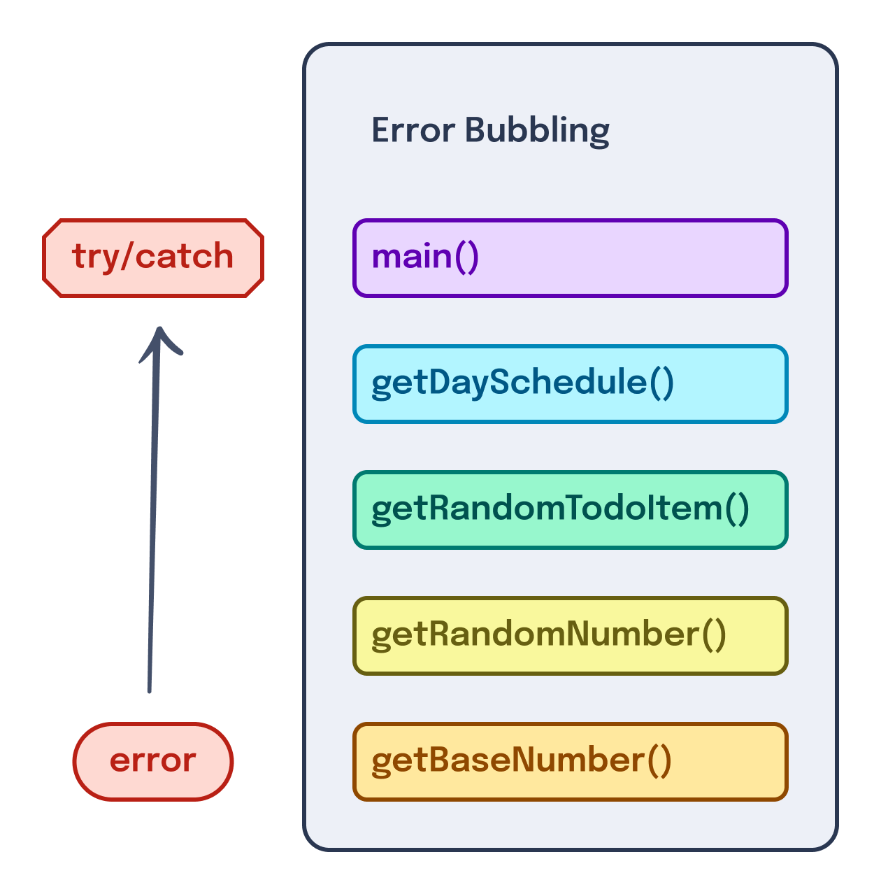

---
{
  title: "Error Handling",
  description: "Bug are a constant in development. How can we make error handling lead to a nicer user experience when they occur in React, Angular, and Vue?",
  published: "2024-03-11T12:10:00.000Z",
  authors: ["crutchcorn"],
  tags: ["react", "angular", "vue", "webdev"],
  attached: [],
  order: 10,
  collection: "framework-field-guide-fundamentals",
  version: "v2",
}
---

Despite our best efforts, bugs will find their way into our applications. Unfortunately, we can't simply ignore them, or the user experience suffers greatly.

Take the following code:

<!-- ::start:tabs -->

# React

```jsx
const App = () => {
	const items = [
		{ id: 1, name: "Take out the trash", priority: 1 },
		{ id: 2, name: "Cook dinner", priority: 1 },
		{ id: 3, name: "Play video games", priority: 2 },
	];

	const priorityItems = items.filter((item) => item.item.priority === 1);

	return (
		<>
			<h1>To-do items</h1>
			<ul>
				{priorityItems.map((item) => (
					<li key={item.id}>{item.name}</li>
				))}
			</ul>
		</>
	);
};
```

<!-- ::start:no-ebook -->
<iframe data-frame-title="React Error Intro - StackBlitz" src="pfp-code:./ffg-fundamentals-react-error-intro-70?template=node&embed=1&file=src%2Fmain.jsx"></iframe>
<!-- ::end:no-ebook -->

# Angular

```angular-ts
@Component({
	selector: "app-root",
	standalone: true,
	template: `
		<h1>To-do items</h1>
		<ul>
			@for (item of priorityItems; track item.id) {
				<li>{{ item.name }}</li>
			}
		</ul>
	`,
})
class AppComponent {
	items = [
		{ id: 1, name: "Take out the trash", priority: 1 },
		{ id: 2, name: "Cook dinner", priority: 1 },
		{ id: 3, name: "Play video games", priority: 2 },
	];

	priorityItems = this.items.filter((item: any) => item.item.priority === 1);
}
```

<!-- ::start:no-ebook -->
<iframe data-frame-title="Angular Error Intro - StackBlitz" src="pfp-code:./ffg-fundamentals-angular-error-intro-70?template=node&embed=1&file=src%2Fmain.ts"></iframe>
<!-- ::end:no-ebook -->

# Vue

```vue
<!-- App.vue -->
<script setup>
const items = [
	{ id: 1, name: "Take out the trash", priority: 1 },
	{ id: 2, name: "Cook dinner", priority: 1 },
	{ id: 3, name: "Play video games", priority: 2 },
];

const priorityItems = items.filter((item) => item.item.priority === 1);
</script>

<template>
	<h1>To-do items</h1>
	<ul>
		<li v-for="item of priorityItems" :key="item.id">{{ item.name }}</li>
	</ul>
</template>
```

<!-- ::start:no-ebook -->
<iframe data-frame-title="Vue Error Intro - StackBlitz" src="pfp-code:./ffg-fundamentals-vue-error-intro-70?template=node&embed=1&file=src%2FApp.vue"></iframe>
<!-- ::end:no-ebook -->

<!-- ::end:tabs -->

Without running the code, everything looks pretty good, right?

> Maybe you've spotted the error by now — that's great! Remember that we all make these small mistakes from time-to-time. Don't dismiss the idea of error handling out of hand as we go forward.

But oh no! When you run the application, it's not showing the `h1` or any of the list items like we would expect it to.

The reason those items aren't showing on-screen is that an error is being thrown. Open your console on any of these examples, and you'll find an error waiting for you:

> Error: can't access property "priority", item.item is undefined

Luckily, this error is a fairly easy fix, but even if we do, bugs will inevitably be introduced into our apps. A white screen is a pretty subpar experience for our end users — they likely won't even understand what happened that led them to this broken page.

While I doubt we'll ever convince our users that an error is a _good_ thing, how can we make this user experience _better_, at least?

Before we do that, however, let's explore _why_ throwing an error causes the rendering of a page to fail.

# Throwing Errors Causes Blank Screens?! {#errors-blank-screens}

As shown before, when an error is thrown during a component's [render step](/posts/ffg-fundamentals-side-effects), it will fail to render any of the contents from the component's template. This means that the following will throw an error and prevent rendering from occurring:

<!-- ::start:tabs -->

## React

```jsx
const ErrorThrowingComponent = () => {
	throw new Error("Error");

	return <p>Hello, world!</p>;
};
```

<!-- ::start:no-ebook -->
<iframe data-frame-title="React Render Error - StackBlitz" src="pfp-code:./ffg-fundamentals-react-render-error-71?template=node&embed=1&file=src%2Fmain.jsx"></iframe>
<!-- ::end:no-ebook -->

## Angular

```angular-ts
@Component({
	selector: "error-throwing",
	standalone: true,
	template: ` <p>Hello, world!</p> `,
})
class ErrorThrowingComponent {
	constructor() {
		throw new Error("Error");
	}
}
```

<!-- ::start:no-ebook -->
<iframe data-frame-title="Angular Render Error - StackBlitz" src="pfp-code:./ffg-fundamentals-angular-render-error-71?template=node&embed=1&file=src%2Fmain.ts"></iframe>
<!-- ::end:no-ebook -->

## Vue

```vue
<!-- ErrorThrowing.vue -->
<script setup>
throw new Error("Error");
</script>

<template>
	<p>Hello, world!</p>
</template>
```

<!-- ::start:no-ebook -->
<iframe data-frame-title="Vue Render Error - StackBlitz" src="pfp-code:./ffg-fundamentals-vue-render-error-71?template=node&embed=1&file=src%2FErrorThrowing.vue"></iframe>
<!-- ::end:no-ebook -->

<!-- ::end:tabs -->

However, if we change our code to throw an error during an event handler, the contents will render fine but fail to execute the logic of said error handler:

<!-- ::start:tabs -->

## React

```jsx
const EventErrorThrowingComponent = () => {
	const onClick = () => {
		throw new Error("Error");
	};

	return <button onClick={onClick}>Click me</button>;
};
```

<!-- ::start:no-ebook -->
<iframe data-frame-title="React Event Error - StackBlitz" src="pfp-code:./ffg-fundamentals-react-event-error-72?template=node&embed=1&file=src%2Fmain.ts"></iframe>
<!-- ::end:no-ebook -->

## Angular

```angular-ts
@Component({
	selector: "error-throwing",
	standalone: true,
	template: ` <button (click)="onClick()">Click me</button> `,
})
class ErrorThrowingComponent {
	onClick() {
		throw new Error("Error");
	}
}
```

<!-- ::start:no-ebook -->
<iframe data-frame-title="Angular Event Error - StackBlitz" src="pfp-code:./ffg-fundamentals-angular-event-error-72?template=node&embed=1&file=src%2Fmain.ts"></iframe>
<!-- ::end:no-ebook -->

## Vue

```vue
<!-- ErrorThrowing.vue -->
<script setup>
const onClick = () => {
	throw new Error("Error");
};
</script>

<template>
	<button @click="onClick()">Click me</button>
</template>
```

<!-- ::start:no-ebook -->
<iframe data-frame-title="Vue Event Error - StackBlitz" src="pfp-code:./ffg-fundamentals-vue-event-error-72?template=node&embed=1&file=src%2FErrorThrowing.vue"></iframe>
<!-- ::end:no-ebook -->

<!-- ::end:tabs -->

This behavior may seem strange until you consider how JavaScript's `throw` clause works. When a JavaScript function throws an error, it also acts as an early return of sorts.

```javascript
function getRandomNumber() {
	// Try commenting this line and seeing the different behavior
	throw new Error("There was an error");
	// Anything below the "throw" clause will not run
	console.log("Generating a random number");
	// This means that values returned after a thrown error are not utilized
	return Math.floor(Math.random() * 10);
}

try {
	const val = getRandomNumber();
	// This will never execute because the `throw` bypasses it
	console.log("I got the random number of:", val);
} catch (e) {
	// This will always run instead
	console.log("There was an error:", e);
}
```

<!-- ::start:no-ebook -->
<iframe data-frame-title="JS Error Demo - StackBlitz" src="pfp-code:./ffg-fundamentals-js-error-demo-73?template=node&embed=1&file=src%2Fmain.js"></iframe>
<!-- ::end:no-ebook -->

Moreover, these errors exceed past [their scope](https://developer.mozilla.org/en-US/docs/Glossary/Scope), meaning that they will bubble up [the execution stack](https://www.freecodecamp.org/news/execution-context-how-javascript-works-behind-the-scenes/).

> What does that mean in English?

In practical terms, this means that a thrown error will exceed the bounds of the function you called it in and make its way further up the list of functions you called to get to the thrown error.

```javascript
function getBaseNumber() {
	// Error occurs here, throws it upwards
	throw new Error("There was an error");
	return 10;
}

function getRandomNumber() {
	// Error occurs here, throws it upwards
	return Math.floor(Math.random() * getBaseNumber());
}

function getRandomTodoItem() {
	const items = [
		"Go to the gym",
		"Play video games",
		"Work on book",
		"Program",
	];

	// Error occurs here, throws it upwards
	const randNum = getRandomNumber();

	return items[randNum % items.length];
}

function getDaySchedule() {
	let schedule = [];
	for (let i = 0; i < 3; i++) {
		schedule.push(
			// First execution will throw this error upwards
			getRandomTodoItem(),
		);
	}
	return schedule;
}

function main() {
	try {
		console.log(getDaySchedule());
	} catch (e) {
		// Only now will the error be stopped
		console.log("An error occurred:", e);
	}
}
```

<!-- ::start:no-ebook -->
<iframe data-frame-title="JS Error Bubbling - StackBlitz" src="pfp-code:./ffg-fundamentals-js-error-bubbling-74?template=node&embed=1&file=src%2Fmain.js"></iframe>
<!-- ::end:no-ebook -->



Because of these two properties of errors, React, Angular, and Vue are unable to "recover" (continue rendering after an error has occurred) from an error thrown during a render cycle.

## Errors Thrown in Event Handlers {#errors-event-handlers}

Conversely, due to the nature of event handlers, these frameworks don't _need_ to handle errors that occur during event handlers. Assume we have the following code in an HTML file:

```html
<!-- index.html -->
<button id="btn">Click me</button>

<script>
	const el = document.getElementById("btn");
	el.addEventListener("click", () => {
		throw new Error("There was an error");
	});
</script>
```

When you click on the `<button>` here, it will throw an error, but this error will not escape out of the event listener's scope. This means that the following will not work:

```javascript
try {
	const el = document.getElementById("btn");
	el.addEventListener("click", () => {
		throw new Error("There was an error");
	});
} catch (error) {
	// This will not ever run with this code
	alert("We're catching an error in try/catch");
}
```

So to catch an error in an event handler, React, Angular, or Vue would have to add [a window `'error'` listener](https://developer.mozilla.org/en-US/docs/Web/API/Window/error_event), like so:

```javascript
const el = document.getElementById("btn");
el.addEventListener("click", () => {
	throw new Error("There was an error");
});

window.addEventListener("error", (event) => {
	const error = event.error;
	alert("We're catching an error in another addEventListener");
});
```

<!-- ::start:no-ebook -->
<iframe data-frame-title="JS Event Error - StackBlitz" src="pfp-code:./ffg-fundamentals-js-event-error-75?template=node&embed=1&file=index.html"></iframe>
<!-- ::end:no-ebook -->

But let's think about what adding this `window` listener would mean:

- More complex code in the respective frameworks
  - Harder to maintain
  - Larger bundle size
- When the user clicks on a faulty button, the whole component crashes rather than a single aspect of it failing

This doesn't seem worth the tradeoffs when we're able to add our own `try/catch` handlers inside event handlers.

After all, a partially broken application is better than a fully broken one!

### Errors Thrown in Other APIs {#errors-other-apis}

This property of an error being thrown in an error handler not preventing a render transfers to other aspects of these frameworks as well:

<!-- ::start:tabs -->

#### React

While some other frameworks catch errors inside async APIs (like React's `useEffect`), React will not recover from an error thrown in _any_ of the built-in React Hooks covered so far:

```jsx
const App = () => {
	// This will prevent rendering
	const stateVal = useState(() => {
		throw new Error("Error in state initialization function");
	});

	// This will also prevent rendering
	const memoVal = useMemo(() => {
		throw new Error("Error in memo");
	}, []);

	// Will this prevent rendering? You bet!
	useEffect(() => {
		throw new Error("Error in useEffect");
	});

	// Oh, and this will too.
	useLayoutEffect(() => {
		throw new Error("Error in useEffect");
	});

	return <p>Hello, world!</p>;
};
```

<!-- ::start:no-ebook -->
<iframe data-frame-title="React Errors in Hooks - StackBlitz" src="pfp-code:./ffg-fundamentals-react-errors-in-hooks-76?template=node&embed=1&file=src%2Fmain.jsx"></iframe>
<!-- ::end:no-ebook -->

#### Angular

Despite errors thrown in a component's constructor preventing rendering:

```angular-ts
@Component({
	selector: "app-root",
	standalone: true,
	template: ` <p>Hello, world!</p> `,
})
class AppComponent {
	// This will prevent rendering
	constructor() {
		throw new Error("Error in constructor");
	}
}
```

<!-- ::start:no-ebook -->
<iframe data-frame-title="Angular Error in Constructor - StackBlitz" src="pfp-code:./ffg-fundamentals-angular-error-in-constructor-76?template=node&embed=1&file=src%2Fmain.ts"></iframe>
<!-- ::end:no-ebook -->

Errors thrown in any of Angular's other lifecycle methods will not prevent a component from rendering:

```angular-ts
@Component({
	selector: "app-root",
	standalone: true,
	template: ` <p>Hello, world!</p> `,
})
class AppComponent implements OnInit {
	// Will not prevent `Hello, world!` from showing
	ngOnInit() {
		throw new Error("Error in constructor");
	}
}
```

<!-- ::start:no-ebook -->
<iframe data-frame-title="Angular Errors in Lifecycles - StackBlitz" src="pfp-code:./ffg-fundamentals-angular-errors-in-lifecycles-76?template=node&embed=1&file=src%2Fmain.ts"></iframe>
<!-- ::end:no-ebook -->

#### Vue

While some of Vue's APIs, like `watchEffect` or `computed` will prevent rendering when an error occurs:

```vue
<!-- App.vue -->
<script setup>
import { watchEffect, computed } from "vue";

// This will prevent rendering
watchEffect(() => {
	throw new Error("New error in effect");
});

// This will also prevent rendering
const result = computed(() => {
	throw new Error("New error in computed");
});

// "computed" is lazy, meaning that it will not throw the error
//     (or compute a result) unless the value is used, like so:
console.log(result.value);
</script>

<template>
	<p>Hello, world!</p>
</template>
```

<!-- ::start:no-ebook -->
<iframe data-frame-title="Vue Errors in Setup - StackBlitz" src="pfp-code:./ffg-fundamentals-vue-errors-in-setup-76?template=node&embed=1&file=src%2FApp.vue"></iframe>
<!-- ::end:no-ebook -->

Other APIs, like the `onMounted` lifecycle method, will not prevent rendering when an error is thrown inside it:

```vue
<!-- App.vue -->
<script setup>
import { onMounted } from "vue";

onMounted(() => {
	// Will not prevent `Hello, world!` from showing
	throw new Error("New error");
});
</script>

<template>
	<p>Hello, world!</p>
</template>
```

<!-- ::start:no-ebook -->
<iframe data-frame-title="Vue Errors in Lifecycles - StackBlitz" src="pfp-code:./ffg-fundamentals-vue-errors-in-lifecycles-76?template=node&embed=1&file=src%2FApp.vue"></iframe>
<!-- ::end:no-ebook -->

While this might seem confusing at first, it makes sense when you consider _when_ `onMounted` runs when compared with `computed`, for example.

See, while `computed` runs during the setup of the component, `onMounted` executes _after_ the component has been rendered. Because of this, Vue is able to recover from errors thrown during `onMounted` and afterward but not during those thrown in a render function.

<!-- ::end:tabs -->

Now that we understand why these errors prevent you from rendering content, let's see how we're able to improve the user experience when errors _do_ occur.

# Logging Errors {#logging-errors}

The first step to providing a better end-user experience when it comes to errors is to reduce how many are made.

> Well, duh

Sure, this seems obvious, but consider this: If an error occurs on the user's machine and it isn't caught during internally, how are you supposed to know how to fix it?

<!-- ::in-content-ad title="Consider supporting" body="Donating any amount will help towards further development of the Framework Field Guide." button-text="Sponsor my work" button-href="https://github.com/sponsors/crutchcorn/" -->

This is where the concept of "logging" comes into play. The general idea behind logging is that you can capture a collection of errors and information about the events that led up to the errors. You want to provide a way to export this data so that your user can send it to you to debug.

While this logging often involves submitting data to a server, let's keep things local to the user's machine for now.

<!-- ::start:tabs -->

## React

Up to this point, all of our React components have been functions. While this _is_ how most modern React applications are built today, there is another way of writing a React component; this being the "class" API.

Class-based React components existed _well_ before function components. Class-based components were in React since day one, and functional components were only truly made viable with a significant revamp [in React 16.8, coinciding with the introduction of React Hooks](https://reactjs.org/docs/hooks-intro.html).

Here's a simple React component in both functional and class-based APIs:

```jsx
// Function component
const FnCounter = (props) => {
	// Setting up state
	const [count, setCount] = useState(0);

	// Function to update state
	const addOne = () => setCount(count + 1);

	// Rendered UI via JSX
	return (
		<div>
			<p>You have pushed the button {count} times</p>
			<button onClick={addOne}>Add one</button>
			{/* Using props to project children */}
			{props.children}
		</div>
	);
};
```

```jsx
// Class component
import { Component } from "react";

class ClassCounter extends Component {
	// Setting up state
	state = { count: 0 };

	// Function to update state
	addOne() {
		// Notice we use an object and `setState` to update state
		this.setState({ count: this.state.count + 1 });
	}

	// Rendered UI via JSX
	render() {
		return (
			<div>
				<p>You have pushed the button {this.state.count} times</p>
				<button onClick={() => this.addOne()}>Add one</button>
				{/* Using props to project children */}
				{this.props.children}
			</div>
		);
	}
}
```

<!-- ::start:no-ebook -->
<iframe data-frame-title="React Class vs Function Comparison - StackBlitz" src="pfp-code:./ffg-fundamentals-react-class-fn-comparison-77?template=node&embed=1&file=src%2Fmain.jsx"></iframe>
<!-- ::end:no-ebook -->

Both of these components work exactly the same, with no functional differences between them. This is because almost every API that was available to class components made its way over to functional components through React Hooks.

_**Almost** every API made the migration to Hooks._

One of the few exceptions to that rule is the ability to catch and track errors that are thrown within a React application.

### Use Class Components to Build an Error Boundary {#class-error-boundary}

Now that we understand what a class component is and why it's required to use one for error handling, let's build one ourselves!

Just like any other class component, we start with an `extends` clause to tell React that this class is, in fact, a component.

From there, we add a special `componentDidCatch` method, like so:

```jsx
import { Component } from "react";

class ErrorBoundary extends Component {
	componentDidCatch(error, errorInfo) {
		// Do something with the error
		console.log(error, errorInfo);
	}

	render() {
		return this.props.children;
	}
}
```

This method is then called any time a child component throws an error.

Luckily for us, we can mix and match class components and function components. This means that we can demonstrate the `componentDidCatch` handler using the following code:

```jsx
const ErrorThrowingComponent = () => {
	// This is an example of an error being thrown
	throw new Error("Error");
};

const App = () => {
	return (
		<ErrorBoundary>
			<ErrorThrowingComponent />
		</ErrorBoundary>
	);
};
```

<!-- ::start:no-ebook -->
<iframe data-frame-title="React componentDidCatch - StackBlitz" src="pfp-code:./ffg-fundamentals-react-comp-did-catch-77?template=node&embed=1&file=src%2Fmain.jsx"></iframe>
<!-- ::end:no-ebook -->

Now, while our screen will still be white when the error is thrown, it will hit our `componentDidCatch` handler as we would expect.

## Angular

Angular uses its [dependency injection system](/posts/ffg-fundamentals-dependency-injection) to allow developers to keep track of errors as they occur.

However, to provide the custom error handler service, you **must** provide it at the root of your application, meaning that you cannot simply provide it from your parent component.

```angular-ts
class MyErrorHandler implements ErrorHandler {
	handleError(error: unknown) {
		// Do something with the error
		console.log(error);
	}
}

// ...

bootstrapApplication(AppComponent, {
	providers: [{ provide: ErrorHandler, useClass: MyErrorHandler }],
});
```

> It'd be awesome to have a per-component implementation of `ErrorHandler`, but [this feature has not made it into Angular yet](https://github.com/angular/angular/issues/43504).

Now that we've set up our `ErrorHandler` instance, we can test that it works using a component that throws an error:

```angular-ts
@Component({
	selector: "child-comp",
	standalone: true,
	template: `<p>Testing</p>`,
})
class ChildComponent implements OnInit {
	ngOnInit() {
		// This is an example of an error being thrown
		throw new Error("Test");
	}
}

@Component({
	selector: "app-root",
	standalone: true,
	imports: [ChildComponent],
	template: ` <child-comp /> `,
})
class AppComponent {}
```

<!-- ::start:no-ebook -->
<iframe data-frame-title="Angular Logging the Error - StackBlitz" src="pfp-code:./ffg-fundamentals-angular-logging-the-error-77?template=node&embed=1&file=src%2Fmain.ts"></iframe>
<!-- ::end:no-ebook -->

## Vue

Vue enables us to track errors in an application with a simple `onErrorCaptured` composition API.

```vue
<!-- App.vue -->
<script setup>
import { onErrorCaptured } from "vue";

import Child from "./Child.vue";

onErrorCaptured((err, instance, info) => {
	// Do something with the error
	console.log(err, instance, info);
});
</script>

<template>
	<Child />
</template>
```

Now, when we throw an error inside a child component, like so:

```vue
<!-- Child.vue -->
<script setup>
throw new Error("Test");
</script>

<template>
	<p>Hello, world!</p>
</template>
```

<!-- ::start:no-ebook -->
<iframe data-frame-title="Vue Logging the Error - StackBlitz" src="pfp-code:./ffg-fundamentals-vue-logging-the-error-77?template=node&embed=1&file=src%2FApp.vue"></iframe>
<!-- ::end:no-ebook -->

It will run the function inside of `onErrorCaptured`.

<!-- ::end:tabs -->

Great! We're now able to keep track of what errors are occurring in our app. Hopefully, this allows us to address bugs as the user experiences them, making the app feel more stable as time goes on.

Now, let's see if we're not able to make the experience a bit nicer for our users when they _do_ hit an error.

# Ignoring the Error {#ignoring-the-error}

Some bugs? They're showstoppers. When they happen, you can't do anything to recover from the error, and as a result, you have to halt the user's ability to interact with the page.

Other bugs, on the other hand, may not require such harsh actions. For example, if you can silently log an error, pretending that nothing ever happened and allowing the app to continue on as normal, that oftentimes leads to a better user experience.

Let's see how we can implement this in our apps.

<!-- ::start:tabs -->

## React

Unfortunately, React is not able to handle thrown errors invisibly to the user when they're thrown within a functional component. As mentioned before, this is ultimately because React functional components are simply functions that do not have an escape mechanism built into them for errors being thrown.

## Angular

As covered before, Angular is able to ignore all errors thrown outside the `constructor` method. However, if an error does occur in the `constructor` method, it's challenging ([but not impossible](https://playfulprogramming.com/posts/angular-constructor-error-behavior#The-short-term-fix)) to sidestep. Because of the complexity of the code required to ignore `constructor` method errors, we won't cover it in this book.

## Vue

To avoid an error blanking out your Vue application, simply return `false` from your `onErrorCaptured` composition.

```vue
<!-- App.vue -->
<script setup>
import { onErrorCaptured } from "vue";

import Child from "./Child.vue";

onErrorCaptured((err, instance, info) => {
	console.log(err, instance, info);
	return false;
});
</script>

<template>
	<Child />
</template>
```

This allows components like this:

```vue
<!-- Child.vue -->
<script setup>
throw new Error("Test");
</script>

<template>
	<p>Hello, world!</p>
</template>
```

To still render their contents while logging the error.

<!-- ::start:no-ebook -->
<iframe data-frame-title="Vue Ignoring the Error - StackBlitz" src="pfp-code:./ffg-fundamentals-vue-ignoring-the-error-78?template=node&embed=1&file=src%2FApp.vue"></iframe>
<!-- ::end:no-ebook -->

<!-- ::end:tabs -->

# Fallback UI {#fallback-ui}

While silently failing _can_ be a valid strategy to hide errors from your user, other times, you may want to display a different UI when an error is thrown.

For example, let's build a screen that tells the user that an unknown error has occurred when something is thrown.

<!-- ::start:tabs -->

## React

Because our `ErrorBoundary` component renders the children that are passed in, we can update our state when an error occurs. To do this, React provides a special _static_ handler method called `getDerivedStateFromError`, which allows us to set a property in our `state` object when an error is hit.

```jsx
class ErrorBoundary extends Component {
	state = { hasError: false };

	static getDerivedStateFromError(error) {
		return { hasError: true };
	}

	componentDidCatch(error, errorInfo) {
		console.log(error, errorInfo);
	}

	render() {
		if (this.state.hasError) {
			return <h1>Something went wrong.</h1>;
		}
		return this.props.children;
	}
}
```

<!-- ::start:no-ebook -->
<iframe data-frame-title="React Fallback UI - StackBlitz" src="pfp-code:./ffg-fundamentals-react-fallback-ui-79?template=node&embed=1&file=src%2Fmain.jsx"></iframe>
<!-- ::end:no-ebook -->

## Angular

Because a custom error handler is implemented using an Angular service, we can use our `inject` function to gain access to the error handler.

From there, it's as simple as storing a Boolean when an error _is_ thrown and using that Boolean to render out a fallback UI when `true`.

```angular-ts
import { Component, inject, ErrorHandler, OnInit } from "@angular/core";

class MyErrorHandler implements ErrorHandler {
	hadError = false;

	handleError(error: unknown) {
		console.log(error);
		this.hadError = true;
	}
}

@Component({
	selector: "app-root",
	standalone: true,
	imports: [ChildComponent],
	template: `
		@if (errorHandler.hadError) {
			<h1>There was an error</h1>
		}
		@if (!errorHandler.hadError) {
			<child-comp />
		}
	`,
})
class AppComponent {
	errorHandler = inject(ErrorHandler) as MyErrorHandler;
}

// Provide the error handler
```

<!-- ::start:no-ebook -->
<iframe data-frame-title="Angular Fallback UI - StackBlitz" src="pfp-code:./ffg-fundamentals-angular-fallback-ui-79?template=node&embed=1&file=src%2Fmain.ts"></iframe>
<!-- ::end:no-ebook -->

> Unlike most instances of `inject` usage, we have to use `as MyErrorHandler`, otherwise TypeScript does not know about the new `hadError` property we just set.

> Despite this code working well to display a fallback UI in most error throwing scenarios, the `ErrorHandler` service can't prevent the rendering error caused by `constructor` errors. As a result, if you want to display a UI fallback for those errors, you'll need to either [implement a somewhat complex bit of code or wait for Angular to implement the functionality itself.](https://github.com/angular/angular/issues/51941)

## Vue

Because we still have full access to our component's state within `onErrorCaptured`, we can change a `ref` from `false` to `true` to keep track of if an error occurred.

If it hasn't rendered our main app, otherwise render our fallback UI.

```vue
<!-- App.vue -->
<script setup>
import { onErrorCaptured, ref } from "vue";

import Child from "./Child.vue";

const hadError = ref(false);

onErrorCaptured((err, instance, info) => {
	console.log(err, instance, info);
	hadError.value = true;
	return false;
});
</script>

<template>
	<p v-if="hadError">An error occurred</p>
	<Child v-if="!hadError" />
</template>
```

<!-- ::start:no-ebook -->
<iframe data-frame-title="Vue Fallback UI - StackBlitz" src="pfp-code:./ffg-fundamentals-vue-fallback-ui-79?template=node&embed=1&file=src%2FApp.vue"></iframe>
<!-- ::end:no-ebook -->

<!-- ::end:tabs -->

## Displaying the Error {#displaying-the-error}

While displaying a fallback UI is often to the user's benefit, most users want some indication of _what_ went wrong rather than simply that "something" went wrong.

Let's display the error thrown by the component to our users.

<!-- ::start:tabs -->

### React

While we previously used `getDerivedStateFromError` to set a Boolean in our `state` object, we can instead use the first argument of the static handler to assign the object to an [`Error` value](https://developer.mozilla.org/en-US/docs/Web/JavaScript/Reference/Global_Objects/Error).

```jsx
// JSON.stringify-ing an Error object provides `{}`.
// This function fixes that
const getErrorString = (err) =>
	JSON.stringify(err, Object.getOwnPropertyNames(err));

class ErrorBoundary extends Component {
	state = { error: null };

	static getDerivedStateFromError(error) {
		return { error: error };
	}

	componentDidCatch(error, errorInfo) {
		console.log(error, errorInfo);
	}

	render() {
		if (this.state.error) {
			return (
				<div>
					<h1>You got an error:</h1>
					<pre style={{ whiteSpace: "pre-wrap" }}>
						<code>{getErrorString(this.state.error)}</code>
					</pre>
				</div>
			);
		}
		return this.props.children;
	}
}
```

<!-- ::start:no-ebook -->
<iframe data-frame-title="React Displaying the Error - StackBlitz" src="pfp-code:./ffg-fundamentals-react-displaying-the-error-80?template=node&embed=1&file=src%2Fmain.jsx"></iframe>
<!-- ::end:no-ebook -->

### Angular

Rather than storing a Boolean when an error occurs, we can store [the error value itself](https://developer.mozilla.org/en-US/docs/Web/JavaScript/Reference/Global_Objects/Error) within an `error` object and display the underlying value when present.

```angular-ts
class MyErrorHandler implements ErrorHandler {
	error: unknown = null;

	handleError(error: unknown) {
		console.log(error);
		this.error = error;
	}
}

@Component({
	selector: "app-root",
	standalone: true,
	imports: [ChildComponent],
	template: `
		@if (errorHandler.error) {
			<div>
				<h1>You got an error:</h1>
				<pre style="white-space: pre-wrap"><code>{{ errorHandler.error }}</code></pre>
			</div>
		}
		@if (!errorHandler.error) {
			<child-comp />
		}
	`,
})
class AppComponent {
	errorHandler = inject(ErrorHandler) as MyErrorHandler;
}

// ...
```

<!-- ::start:no-ebook -->
<iframe data-frame-title="Angular Displaying the Error - StackBlitz" src="pfp-code:./ffg-fundamentals-angular-displaying-the-error-80?template=node&embed=1&file=src%2Fmain.ts"></iframe>
<!-- ::end:no-ebook -->

### Vue

Using our `ref` to keep track of the error, we can then display the error's contents on-screen when it occurs.

```vue
<!-- App.vue -->
<script setup>
import { onErrorCaptured, ref } from "vue";

import Child from "./Child.vue";

const error = ref(null);

onErrorCaptured((err, instance, info) => {
	console.log(err, instance, info);
	error.value = err;
	return false;
});

// JSON.stringify-ing an Error object provides `{}`.
// This function fixes that
const getErrorString = (err) =>
	JSON.stringify(err, Object.getOwnPropertyNames(err));
</script>

<template>
	<div v-if="error">
		<h1>You got an error:</h1>
		<pre
			style="white-space: pre-wrap"
		><code>{{ getErrorString(error) }}</code></pre>
	</div>
	<Child v-if="!error" />
</template>
```

<!-- ::start:no-ebook -->
<iframe data-frame-title="Vue Displaying the Error - StackBlitz" src="pfp-code:./ffg-fundamentals-vue-displaying-the-error-80?template=node&embed=1&file=src%2FApp.vue"></iframe>
<!-- ::end:no-ebook -->

> If you bind `{{error}}` rather than `{{error.message}}`, you'll end up with the error:
>
> ```
> Uncaught (in promise) RangeError: Maximum call stack size exceeded
> ```
>
> As Vue's internals attempt to wrap and unwrap the Error object in its reactivity handler.

<!-- ::end:tabs -->

# Challenge {#challenge}

Let's say that we were building out [our previous code challenge](/posts/ffg-fundamentals-component-reference#challenge) and accidentally typo-d the name of a variable in our `Sidebar` component:

<!-- ::start:tabs -->

## React

```jsx
const Sidebar = forwardRef(({ toggle }, ref) => {
	const [isCollapsed, setIsCollapsed] = useState(false);
	const setAndToggle = (v) => {
		setIsCollapsed(v);
		toggle(v);
	};

	// ...

	const toggleCollapsed = () => {
		setAndToggle(isCollapsed);
	};

	/**
	 * `collapsed` doesn't exist!
	 * It's supposed to be `isCollapsed`! 😱
	 */
	if (collapsed) {
		return <button onClick={toggleCollapsed}>Toggle</button>;
	}

	return (
		<div>
			<button onClick={toggleCollapsed}>Toggle</button>
			<ul style={{ padding: "1rem" }}>
				<li>List item 1</li>
				<li>List item 2</li>
				<li>List item 3</li>
			</ul>
		</div>
	);
});
```

---

Upon rendering the sidebar, we're greeted with [a JavaScript `ReferenceError`](https://developer.mozilla.org/en-US/docs/Web/JavaScript/Reference/Errors/Not_defined):

```javascript
"collapsed is not defined";
```

## Angular

```angular-ts
@Component({
	selector: "app-sidebar",
	standalone: true,
	template: `
		<!-- "isCollapsed" is a boolean! -->
		<!-- It's supposed to be "toggleCollapsed"! 😱 -->
		@if (isCollapsed) {
			<button (click)="collapsed()">Toggle</button>
		}
		@if (!isCollapsed) {
			<div>
				<button (click)="collapsed()">Toggle</button>
				<ul style="padding: 1rem">
					<li>List item 1</li>
					<li>List item 2</li>
					<li>List item 3</li>
				</ul>
			</div>
		}
	`,
})
class SidebarComponent {
	@Output() toggle = new EventEmitter<boolean>();

	// Notice the type cast to `any`
	isCollapsed: any = false;

	setAndToggle(v: boolean) {
		this.isCollapsed = v;
		this.toggle.emit(v);
	}

	// ...

	toggleCollapsed() {
		this.setAndToggle(!this.isCollapsed);
	}
}
```

> You'll notice that we had to use TypeScript to tell our `isCollapsed` is type `any`. Without this change, TypeScript will correctly flag an error during build time that:
>
> ```
> This expression is not callable.
> Type 'Boolean' has no call signatures.
> ```

---

Upon clicking the sidebar toggle, we're greeted with [a JavaScript `TypeError`](https://developer.mozilla.org/en-US/docs/Web/JavaScript/Reference/Errors/Not_a_function):

```javascript
"Error: ctx_r4.isCollapsed is not a function";
```

## Vue

```vue
<!-- Sidebar.vue -->
<script setup>
import { ref } from "vue";

const emits = defineEmits(["toggle"]);

const isCollapsed = ref(false);

const setAndToggle = (v) => {
	isCollapsed.value = v;
	emits("toggle", v);
};

// ...

const toggleCollapsed = () => {
	setAndToggle(!isCollapsed.value);
};
</script>

<template>
	<!--`collapsed` doesn't exist!-->
	<!--It's supposed to be `isCollapsed`! 😱-->
	<button v-if="isCollapsed" @click="collapsed()">Toggle</button>
	<div v-if="!isCollapsed">
		<button @click="collapsed()">Toggle</button>
		<ul style="padding: 1rem">
			<li>List item 1</li>
			<li>List item 2</li>
			<li>List item 3</li>
		</ul>
	</div>
</template>
```

---

Upon clicking the sidebar toggle, we're greeted with [a JavaScript `TypeError`](https://developer.mozilla.org/en-US/docs/Web/JavaScript/Reference/Errors/Not_a_function):

```javascript
"Uncaught TypeError: _ctx.collapsed is not a function";
```

<!-- ::end:tabs -->

While we can solve this by correcting the typo, we'll also want to add an error handler to log these kinds of issues in case they happen in production. After all, [if a bug is found in the wild without a way to report it back to the developer, is it ever fixed](https://en.wikipedia.org/wiki/If_a_tree_falls_in_a_forest)?

Let's solve this by:

- Figuring out how the user will report bugs
- Implementing an error handler
- Showing the user a nicer error screen

## Reporting Bugs Back to Developers {#challenge-reporting-bugs}

Let's provide the user a means to email us if they find something similar in their time using the app.


We can do this by showing the user [a `mailto:` link](https://developer.mozilla.org/en-US/docs/Learn/HTML/Introduction_to_HTML/Creating_hyperlinks#email_links) when an error occurs. That way, reporting the bug is a single mouse click.

This `mailto:` link might look like the following HTML

```html
<a
	href="mailto:dev@example.com&subject=Bug%20Found&body=There%20was%20an%20error"
	>Email Us</a
>
```

Where `subject` and `body` are encoded using `encodeURIComponent` like so:

```javascript
// JavaScript pseudo-code
const mailTo = "dev@example.com";

const errorMessage = `
There was some error that occurred. It's unclear why that happened.
`;

const header = "Bug Found";

const encodedErr = encodeURIComponent(errorMessage);

const encodedHeader = encodeURIComponent(header);

const href = `mailto:${mailTo}&subject=${encodedHeader}&body=${encodedErr}`;

// HREF can be bound via each frameworks' attribute binding syntax
const html = `<a href="${href}">Email Us</a>`;
```

## Implementing the Error Handler {#challenge-implementing-error-handler}

With a plan of attack outlined, let's take a step back and evaluate how we'll implement our error handler in the first place.

Remember: Implement first, increment second.

Let's start with an error handler that will catch our error and display a UI when it occurs.

We'll also make sure that this error handler is application-wide to ensure that it shows up when any error in the app comes up:

<!-- ::start:tabs -->

### React

```jsx
class ErrorBoundary extends Component {
	state = { error: null };

	static getDerivedStateFromError(error) {
		return { error: error };
	}

	render() {
		const err = this.state.error;
		if (err) {
			return (
				<div>
					<h1>There was an error</h1>
					<pre>
						<code>{err.message}</code>
					</pre>
				</div>
			);
		}
		return this.props.children;
	}
}

const Root = () => {
	return (
		<ErrorBoundary>
			<App />
		</ErrorBoundary>
	);
};
```

### Angular

```angular-ts
class MyErrorHandler implements ErrorHandler {
	error: any = null;

	handleError(error: unknown) {
		console.log(error);
		this.error = error;
	}
}

@Component({
	selector: "error-catcher",
	standalone: true,
	template: `
		@if (errorHandler.error) {
			<div>
				<h1>You got an error:</h1>
				<pre style="white-space: pre-wrap"><code>{{ errorHandler.error }}</code></pre>
			</div>
		}
		@if (!errorHandler.error) {
			<ng-content></ng-content>
		}
	`,
})
class ErrorCatcher {
	errorHandler = inject(ErrorHandler) as MyErrorHandler;
}

@Component({
	selector: "app-root",
	standalone: true,
	imports: [LayoutComponent, SidebarComponent, ErrorCatcher],
	template: `
		<error-catcher>
			<!-- The rest of the app -->
		</error-catcher>
	`,
})
class AppComponent implements OnInit, OnDestroy {
	// ....
}

bootstrapApplication(AppComponent, {
	providers: [{ provide: ErrorHandler, useClass: MyErrorHandler }],
});
```

### Vue

```vue
<!-- ErrorCatcher.vue -->
<script setup>
import { onErrorCaptured, ref } from "vue";

const error = ref(null);

onErrorCaptured((err, instance, info) => {
	error.value = err;
	return false;
});
</script>

<template>
	<div v-if="error">
		<h1>There was an error</h1>
		<pre><code>{{error.message}}</code></pre>
	</div>
	<slot v-if="!error" />
</template>
```

```vue
<!-- App.vue -->
<script setup>
import ErrorCatcher from "./ErrorCatcher.vue";

// ...
</script>

<template>
	<ErrorCatcher>
		<!-- The rest of the app -->
	</ErrorCatcher>
</template>
```

<!-- ::end:tabs -->

## Showing a Nicer Error Message {#challenge-showing-nicer-error}

Now that we have a method of showing the error to the user when it occurs, let's make sure that we can report the bug back to the development team. We'll do this by displaying all the information a user would need to report a bug alongside an auto-filled `mailto:`` link so that emailing the developer is a single-button press away.

<!-- ::start:tabs -->

### React

```jsx
class ErrorBoundary extends Component {
	state = { error: null };

	static getDerivedStateFromError(error) {
		return { error: error };
	}

	render() {
		const err = this.state.error;
		if (err) {
			const mailTo = "dev@example.com";
			const header = "Bug Found";
			const message = `
      There was a bug found of type: "${err.name}".

      The message was: "${err.message}".

      The stack trace is:

      """
      ${err.stack}
      """
      `.trim();

			const encodedMsg = encodeURIComponent(message);

			const encodedHeader = encodeURIComponent(header);

			const href = `mailto:${mailTo}&subject=${encodedHeader}&body=${encodedMsg}`;

			return (
				<div>
					<h1>{err.name}</h1>
					<pre>
						<code>{err.message}</code>
					</pre>
					<a href={href}>Email us to report the bug</a>
					<br />
					<br />
					<details>
						<summary>Error stack</summary>
						<pre>
							<code>{err.stack}</code>
						</pre>
					</details>
				</div>
			);
		}
		return this.props.children;
	}
}
```

<!-- ::start:no-ebook -->

<details>

<summary>Final code output</summary>

<iframe data-frame-title="React Error Challenge - StackBlitz" src="pfp-code:./ffg-fundamentals-react-error-challenge-81?template=node&embed=1&file=src%2Fmain.jsx"></iframe>

</details>

<!-- ::end:no-ebook -->

### Angular

```angular-ts
@Pipe({ name: "errorHref", standalone: true })
class ErrorHrefPipe implements PipeTransform {
	transform(err: Error | null): string {
		console.log({ err });
		if (!err) return "";
		const mailTo = "dev@example.com";
		const header = "Bug Found";
		const message = `
    There was a bug found of type: "${err.name}".

    The message was: "${err.message}".

    The stack trace is:

    """
    ${err.stack}
    """
    `.trim();

		const encodedMsg = encodeURIComponent(message);

		const encodedHeader = encodeURIComponent(header);

		const href = `mailto:${mailTo}&subject=${encodedHeader}&body=${encodedMsg}`;

		return href;
	}
}

@Component({
	selector: "error-catcher",
	standalone: true,
	imports: [ErrorHrefPipe],
	template: `
		@if (errorHandler.error) {
			<div>
				<h1>{{ errorHandler.error.name }}</h1>
				<pre
					style="white-space: pre-wrap"
				><code>{{ errorHandler.error.message }}</code></pre>
				<a [href]="errorHandler.error | errorHref">Email us to report the bug</a>
				<br />
				<br />
				<details>
					<summary>Error stack</summary>
					<pre
						style="white-space: pre-wrap"
					><code>{{ errorHandler.error.stack }}</code></pre>
				</details>
			</div>
		}
		@if (!errorHandler.error) {
			<ng-content></ng-content>
		}
	`,
})
class ErrorCatcher {
	errorHandler = inject(ErrorHandler) as MyErrorHandler;
}
```

<!-- ::start:no-ebook -->

<details>

<summary>Final code output</summary>

<iframe data-frame-title="Angular Error Challenge - StackBlitz" src="pfp-code:./ffg-fundamentals-angular-error-challenge-81?template=node&embed=1&file=src%2Fmain.ts"></iframe>

</details>

<!-- ::end:no-ebook -->

### Vue

```vue
<script setup>
import { onErrorCaptured, ref, computed } from "vue";

const error = ref(null);

const mailTo = "dev@example.com";
const header = "Bug Found";
const message = computed(() =>
	!error.value
		? ""
		: `
      There was a bug found of type: "${error.value.name}".

      The message was: "${error.value.message}".

      The stack trace is:

      """
      ${error.value.stack}
      """
      `.trim(),
);

const encodedMsg = computed(() => encodeURIComponent(message.value));

const encodedHeader = encodeURIComponent(header);

const href = computed(
	() => `mailto:${mailTo}&subject=${encodedHeader}&body=${encodedMsg.value}`,
);

onErrorCaptured((err, instance, info) => {
	error.value = err;
	return false;
});
</script>

<template>
	<div v-if="error">
		<h1>{{ error.name }}</h1>
		<pre><code>{{error.message}}</code></pre>
		<a :href="href">Email us to report the bug</a>
		<br />
		<br />
		<details>
			<summary>Error stack</summary>
			<pre><code>{{error.stack}}</code></pre>
		</details>
	</div>
	<slot v-if="!error" />
</template>
```

<!-- ::start:no-ebook -->

<details>

<summary>Final code output</summary>

<iframe data-frame-title="Vue Error Challenge - StackBlitz" src="pfp-code:./ffg-fundamentals-vue-error-challenge-81?template=node&embed=1&file=src%2FApp.vue"></iframe>

</details>

<!-- ::end:no-ebook -->

<!-- ::end:tabs -->
