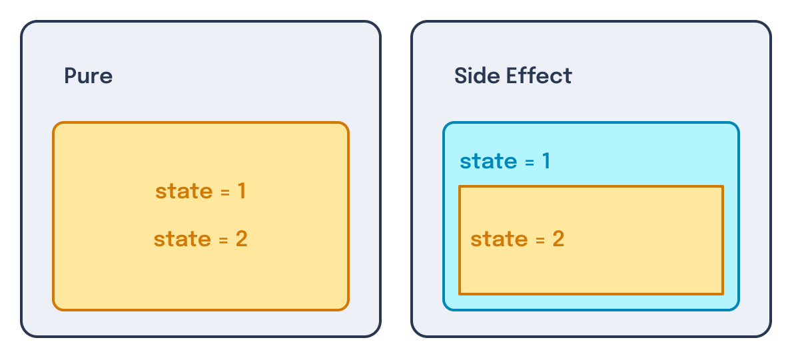
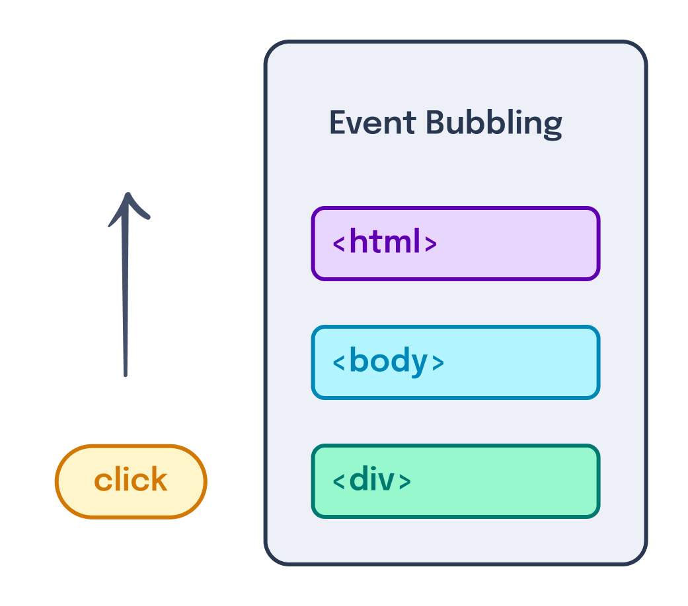
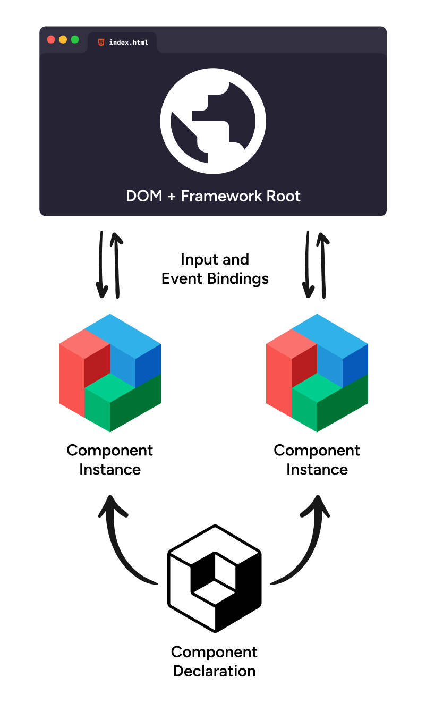
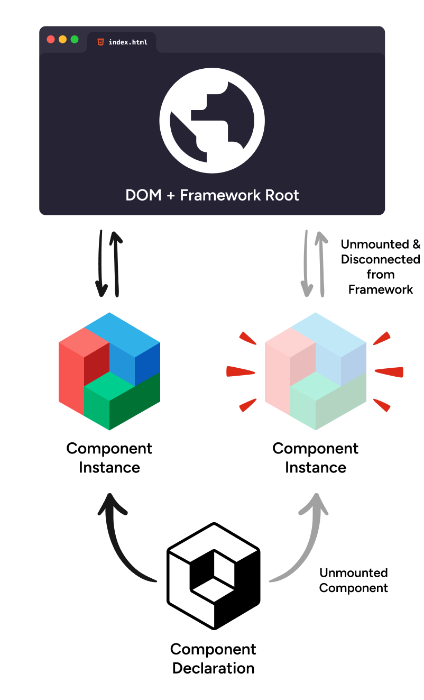
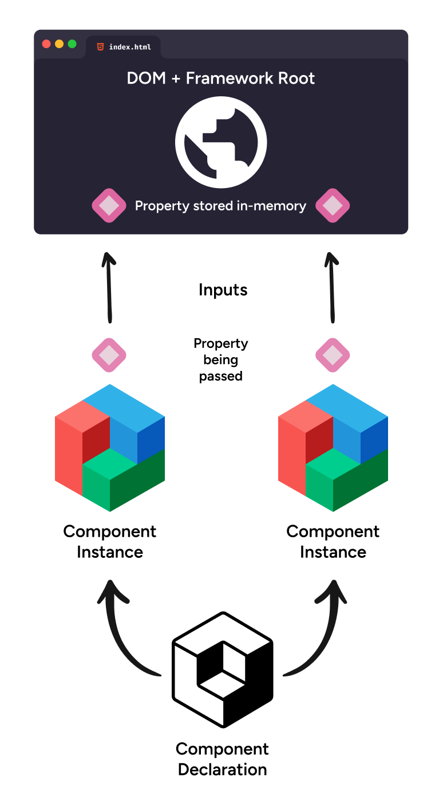
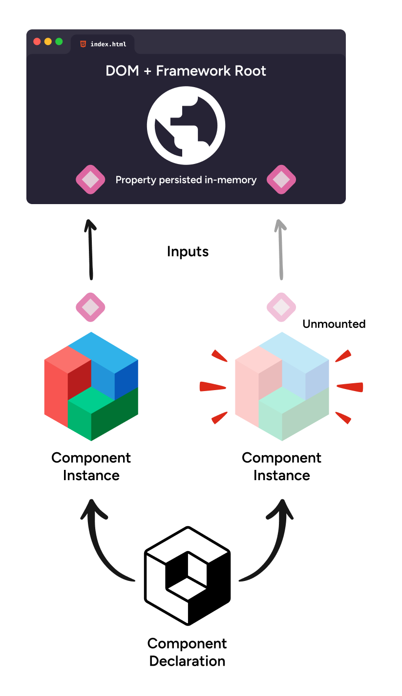
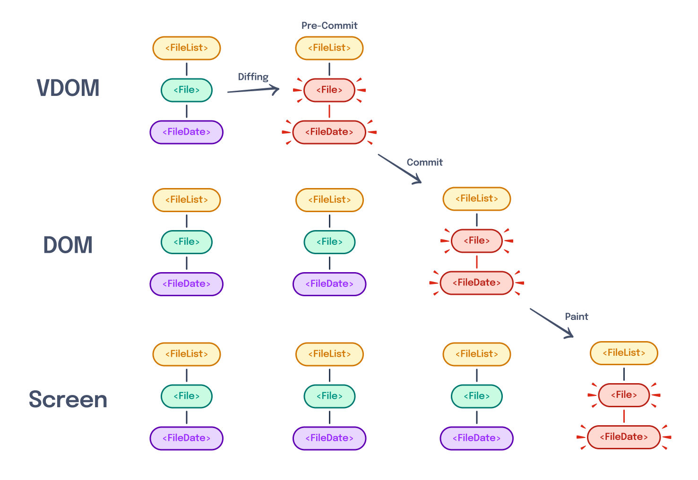
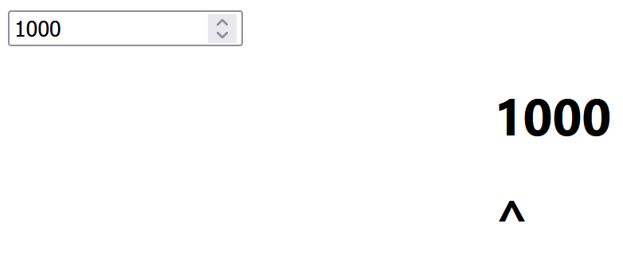
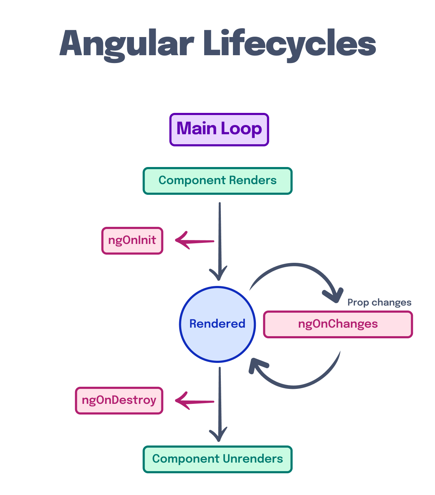
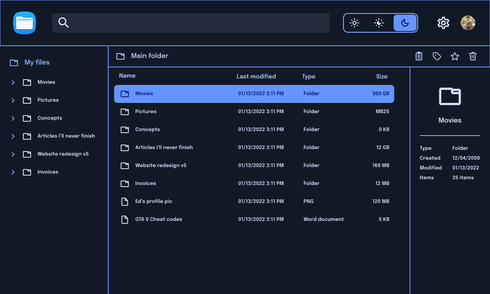

---
{
  title: "Side Effects",
  description: 'Some call them "lifecycle methods", others "effect handlers". However you spin it, they both handle side effects in your apps. How can we leverage them better?',
  published: "2024-03-11T12:04:00.000Z",
  authors: ["crutchcorn"],
  tags: ["react", "angular", "vue", "webdev"],
  attached: [],
  order: 4,
  collection: "framework-field-guide-fundamentals",
  version: "v2",
}
---

While you _can_ build static websites with React, Angular, and Vue, these frameworks shine brightest when building _interactive **applications**_.

These applications come in many shapes, forms, and functionalities, but all have one thing in common: They take live input from the user and display information back to the user.

This is the key difference between a static site and an interactive one; static sites show their contents and then allow the user to navigate through the site without drastic changes to the displayed content; meanwhile, interactive sites drastically shift their displayed information based off of user input.

This difference carries through to how you build the application as well. A static site might prioritize an initial load by front-loading the HTML compilation [through server-side render (SSR) or static site generation (SSG)](/posts/what-is-ssr-and-ssg). On the other hand, the interactive app is more likely to focus on processing information passed to it to customize your experience.

As interactive apps rely so heavily on processing information based on user input, React, Angular, and Vue, all provide built-in ways of interacting, intercepting, and otherwise ingesting this information.

<!-- ::in-content-ad title="Consider supporting" body="Donating any amount will help towards further development of the Framework Field Guide." button-text="Sponsor my work" button-href="https://github.com/sponsors/crutchcorn/" -->

While each of these frameworks handles this input ingestion slightly differently, the underlying concepts are the same: **All user input and output generate "Side effects", which need to be handled.**

This raises more questions than it answers:

- What is a side effect?
- How do these frameworks handle side effects?
- How does the browser notify the framework about side effects?
- How do you ensure side effects are cleaned up?
- How do you handle in-component side effects?

Let's answer these questions one by one, starting with:

# What Is a Side Effect? {#whats-a-side-effect}

A side effect is when a piece of code changes or relies on state outside its local environment. When a piece of code does not contain a side effect, it is considered "pure."



For example, say we have the following code:

```javascript
function pureFn() {
	let data = 0;
	data++;
	return data;
}
```

This logic would be considered "pure," as it does not rely on external data sources. However, if we move the `data` variable outside the local environment and mutate it elsewhere:

```javascript
let data;

function increment() {
	data++;
}

function setupData() {
	data = 0;
	increment();
	return data;
}
```

`increment` would be considered a "side effect" that mutates a variable outside its own environment.

> When does this come into play in a production application?

This is a great question! A great example of this occurs in the browser with the `window` and `document` APIs.

Say we wanted to store a global counter that we use in multiple parts of the app; we might store this in `window`.

```javascript
window.shoppingCartItems = 0;

function addToShoppingCart() {
	window.shoppingCartItems++;
}

addToShoppingCart();
addToShoppingCart();
addToShoppingCart(); // window.shoppingCartItems is now `3`
```

Because `window` is a global variable, mutating a value within it is a "side effect" when done inside a function, as the `window` variable was not declared within the `function`'s scope.

Notice how our `addToShoppingCart` method isn't returning anything; instead, it's mutating the `window` variable as a side effect to update a global value. If we attempted to remove side effects from `addToShoppingCart` without introducing a new variable, we'd be left with the following:

```js
window.shoppingCartItems = 0;

function addToShoppingCart() {
	// Nothing is happening here.
	// No side effects? Yay.
	// No functionality? Boo.
}

addToShoppingCart();
addToShoppingCart();
addToShoppingCart(); // window.shoppingCartItems is still `0`
```

Notice how `addToShoppingCart` now does nothing. To remove side effects while still retaining the functionality of incrementing a value, we'd have to both:

1. Pass an input
2. Return a value

With these changes, it might look something like this:

```js
function addToShoppingCart(val) {
	return val + 1;
}

let shoppingCartItems = 0;

shoppingCartItems = addToShoppingCart(shoppingCartItems);
shoppingCartItems = addToShoppingCart(shoppingCartItems);
shoppingCartItems = addToShoppingCart(shoppingCartItems);
// shoppingCartItems is now `3`
```

Because of the inherent nature of side effects, this demonstrates how **all functions that don't return a new value either do nothing or have a side effect within them**.

Further, because an application's inputs and outputs (combined, often called "`I/O`") come from the user rather than from the function itself, **all I/O operations are considered "side effects"**. This means that in addition to non-returning functions, all the following are considered "side effects":

- A user typing something
- A user clicking something
- Saving a file
- Loading a file
- Making a network request
- Printing something to a printer
- Logging a value to `console`

# How Do Frameworks Handle Side Effects? {#how-frameworks-handle-effects}

As mentioned previously, side effects are mission-critical for the kinds of applications that React, Angular, and Vue are all purpose-built for. To make side effect handling easier, each framework has its own method of running code on behalf of the developer when specific events occur in the component.

Component events a framework might listen for include:

- User input events

- A component rendering for the first time

- [A component being removed from the screen as part of a conditional render](/posts/ffg-fundamentals-dynamic-html)

- A component's data or passed properties changing

The first of these component events is commonly fully transparent to most developers: User input bindings.

Take the following, for example:

<!-- ::start:tabs -->

## React

```jsx
const Comp = () => {
	const sayHi = () => alert("Hi!");
	return <button onClick={sayHi}>Say hello</button>;
};
```

## Angular

```angular-ts
@Component({
	selector: "comp-comp",
    changeDetection: ChangeDetectionStrategy.OnPush,
	template: ` <button (click)="sayHi()">Say hello</button> `,
})
class CompComponent {
	sayHi() {
		alert("Hi!");
	}
}
```

## Vue

```vue
<!-- Comp.vue -->
<script setup>
const sayHi = () => alert("Hi!");
</script>

<template>
	<button @click="sayHi()">Say hello</button>
</template>
```

<!-- ::end:tabs -->

This component handles a `click` event (which is a user input — a side effect) and outputs an `alert` to the user in return (an output, another side effect).

See? Events are commonly hidden from the user when using one of these frameworks.

Let's look back at the four most common types of component side effect origin points:

- User input events

- A component rendering for the first time

- A component being removed from the screen as part of a conditional render

- A component's data or passed properties changing

While the first one was easy enough to tackle, the last three component events are often trickier to solve from a developer experience standpoint.

Often, a framework may implement an API corresponding to a developer-defined function (run by the framework)
as a one-to-one matching of these events that occur during a component's lifespan.
When a framework has a one-to-one mapping of function-to-lifecycle events, **this** mapping creates a series of APIs called "Lifecycle Methods"**.
Angular and Vue both have lifecycle methods as part of their core APIs.

On the other hand, **some frameworks choose to implement side effect handling without lifecycle methods**. React is a key example of this, but Vue also has a non-lifecycle method of managing side effects in a component.

To explore what these side-effect handlers can do, let's look at an example of a handler that runs during a component's initial render.

# Initial Render Side Effects {#initial-render-effects}

When we introduced components, we touched on the [concept of "rendering"](/posts/ffg-fundamentals-intro-to-components#rendering-app). This occurs when a component is drawn on-screen, either when the user loads a page for the first time or when shown or hidden using a [conditional render](/posts/ffg-fundamentals-dynamic-html#conditional-branch).

Say we have the following code:

<!-- ::start:tabs -->

## React

```jsx
const Child = () => {
	return <p>I am the child</p>;
};

const Parent = () => {
	const [showChild, setShowChild] = useState(true);

	return (
		<div>
			<button onClick={() => setShowChild(!showChild)}>Toggle Child</button>
			{showChild && <Child />}
		</div>
	);
};
```

<!-- ::start:no-ebook -->
<iframe data-frame-title="React Initial Render Demo - StackBlitz" src="pfp-code:./ffg-fundamentals-react-initial-render-demo-26?template=node&embed=1&file=src%2Fmain.jsx"></iframe>
<!-- ::end:no-ebook -->

## Angular

```angular-ts
@Component({
	selector: "child-comp",
    changeDetection: ChangeDetectionStrategy.OnPush,
	template: "<p>I am the child</p>",
})
class ChildComponent {}

@Component({
	selector: "parent-comp",
    changeDetection: ChangeDetectionStrategy.OnPush,
    imports: [ChildComponent],
	template: `
		<div>
			<button (click)="setShowChild()">Toggle Child</button>
			@if (showChild) {
				<child-comp />
			}
		</div>
	`,
})
class ParentComponent {
	showChild = signal(true);
	setShowChild() {
		this.showChild.set(!this.showChild());
	}
}
```

<!-- ::start:no-ebook -->
<iframe data-frame-title="Angular Initial Render Demo - StackBlitz" src="pfp-code:./ffg-fundamentals-angular-initial-render-demo-26?template=node&embed=1&file=src%2Fmain.ts"></iframe>
<!-- ::end:no-ebook -->

## Vue

```vue
<!-- Child.vue -->
<template>
	<p>I am the child</p>
</template>
```

```vue
<!-- Parent.vue -->
<script setup>
import { ref } from "vue";
import Child from "./Child.vue";

const showChild = ref(true);

function setShowChild() {
	showChild.value = !showChild.value;
}
</script>

<template>
	<div>
		<button @click="setShowChild()">Toggle Child</button>
		<Child v-if="showChild" />
	</div>
</template>
```

<!-- ::start:no-ebook -->
<iframe data-frame-title="Vue Initial Render Demo - StackBlitz" src="pfp-code:./ffg-fundamentals-vue-initial-render-demo-26?template=node&embed=1&file=src%2FParent.vue"></iframe>
<!-- ::end:no-ebook -->

<!-- ::end:tabs -->

Here, `Child` is added and removed from the DOM every time `setShowChild` is clicked. Let's say we wanted to add a way to call a `console.log` every time `Child` is shown on screen.

> Remember, `console.log` _outputs_ data to the user (albeit in a DevTools panel). As such, it's technically a side effect to call `console.log`.

While we _could_ add this log inside of `setShowChild`, it's more likely to break when we inevitably refactor the `Parent` component's code. Instead, let's add a side effect handler to call `console.log` whenever `Child` is rendered.

<!-- ::start:tabs -->

## React

Two Hooks handle all side effects within React components: `useEffect` and `useLayoutEffect`. Let's start by looking at `useEffect`:

```jsx
import { useEffect } from "react";

const Child = () => {
	// Pass a function that React will run for you
	useEffect(() => {
		console.log("I am rendering");
		// Pass an array of items to track changes of
	}, []);

	return <p>I am the child</p>;
};
```

<!-- ::start:no-ebook -->
<iframe data-frame-title="React Initial Render useEffect - StackBlitz" src="pfp-code:./ffg-fundamentals-react-initial-render-useeffect-27?template=node&embed=1&file=src%2Fmain.jsx"></iframe>
<!-- ::end:no-ebook -->

Here, we're completing the task of "run `console.log` when `Child` is rendered for the first time" by allowing React to run the `console.log` side effect inside of `useEffect`. The empty array hints to React that we'd only like this function to run once — when the component initially renders.

> The empty array passed to `useEffect` has a fair bit of nuance to it, which we'll learn about later.

We mentioned earlier that there is another hook used to handle side effects: `useLayoutEffect`. While `useLayoutEffect` is useful, it requires a bit of pre-requisite knowledge that we'll touch on throughout this chapter. Let's put it to the side and come back to it later.

## Angular

In Angular, there are two main methods to trigger a side effect from a component: `effect` and `afterRenderEffect`. While we'll touch on `afterRenderEffect` later, `effect`s are created on the constructor of a component, which in this instance is called when the component first mounts:

```angular-ts
import { Component, ChangeDetectionStrategy, effect } from "@angular/core";

@Component({
	selector: "child-comp",
    changeDetection: ChangeDetectionStrategy.OnPush,
	template: "<p>I am the child</p>",
})
class ChildComponent {
	constructor() {
		effect(() => {
			console.log("I am rendering");
		})
	}
}
```

<!-- ::start:no-ebook -->
<iframe data-frame-title="Angular Initial Render onInit - StackBlitz" src="pfp-code:./ffg-fundamentals-angular-initial-render-on-init-27?template=node&embed=1&file=src%2Fmain.ts"></iframe>
<!-- ::end:no-ebook -->

## Vue

While Angular strictly uses lifecycle methods and React uses a `useEffect` hook to handle side effects, Vue does a bit of both.

Let's start by taking a look at Vue's lifecycle method of handling a side effect.

### Vue's `onMounted` Lifecycle Method {#vue-onmounted}

```vue
<!-- Child.vue -->
<script setup>
import { onMounted } from "vue";

onMounted(() => {
	console.log("I am rendering");
});
</script>

<template>
	<p>I am the child</p>
</template>
```

<!-- ::start:no-ebook -->
<iframe data-frame-title="Vue Initial Render onMount - StackBlitz" src="pfp-code:./ffg-fundamentals-vue-initial-render-on-mount-27?template=node&embed=1&file=src%2FChild.vue"></iframe>
<!-- ::end:no-ebook -->

Here, we're importing the `onMounted` lifecycle handler from the `vue` import. Vue's lifecycle methods all start with an `on` prefix when used inside a `<script setup>` component.

### Vue's `watchEffect` Hook {#vue-watcheffect}

Just like how React has a non-lifecycle method of running side effect, so too does Vue. This is done using Vue's `watchEffect` and `watch` APIs. Let's start with a simple example:

```vue
<!-- Child.vue -->
<script setup>
import { watchEffect } from "vue";

watchEffect(() => {
	console.log("I am rendering");
});
</script>

<template>
	<p>I am the child</p>
</template>
```

<!-- ::start:no-ebook -->
<iframe data-frame-title="Vue Initial Render watchEffect - StackBlitz" src="pfp-code:./ffg-fundamentals-vue-initial-render-watch-effect-27?template=node&embed=1&file=src%2FChild.vue"></iframe>
<!-- ::end:no-ebook -->

Here, we're using `watchEffect` to run `console.log` as soon as the `Child` component renders.

Instead, `watchEffect` is commonly expected to be used alongside reactive values (like `ref` variables). We'll touch on how this works later on in the chapter.

<!-- ::end:tabs -->

As mentioned before, the framework itself calls these methods on your behalf when an internal event occurs; in this case, when `Child` is rendered.

Try clicking the toggle button repeatedly, and you'll see that the `console.log` occurs every time the `Child` component renders again.

# Using Side Effects in Production {#prod-side-effects}

On top of providing a global variable that we can mutate to store values, both [`window`](https://developer.mozilla.org/en-US/docs/Web/API/Window#methods) and [`document`](https://developer.mozilla.org/en-US/docs/Web/API/Document#methods) expose a number of APIs that can be useful in an application.

Let's say that inside our component, we'd like to display the window size:

<!-- ::start:tabs -->

## React

```jsx
const WindowSize = () => {
	const [height, setHeight] = useState(window.innerHeight);
	const [width, setWidth] = useState(window.innerWidth);

	return (
		<div>
			<p>Height: {height}</p>
			<p>Width: {width}</p>
		</div>
	);
};
```

<!-- ::start:no-ebook -->
<iframe data-frame-title="React Broken Window Size - StackBlitz" src="pfp-code:./ffg-fundamentals-react-broken-window-size-28?template=node&embed=1&file=src%2Fmain.jsx"></iframe>
<!-- ::end:no-ebook -->

## Angular

```angular-ts
@Component({
	selector: "window-size",
    changeDetection: ChangeDetectionStrategy.OnPush,
	template: `
		<div>
			<p>Height: {{ height }}</p>
			<p>Width: {{ width }}</p>
		</div>
	`,
})
class WindowSizeComponent {
	height = window.innerHeight;
	width = window.innerWidth;
}
```

<!-- ::start:no-ebook -->
<iframe data-frame-title="Angular Broken Window Size - StackBlitz" src="pfp-code:./ffg-fundamentals-angular-broken-window-size-28?template=node&embed=1&file=src%2Fmain.ts"></iframe>
<!-- ::end:no-ebook -->

## Vue

```vue
<!-- WindowSize.vue -->
<script setup>
const height = window.innerHeight;
const width = window.innerWidth;
</script>

<template>
	<div>
		<p>Height: {{ height }}</p>
		<p>Width: {{ width }}</p>
	</div>
</template>
```

<!-- ::start:no-ebook -->
<iframe data-frame-title="Vue Broken Window Size - StackBlitz" src="pfp-code:./ffg-fundamentals-vue-broken-window-size-28?template=node&embed=1&file=src%2FWindowSize.vue"></iframe>
<!-- ::end:no-ebook -->

<!-- ::end:tabs -->

This works to display the window size on the initial render, but what happens when the user resizes their browser?

Because we aren't listening for the change in window size, we never get an updated render with the new screen size!

Let's solve this by using [`window.addEventListener`](https://developer.mozilla.org/en-US/docs/Web/API/EventTarget/addEventListener) to handle [`resize` events](https://developer.mozilla.org/en-US/docs/Web/API/Window/resize_event) — emitted when the user changes their window size.

<!-- ::start:tabs -->

## React

```jsx {5-13}
const WindowSize = () => {
	const [height, setHeight] = useState(window.innerHeight);
	const [width, setWidth] = useState(window.innerWidth);

	useEffect(() => {
		function resizeHandler() {
			setHeight(window.innerHeight);
			setWidth(window.innerWidth);
		}

		// This code will cause a memory leak, more on that soon
		window.addEventListener("resize", resizeHandler);
	}, []);

	return (
		<div>
			<p>Height: {height}</p>
			<p>Width: {width}</p>
		</div>
	);
};
```

<!-- ::start:no-ebook -->
<iframe data-frame-title="React Leaking Window Size - StackBlitz" src="pfp-code:./ffg-fundamentals-react-leaking-window-size-29?template=node&embed=1&file=src%2Fmain.jsx"></iframe>
<!-- ::end:no-ebook -->

## Angular

```angular-ts {15-25}
@Component({
	selector: "window-size",
    changeDetection: ChangeDetectionStrategy.OnPush,
	template: `
		<div>
			<p>Height: {{ height }}</p>
			<p>Width: {{ width }}</p>
		</div>
	`,
})
class WindowSizeComponent {
	height = window.innerHeight;
	width = window.innerWidth;

	resizeHandler = () => {
		this.height = window.innerHeight;
		this.width = window.innerWidth;
	};

	constructor() {
        // This code will cause a memory leak, more on that soon
		effect(() => {
            window.addEventListener("resize", this.resizeHandler);		
		})
	}
}
```

> You may notice that we're using an arrow function for `resizeHandler`. This arrow function helps us bind `this` in `resizeHandler` back to the `WindowSizeComponent` instance.
>
> If this sentence feels unfamiliar, no worries; [I wrote an article explaining what this means](/posts/javascript-bind-usage).

<!-- ::start:no-ebook -->
<iframe data-frame-title="Angular Leaking Window Size - StackBlitz" src="pfp-code:./ffg-fundamentals-angular-leaking-window-size-29?template=node&embed=1&file=src%2Fmain.ts"></iframe>
<!-- ::end:no-ebook -->

## Vue

```vue {8-16}
<!-- WindowSize.vue -->
<script setup>
import { ref, onMounted } from "vue";

const height = ref(window.innerHeight);
const width = ref(window.innerWidth);

function resizeHandler() {
	height.value = window.innerHeight;
	width.value = window.innerWidth;
}

onMounted(() => {
	// This code will cause a memory leak, more on that soon
	window.addEventListener("resize", resizeHandler);
});
</script>

<template>
	<div>
		<p>Height: {{ height }}</p>
		<p>Width: {{ width }}</p>
	</div>
</template>
```

<!-- ::start:no-ebook -->
<iframe data-frame-title="Vue Leaking Window Size - StackBlitz" src="pfp-code:./ffg-fundamentals-vue-leaking-window-size-29?template=node&embed=1&file=src%2FWindowSize.vue"></iframe>
<!-- ::end:no-ebook -->

<!-- ::end:tabs -->

Now, when we resize the browser, our values on-screen should update as well.

## Event Bubbling Aside {#event-bubbling}

In our introduction to components, we demonstrated that [components can listen to HTML events](/posts/ffg-fundamentals-intro-to-components#event-binding).

What if we changed our code above to listen for the `resize` event that way to sidestep `addEventListener`?

<!-- ::start:tabs -->

### React

```jsx
const WindowSize = () => {
	const [height, setHeight] = useState(window.innerHeight);
	const [width, setWidth] = useState(window.innerWidth);

	function resizeHandler() {
		setHeight(window.innerHeight);
		setWidth(window.innerWidth);
	}

	// This code doesn't work, we'll explain why soon
	return (
		<div onResize={resizeHandler}>
			<p>Height: {height}</p>
			<p>Width: {width}</p>
		</div>
	);
};
```

<!-- ::start:no-ebook -->
<iframe data-frame-title="React Broken Event Bubbling - StackBlitz" src="pfp-code:./ffg-fundamentals-react-broken-event-bubbling-30?template=node&embed=1&file=src%2Fmain.jsx"></iframe>
<!-- ::end:no-ebook -->

### Angular

```angular-ts
@Component({
	selector: "window-size",
	standalone: true,
	template: `
		<!-- This code doesn't work, we'll explain why soon -->
		<div (resize)="resizeHandler()">
			<p>Height: {{ height() }}</p>
			<p>Width: {{ width() }}</p>
		</div>
	`,
})
class WindowSizeComponent {
	height = signal(window.innerHeight);
	width = signal(window.innerWidth);

	resizeHandler() {
		this.height.set(window.innerHeight);
		this.width.set(window.innerWidth);
    }
}
```

<!-- ::start:no-ebook -->
<iframe data-frame-title="Angular Broken Event Bubbling - StackBlitz" src="pfp-code:./ffg-fundamentals-angular-broken-event-bubbling-30?template=node&embed=1&file=src%2Fmain.ts"></iframe>
<!-- ::end:no-ebook -->

### Vue

```vue
<!-- WindowSize.vue -->
<script setup>
import { ref } from "vue";

const height = ref(window.innerHeight);
const width = ref(window.innerWidth);

function resizeHandler() {
	height.value = window.innerHeight;
	width.value = window.innerWidth;
}
</script>

<template>
	<!-- This code doesn't work, we'll explain why soon -->
	<div @resize="resizeHandler()">
		<p>Height: {{ height }}</p>
		<p>Width: {{ width }}</p>
	</div>
</template>
```

<!-- ::start:no-ebook -->
<iframe data-frame-title="Vue Broken Event Bubbling - StackBlitz" src="pfp-code:./ffg-fundamentals-vue-broken-event-bubbling-30?template=node&embed=1&file=src%2FWindowSize.vue"></iframe>
<!-- ::end:no-ebook -->

<!-- ::end:tabs -->

If we run this code, it will render as expected with the initial screen size, but subsequent re-renders will not update the value on the screen. This is because the `resize` event is only triggered on the `window` object (associated with the `<html>` tag) and does not permeate downwards towards other elements.

You see, by default, events will always "bubble" upwards in the DOM tree from their emitted position. So, if we click on a `div`, the `click` event will start from the `div` and bubble all the way up to the `html` tag.



We can demonstrate this inside our frameworks.

<!-- ::start:tabs -->

### React

```jsx
<div onClick={() => logMessage()}>
	<p>
		<span style={{ color: "red" }}>Click me</span> or even
		<span style={{ background: "green", color: "white" }}>me</span>!
	</p>
</div>
```

<!-- ::start:no-ebook -->
<iframe data-frame-title="React Event Bubbling - StackBlitz" src="pfp-code:./ffg-fundamentals-react-event-bubbling-31?template=node&embed=1&file=src%2Fmain.jsx"></iframe>
<!-- ::end:no-ebook -->

### Angular

```html
<div (click)="logMessage()">
	<p>
		<span style="color: red">Click me</span> or even
		<span style="background: green; color: white;">me</span>!
	</p>
</div>
```

<!-- ::start:no-ebook -->
<iframe data-frame-title="Angular Event Bubbling - StackBlitz" src="pfp-code:./ffg-fundamentals-angular-event-bubbling-31?template=node&embed=1&file=src%2Fmain.ts"></iframe>
<!-- ::end:no-ebook -->

### Vue

```html
<div @click="logMessage()">
	<p>
		<span style="color: red">Click me</span> or even
		<span style="background: green; color: white;">me</span>!
	</p>
</div>
```

<!-- ::start:no-ebook -->
<iframe data-frame-title="Vue Event Bubbling - StackBlitz" src="pfp-code:./ffg-fundamentals-vue-event-bubbling-31?template=node&embed=1&file=src%2FEventBubbler.vue"></iframe>
<!-- ::end:no-ebook -->

<!-- ::end:tabs -->

If you click on the `span`, the `click` event will start from the `span`, bubble up to the `p` tag, and then finally bubble up to the `div`. Because we add an event listener on the `div`, it will run `logMessage`, even when clicking on the `span`.

This is why we don't simply utilize event binding for the `resize` event: It's only ever emitted directly from the `html` node. Because of this behavior, if we want to access the `resize` event inside our `WindowSize` component, we need to use `addEventListener`.

[You can learn more about event bubbling, how it works, and how to overwrite it in specific instances from Mozilla Developer Network.](https://developer.mozilla.org/en-US/docs/Learn/JavaScript/Building_blocks/Events#event_bubbling_and_capture)

# Cleaning up Side Effects {#effect-cleanup}

Let's put down the code for a moment and talk about side effects with an analogy.

Let's say you're watching a TV show on a television that lacks the ability to rewind or go forward but does have the ability to pause.

> This might sound weird, but stick with me.

You're right at the peak moment of the show when suddenly your smoke alarm goes off.

"Oh no!" Your popcorn burnt in the microwave.

You have two options:

1. Pause the show, then stop the microwave.
2. Don't pause the show; go stop the microwave immediately.

While the second option might be the more natural reaction at a moment's notice, you'll find yourself with a problem: You just missed the big announcement in the show, and now you're left confused when you return to the TV.

Given your particular TV's lack of rewind functionality, you'd be stuck where you were without restarting the episode.

However, if you had paused the show, you would have been able to unpause once you'd turned off the microwave and see what the big reveal was.

---

> Surely, this analogy has little to do with frontend development, right?

Ahh, but it does!

See, think of the TV as being a component in your app with a side effect. Let's use this clock component as an example:

<!-- ::start:tabs -->

## React

```jsx
const Clock = () => {
	const [time, setTime] = useState(formatDate(new Date()));

	useEffect(() => {
		setInterval(() => {
			console.log("I am updating the time");
			setTime(formatDate(new Date()));
		}, 1000);
	}, []);

	return <p role="timer">Time is: {time}</p>;
};

function formatDate(date) {
	return (
		prefixZero(date.getHours()) +
		":" +
		prefixZero(date.getMinutes()) +
		":" +
		prefixZero(date.getSeconds())
	);
}

function prefixZero(number) {
	if (number < 10) {
		return "0" + number.toString();
	}

	return number.toString();
}
```

## Angular

```angular-ts
@Component({
	selector: "clock-comp",
	standalone: true,
	template: ` <p role="timer">Time is: {{ time() }}</p> `,
})
class ClockComponent implements OnInit {
	time = signal(formatDate(new Date()));

	constructor() {
		effect(() => {
            setInterval(() => {
                console.log("I am updating the time");
                this.time.set(formatDate(new Date()));
            }, 1000);
        });
	}
}

function formatDate(date: Date) {
	return (
		prefixZero(date.getHours()) +
		":" +
		prefixZero(date.getMinutes()) +
		":" +
		prefixZero(date.getSeconds())
	);
}

function prefixZero(number: number) {
	if (number < 10) {
		return "0" + number.toString();
	}

	return number.toString();
}
```

## Vue

```vue
<!-- Clock.vue -->
<script setup>
import { ref, onMounted } from "vue";

const time = ref(formatDate(new Date()));

onMounted(() => {
	setInterval(() => {
		console.log("I am updating the time");
		time.value = formatDate(new Date());
	}, 1000);
});

function formatDate(date) {
	return (
		prefixZero(date.getHours()) +
		":" +
		prefixZero(date.getMinutes()) +
		":" +
		prefixZero(date.getSeconds())
	);
}

function prefixZero(number) {
	if (number < 10) {
		return "0" + number.toString();
	}

	return number.toString();
}
</script>

<template>
	<p role="timer">Time is: {{ time }}</p>
</template>
```

<!-- ::end:tabs -->

In this example, we're [calling `setInterval` to run a function every second](https://developer.mozilla.org/en-US/docs/Web/API/setInterval). This function does two things:

1. Updates `time` to include [the current `Date`'s](https://developer.mozilla.org/en-US/docs/Web/JavaScript/Reference/Global_Objects/Date/Date) hour, minute, and second hand in its string
2. `console.log` a message

This `setInterval` call occurs on every `Clock` component render, thanks to each of the frameworks' side effect handlers.

Let's now render this `Clock` component inside a conditional block:

<!-- ::start:tabs -->

## React

```jsx
function App() {
	const [showClock, setShowClock] = useState(true);

	return (
		<div>
			<button onClick={() => setShowClock(!showClock)}>Toggle clock</button>
			{showClock && <Clock />}
		</div>
	);
}
```

<!-- ::start:no-ebook -->
<iframe data-frame-title="React Broken Clock - StackBlitz" src="pfp-code:./ffg-fundamentals-react-broken-clock-32?template=node&embed=1&file=src%2Fmain.jsx"></iframe>
<!-- ::end:no-ebook -->

## Angular

```angular-ts
@Component({
	selector: "app-root",
    changeDetection: ChangeDetectionStrategy.OnPush,
	imports: [ClockComponent],
	template: `
		<div>
			<button (click)="setShowClock(!showClock)">Toggle clock</button>
			@if (showClock()) {
				<clock-comp />
			}
		</div>
	`,
})
class AppComponent {
	showClock = signal(true);

	setShowClock(val: boolean) {
		this.showClock.set(val);
	}
}
```

<!-- ::start:no-ebook -->
<iframe data-frame-title="Angular Broken Clock - StackBlitz" src="pfp-code:./ffg-fundamentals-angular-broken-clock-32?template=node&embed=1&file=src%2Fmain.ts"></iframe>
<!-- ::end:no-ebook -->

## Vue

```vue
<!-- App.vue -->
<script setup>
import Clock from "./Clock.vue";
import { ref } from "vue";

const showClock = ref(true);

function setShowClock(val) {
	showClock.value = val;
}
</script>

<template>
	<div>
		<button @click="setShowClock(!showClock)">Toggle clock</button>
		<Clock v-if="showClock" />
	</div>
</template>
```

<!-- ::start:no-ebook -->
<iframe data-frame-title="Vue Broken Clock - StackBlitz" src="pfp-code:./ffg-fundamentals-vue-broken-clock-32?template=node&embed=1&file=src%2FClock.vue"></iframe>
<!-- ::end:no-ebook -->

<!-- ::end:tabs -->

In `App`, we're defaulting `showClock` to `true`. This means that our `Clock` component will render on `App`'s first render.

We can visually see that our clock is updating every second, but the really interesting part to us is the `console.log`. If we open up our browser's developer tools, we can see that it's logging every time it updates on screen as well.

However, let's toggle the `Clock` component a couple of times by clicking the button.

<!-- ::start:no-ebook -->

<video src="./lifecycle_timer.mp4" title="A browser showing developer tools and clock component rendering. On first render, the console.log occurs once per visual clock update, but on subsequent renders of the Clock component, the console.log runs too frequently"></video>

<!-- ::end:no-ebook -->

When we toggle the clock from rendering each time, it doesn't stop the `console.log` from running. However, when we re-render `Clock`, it creates a new interval of `console.log`s. This means that if we toggle the `Clock` component three times, it will run `console.log` three times for each update of the on-screen time.

**This is really bad behavior**. Not only does this mean that our computer is running more code than needed in the background, but it also means that the function that was passed to the `setInterval` call cannot be cleaned up by your browser. This means that your `setInterval` function (and all variables within it) stays in memory, which may eventually cause an out-of-memory crash if it occurs too frequently.

Moreover, this can directly impact your applications' functionality as well. Let's take a look at how that can happen:

## Broken Production Code {#broken-prod-code}

Imagine that you are building an alarm clock application. You want to have the following functionality:

- Show the remaining time on an alarm
- Show a "wake up" screen
- "Snooze" alarms for 5 minutes (temporarily reset the countdown of the timer to 5 minutes)
- Disable alarms entirely

Additionally, let's throw in **the ability to auto-snooze alarms that have been going off for 10 minutes**. After all, someone in a deep sleep is more likely to wake up from a change in noise volume rather than a repeating loud noise.

Let's build that functionality now, but reduce the "minutes" to "seconds" for easier testing:

<!-- ::start:tabs -->

### React

```jsx
function AlarmScreen({ snooze, disable }) {
	useEffect(() => {
		setTimeout(() => {
			// Automatically snooze the alarm
			// after 10 seconds of inactivity
			// In production, this would be 10 minutes
			snooze();
		}, 10 * 1000);
	}, []);

	return (
		<div>
			<p>Time to wake up!</p>
			<button onClick={snooze}>Snooze for 5 seconds</button>
			<button onClick={disable}>Turn off alarm</button>
		</div>
	);
}

function App() {
	const [secondsLeft, setSecondsLeft] = useState(5);
	const [timerEnabled, setTimerEnabled] = useState(true);

	useEffect(() => {
		setInterval(() => {
			setSecondsLeft((v) => {
				if (v === 0) return v;
				return v - 1;
			});
		}, 1000);
	}, []);

	const snooze = () => {
		// In production, this would add 5 minutes, not 5 seconds
		setSecondsLeft((v) => v + 5);
	};

	const disable = () => {
		setTimerEnabled(false);
	};

	if (!timerEnabled) {
		return <p>There is no timer</p>;
	}

	if (secondsLeft === 0) {
		return <AlarmScreen snooze={snooze} disable={disable} />;
	}

	return <p>{secondsLeft} seconds left in timer</p>;
}
```

<!-- ::start:no-ebook -->
<iframe data-frame-title="React Broken Alarm - StackBlitz" src="pfp-code:./ffg-fundamentals-react-broken-alarm-33?template=node&embed=1&file=src%2Fmain.jsx"></iframe>
<!-- ::end:no-ebook -->

### Angular

```angular-ts
@Component({
	selector: "alarm-screen",
	changeDetection: ChangeDetectionStrategy.OnPush,
	template: `
		<div>
			<p>Time to wake up!</p>
			<button (click)="snooze.emit()">Snooze for 5 seconds</button>
			<button (click)="disable.emit()">Turn off alarm</button>
		</div>
	`,
})
class AlarmScreenComponent {
	snooze = output();
	disable = output();

	constructor() {
		effect(() => {
			setTimeout(() => {
				// Automatically snooze the alarm
				// after 10 seconds of inactivity
				// In production, this would be 10 minutes
				this.snooze.emit();
			}, 10 * 1000);
		});
	}
}

@Component({
	selector: "app-root",
	imports: [AlarmScreenComponent],
	changeDetection: ChangeDetectionStrategy.OnPush,
	template: `
		@if (!timerEnabled()) {
			<p>There is no timer</p>
		} @else if (secondsLeft() === 0) {
			<alarm-screen (snooze)="snooze()" (disable)="disable()" />
		} @else {
			<p>{{ secondsLeft() }} seconds left in timer</p>
		}
	`,
})
class AppComponent {
	secondsLeft = signal(5);
	timerEnabled = signal(true);

	constructor() {
		effect(() => {
			setInterval(() => {
				if (this.secondsLeft() === 0) return;
				this.secondsLeft.set(this.secondsLeft() - 1);
			}, 1000);
		});
	}

	snooze() {
		// In production, this would add 5 minutes, not 5 seconds
		this.secondsLeft.set(this.secondsLeft() + 5);
	}

	disable() {
		this.timerEnabled.set(false);
	}
}
```

<!-- ::start:no-ebook -->
<iframe data-frame-title="Angular Broken Alarm - StackBlitz" src="pfp-code:./ffg-fundamentals-angular-broken-alarm-33?template=node&embed=1&file=src%2Fmain.ts"></iframe>
<!-- ::end:no-ebook -->

### Vue

```vue
<!-- AlarmScreen.vue -->
<script setup>
import { onMounted } from "vue";

const props = defineProps(["snooze", "disable"]);

onMounted(() => {
	setTimeout(() => {
		// Automatically snooze the alarm
		// after 10 seconds of inactivity
		// In production, this would be 10 minutes
		props.snooze();
	}, 10 * 1000);
});
</script>

<template>
	<div>
		<p>Time to wake up!</p>
		<button @click="props.snooze()">Snooze for 5 seconds</button>
		<button @click="props.disable()">Turn off alarm</button>
	</div>
</template>
```

```vue
<!-- App.vue -->
<script setup>
import AlarmScreen from "./AlarmScreen.vue";
import { ref, onMounted } from "vue";

const secondsLeft = ref(5);
const timerEnabled = ref(true);

onMounted(() => {
	setInterval(() => {
		if (secondsLeft.value === 0) return;
		secondsLeft.value = secondsLeft.value - 1;
	}, 1000);
});

const snooze = () => {
	// In production, this would add 5 minutes, not 5 seconds
	secondsLeft.value = secondsLeft.value + 5;
};

const disable = () => {
	timerEnabled.value = false;
};
</script>

<template>
	<p v-if="!timerEnabled">There is no timer</p>
	<AlarmScreen
		v-else-if="secondsLeft === 0"
		:snooze="snooze"
		:disable="disable"
	/>
	<p v-else>{{ secondsLeft }} seconds left in timer</p>
</template>
```

<!-- ::start:no-ebook -->
<iframe data-frame-title="Vue Broken Alarm - StackBlitz" src="pfp-code:./ffg-fundamentals-vue-broken-alarm-33?template=node&embed=1&file=src%2FApp.vue"></iframe>
<!-- ::end:no-ebook -->

> You'll notice that we're not using events for our Vue code sample and have instead opted to pass a function.
> This is because, while the other frameworks will continue to listen for events from an unmounted component, Vue does
> not.
>
> This doesn't mean that Vue solves this issue for us, however. While passing a function is less common than using an output
> in Vue, it's not the only way to do things. Moreover, while using Vue's output to handle `snooze` and `disable` functionality
> solves the issue from the user's standpoint; it doesn't solve the memory leak that you're creating by not cleaning up your
> `setTimeout`.
>
> To understand this a bit better, [there's a section of this chapter that explains this.](#hidden-memory-leaks)

<!-- ::end:tabs -->

Yes! It renders the seconds to countdown and then shows the `AlarmScreen` as expected. Even our "auto-snooze" functionality is working as intended.

Let's test our manual "snooze" button and see if that works as expe-...

> Wait, did the timer screen go from 4 seconds to 9? That's not how a countdown works!

<!-- ::start:no-ebook -->

<video src="./timer_incorrect_loop.mp4" title="A browser displays the second countdown to the alarm screen, but when the user clicks on the 'snooze' button, the countdown goes from '4 seconds left' to '9 seconds left' and keeps counting down from there like normal"></video>

<!-- ::end:no-ebook -->

Sure enough, if you happen to click the manual "Snooze" button right before the auto-snooze goes off, it will add an extra 5 seconds to your existing countdown.

This occurs because we never tell the `AlarmScreen`'s `setTimeout` to stop running, even when `AlarmScreen` is no longer rendered.

```javascript
// AlarmScreen component
setTimeout(() => {
	snooze();
}, 10 * 1000);
```

When the above code's `snooze` runs, it will add 4 seconds to the `secondsLeft` variable through the `App`'s `snooze` method.

To solve this, we simply need to tell our `AlarmScreen` component to cancel the `setTimeout` when it's no longer rendered. Let's look at we can do that with a side effect handler.

## Unmounting {#unmounting}

In our previous code sample, we showed that mounted side effects left unclean will cause bugs in our apps and performance headaches for our users.

Let's clean up these side effects using a handler that runs during a component's unmounting. To do this, we'll use JavaScript's `clearTimeout` to remove any `setTimeout`s that are left unrun:

```javascript
const timeout = setTimeout(() => {
	// ...
}, 1000);

// This stops a timeout from running if unran.
// Otherwise, it does nothing.
clearTimeout(timeout);
```

Similarly, when using `setInterval`, there's a `clearInterval` method we can use for cleanup:

```javascript
const interval = setInterval(() => {
	// ...
}, 1000);

// This stops an interval from running
clearInterval(interval);
```

<!-- ::start:tabs -->

### React

To run a cleanup function on React's `useEffect`, return a function inside the `useEffect`.

```jsx
const Cleanup = () => {
	useEffect(() => {
		return () => {
			alert("I am cleaning up");
		};
	}, []);

	return <p>Unmount me to see an alert</p>;
};
```

<!-- ::start:no-ebook -->
<iframe data-frame-title="React Unmounting - StackBlitz" src="pfp-code:./ffg-fundamentals-react-unmounting-34?template=node&embed=1&file=src%2Fmain.jsx"></iframe>
<!-- ::end:no-ebook -->

This returned function will be run whenever:

- `useEffect` is re-ran.
  - The returned function is run before the new `useEffect` instance is run.
- `Comp` is unrendered.

> It may seem like I said the same thing twice here, however `useEffect` can be run independent of a component's initial render. More on that soon.

Let's apply this returned function to our code sample previously:

```jsx
function AlarmScreen({ snooze, disable }) {
	useEffect(() => {
		const timeout = setTimeout(() => {
			// Automatically snooze the alarm
			// after 10 seconds of inactivity
			// In production, this would be 10 minutes
			snooze();
		}, 10 * 1000);

		return () => clearTimeout(timeout);
	}, []);

	// ...
}

function App() {
	// ...

	useEffect(() => {
		const timeout = setInterval(() => {
			setSecondsLeft((v) => {
				if (v === 0) return v;
				return v - 1;
			});
		}, 1000);

		return () => clearInterval(timeout);
	}, []);

	// ...
}
```

### Angular

Every effect you use in Angular allows you to have an associated "cleanup" phase.

This cleanup phase runs before any subsequent executions of the `effect` (more on that soon) **and** when a component is removed from the component tree.

This means that we can use `effect`'s `onCleanup` registration to run when a component unmounts:

```angular-ts
@Component({
	selector: "cleanup-comp",
    changeDetection: ChangeDetectionStrategy.OnPush,
	template: `<p>Unmount me to see an alert</p>`,
})
class CleanupComponent {
	constructor() {
		effect(onCleanup => {
			onCleanup(() => {
				alert("I am cleaning up");
			})
		})
	}
}
```

<!-- ::start:no-ebook -->
<iframe data-frame-title="Angular Unmounting - StackBlitz" src="pfp-code:./ffg-fundamentals-angular-unmounting-34?template=node&embed=1&file=src%2Fmain.ts"></iframe>
<!-- ::end:no-ebook -->

Let's apply this new lifecycle method to our code sample previously:

```angular-ts
@Component({
	selector: "alarm-screen",
    changeDetection: ChangeDetectionStrategy.OnPush,
	// ...
})
class AlarmScreenComponent {
	// ...

	constructor() {
		effect((onCleanup) => {
            const timeout = setTimeout(() => {
                if (this.secondsLeft() === 0) return;
                this.secondsLeft.set(this.secondsLeft() - 1);
            }, 1000);		

            onCleanup(() => {
                clearTimeout(this.timeout);
            });	
		})
    }

	// ...
}

@Component({
	selector: "app-root",
    changeDetection: ChangeDetectionStrategy.OnPush,
	// ...
})
class AppComponent implements OnInit, OnDestroy {
	// ...

	constructor() {
		effect((onCleanup) => {
            const interval = setInterval(() => {
                if (this.secondsLeft() === 0) return;
                this.secondsLeft.set(this.secondsLeft() - 1);
            }, 1000);
            
            onCleanip(() => {
	            clearInterval(this.interval);
            })
        })
    }

	// ...
}
```

### Vue

Similar to how we import `onMounted`, we can import `onUnmounted` in Vue to run the relevant lifecycle method.

```vue
<!-- Cleanup.vue -->
<script setup>
import { onUnmounted } from "vue";

onUnmounted(() => {
	alert("I am cleaning up");
});
</script>

<template>
	<p>Unmount me to see an alert</p>
</template>
```

<!-- ::start:no-ebook -->
<iframe data-frame-title="Vue Unmounting - StackBlitz" src="pfp-code:./ffg-fundamentals-vue-unmounting-34?template=node&embed=1&file=src%2FCleanup.vue"></iframe>
<!-- ::end:no-ebook -->

Let's apply this new lifecycle method to our code sample previously:

```vue
<!-- AlarmScreen.vue -->
<script setup>
import { ref, onMounted, onUnmounted } from "vue";

const emit = defineEmits(["snooze", "disable"]);

// We don't need to wrap this in `ref`, since it won't be used in `template`
let timeout;

onMounted(() => {
	timeout = setTimeout(() => {
		// Automatically snooze the alarm
		// after 10 seconds of inactivity
		// In production, this would be 10 minutes
		emit("snooze");
	}, 10 * 1000);
});

onUnmounted(() => {
	clearTimeout(timeout);
});
</script>

<template>
	<!-- ... -->
</template>
```

```vue
<!-- App.vue -->
<script setup>
import AlarmScreen from "./AlarmScreen.vue";
import { ref, onMounted, onUnmounted } from "vue";

// We don't need to wrap this in `ref`, since it won't be used in `template`
let interval;

onMounted(() => {
	interval = setInterval(() => {
		if (secondsLeft.value === 0) return;
		secondsLeft.value = secondsLeft.value - 1;
	}, 1000);
});

onUnmounted(() => {
	clearInterval(interval);
});

// ...
</script>

<template>
	<!-- ... -->
</template>
```

#### Vue's `watchEffect` Cleanup {#watcheffect-cleanup}

As mentioned previously, Vue has two methods of handling side effects; Lifecycle methods and `watchEffect`. Luckily, `watchEffect` also has the ability to clean up side effects that were created before.

To clean up an effect, `watchEffect` provides an argument to the inner `watchEffect` function, which we'll name `onCleanup`. This property is, in itself, a function that we call with the cleanup logic:

```javascript
// onCleanup is a property passed to the inner `watchEffect` function
watchEffect((onCleanup) => {
	const interval = setInterval(() => {
		console.log("Hello!");
	}, 1000);

	// We then call `onCleanup` with the expected cleaning behavior
	onCleanup(() => {
		clearInterval(interval);
	});
});
```

Let's rewrite the previous code samples to use `watchEffect`:

```vue
<!-- App.vue -->
<script setup>
import AlarmScreen from "./AlarmScreen.vue";
import { ref, watchEffect } from "vue";

const secondsLeft = ref(5);
const timerEnabled = ref(true);

watchEffect((onCleanup) => {
	const interval = setInterval(() => {
		if (secondsLeft.value === 0) return;
		secondsLeft.value = secondsLeft.value - 1;
	}, 1000);

	onCleanup(() => {
		clearInterval(interval);
	});
});

const snooze = () => {
	secondsLeft.value = secondsLeft.value + 5;
};

const disable = () => {
	timerEnabled.value = false;
};
</script>

<template>
	<p v-if="!timerEnabled">There is no timer</p>
	<AlarmScreen
		v-else-if="secondsLeft === 0"
		@snooze="snooze()"
		@disable="disable()"
	/>
	<p v-else>{{ secondsLeft }} seconds left in timer</p>
</template>
```

```vue
<!-- AlarmScreen.vue -->
<script setup>
import { ref, watchEffect } from "vue";

const emit = defineEmits(["snooze", "disable"]);

watchEffect((onCleanup) => {
	const timeout = setTimeout(() => {
		// Automatically snooze the alarm
		// after 10 seconds of inactivity
		// In production, this would be 10 minutes
		emit("snooze");
	}, 10 * 1000);

	onCleanup(() => clearTimeout(timeout));
});
</script>

<template>
	<div>
		<p>Time to wake up!</p>
		<button @click="emit('snooze')">Snooze for 5 seconds</button>
		<button @click="emit('disable')">Turn off alarm</button>
	</div>
</template>
```

<!-- ::end:tabs -->

## Hidden Memory Leaks {#hidden-memory-leaks}

While we've quickly glanced at how each framework is able to clean up its side effects using a side effect handler that runs when a component unmounts, we haven't seen how this impacts other aspects of a component yet.

For example, [we mentioned in the first chapter that you can emit events from a child component into a parent component](/posts/ffg-fundamentals-intro-to-components#outputs). Let's build out a component that uses _events_ to trigger a parent function a second after its contents are shown.

> Let's not yet introduce cleanup, you'll see why in a second.

<!-- ::start:tabs -->

### React

React isn't able to emit an event from a child component to a parent component without passing a function down from the parent to the child:

```jsx
const Child = ({ fn }) => {
	// ...
};

const Parent = () => {
	const fn = () => {
		// ...
	};
	return <Child fn={fn} />;
};
```

However, **this is not the same thing as emitting an event in Angular or Vue**. We'll take a look at why that is and how it relates to a component unmounting shortly.

### Angular

```angular-ts
@Component({
	selector: "app-alert",
    changeDetection: ChangeDetectionStrategy.OnPush,
	template: ` <p>Showing alert...</p> `,
})
class AlertComponent {
	alert = output();

	constructor() {
		effect(() => {
            // Notice that we don't clean up this side effect
            setTimeout(() => {
                this.alert.emit();
            }, 1000);
		})
	}
}

@Component({
	selector: "app-root",
    changeDetection: ChangeDetectionStrategy.OnPush,
	imports: [AlertComponent],
	template: `
		<div>
			<!-- Try clicking and unclicking quickly -->
			<button (click)="toggle()">Toggle</button>
			<!-- Binding to an event -->
			@if (show()) {
				<app-alert (alert)="alertUser()" />
			}
		</div>
	`,
})
class AppComponent {
	show = signal(false);

	toggle() {
		this.show.set(!this.show());
	}

	alertUser() {
		alert("I am an alert!");
	}
}
```

<!-- ::start:no-ebook -->
<iframe data-frame-title="Angular Hidden Memory Leak Events - StackBlitz" src="pfp-code:./ffg-fundamentals-angular-hidden-memory-leak-events-35?template=node&embed=1&file=src%2Fmain.ts"></iframe>
<!-- ::end:no-ebook -->

### Vue

```vue
<!-- Alert.vue -->
<script setup>
import { onMounted } from "vue";

const emit = defineEmits(["alert"]);

onMounted(() => {
	setTimeout(() => {
		emit("alert");
	}, 1000);
});
</script>

<template>
	<p>Showing alert...</p>
</template>
```

```vue
<!-- App.vue -->
<script setup>
import { ref } from "vue";
import Alert from "./Alert.vue";

const show = ref(false);

const toggle = () => (show.value = !show.value);

const alertUser = () => alert("I am an alert!");
</script>

<template>
	<div>
		<!-- Try clicking and unclicking quickly -->
		<button @click="toggle()">Toggle</button>
		<!-- Binding to an event -->
		<Alert v-if="show" @alert="alertUser()" />
	</div>
</template>
```

<!-- ::start:no-ebook -->
<iframe data-frame-title="Vue Hidden Memory Leak Events - StackBlitz" src="pfp-code:./ffg-fundamentals-vue-hidden-memory-leak-events-35?template=node&embed=1&file=src%2FApp.vue"></iframe>
<!-- ::end:no-ebook -->

<!-- ::end:tabs -->

Now, if we run one of our code samples and click on a button rapidly and repeatedly, we get... Nothing! Only the last `alert` will show up to notify you that our `Alert` component has been rendered.

> That's strange... I thought that our `setTimeout` would still trigger because we haven't cleaned it up using a `clearTimeout`.

You're right! The `setTimeout` _does_ trigger! You can verify this by updating our `setTimeout` to include a `console.log` inside of it.

> Then why isn't our `alert` being triggered?

Well, when you think about how a component in one of these frameworks works, you might visualize them akin to this:



Here, we can see that despite there being one component declaration:

<!-- ::start:tabs -->

### React

```jsx {2}
const Comp = () => {
	const obj = {};

	return <p>Hello, world</p>;
};
```

### Angular

```angular-ts {7}
@Component({
	selector: "app-comp",
    changeDetection: ChangeDetectionStrategy.OnPush,
	template: `<p>Hello, world</p>`,
})
class CompComponent {
	obj = {};
}
```

### Vue

```vue {3}
<!-- Comp.vue -->
<script setup>
const obj = {};
</script>

<template>
	<p>Hello, world</p>
</template>
```

<!-- ::end:tabs -->

Every time we use this component:

<!-- ::start:tabs -->

### React

```jsx {3-6}
const App = () => {
	return <div>
		<!-- One: -->
		<Comp />
		<!-- Two: -->
		<Comp />
	</div>
}
```

### Angular

```angular-ts {7-10}
@Component({
	selector: "app-root",
    changeDetection: ChangeDetectionStrategy.OnPush,
	imports: [CompComponent],
	template: `
		<div>
			<!-- One: -->
			<app-comp />
			<!-- Two: -->
			<app-comp />
		</div>
	`,
})
class AppComponent {}
```

### Vue

```vue {8-11}
<!-- App.vue -->
<script setup>
import Comp from "./Comp.vue";
</script>

<template>
	<div>
		<!-- One: -->
		<Comp />
		<!-- Two: -->
		<Comp />
	</div>
</template>
```

<!-- ::end:tabs -->

Each of the individual `Comp` usages generates a component _instance_. These instances have their own separate memory usage, which allows you to control the state from them both independently of one another.

Moreover, though, because each component instance has its own connection to the framework root instance,
it can do some cleanup of event listeners when an instance is detached without impacting other instances:



> So if the framework events are cleaned up for us, why do we need to handle and cleanup side effects manually?

Well, as we showed, our `setTimeout` in our example isn't cleaned up even though the `emit` output from the parent is. This means that if you have long-standing code (say, a `useInterval` instead of a `setTimeout`), you'll not release that part of the memory back to JavaScript's internal cleanup.

That's the definition of a memory leak: Not allowing the language to clean up old code. Eventually, over time, you may even hit an "out of memory" error, where your computer can no longer run your app or site without resetting itself.

> Have the feeling you're missing something? Some of this section requires pre-existing knowledge about how computer memory works both [in hardware land](/posts/how-computers-speak#ram) and [how JavaScript handles memory under-the-hood](/posts/object-mutation). It's suggested to read these resources and come back if you're feeling confused.

### Seeing Hidden Memory Leaks {#seeing-hidden-memory-leaks}

Not only are the memory leaks we mentioned hidden from the user when using events, but there are ways to accidentally expose them to your user as well.

The easiest way to do this is to switch away from an event handler and towards a function being passed from the parent to the child:

<!-- ::start:tabs -->

#### React

```jsx
const Alert = ({ alert }) => {
	useEffect(() => {
		setTimeout(() => {
			alert();
		}, 1000);
	});

	return <p>Showing alert...</p>;
};
const App = () => {
	const [show, setShow] = useState(false);
	const alertUser = () => alert("I am an alert!");

	return (
		<>
			<button onClick={() => setShow(!show)}>Toggle</button>
			{show && <Alert alert={alertUser} />}
		</>
	);
};
```

<!-- ::start:no-ebook -->
<iframe data-frame-title="React Hidden Memory Leak Functions - StackBlitz" src="pfp-code:./ffg-fundamentals-react-hidden-memory-leak-functions-36?template=node&embed=1&file=src%2Fmain.jsx"></iframe>
<!-- ::end:no-ebook -->

#### Angular

```angular-ts
@Component({
	selector: "app-alert",
    changeDetection: ChangeDetectionStrategy.OnPush,
	template: ` <p>Showing alert...</p> `,
})
class AlertComponent {
	alert = input<() => void>();

	constructor() {
		effect(() => {
            setTimeout(() => {
                const alertFn = this.alert();
                alertFn();
            }, 1000);
		})
	}
}

@Component({
	selector: "app-root",
    changeDetection: ChangeDetectionStrategy.OnPush,
	imports: [AlertComponent],
	template: `
		<button (click)="toggle()">Toggle</button>
		@if (show()) {
			<app-alert [alert]="alertUser" />
		}
	`,
})
class AppComponent {
	show = signal(false);

	toggle() {
		this.show.set(!this.show());
	}

	alertUser() {
		alert("I am an alert!");
	}
}
```

<!-- ::start:no-ebook -->
<iframe data-frame-title="Angular Hidden Memory Leak Functions - StackBlitz" src="pfp-code:./ffg-fundamentals-angular-hidden-memory-leak-functions-36?template=node&embed=1&file=src%2Fmain.ts"></iframe>
<!-- ::end:no-ebook -->

#### Vue

```vue
<!-- Alert.vue -->
<script setup>
import { onMounted } from "vue";

const props = defineProps(["alert"]);

onMounted(() => {
	setTimeout(() => {
		props.alert?.();
	}, 1000);
});
</script>

<template>
	<p>Showing alert...</p>
</template>
```

```vue
<!-- App.vue -->
<script setup>
import { ref } from "vue";
import Alert from "./Alert.vue";

const show = ref(false);

const toggle = () => (show.value = !show.value);

const alertUser = () => alert("I am an alert!");
</script>

<template>
	<!-- Try clicking and unclicking quickly -->
	<button @click="toggle()">Toggle</button>
	<!-- Passing a function -->
	<Alert v-if="show" :alert="alertUser" />
</template>
```

<!-- ::start:no-ebook -->
<iframe data-frame-title="Vue Hidden Memory Leak Functions - StackBlitz" src="pfp-code:./ffg-fundamentals-vue-hidden-memory-leak-functions-36?template=node&embed=1&file=src%2FApp.vue"></iframe>
<!-- ::end:no-ebook -->

<!-- ::end:tabs -->

Now if we click the "Toggle" button rapidly, you'll end up with multiple `alert`s back-to-back, as many times as you toggled the `Alert` component. Your hidden memory leak is now visible to the user! 😱

> Why does this behavior differ from listening for an event from the parent?

Well, let's look at our old example visually once again:



You may notice that instead of a two-way binding, we're now passing a function reference from the component instance to the framework and DOM. As a result of this passing (rather than listening), [our framework of choice no longer has the ability to forcibly invalidate this reference](/posts/object-mutation). After all, [a function in JavaScript is just a value](/posts/javascript-functions-are-values) that can be passed like any other.

This shift in how we're handling a parent's data (binding vs. getting a reference) means that on cleanup, the function passed to a child will not become invalid. Instead, it will persist in memory until it's no longer needed by the child component and cleaned up by JavaScript's internals:



This is why it's so important to clean up memory — it's easy to let it become leaky and accidentally shift the user's expected behavior.

## Cleaning up Event Listeners {#cleaning-event-listeners}

[We had a code sample earlier in the chapter that relied on `addEventListener` to get the window size](#prod-side-effects). This code sample, you may have guessed, had a memory leak in it because we never cleaned up this event listener.

To clean up an event listener, we must remove its reference from the `window` object via `removeEventListener`:

```javascript
const fn = () => console.log("a");
window.addEventListener("resize", fn);
window.removeEventListener("resize", fn);
```

> Something to keep in mind with `removeEventListener` is that it needs to be the same function passed as the second argument to remove it from the listener.
>
> This means that inline arrow functions like this:
>
> ```javascript
> window.addEventListener("resize", () => console.log("a"));
> window.removeEventListener("resize", () => console.log("a"));
> ```
>
> Won't work, but the following will:
>
> ```javascript
> const fn = () => console.log("a");
> window.addEventListener("resize", fn);
> window.removeEventListener("resize", fn);
> ```

Let's fix our `WindowSize` component from before by cleaning up the event listener side effect using the knowledge we have now.

<!-- ::start:tabs -->

### React

```jsx
const WindowSize = () => {
	const [height, setHeight] = useState(window.innerHeight);
	const [width, setWidth] = useState(window.innerWidth);

	useEffect(() => {
		function resizeHandler() {
			setHeight(window.innerHeight);
			setWidth(window.innerWidth);
		}
		window.addEventListener("resize", resizeHandler);

		return () => window.removeEventListener("resize", resizeHandler);
	}, []);

	return (
		<div>
			<p>Height: {height}</p>
			<p>Width: {width}</p>
		</div>
	);
};
```

### Angular

```angular-ts
@Component({
	selector: "window-size",
    changeDetection: ChangeDetectionStrategy.OnPush,
    template: `
		<div>
			<p>Height: {{ height() }}</p>
			<p>Width: {{ width() }}</p>
		</div>
	`,
})
class WindowSizeComponent {
	height = signal(window.innerHeight);
	width = signal(window.innerWidth);

	// This must be an arrow function, see below for more
	resizeHandler = () => {
		this.height.set(window.innerHeight);
		this.width.set(window.innerWidth);
	};

	constructor() {
		effect(onCleanup => {
			window.addEventListener("resize", this.resizeHandler)		

			onCleanup(() => {
				window.removeEventListener("resize", this.resizeHandler);			
			})
		})
	}
}
```

Here, we're making sure to use an arrow function for `resizeHandler` in order to make sure that `removeEventListener` works as expected.

To learn more about _why_ that is, [read this article I wrote about this topic](/posts/javascript-bind-usage).

### Vue

Using lifecycles, this would be:

```vue
<!-- WindowSize.vue -->
<script setup>
import { ref, onMounted, onUnmounted } from "vue";

const height = ref(window.innerHeight);
const width = ref(window.innerWidth);

function resizeHandler() {
	height.value = window.innerHeight;
	width.value = window.innerWidth;
}

onMounted(() => {
	window.addEventListener("resize", resizeHandler);
});

onUnmounted(() => {
	window.removeEventListener("resize", resizeHandler);
});
</script>

<template>
	<div>
		<p>Height: {{ height }}</p>
		<p>Width: {{ width }}</p>
	</div>
</template>
```

Or, using `watchEffect`, this is:

```vue
<!-- WindowSize.vue -->
<script setup>
import { ref, watchEffect } from "vue";

const height = ref(window.innerHeight);
const width = ref(window.innerWidth);

function resizeHandler() {
	height.value = window.innerHeight;
	width.value = window.innerWidth;
}

watchEffect((onCleanup) => {
	window.addEventListener("resize", resizeHandler);
	onCleanup(() => window.removeEventListener("resize", resizeHandler));
});
</script>

<template>
	<div>
		<p>Height: {{ height }}</p>
		<p>Width: {{ width }}</p>
	</div>
</template>
```

<!-- ::end:tabs -->

## Ensuring Side Effect Cleanup {#ensuring-effect-cleanup}

Some frameworks have taken extra steps to ensure your side effects are always cleaned up.

<!-- ::start:tabs -->

### React

When React 16.3 came out, [it introduced a new component called `StrictMode`](https://reactjs.org/blog/2018/03/29/react-v-16-3.html#strictmode-component).

`StrictMode` was developed to help warn developers of potential problems that lie dormant in their applications. It's commonly enabled in most production codebases and is used at the root of the app like so:

```jsx
import { StrictMode } from "react";
import { createRoot } from "react-dom/client";

const App = () => {
	// ...
};

createRoot(document.getElementById("root")).render(
	<StrictMode>
		<App />
	</StrictMode>,
);
```

Specifically, `StrictMode` helps find issues with:

- Unsafe Hooks usage
- Legacy API usage
- Unexpected side effects

It does so by modifying slight behaviors of your app and printing errors when needed.

> `StrictMode` only does this on development builds of your app and does not impact your code whatsoever during production.

[Since React 18, `StrictMode` will re-run all `useEffect`s twice](/posts/why-react-18-broke-your-app). This change was made by the React team to highlight potential bugs in your application that are caused by uncleaned side effects.

So, if you have the following code:

```jsx
let i = 0;
const App = () => {
	useEffect(() => {
		alert(`I am rendering. Counter: ${++i}`);
	}, []);

	// ...
};

createRoot(document.getElementById("root")).render(
	<StrictMode>
		<App />
	</StrictMode>,
);
```

You'd see two `alert`s when the component renders:

1. `I am rendering. Counter: 1`
2. `I am rendering. Counter: 2`

However, if you disable `StrictMode` your output will be:

1. `I am rendering. Counter: 1`

<!-- ::start:no-ebook -->
<iframe data-frame-title="React Ensure Cleanup - StackBlitz" src="pfp-code:./ffg-fundamentals-react-ensure-cleanup-37?template=node&embed=1&file=src%2Fmain.jsx"></iframe>
<!-- ::end:no-ebook -->

Again, **this is intentional**. React is trying to help you find bugs in your code by highlighting side effects that are not cleaned up.

If you have code that does not work with `StrictMode`, this is most likely the culprit, and you should investigate all side effect cleanups in your components.

### Angular

Angular does not have any special behaviors with `effect` to force component cleanup. React, however, does.

### Vue

Vue does not have any special behaviors with `onMounted` or `watchEffect` to force component cleanup. React, however, does.

<!-- ::end:tabs -->

# Re-Renders {#re-renders}

While rendering and un-rendering are the most frequent times you might want to add a side effect handler, they're not the _only_ times you're able to do so.

While many of the examples we've shown before have been relatively consistent between each framework,
this is where these frameworks tend to diverge. This difference occurs because the APIs exposed by each framework typically depend on how their internals function; this allows you to have more fine-grained control over your components.

While we'll touch on the framework's internals [in the third book of the series](/collections/framework-field-guide#internals-title),
for now, let's take a look at one more component API that's _relatively_ consistent between most frameworks:
Re-rendering.

Re-rendering is what it sounds like; While the initial "render" is what allows us to see the first contents on screen being drawn, subsequent updates — like our live-updated values — are drawn during "re-renders."

Re-renders may occur for many reasons:

- Props being updated
- State being changed
- Explicitly calling a re-render via other means

Let's take a look at how each framework exposes re-rendering to you.

<!-- ::start:tabs -->

## React

Up until this point, we've only ever passed an empty array to `useEffect`:

```jsx
useEffect(() => {
	doSomething();
	// This doesn't have to be an empty array
}, []);
```

This empty array _hints_ to React to "only run this side effect once: when the component is first rendered".

> React may choose in specific instances, such as `StrictMode`, to ignore this hint. Because of this, `useEffect`'s array should be treated as a performance optimization for React, not a steadfast rule.

Let's take a look at the inverse of this "never run this function again" React hint:

```jsx
useEffect(() => {
	doSomething();
	// Notice no array
});
```

Here, we're _not passing an array_ to `useEffect`, which tells the framework that it can (and should) run the side effect on **every** single render, regardless of if said render has updated the DOM or not.

See, not every re-render of a component triggers an on-screen change. Some re-renders will update values and re-run the function body of a component but not update the screen.

While **all** renders have a state comparison step, like the one that occurs to validate if the `useEffect` array has changed, **only renders that update the value on-screen have a "paint" step**. This "paint" updates the values on-screen to the user.

Given this, the following code will _re-render but not paint_ when the user clicks the `button`.

```jsx
const ReRenderListener = () => {
	const [_, updateState] = useState(0);

	useEffect(() => {
		console.log("Component has re-rendered");
	}); // Notice the lack of an array

	return <button onClick={() => updateState((v) => v + 1)}>Re-render</button>;
};
```

<!-- ::start:no-ebook -->
<iframe data-frame-title="React Re-Render - StackBlitz" src="pfp-code:./ffg-fundamentals-react-re-render-38?template=node&embed=1&file=src%2Fmain.jsx"></iframe>
<!-- ::end:no-ebook -->

Because the `button` triggers a re-render, `useEffect` will run, even if there is not a paint.

> You may think we're done with `useEffect` now, but there's yet another usage for the passed array, which we'll touch on shortly.

## Angular

We mentioned earlier that outside the basics of "rendering" and "un-rendering," each framework tends to diverge. Well, dear reader, it's coming into play here.

Angular does not have a lifecycle method specifically for when a component re-renders. This is because Angular does not track DOM changes internally the same way the other two frameworks do.

This isn't to say that Angular components don't re-draw the DOM — we've already demonstrated that it's able to live-refresh the DOM when data changes — just that Angular doesn't provide a lifecycle for detecting when it does.

## Vue

```vue {3,11-13}
<!-- ReRenderListener.vue -->
<script setup>
import { ref, onUpdated } from "vue";

const count = ref(0);

const add = () => {
	count.value++;
};

onUpdated(() => {
	console.log("Component was painted");
});
</script>

<template>
	<button @click="add()">{{ count }}</button>
</template>
```

<!-- ::start:no-ebook -->
<iframe data-frame-title="Vue Re-Render - StackBlitz" src="pfp-code:./ffg-fundamentals-vue-re-render-38?template=node&embed=1&file=src%2FApp.vue"></iframe>
<!-- ::end:no-ebook -->

Every time the `ReRenderListener` component updates the DOM with new changes, the `onUpdated` method will run.

<!-- ::end:tabs -->

# In-Component Property Side Effects {#in-comp-prop-side-effect}

Up to this point, we've looked at component-wide events such as "rendering the component" and "unrendering the component."

While these events are undeniably helpful to hook into, most user input doesn't cause this drastic of a change.

For example, let's say we wanted to update the browser tab's title when we select a new document:

 <!-- ::start:tabs -->

## React

```jsx
const App = () => {
	const [title, setTitle] = useState("Movies");

	return (
		<div>
			<button onClick={() => setTitle("Movies")}>Movies</button>
			<button onClick={() => setTitle("Music")}>Music</button>
			<button onClick={() => setTitle("Documents")}>Documents</button>
			<p>{title}</p>
		</div>
	);
};
```

## Angular

```angular-ts
@Component({
	selector: "app-root",
    changeDetection: ChangeDetectionStrategy.OnPush,
	template: `
		<div>
			<button (click)="title.set('Movies')">Movies</button>
			<button (click)="title.set('Music')">Music</button>
			<button (click)="title.set('Documents')">Documents</button>
			<p>{{ title() }}</p>
		</div>
	`,
})
class AppComponent {
	title = signal("Movies");
}
```

## Vue

```vue
<!-- App.vue -->
<script setup>
import { ref, watchEffect } from "vue";

const title = ref("Movies");
</script>

<template>
	<div>
		<button @click="title = 'Movies'">Movies</button>
		<button @click="title = 'Music'">Music</button>
		<button @click="title = 'Documents'">Documents</button>
		<p>{{ title }}</p>
	</div>
</template>
```

<!-- ::end:tabs -->

Here, `title` is a variable that is being updated, which triggers a re-render. Because the framework knows how to trigger a re-render based on a reactive change, it also has the ability to trigger a side effect whenever a value is changed.

Let's see how we do this in React, Angular, and Vue:

<!-- ::start:tabs -->

## React

Earlier in the chapter, we looked at how an empty array passed to `useEffect` hints to React that you only want the inner function running once. We also saw how passing no array will cause `useEffect`'s function to run in every re-render.

These are two ends of an extreme; the middle-ground comes in the form of passing specific functions to your `useEffect`:

```jsx
const App = () => {
	const [title, setTitle] = useState("Movies");

	useEffect(() => {
		document.title = title;

		// Ask React to only run this `useEffect` if `title` has changed
	}, [title]);

	return (
		<div>
			<button onClick={() => setTitle("Movies")}>Movies</button>
			<button onClick={() => setTitle("Music")}>Music</button>
			<button onClick={() => setTitle("Documents")}>Documents</button>
			<p>{title}</p>
		</div>
	);
};
```

<!-- ::start:no-ebook -->
<iframe data-frame-title="React In-Component Side Effects - StackBlitz" src="pfp-code:./ffg-fundamentals-react-in-component-side-effects-39?template=node&embed=1&file=src%2Fmain.jsx"></iframe>
<!-- ::end:no-ebook -->

By doing this, we're _hinting_ to React that this side effect should only ever run when the `test` variable's _reference_ has changed during a render.

### Stale Values {#stale-values}

When using a component's variables within `useEffect`, **it's absolutely imperative that we include all the variables within the `useEffect` array**.

This is because any variables left outside of `useEffect` will likely result in "stale" data.

"Stale" data is any data out-of-date from the "true"/intended value. This occurs when you pass data to a function inside [a "closure"](https://whatthefuck.is/closure) and do not update the value later.

Take the following code sample:

```jsx
function App() {
	const [count, setCount] = useState(0);

	useEffect(() => {
		const interval = setInterval(() => {
			console.log("Count is: " + count);
		}, 1000);
		return () => clearInterval(interval);
	}, []);

	return (
		<div>
			{count}
			<button onClick={() => setCount(count + 1)}>Add</button>
		</div>
	);
}
```

<!-- ::start:no-ebook -->
<iframe data-frame-title="React Stale Values - StackBlitz" src="pfp-code:./ffg-fundamentals-react-stale-values-39?template=node&embed=1&file=src%2Fmain.jsx"></iframe>
<!-- ::end:no-ebook -->

Here, we're telling React to `console.log` the `count` value every second inside a `setInterval`.

However, because we're not passing `count` to the `useEffect` array, the `console.log` will never show any value other than:

```js
"Count is: 0";
```

This is because our `useEffect` has a "stale" value of `count` and React is never telling the function to update with the new `count` value.

To solve this, we can add `count` to the `useEffect` array:

```js
useEffect(() => {
	const interval = setInterval(() => {
		console.log("Count is: " + count);
	}, 1000);
	return () => clearInterval(interval);
}, [count]);
```

<!-- ::start:no-ebook -->
<iframe data-frame-title="React Fixed Stale Values - StackBlitz" src="pfp-code:./ffg-fundamentals-react-fixed-stale-values-39?template=node&embed=1&file=src%2Fmain.jsx"></iframe>
<!-- ::end:no-ebook -->

## Angular

I mentioned earlier in this chapter that `effect` is able to run more than once. This occurs when you have a signal being read inside of the `effect`:

```typescript
// Will rerun whenever `signalVar` is changed
effect(() => {
	const val = signalVar();
	console.log(val);
})
```

Knowing this, we can track the usage of `title` as a signal like so:

```angular-ts
@Component({
	selector: "app-root",
    changeDetection: ChangeDetectionStrategy.OnPush,
	template: `
		<div>
			<button (click)="title.set('Movies')">Movies</button>
			<button (click)="title.set('Music')">Music</button>
			<button (click)="title.set('Documents')">Documents</button>
			<p>{{ title() }}</p>
		</div>
	`,
})
class AppComponent {
	title = signal("Movies");

	constructor() {
		// effect will re-run whenever `this.title` is updated
		effect(() => {
			document.title = this.title();

			// Adding an alert so that it's easier to see when the effect runs
			alert(`The title is now ${this.title()}`);
		});
	}
}
```

<!-- ::start:no-ebook -->
<iframe data-frame-title="Angular In-Component Side Effects - StackBlitz" src="pfp-code:./ffg-fundamentals-angular-in-component-side-effects-39?template=node&embed=1&file=src%2Fmain.ts"></iframe>
<!-- ::end:no-ebook -->

### Untracking Signals {#untracked-signal}

> If effects re-run based on signals that are read, what if I wanted to read a signal without triggering an `effect` run?

Good question! Luckily, Angular can do this using the `untracked` method:

```typescript
import {signal, effect, untracked} from "@angular/core";

const count = signal(0);

effect(() => {
	const untrackedCount = untracked(count);
	// Will only run once
	console.log(untrackedCount);
})

// Will not trigger the `effect`
count.set(1);
```

## Vue

I have to come clean about something: `watchEffect` isn't primarily used to run an effect on a component's first render, as we've been using it to this point.

Instead, `watchEffect` does something pretty magical: It re-runs the inner function whenever a "tracked" `ref` is updated:

```vue
<!-- App.vue -->
<script setup>
import { ref, watchEffect } from "vue";

const title = ref("Movies");

// watchEffect will re-run whenever `title.value` is updated
watchEffect(() => {
	document.title = title.value;
});
</script>

<template>
	<div>
		<button @click="title = 'Movies'">Movies</button>
		<button @click="title = 'Music'">Music</button>
		<button @click="title = 'Documents'">Documents</button>
		<p>{{ title }}</p>
	</div>
</template>
```

<!-- ::start:no-ebook -->
<iframe data-frame-title="Vue In-Component Side Effects - StackBlitz" src="pfp-code:./ffg-fundamentals-vue-in-component-side-effects-39?template=node&embed=1&file=src%2FApp.vue"></iframe>
<!-- ::end:no-ebook -->

How does `watchEffect` know what refs to watch? The long answer dives deep into Vue's source code and is a challenge to introduce at this stage.

The short answer is "Vue's `ref` code contains a bit of logic inside it to register to the nearest `watchEffect`, but only when `ref` is inside a synchronous operation."

This means that if we have the following code:

```javascript
const title = ref("Movies");
const count = ref(0);

// watchEffect will re-run whenever `title.value` or `count.value` is updated
watchEffect(() => {
	console.log(count.value);
	document.title = "Title is " + title.value + " and count is " + count.value;
});
```

The `watchEffect` will run whenever `title` or `count` is updated. However, if we do the following:

```javascript
const title = ref("Movies");
const count = ref(0);

// watchEffect will re-run only when `count.value` is updated
watchEffect(() => {
	console.log(count.value);
	// This is an async operation, inner `ref` usage won't be tracked
	setTimeout(() => {
		document.title = "Title is " + title.value + " and count is " + count.value;
	}, 0);
});
```

<!-- ::start:no-ebook -->
<iframe data-frame-title="Vue Broken Watch Effect Tracking - StackBlitz" src="pfp-code:./ffg-fundamentals-vue-broken-watch-effect-tracking-39?template=node&embed=1&file=src%2FApp.vue"></iframe>
<!-- ::end:no-ebook -->

It will only track changes to `count`, as the `title.value` usage is inside an async operation.

### Manually Track Changes with `watch` {#watch-manually-track-changes}

`watchEffect` is a bit magic, aye? Maybe it's a bit too much for your needs, maybe you need to be more specific about what you do and do not track. This is where Vue's `watch` function comes into play.

While `watchEffect` seemingly magically detects what variables to listen to, `watch` requires you to be explicit about what properties to listen for changes on:

```javascript
import { ref, watch } from "vue";

const title = ref("Movies");

watch(
	// Only listen for changes to `title`, despite what's in the function body
	title,
	() => {
		document.title = title.value;
	},
	{ immediate: true },
);
```

<!-- ::start:no-ebook -->
<iframe data-frame-title="Vue Watch - StackBlitz" src="pfp-code:./ffg-fundamentals-vue-watch-39?template=node&embed=1&file=src%2FApp.vue"></iframe>
<!-- ::end:no-ebook -->

> You may notice that we're passing `{immediate: true}` as the options for the `watch`; what is that doing?
>
> Well, by default `watch` only runs _after_ the first render. This means that the initial state of `title` would otherwise not trigger the `document.title` update.
>
> For example:
>
> ```javascript
> watch(title, () => {
> 	document.title = title.value;
> });
> ```
>
> Would still run the inner function when `title` has changed, but only after the initial render.

### `watch` Multiple Items {#watch-multiple-items}

To watch multiple items, we can pass an array of reactive variables:

```javascript
const title = ref("Movies");
const count = ref(0);

// This will run when `title` and `count` are updated, despite async usage
watch(
	[title, count],
	() => {
		setTimeout(() => {
			document.title =
				"Title is " + title.value + " and count is " + count.value;
		}, 0);
	},
	{ immediate: true },
);
```

`watch` also supports passing an `onCleanup` method to clean up watched side effects, much like the `watchEffect` API:

```javascript
const title = ref("Movies");
const count = ref(0);

// This will run when `title` and `count` are updated, despite async usage
watch([title, count], (currentValue, previousValue, onCleanup) => {
	const timeout = setTimeout(() => {
		document.title = "Title is " + title.value + " and count is " + count.value;
	}, 1000);

	onCleanup(() => clearTimeout(timeout));
});
```

<!-- ::start:no-ebook -->
<iframe data-frame-title="Vue Watch Multiple - StackBlitz" src="pfp-code:./ffg-fundamentals-vue-watch-multiple-39?template=node&embed=1&file=src%2FApp.vue"></iframe>
<!-- ::end:no-ebook -->

<!-- ::end:tabs -->

# Rendering, Committing, Painting {#rendering-committing-painting}

While we might attribute the definition of "rendering" to mean "showing something new on-screen," this is only partially true. While Angular follows this definition to some degree, React and Vue do not.

Instead, React and Vue both have a trick up their sleeves; the virtual DOM (VDOM). While explaining the VDOM is a bit complex, here's the basics:

- The framework mirrors [the nodes in the DOM tree](/posts/understanding-the-dom) so that it can recreate the entire app's UI at any given moment.

- When you tell the framework to update the value on the screen, it tries to figure out the specific part of the screen to render and nothing more.

- After the framework has decided specifically which elements it wants to re-render with new contents, it will:
  1. Create a set of instructions that are needed to run to update the DOM
  2. Run those instructions on the VDOM
  3. Reflect the changes made in VDOM on the actual browser DOM
  4. The browser then takes the updates made to the DOM and shows them to the user

Let's pause on these four steps of the last bullet point here. This process of deciding which elements the framework needs to update is called "reconciliation." This reconciliation step has three parts to it and are named respectively:

1. Diffing
2. Pre-committing
3. Committing
4. Painting



> Keep in mind, this "reconciliation" process occurs **as part of** a render. Your component **may** render due to reactive state changes, but **may not** trigger the entire reconciliation process if it detects nothing has changed during the `diffing` stage.

React and Vue both provide a way to access internal stages of reconciliation with their own APIs.

<!-- ::start:tabs -->

## React

Early in this article, we mentioned there were two ways of handling side effects in React: `useEffect` and `useLayoutEffect`. While we've sufficiently covered the usage of `useEffect`, we haven't yet explored `useLayoutEffect`.

There are two big differences between `useEffect` and `useLayoutEffect`:

1. While `useEffect` runs **after** a component's paint, `useLayoutEffect` occurs **before** the component's paint but **after**** a component's **commit** phase.
2. `useLayoutEffect` blocks the browser, which `useEffect` does not.

If `useLayoutEffect` _only_ ran prior to the browser's paint, it might be acceptable to use it more frequently. However, because it _does_ block the browser from painting, it should only be used in very specific circumstances.

For example, let's say you want to measure the size of an HTML element and display that information as part of the UI; you'd want to use `useLayoutEffect` instead of `useEffect`, as otherwise, it would flash the contents on screen momentarily before the component re-rendered to hide the initialization data.

Let's use `useLayoutEffect` to calculate the bounding box of an element to position another element:

```jsx {1,14-20}
import { useState, useLayoutEffect } from "react";

function App() {
	const [num, setNum] = useState(10);

	const [bounding, setBounding] = useState({
		left: 0,
		right: 0,
		top: 0,
		bottom: 0,
		height: 0,
	});

	// This runs before the DOM paints
	useLayoutEffect(() => {
		// This should be using a `ref`. More on that in a future chapter
		const el = document.querySelector("#number");
		const b = el?.getBoundingClientRect();
		setBounding(b);
	}, [num]);

	return (
		<div>
			<input
				type="number"
				value={num}
				onChange={(e) => setNum(e.target.valueAsNumber || "0")}
			/>
			<div style={{ display: "flex", justifyContent: "flex-end" }}>
				<h1 id="number" style={{ display: "inline-block" }}>
					{num}
				</h1>
			</div>
			<h1
				style={{
					position: "absolute",
					left: bounding.left,
					top: bounding.top + bounding.height,
				}}
			>
				^
			</h1>
		</div>
	);
}
```

While the initial value is set to `10` with an arrow pointing to the `1`, if we change this value to `1000`, it will move the arrow underneath the `1`, without flashing an instance of the arrow not facing the `1`:



<!-- ::start:no-ebook -->
<iframe data-frame-title="React Rendering, Committing, Painting - StackBlitz" src="pfp-code:./ffg-fundamentals-react-rendering-committing-painting-40?template=node&embed=1&file=src%2Fmain.jsx"></iframe>
<!-- ::end:no-ebook -->

## Angular

Because Angular does not use a virtual DOM, it does not have a method to detect specific parts of the reconciliation process.

## Vue

We've been using `watch` and `watchEffect` throughout the course of this chapter, primarily as a means to listen to global events of some kind.

However, what if we wanted to localize our side effects to an element on-screen as part of a component's child? Let's try it:

```vue
<!-- App.vue -->
<script setup>
import { ref, watch } from "vue";

const title = ref("Movies");

watch(
	title,
	() => {
		const el = document.querySelector("#title-paragraph");

		alert(el?.innerText);
	},
	{ immediate: true },
);
</script>

<template>
	<div>
		<button @click="title = 'Movies'">Movies</button>
		<button @click="title = 'Music'">Music</button>
		<button @click="title = 'Documents'">Documents</button>
		<p id="title-paragraph">{{ title }}</p>
	</div>
</template>
```

<!-- ::start:no-ebook -->
<iframe data-frame-title="Vue Rendering, Committing, Painting Broken - StackBlitz" src="pfp-code:./ffg-fundamentals-react-rendering-committing-painting-broken-40?template=node&embed=1&file=src%2FApp.vue"></iframe>
<!-- ::end:no-ebook -->

Here, when we click any of the buttons to trigger a `title` change, you may notice that it shows the _previous_ value of the element's `innerText`. For example, when we press "Music", it shows the `innerText` of `Movies`, which was the previous value of `title`.

> That doesn't seem to follow the behavior we're looking for!

There's another hint that things aren't working as-expected either; on the first immediate run of `watch`

> Why is this happening?

See, by default, both `watch` and `watchEffect` run _before_ the DOM's contents have been committed from Vue's VDOM.

To change this behavior, we can add `{flush: 'post'}` to either `watch` or `watchEffect` to run the watcher's function _after_ the DOM commit phase.

```javascript
watch(
	title,
	() => {
		const el = document.querySelector("#title-paragraph");

		alert(el?.innerText);
	},
	{ immediate: true, flush: "post" },
);
```

<!-- ::start:no-ebook -->
<iframe data-frame-title="Vue Rendering, Committing, Painting - StackBlitz" src="pfp-code:./ffg-fundamentals-vue-rendering-committing-painting-40?template=node&embed=1&file=src%2FApp.vue"></iframe>
<!-- ::end:no-ebook -->

Now, when we click on an item, it will print out the current version of `title` for the element's `innerText`.

<!-- ::end:tabs -->

While this level of internals knowledge is seldom used when getting started building applications, it can provide you the powerful ability to optimize and improve your applications; think of this information as your developer superpower.

Like any other superpower, you should use these last few APIs with care, knowing that they may make your application worse rather than better; With great APIs comes great responsibility.

# Changing Data without Renderings {#changing-data-without-rendering}

Sometimes, it's not ideal to trigger a re-render every time you want to set a variable's state.

For example, let's go back to our `document.title` example. Say that instead of updating the `title` and `document.title` right away, we want to delay the updating of both using a `setTimeout`:

<!-- ::start:tabs -->

## React

```jsx
const TitleChanger = () => {
	const [title, setTitle] = useState("Movies");

	function updateTitle(val) {
		const timeout = setTimeout(() => {
			setTitle(val);
			document.title = val;
		}, 5000);
	}

	return (
		<div>
			<button onClick={() => updateTitle("Movies")}>Movies</button>
			<button onClick={() => updateTitle("Music")}>Music</button>
			<button onClick={() => updateTitle("Documents")}>Documents</button>
			<p>{title}</p>
		</div>
	);
};
```

<!-- ::start:no-ebook -->
<iframe data-frame-title="React Update Title - StackBlitz" src="pfp-code:./ffg-fundamentals-react-update-title-41?template=node&embed=1&file=src%2Fmain.jsx"></iframe>
<!-- ::end:no-ebook -->

## Angular

```angular-ts
@Component({
	selector: "title-changer",
	standalone: true,
	template: `
		<div>
			<button (click)="updateTitle('Movies')">Movies</button>
			<button (click)="updateTitle('Music')">Music</button>
			<button (click)="updateTitle('Documents')">Documents</button>
			<p>{{ title }}</p>
		</div>
	`,
})
export class TitleChangerComponent {
	title = "Movies";

	updateTitle(val: string) {
		setTimeout(() => {
			this.title = val;
			document.title = val;
		}, 5000);
	}
}
```

<!-- ::start:no-ebook -->
<iframe data-frame-title="Angular Update Title - StackBlitz" src="pfp-code:./ffg-fundamentals-angular-update-title-41?template=node&embed=1&file=src%2Fmain.ts"></iframe>
<!-- ::end:no-ebook -->

## Vue

```vue
<!-- TitleChanger.vue -->
<script setup>
import { ref } from "vue";
const title = ref("Movies");

function updateTitle(val) {
	setTimeout(() => {
		title.value = val;
		document.title = val;
	}, 5000);
}
</script>

<template>
	<div>
		<button @click="updateTitle('Movies')">Movies</button>
		<button @click="updateTitle('Music')">Music</button>
		<button @click="updateTitle('Documents')">Documents</button>
		<p>{{ title }}</p>
	</div>
</template>
```

<!-- ::start:no-ebook -->
<iframe data-frame-title="Vue Update Title - StackBlitz" src="pfp-code:./ffg-fundamentals-vue-update-title-41?template=node&embed=1&file=src%2FTitleChanger.vue"></iframe>
<!-- ::end:no-ebook -->

<!-- ::end:tabs -->

If we click one of these buttons and un-render the `App` component, our `setTimeout` will still execute because we've never told this component to cancel the timeout.

We could solve this problem using a stateful variable:

<!-- ::start:tabs -->

## React

```jsx
const TitleChanger = () => {
	const [title, setTitle] = useState("Movies");

	const [timeoutExpire, setTimeoutExpire] = useState(null);

	function updateTitle(val) {
		clearTimeout(timeoutExpire);
		const timeout = setTimeout(() => {
			setTitle(val);
			document.title = val;
		}, 5000);

		setTimeoutExpire(timeout);
	}

	useEffect(() => {
		return () => clearTimeout(timeoutExpire);
	}, [timeoutExpire]);

	return (
		<div>
			<button onClick={() => updateTitle("Movies")}>Movies</button>
			<button onClick={() => updateTitle("Music")}>Music</button>
			<button onClick={() => updateTitle("Documents")}>Documents</button>
			<p>{title}</p>
		</div>
	);
};
```

<!-- ::start:no-ebook -->
<iframe data-frame-title="React Stateful Update Title - StackBlitz" src="pfp-code:./ffg-fundamentals-react-stateful-update-title-42?template=node&embed=1&file=src%2Fmain.jsx"></iframe>
<!-- ::end:no-ebook -->

## Angular

```angular-ts
@Component({
	selector: "title-changer",
	standalone: true,
	template: `
		<div>
			<button (click)="updateTitle('Movies')">Movies</button>
			<button (click)="updateTitle('Music')">Music</button>
			<button (click)="updateTitle('Documents')">Documents</button>
			<p>{{ title }}</p>
		</div>
	`,
})
export class TitleChangerComponent implements OnDestroy {
	title = "Movies";

	timeoutExpire: any = null;

	updateTitle(val: string) {
		clearTimeout(this.timeoutExpire);
		this.timeoutExpire = setTimeout(() => {
			this.title = val;
			document.title = val;
		}, 5000);
	}

	ngOnDestroy() {
		clearTimeout(this.timeoutExpire);
	}
}
```

<!-- ::start:no-ebook -->
<iframe data-frame-title="Angular Stateful Update Title - StackBlitz" src="pfp-code:./ffg-fundamentals-angular-stateful-update-title-42?template=node&embed=1&file=src%2Fmain.ts"></iframe>
<!-- ::end:no-ebook -->

## Vue

```vue
<!-- TitleChanger.vue -->
<script setup>
import { ref, onUnmounted } from "vue";
const title = ref("Movies");

const timeoutExpire = ref(null);

function updateTitle(val) {
	clearTimeout(timeoutExpire.value);
	timeoutExpire.value = setTimeout(() => {
		title.value = val;
		document.title = val;
	}, 5000);
}

onUnmounted(() => clearTimeout(timeoutExpire.value));
</script>

<template>
	<div>
		<button @click="updateTitle('Movies')">Movies</button>
		<button @click="updateTitle('Music')">Music</button>
		<button @click="updateTitle('Documents')">Documents</button>
		<p>{{ title }}</p>
	</div>
</template>
```

<!-- ::start:no-ebook -->
<iframe data-frame-title="Vue Stateful Update Title - StackBlitz" src="pfp-code:./ffg-fundamentals-vue-stateful-update-title-42?template=node&embed=1&file=src%2FTitleChanger.vue"></iframe>
<!-- ::end:no-ebook -->

<!-- ::end:tabs -->

This will trigger a re-render of `App` when we run `updateTitle`. This re-render will not display any new changes since our `timeoutExpire` property is not used in the DOM but may be computationally expensive depending on the size of your `App` component.

Luckily for us, each framework has the ability to sidestep a render while persisting a value in a component's state.

<!-- ::start:tabs -->

## React

To store a variable's state in a React function component without triggering a re-render, we can use a `useRef` hook to store our `setTimeout` return without triggering a re-render:

```jsx {1,6,9-12}
import { useState, useRef, useEffect } from "react";

const TitleChanger = () => {
	const [title, setTitle] = useState("Movies");

	const timeoutExpire = useRef(null);

	function updateTitle(val) {
		timeoutExpire.current = setTimeout(() => {
			setTitle(val);
			document.title = val;
		}, 5000);
	}

	useEffect(() => {
		return () => clearTimeout(timeoutExpire.current);
	}, [timeoutExpire]);

	return (
		<div>
			<button onClick={() => updateTitle("Movies")}>Movies</button>
			<button onClick={() => updateTitle("Music")}>Music</button>
			<button onClick={() => updateTitle("Documents")}>Documents</button>
			<p>{title}</p>
		</div>
	);
};
```

<!-- ::start:no-ebook -->
<iframe data-frame-title="React Mutable Update Title - StackBlitz" src="pfp-code:./ffg-fundamentals-react-mutable-update-title-43?template=node&embed=1&file=src%2Fmain.jsx"></iframe>
<!-- ::end:no-ebook -->

`useRef` allows you to persist data across renders, similar to `useState`. There are two major differences from `useState`:

1. You access data from a ref using `.current`
2. It does not trigger a re-render when updating values (more on that soon)

This makes `useRef` perfect for things like `setTimeout` and `setInterval` returned values; they need to be persisted to clean up properly but do not need to be displayed to the user, so we can avoid re-rendering.

### `useRef`s Don't Trigger `useEffect`s {#useref-dont-trigger-useeffect}

Because `useRef` doesn't trigger a re-render, our `useEffect` will never re-run; **`useEffect` doesn't listen to the **passed array values but rather** checks _the reference_ of the array's value**.

> What does this mean?

Take the following JavaScript:

```javascript
const obj1 = { updated: false };

const obj2 = obj1;

obj1.updated = true;

console.log("Is object 2 updated?", obj2.updated); // true
console.log("Is object 1 and 2 the same?", obj1 === obj2); // true
```

This code snippet demonstrates how you can mutate a variable's value without changing its underlying memory location.

> [I've written about this underlying concept in JavaScript; if the above is unfamiliar to you, I'd suggest reading through it](/posts/object-mutation).

The `useRef` hook is implemented under the hood similar to the following:

```jsx
const useRef = (initialValue) => {
	const [value, _] = useState({ current: initialValue });

	return value;
};
```

Because the updates to `useRef` do not trigger the second argument of `useState`, it _mutates_ the underlying object rather than _referentially changes_ the object, which would trigger a re-render.

Now, let's see how this fundamental change impacts our usage of `useRef`. Take the following code sample:

```jsx
const Comp = () => {
	const ref = useRef();

	useEffect(() => {
		ref.current = Date.now();
	});

	// First render won't have `ref.current` set
	return <p>The current timestamp is: {ref.current}</p>;
};
```

<!-- ::start:no-ebook -->
<iframe data-frame-title="React useRef Timestamp - StackBlitz" src="pfp-code:./ffg-fundamentals-react-use-ref-timestamp-43?template=node&embed=1&file=src%2Fmain.jsx"></iframe>
<!-- ::end:no-ebook -->

Why doesn't this show a timestamp?

This is because when you change `ref` it never causes a re-render, which then never re-draws the `p`.

Here, `useRef` is set to `undefined` and only updates _after_ the initial render in the `useEffect`, which does not cause a re-render.

To solve this, we must set a `useState` to trigger a re-render.

```jsx
const Comp = () => {
	// Set initial value for first render
	const ref = useRef(Date.now());

	// We're not using the `_` value, just the `set` method to force a re-render
	const [_, setForceRenderNum] = useState(0);

	useEffect(() => {
		ref.current = Date.now();
	});

	return (
		<div>
			{/* This value will only update when you press "check timestamp" */}
			<p>The current timestamp is: {ref.current}</p>
			<button onClick={() => setForceRenderNum((v) => v + 1)}>
				Check timestamp
			</button>
		</div>
	);
};
```

<!-- ::start:no-ebook -->
<iframe data-frame-title="React useRef Timestamp Rerender - StackBlitz" src="pfp-code:./ffg-fundamentals-react-use-ref-timestamp-rerender-43?template=node&embed=1&file=src%2Fmain.jsx"></iframe>
<!-- ::end:no-ebook -->

Here, the timestamp display will never update until you press the `button`. Even then, however, `useEffect` will run _after_ the render, meaning that the displayed timestamp will be from the _previous_ occurrence of the `button` press.

[I wrote more about why we shouldn't use `useRef` in `useEffect`s and when and where they're more useful in another article linked here.](/posts/react-refs-complete-story)

## Angular

> While writing this book, dear reader, I had a few goals. One of those goals was to not introduce an API without first explaining it. I am about to break this rule for the only time I'm aware of in this book. Please forgive me.

[While the internals of how Angular is able to detect changes in values are complex](/posts/angular-internals-zonejs), the simple answer is "It uses some magic in something called [Zone.js](/posts/angular-internals-zonejs) to automatically detect when you change a value."

To sidestep this detection from Zone.js in Angular, you can tell the framework to run something "outside of Angular."

To do this, we need to use ["Dependency Injection"](/posts/ffg-fundamentals-dependency-injection) to access Angular's internal `NgZone` reference and use the `runOutsideAngular` method:

```angular-ts {1,20-22,32-34}
import { Component, NgZone, OnDestroy, inject } from "@angular/core";

@Component({
	selector: "title-changer",
	standalone: true,
	template: `
		<div>
			<button (click)="updateTitle('Movies')">Movies</button>
			<button (click)="updateTitle('Music')">Music</button>
			<button (click)="updateTitle('Documents')">Documents</button>
			<p>{{ title }}</p>
		</div>
	`,
})
export class TitleChangerComponent implements OnDestroy {
	title = "Movies";

	timeoutExpire: any = null;

	// This is using "Dependency Injection" (chapter 11)
	// To access Angular's internals and expose them to you
	ngZone = inject(NgZone);

	updateTitle(val: string) {
		clearTimeout(this.timeoutExpire);
		// Do not run this in runOutsideAngular, otherwise `title` will never update
		const expire = setTimeout(() => {
			this.title = val;
			document.title = val;
		}, 5000);

		this.ngZone.runOutsideAngular(() => {
			this.timeoutExpire = expire;
		});
	}

	ngOnDestroy() {
		clearTimeout(this.timeoutExpire);
	}
}
```

<!-- ::start:no-ebook -->
<iframe data-frame-title="Angular Mutable Update Title - StackBlitz" src="pfp-code:./ffg-fundamentals-angular-mutable-update-title-43?template=node&embed=1&file=src%2Fmain.ts"></iframe>
<!-- ::end:no-ebook -->

> If `inject` seems magic to you, it might as well be. To explore how dependency injection works under-the-hood, [check out chapter 11, which explores the topic](/posts/ffg-fundamentals-dependency-injection).

## Vue

Because Vue uses a `script` that only executes once per component run, we can rely on mutating the variable's value using [the `let` variable keyword](https://developer.mozilla.org/en-US/docs/Web/JavaScript/Reference/Statements/let).

```vue
<!-- TitleChanger.vue -->
<script setup>
import { watch, ref, onUnmounted } from "vue";
const title = ref("Movies");

let timeoutExpire = null;

function updateTitle(val) {
	clearTimeout(timeoutExpire);
	timeoutExpire = setTimeout(() => {
		title.value = val;
		document.title = val;
	}, 5000);
}

onUnmounted(() => clearTimeout(timeoutExpire));
</script>

<template>
	<div>
		<button @click="updateTitle('Movies')">Movies</button>
		<button @click="updateTitle('Music')">Music</button>
		<button @click="updateTitle('Documents')">Documents</button>
		<p>{{ title }}</p>
	</div>
</template>
```

<!-- ::start:no-ebook -->
<iframe data-frame-title="Vue Mutable Update Title - StackBlitz" src="pfp-code:./ffg-fundamentals-vue-mutable-update-title-43?template=node&embed=1&file=src%2FTitleChanger.vue"></iframe>
<!-- ::end:no-ebook -->

<!-- ::end:tabs -->

# API Chart {#api-chart}

Let's take a look visually at how each framework calls the relevant APIs we've touched on today:

<!-- ::start:tabs -->

## React

![On the main loop, the VDOM constructs, which calls useLayoutEffect's first run. Then, the component paints, which calls the first run of useEffect. Then, the component has rendered and can re-render (more on that soon). Then, when the component unrenders, useLayoutEffect cleans up, and then useEffect cleans up. During re-renders, the VDOM updates occur, which calls the previous useLayoutEffect cleanup, and then the useLayoutEffect again. Then, the DOM paints which triggers the previous useEffect cleanup and the new useEffect.](./react_hooks.png)

## Angular



## Vue

Because Vue has two different APIs, I made two charts for them.

### Vue Lifecycle Methods {#vue-lifecycle-methods}


### Vue Watchers {#vue-watchers}

![On the main loop, the VDOM constructs which calls "{immediate: true}" watchers. Then the component paints which calls the "{immediate: true, flush: 'post'}" watchers. Then, the component has rendered and can re-render (more on that soon). Then, when the component unrenders, watchers clean up, then "{flush: 'post'}" watchers cleanup. During re-renders, the VDOM updates occur, which calls the previous watcher run cleanup, then the watchers again. Then the DOM paints which triggers the previous watchers "{flush: 'post'}" watchers cleanup and the new "{flush: 'post'}" watchers.](./vue_watchers.png)

<!-- ::end:tabs -->

# Challenge {#challenge}

Since the start of this book, we've been working on a storage app. While our mockups to this point have been using a light mode, which is an important default for all apps [due to accessibility concerns](https://www.vice.com/en/article/ywyqxw/apple-dark-mode-eye-strain-battery-life), let's add in a dark mode for the app:



This can be done by using a combination of technologies:

- A manual theme toggles with three options:
  - Light Mode
  - Inherit Mode from OS
  - Dark Mode
- [CSS variables](https://developer.mozilla.org/en-US/docs/Web/CSS/Using_CSS_custom_properties)
- [The browser's `matchMedia` API](https://developer.mozilla.org/en-US/docs/Web/API/Window/matchMedia) detects the operating system's theme.
- Persist the user's theme selection with `localstorage`

Let's start by building out the theme toggle using our respective frameworks.

<!-- ::start:tabs -->

## React

```jsx
function DarkModeToggle() {
	const [explicitTheme, setExplicitTheme] = React.useState("inherit");

	return (
		<div style={{ display: "flex", gap: "1rem" }}>
			<label style={{ display: "inline-flex", flexDirection: "column" }}>
				<div>Light</div>
				<input
					name="theme"
					type="radio"
					checked={explicitTheme === "light"}
					onChange={() => setExplicitTheme("light")}
				/>
			</label>
			<label style={{ display: "inline-flex", flexDirection: "column" }}>
				<div>Inherit</div>
				<input
					name="theme"
					type="radio"
					checked={explicitTheme === "inherit"}
					onChange={() => setExplicitTheme("inherit")}
				/>
			</label>
			<label style={{ display: "inline-flex", flexDirection: "column" }}>
				<div>Dark</div>
				<input
					name="theme"
					type="radio"
					checked={explicitTheme === "dark"}
					onChange={() => setExplicitTheme("dark")}
				/>
			</label>
		</div>
	);
}
```

## Angular

```angular-ts
@Component({
	selector: "dark-mode-toggle",
	standalone: true,
	template: `
		<div style="display: flex; gap: 1rem">
			<label style="display: inline-flex; flex-direction: column">
				<div>Light</div>
				<input
					name="theme"
					type="radio"
					[checked]="explicitTheme === 'light'"
					(change)="setExplicitTheme('light')"
				/>
			</label>
			<label style="display: inline-flex; flex-direction: column">
				<div>Inherit</div>
				<input
					name="theme"
					type="radio"
					[checked]="explicitTheme === 'inherit'"
					(change)="setExplicitTheme('inherit')"
				/>
			</label>
			<label style="display: inline-flex; flex-direction: column">
				<div>Dark</div>
				<input
					name="theme"
					type="radio"
					[checked]="explicitTheme === 'dark'"
					(change)="setExplicitTheme('dark')"
				/>
			</label>
		</div>
	`,
})
class DarkModeToggleComponent {
	explicitTheme = "inherit";

	setExplicitTheme(val: string) {
		this.explicitTheme = val;
	}
}
```

## Vue

```vue
<!-- DarkModeToggle.vue -->
<script setup>
import { ref } from "vue";

const explicitTheme = ref("inherit");
</script>

<template>
	<div style="display: flex; gap: 1rem">
		<label style="display: inline-flex; flex-direction: column">
			<div>Light</div>
			<input
				name="theme"
				type="radio"
				:checked="explicitTheme === 'light'"
				@change="explicitTheme = 'light'"
			/>
		</label>
		<label style="display: inline-flex; flex-direction: column">
			<div>Inherit</div>
			<input
				name="theme"
				type="radio"
				:checked="explicitTheme === 'inherit'"
				@change="explicitTheme = 'inherit'"
			/>
		</label>
		<label style="display: inline-flex; flex-direction: column">
			<div>Dark</div>
			<input
				name="theme"
				type="radio"
				:checked="explicitTheme === 'dark'"
				@change="explicitTheme = 'dark'"
			/>
		</label>
	</div>
</template>
```

<!-- ::end:tabs -->

Now that we have this theme toggle let's make the `dark` mode work by using some CSS and a side effect handler to listen for changes to `value`:

<!-- ::start:tabs -->

## React

```jsx
function DarkModeToggle() {
	const [explicitTheme, setExplicitTheme] = React.useState("inherit");

	React.useEffect(() => {
		document.documentElement.className = explicitTheme;
	}, [explicitTheme]);

	// ...
}

function App() {
	return (
		<div>
			<DarkModeToggle />
			<p style={{ color: "var(--primary)" }}>This text is blue</p>
			<style
				children={`
        :root {
          --primary: #1A42E5;
        }
        
        .dark {
          background: #121926;
          color: #D6E4FF;
          --primary: #6694FF;
        }
      `}
			/>
		</div>
	);
}
```

## Angular

```angular-ts
import { Component, ViewEncapsulation } from "@angular/core";

@Component({
	selector: "dark-mode-toggle",
	standalone: true,
	// ...
})
class DarkModeToggleComponent {
	explicitTheme = "inherit";

	setExplicitTheme(val: string) {
		this.explicitTheme = val;

		document.documentElement.className = val;
	}
}

@Component({
	selector: "app-root",
	standalone: true,
	imports: [DarkModeToggleComponent],
	// This allows our CSS to be global, rather than limited to the component
	encapsulation: ViewEncapsulation.None,
	styles: [
		`
			:root {
				--primary: #1a42e5;
			}

			.dark {
				background: #121926;
				color: #d6e4ff;
				--primary: #6694ff;
			}
		`,
	],
	template: `
		<div>
			<dark-mode-toggle />
			<p style="color: var(--primary)">This text is blue</p>
		</div>
	`,
})
class AppComponent {}
```

## Vue

```vue
<!-- DarkModeToggle.vue -->
<script setup>
import { ref, watch } from "vue";

const explicitTheme = ref("inherit");

watch(explicitTheme, () => {
	document.documentElement.className = explicitTheme.value;
});
</script>

<template>
	<!-- ... -->
</template>
```

```vue
<!-- App.vue -->
<script setup>
import DarkModeToggle from "./DarkModeToggle.vue";
</script>

<template>
	<div>
		<DarkModeToggle />
		<p style="color: var(--primary)">This text is blue</p>
	</div>
</template>

<style>
:root {
	--primary: #1a42e5;
}

.dark {
	background: #121926;
	color: #d6e4ff;
	--primary: #6694ff;
}
</style>
```

<!-- ::end:tabs -->

Now, we can use the `matchMedia` API to add a check if the user's OS has changed its theme or not.

See, we can detect the user's preferred color theme by doing the following in JavaScript:

```javascript
// If true, the user prefers dark mode
window.matchMedia("(prefers-color-scheme: dark)").matches;
```

We can even add a listener for when the user changes this preference real time by doing the following:

```javascript
window
	.matchMedia("(prefers-color-scheme: dark)")
	.addEventListener("change", (e) => {
		// If true, the user prefers dark mode
		e.matches;
	});
```

Now that we know the JavaScript API let's integrate it with our application:

<!-- ::start:tabs -->

## React

```javascript
const isOSDark = window.matchMedia("(prefers-color-scheme: dark)");

function DarkModeToggle() {
	const [explicitTheme, setExplicitTheme] = useState("inherit");
	const [osTheme, setOSTheme] = useState(isOSDark.matches ? "dark" : "light");

	useEffect(() => {
		if (explicitTheme === "implicit") {
			document.documentElement.className = osTheme;
			return;
		}
		document.documentElement.className = explicitTheme;
	}, [explicitTheme, osTheme]);

	useEffect(() => {
		const changeOSTheme = () => {
			setOSTheme(isOSDark.matches ? "dark" : "light");
		};
		isOSDark.addEventListener("change", changeOSTheme);
		return () => {
			isOSDark.removeEventListener("change", changeOSTheme);
		};
	}, []);

	// ...
}
```

## Angular

```angular-ts
@Component({
	selector: "dark-mode-toggle",
	standalone: true,
	// ...
})
class DarkModeToggleComponent implements OnInit, OnDestroy {
	explicitTheme = "inherit";

	isOSDark = window.matchMedia("(prefers-color-scheme: dark)");

	osTheme = this.isOSDark.matches ? "dark" : "light";

	// Remember, this has to be an arrow function, not a method
	changeOSTheme = () => {
		this.setExplicitTheme(this.isOSDark.matches ? "dark" : "light");
	};

	ngOnInit() {
		this.isOSDark.addEventListener("change", this.changeOSTheme);
	}

	ngOnDestroy() {
		this.isOSDark.removeEventListener("change", this.changeOSTheme);
	}

	setExplicitTheme(val: string) {
		this.explicitTheme = val;

		if (val === "implicit") {
			document.documentElement.className = val;
			return;
		}

		document.documentElement.className = val;
	}
}
```

## Vue

```vue
<!-- DarkModeToggle.vue -->
<script setup>
import { ref, watch, onMounted, onUnmounted } from "vue";

const explicitTheme = ref("inherit");

watch(explicitTheme, () => {
	if (explicitTheme.value === "implicit") {
		document.documentElement.className = explicitTheme.value;
		return;
	}

	document.documentElement.className = explicitTheme.value;
});

const isOSDark = window.matchMedia("(prefers-color-scheme: dark)");

const changeOSTheme = () => {
	explicitTheme.value = isOSDark.matches ? "dark" : "light";
};

onMounted(() => {
	isOSDark.addEventListener("change", changeOSTheme);
});

onUnmounted(() => {
	isOSDark.removeEventListener("change", changeOSTheme);
});
</script>

<template>
	<!-- ... -->
</template>
```

<!-- ::end:tabs -->

Now when the user changes their operating system's dark mode settings, it will reflect through our website.

Finally, let's remember the preference the user selected in the manual toggle by using [the browser's `localstorage` API](https://developer.mozilla.org/en-US/docs/Web/API/Window/localStorage). This API works like a JSON object that persists through multiple browser sessions. This means we can do the following in JavaScript:

```javascript
// Will be `null` if nothing is defined
const car = localStorage.getItem("car");
if (!car) localStorage.setItem("car", "Hatchback");
```

Let's integrate this in our `DarkModeToggle` component:

<!-- ::start:tabs -->

## React

```jsx {4-6,10-12}
const isOSDark = window.matchMedia("(prefers-color-scheme: dark)");

function DarkModeToggle() {
	const [explicitTheme, setExplicitTheme] = useState(
		localStorage.getItem("theme") || "inherit",
	);

	const [osTheme, setOSTheme] = useState(isOSDark.matches ? "dark" : "light");

	useEffect(() => {
		localStorage.setItem("theme", explicitTheme);
	}, [explicitTheme]);

	useEffect(() => {
		if (explicitTheme === "implicit") {
			document.documentElement.className = osTheme;
			return;
		}
		document.documentElement.className = explicitTheme;
	}, [explicitTheme, osTheme]);

	useEffect(() => {
		const changeOSTheme = () => {
			setOSTheme(isOSDark.matches ? "dark" : "light");
		};
		isOSDark.addEventListener("change", changeOSTheme);
		return () => {
			isOSDark.removeEventListener("change", changeOSTheme);
		};
	}, []);

	return (
		<div style={{ display: "flex", gap: "1rem" }}>
			<label style={{ display: "inline-flex", flexDirection: "column" }}>
				<div>Light</div>
				<input
					name="theme"
					type="radio"
					checked={explicitTheme === "light"}
					onChange={() => setExplicitTheme("light")}
				/>
			</label>
			<label style={{ display: "inline-flex", flexDirection: "column" }}>
				<div>Inherit</div>
				<input
					name="theme"
					type="radio"
					checked={explicitTheme === "inherit"}
					onChange={() => setExplicitTheme("inherit")}
				/>
			</label>
			<label style={{ display: "inline-flex", flexDirection: "column" }}>
				<div>Dark</div>
				<input
					name="theme"
					type="radio"
					checked={explicitTheme === "dark"}
					onChange={() => setExplicitTheme("dark")}
				/>
			</label>
		</div>
	);
}

function App() {
	return (
		<div>
			<DarkModeToggle />
			<p style={{ color: "var(--primary)" }}>This text is blue</p>
			<style
				children={`
        :root {
          --primary: #1A42E5;
        }
        
        .dark {
          background: #121926;
          color: #D6E4FF;
          --primary: #6694FF;
        }
      `}
			/>
		</div>
	);
}
```

<!-- ::start:no-ebook -->

<details>

<summary>Final code output</summary>

<iframe data-frame-title="React Effects Challenge - StackBlitz" src="pfp-code:./ffg-fundamentals-react-effects-challenge-44?template=node&embed=1&file=src%2Fmain.jsx"></iframe>

</details>

<!-- ::end:no-ebook -->

## Angular

```angular-ts {37,59}
@Component({
	selector: "dark-mode-toggle",
	standalone: true,
	template: `
		<div style="display: flex; gap: 1rem">
			<label style="display: inline-flex; flex-direction: column">
				<div>Light</div>
				<input
					name="theme"
					type="radio"
					[checked]="explicitTheme === 'light'"
					(change)="setExplicitTheme('light')"
				/>
			</label>
			<label style="display: inline-flex; flex-direction: column">
				<div>Inherit</div>
				<input
					name="theme"
					type="radio"
					[checked]="explicitTheme === 'inherit'"
					(change)="setExplicitTheme('inherit')"
				/>
			</label>
			<label style="display: inline-flex; flex-direction: column">
				<div>Dark</div>
				<input
					name="theme"
					type="radio"
					[checked]="explicitTheme === 'dark'"
					(change)="setExplicitTheme('dark')"
				/>
			</label>
		</div>
	`,
})
class DarkModeToggleComponent implements OnInit, OnDestroy {
	explicitTheme = localStorage.getItem("theme") || "inherit";

	isOSDark = window.matchMedia("(prefers-color-scheme: dark)");

	osTheme = this.isOSDark.matches ? "dark" : "light";

	// Remember, this has to be an arrow function, not a method
	changeOSTheme = () => {
		this.setExplicitTheme(this.isOSDark.matches ? "dark" : "light");
	};

	ngOnInit() {
		this.isOSDark.addEventListener("change", this.changeOSTheme);
	}

	ngOnDestroy() {
		this.isOSDark.removeEventListener("change", this.changeOSTheme);
	}

	setExplicitTheme(val: string) {
		this.explicitTheme = val;

		localStorage.setItem("theme", val);

		if (val === "implicit") {
			document.documentElement.className = val;
			return;
		}

		document.documentElement.className = val;
	}
}

@Component({
	selector: "app-root",
	standalone: true,
	imports: [DarkModeToggleComponent],
	// This allows our CSS to be global
	encapsulation: ViewEncapsulation.None,
	styles: [
		`
			:root {
				--primary: #1a42e5;
			}

			.dark {
				background: #121926;
				color: #d6e4ff;
				--primary: #6694ff;
			}
		`,
	],
	template: `
		<div>
			<dark-mode-toggle />
			<p style="color: var(--primary)">This text is blue</p>
		</div>
	`,
})
class AppComponent {}
```

<!-- ::start:no-ebook -->

<details>

<summary>Final code output</summary>

<iframe data-frame-title="Angular Effects Challenge - StackBlitz" src="pfp-code:./ffg-fundamentals-angular-effects-challenge-44?template=node&embed=1&file=src%2Fmain.ts"></iframe>

</details>

<!-- ::end:no-ebook -->

## Vue

```vue {5,7-9}
<!-- DarkModeToggle.vue -->
<script setup>
import { ref, watch, onMounted, onUnmounted } from "vue";

const explicitTheme = ref(localStorage.getItem("theme") || "inherit");

watch(explicitTheme, () => {
	localStorage.setItem("theme", explicitTheme);
});

watch(explicitTheme, () => {
	if (explicitTheme.value === "implicit") {
		document.documentElement.className = explicitTheme.value;
		return;
	}

	document.documentElement.className = explicitTheme.value;
});

const isOSDark = window.matchMedia("(prefers-color-scheme: dark)");

const changeOSTheme = () => {
	explicitTheme.value = isOSDark.matches ? "dark" : "light";
};

onMounted(() => {
	isOSDark.addEventListener("change", changeOSTheme);
});

onUnmounted(() => {
	isOSDark.removeEventListener("change", changeOSTheme);
});
</script>

<template>
	<div style="display: flex; gap: 1rem">
		<label style="display: inline-flex; flex-direction: column">
			<div>Light</div>
			<input
				name="theme"
				type="radio"
				:checked="explicitTheme === 'light'"
				@change="explicitTheme = 'light'"
			/>
		</label>
		<label style="display: inline-flex; flex-direction: column">
			<div>Inherit</div>
			<input
				name="theme"
				type="radio"
				:checked="explicitTheme === 'inherit'"
				@change="explicitTheme = 'inherit'"
			/>
		</label>
		<label style="display: inline-flex; flex-direction: column">
			<div>Dark</div>
			<input
				name="theme"
				type="radio"
				:checked="explicitTheme === 'dark'"
				@change="explicitTheme = 'dark'"
			/>
		</label>
	</div>
</template>
```

```vue
<!-- App.vue -->
<script setup>
import DarkModeToggle from "./DarkModeToggle.vue";
</script>

<template>
	<div>
		<DarkModeToggle />
		<p style="color: var(--primary)">This text is blue</p>
	</div>
</template>

<style>
:root {
	--primary: #1a42e5;
}

.dark {
	background: #121926;
	color: #d6e4ff;
	--primary: #6694ff;
}
</style>
```

<!-- ::start:no-ebook -->

<details>

<summary>Final code output</summary>

<iframe data-frame-title="Vue Effects Challenge - StackBlitz" src="pfp-code:./ffg-fundamentals-vue-effects-challenge-44?template=node&embed=1&file=src%2FApp.vue"></iframe>

</details>

<!-- ::end:no-ebook -->

<!-- ::end:tabs -->
