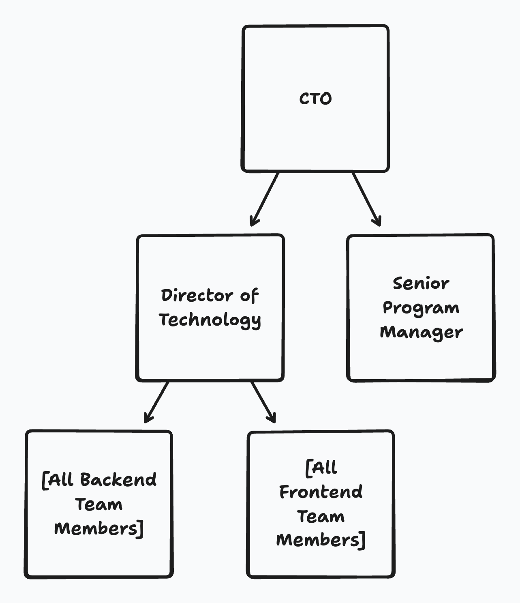
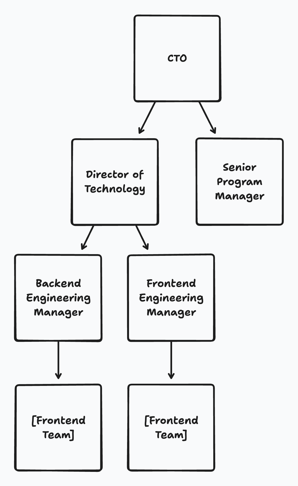

---
{
    title: "How a Promotion Can Kill a Career",
    description: "Why you should be cautious of moving too quickly with your titles.",
    published: "2025-11-17T13:45:00.284Z",
    tags: ['leadership', 'opinion'],
    license: 'cc-by-4',
    order: 1
}
---

After a year at a company we'll call "PDRT," I did what I believe more engineers should be doing annually: I asked for a raise. I was doing my due diligence in running our frontend efforts, and it was beginning to show through metrics and overall team velocity.

But while I was loosely interested in a comp increase, I was much more interested in a title increase. I had lofty goals for my career that saw me leading larger teams — something that would eventually come true with my VP title.

See, when I was hired at the company, I was brought on at a "Senior" level. But now that we had another senior on the team that I was directly responsible for, I thought it was appropriate to be also moved up a level.

See, relevant to this discussion, there are two predominant "tracks" of software engineering:

1) Individual contributor (IC)
2) Engineering leader (EL)

ICs are often more directly involved in the code while ELs are more management focused. Each comes with their own set of skills and growth terms:

**The IC Track:**

| Title     | Capabilities                                                 | Approximate Experience |
|-----------|--------------------------------------------------------------|------------------------|
| Junior    | Focus is on the successful execution of assigned tasks.      | 0 - 2 years            |
| Mid-level | Has achieved proficiency in their own work.                  | 2 - 5 years            |
| Senior    | Their influence extends to their entire team.                | 5 - 8 years            |
| Staff     | Has insight and capabilities between teams.                  | 8 - 13 years           |
| Principal | Their impact is at the organizational or company-wide level. | 13 - 20+ years         |

**The EL Track:**

| Title                          | Capabilities                                                               | Approximate Experience |
|--------------------------------|----------------------------------------------------------------------------|------------------------|
| Engineering Manager            | Manages a single engineering team.                                         | 5 - 8 years            |
| Director of Engineering        | Manages multiple engineering teams.                                        | 8 - 13 years           |
| VP of Engineering              | Manages the entire engineering organization.                               | 13 - 20+ years         |
| Chief Technology Officer (CTO) | Manages the overall technology vision and strategy for the entire company. | Indeterminate          |

> Of course, this is too clean of a chart to properly resemble the real-world. First, the IC and EL tracks overlap heavily in many instances, as it's more than possible to be a manager who still has coding tickets assigned to them. Additionally, the talents to good at either of these roles isn't a single set of skills.

When I made the request for a title change, I believe I made two grave mistakes:

1) I asked for an IC title bump when I wanted to be an EL in the long-run.
2) I asked to become a "Principal" engineer rather than making a single-level jump.

Why do I view these as catastrophic problems? Well, while these are both easy mistakes to make, it came with real-world consequences. Let's first explore why I think these are both mistakes.

----

**1) Asking for IC title instead of EL**

I recall talking with PDRT's CTO about my career goals during my promotion ask. He wanted to know why I was seemingly more interested in a title raise than a pay increase.

I explained that I was really enjoying my time leading the frontend crew and wanted to explore more of leadership roles in the future. Maybe even work my way up to becoming a CTO one day. He warned me that "sometimes that door doesn't swing backwards," that once you enter into the EL track, it can sometimes be hard getting back into IC roles if you discover you don't like it as much.

Maybe this was part of the reason I ended up asking for another IC role; I didn't notice the incongruence between my ask and my long-term goals. It would have more accurately represented my role as well; while I was still regularly writing code, I was involved in management meetings, holding 1-on-1s, and managing the team in other ways.

As a result, however, I stayed in the IC track. When it was time to move on from PDRT, I found it easier to find more IC roles than I did EL roles. As a result, I settled for a role that didn't include management in any capacity for a short time before joining my current company.

Funny enough, this ask of a lower-tiered EL title (maybe "Frontend Engineering Manager") would have made a lot of sense from an external viewpoint.

If a stranger were to have looked at PDRT's titles, they would likely assume that the org-chart matched the following:

Rather than what was a bit more representative at the time:

This might sound like a silly problem, but it's likely the biggest reason that hiring managers were not receptive to my job hunting for EL titles; they didn't know I was in the field for management.

This kind of "build an org-chart externally" isn't a theory, either. Many recruiters and hiring software have this ability to scrape job posting sites and other social media to gather job titles and build out a chart similar to the above to figure out decision-makers in an org.

------

**2) Asking for a dual-tier title bump**

While the first mistake was indeed a problem, it pales in comparison to the second mistake I made. This could have drastically halted or even killed my career.

See, even when I was not looking for work, I would consistently get recruiters reaching out to me during my time at PDRT. I was a strong candidate on paper, and they wanted to see if I was looking for work. But once I got my new "Principal" title, all the recruiter messages seemed to have disappeared overnight.

Why? Because if you only looked at my résumé on paper during this time, you'd see a progression from:

- Senior Engineer
- Senior Engineer
- DevRel
- Senior Engineer
- Principal Engineer

This alone is a major red flag to hiring managers and the sort; it indicates that there's something going on that doesn't fit the pattern for most employees. This isn't simply a promotion, it's a drastic increase in responsibility and expectation that usually only comes with time.

Luckily for me, during a period of formalizing titles, the PDRT management realized the mistake they'd made in giving me such a prestigious title and reverted it later on to "Staff Engineer". While I complained to a few friends at the time, it ended up being a saving grace sent me way; the recruiter messages had returned.

But did I truly learn from this story? Some may argue that I made the same mistake of asking for too high of a title too early on when [proposing my VP role for my current role](/posts/negotiating-for-vp-role). However, there are some distinct differences between the two situations:

**2a) My titles have not historically lined up perfectly with my responsibilities**

I'm an example of how the on-paper work experience looks very different from one of a traditional VP. If you only look at my most recent five job titles for full-time work on paper leading up to my VP role, you'd see:

1) Senior Engineer
2) Senior Engineer
3) DevRel
4) Staff Engineer (PDRT)
5) Staff Engineer

But what you'd be missing is additional context:

| # | Title           | Responsibilities                                                           |
|---|-----------------|----------------------------------------------------------------------------|
| 1 | Senior Engineer | Was up for team lead prior to layoffs                                      |
| 2 | Senior Engineer | Led the team and mentored other team leads                                 |
| 3 | DevRel          | Owned DevRel for the company, including managing a guest authoring program |
| 4 | Staff Engineer  | Ran the company's frontend efforts, regularly attended executive meetings  |
| 5 | Staff Engineer  | More of an IC role than leadership                                         |

While #5 may seem like a "gotcha" moment for those looking to discard my leadership experience, this _too_ ignores other context around my growth into leadership around this time: _I started (and continue) to act as the executive director for a non-profit_.

**2b) I joined as a VP to a smaller company as we looked to scale**

When my current company hired me as VP, it came with a huge bit of critical context: There were very few actual engineering employees at the organization.

Instead, they were previously relying on a consulting firm that brought in their own team to scale up and down based on work needed. I was brought on during a phase of the company's lifecycle that was geared towards scaling up the company and moving development in-house. As a result, while I was indeed in charge of the engineering organization, it came with the expectation that I'd scale the team upwards fairly quickly and handle the handoff from the consulting firm.

This context is important for how and why I became a VP. Because early organizations need to structure quickly, they tend to backfill these higher-tiered positions more quickly than they typically would later on in a company's lifespan. Then, once you're in a given title — so long as you're doing good work — you're unlikely to lose it as the company scales. After all, your experiential knowledge at the org trumps more traditional knowledge-sets that exist external to a company.

From their position, it was an opportunity to take a chance on someone who'd led smaller teams in the past and allow them to grow. At worst, Corbin could always scale back to an IC role that was more natural to their on-paper résumé.

From my position, it was an opportunity to take a chance on a smaller organization who was scaling up and would provide me opportunities to learn and adapt to new environments. At worst, I could always scale back to an IC role that I was more comfortable with.

----

While this overinflated title incident could have been detrimental, I was lucky enough to be able to walk away with some key learnings:

- If you want to migrate into engineering leadership, don't restrict yourself to asking for IC titles.
- Be cautious of moving too quickly with your titles relative to your role's duties.
- Titles _can_ be important to one's ability to find work elsewhere.
- Titles don't dictate all of one's responsibilities and non-traditional career paths do exist.
- Earlier companies will typically provide elevated titles.
