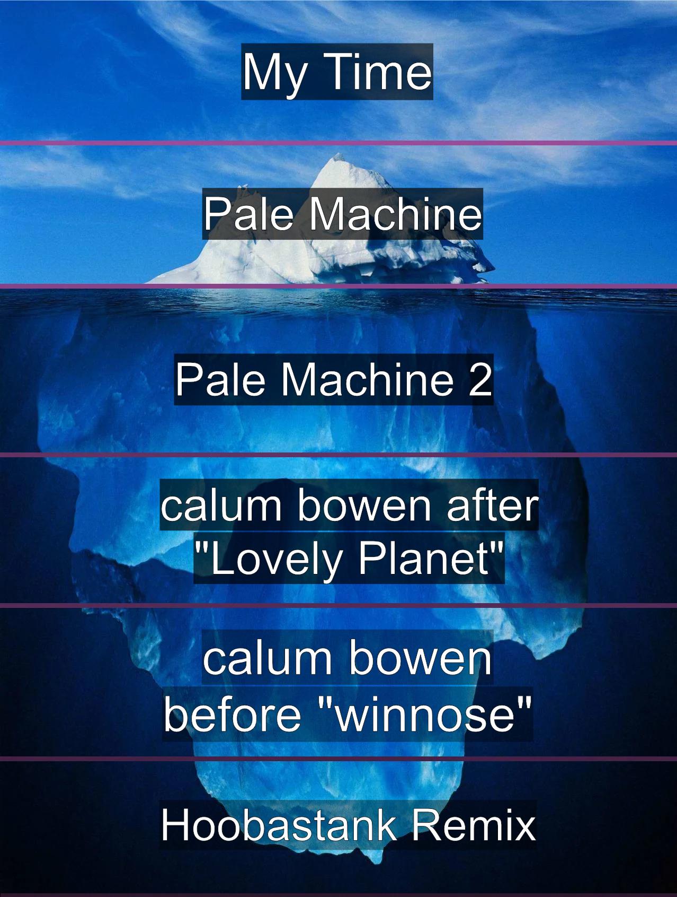

---
{
    title: "The Iceberg of Knowledge",
    description: "",
    published: "2027-01-01T13:45:00.284Z",
    tags: ['leadership', 'opinion'],
    license: 'cc-by-4',
    order: 4
}
---

If you've spent much time on the internet, you may have seen a meme that looks something like this:

These memes will often have text overlayed in each region of the iceberg with the most mainstream information about a topic at the top and the most obscure information at the bottom.

Here's one I made about a musician I'm a fan of: [Bo En](https://en.wikipedia.org/wiki/Bo_En).

> **For context:**
>
> - "My Time" is Bo En's most popular song due to its inclusion in a cult classic game "Omori".
> - "Pale Machine" is Bo En's sole indie album.
> - Pale Machine 2 is a remix album that came ten years after "Pale Machine".
> - Bo En makes music for video games under his (stylized) real name "calum bowen". His game soundtracks became much more mainstream after ["Lovely Planet"](https://en.wikipedia.org/wiki/Lovely_Planet)
> - ["winnose"](https://www.igdb.com/games/winnose) is a broadly forgotten flash game published by [Adult Swim](https://grindingdown.wordpress.com/2014/02/08/winnose-a-surreal-puzzle-game-starring-half-of-a-moai-statue/)
> - [Bo En released a CD version of Pale Machine with highly limited stock.](https://bo-en.info/IRL.html) This CD included a remix of Hoobastank's "The Reason" that is now nearly lost media due to what I assume is licensing issues.

Someone once told me that there's different levels of knowledge:

1) Knowledge within a field
2) Knowledge within a problem space
3) Knowledge within a specific problem

# Knowledge within a Field

Let's use forms written for websites as an example:

1) Someone may be a highly skilled developer in the web development space. Maybe even an author of a web framework.

This person may know a great deal about web development, enough to name obscure JavaScript and HTML APIs.

# Knowledge within a Problem Space

Despite the seemingly simple task of building out a form for a website, there's suprising complexity:

- Built-in HTML validators vs custom validation logic
- `setCustomValidity` vs bespoke form validation UX
- Isomorphic validators to avoid duplication of client and server validation.
- Validation timing (on blur, on change, on submit)
- Accessibility concerns via label association, live regions, focus management, and more.
- Debouncing async validation calls to the server.
- Innate specifics of `FormData` transmission to the server via `encType`, file uploads, and beyond.
- Spam prevention through CAPTCHA, honeypot fields, and more.

Now let's assume that the same person from before knows much of this as well:

2. Someone may have written a popular form library used by hundreds of thousands of developers.

This person may know the ins-and-outs of nuanced specifics of constructing proper forms, but may run into edgecases they're not familiar with.

For example, Telephone number inputs.

