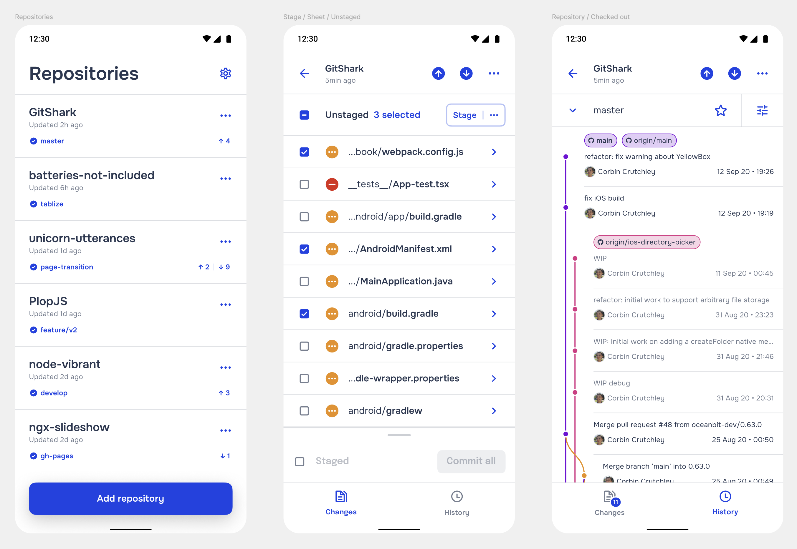

---
{
    title: "Your Users Don't Want What You're Building",
    description: "",
    published: "2026-03-08T13:45:00.284Z",
    tags: ['leadership', 'opinion'],
    license: 'cc-by-4',
    order: 3
}
---

I started a company during the pandemic. Bored and mandated to be indoors, I decided the best course of action was to drown myself in projects. I went down the path to properly establish myself; LLC paperwork, bank account, hiring contracted design help.

I spent countless hours livestreaming my progress, building in public, and adapting to new technologies to make my ideal product a reality. I spent the better part of four years working on the product I set out to solve. If we use my Twitch analytics as a loose approximation of the amount of time I spent on the project, I'd given 2,000 hours of my life to this idea.

What was this idealistic application? Simply put, I had built a Git Client for your phone and tablets. This would allow you to have a mirror of your codebase on your phone, make changes to said codebase, and push them back to your code backup server:

Maybe appropriately, I called the product "GitShark" — because I jumped the shark when it came to market research fit. By the end of it all, when I launched I had sold about 10 licenses of the software; Each for ~$2 with no renewal plans. In practice, it was like I was making a penny an hour.

Contrast that to my six-figure day jobs at the time, and it's baffling how or why I would choose to spend so much of my time on such a product. Surely I couldn't've convinced myself of the concept of a **mobile Git client** so strongly? Why **did** I spend so much effort on such a niche tool? How could I have pivoted towards success?

Let's dive into things and answer these questions. Along the way, we'll cover:

- How I convinced myself that GitShark was a good idea
- 

# Losing sight of "now" by looking too far ahead

// TODO: Talk about how my vision of iPads and Folding Phones becoming the default compute device for many helped me validate this idea in my mind, without understanding their limitations very well.

# Never finding the product I should have built

// TODO: Talk about how this COULD have been positioned in a billion different ways; especially its possible utility in "Learn to code" products

# Mistaking an audience for a market

// TODO: Talk about how I saw "10,000 installs" on many related apps on Android/iOS and thought that meant it could be successful

// TODO: Talk about how I mistook attention in the problem space and attention in my building as successful marketing

// TODO: Talk about how I managed to garner more attention for myself than the product, leading to consulting and more rather than sales

# Letting engineering hubris extend your timeline

// TODO: Talk about the engineering hubris I had in the approach of building GitShark as a heading. The idea that the engineering had to be absolutely perfect before shipping live (AKA having a fresh home-grown design system and more)

# Trying to boil the ocean

// TODO: Talk about how many different features I wanted to build into GitShark and why it was problematic to not have focus.

// TODO: Talk about "The Homer", the car made by Homer Simpson in the 1991s Simpsons episode. Too much bloat increases timeline and budget and isn't often what people even want anyways

# Not building the next GitShark

// TODO: Talk about how you can go about building products in ways that are grounded
