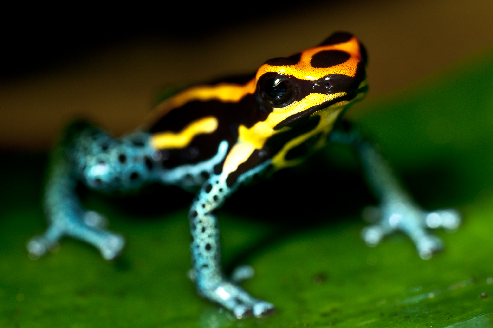

---
{
    title: "Navigating the Risks in Leadership",
    description: "Understanding the challenges and rewards of stepping into leadership roles.",
    published: '2025-10-20T21:52:59.284Z',
    tags: ['leadership', 'opinion'],
    license: 'cc-by-4',
    order: 1
}
---

"I did it! I can't believe that I did it!"

After 10 years in the programming field — years of working through complex coding problems, managing teams, learning the project management process, groking the business problems to solve — I'd finally made it into a "VP" role. "VP of Software Engineering," nonetheless!

The feeling was exhilarating. Sure, it came with the typical promotion benefits that yielded a pay increase, but that's not what I was excited about.

See, at this point in my career, I'd joined my fair share of teams. I'd seen what I thought worked and what didn't. I'd been laid off, survived layoffs, been responsible for declining metrics, and even managed teams that were able to ship months ahead of schedule.

But now? Now I could bring it all together. The good? The bad? The in-between? They all formulated together to create "Corbin." A strong engineer and a manager who could lead in a way I believed in.

And I had a northern star to pull it all off:

"I believe in taking care of the people behind the screens"

I'd taken on this mantra early on in my career; a differentiator that set me aside from other engineers looking to make the cut.

Back then, it meant more about my processes as an engineer: Documenting my code, leaving in-depth code reviews, making developer tools for our internal pipelines. The "people behind the screens" were my coworkers. My peers in the engineering workforce.

Today though, it meant something more. I could improve my processes — and goodness knows they'd be needed in the following months — but I could demonstrate this care in much more meaningful ways, such as:

- My team members reporting to me as people. Their interpersonal lives and their capacity to handle their own responsibilities within the org and beyond.
- My management team. Their needs to succeed in their respective areas to drive growth in the organization as a whole.
- Our business partners. Each of whom who wants to find their own rewards for working through things properly.
- The customer. Understanding their needs and helping articulate business needs to our team.

There was so much I could do to grow our efforts into something magical.

---

But knowing there was so much to do also meant recognizing how much potential there was for failure.

A lot would be riding on my capabilities. I'd need to know how to:

- Find business solutions in tech; knowing when to swerve and meet new demand and when to stay course.
- Run a team efficiently; unblocking the team's ability to execute on their own.
- Handle social challenges; mitigating struggles of a delicate nature between peers.
- Manage reporting bi-directionally; Allowing full insight from top-down and bottom-up.
- Retain my technical chops; enough to facilitate technical conversations and decision-making.

As weird as this may sound, this new set of responsibilities reminded me of a pet my past roommate kept: A poisonous dart frog.

In nature, the multicolored nature of these frogs flags a warning to potential predators: Stay away or else meet your doom.

This mirrored my conversations with many of my family and friends; many of whom explicitly told me they do not want to get into leadership. The onus of failure and potential for blame shifted them away from owning more in their respective fields.

But that same color that imposes risk also satisfies another constraint that led to my roommate keeping one as a pet: It was a beautiful specimen.

A well-maintained environment for the frog brought my friend joy; not only because of the visual appeal and entertainment but knowing that they were able to allow an ecosystem to thrive. Despite knowing the frog could escape and harm them, my roommate persisted; so too would I.

It's this risk and reward that harpoons back to an early human experience. For us to survive as a species, we'd need two vastly different kinds of people:

1) Those that would take risks and forerun their lived experiences through the lens of "new is good"
2) Those that would learn from the dangers found by the first group and think "maybe for the best we stay the course"

Neither is better than the other. While it's a common refrain to see the "new is good" as superior, that's not always the case. After all, the journey of humankind is littered with stories of those foolhardy enough to try eating a newly discovered food only to be met with a case of poisoning.

But for those of us that impulsively seek new experiences: The potential for new flavors and experiences are all one can think about when biting into something new.
