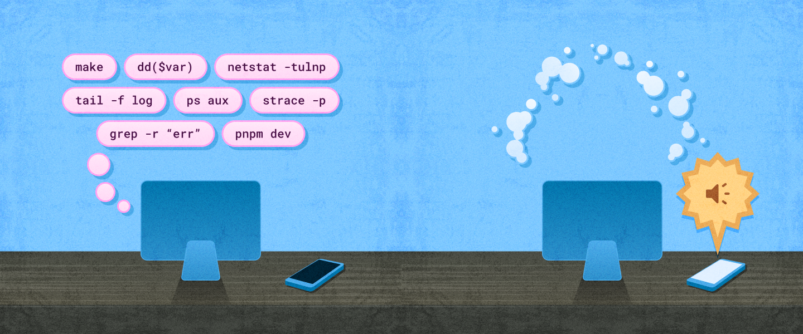

---
{
    title: "In-Person vs Remote Engineering Teams",
    description: "An exploration of the pros and cons of in-person and remote engineering teams, drawing from personal experience.",
    published: "2025-12-08T13:45:00.284Z",
    tags: ['leadership', 'opinion'],
    license: 'cc-by-4',
    order: 2
}
---

A thing to note about a company I used to work for — "PDRT": They were originally an in-office sort of company before I had joined. While they were comfortable doing virtual work for convenience's sake, important meetings would regularly occur in person. This was doubly true for management and product calls, where the non-engineering staff was often restricted to staying in-office for working hours.

The rest of the engineering staff lived within an hour of the main office, so they could easily commute in for these meetings. I, on the other hand, was a four-hour flight away. While my time in-office was relegated to only the most important meetings and off-sites, the rest of the crew could easily jump in and out of the office as they pleased.

This need not inherently be a problem. Hybrid work has its time and place and provides valuable structure to some organizations. Unfortunately for me, I found that this resulted in some mismatched experiences between myself and other peers.

While they were able to talk shop with non-technical staff to understand the nuances of internal politics, I was relegated to only the buttoned-up view of the team as perceived through a webcam during staff meetings. Likewise, many conversations and idea sessions around the product often occurred abruptly during water-cooler chat sessions.

As a result, those that were more able and willing to attend casual in-office days would regularly have to fill me in after-the-fact about the conversations that took place. This became such a common occurrence with one of the juniors on my team that they quickly became the de-facto subject expert on many product features' designs. This helped them quickly accelerate their career into a "Senior" position thanks to visibility from upper management.

This sounds like a slam-dunk argument in favor of in-office work on the surface, but to this day I remain committed to remote-first workplaces. See, a challenge with this method of office-first mentality is that things can quickly get lost. The fact that I, the frontend team lead with access to most documentation on the company, could not figure out certain product requirements without a conversation with our recently promoted senior engineer was indicative of this fact.

This was fine for many things, but did mean that our product line was now contingent on their memory or note-taking abilities. On more than a few occasions, there would be a "What was that idea again?" question raised in a team chat met by a metaphorical glance over to the Senior to flip through their notes to answer.

Not only is it easy to lose this information on a case-by-case basis, but the "bus factor" of this colloquial information drastically narrows in this context.

For those unaware, a "bus factor" is a grim industry term outlining how many people that could be hit by a bus and allow operations to continue as-is. For many smaller companies, the bus factor may be one or two people; remove them from the equation — either through bus, illness, parental leave, or any other reason — and you'll find that things may quickly grind to a halt.

Were this senior to leave our team for any reason, we'd've been in an awful place long-term until we could recoup the conversations with upper management that originated these product ideas. This story gets even worse when ideas originated from clients or customers.

--------

> "Couldn't that situation be resolved by having that team member share their notes?"

It could! And in many instances, it was. To be crystal clear, this senior was not maliciously abstracting conversations away from people. If anything, their ability to take extensive notes about on-the-spot conversations was admirable and helped save many hours of cross-talk for our org.

But the thing about natural flows of office-first communications is that it's not the same as the radically transparent communication that remote work requires. In order for remote team members to communicate effectively, most comms need to occur both in the public and in documented spaces.

Even when they're not in text-based environments, remote work wins again for documentation lovers. Remote meetings are easier to record and, with the assist from modern AI tools, transcribe and summarize. It can then be easily indexed in a searchable manner using natural language search and more.

For in-office work, this type of documentation ends up being extraordinarily costly. As a result, many organizations simply skimp on the effort and seem surprised when their metrics tell them that a "return to office" mandate would help increase communication flow and productivity.

-----

Another advantage of remote work comes in the form of focus time. We can define "focus time" as blocks of time that someone is able to work through their tasks uninterrupted by notifications or meetings that might otherwise distract them from their task. As an engineer, this type of deep work time is critical for operations; the amount of thought that's required to get into one's mind for a given piece of code can be intensely time-sensitive.

While some workflows don't require this level of cognitive context-stacking, writing code in novel problem spaces and debugging most certainly do. To get to the root of a bug, you might have to keep multiple layers of context in mind at a time; each layer requires an amount of time to dig into to understand the layer below.

Think of this a bit like a layered cake: To get to the bottom of the cake, you have to slice through all the levels above.

Once you have all the context in mind, however, you're able to execute much faster and accurately than if you only had a cursory understanding of the problem you're aiming to solve. As a result, this is kind of productivity is often called one's "flow state."

Flow state often requires many hours of blocked off time to focus on a task. This kind of time _can_ be found during in-office work, but you're only ever a rogue colleague wanting to chit-chat away from being disturbed, breaking your thought process, and needing to re-enter the flow state. With remote work, you're in more control of what notifications can or cannot break through to interrupt this state.

---

All of this doesn't mean that remote work is perfect, however. Not only can that added documentation add efforts to your team that might be challenging to navigate, but other struggles arise from remote-first work as well.

Culture, in particular, requires deliberate, inclusive team-building as opposed to the more organic social bonds that can be formed from in-office work. This is because in-office work _allows_ for the possibility to have these kinds of "drop by their desk for a chat" scenarios. There's more likelihood of two unrelated coworkers interacting on a more regular basis. Likewise, from a management perspective, the ability to host an impromptu lunch or chat with the team can be incredibly valuable.

To solve this, I have a number of tricks up my sleeve:

- Open-office policies

  Policies are not enough, however; you must back up your policies with actions. As a result, I utilize software that enables me to sit in an empty call that everyone one the team can stop by at any point. Extra points if they can see when you're in your virtual office or not. Another multiplier if you can convince other team members (or your entire staff) to do the same when they're ready to chat.

- Regular lunch-and-learns

  It can be easy to forget that not everyone is familiar with the same set of knowledge, even when the staff is predominantly senior and above. Allow your team to consistently schedule time during a lunch where they can present what they learn. Some tricks in regard to hosting these:

  - Make them low-key. Not everyone is comfortable presenting, so even just sharing some fun code is a-okay. You can turn lunches into social gatherings at "worse."
  - Allow as many questions as possible. If a lunch-and-learn runs long with questions about a topic, it usually means that the time is being utilized to its fullest. Otherwise, the team may end up duplicating their efforts by researching the answers to these questions later in a more solo environment.
  - Host them any time you have to explain something more than once. This is a broad (but helpful) rule of thumb for when to host a learning activity like this.
  - Take notes and document them somewhere. Especially for referencing back to later for learning reinforcement, this is incredibly valuable.

- Async social chats.

  Take the lead on this one! Don't be afraid to share plans outside of work, media you're currently consuming, and more. Make dedicated channels to discuss social topics that come up more than a few times.

- Jokes and memes.

  So long as they're within respectable boundaries of your workplace, you should be making jokes and posting memes! They can go a long way in establishing a fun culture that helps you learn more about other folks.

Remember, though, this kind of social activities should be optional; not everyone on your team is going to be there for the fun and games. Some may value their work time more stringently and want to enforce more strict work/life separation, and that's okay.

------

While remote-enabled deep work is awesome, it can also limit the kind of peer accountability that in-office work enables. I have verbatim once heard remote workers at another org joke about rolling over from their bed to their desk for meetings only to return to a nap shortly after. 

Accountability can be important for many individuals' ability to act on their executive functions they need for their role. I'll sheepishly admit that one of the reasons the junior-gone-senior was promoted as quickly as they were was to help supplement a lack of meeting attendance on my end at the time. It was simply too easy for me to get lost in a task or forget a meeting time entirely. At least having a representative (especially one as filled in on the ongoings of the org) from the frontend would help mitigate the need for me to be present.

This one is more challenging to balance. I'm generally against monitoring software; they only work to instill distrust among team members and management, and the truly lazy will work hard to mitigate it anyway. So long as you're on top of team communication (both sync and async), you will broadly have a good idea of the progress within your team. If you're unclear on an individual's work ethics, check your board for their tickets and see if estimations make sense with how long tasks are taking for that team member. Your better judgment will go a long way here.

-----

So, what are the key takeaways from PDRT's in-office policies? For me, they'd be:

- In some companies, in-office work may be disproportionately advantageous over remote work for political adaptability.
- Documentation around comms has incredible value, despite the cost.
- Finding time for deep work is a fickle thing but incredibly important for the health of your engineering org.
- It's extremely important to bridge the gap of social-abilities on remote-first teams.
- Accountability is challenging to navigate for remote groups.

