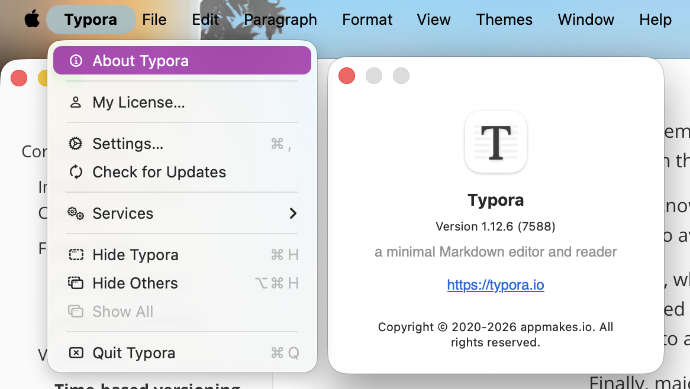
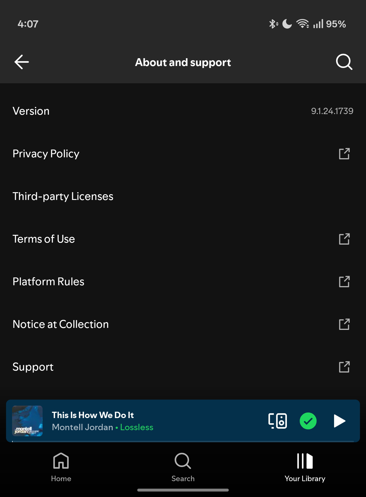

---
{
    title: "How to Incrementally Migrate a Codebase",
    description: "Join me as I explore my decision-making matrix on how I approach incrementally adopting new technologies into old codebases.",
    published: "2025-12-01T13:45:00.284Z",
    tags: ['leadership', 'opinion'],
    license: 'cc-by-4',
    order: 3
}
---


In the past, I've mentioned ["increment migrations"](/posts/inheriting-bad-tech) as my go-to guide to rescuing a codebase from languishing in rewrite hell.

But this leaves an open-ended question: How _do_ you incrementally migrate a codebase?


# Core Concepts


## Invisible vs. Evident Changes

Rewrites come in many shapes and sizes; even incremental ones. A critical first question you want to ask of yourself before embarking on any kind of rewrite is: "What do we aim to gain from this?"

Typically, the response goes something along these lines:

> Technical debt is preventing us from moving as fast as our business needs require.

However, that's not the only reason to consider a rewrite. For example, you might consider if any of the following apply:

1) We want to introduce new features that are difficult to implement in the current system.
2) We want to improve the user experience significantly.
3) We want to improve stability through better testing methodologies.

So, before you start, ask yourself: Are the changes you're making going to be invisible to users (like refactoring code for better maintainability), or are they going to be evident (like a new UI or feature)?

A good excercise is to list out the changes you plan to make and categorize them as either invisible or evident. This will help you prioritize and plan your migration strategy effectively.

## Feature Flags

Now that you have a better understanding of what your goals are, how do you implement them?

Well, one of the tools you should have in your toolbox is the idea of a "feature flag."

What is a feature flag? It's a way to deliver different code paths based on a request from the server.

[](https://blog.bitsrc.io/implementing-feature-toggling-in-2024-14cf29b78f9d)

You can imagine the code looking something like this behind-the-scenes:

```tsx
// This is not real or valid code
if (server.features.login.isBeta) {
	return <LoginFormV2/>
} else {
  return <LoginFormV1/>
}
```

This is useful for a number of reasons, but one of the biggest advantages is that you can disable the new code path automatically if something goes wrong.

Assume your code contains an error handling service wrapping it that reverts the feature after a percentage of users have errors:

```tsx
// This is not real or valid code
if (server.features.login.isBeta) {
	// Assume that this `try/catch` wraps over every user interaction
	try {
		server.features.login.betaUsers++;
		return <LoginFormV2 />
	} catch (e) {
		server.features.login.betaErrors++;
		if (
			// If more than 20% of beta users are encountering errors
			(server.features.login.betaUsers /
				server.features.login.betaErrors) > 0.2
		) {
			// Auto-revert the feature for all users
			server.features.login.isBeta = false;
		}
	}
} else {
	return <LoginFormV1 />
}
```

This is a wild superpower for buisnesses that have not experienced it before and immediately instills huge levels of confidence for your admins.

You can even do this on a per-user basis and allow users to opt-out of the "new" experience if they find themselves running into too many issues; data that you can then track in a dashboard somewhere to report the number of "opt-outs" over time.

And of course if you want to make testing these different code paths easier for your developers, you can build in a toggle for your development builds that quickly enables your dev and QA teams to switch versions on-the-fly.

### User Segmenting

This idea of "Feature flags" can be expanded via user segmentation. For example, assume that you have 300 users. You can break those users into three 100 user segments which you can deliever slightly different experiences to.

[](https://app.uxcel.com/glossary/ab-testing)

This is often called "A/B Testing", where "A" and "B" represent different versions of the same feature that you pit against one another to see which performs better for your company's bottom line.

### Shadow Launching

Sometimes feature flags and A/B testing is sufficient for stability. But for large-scale systems, you may also want to "shadow launch" your system before you even send users into the new flow.

You can do this by routing all traffic through both the new and old code systems and tracking results, performance, and error rates. This can be tricky to do for user experience changes, but is a massive boon when doing incremental adoptions on backend codebases.

## Versioning

For feature flags to work properly, however, you often need a system to categorize the changes being made in the codebase. However you choose to do so, this is called "versioning". 

One of the most popular means of versioning is "semantic versioning" (aka "semver"). 

[](https://www.softwarecraftsperson.com/posts/2020-12-06-semantic-versioning-semver-introduction/)

This system is designed to allow teams — both internal and external — that rely on your product to know when they need to take action on their end.

When I know a vendor is supporting patch versions properly, it means that I can move to the new version freely and should do so quickly to avoid security and other bugs. No work should be needed on my end to adopt this new version.

Similarly, when a major version is introduced, I know I should seek out the changelog of a product to understand what's been introduced so I can adopt new features. Like before, no work should be needed to adopt a new version, but work might be needed to adopt the new featuresets introduced.

Finally, majors indicate that fundamental shifts have occured and that I might need to be more cautious as I spend dedicated effort to adopt a new system.

### Time-based versioning

Sometimes, you might not need that level of granularity in your software. Especially for SaaS platforms that might not offer an API or other integrations, just versioning based on when you last released is valuable. We often show these through:

```
YYYY.MM.DD
```

To show allow the user to understand when a version was last released and support smoother support tickets to help users stuck on old versions for some reason.

### Debugging Versioning

Oftentimes, especially in products where the user needs to install something — like a mobile app, desktop program, or even a Progressive Web Application (PWA) — there's often a chance where the user is running an older version of the app when reporting bugs.

Having a quick ability to showcase this version to the user is helpful for those instances, but not something you want to expose the user to in non-debugging scenarios. This is why programs on the macOS operating system often hide this information in a menu bar dropdown:



Many other applications may expose this through similar system menus. On mobile, most apps choose to place this `version` in the settings page of the app:



Some applications even hide debug information further:

- Many React Native apps have a specific settings screen that you can shake your phone for additional debug toggles
- [The Android operating system hides "Developer mode" behind a hidden toggle that requires you to press `"Build number"` seven times in the settings page](https://developer.android.com/studio/debug/dev-options)

There's many ways you can make this information unobtrusive but accessible when needed.

# Application Splitting

## Splitting by Route

- Page-by-page on the FE
- Route-by-route on the BE

## Splitting by Feature

- Microservices (BE)
- iFrames (FE)


# Data Migrations

- Shared database between systems?
- Communication layers between systems?
- Data sync scripts?

Remember, the FE can have data too


# Framework Interop

- Nest.js <-> AdonisJS on the BE
- React <-> Vue on the FE

