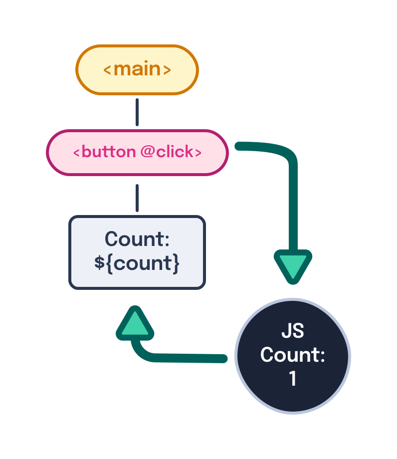
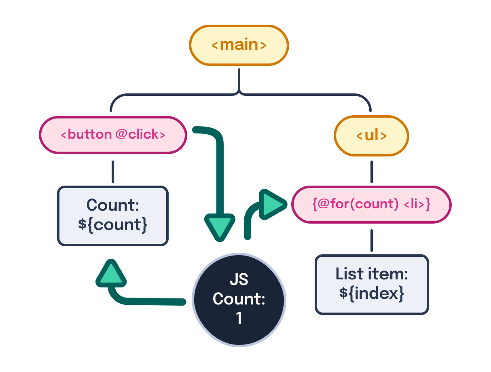
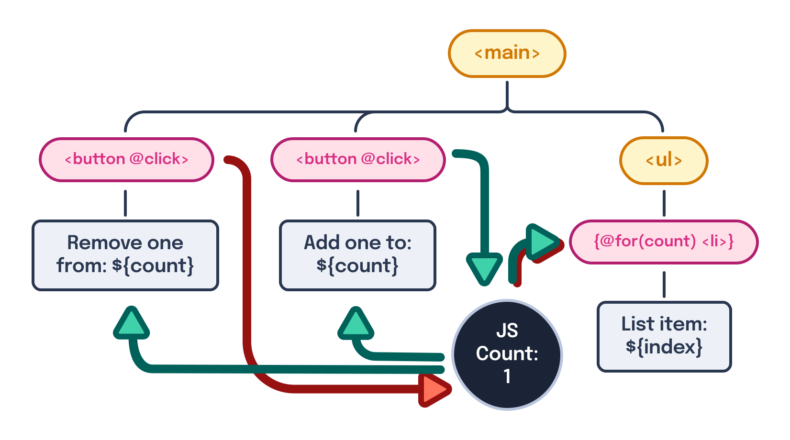
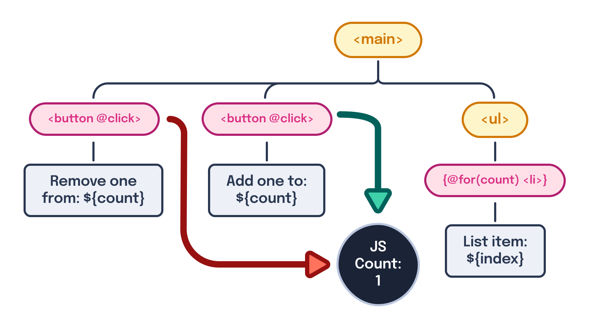

---
{
    title: "What is Reactivity?",
    description: "When researching frontend frameworks, you're likely to hear about \"reactivity\". But what is it? Why does it matter? Let's explore this and more in this article.",
    published: '2023-12-14T21:52:59.284Z',
    tags: ['react', 'vue', 'angular', 'webdev'],
    license: 'cc-by-4',
    collection: "react-beyond-the-render",
    order: 1
}
---

> This article is intended for newcomers to HTML and JavaScript programming. However, it's suggested that you read [this article explaining what the DOM is](/posts/understanding-the-dom) first.

As an experienced frontend engineer, I'm often asked:

> "Why would you want to use a modern frontend framework like React, Angular, or Vue?"

While [I have a whole (free) book on the topic](https://framework.guide), my short answer is typically "Reactivity". The follow-up response I usually get from this is:

> "What is reactivity?"

In short, **Reactivity is the ability to reflect what's in your JavaScript application's memory on the DOM as HTML**.

See, when you're building a website using only static HTML, the output to the DOM is straightforward.

```html
<!-- index.html -->
<main id="a">
	<ul id="b">
		<li id="c">Item 1</li>
		<li id="d">Item 2</li>
	</ul>
	<p id="e">Text here</p>
</main>
```


The problems start when we want to introduce interactivity into our output. 

Let's build a small-scale application that:

- Has a button with a counter inside of it
- Start the counter at `0`
- Every time the button is clicked, add one to the counter



To do this, let's start with some HTML:

```html
<main>
  <button id="add-button">Count: 0</button>
</main>
```

Then we can add in the required JavaScript to make the button functional:

```html
<script>
  let count = 0;

  const addBtn = document.querySelector('#add-button');
  addBtn.addEventListener('click', () => {
    count++;
    addBtn.innerText = `Count: ${count}`;
  });
</script>
```

<iframe data-frame-title="Example #1 - StackBlitz" src="uu-code:./step1-code?template=node&embed=1&file=index.html" sandbox="allow-modals allow-forms allow-popups allow-scripts allow-same-origin"></iframe>

<!-- ::in-content-ad title="Consider supporting" body="Donating any amount will help towards further development of articles like this." button-text="Visit our Open Collective" button-href="https://opencollective.com/unicorn-utterances" -->

# Adding a List

Not too bad, let's increase the difficulty a bit by:

- Adding an unordered list (`<ul>`)
- Every time `count` is increased, add a new `<li>` with a unique string inside



That might look something like this:

```html
<main>
  <button id="add-button">Count: 0</button>
  <ul id="list"></ul>
</main>
<script>
  let count = 0;

  const listEl = document.querySelector('#list');

  function makeListItem(innerText) {
    const li = document.createElement('li');
    li.innerText = innerText;
    listEl.append(li);
  }

  const addBtn = document.querySelector('#add-button');
  addBtn.addEventListener('click', () => {
    count++;
    addBtn.innerText = `Count: ${count}`;
    makeListItem(`List item: ${count}`);
  });
</script>
```

<iframe data-frame-title="Example #2 - StackBlitz" src="uu-code:./step2-code?template=node&embed=1&file=index.html" sandbox="allow-modals allow-forms allow-popups allow-scripts allow-same-origin"></iframe>

# Removing items from the list

Okay! Things are heating up! For one last exercise, let's:

- Add a button that removes `1` from `count`
- When this button is pressed, remove the last element from the list



> Notice how complex our logic tree is getting?

```html
<main>
  <button id="add-button">Add one to: 0</button>
  <button id="remove-button">Remove one from: 0</button>
  <ul id="list"></ul>
</main>
<script>
  let count = 0;

  const listEl = document.querySelector('#list');

  function makeListItem(innerText) {
    const li = document.createElement('li');
    li.innerText = innerText;
    listEl.append(li);
  }

  function removeListItem() {
    listEl.lastChild.remove();
  }

  const addBtn = document.querySelector('#add-button');
  const removeBtn = document.querySelector('#remove-button');

  function updateBtnTexts() {
    addBtn.innerText = `Add one to: ${count}`;
    removeBtn.innerText = `Remove one from: ${count}`;
  }

  addBtn.addEventListener('click', () => {
    count++;
    updateBtnTexts();
    makeListItem(`List item: ${count}`);
  });

  removeBtn.addEventListener('click', () => {
    count--;
    updateBtnTexts();
    removeListItem();
  });
</script>
```

<iframe data-frame-title="Example #3 - StackBlitz" src="uu-code:./step3-code?template=node&embed=1&file=index.html" sandbox="allow-modals allow-forms allow-popups allow-scripts allow-same-origin"></iframe>

> Wow! That got complex, quick, didn't it?!

Exactly... That leads me to the question:

# Shouldn't it be simpler?

Notice how each time we added another item that depended on `count`, our data didn't change. Instead, we had to add ever increasing levels of complexity to our codebase to glue our JavaScript state to the DOM representation of said state.

If we strip away all of this glue, we're left with a drastically simplified codebase:

```html
<main>
  <button id="add-button">Add one to: 0</button>
  <button id="remove-button">Remove one from: 0</button>
  <ul id="list"></ul>
</main>
<script>
  // Magical land where `count` changes auto-update the DOM
  let count = 0;

  addBtn.addEventListener('click', () => {
    count++;
  });

  removeBtn.addEventListener('click', () => {
    count--;
  });
</script>
```



> Look at how many lines disappeared!

Not only is this nicer method of writing code theoretically possible, it's widely adopted by millions of developers via a frontend framework.

Some examples of frontend frameworks include:

- [React](https://react.dev/)
- [Angular](https://angular.dev/)
- [Vue](https://vuejs.org/)

These frameworks allow you to write code that focused on the data in JavaScript, rather than how it will be bound to the DOM:

<!-- ::start:tabs -->

## React

```jsx
const App = () => {
	const [count, setCount] = useState(0);

	return (
		<div>
			<button onClick={() => setCount(count + 1)}>Add one to: {count}</button>
			<button onClick={() => setCount(count - 1)}>
				Remove one from: {count}
			</button>
			<ul>
				{Array.from({ length: count }).map((_, i) => (
					<li>List item {i}</li>
				))}
			</ul>
		</div>
	);
};
```

<iframe data-frame-title="React Reactivity - StackBlitz" src="uu-code:./react-reactivity?template=node&embed=1&file=src%2Fmain.jsx" sandbox="allow-modals allow-forms allow-popups allow-scripts allow-same-origin"></iframe>

## Angular

```typescript
@Component({
	selector: "app-root",
	standalone: true,
	imports: [NgFor],
	template: `
		<button (click)="count = count + 1">Add one to: {{ count }}</button>
		<button (click)="count = count - 1">Remove one from: {{ count }}</button>
		<ul>
			<li *ngFor="let item of [].constructor(count); let i = index">
				List item {{ i }}
			</li>
		</ul>
	`,
})
export class AppComponent {
	count = 0;
}
```

<iframe data-frame-title="Angular Reactivity - StackBlitz" src="uu-code:./angular-reactivity?template=node&embed=1&file=src%2Fmain.ts" sandbox="allow-modals allow-forms allow-popups allow-scripts allow-same-origin"></iframe>

## Vue

```vue
<script setup>
import { ref } from "vue";

const count = ref(0);
</script>

<template>
	<button @click="count++">Add one to: {{ count }}</button>
	<button @click="count--">Remove one from: {{ count }}</button>
	<ul id="list">
		<li v-for="(_, i) of [].constructor(count)">List item {{ i }}</li>
	</ul>
</template>
```

<iframe data-frame-title="Vue Reactivity - StackBlitz" src="uu-code:./vue-reactivity?template=node&embed=1&file=src%2FApp.vue" sandbox="allow-modals allow-forms allow-popups allow-scripts allow-same-origin"></iframe>

<!-- ::end:tabs -->

This, dear reader, is the core idea behind reactivity: Allowing us to focus on how we want to change the state stored in JavaScript and allowing some other mechanism to abstract away _how_ it shows up on-screen.

These mechanisms can have wildly different methods to them, too!

For example, here's what each of the frameworks utilize under-the-hood:

| Framework | Reactivity Method                                            | Rendering Method                                             |
| --------- | ------------------------------------------------------------ | ------------------------------------------------------------ |
| React     | [Explicit Function Calls](https://twitter.com/crutchcorn/status/1527059716907487232) | [VDOM](/posts/unraveling-the-magic-of-the-virtual-dom)       |
| Angular   | [Zone.js](/posts/angular-internals-zonejs)                   | [Incremental DOM](https://blog.angular.io/how-the-angular-compiler-works-42111f9d2549) |
| Vue       | [Proxies](https://vuejs.org/guide/extras/reactivity-in-depth.html) | [VDOM](/posts/unraveling-the-magic-of-the-virtual-dom)       |

> This is real nerd hours, don't feel bad if this just looks like gibberish to you right now.

# Conclusion

This has been a look at what reactivity is and why you might want to use a modern frontend framework to utilize it in your apps today.

Next time, we'll talk about what "Reconciliation" is and how it impacts most React and Vue frontend applications today.

Want a place to ask questions as you're learning on your journey? [Join our Discord](https://discord.gg/FMcvc6T) and let us know what you thought of this article. We'd love to get to know you!
