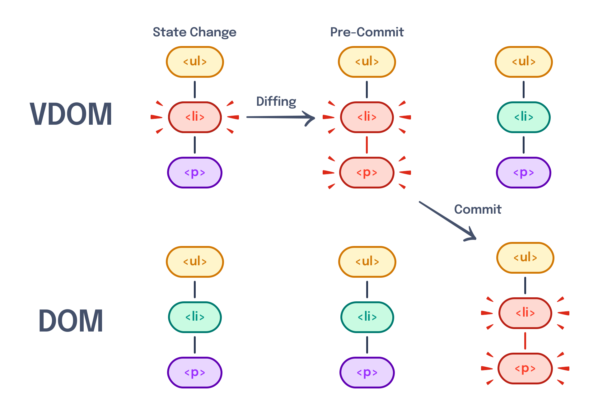

---
{
    title: "What is Reconciliation and the Virtual DOM (VDOM)?",
    description: "How does React handle update the DOM? The answer? \"The Virtual DOM and reconciliation.\" Let's explore what these are and how you can leverage them the best.",
    published: '2023-12-15T21:52:59.284Z',
    tags: ['react', 'javascript', 'webdev'],
    license: 'cc-by-4',
    collection: "react-beyond-the-render",
    order: 2
}
---

[In our last post we introduced how a modern frontend framework like React, Angular, or Vue are able to make your JavaScript state easier to sync to the DOM using "Reactivity"](/posts/what-is-reactivity).

Towards the end of that post, I touched on how each of these frameworks' mechanisms for reactivity work under-the-hood through external links.

One of those mechanisms used by frameworks like React and Vue is called the "Virtual DOM" (Also known as the "VDOM") and use a process called "Reconciliation" to reflect the changes made to this "VDOM" to the real DOM.

Let's take a look at how this works in practical terms.

# What is the Virtual DOM (VDOM)?

In a broad stroke, the virtual DOM (VDOM) is a reflection of the code you've written in your framework that eventually gets mirrored to the DOM. This is in order to make sure that updates to your JavaScript state are duplicated into the DOM via reactivity.

Too terminology heavy? No problem, here's an example.

Let's say that you have a bit of HTML:

```
<ul>
	<li><p>One</p></li>
	<li><p>One</p></li>
	<li><p>One</p></li>
</ul>
```

This might create a DOM tree that looks similar to the following:


> If you need a refresher on how the DOM works, [check out our post on the topic](/posts/understanding-the-dom).

Similarly, if you write the following JSX:

```jsx
const App = () => {
	return (
        <ul>
            <li><p>One</p></li>
            <li><p>One</p></li>
            <li><p>One</p></li>
        </ul>
	)
}
```

You'll end up with a VDOM that mirrors the markup you've written in JSX. This JSX is then reflected to the DOM itself:


The process of how these changes are mirrored is called "Reconciliation".

<!-- ::in-content-ad title="Consider supporting" body="Donating any amount will help towards further development of articles like this." button-text="Visit our Open Collective" button-href="https://opencollective.com/unicorn-utterances" -->

# What is "Reconciliation"?

Reconciliation is the process of reflecting changes from a frameworks' virtual DOM into the DOM via a three-step process:

1) Listening for changes to the state
2) Diffing the changes made to the VDOM
3) Committing the changes from the VDOM to the DOM



# What is the `key` property?

While this process of reconciliation might seem simple at first, it can get quite complex. For example, consider how a list might be handled:

```jsx
import { useState } from 'react';

const fakeNames = [
  'Gulgowski',
  'Johnston',
  'Nader',
  'Flatley',
  'Lemke',
  'Stokes',
  'Simonis',
  'Little',
  'Baumbach',
  'Spinka',
];

let id = 0;

function createPerson() {
  return {
    id: ++id,
    name: fakeNames[Math.floor(Math.random() * fakeNames.length)],
  };
}

export default function App() {
  const [list, setList] = useState([
    createPerson(),
    createPerson(),
    createPerson(),
  ]);

  function addPersonToList() {
    const newList = [...list];
    // Insert new friend at random location
    newList.splice(
      Math.floor(Math.random() * newList.length),
      0,
      createPerson()
    );
    setList(newList);
  }

  return (
    <div>
      <h1>My friends</h1>
      <button onClick={addPersonToList}>Add friend</button>
      <ul>
        {list.map((person) => (
          <li>
            <label>
              <div>{person.name} notes</div>
              <input />
            </label>
          </li>
        ))}
      </ul>
    </div>
  );
}
```

<iframe data-frame-title="React List Key - StackBlitz" src="uu-code:./react-list-key?template=node&embed=1&file=src%2Fmain.jsx" sandbox="allow-modals allow-forms allow-popups allow-scripts allow-same-origin"></iframe>

Here, we're storing a list of our friends and allowing the user to add to this list by pressing a button. We even have a little place to store notes about your friends!

But notice what happens to those notes when someone gets added to the start of the list:

<video src="./incorrect-user.mp4" title="When someone is added to the top of the list, the typed note about 'Little' is no longer associated with 'Little'"></video>

See how the note about Little is now assigned to the wrong person.

This is because React needs some way to identify which element is which in a list. By default, this is the index of the list item - which is why our note about Little (whom was originally at the top of the list) is still at the top of the list when someone else is added, despite that not being correct.

Without this default behavior, the `input`s inside of the list would all disappear every time the user added to the list, as it wouldn't know to avoid re-rendering the contents of the DOM on existing items:


To fix this, we just need to explicitly tell React which user is which in the list using a special `key` property:

```jsx
<ul>
    {list.map((person) => (
      <li key={person.id}>
        <label>
          <div>{person.name} notes</div>
          <input />
        </label>
      </li>
    ))}
</ul>
```


# Conclusion

In this series, we've explored how React handles reactivity and how it uses the Virtual DOM and reconciliation to make reactivity work.

These two combined build the foundation for how React works behind the scenes. In the next few posts, starting with ["What is server-side rendering (SSR) and static site generation (SSG)"](/posts/what-is-ssr-and-ssg), we'll explore how React has gradually evolved past the typical client-side rendering process and into the server.

Eventually, this series will show you how to use React Server Actions in-depth and how you can utilize your React knowledge to become a full-stack developer.

Sound like fun? We hope so! [Join us in our Discord](https://discord.gg/FMcvc6T) and let us know what other topics you'd like to see on the site.
