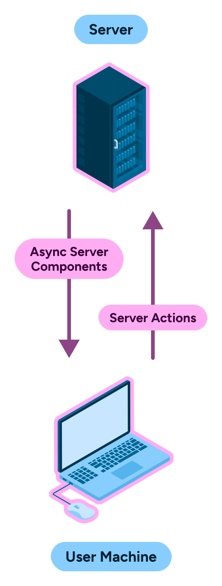
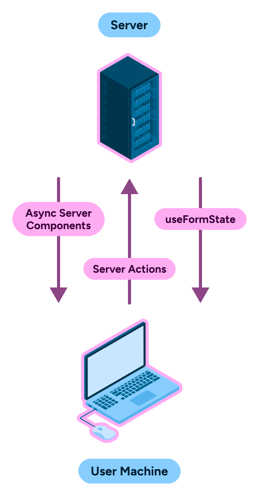

---
{
    title: "What is React's useActionState and useFormStatus?",
    description: "React Server Actions are an awesome way to pass data to and from your React client and server. Like all functions, they need a way to return data.",
    published: '2023-12-20T21:52:59.284Z',
    edited: "2024-06-03T14:17:00.247Z",
    tags: ['react', 'webdev', 'javascript'],
    license: 'cc-by-4',
    collection: "react-beyond-the-render",
    order: 7
}
---

Thus far in our article series, we've taken a look at how React handles reactivity, server rendering, and how to send data back and forth between our React-based server and our client.

In particular, our last article outlined how we can send data from the server down to the client and back:



This is a great _almost_ bi-directional communication from [React Server Components](/posts/what-are-react-server-components) and back.

> Why do you say "almost"? What's missing?

Well, once you send an action back to the server, how do you get a response back from the server? What happens if the server action needs to inform you of some status?

Well, this is where `useFormStatus` and `useActionState` come into play:



# What is `useFormStatus`?

`useFormStatus` allows developers to listen for state changes on their React Server Actions. IE: When a server action is pending or not.

While `useFormStatus` isn't directly a way to listen for changes from the server (instead it relies on the information on the client to show its metadata) it allows us to make a nicer user experience by showing a loading indicator while the server is taking its action.

Let's start with a [client-side actions](/posts/what-are-react-server-actions#What-are-React-form-actions) demo:

```jsx
import { useFormStatus } from 'react-dom';

function Submit() {
  const status = useFormStatus();
  return (
    <button disabled={status.pending}>
      {status.pending ? 'Sending...' : 'Send'}
    </button>
  );
}

function App() {
  async function waitASecond() {
    await new Promise((resolve) => {
      setTimeout(() => {
        resolve();
      }, 1000);
    });
  }

  return (
    <form action={waitASecond}>
      <Submit />
    </form>
  );
}
```

<iframe data-frame-title="React useFormStatus - StackBlitz" src="pp-code:./react-use-form-status?template=node&embed=1&file=src%2Fmain.jsx" sandbox="allow-modals allow-forms allow-popups allow-scripts allow-same-origin"></iframe>

Here, we're using the `pending` field on `useFormStatus` to tell us when our form is being submitted.

> **A note about `useFormStatus`:**
> You might be wondering why I've extracted the `Submit` component into its own function. This is because `useFormStatus` is a hook that implicitly gathers its state from the parent `<form>` element.
> 
> If you were to use `useFormStatus` inside of the `App` component, it would not work as expected. This is because the `App` component is not a child of the `<form>` element.
> 
> For example, the following code would not work as expected:
> ```jsx
> // This code does not work, as `useFormStatus` is not a child of the <form> element
> function App() {
>   async function waitASecond() {
>     await new Promise((resolve) => {
>       setTimeout(() => {
>         resolve();
>       }, 1000);
>     });
>   }
>   
>   const status = useFormStatus();
> 
>   return (
>     <form action={waitASecond}>
>       <button disabled={status.pending}>
>        {status.pending ? 'Sending...' : 'Send'}
>       </button>
>     </form>
>   );
> }
> ```


## `useFormStatus` usage with server actions

But of course it works with server actions as well. Let's adapt our todo list example from our last article:

```jsx
// page.jsx
import { Todo } from "./client";
import { addTodoToDatabase, getTodos } from "./todos";

export default async function Home() {
	const todos = await getTodos();

	async function addTodo(formData) {
		"use server";
		const todo = formData.get("todo");
		await addTodoToDatabase(todo);
	}

	return <Todo todos={todos} addTodo={addTodo} />;
}
```

```jsx
// client.jsx
"use client";
import { useCallback } from "react";
import { useFormStatus } from "react-dom";

function TodoFormInner() {
	const status = useFormStatus();
	return (
		<>
			{status.pending && <p>Adding todo...</p>}
			<input disabled={status.pending} name="todo" />
			<button disabled={status.pending} type="submit">
				Add Todo
			</button>
		</>
	);
}

export function Todo({ todos, addTodo }) {
	const addTodoAndRefresh = useCallback(async (formData) => {
		await addTodo(formData);
		window.location.reload();
	}, []);

	return (
		<>
			<form action={addTodoAndRefresh}>
				<TodoFormInner />
			</form>
			<ul>
				{todos.map((todo) => {
					return <li key={todo.id}>{todo.value}</li>;
				})}
			</ul>
		</>
	);
}
```

<iframe data-frame-title="Next.js useFormStatus - StackBlitz" src="pp-code:./nextjs-use-form-status?template=node&embed=1&file=app%2Fpage.jsx" sandbox="allow-modals allow-forms allow-popups allow-scripts allow-same-origin"></iframe>

# What is `useActionState`?

`useActionState` allows us to get a response from a React Server Action and handle the results any way we might want to; including (but not limited to) displaying the contents of the response to the client.

<!-- ::in-content-ad title="Consider supporting" body="Donating any amount will help towards further development of articles like this." button-text="Visit our Open Collective" button-href="https://opencollective.com/unicorn-utterances" -->

This is a simple example of what `useActionState` looks like on client-side form actions:

```jsx
function App() {
  async function sayHi() {
    await new Promise((resolve) => {
      setTimeout(() => {
        resolve();
      }, 1000);
    });
    return 'Value from the action';
  }

  // State will be updated when `sayHi` returns a value
  const [state, action] = useActionState(sayHi, 'Initial value');

  return (
    // Pass the action from `useActionState`
    <form action={action}>
      <p>{state}</p>
      <button>Submit</button>
    </form>
  );
}
```

<iframe data-frame-title="React useActionState - StackBlitz" src="pp-code:./react-use-action-state?template=node&embed=1&file=src%2Fmain.jsx" sandbox="allow-modals allow-forms allow-popups allow-scripts allow-same-origin"></iframe>

We can even implement a simple counter by utilizing the previous state (or initial value if there is no previous state):

```jsx
async function increment(previousState, formData) {
  return previousState + 1;
}

function App() {
  const [state, action] = useActionState(increment, 0);
  return (
    <form action={action}>
      <p>{state}</p>
      <button>Increment</button>
    </form>
  )
}
```

> This increment example comes from [the React docs for the Hook](https://react.dev/reference/react/useActionState).

<iframe data-frame-title="React useActionState Counter - StackBlitz" src="pp-code:./react-use-action-state-counter?template=node&embed=1&file=src%2Fmain.jsx" sandbox="allow-modals allow-forms allow-popups allow-scripts allow-same-origin"></iframe>

## `useActionState` usage with server actions

While `useActionState` works on the client-side, it's the most useful in conjuncture with server actions.

Let's add some form validation to our todo list application so that the user can't submit an empty field:

```jsx
// page.jsx
import { Todo } from "./client";
import { addTodoToDatabase, getTodos } from "./todos";
import { redirect } from "next/navigation";

export default async function Home() {
	const todos = await getTodos();

	async function addTodo(previousState, formData) {
		"use server";
		const todo = formData.get("todo");
		if (!todo) return "Please enter a todo";
		await addTodoToDatabase(todo);
		redirect("/");
	}

	return <Todo todos={todos} addTodo={addTodo} />;
}
```

```jsx
// client.jsx
"use client";
import { useActionState } from "react-dom";

export function Todo({ todos, addTodo }) {
	const [state, action] = useActionState(addTodo, "")

	return (
		<>
			<form action={action}>
				{state && <p>{state}</p>}
				<input name="todo" />
				<button type="submit">
					Add Todo
				</button>
			</form>
			<ul>
				{todos.map((todo) => {
					return <li key={todo.id}>{todo.value}</li>;
				})}
			</ul>
		</>
	);
}
```

<iframe data-frame-title="Next.js useActionState - StackBlitz" src="pp-code:./nextjs-use-action-state?template=node&embed=1&file=app%2Fpage.jsx" sandbox="allow-modals allow-forms allow-popups allow-scripts allow-same-origin"></iframe>

> **Don't forget the API changes:**
>
> Don't forget that `useActionState` requires you to change your server action to include a new first argument for `previousState`. Otherwise you'll get the following error:
>
> ```
>  ⨯ app\page.jsx (10:24) @ get
>  ⨯ TypeError: formData.get is not a function
> ```

## `useActionState` usage without client-side JavaScript

Because `useActionState` utilizes the `<form>` element's native `action` attribute under-the-hood, it works even without JavaScript enabled.

Assume you have the above sample code, but you have JavaScript disabled. When you click the submit button, the form will submit to the `action` attribute, and the page will refresh with the new information for the user.

<video src="./nextjs-use-state-js-disabled.mp4" title="Disabling the JavaScript while using useActionState with a server action will cause the page to refresh with the data you want to see rendered"></video>

> Keep in mind that any client-side React code will not run if JavaScript is disabled. This includes the `useEffect` Hook among others.

# How to use `useActionState` and `useFormStatus` together

You may have noticed that `useActionState` doesn't provide us the same pending information that `useFormStatus` does. Let's combine them for the ultimate user experience:

```jsx
// page.jsx
import { Todo } from "./client";
import { addTodoToDatabase, getTodos } from "./todos";
import { redirect } from "next/navigation";

export default async function Home() {
	const todos = await getTodos();

	async function addTodo(previousState, formData) {
		"use server";
		const todo = formData.get("todo");
		if (!todo) return "Please enter a todo";
		await addTodoToDatabase(todo);
		redirect("/");
	}

	return <Todo todos={todos} addTodo={addTodo} />;
}
```

```jsx
// client.jsx
"use client";
import { useActionState, useFormStatus } from "react-dom";

function TodoFormInner() {
	const status = useFormStatus();
	return (
		<>
			{status.pending && <p>Adding todo...</p>}
			<input disabled={status.pending} name="todo" />
			<button disabled={status.pending} type="submit">
				Add Todo
			</button>
		</>
	);
}

export function Todo({ todos, addTodo }) {
	const [state, action] = useActionState(addTodo, "");

	return (
		<>
			<form action={action}>
				{state && <p>{state}</p>}
				<TodoFormInner />
			</form>
			<ul>
				{todos.map((todo) => {
					return <li key={todo.id}>{todo.value}</li>;
				})}
			</ul>
		</>
	);
}
```

<iframe data-frame-title="Next.js useActionState and useFormStatus - StackBlitz" src="pp-code:./nextjs-use-action-state-and-status?template=node&embed=1&file=app%2Fpage.jsx" sandbox="allow-modals allow-forms allow-popups allow-scripts allow-same-origin"></iframe>

# Conclusion

And with that, that's our article series! We've covered a lot of ground; everything from how React's most fundamental values like reactivity works to advanced bi-directional data flow from the server and back!

Want to keep learning React from lil' ole' me? Well shucks; first thank you for reading!

But I can oblige! [I've written a book called "The Framework Field Guide" that teaches React, Angular, and Vue all-at-once, in-depth, and for free](https://framework.guide). Check it out and let me know what you think.
