---
{
    title: "A Complete History of Unicorn Utterances",
    description: "Now that \"Unicorn Utterances\" is called \"Playful Programming\", let's look at the history of the project.",
    published: '2024-07-29T10:12:03.284Z',
    tags: ['announcements'],
    license: 'cc-by-4'
}
---

Today [we're announcing that our developer education platform, which was once named "Unicorn Utterances", is now "Playful Programming".]( /posts/rebrand-to-playful-programming)

Before saying "Goodbye" to the name, we thought it would be fun to zoom out and evaluate our history under the moniker "Unicorn Utterances".

Without further ado; the timeline of Unicorn Utterances.

# Before The Launch

While Unicorn Utterances has always been a volunteer-ran platform, let's a look at our history as a whole:

- October 2014: [Corbin Crutchley](/unicorns/crutchcorn) (cofounder of the platform; author of this post) turns 16. Not only are they a year older; they started working at an adult high school as their only tech person. This role required them to learn Python and Bash; starting their career early on.

  Partly due to the new job, partly due to an overarching interest in tech; Corbin joined the [social media platform Google+](https://en.wikipedia.org/wiki/Google%2B) (remember that?) and started talking with other people on the platform.

  The list of people they met would eventually be a whos-who of Unicorn Utterances alumni:

    - [James Fenn](/unicorns/fennifith) (cofounder)
    - [Evelyn Hathaway](/unicorns/evelynhathaway) (cofounder)
    - [Vukašin Anđelković](https://unicorn-utterances.com/unicorns/zavukodlak) (logo designer)
    - [Tom Wellington](/unicorns/tommyemo) (initial design lead)
    - [Eduardo Pratti](/unicorns/edpratti) (future/present design lead)
    - [Alex Dueppen](/unicorns/adueppen) (developer, moderator)
    - [Kevin Aguilar](/unicorns/kevttob) (designer)

- May 2018: Corbin starts working in person at a bootcamp nearby them. While they adored the students, peers, and process of teaching others - they found the high up-front cost and promises of work post-graduation (an impossible promise given the industry's volatility) to be arguably predatory. As a result, Corbin quits the bootcamp after only 5 months.

  After quitting the bootcamp, Corbin speaks with many of the students. They encourage Corbin to keep teaching and point out that there's nothing preventing them from doing so in their own context; outside of any other organization.

- Early 2019: Inspired by the bootcamp students, Corbin approaches James Fenn and Evelyn Hathaway to help kickstart a platform where they're all able to teach people how to program.

- May 19th, 2019: Evelyn Hathaway proposes the name for this new platform to include the word "Unicorn"; to ensure playfulness in the site. "Unicorn Utterances" is selected as the name for its alliteration and fun.

  Vukašin is approached to make a logo for the platform given the name.

  With a name selected and a logo on the way, the `unicorn-utterances.com` domain was registered.

- May 20th, 2019: Vukašin provides the initial sketches that would turn into the Unicorn Utterances logo.

  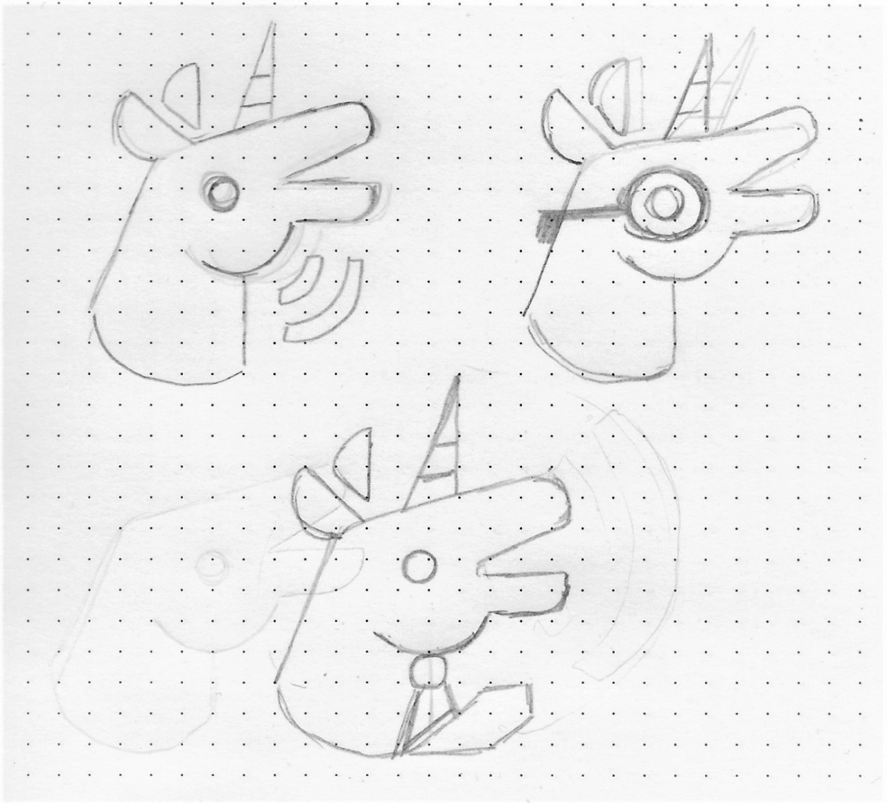

- May 23rd, 2019: Vukašin iterates on the logo further in Figma:

  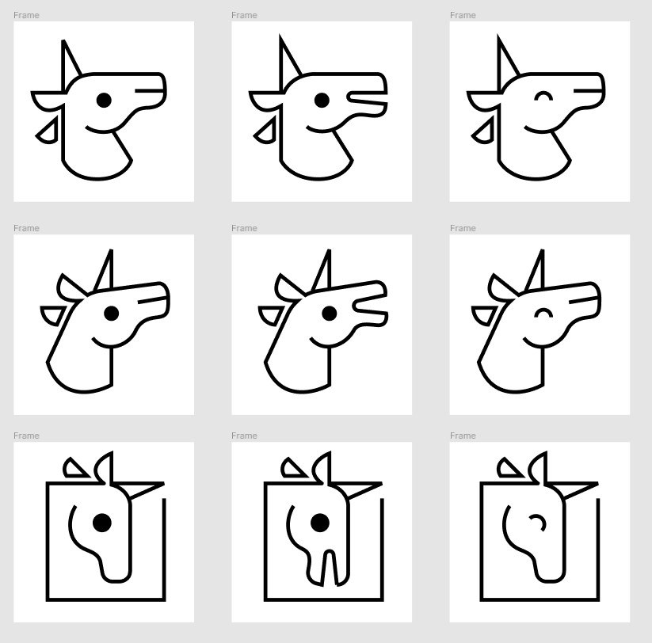

  Corbin proposes adding an accessory that personalizes the Unicorn without making it too much of a nerd cliché; a bowtie.

  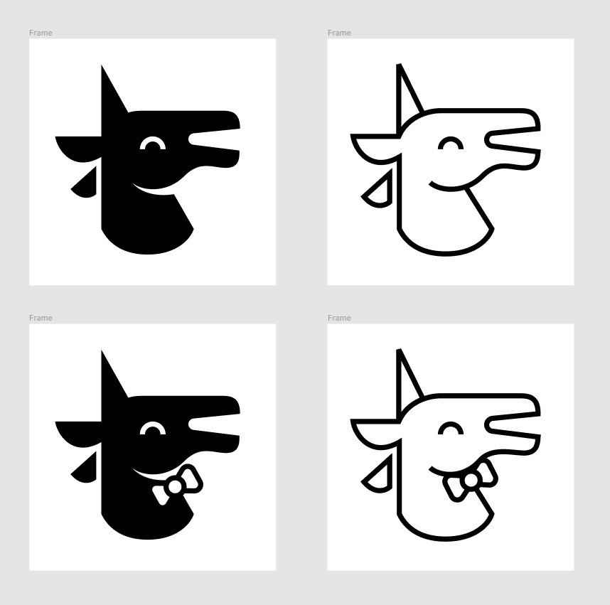

  The logo is then finalized into what was shipped with the website for 5 years:

  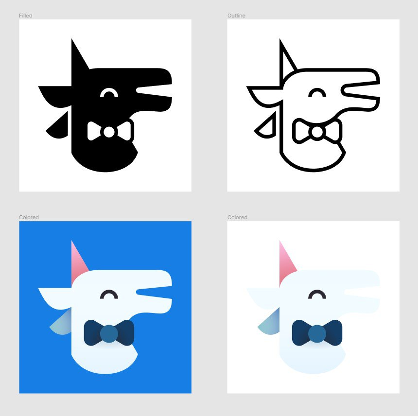

- May 30th, 2019: Tom Wellington is approached to design the initial UI for the site.

- May 31st, 2019: [The initial commit of Unicorn Utterances is made](https://github.com/unicorn-utterances/unicorn-utterances/commit/567f3d32b3c2a1bdeca95f2b3c16026901b539cb), starting development in [Gatsby](https://web.archive.org/web/20190625131121/https://www.gatsbyjs.com/).

- June 5th, 2019: Tom provides the first mockups for the site:

  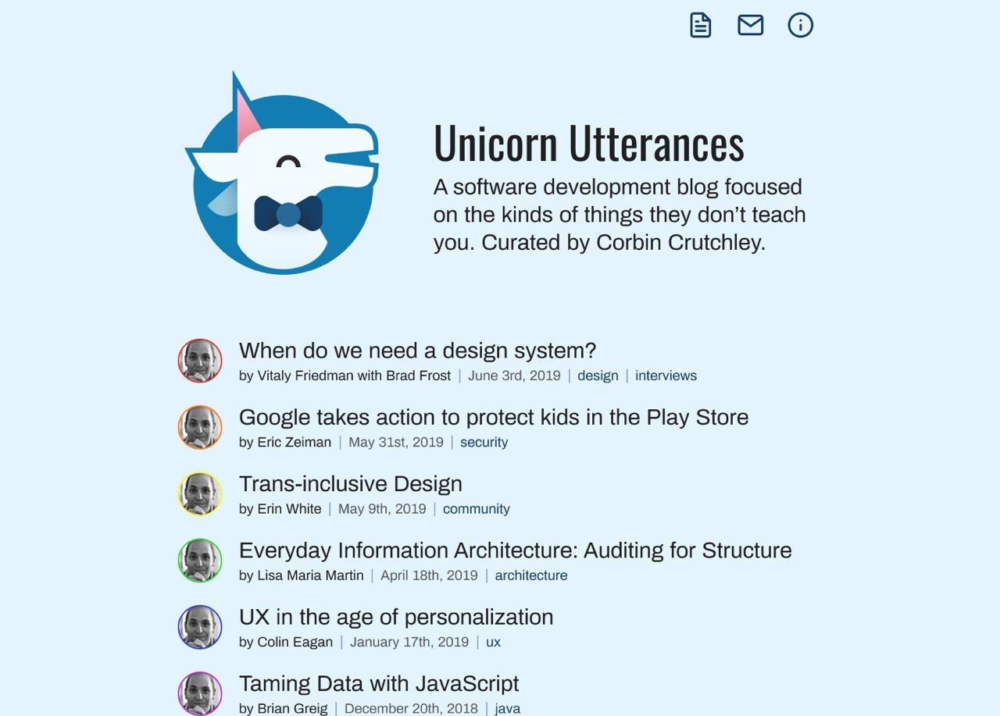

  Tom spends an inordinate amount of time [iterating on this design in Figma](https://www.figma.com/design/di3zKgJCj264nqN9g3UCSLwP/crutchcorn-%E2%80%93-unicorn-utterances), but ultimately lands on the following design for the initial launch:

  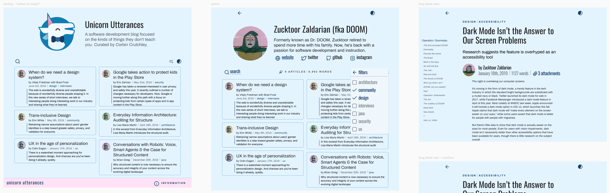

  > Tom did an amazing job on the initial design. I (Corbin) never fully followed this design pattern due to a lack of attention to detail.
  >
  > As a result, [the initial launch of the site](https://web.archive.org/web/20200513225405/https://unicorn-utterances.com/) lacked much of the polish and features that Tom's designs demonstrated. Sorry about that, Tommy! 😅

# The Launch

- June 29th, 2019; [A blog post is written to test the development of and announce the website to the public](/posts/uttering-hello-introduction-post)

  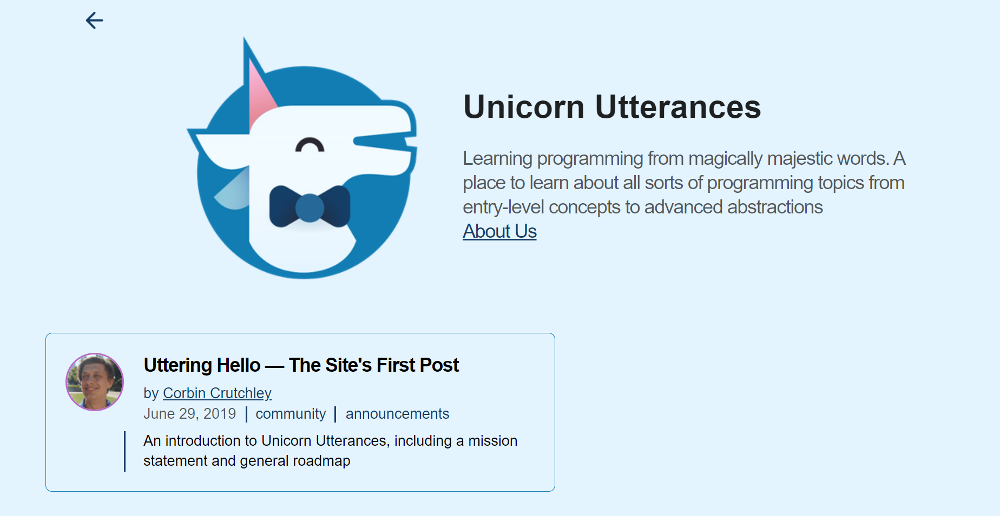

  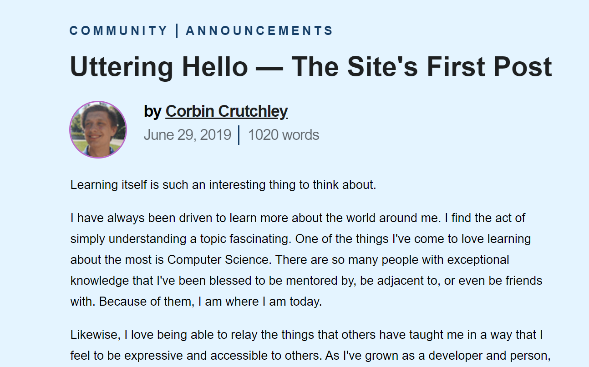

- July 11th, 2019: [The inaugural programming blog post is written about Angular templates](/posts/angular-templates-start-to-source)

- August 8th, 2019: [The Unicorn Utterances Discord server](https://discord.gg/FMcvc6T) is launched.

  > Fun fact: Corbin initially proposed for Slack, but James Fenn (correctly) suggested Discord for the shared social aspects.

- February 2nd, 2020: [Corbin starts streaming regularly on Twitch](https://www.twitch.tv/crutchcorn) to help others learn and have fun.

- November 29th, 2021: [The site begins its rewrite to Next.js](https://github.com/unicorn-utterances/unicorn-utterances/pull/289) due to buggy customization in Gatsby interrupting site development.

- January 9th 2022: Corbin starts work on [The Framework Field Guide](https://framework.guide) privately; aiming to be the platform's first book published.

- January 16th, 2022: The Next.js site rewrite is completed, enabling significantly better customization for our Markdown content.

# Maturing The Platform

- June 11th, 2022: [The initial announcement for "The Framework Field Guide" is launched](https://github.com/unicorn-utterances/unicorn-utterances/pull/367)

  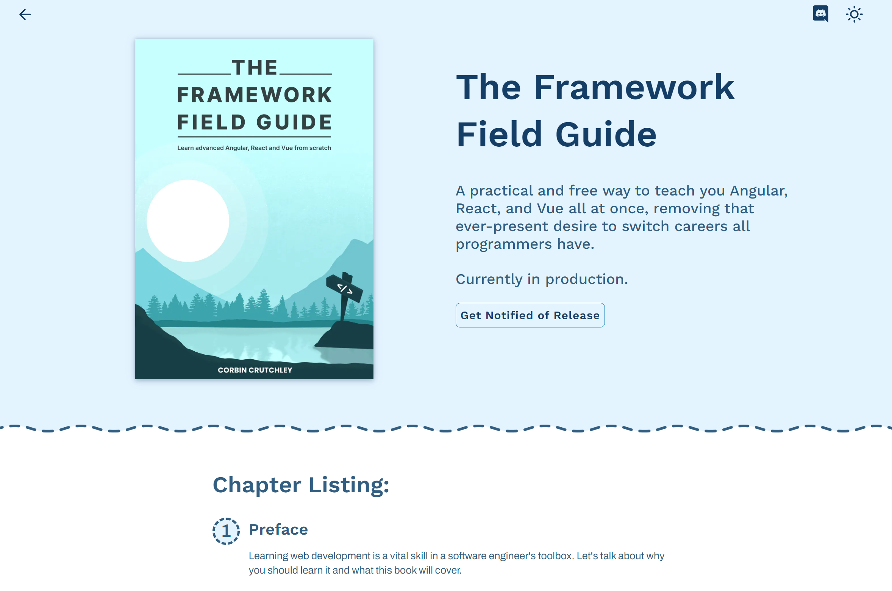

- July 9th, 2022: [The site begins its rewrite to Astro](https://github.com/unicorn-utterances/unicorn-utterances/pull/386) due to performance problems in the Next.js site.

- August 2nd, 2022: Corbin approaches Eduardo Pratti with a request to redesign "The Framework Field Guide"'s website.

  His very first mockup was presented the same day:

  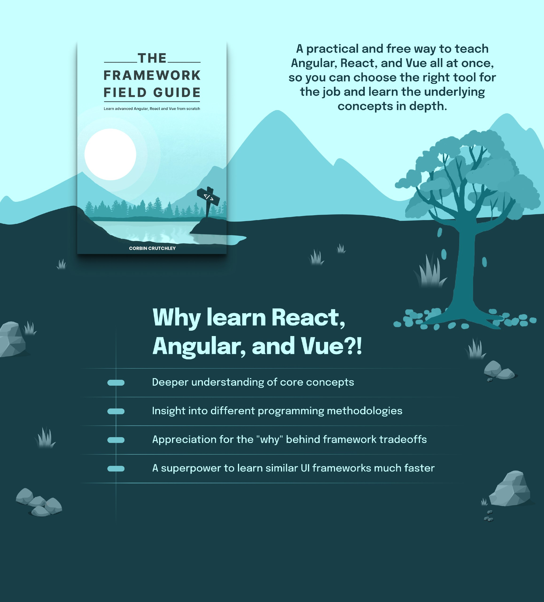

- August 24th, 2022: Eduardo Pratti showcases an initial proposal to redesign the main Unicorn Utterances site:

  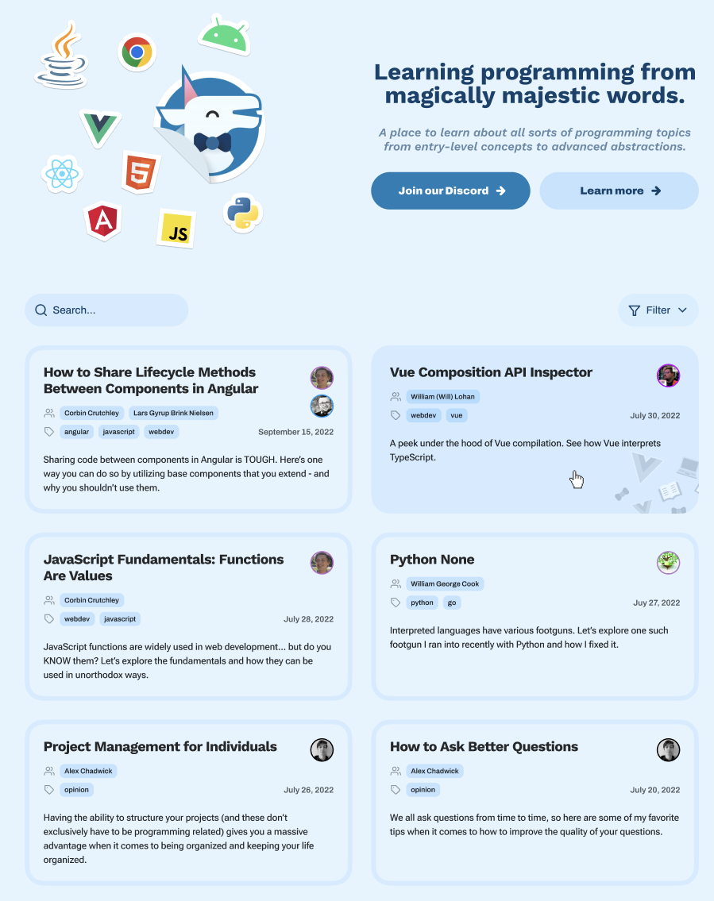

- November 8th, 2022: [The new landing page for "The Framework Field Guide" starts development.](https://github.com/unicorn-utterances/unicorn-utterances/pull/436)

- December 3rd, 2022: The site's migration to Astro is finalized, original design in place. The lighthouse score on every page is improved; on some pages it is even doubled.

- December 6th, 2022: The new landing page for "The Framework Field Guide" launches

- March 3rd, 2022: [The site's redesign, led by Eduardo Pratti and James Fenn, launches](https://github.com/unicorn-utterances/unicorn-utterances/pull/497)

  > Fun fact, this redesign was codenamed "UwU" as joke amongst the team.

- October 20th, 2023: The redesign is finished and launched to production.

- March 11th, 2024: ["The Framework Field Guide, Fundamentals" is launched to the public](/collections/framework-field-guide-fundamentals).

- June 2024: The 5 year anniversary of "Unicorn Utterances" occurs:

  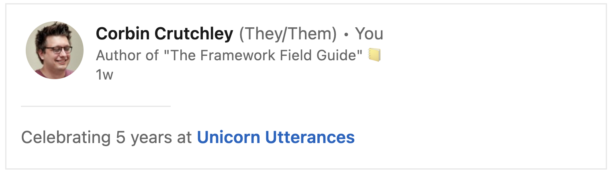

- July 2024: ["Unicorn Utterances" is no more, long live "Playful Programming"!](/posts/rebrand-to-playful-programming)

  
