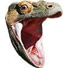
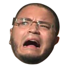

---
{
    title: "Advice for New Twitch Streamers",
    description: "Twitch streaming can be fun and fulfilling, but has various roadblocks in the way for newcomers. Here's how you can overcome them and grow your Twitch channel.",
    published: '2023-03-25T21:52:59.284Z',
    tags: ['opinion', 'twitch'],
    license: 'cc-by-4'
}
---

You've spent hours in your favorite streamer's chat. You've gotten to see all the critical moments of their streams live, joined in on community jokes, and even memorized their emote names.

One day, it hits you; If you're having this much fun in someone _else_'s stream, maybe you should give Twitch streaming a shot.

What do you need to know to get started? If only someone could give you advice on what you need to know to make the most of your streaming time.

My name's Corbin and I go by [`@crutchcorn` on Twitch](https://twitch.tv/crutchcorn/), and I've been there too. After over 1,000 hours of streaming, I've learned a few things that I wish I knew when I first started. Here are a few of the key takeaways:

- Streaming Strategy
- Essential Equipment
- Culminating Community
- Managing Moderation
- Generating Growth
- Branded Broadcasts

Let's go through these items one-by-one and create a solid strategy for our future streams.

# Streaming Strategy

Streaming is unlike any other content creation medium. Unlike blog posting, it's multi-faceted and has audio and video. Unlike a YouTube video, it's live. Unlike live TV, it's interactive.

It's these differences that require a different approach to streaming than other content mediums. Here's a few things to keep in mind:

- **Be yourself; you're not at a job interview.**

	Livestreaming is meant to be more natural and personal than prerecorded videos or even a live presentation/talk. You can be a bit (or a lot, depending on your comfort level) more casual than you might otherwise. Similarly, verbal slip-ups and hiccups are 10000% expected, especially early on. Just like any other skill, you will improve. ✨

- **Interact with chat! People watch live content in particular _because_ it's live.**

	They want to hear your thoughts and opinions on things, they want to have a two-way conversation and have real-time interaction with a person/personality. Remember, most people watch a streamer for their personality - they can't see much of that personality if you're not interacting with your viewers.

- **Be honest with yourself and your chat - they will be understanding.**

	If you're streaming programming content, but aren't yet a master at the language you're writing in - tell chat! It's okay to be a _bit_ vulnerable in that way. By being up front with your community, you're able to set the tone of supportiveness and kindness that you'll want to culminate as you grow. Similarly, if you're speed-running a game but aren't towards the top of the leaderboard, maybe show your P.B. on screen so your community can celebrate new P.Bs with you!

- **Set your boundaries with your community.**

	While a _bit_ of vulnerability can go a long way to making a safe community, there will always be trolls. However, remember that you have the center stage, not chat; Utilize this to flow your community towards the tone/attitude you want to see in them. Don't want advice on the puzzle game you're playing - make "no back-seating" part of your channel rules and enforce them with your mods. Everyone will want to establish their communities differently - follow your goals.

- **Ask your friends to tune into early streams!**

	It's fun, gives you someone to chat with early on when you might otherwise have few/no other viewers, and encourages you to practice how to engage the broader community.

# Essential Equipment

While it's always fun to buy new toys for a new hobby, I have some guidance that pertains specifically to streaming:

- **Don't worry about gear early on.**

	You don't need a DSLR, green screen, or fancy audio equipment to make good content early on. Start with a cheap microphone, see if you enjoy it, then move on to better gear. If you _do_ want to get better gear, start with audio equipment; it tends to pay the best dividends and is a less messy world than live video quality improvements.

- **Don't force a facecam.**

	If you enjoy having a facecam and think it adds production quality you yearn for, add it! But don't feel it's an obligation; you're able to get by perfectly fine without facecam. Even big content creators can go without (see also: [GameGrumps](https://www.youtube.com/user/gamegrumps), [Corpse Husband](https://www.youtube.com/channel/UCFNTq9XKHDNy_1-2lL0kqCg), and others). 

- **Create a unique and relevant set of branding.**

	Whether it be overlay customization, Twitch panel graphics, sound effects, emotes, or anything in between - make it yours and make it consistent. Starting out? Don't just use a default unmodified theme. Take a pre-made asset pack and hodgepodge it until it's unique to your brand. Growing and ready to level-up? Hire artists to make something expressly yours - there's hoards of talented creatives that want to work with you.

- **Avoid spending too much time on your branding.**

	While we just touched on how unique branding can be a boon to your channel, it can also be a massive time sink. While meta-stream customization (updating your overlay while live) can be loads of fun, they don't tend to have good viewer retension. 

> In particular, if you're a programmer I generally advise not working on your own overlay unless you have **really** cool and unique integration ideas. Even if you do, see if they can't be accomplished with [StreamElements](https://streamelements.com/) or custom OBS plugins instead of hand-rolling your own systems from scratch.

# Culminating Community

When streaming on Twitch, you're likely to run into unfamiliar terminology that is helpful to know when on the platform. Here are just a few:

- **Raids**: When someone is done with their stream, they can keep the party train going onto someone else's stream.

  They're able to "raid" another channel and move all of their live viewers to another channel. They can be as small as 1 viewer to a huge stream with dozens, or even hundreds of viewers.

- **Bits**: A small-sized donation.

  Bits are a way to donate to a streamer. Usually, 1 bit is ~$0.10 USD. They can be redeemed to send a highlighted message that your overlay can do special things with (if configured).

- **Subscriptions**: A larger donation with more rewards.

  A subscription (or "sub") is a way for someone to donate to your channel every month. There are three different types of subs:

  - *Tier 1: ~$5 USD* - Unlock the first set of streamer-specific emotes
  - *Tier 2: ~$10 USD* - Unlock the second set of streamer-specific emotes
  - *Tier 3: ~$15 USD* - Unlock the third set of streamer-specific emotes

> Keep in mind, while you can be raided before becoming an affiliate - you can only get donations through bits and subs by becoming [an official affiliate of Twitch. You become an affiliate by reaching certain viewership goals.](https://help.twitch.tv/s/article/joining-the-affiliate-program?language=en_US)

----

Similarly, there are a few global Twitch Emotes that you may want to know ahead of time:

| Emote                                                  | Name          | Description                                                 |
| ------------------------------------------------------ | ------------- | ----------------------------------------------------------- |
|  | `PogChamp`    | OMG I can't believe you've managed to pull that off! (Chat is excited) |
|  |`LUL`|A laughing face to express just how funny that "Why did the chicken cross the road" joke was.|
|  | `Kappa`       | An emote meant to represent sarcasm or a joke of some kind. |
|  | `NotLikeThis` | I can't believe this has happened. (Chat is jokingly upset by something going on) |
|  | `HeyGuys` | A way to say "Hi" to chat for the first time |
|  | `Kreygasm` | That feeling when you get a 360 no-scope (Chat found something satisfying) |
|  | `WutFace` | What did you just say?! (Chat is confused or upset by what you said) |
|  | `BOP` | A hammer to bonk you with for being silly. (or some other emotion...) |
|  | `BibleThump` | The face says it all; what you said was sad. |
|  | `CoolStoryBob` | Cool story, can you tell it again? (chat doesn't believe you) |

In case this isn't enough [here are a few other emotes, introduced by Twitch themselves.](https://www.twitch.tv/creatorcamp/en/paths/getting-started-on-twitch/emotes/)

# Managing Moderation

While streaming can be fun and relaxing at times, there are potential downsides as well. Just like any other platform, Twitch has its fair share of trolls that need to be cut from the stream when they engage.

To help solve this, here's a few tips to follow:

- **Establish a mod team of friends or frequent chatters that you can trust early on.**
	
	They're not only a lifesaver for the instances where you need moderation, but also greatly help with your moral to keep streaming and can encourage chat to stay in the boundaries you've set, even in subtle ways.
	
- **Prepare for potential hate raids or follow-botting.**

  While Twitch has gotten _better_ at filtering out these kinds of negative interactions, it never hurts to be familiar with what tools you have at your disposal ahead-of-time. Just to name a few, [Twitch has its built in "Shield" functionality](https://safety.twitch.tv/s/article/Protect-your-channel-with-Shield-Mode?language=en_US), but there are community efforts like [Sery_Bot](https://serycodes.carrd.co/) as well.

- **Be on guard for your digital security.**

  Remember, there are bad actors all over the internet. While most links shared with you might be authentic, don't click on any unfamiliar links coming from your chat. This helps prevent hacking or phishing attempts.

- **Manage your on-stream privacy to avoid accidental self-doxing.**

  Doxing is when someone shares personal information about another person. However, there are times when you might accidentally dox _yourself_. To prevent this, use a separate browser from your daily-driver so that you don't accidentally share DMs, location, or other information about yourself. Further, if you're streaming on Windows, make your non-streaming monitor your "primary" monitor, so that new windows, dialog boxes, and notifications don't automatically show on-screen accidentally.

# Generating Growth

While not top of mind for everyone, some streamers want to grow their streams to have as many viewers as possible. To help grow your brand, consider:

- **Schedule consistency is key.**

  Especially early on in your streams, keep a schedule that you follow _religiously_. For example, you might try streaming on "Tuesdays and Thursdays at 4PM PST". This will help propel your audience's ability to keep up and catch your content regularly.

- **Stay on brand with your categories.**

  While a _bit_ of variety _can_ be good for some streamers, it's generally advised to stay away from multi-focusing your channel's categories. Variety streamers have a much more challenging time trying to garner their foothold. Not only is it harder to make connections in a niche (both with other streamers and viewers alike), but the recommendation algorithm seems to punish you harshly for jumping categories frequently.

- **Network with fellow streamers**.

  Like other parts of brand growth, networking is absolutely critical in streamer brand growth. I'd say that 30-40% of your time on Twitch should be as a viewer of other people in your niche. Get to know them; follow them on other social media and make friends. Raids grow the channel **significantly** faster than organic growth.

- **Set your expectations realistically.**

  Becoming a Twitch affiliate is feasible within the first couple of months or first year of streaming, but becoming a Twitch Partner is **exceedingly** challenging to reach. Especially if your niche is small like mine; in the programming category there are _maybe_ 20-30 partners in the entire category across all languages and regions. Even big brands with a specific investment in Twitch have a hard time breaking into partner.

- **Recognize the relevant metrics**.

  While followers are nice to have as a vanity metric, they seldomly represent the health of a channel. I know some partner channels with low thousand followers while some channels have over 10,000 followers and aren't even close to partner. *The most relevant metric to see a channel's size is average viewership.*

- **"A body in motion stays in motion."**

  If you're on an upswing of viewership, add gas to the fire by streaming more regularly/often immediately following. The Twitch recommendation algorithm is a fickle beast, but in my experience absolutely rewards those that are already doing well. Similarly, if you let your viewership drop for a short time, it may take some time growing it back to baseline.

- **Diversify your audience.**

  While having a primary audience on Twitch is great, Twitch's notification system may fail to inform your users when you go live. Furthermore, being able to culminate a community outside of Twitch allows your viewers to become more personable with you, which may keep their interest in the channel for longer. Try promoting a Discord or a personal Twitter account to help others stay up-to-date and keep the conversation going with you.

# Branded Broadcasts

While this guide has primarily been geared towards individuals looking to become Twitch streamers, I've also had some experience trying to break into the streaming world as a cooperate brand.

Here are my learnings from this time:

- **I generally do not recommend streaming to _almost_ anyone looking to grow their corporate brand/audience.**

  The first ~600 hours of personal streaming were exceedingly tough to grow. Not only are you getting used to this awkward new environment, but you have very little traffic to your branded site or content and those that _do_ show up can be a bit dismissive of a brand in a personality-driven environment.
- **Streaming has among the lowest ROI of any content-creation adjacent activities I've ever done.**

  Keep in mind that streaming is a huge time investment where your first major hurdle is to grow an audience. From my experience, I found it easier to grow the company's ROI by blogging, attending meetups, or otherwise pre-recording video.

  If you get into streaming - I'd generally advice it be seen as an extremely long-term investment and/or an easy content generation method while multi-tasking and doing other things; don't make it your core KPI to grow on streaming platforms.

# Conclusion

While I could continue this guide for almost forever, this is a good stopping point for the guidance I'm hoping to provide for others looking to get into streaming.

Hopefully this has been an insightful look into how Twitch streamers can grow and improve their own streams.

Until next time, I hope your streaming career goes well!

