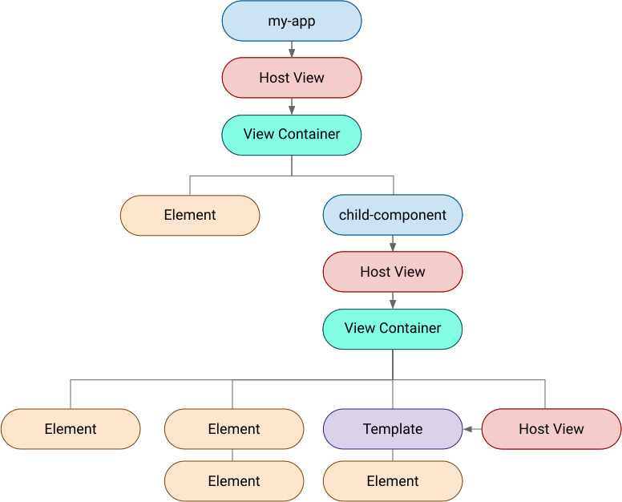

---
{
	title: "Why Can't Angular Cast An Element to Another?",
	description: "",
	published: '2025-12-01T13:45:00.284Z',
	tags: ['angular', 'webdev', 'javascript'],
	license: 'cc-by-nc-sa-4'
}
---

While I'm a huge fan of Angular at heart, I've often used React at my day jobs.  While working with React component libraries - either internal or external - you're likely to run into a pattern like so:

```jsx
<OurButton as="a" href="oceanbit.dev">This looks like a button, but is a link</OurButton>
```

This `<OurButton/>` component is able to expose an internal `"button"` tag when nothing is passed, but transform into any other `as` element when the property is passed.

What's cooler is that the other attributes from the `as` original element (like `<a>`'s `href` above) can be type-safe using some TypeScript magic.

You can implement it in Vue, too!

<!-- ::start:tabs -->

# React

```tsx
import {
	ComponentPropsWithoutRef,
	ElementType,
	PropsWithChildren,
} from "react";

type PolymorphicProps<E extends ElementType> = PropsWithChildren<
	ComponentPropsWithoutRef<E> & {
		as?: E;
	}
>;

type OurButtonProps<T extends ElementType = "h1"> = PolymorphicProps<T> & {
	as?: T;
};

function OurButton<const T extends ElementType = "button">({
	as,
	children,
	...props
}: OurButtonProps<T>) {
	const Button = as || "button";
	return (
		<Button {...props}>
			{children}
		</Button>
	);
}

// Usage
<OurButton as="a" href="oceanbit.dev">
    This looks like a button, but is a link
</OurButton>
```

# Vue

```vue
<!-- OurButton.vue -->
<script setup lang="ts" generic="T extends keyof HTMLElementTagNameMap = 'button'">
const props = defineProps<
	Partial<HTMLElementTagNameMap[NoInfer<T>]> & {
		as?: T;
	}
>();

const Component = props.as || "button";
</script>

<template>
	<component :is="Component" v-bind="props">
		<slot />
	</component>
</template>
```

```html
<!-- Usage -->
<OurButton as="a" href="oceanbit.dev">
    This looks like a button, but is a link
</OurButton>
```

<!-- ::end:tabs -->

> Cool! How do you do that in Angular?

Well, in short, you can't. Not without effectively rewriting React or Vue inside of Angular itself.

> With this feature being so ubiquitous as it is in React and Vue ecosystems, why doesn't Angular support it?

Well... Let's talk about that!

To start, let's make sure we're talking about the same Angular: starting with it's underpinnings.

# Angular, the compiler

Angular, from the very start, has been a template compiled framework. From its heavy investment into [the Ivy compiler](https://blog.angular.dev/a-plan-for-version-8-0-and-ivy-b3318dfc19f7?gi=50ff09ebda89) all the way back in 2018 to the [migration to AOT compiling as the default in 2019](https://angular.dev/tools/cli/aot-compiler#choosing-a-compiler), its compiler is at the heart of Angular today.

So how _does_ Angular's compiler work?

Assume we're compiling the following template:

```html
<p>Hello, {{message}}</p>
```

This outputs to something like the following:

```javascript
ɵɵdefineComponent({
  type: TestCmp,
  selectors: [['test-cmp']],
  decls: 2,
  vars: 1,
  template: function TestCmp_Template(rf, ctx) {
    if (rf & 1) {
      ɵɵelementStart(0, 'p');
      ɵɵtext(1);
      ɵɵelementEnd();
    }
    if (rf & 2) {
      ɵɵadvance();
      ɵɵtextInterpolate1('Hello, ', ctx.message, '');
    }
  },
  encapsulation: 2,
});
```

This `template` function is then called multiple times, depending on the state of the render. If it's the first render, `rf` (short for "render flag") will be set to `1`. If it's an update after the first render, `rf` will be set to `2`.

Combined, these steps will output the expected DOM results.

> You can [explore the Angular compiler yourself here in an interactive site](https://jeanmeche.github.io/angular-compiler-output/).

# Angular, the tree

The compiler isn't the only trick Angular has up its sleeve to get things working as we'd expect, though. Angular also creates a tree to represent our DOM nodes:



Here, a `View Container` represents any place where elements can be dynamically added or removed.

> [You can learn more about Views, View Containers, and templates in this article I wrote a while back](https://playfulprogramming.com/posts/angular-templates-start-to-source).

These View Containers are often represented in the DOM by using an anchor node (typically a [`Comment` node](https://developer.mozilla.org/en-US/docs/Web/API/Comment)) and help facilitate Angular's instruction set to manipulate surrounding elements.

Two other examples where this occurs are:

- Control flow syntax blocks (like `@for` and `@if`)
- Structural directives (`*ngElementNameOutlet`)

# Angular, the runtime

By now, it might be clear that Angular's runtime - while technically impressive and sound - is minimal after the compiler's done with its job.

To handwave a bit (or maybe more than "a bit"); Angular handles a flag to tell the runtime when to update the DOM in a given `render flag` stage, it executes the relevant component functions, then your UI is updated.

This is all to say _"Angular has minimal control over how to create or update original DOM structures once it's hit the browser"_. Once it's past the compilation stage, **the most Angular is capable of doing is creating a single DOM node that's not part of the existing template blueprint function** from the compiler output.

> This is partially how Angular is able to keep such slim and expedient runtimes; it has lower required overhead because it doesn't need to handle arbitrary DOM manipulation and can rely on persistent blueprints of your template to execute as needed.
>
> This is also why the Angular team has been hesitant to roll out JSX as an authoring format for Angular; it's not a good fit as JSX's templating is intended to allow for dynamic transformation at runtime.

In order for there to be some kind of `as` casting API akin to an imaginary API of `*ngElementNameOutlet="tag"`, we'd need a more expressive runtime component to Angular; which would instantly lead to heavy bloat in our bundles, extended initial JavaScript parsing time, and more.

# Angular casting, the workaround

While Angular doesn't have a one-to-one API with React and Vue's `as` type cast, it does have the ability to attach component behavior onto different elements.

Because [Angular uses host elements instead of transparent elements](https://playfulprogramming.com/posts/angular-templates-dont-work-how-you-think), we can tell Angular's selector to use an attribute to lookup rather than a new HTML tag:

```angular-ts
@Component({
	selector: `a[our-button], button[our-button]`,
	template: `<ng-content></ng-content>`
})
class OurButton {
}

@Component({
	selector: "app-root",
	template: `
		<a our-button href="oceanbit.dev">This looks like a button, but is a link</a>
	`
})
class App {
}
```

<iframe data-frame-title="Attribute Selector - StackBlitz" src="pfp-code:./attribute-selector-1?template=node&embed=1&file=src%2Fmain.ts"></iframe>

This means that we can customize the child elements and add functionality to our `a` or `button` tags that use the `our-button` attribute.
