---
{
    title: "Why is z-index not working?! - Explaining CSS Stacking Context",
    description: "z-index is a CSS property that helps control the z-axis height of an element, but it often doesn't seem to work. Why is that? How does it REALLY work?",
    published: '2022-10-06T22:12:03.284Z',
    tags: ['webdev', 'css', 'html'],
    license: 'cc-by-4'
}
---

Dimensions are weird. While most web apps seem to focus on the `x` and `y` axis, representing a 2D plane that the user interacts with, there's actually a `z`-axis that's often ignored. Some browsers, such as [Microsoft Edge, even provide a way to see a website blown up into a 3D view](https://docs.microsoft.com/en-us/microsoft-edge/devtools-guide-chromium/3d-view/):

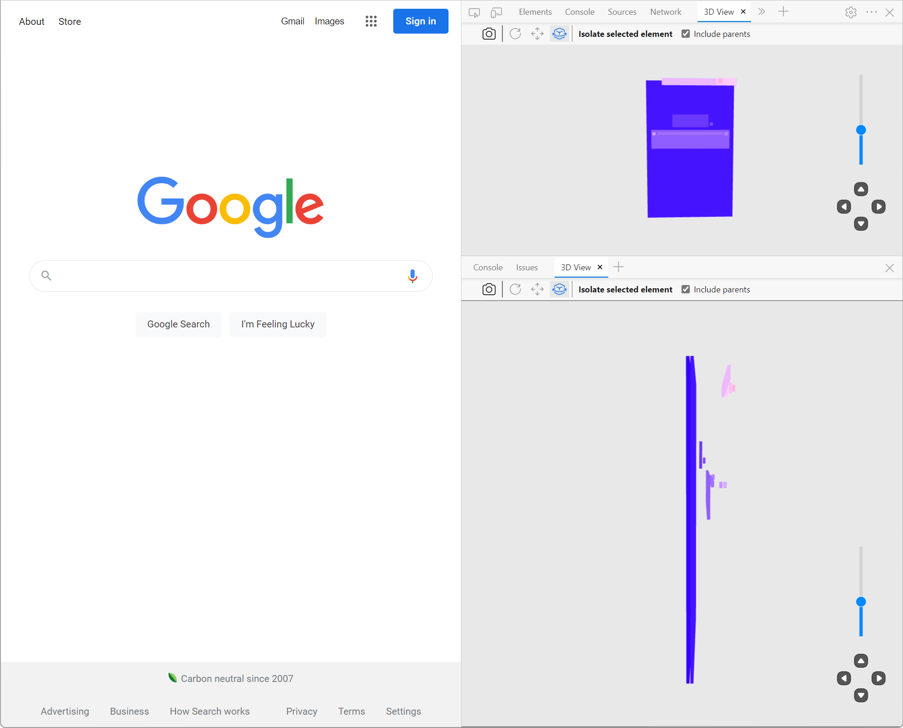

While this is cool, by introducing a third dimension to our web pages, we introduce the ability for elements to overlap with one another. Managing overlapping issues using CSS is _tricky_. 

Sure, you have a [`z-index`](https://developer.mozilla.org/en-US/docs/Web/CSS/z-index), which many claim is an easy way to manage an element's `z` axis, but it seems so brittle and inconsistent!

> This article doesn't expect you to have pre-existing `z-index` knowledge. If you're being sent this article to learn how `z-index` works, you're in the right place.

For example, let's think about modals. Modals are UI elements that enable you to display information in a box that rests above the rest of your page's contents. This is what an example modal looks like from [Google Drive](https://drive.google.com/):

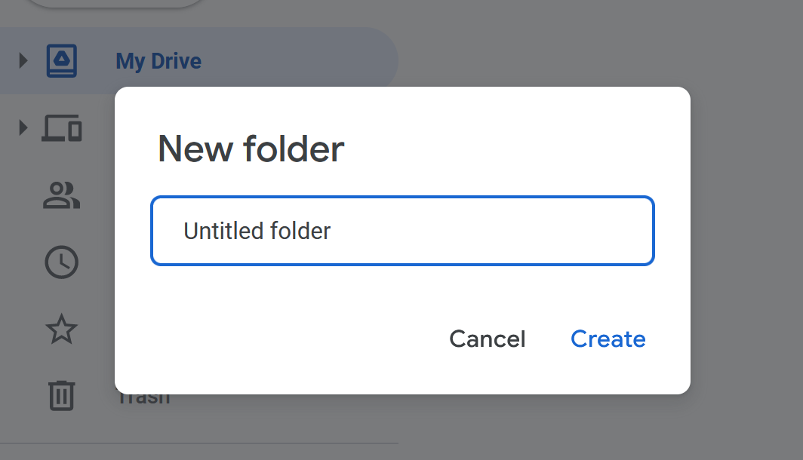

[Despite some UX headaches that modals can introduce into an app](https://modalzmodalzmodalz.com/), they're still a widely used UI element in many applications today. While building sufficiently useful modals can be a challenging task, a rudimentary modal can be completed even without JavaScript.

Let's use some CSS and HTML to build a basic modal:

```html
<div>
  <div id="body">
    <p>This is some text, pretend it's an app back here</p>
  </div>
  <div id="modal-container">
    <div id="modal">This is a modal</div>
  </div>
</div>

<style>
#modal-container {
  position: fixed;
  top: 0;
  left: 0;
  height: 100%;
  width: 100%;
  display: flex;
  justify-content: center;
  align-items: center;
  background: rgba(0, 0, 0, 0.5);
}

#modal {
  background: white;
  border: 1px solid black;
  padding: 1rem;
  border-radius: 1rem;
}
</style>
```

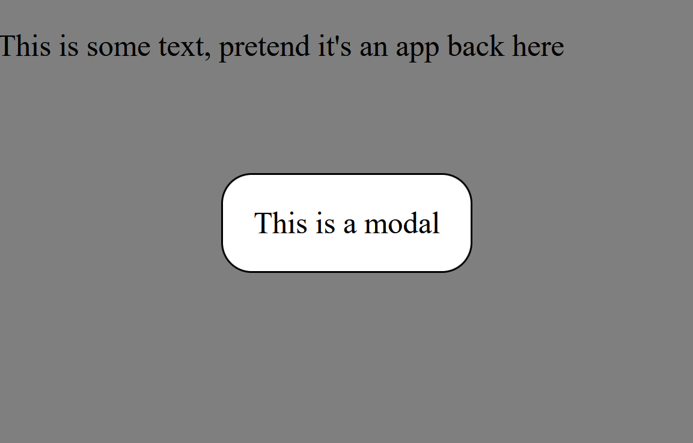

Tada! 🎉 Now we have a fairly basic modal to display whatever HTML we want inside.

But let's say that we keep building out the page. As we do, we might, for example, want to have a `footer` beneath our main page's content.

```html
<div>
  <div id="body" style="min-height: 50vh">
    <p>This is some text, pretend it's an app back here</p>
  </div>
  <div id="modal-container">
    <div id="modal">This is a modal</div>
  </div>
  <footer style="min-height: 50vh">App Name</footer>
</div>

<style>
#modal-container {
  position: fixed;
  top: 0;
  left: 0;
  height: 100%;
  width: 100%;
  display: flex;
  justify-content: center;
  align-items: center;
  background: rgba(0, 0, 0, 0.5);
}

#modal {
  background: white;
  border: 1px solid black;
  padding: 1rem;
  border-radius: 1rem;
}

footer {
  position: relative;
  background: lightblue;
  padding: 1rem;
}
</style>
```

At first glance, this might look like it's been successful, but let's take a look at the rendered output:

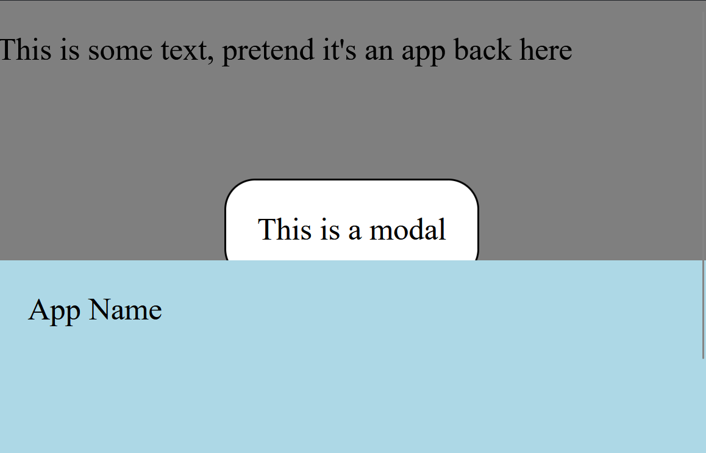

Oh dear! Why is the footer rendered above the modal?

Well, my friends, the modal is rendering under the footer due to something called "Painting Order".

# What is painting order?

While the concept of the "painting order" in the DOM is quite complex, here's the gist of it:

Your browser is fed information from HTML and CSS to figure out what to show on-screen. While we often think of this process as instantaneous, nothing in computer science truly is. 

**This process of showing HTML and CSS on the screen is called "painting" or "drawing" the screen.**

Painting contents on the screen might sound straightforward at first, but think about what that entails:

Given every bit of HTML and CSS, figure out where they belong and display them.

There are a lot of nuances there; Nuance that's dictated by a strict set of rules.

While we'll take a look into the specific rules of painting in a moment, let's start by taking a look at the following code example:

```html
<div id="container">
  <div id="blue">Blue</div>
  <div id="green">Green</div>
  <div id="purple">Purple</div>
</div>

<style>
#container {
  display: relative;
}

#blue,
#green,
#purple {
  height: 100px;
  width: 100px;
  position: absolute;
  padding: 8px;
  color: white;
  border: 4px solid black;
  border-radius: 4px;
}

#blue {
  background: #0f2cbd;
  left: 50px;
  top: 50px;
}

#green {
  background: #007a70;
  left: 100px;
  top: 100px;
}

#purple {
  background: #5f00b2;
  left: 150px;
  top: 150px;
}
</style>
```

Here, we have three different boxes that overlap with one another. Given that they overlap, **which one do you think takes priority and, at least visually, is on top of the other boxes**?

<br/>

No, really, guess! Stop reading, take a look at the code, and take a guess. 😊

<br/>

<br/>

<br/>

<br/>

<br/>

<br/>

<br/>

<br/>

<br/>

<br/>

<br/>

Ready to see the answer?

<br/>

<br/>

<br/>

<br/>

<br/>

<br/>

<br/>

<br/>

<br/>

<br/>

<br/>

<br/>

OK, here it is:

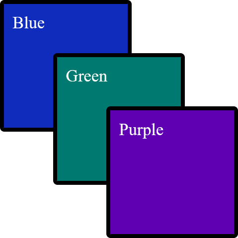

The reason these colored boxes are in the order they're in is thanks to their respective "paint order". The browser walked through its rules of "what order should I paint things in" and settled on this order.

While some CSS pros might assume that purple is seemingly on the top [due to the order in which the CSS is laid out, just like other CSS rules](https://wattenberger.com/blog/css-cascade#position), this isn't what's happening here.

Notice how the purple box seemingly remains on "top" when we re-arrange the CSS rules:

```css
#purple {
  background: #5f00b2;
  left: 150px;
  top: 150px;
}

#green {
  background: #007a70;
  left: 100px;
  top: 100px;
}

#blue {
  background: #0f2cbd;
  left: 50px;
  top: 50px;
}
```


> If changing the CSS order doesn't re-arrange the boxes and change the paint order, then what does?

Well...

<!-- ::in-content-ad title="Consider supporting" body="Donating any amount will help towards further development of articles like this." button-text="Visit our Open Collective" button-href="https://opencollective.com/playfulprogramming" -->

# Re-arrange HTML Elements to Change the Painting Order

Let's take the HTML we had before and re-arrange it a bit:

```html
<div id="container">
  <div id="purple">Purple</div>
  <div id="green">Green</div>
  <div id="blue">Blue</div>
</div>
```

Now, if we look at the box order, we'll see...

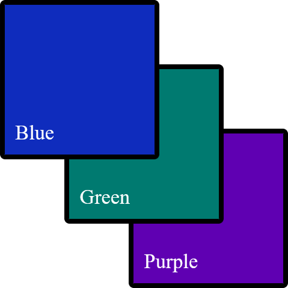

Now our boxes have reversed their height order! This is because one of the deciding factors of an element's painting order is its relationship to other elements.

# Positioned Elements Behave Differently Than Non-Positioned Elements

> This is where things get confusing. Take your time with this chapter; it's okay to have to re-read this section multiple times.

While we were using `absolute`ly positioned elements for a simple demo before, let's take a step back and change our elements to be positioned using `margin` instead:

```css
<div id="container">
  <div id="purple">Purple</div>
  <div id="green">Green</div>
  <div id="blue">Blue</div>
</div>

<style>
#container {
  display: relative;
}

#container > div:nth-child(1) {
  margin-top: 50px;
  margin-left: 50px;
}

#container > div:nth-child(2) {
  margin-top: -50px;
  margin-left: 100px;
}

#container > div:nth-child(3) {
  margin-top: -50px;
  margin-left: 150px;
}

#blue,
#green,
#purple {
  height: 100px;
  width: 100px;
  padding: 8px;
  color: white;
  border: 4px solid black;
  border-radius: 4px;
}

#blue {
  background: #0f2cbd;
}

#green {
  background: #007a70;
}

#purple {
  background: #5f00b2;
}
</style>
```

Looks like a familiar output:


While working on styling, we wanted our `green` box to move to the left when you hover over it. This is straightforward enough to do [using CSS animations](https://developer.mozilla.org/en-US/docs/Web/CSS/CSS_Animations/Using_CSS_animations); let's add it:

```css
#green {
  background: #007a70;
  position: relative;
  left: 0px;
  transition: left 300ms ease-in-out;
}

#green:hover {
  left: 20px;
}
```

While our green button now smoothly moves left when you hover over it, there's a new problem: The green box is now on top of the purple and blue boxes.

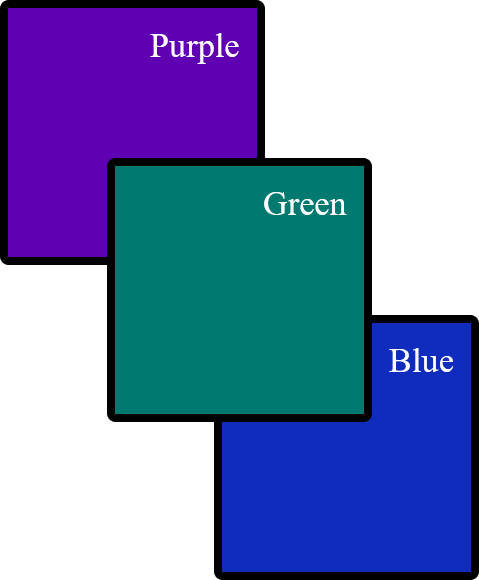

This is because browsers paint positioned elements before non-positioned elements. This means that our `relative` positioned element is painted first and seems to take priority in the `z` layer over non-positioned elements.

# Understanding more rules of Painting Order

While `relative` positioning is one way that you can tell the browser to paint an element first, it's far from the only way to do so. Here's a list of CSS rules that will change the order an element paints in, from the lowest priority to the highest priority:

1. The `background` of the following tags: `html`, `:root`, `body` 

2. The `background` of the [stacking context root element](#stacking-contexts)

   > Come back to this at the end of the article; it won't make sense now.

3. Positioned elements with a negative `z-index`

4. Non-positioned elements' `background`

5. Elements with a `float` style applied without a `position` applied

6. Non-positioned `inline` elements

7. The text contents of non-positioned, non-floating elements, as well as a few other rules

8. Positioned elements without a `z-index` applied or with a `z-index` of `0`, as well as a few other rules

9. Elements with a `z-index` of `1` or more

10. Depending on your browser, [`outline`](https://developer.mozilla.org/en-US/docs/Web/CSS/outline)s

> While this includes [all of the steps of painting order according to the CSS specification](https://www.w3.org/TR/CSS22/zindex.html), those steps may have more sub-steps. Overall, this list is non-comprehensive to keep the list readable.

So, if we have the following HTML:

```html
<div class="container" style="background: rgba(0, 0, 0, 0.8)">
    <div class="box slate" style="position: relative">Slate</div>
    <div class="box yellow" style="display: inline-block">Yellow</div>
    <div class="box lime" style="float: left">Lime</div>
    <div class="box green" style="">Green</div>
    <div class="box cyan" style="position: relative; z-index: -1">Cyan</div>
</div>
```

We would see, from top to bottom:

- A `slate` colored box
- A `yellow` colored box
- A `lime` colored box
- A `green` colored box
- The `container`'s background
- A `cyan` colored box

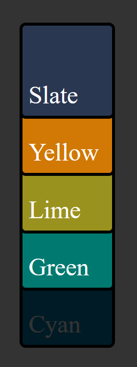

<!-- Editor's note: I'm cheating in that screenshot. `float` and `inline-display` are hard to make elements align again, so I'm just using `z-index` for demonstration purposes -->

All of these rules are superseded by the order of the elements within the HTML, as we learned before. For example, with the following HTML:

```html
<div class="container" style="background: rgba(0, 0, 0, 0.8)">
  <div class="box slate" style="position: relative">Slate</div>
  <div class="box yellow" style="">Yellow</div>
  <div class="box lime" style="position: relative">Lime</div>
  <div class="box cyan" style="">Cyan</div>
</div>
```

You would see the following order of elements:

-  Lime
- Slate
- Cyan
- Yellow

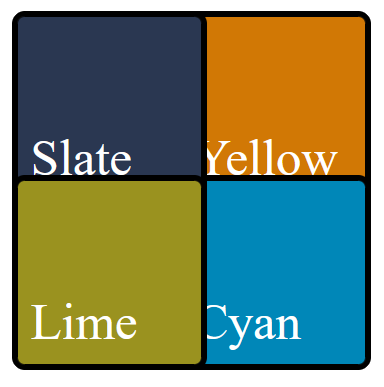

This is because the `lime` and `slate` take painting priority over `yellow` and `cyan` thanks to their `relative` positioning, but are still in HTML order within the same `z` level priority and within the same stacking context. 

# Creating Stacking Contexts {#stacking-contexts}

> "Welp, that's enough reading in the book today"

You think to yourself. You go lay down and get some sleep. In your dreams, you can still hear the book speaking to you:

> [...] are still in HTML order within the same `z` level priority and within the same stacking context

> [...] within the same stacking context

The book repeats itself:

> [...] within the same stacking context

You wake up, realize that you don't yet know what that sentence means, and think to yourself:

> There's no way this gets even more complicated.

Unfortunately, it does.

----

At its heart, a stacking context is a group that you can move multiple items up or down the `z`-axis at the same time.

Take the following HTML:

```html
<div class="container">
  <div id="top-container" style="position: relative">
    <div class="box slate" style="position: relative">Slate</div>
    <div class="box yellow" style="">Yellow</div>
  </div>
  <div id="bottom-container">
    <div class="box lime" style="position: relative">Lime</div>
    <div class="box cyan" style="">Cyan</div>
  </div>
</div>
```

What order do you think the `box`es are going to be in?

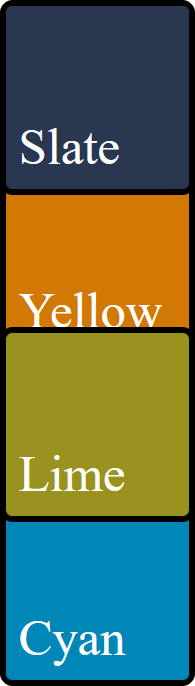

The answer is:

- Slate
- Lime
- Cyan
- Yellow

This is because, despite the parent `top-container` having `position: relative`, the `box`es are still within the same stacking context. This stacking context follows the same ordering rules as outlined before, which means that the positioned `slate` and `lime` `box`es take `z` priority over `cyan` and `yellow`.

Ready for the twist?

Let's add `z-index` to our `top-container`:

```html
<div class="container">
  <div style="position: relative; z-index: 1">
    <div class="box slate" style="position: relative">Slate</div>
    <div class="box yellow" style="">Yellow</div>
  </div>
  <div>
    <div class="box lime" style="position: relative">Lime</div>
    <div class="box cyan" style="">Cyan</div>
  </div>
</div>
```

Now what order do you think they'll be in?

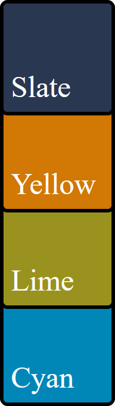

- Slate
- Yellow
- Lime
- Cyan

This is because, in reality, what we're ordering here is not the `box`es. Instead, what we are ordering is the `top-container` and `bottom-container` `div`s, **then** the `box`es, like so:

- `top-container`
  - `slate`
  - `yellow`
- `bottom-container`
  - `lime`
  - `cyan`

This only occurred when we added a `z-index` to `top-container` because that's when a new stacking context was created. When that context was created, we raised it to a higher `z`-axis due to the same ordering rules as before.

> Remember, a stacking context is a grouping of elements that move together as a collection when the parent's `z`-axis location is changed.

Stacking Contexts are created when:

- `z-index` is applied to a positioned element
- `z-index` is applied to a child of a `grid` or `flex` element

- Element with an [`opacity`](https://developer.mozilla.org/en-US/docs/Web/CSS/opacity) of less than `1` 
- Element with any of the following properties:
  - [`transform`](https://developer.mozilla.org/en-US/docs/Web/CSS/transform)
  - [`filter`](https://developer.mozilla.org/en-US/docs/Web/CSS/filter)
  - [`backdrop-filter`](https://developer.mozilla.org/en-US/docs/Web/CSS/backdrop-filter)
  - [`perspective`](https://developer.mozilla.org/en-US/docs/Web/CSS/perspective)
  - [`clip-path`](https://developer.mozilla.org/en-US/docs/Web/CSS/clip-path)
  - [`mask`](https://developer.mozilla.org/en-US/docs/Web/CSS/mask) / [`mask-image`](https://developer.mozilla.org/en-US/docs/Web/CSS/mask-image) / [`mask-border`](https://developer.mozilla.org/en-US/docs/Web/CSS/mask-border)

> This list is non-exhaustive but contains most of the highlights of when a stacking context is created.

It's worth mentioning that if a stacking context is created, then the element that created said stacking context is treated with priority `z` axis ordering.

For example, if you have:

```html
<div>
	<div style="position: absolute; top: 0; background: white">Absolute</div>
	<div style="opacity: 0.99; background: white">Opacity</div>
</div>
```

Then it will show "Absolute" above "Opacity", thanks to the order of the HTML sequence; this is all despite positioned elements typically being prioritized above HTML sequencing.

If we remove the `opacity: 0.99` from the `"Opacity"` `div`, then `"Absolute`" will be on top.

# Another Modal Stacking Context Example

Let's take a look at what we've learned thus far.

We know from the previous section that `position: relative` and a `z-index` greater than `1` should create a stacking context.

Given this knowledge, what do we expect the following code to render?

```html
<header
  class="container-box"
  style="position: relative; z-index: 1; background: #007a70"
>
  Header
</header>
<footer
  class="container-box"
  style="position: relative; z-index: 2; background: #0f2cbd"
>
  Footer
</footer>
<style>
.container-box {
  color: white;
  padding: 1rem;
  border-radius: 0.5rem;
  border: 0.25rem solid black;
}
</style>
```

No major surprises here; it renders a greenish rectangle positioned atop a blue rectangle with the text of "Header" and "Footer", respectively.

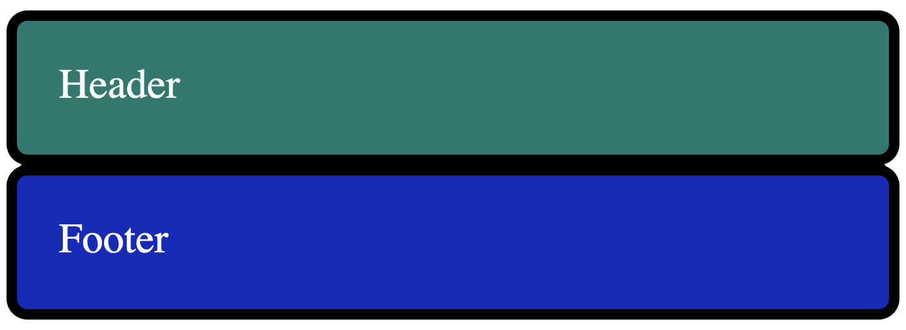

Now, let's say that we want to show a modal on top of the footer to show the user information they might think is relevant.

Now, what do you think happens if we add in said modal using `position: absolute; z-index: 99` within the `<header>`?

```html
<header
  class="container-box"
  style="position: relative; z-index: 1; background: #007a70"
>
  Header
  <div
    id="modal"
    class="container-box"
    style="
      position: absolute;
      z-index: 99;
      background: #007a70;
      width: 100%;
      box-sizing: border-box;
      bottom: -3.75rem;
      left: 0;
    "
  >
    Modal in header
  </div>
</header>
<footer
  class="container-box"
  style="position: relative; z-index: 2; background: #0f2cbd"
>
  Footer
</footer>
<style>
.container-box {
  color: white;
  padding: 1rem;
  border-radius: 0.5rem;
  border: 0.25rem solid black;
}
</style>
```

You might be surprised to find that nothing changes - it seemingly doesn't show the modal anywhere and instead shows the same two "Header" and "Footer" elements as before:


However, if we change the `footer` code to the following:

```html
<footer
  class="container-box"
  style="position: relative; z-index: 0; background: #0f2cbd"
>
  Footer
</footer>
```

> The only thing we changed was `z-index` from `1` to `0`

Then suddenly, we see the modal above the `Footer` as expected:

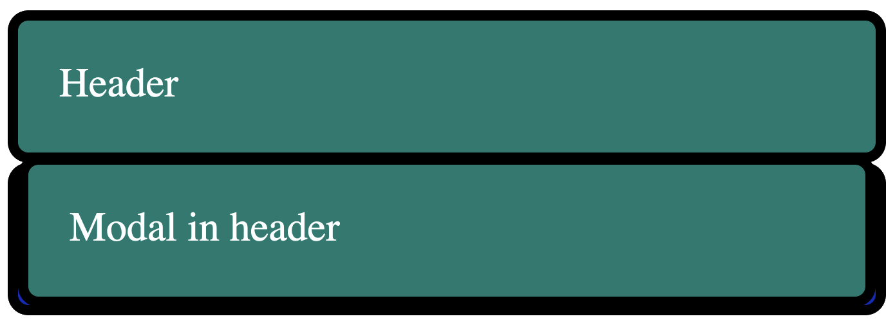

> Why is this happening?


Well, this occurs because we create a stacking context inside of `header ` when we do `position: relative; z-index: 1`. This, in turn, places the containing `id="modal"` `div` inside of the stacking context of `header`.

As a result, `id="modal"`'s `z-index` does not apply outside of the stacking context, and the group of elements under `header` is treated as `z-index: 1` from the perspective of the `footer`.

Here's a diagram showing what I mean:

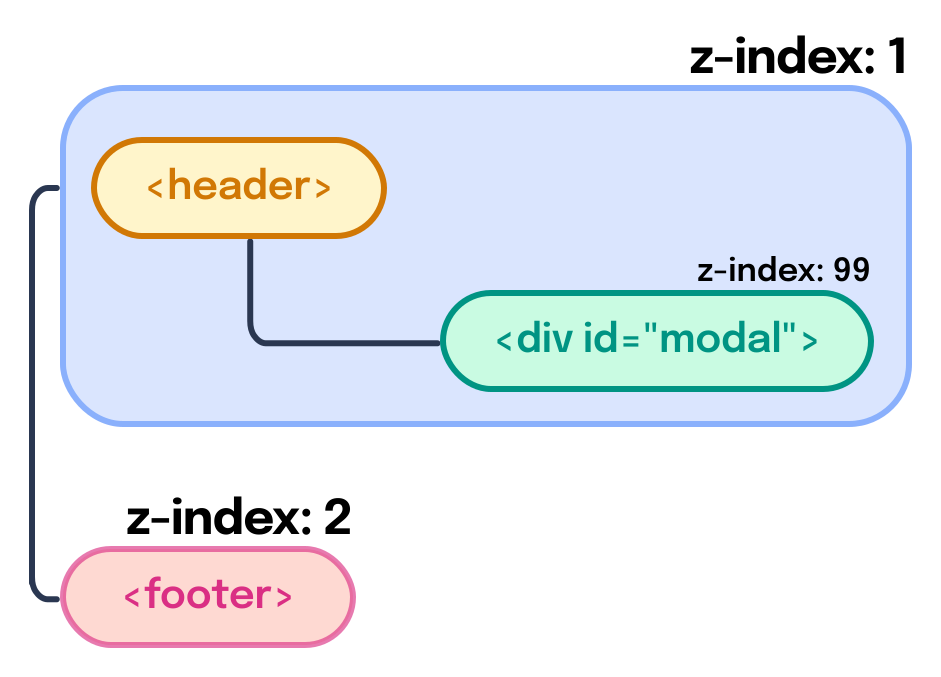

You'll see that both `<header>` and `<div id="modal">` are both contained within a box that's labeled `z-index: 1`. This is because they're both contained within the `header`'s stacking context.

Even though `id="modal"` has a `z-index` of `99`, it's only applicable within the `header` stacking context, which means that it can never be placed above the `footer` element, which has a higher `z-index` of the `header` stacking context.


# Stacking Stacking Contexts

Let's take the previous example to an extreme of sorts.

Let's say that we wanted our modal to have its own header that allowed you to scroll through the contents of the modal while the header stayed at the top.

```html
<header
  class="container-box"
  style="position: relative; z-index: 1; background: #007a70"
>
  Header
  <div
    id="modal"
    class="container-box"
    style="
      position: absolute;
      z-index: 99;
      background: #007a70;
      width: 100%;
      box-sizing: border-box;
      top: 50%;
      left: 0;
      overflow: auto;
      height: 10rem;
      padding: 0;
    "
  >
    <div
      style="
        background: #B92015;
        position: sticky;
        z-index: 10;
        top: 0;
        left: 0;
        width: 100%;
        padding: 1rem;
        box-sizing: border-box;
      "
      id="modal-title"
    >
      Modal Title
    </div>
    <div style="padding: 1rem; height: 10rem" id="modal-body">Modal in header</div>
  </div>
</header>
<footer
  class="container-box"
  style="position: relative; z-index: 2; background: #0f2cbd"
>
  Footer
</footer>
```


At first, it might look a bit odd since the footer is on top of the modal (for the reasons we outlined before).

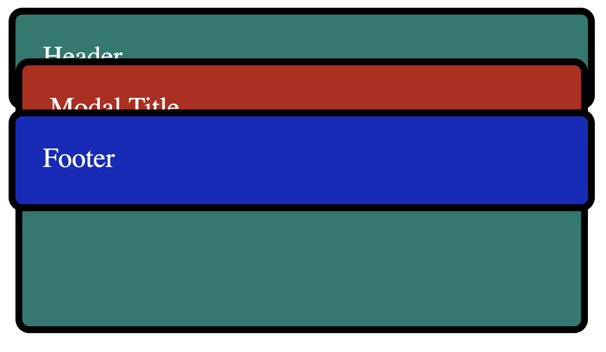

However, if we remove the footer temporarily, we can see a modal rendering on top of the header as expected:

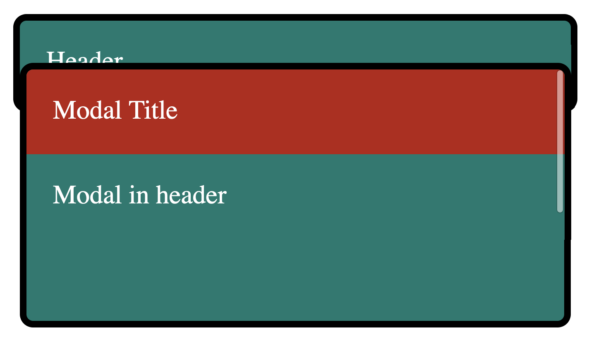


You might be wondering:

> Why isn't the modal header above the footer? After all, a `z-index` of `10` should beat a `z-index` of 2.

This is again because of stacking contexts being created. In this case, not only does `header` create a stacking context, but `id="modal"` does as well! Because `modal-header` is inside of the `modal` stacking context, and `modal` is inside the `header` stacking context, it's still below the `footer`.

We can see what these stacking contexts look like here:

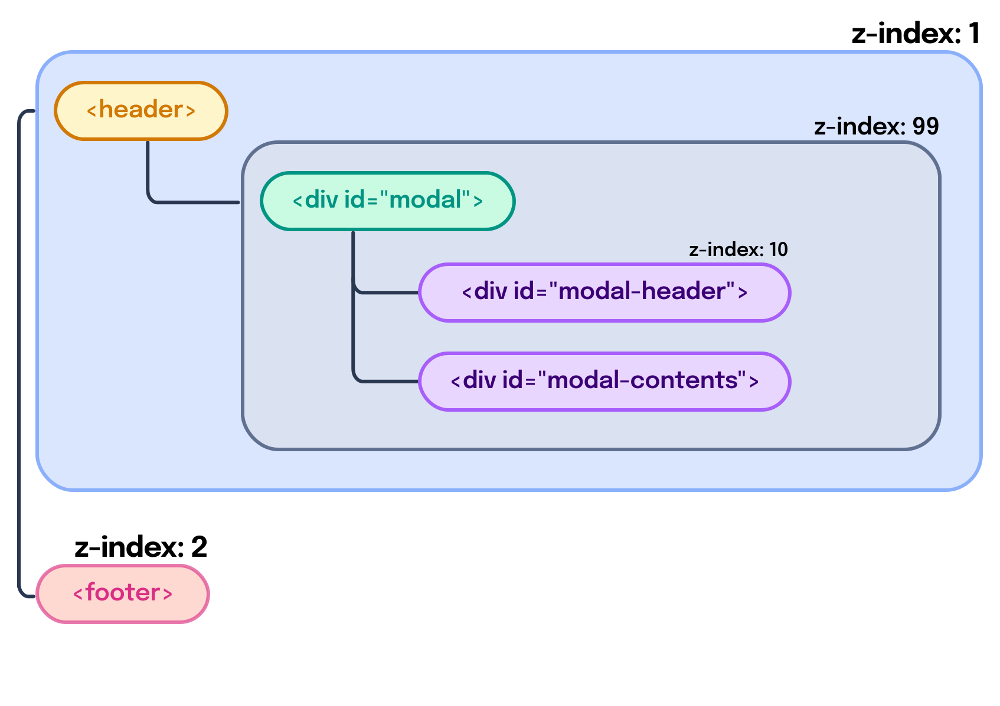

That's right; You can contain stacking contexts within other stacking contexts. 🤯


# The Problem with Stacking Contexts

> So what's the problem here? If you control the HTML, you can simply move the `modal` out of the `header` and place it after `footer`. That'll make it overlap the footer and everything before, so long as it doesn't have a higher `z-index`, right?

Well, that's true...

> AHA!

... with a major caveat.

In modern web development, it can be easier said than done to control exactly where HTML elements render.

In particular, if you use a framework such as React, Angular, or Vue, your components might look something like this:

```jsx
<Header/>
<Footer/>
```

Where `Header` is a component with the following:

<!-- ::start:tabs -->

## React

```jsx
const Header = () => {
  const [isDialogOpen, setDialogOpen] = useState(false);
  return <>
    <button onClick={() => setDialogOpen(true)}>Open dialog</button>
    {isDialogOpen && <Dialog/>}
  </>
}
```

## Angular

```typescript
@Component({
	selector: 'Header',
	standalone: true,
	template: `
		<button (click)="openDialog()">Open dialog</button>
		<Dialog *ngIf="isDialogOpen"></Dialog>
	`
})
class HeaderComponent {
	isDialogOpen = false;
	
	openDialog() {
	   this.isDialogOpen = true;
	}
}
```

## Vue

```vue
<!-- Header.vue -->
<template>
	<button @click="openDialog()">Open dialog</button>
  <Dialog v-if="isDialogOpen"></Dialog>
</template>

<script setup>
import {ref} from 'vue';
  
const isDialogOpen = ref(false);
  
function openDialog() {
  isDialogOpen.value = true;
}
</script>
```

<!-- ::end:tabs -->

In this instance, [without moving the state out of dialog](/posts/master-react-unidirectional-data-flow), how would you render the contents of `Dialog` after the `Footer` component?

The answer? JavaScript Portals.

[React has `createPortal`](https://reactjs.org/docs/portals.html), [Angular has the CDK Portal API](https://material.angular.dev/cdk/portal/overview), and [Vue has their `<Teleport>` component](https://vuejs.org/guide/built-ins/teleport.html).

Want to learn more about how React, Angular, and Vue solve this problem? [Check out my upcoming book called "The Framework Field Guide", which teaches all three frameworks at the same time; Portals included.](https://framework.guide)

> Want to learn more about the "stacking context", I'd suggest reading through the following resources:
>
> - [Stacking elements - CSS z-index and stacking context explained - NetGen](https://netgen.io/blog/stacking-elements-css-z-index-and-stacking-context-explained)
> - [The stacking context - MDN](https://developer.mozilla.org/en-US/docs/Web/CSS/CSS_Positioning/Understanding_z_index/The_stacking_context)
> - [What The Heck, z-index?? - Josh W Comeau](https://www.joshwcomeau.com/css/stacking-contexts/)
> - [What No One Told You About Z-Index - Philip Walton](https://philipwalton.com/articles/what-no-one-told-you-about-z-index/)
> - [Appendix E. Elaborate description of Stacking Contexts - W3C](https://www.w3.org/TR/CSS2/zindex.html)
