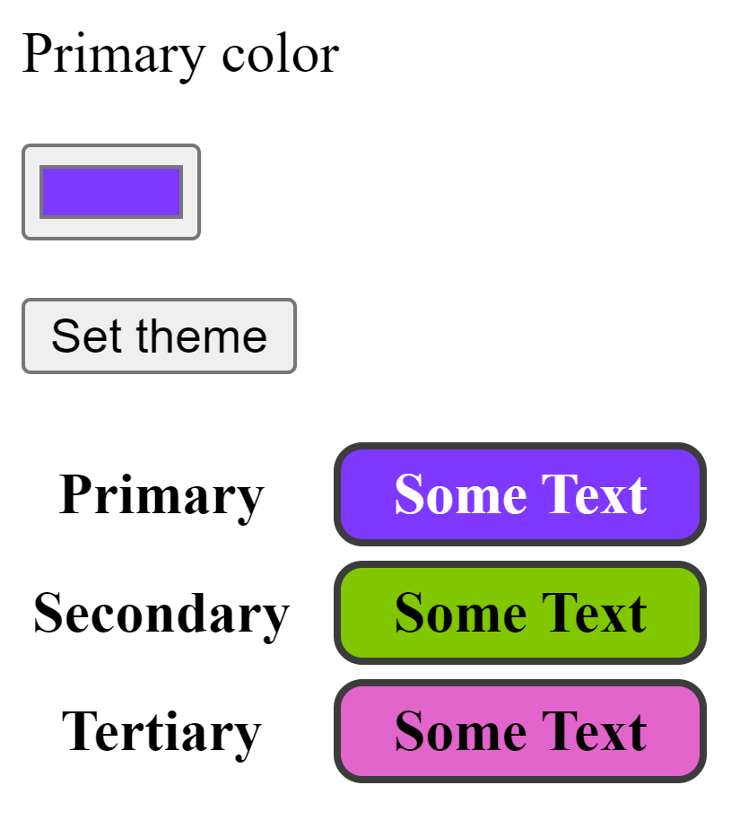

---
{
    title: "Explaining React's cache Function",
    description: "React's dipping its toes into data fetching! With this comes a big requirement to cache the results of a given function. Luckily, React's done that. Let's see how.",
    published: '2023-12-17T21:52:59.284Z',
    tags: ['react', 'webdev', 'javascript'],
    license: 'cc-by-4'
}
---

> **This article is talking about an experimental React API:**
> There may be unexpected bugs and issues with it.
>
> In addition, this API is not available in stable React, you need to use a [canary release](https://react.dev/community/versioning-policy#canary-channel) of React

React is going through a growth cycle! Between fundamental shifts like [React Server Components](/posts/what-are-react-server-components) to newer APIs like [`useDeferredValue`](https://react.dev/reference/react/useDeferredValue) and [`useTransition`](https://react.dev/reference/react/useTransition), there's never been a better time to learn a new React API.

Speaking of new React APIs, let's take a look at one that's been introduced the [React's canary channel](https://react.dev/community/versioning-policy#canary-channel) lately: `cache`.

# What is React's `cache` function?

At its core, React's `cache` function enables you to wrap a function to avoid recomputing results when passing the same arguments to them.

Take the following example:

```jsx
const alertCounter = (id) => {
	alert(id);
};

function App() {
	const [counter, setCounter] = useState(0);
	const [_, rerender] = useReducer(() => ({}), {});
	
    alertCounter(counter);

    return (
		<div>
			<button onClick={() => setCounter((v) => v + 1)}>Add to {counter}</button>
            <!-- Force a re-render to see the alert -->
			<button onClick={rerender}>Rerender</button>
            <!-- To verify that we're actually re-rendering, any input value should disappear between renders -->
			<input key={Math.floor(Math.random() * 10)} />
		</div>
	);
}
```

<iframe data-frame-title="React Broken Basic Cache Usage - StackBlitz" src="pp-code:./react-broken-basic-cache-usage?template=node&embed=1&file=src%2Fmain.jsx" sandbox="allow-modals allow-forms allow-popups allow-scripts allow-same-origin"></iframe>

Now traditional React rules would say that `alertCounter` should show an `alert` on every render, regardless of if `counter` is being changed or not. We can see this whenever we trigger a re-render manually without changing `counter`.

But what if we could leave `App` unchanged and only have `alertCounter` re-run whenever `counter` is updated in the component?

Well, with `cache`, we can;

```jsx {1,3-5,11}
import { cache, useState, useReducer } from "react"

const alertCounter = cache((id) => {
	alert(id);
});

function App() {
	const [counter, setCounter] = useState(0);
	const [_, rerender] = useReducer(() => ({}), {});
    
	alertCounter(counter);

    return (
		<div>
			<button onClick={() => setCounter((v) => v + 1)}>Add to {counter}</button>
            <!-- Force a re-render to see the alert -->
			<button onClick={rerender}>Rerender</button>
            <!-- To verify that we're actually re-rendering, any input value should disappear between renders -->
			<input key={Math.floor(Math.random() * 10)} />
		</div>
	);
}
```

Now if we force a re-render without changing `count`, it will no longer `alert`:

<iframe data-frame-title="React Basic Cache Usage - StackBlitz" src="pp-code:./react-basic-cache-usage?template=node&embed=1&file=src%2Fmain.jsx" sandbox="allow-modals allow-forms allow-popups allow-scripts allow-same-origin"></iframe>

This is because the `cache` function is [_memoizing_](https://whatthefuck.is/memoization) the usage of the function and eagerly opting out of execution as a result.

<!-- ::in-content-ad title="Consider supporting" body="Donating any amount will help towards further development of articles like this." button-text="Visit our Open Collective" button-href="https://opencollective.com/unicorn-utterances" -->

# How does `cache` differ from `useMemo` or `memo`?

The experienced React developers among us may point to two similar APIs that also memoize values in React:

1) [`memo`](https://react.dev/reference/react/memo)
2) [`useMemo`](https://react.dev/reference/react/useMemo)

The first of these comparisons isn't quite apt; `memo` is used to avoid re-renders in a component by memoizing a function component's based on its props.

But the second API, `useMemo`, is an interesting comparison. After all, we could modify the above to do something similar for us:

```jsx {9}
const alertCounter = (id) => {
	alert(id);
};

function App() {
	const [counter, setCounter] = useState(0);
	const [_, rerender] = useReducer(() => ({}), {});
	
    useMemo(() => alertCounter(counter), [counter]);

    return (
		<div>
			<button onClick={() => setCounter((v) => v + 1)}>Add to {counter}</button>
            <!-- Force a re-render to see the alert -->
			<button onClick={rerender}>Rerender</button>
            <!-- To verify that we're actually re-rendering, any input value should disappear between renders -->
			<input key={Math.floor(Math.random() * 10)} />
		</div>
	);
}
```

That said, `cache` has two primary benefits over `useMemo`:

1) You don't need to modify the component code itself to cache the function results
2) `cache` caches results between components

I personally don't find the first argument particularly compelling, so let's take a look at the second reason; **cross-component result caching**.

## Cross-component result caching

Say that you're looking to generate a theme based on the users' input:



> I didn't spend long optimizing how the theme would look for different color types. Admittedly, this doesn't look amazing, but it will suffice for the sake of a demo.

Now imagine that you want your code generation to occur only once per user color selection; after all, generating a sufficiently complex color palette can be an expensive and synchronous task at times.

Using the `cache` function, we can do something like this:

```jsx
const getTheme = cache((primaryColor) => {
	// Theoretically, this could get very expensive to compute
	// Depending on how many colors and how accurately
	const [secondaryColor, tertiaryColor] =
		generateComplimentaryColors(primaryColor);
	return {
		primaryColor,
		secondaryColor,
		tertiaryColor,
		primaryTextColor: getReadableColor(primaryColor),
		secondaryTextColor: getReadableColor(secondaryColor),
		tertiaryTextColor: getReadableColor(tertiaryColor),
	};
});
```

To then generate a theme based on the user selection:

```jsx
function App() {
	const [themeColor, setThemeColor] = useState("#7e38ff");
	const [tempColor, setTempColor] = useState(themeColor);

	return (
		<div>
            <label>
                <div>Primary color</div>
                <input
                    type="color"
                    id="body"
                    name="body"
                    value={tempColor}
                    onChange={(e) => setTempColor(e.target.value)}
                />
            </label>
            <button onClick={() => setThemeColor(tempColor)}>Set theme</button>
		</div>
	)
}
```

And finally, we can display this color palette in a table:

```jsx
<table>
    <tbody>
        <ThemePreviewRow type="primary" themeColor={themeColor} />
        <ThemePreviewRow type="secondary" themeColor={themeColor} />
        <ThemePreviewRow type="tertiary" themeColor={themeColor} />
    </tbody>
</table>
```

Where each of the `ThemePreviewRow` component instances is accessing the same `getTheme` memoized function:

```jsx {2-4}
function ThemePreviewRow({ type, themeColor }) {
	// The calculations to get the theme only occur once, even though this is
	// called in multiple component instances.
	const theme = getTheme(themeColor);

    return (
		<tr>
			<th>{capitalize(type)}</th>
			<td>
				<div
					className="colorBox"
					style={{
						backgroundColor: theme[type + "Color"],
						color: theme[type + "TextColor"],
					}}
				>
					Some Text
				</div>
			</td>
		</tr>
	);
}
```

This allows us to avoid passing down the entire theme for each `ThemePreviewRow` components, instead relying on `cache`'s memoization to allow multiple components to access the values each.

<iframe data-frame-title="React Theme Cache - StackBlitz" src="pp-code:./react-theme-cache?template=node&embed=1&file=src%2Fmain.jsx" sandbox="allow-modals allow-forms allow-popups allow-scripts allow-same-origin"></iframe>

# Other notable things about `cache`

There's a few other things about `cache` that I'd like to talk about. Notably;

1) [`cache` can be used to pre-load data for a component](#cache-preload)
2) [Errors thrown within a `cache` call are memoized](#errors-cache)
## Use `cache` to pre-load data {#cache-preload}

Because `cache`'s returned results are cached based on the user's input, we're able to eagerly access data when we know it will be needed, but before its actually needed.

IE in our `App` from before:

```jsx {5}
function App() {
	const [themeColor, setThemeColor] = useState("#7e38ff");
	const [tempColor, setTempColor] = useState(themeColor);

	getTheme(themeColor);
	
	// ...
}
```

By doing this, our objective is that our theme will have been generated by the time we get to render our first `ThemePreviewRow`.

While this advice is less/not useful for synchronous tasks, you're able to use `cache` to get async results as well, where this would be much more handy:

```jsx {1,3-5,8,20}
import { cache, use } from "react";

const getMovie = cache(async (id) => {
  return await db.movie.get(id);
}

async function MovieDetails({id}) {
  const movie = use(getMovie(id));
  return (
    <section>
      <h1>{movie.title}</h1>
      
      <ul>{movie.actors.map(actor => <li key={actor.id}>{actor.name}</li>)}</ul>
    </section>
  );
}

function MoviePage({id}) {
  // Pre-fetch data before we render the details itself
  getMovie(id);

  // ...

  return (
    <>
      <MovieDetails id={id} />
    </>
  );
}
```

This is a pattern you'll often see with asynchronous server components as well as [the new `use` Hook in React](https://react.dev/reference/react/use).

## Errors are memoized in `cache` {#errors-cache}

Returned results aren't the only thing that the `cache` function memoizes and returns to users of the API; it also caches errors thrown in the inner function:

```jsx {1-6,11}
const getIsEven = cache((number) => {
  alert("I am checking if " + number + " is even or not");
  if (number % 2 === 0) {
    throw "Number is even";
  }
});

// Even if you render this component multiple times, it will only perform the
// calculation needed to throw the error once.
function ThrowAnErrorIfEven({ number, instance }) {
  getIsEven(number);

  return <p>I am instance #{instance}</p>;
}

function App = () => {
    const [counter, setCounter] = useState(0);

    return (
        <div>
            <p>You should only see one alert when you push the button below</p>
			<button onClick={() => setCounter((v) => v + 1)}>Add to {counter}</button>
            <ErrorBoundary>
                <ThrowAnErrorIfEven number={counter} instance={1} />
            </ErrorBoundary>
            <ErrorBoundary>
                <ThrowAnErrorIfEven number={counter} instance={2} />
            </ErrorBoundary>
            <ErrorBoundary>
                <ThrowAnErrorIfEven number={counter} instance={3} />
            </ErrorBoundary>
            <ErrorBoundary>
                <ThrowAnErrorIfEven number={counter} instance={4} />
            </ErrorBoundary>
        </div>
    )
}
```

<iframe data-frame-title="React Cache Error - StackBlitz" src="pp-code:./react-cache-error?template=node&embed=1&file=src%2Fmain.jsx" sandbox="allow-modals allow-forms allow-popups allow-scripts allow-same-origin"></iframe>

# Conclusion

This has been a fun look into an upcoming API from the React core team; `cache`!

While it's early days for the function, it's clear to me why it's such an integral API for them to add; it fits in wonderfully with their vision of data fetching and augmentation, especially in regards to async and server fetching.

Speaking of, next time let's take a look at how React is adding data fetching to React's core APIs.

Until next time!

\- Corbin
