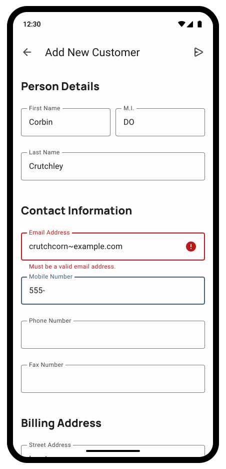
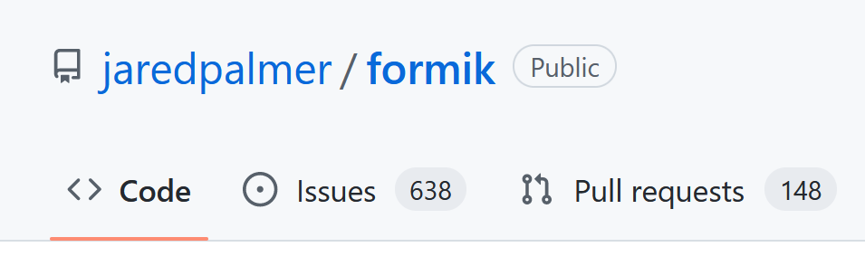
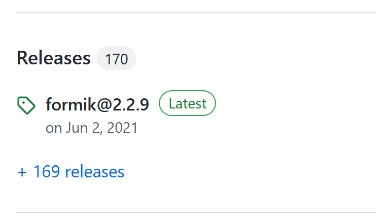
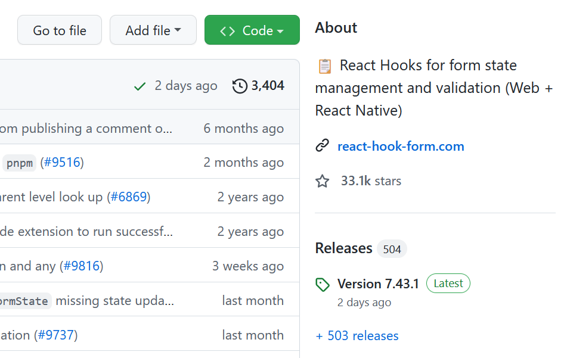
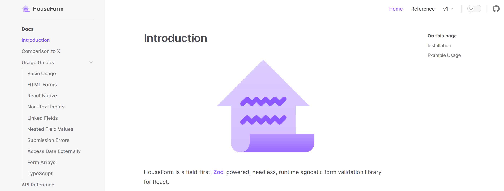

---
{
	title: "Formik Works Great; Here's Why I Wrote My Own",
	description: "Formik works incredibly, but I have some concerns with it. As a result, I ended up writing my own library called \"HouseForm\" to compete. Here's why.",
	published: "2023-02-18T04:45:30.247Z",
	tags: ["react", "opinion"],
	license: "cc-by-nc-sa-4",
    originalLink: "https://dev.to/crutchcorn/formik-works-great-heres-why-i-wrote-my-own-591m"
}
---

> **This article is very old!:**
> HouseForm has been replaced with TanStack Form! To learn more, visit the link below.
>
> 🌐 [**TanStack homepage**](https://tanstack.com/)

---

> TL;DR? I made a library to compete with Formik and React Hook Form called ["HouseForm"](https://github.com/crutchcorn/houseform). It would mean a lot if you looked at it, [gave feedback on it](https://github.com/crutchcorn/houseform/issues), and maybe [gave it a star on GitHub](https://github.com/crutchcorn/houseform).

If you've looked into form validation with React, [you'll likely have heard of Formik](https://github.com/jaredpalmer/formik). My first run-in with Formik was at a large company I worked; it was already established as the go-to form library for our projects, and I immediately fell in love with it.

My time at this company was in 2019, [right before Formik surpassed one million weekly downloads](https://npmtrends.com/formik). Thanks to my experience using Formik at this company, I was left with a strong recommendation in favor of the tool for all future React forms usage.

Fast forward to today. I'm leading a front-end team in charge of many React and React Native applications. One such application we inherited was very heavily form-focused. Formik is still the wildly popular, broadly adopted intuitive forms API I used all those years ago.

So, if we loved Formik, why did we not only remove it from our projects but replace it with [a form library of our own](https://github.com/crutchcorn/houseform)?

I think this question is answered by taking a look at the whole story:

- Why is Formik great?
- Why don't we want to use Formik?
- What can be improved about Formik?
- What alternatives are there?
- Why did we make our own form library?
- How does our own form library differ?
- How did we write it?
- What's next?

# Why is Formik great?

Let's take a step back from Formik for a second. I started web development [in 2016 with the advent of Angular 2](https://en.wikipedia.org/wiki/Angular_(web_framework)#Version_2). While it has its ups and downs, one of its strengths is in [its built-in abilities to do form validation](https://angular.io/guide/form-validation) - made only stronger when [recent versions of Angular (namely, 14) introduced fully typed forms](https://angular.io/guide/typed-forms).

React doesn't have this capability baked in, so during my early explorations into the framework I was dearly missing the ability to do validated forms for more complex operations.

While an Angular form might look something like this:

```typescript
@Component({
  selector: 'my-app',
  standalone: true,
  imports: [CommonModule, FormsModule, ReactiveFormsModule],
  template: `
  <form [formGroup]="form" (ngSubmit)="onSubmit()" > 
    <label>
      <div>Name</div>
      <input type="text" required minlength="4" formControlName="name">
    </label>
    <button>Submit</button>

    <div *ngIf="form.controls.name.invalid && (form.controls.name.dirty || form.controls.name.touched)">
      <div *ngIf="form.controls.name.errors?.['required']">
        Name is required.
      </div>
      <div *ngIf="form.controls.name.errors?.['minlength']">
        Name must be at least 4 characters long.
      </div>
    </div>
  </form>
  `,
})
export class App {
  form = new FormGroup({
    name: new FormControl('', [Validators.required, Validators.minLength(4)]),
  });

  onSubmit() {
    if (!this.form.valid) return;
    alert(JSON.stringify(this.form.value));
  }
}
```

The React version (without any libraries) might look something like this:

```jsx
function runValidationRulesGetErrors(rules, val) {
  return rules.map((fn) => fn(val)).filter(Boolean);
}

export default function App() {
  const [form, setForm] = useState({
    name: { value: '', isTouched: false, isDirty: false },
  });

  const validationRules = {
    name: [
      (val) => (!!val ? null : 'Name is required.'),
      (val) =>
        !!val && val.length >= 4
          ? null
          : 'Name must be at least 4 characters long.',
    ],
  };

  const [errors, setErrors] = useState({ name: [] });

  const runValidation = (name, val) => {
    const errors = runValidationRulesGetErrors(validationRules[name], val);
    setErrors((v) => {
      return {
        ...v,
        [name]: errors,
      };
    });
  };

  const onFieldChange = (name, val) => {
    setForm((v) => {
      return {
        ...v,
        [name]: {
          ...v[name],
          isDirty: true,
          value: val,
        },
      };
    });

    runValidation(name, val);
  };

  const onFieldBlur = (name) => {
    setForm((v) => {
      return {
        ...v,
        [name]: {
          ...v[name],
          isTouched: true,
        },
      };
    });

    runValidation(name, form[name].value);
  };

  const onSubmit = (e) => {
    e.preventDefault();
    alert(JSON.stringify(form));
  };

  return (
    <form onSubmit={onSubmit}>
      <label>
        <div>Name</div>
        <input
          value={form.name.value}
          onChange={(e) => onFieldChange('name', e.target.value)}
          onBlur={() => onFieldBlur('name')}
          type="text"
        />
      </label>
      <button>Submit</button>

      {errors.name.length !== 0 && (form.name.isDirty || form.name.isTouched) && (
        <div>
          {errors.name.map((error) => (
            <div key={error}>{error}</div>
          ))}
        </div>
      )}
    </form>
  );
}
```

That's a difference of ~50 LOC for the Angular version vs. 90 LOC for the React version.

Clearly something needed changing in the React ecosystem.

## How Formik saved the day

Here's the previous React code sample, but this time using Formik:

```jsx
import { Formik, Form, Field } from 'formik';
import * as Yup from 'yup';

const schema = Yup.object().shape({
  name: Yup.string()
    .min(4, 'Name must be at least 4 characters long.')
    .required('Name is required.'),
});

export default function App() {
  return (
    <Formik
      initialValues={{
        name: '',
      }}
      validationSchema={schema}
      onSubmit={(values) => {
        alert(JSON.stringify(values));
      }}
    >
      {({ errors, touched, dirty }) => (
        <Form>
          <label>
            <div>Name</div>
            <Field name="name" />
          </label>
          <button>Submit</button>

          {errors.name && (touched.name || dirty) && <div>{errors.name}</div>}
        </Form>
      )}
    </Formik>
  );
}
```

'Nough said?

Not only is this example shorter than even the Angular example, but it's significantly easier to follow the flow of what's happening and when. On top of this, we're able to use existing validation logic from [the exceedingly popular Yup library](https://github.com/jquense/yup) to make sure our form follows a consistent schema.

Is it any wonder I fell in love with Formik the first time I used it?

# Why don't we want to use Formik?

We've talked a lot about my past with Formik in this article; Fast forward to today. Nowadays, I'm leading a small frontend team in charge of a plethora of applications. One such application we inherited is very heavily form-focused:



> This is not a real screenshot from the app, but is a mockup used to reflect how heavily form-heavy it is. We have multiple pages like this in our app; all of which with more fields than are displayed here.

While this kind of application may seem simple at first glance, there's a lot of moving parts to it. Ignoring the other functionality within the app, this type of form page might contain:

- On blur field formatting
- Per-field validation type (Some fields validate on field blur, some validate on value change)
- Detection of if a field is touched or dirty
- Internationalized error messages

As a result, our hand-written field validation code was quickly getting out-of-hand. Because of the difficulty in maintaining that much complexity by hand, bugs, regressions, and otherwise unexpected behavior started occurring. What's worse; One form page would differ wildly in implementation from another, leading to inconsistent user experience.

While this was okay for a short while; while we were under crunch time and this project was not a high priority - it quickly became a thorn in the side.

As such, I asked one of the engineers on my team to look into React form libraries; pointing them towards Formik as a reference of what I knew existed in the ecosystem.

After a day or two of research that engineer came back: They liked Formik but had some concerns over its maintenance.

See, when they went to [the Formik GitHub repository](https://github.com/jaredpalmer/formik), they noticed the high number of issues and pull requests.



When they then realized that its last release date was in 2021 - nearly 2 years ago - they wanted to look into it more:



After looking into it more, there were no fewer than [three](https://github.com/jaredpalmer/formik/issues/3601) [separate](https://github.com/jaredpalmer/formik/issues/3613) [issues](https://github.com/jaredpalmer/formik/issues/3663) asking if the project was still under maintenance.


"No problem," we thought, "surely there must be a community fork of the project."

After some time looking into it, we found a single option: An individual contributor [by the name of `johnrom` hacking away at a version 3](https://github.com/jaredpalmer/formik/pull/3231).

It's sincerely impressive! While the main v3 PR we linked has 97 commits, [John also started working on documentation for this potential v3 release with an additional 76 commits](https://github.com/johnrom/formik/pull/11).

Unfortunately, he's made it clear that [he's not a maintainer of Formik](https://github.com/jaredpalmer/formik/pull/3231#issuecomment-1020379986) and admits:

>[...] whether my changes are ever merged into Formik itself isn't up to me [...]
>
> \- [John Rom on May 3, 2021](https://github.com/jaredpalmer/formik/issues/3099#issuecomment-831319020)

It was clear to use that it was time to find an alternative to Formik.

----

> I want to be very explicit here; neither Jared nor John owe us anything. Their contributions to the ecosystem are not assured, nor should they be.
>
> Almost all open-source maintainers are unpaid for their work, and it's an immense responsibility to bear the load. You constantly have to keep up with the outside ecosystem changes, manage others' contributions, answer questions, and more. It's exceedingly easy to burn out from a project with such immense loads and little personal return.
>
> I'm very grateful for their work on Formik and admire their engineering capabilities and even their abilities to maintain and upkeep Formik while they did. Their work on Formik should be celebrated, not chastised - even while dormant.

----

# What alternatives are there?

After looking through GitHub issues, forums, and chats, there appears to be two primary alternatives to Formik available today:

- [React Final Form](https://final-form.org/react) 
- [React Hook Form](https://react-hook-form.com/)

While React Final Form initially looked promising - [it's only seen 5 commits to the `main` branch since 2021](https://github.com/final-form/react-final-form/commits/main), and has [over 300 issues](https://github.com/final-form/react-final-form/issues).

Let's check on [the React Hook Form GitHub](https://github.com/react-hook-form/react-hook-form) and see if things are more lively:



WOW! Now **that's** an actively maintained repository!

Looking further into React Hook Form, we found ourselves enjoying the basic examples:

```jsx
import { useForm } from "react-hook-form";

export default function App() {
  const { register, handleSubmit, watch, formState: { errors } } = useForm();
  const onSubmit = data => console.log(data);

  console.log(watch("example")); // watch input value by passing the name of it

  return (
    /* "handleSubmit" will validate your inputs before invoking "onSubmit" */
    <form onSubmit={handleSubmit(onSubmit)}>
      {/* register your input into the hook by invoking the "register" function */}
      <input defaultValue="test" {...register("example")} />
      
      {/* include validation with required or other standard HTML validation rules */}
      <input {...register("exampleRequired", { required: true })} />
      {/* errors will return when field validation fails  */}
      {errors.exampleRequired && <span>This field is required</span>}
      
      <input type="submit" />
    </form>
  );
}
```

In particular, we really liked the ability to do [per-field validation right inline with the input itself](https://react-hook-form.com/get-started#Applyvalidation):

```jsx
import { useForm } from "react-hook-form";

export default function App() {
  const { register, handleSubmit } = useForm();
  const onSubmit = data => console.log(data);
   
  return (
    <form onSubmit={handleSubmit(onSubmit)}>
      <input {...register("firstName", { required: true, maxLength: 20 })} />
      <input {...register("lastName", { pattern: /^[A-Za-z]+$/i })} />
      <input type="number" {...register("age", { min: 18, max: 99 })} />
      <input type="submit" />
    </form>
  );
}
```

This allows us to keep our UI and our validation logic collocated in the same part of the code without having to cross-reference multiple locations of code to see how a field looks and acts. 

Unfortunately, as we read deeper into this functionality, we found that it doesn't support `Yup` or `Zod` validation. To use either of these tools to validate your fields, you must use a schema object validator to validate the whole form:

```jsx
import { useForm } from "react-hook-form";
import { yupResolver } from '@hookform/resolvers/yup';
import * as yup from "yup";

const schema = yup.object({
  firstName: yup.string().required(),
  age: yup.number().positive().integer().required(),
}).required();

export default function App() {
  const { register, handleSubmit, formState:{ errors } } = useForm({
    resolver: yupResolver(schema)
  });
  const onSubmit = data => console.log(data);

  return (
    <form onSubmit={handleSubmit(onSubmit)}>
      <input {...register("firstName")} />
      <p>{errors.firstName?.message}</p>
        
      <input {...register("age")} />
      <p>{errors.age?.message}</p>
      
      <input type="submit" />
    </form>
  );
}
```

What's more; we noticed that most of the form examples used HTML and a `register` function. We were curious how this worked, so we did a bit of a deeper dive into their docs page and found that React Hook Form is, by default, [uncontrolled and leaves the state persistence up to the DOM](https://react-hook-form.com/get-started#Designandphilosophy).

While this works okay for web applications, React Native doesn't _really_ support this functionality.

To sidestep this problem, RHF introduces a [`Controller` API that allows you to treat your `Field`s as render functions](https://react-hook-form.com/get-started#IntegratingControlledInputs):

```jsx
import { useForm, Controller } from "react-hook-form";
import { TextField, Checkbox } from "@material-ui/core";

function App() {
  const { handleSubmit, control, reset } = useForm({
    defaultValues: {
      checkbox: false,
    }
  });
  const onSubmit = data => console.log(data);

  return (
    <form onSubmit={handleSubmit(onSubmit)}>
      <Controller
        name="checkbox"
        control={control}
        rules={{ required: true }}
        render={({ field }) => <Checkbox {...field} />}
      />
      <input type="submit" />
    </form>
  );
}
```

This works out well and enables you to even use custom field components, but introduces a new set of headaches; There's now multiple ways of building out a field in React Hook Form.

You have to establish social rules within your team about which ways to do things, and potentially introduce abstractions to enforce these rules.

**Surely, we can make some improvements overall.**

# What can be improved about Formik?

Let's take a more focused look at what a large form component with 15 input fields might look like when using Formik. We'll take a look at what one field being rendered might look like:

```jsx
import { Formik, Form, Field } from 'formik';
import * as Yup from 'yup';

const schema = Yup.object().shape({
    firstName: Yup.string()
    .required('First name is required.'),
    middleInitials: Yup.string(),
    lastName: Yup.string()
    .required('First name is required.'),
    email: Yup.string().email('Invalid email address').required('Email is required.'),
    // Imagine there are 15 more fields here
});

export default function App() {
  return (
    <Formik
      initialValues={{
        name: '',
      }}
      validationSchema={schema}
      onSubmit={(values) => {
        alert(JSON.stringify(values));
      }}
    >
      {({ errors, touched, dirty }) => (
        <Form>
          {/* Imagine there are 15 more fields here */}
          <Field name="firstName">
            {({
              field,
              meta,
            }) => (
              <div>
                <label>
                    <div>First Name</div>
                    <input type="text" placeholder="Email" {...field} />
                </label>
                {meta.touched && meta.error && (
                  <div className="error">{meta.error}</div>
                )}
              </div>
            )}
          </Field>
        </Form>
      )}
    </Formik>
  );
}
```

Here's the challenge though; your `schema` variable is defined at the top of the component file while your `Field`'s `input` is towards the bottom of the file; meaning that you have as many lines of code in your component separating out your field's validation logic from the UI rendering behavior. That's two places to look for one concern.

And, if that's ~15 lines of code per field, that's at least 225 lines of code to sift through between the validation logic and the UI rendering, ignoring any additional logic, styling, or layout code.

What's more, Formik appears to have many ways to define a Field and Form. There's:

- [The core `Formik` component](https://formik.org/docs/api/formik)
  - [`Formik children={}`](https://formik.org/docs/api/formik#children-reactreactnode--props-formikpropsvalues--reactnode)
  - [`Formik component={}`](https://formik.org/docs/api/formik#component-reactcomponenttypeformikpropsvalues)
- [The `Form` helper wrapper around HTML's `form` element](https://formik.org/docs/api/form)
- [The `Field` component](https://formik.org/docs/api/field)
  - [`Field children={}`](https://formik.org/docs/api/field#children)
  - [`Field component={}`](https://formik.org/docs/api/field#component)
  - [`Field as`](https://formik.org/docs/api/field#as)
- [`<FastField>`](https://formik.org/docs/api/fastfield)
- [`useField`](https://formik.org/docs/api/useField)
- [`<ErrorMessage>`](https://formik.org/docs/api/errormessage)

Some of these handle rendering the UI for you, some don't - meaning some work with React Native while others don't - and some of these components have multiple ways of doing the same thing.

This ability to do the same thing in multiple ways is a problem because it:

- Introduces required training of what method to use and when internally.
- Bloats the bundle size by requiring more code to be shipped.
- Increases maintenance costs of the library.

## How can React Hook Form be improved?

As we mentioned in the React Hook Form section, we really liked the ability to do per-field validation using [the `Controller`'s `rules` field](https://react-hook-form.com/api/usecontroller/controller). However, the lack of ability to use custom validation logic - either through Zod/Yup usage or with custom functions - make this a non-starter for our use-cases.

Because of this, we run into the same issues we did with Formik's shortcomings; they don't allow you to do custom validation on the `Field` (or `Controller`) components themselves.

So, we know the shortcomings of RHF and Formik... What do we do now?

# Why did we make our own form library?

Alright, you've read the title; [I wrote an alternative library to Formik and React Hook Form called "HouseForm"](https://github.com/crutchcorn/houseform).

[](https://houseform.dev)

> Why?

Well, I took a look at our business' needs, saw that Formik was a better choice for us than React Hook Form, but acknowledged that the maintenance of the library was a blocker for us moving forward with it.

While I'm comfortable with open-source maintenance - I maintain NPM packages that account for 7 million downloads a month - I wanted to see what the level of effort was in creating a library akin to Formik that solved our non-maintenance complaints with the tool.

After a week's worth of work, we found ourselves with a tool that we enjoyed using and solved our production needs.

# How does HouseForm differ?

If you looked closely at the previous image of the HouseForm website, you'll see our single-sentence explanation of what makes HouseForm unique:

> HouseForm is a field-first, [Zod](https://github.com/colinhacks/zod)-powered, headless, runtime agnostic form validation library for React.

Let's walk through what that means and what a basic usage of HouseForm looks like.

First, **HouseForm is "field-first"**. You can see this when we demonstrate an example HouseForm form:

```tsx
import { Field, Form } from "houseform";
import { z } from "zod";

export default function App() {
  return (
    <Form
      onSubmit={(values) => {
        alert("Form was submitted with: " + JSON.stringify(values));
      }}
    >
      {({ isValid, submit }) => (
        <>
          <Field
            name="email"
            onChangeValidate={z.string().email("This must be an email")}
          >
            {({ value, setValue, onBlur, errors }) => {
              return (
                <div>
                  <input
                    value={value}
                    onBlur={onBlur}
                    onChange={(e) => setValue(e.target.value)}
                    placeholder={"Email"}
                  />
                  {errors.map((error) => (
                    <p key={error}>{error}</p>
                  ))}
                </div>
              );
            }}
          </Field>
          <button onClick={submit}>Submit</button>
        </>
      )}
    </Form>
  );
}
```

Here, we're using `<Field onChangeValidate={}/>` to validate the field's value when the user has changed their input. This is a stark difference from Formik's single-object validation schema, because it places the validation logic right inline with the UI rendering.

Second: **HouseForm is Zod-powered**. Unlike Formik, which uses [Yup](https://github.com/jquense/yup) to do validation, or RHF which requires an external dependency to use Zod; HouseForm relies more heavily on [Zod](https://github.com/colinhacks/zod) to do its validation. Zod is well-loved by many React developers and seemed like a good choice for validation needs.

Third: **HouseForm is headless and runtime agnostic**. This means that it runs just as well in React Native, Next.js, or even [Ink](https://github.com/vadimdemedes/ink) as it does React for the web. No differing APIs; just use the same components for each of these.

Fourth: **HouseForm is flexible**. Let's take the previous code sample and add validation to the email field that should run during the form submission.

```tsx
// ...

<Field
    name="email"
    onChangeValidate={z.string().email("This must be an email")}
    onSubmitValidate={isEmailUnique}
>
    {({ value, setValue, onBlur, errors }) => {
        // ...
    }}
</Field>

// ...

// This is simulating a check against a database
function isEmailUnique(val: string) {
  return new Promise<boolean>((resolve, reject) => {
    setTimeout(() => {
      const isUnique = !val.startsWith("crutchcorn");
      if (isUnique) {
        resolve(true);
      } else {
        reject("That email is already taken");
      }
    }, 20);
  });
}
```

Notice that, outside of the `isEmailUnique` logic, the only thing we had to do to add submission validation was add a `onSubmitValidate` property on the `Field` component.

With HouseForm, we can even extend this per-field validation logic by adding a `onBlurValidate` function:

```jsx
<Field
    name="email"
    onChangeValidate={z.string().email("This must be an email")}
    onSubmitValidate={isEmailUnique}
    onBlurValidate={z.string().min(1, "Your email must have at least one character")}
>
    {({ value, setValue, onBlur, errors }) => {
        // ...
    }}
</Field>
```

The rules passed to each `onXValidate` property can differ from one another, even within the same field. This is a super powerful API that allows you to decide:

- What fields you want validated or not
- How you want to validate each field
- At which user interaction you want to validate
-  Which rules you want to validate on a per-interaction basis

Neither RHF or Formik has this capability and flexibility today.

# What's next for HouseForm?

HouseForm has a lot going for it today:

- An API with tons of flexibility and capabilities.
- Runtime agnosticism, [enabling it to run flawlessly in React Native](https://houseform.dev/guides/react-native.html).
- Extensive and usage-based tests with 97% test coverage, [like this form test](https://github.com/crutchcorn/houseform/issues?q=is%3Aopen+is%3Aissue+label%3A%22good+first+issue%22).
- [A docs website with plenty of examples and how-to guides.](https://houseform.dev)
- [A community-created introduction video.](https://www.youtube.com/watch?v=bQVUGx8rSuQ)
- [Benchmarks against other popular form libraries.](https://github.com/crutchcorn/houseform/tree/main/lib/benchmarks)
- [Good first issues to encourage new contributions.](https://github.com/crutchcorn/houseform/issues?q=is%3Aopen+is%3Aissue+label%3A%22good+first+issue%22)

Even with all of these goodies, HouseForm isn't perfect and it never will be; No project is ever fully finished in the programming world.

Looking forward, we plan on:

- [Improving the existing `FieldArray` helper by adding utility properties](https://github.com/crutchcorn/houseform/issues/7).
- Increasing visibility into performance by creating more benchmarks against other popular libraries.
- Moving the needle further on performance; making sure it falls in-line with other libraries in the same space.

- Gathering more community feedback on how to improve. (Have ideas? [Open an issue!](https://github.com/crutchcorn/houseform/issues/new/choose))

But we need your help! If any of this sounds interesting to you, please help us by:

- [Opening GitHub issues with feature, docs, and bug requests.](https://github.com/crutchcorn/houseform/issues/new/choose)
- [Contributing to the project with pull requests.](https://github.com/crutchcorn/houseform/blob/main/CONTRIBUTING.md)
- [Starring the project on GitHub](https://github.com/crutchcorn/houseform).

That's all for now. In the next article I write, I'll be talking about how I built HouseForm using Vite and how you can build your own React library using a similar setup (it's pretty rad).

Happy form building!