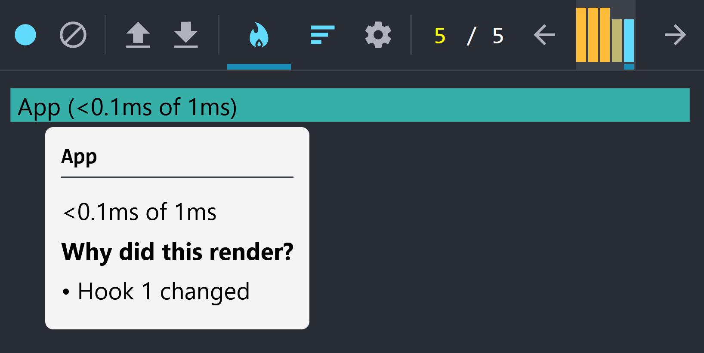
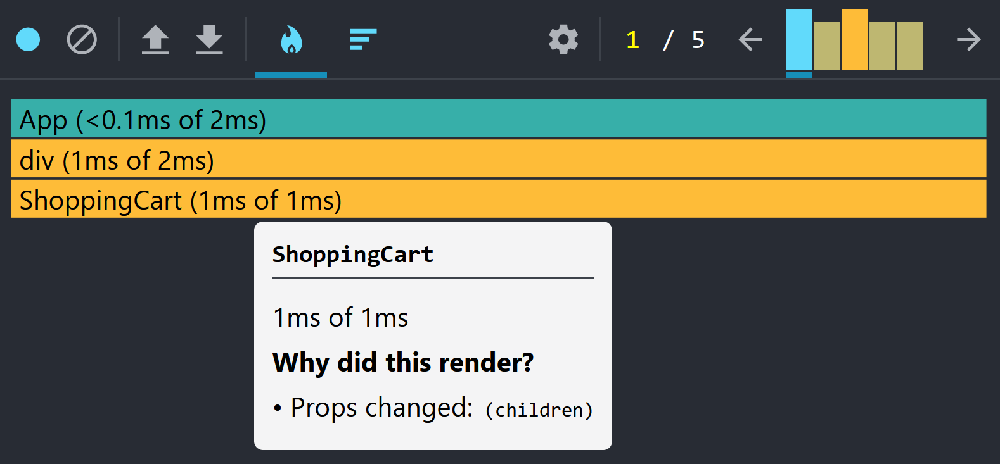

---
{
    title: "Functions Are Killing Your React App's Performance",
    description: "If you've ever built a production React application, you've likely ran into various performance problems along the way. Here are the most common and how to fix them.",
    published: '2023-03-01T21:52:59.284Z',
    tags: ['react'],
    license: 'cc-by-4'
}
---

Functions are an integral part of all JavaScript applications, React apps included. [While I've written about how peculiar their usage can be, thanks to the fact that all functions are values](/posts/javascript-functions-are-values), they help split up the monotony of your codebase by splitting similar code into logical segments.

This knowledge that functions are values can assist you when working on improving your React apps' performance.

Let's look at some of the ways that functions often slow down React applications, why they do so, and how to combat them in our own apps.

In this adventure, we'll see how to:

- [Memoize return values with `useMemo`](#use-memo)
- [Prevent re-renders due to function instability](#function-instability)
- [Remove costly render functions with component extraction](#render-functions)
- [Handle children functions performantly](#children-functions)

# Memoizing return values with `useMemo` {#use-memo}

Let's say that we're building an ecommerce application and want to calculate the sum of all items in the cart:

```jsx
const ShoppingCart = ({items}) => {
    const getCost = () => {
        return items.reduce((total, item) => {
            return total + item.price;
        }, 0);
    }

    return (
        <div>
            <h1>Shopping Cart</h1>
            <ul>
                {items.map(item => <li>{item.name}</li>)}
            </ul>
            <p>Total: ${getCost()}</p>
        </div>
    )
}
```

This should show all items and the total cost, but this may cause headaches when `ShoppingCart` re-renders.

After all, a React functional component is a normal function, after all, and will be run like any other, where `getCost` is recalculated on subsequent renders when you don't memoize the value.

This `getCost` function may not be overly expensive when there are only one or two items in the cart, but this can easily become a costly computation when there are 50 items or more in the cart.

The fix? Memoize the function call using `useMemo` so that it only re-runs when the `items` array changes:

```jsx
const ShoppingCart = ({items}) => {
    const totalCost = useMemo(() => {
        return items.reduce((total, item) => {
            return total + item.price;
        }, 0);
    }, [items]);

    return (
        <div>
            <h1>Shopping Cart</h1>
            <ul>
                {items.map(item => <li>{item.name}</li>)}
            </ul>
            <p>Total: ${totalCost}</p>
        </div>
    )
}
```

 # Function instability causes re-renders {#function-instability}

Let's expand this shopping cart example by adding in the ability to add new items to the shopping cart.

```jsx
import {useState, useMemo} from 'react';
import {v4 as uuid} from 'uuid';

const ShoppingItem = ({item, addToCart}) => {
  return (
    <div>
      <div>{item.name}</div>
      <div>{item.price}</div>
      <button onClick={() => addToCart(item)}>Add to cart</button>
    </div>
  )
}

const items = [
  { id: 1, name: 'Milk', price: 2.5 },
  { id: 2, name: 'Bread', price: 3.5 },
  { id: 3, name: 'Eggs', price: 4.5 },
  { id: 4, name: 'Cheese', price: 5.5 },
  { id: 5, name: 'Butter', price: 6.5 }
]

export default function App() {
  const [cart, setCart] = useState([])

  const addToCart = (item) => {
    setCart(v => [...v, {...item, id: uuid()}])
  }

  const totalCost = useMemo(() => {
    return cart.reduce((acc, item) => acc + item.price, 0)
  }, [cart]);

  return (
    <div style={{display: 'flex', flexDirection: 'row', flexWrap: 'nowrap'}}>
      <div style={{padding: '1rem'}}>
        <h1>Shopping Cart</h1>
        {items.map((item) => (
          <ShoppingItem key={item.id} item={item} addToCart={addToCart} />
        ))}
      </div>
      <div style={{padding: '1rem'}}>
        <h2>Cart</h2>
        <div>
          Total: ${totalCost}
        </div>
        <div>
          {cart.map((item) => (
            <div key={item.id}>{item.name}</div>
          ))}
        </div>
      </div>
    </div>
  )
}
```

If I now click any of the items' `Add to cart` buttons, it will:

1) Trigger the `addToCart` function
2) Update the `cart` array using `setCart`
   1) Generating [a new UUIDv4](/posts/what-are-uuids) for the item in the cart
3) Cause the `App` component to re-render
4) Update the displayed items in the cart
5) Re-run the `totalCost` `useMemo` calculation

This is exactly what we'd expect to see in this application. However, if we open [the React Developer Tools](https://beta.reactjs.org/learn/react-developer-tools) and inspect [our Flame Chart](https://reactjs.org/blog/2018/09/10/introducing-the-react-profiler.html#flame-chart), we'll see that all `ShoppingItem` components are re-rendering, despite none of the passed `item`s changing.


The reason these components are re-rendering is that our `addToCart` property is changing.

> That's not right! We're always passing the same `addToCart` function on each render!

While this may seem true at a cursory glance, we can check this with some additional logic:

```jsx
// This is not good production code, but is used to demonstrate a function's reference changing
export default function App() {
  const [cart, setCart] = useState([])

  const addToCart = (item) => {
    setCart(v => [...v, {...item, id: uuid()}])
  }

  useLayoutEffect(() => {
    if (window.addToCart) {
      console.log("addToCart is the same as the last render?", window.addToCart === addToCart);
    }

    window.addToCart = addToCart;
  });

  // ...
}
```

This code:

- Sets up `addToCart` function inside of the `App`
- Runs [a layout effect](https://beta.reactjs.org/reference/react/useLayoutffect) on every render to:
  - Assign `addToCart` to `window.addToCart` 
  - Checks if the old `window.addToCart` is the same as the new one

With this code, we would expect to see `true` if the function is not reassigned between renders. However, we instead see:

> addToCart is the same as the last render? false

This is because, despite having the same name between renders, a new function _reference_ is created for each component render.

Think of it this way: Under-the-hood, React calls each (functional) component as just that - a function.

Imagine we're React for a moment and have this component:

```js
// This is not a real React component, but is a function we're using in place of a functional component
const component = ({items}) => {	
  const addToCart = (item) => {
    setCart(v => [...v, {...item, id: uuid()}])
  }

  return {addToCart};
}
```

If we, acting as React, call this `component` multiple times:

```js
// First "render"
const firstAddToCart = component().addToCart;
// Second "render"
const secondAddToCart = component().addToCart;

// `false`
console.log(firstAddToCart === secondAddToCart);
```

We can see a bit more clearly why `addToCart` is not the same between renders; it's a new function defined inside of the scope of another function.

## Create function stability with `useCallback` {#use-callback}

So, if our `ShoppingItem` is re-rendering because our `addToCart` function is changing, how do we fix this?

Well, we know [from the previous section that we can use `useMemo` to cache a function's return between component renders](#use-memo); what if used that here as well?

```jsx
export default function App() {
  const [cart, setCart] = useState([])

  const addToCart = useMemo(() => {
    return (item) => {
      setCart(v => [...v, {...item, id: uuid()}])
    }
  }, []);

  // ...

  return (
    <div style={{display: 'flex', flexDirection: 'row', flexWrap: 'nowrap'}}>
      <div style={{padding: '1rem'}}>
        <h1>Shopping Cart</h1>
        {items.map((item) => (
          <ShoppingItem key={item.id} item={item} addToCart={addToCart} />
        ))}
      </div>
      {/* ... */}
    </div>
  )
}
```

Here, we're telling React never to re-initialize the `addToCart` function by memoizing the logic inside of a `useMemo`.

We can validate this by looking at our flame chart in the React DevTools again:

 

And re-checking the function reference stability using our `window` trick:

```jsx
// ...

const addToCart = useMemo(() => {
  return (item) => {
    setCart(v => [...v, {...item, id: uuid()}])
  }
}, []);

useLayoutEffect(() => {
  if (window.addToCart) {
    console.log("addToCart is the same as the last render?", window.addToCart === addToCart);
  }

  window.addToCart = addToCart;
});

// ...
```

> addToCart is the same as the last render? true

This use-case of memoizing an inner function is so common that it even has a shortform helper called `useCallback`:

```jsx
const addToCart = useMemo(() => {
  return (item) => {
    setCart(v => [...v, {...item, id: uuid()}])
  }
}, []);

// These two are equivilant to one another

const addToCart = useCallback((item) => {
  setCart(v => [...v, {...item, id: uuid()}])
}, []);
```

<!-- ::in-content-ad title="Consider supporting" body="Donating any amount will help towards further development of articles like this." button-text="Visit our Open Collective" button-href="https://opencollective.com/playfulprogramming" -->

# Render functions are expensive {#render-functions}

So, we've demonstrated earlier how functions like this:

```jsx
<p>{someFn()}</p>
```

Can often be bad for your UI's performance when `someFn` is expensive.

Knowing this, what do we think about the following code?

```jsx
export default function App() {
  // ...

  const renderShoppingCart = () => {
    return <div style={{ padding: '1rem' }}>
      <h2>Cart</h2>
      <div>
        Total: ${totalCost}
      </div>
      <div>
        {cart.map((item) => (
          <div key={item.id}>{item.name}</div>
        ))}
      </div>
    </div>;
  }

  return (
    <div style={{ display: 'flex', flexDirection: 'row', flexWrap: 'nowrap' }}>
      <div style={{ padding: '1rem' }}>
        <h1>Shopping Cart</h1>
        {items.map((item) => (
          <ShoppingItem key={item.id} item={item} addToCart={addToCart} />
        ))}
      </div>
      {renderShoppingCart()}
    </div>
  )
}
```

Here, we're defining a `renderShoppingCart` function inside of `App` and calling it inside of our `return` render statement.

At first glance, this seems bad because we're calling a function inside of our template. However, if we think about it more, we may come to the conclusion that this is not entirely dissimilar to what React is doing anyway.

> After all, React must be running the `div` for each render anyways, right? ... Right?

Not quite.

Let's look at a more minimal version of the above:
```jsx
const Comp = ({bool}) => {
    const renderContents = () => {
        return bool ? <div/> : <p/>
    }

    return <div>
        {renderContents()}
    </div>
}
```

Now, let's take a step even further within the `renderContents` function:

```jsx
return bool ? <div/> : <p/>
```

Here, JSX might be transformed into the following:

```jsx
return bool ? React.createElement('div') : React.createElement('p')
```

After all, [all JSX is transformed to these `React.createElement` function calls](https://beta.reactjs.org/reference/react/createElement#creating-an-element-without-jsx) during your app's build step. This is because JSX is not standard JavaScript and needs to be transformed to the above in order to execute in your browser.

This JSX to `React.createElement` function call changes when you pass props or children:

```jsx
<SomeComponent item={someItem}>
    <div>Hello</div>
</SomeComponent>
```

Would be transformed to:

```javascript
React.createElement(SomeComponent, {
    item: someItem
}, [
    React.createElement("div", {}, ["Hello"])
])
```

Notice how the first argument is either a string or a component function, while the second argument is props to pass to said element. Finally, the third argument of `createElement` is the children to pass to the newly created element.

Knowing this, let's transform `Comp` from JSX to `createElement` function calls. Doing so changes:

```jsx
const Comp = ({bool}) => {
    const renderContents = () => {
        return bool ? <div/> : <p/>
    }

    return <div>
        {renderContents()}
    </div>
}
```

To:

```javascript
const Comp = ({bool}) => {
    const renderContents = () => {
        return bool ? React.createElement('div') : React.createElement('p')
    }

    return React.createElement('div', {}, [
		renderContents()    
    ])
}
```

With this transform applied, we can see that whenever `Comp` re-renders, it will re-execute the `renderContents` function, regardless of it needs to or not.

This might not seem like such a bad thing, until you realize that we're creating a brand new `div` or `p` tag on every render.

Were the `renderContents` function to have multiple elements inside, this would be extremely expensive to re-run, as it would destroy and recreate the entire subtree of `renderContents` every time. We can fact-check this by logging inside of the `div` render:

```javascript
const LogAndDiv = () => {
	console.log("I am re-rendering");
	return React.createElement('div');
}

const Comp = ({bool}) => {
    const renderContents = () => {
        return bool ? React.createElement(LogAndDiv) : React.createElement('p')
    }

    return React.createElement('div', {}, [
		renderContents()    
    ])
}

export const App = () => React.createElement(Comp, {bool: true});
```

And seeing that `I am re-rendering` occurs whenever `Comp` re-renders, without fail.

What can we do to fix this?

## Re-use `useCallback` and `useMemo` to avoid render function re-initialization

If we think back on earlier sections of this article, we may think to think reach for a set of tools we're already familiar with: `useMemo` and `useCallback`. After all, if the issue is that `renderContents` is not providing a stable reference of values, we now know how to fix that.

Let's apply the two to our codebase to see if it fixes the problem:

```jsx
const LogAndDiv = () => {
	console.log("I am re-rendering");
	return <div/>;
}

const Comp = ({bool}) => {
    // This is a suboptimal way of solving this problem
    const renderContents = useCallback(() => {
        return bool ? <LogAndDiv/> : <p/>
    }, [bool]);

	const renderedContents = useMemo(() => renderContents(), [renderContents]);

    return <div>
        {renderedContents}
    </div>
}
```

Let's re-render this component annnnnnnnnnnd...

Success! It only renders `LogAndDiv` when `bool` changes to `true`, then never re-renders again.

But wait... Why is there a comment in the code sample above that says it's a suboptimal way of solving this problem?

## Remove costly render functions with component extraction

The reason it's not ideal to use `useMemo` and `useCallback` to prevent render functions' rerenders is because:

1) It's challenging to debug, the stacktrace for these `renderContents` is harder to follow.
2) It creates longer components without the ability to portably move these sub-elements.
3) You're doing React's job without knowing it.

Like, if we think about what `renderContents` is doing for a moment, it's acting like a child component that shares the same lexical scoping as the parent. The benefit of doing so is that you don't need to pass any items to the child, but it comes at the cost of DX and performance.

Instead of this:

```jsx
const LogAndDiv = () => {
	console.log("I am re-rendering");
	return <div/>;
}

const Comp = ({bool}) => {
    // This is a suboptimal way of solving this problem
    const renderContents = useCallback(() => {
        return bool ? <LogAndDiv/> : <p/>
    }, [bool]);

	const renderedContents = useMemo(() => renderContents(), [renderContents]);

    return <div>
        {renderedContents}
    </div>
}
```

We should be writing this:

```jsx
const LogAndDiv = () => {
	console.log("I am re-rendering");
	return <div/>;
}

const Contents = () => {
	return bool ? <LogAndDiv/> : <p/>
}

const Comp = ({bool}) => {
    return <div>
        <Contents bool={bool}/>
    </div>
}
```

This will solve our performance problems without needing a `useMemo` or a `useCallback`.

> How?

Well, let's again dive into how JSX transforms:

```jsx
const LogAndDiv = () => {
	console.log("I am re-rendering");
	return React.createElement('div');
}

const Contents = () => {
	return bool ? React.createElement(LogAndDiv) : React.createElement('p')
}

const Comp = ({bool}) => {
    return React.createElement('div', {}, [
        React.createElement(Contents, {
            bool: bool
        })
    ]);
}
```

Let's look closer at what React's `createElement` _actually_ returns. Let's `console.log` it:

```jsx
console.log(React.createElement('div'));
// We could also: `console.log(<div/>)`
```

Doing so gives us an object:

```javascript
// Some keys are omitted for readability
{
  "$$typeof": Symbol("react.element"),
  key: null,
  props: { },
  ref: null,
  type: "div",
}
```

> Notice this object does not contain any instructions on how to create the element itself. This is the responsibility of `react-dom` as the renderer. This is how projects like React Native can render to non-DOM targets using the same JSX as `react`.

This object is known as a "Fiber node", part of [React's reconciler](https://reactjs.org/docs/reconciliation.html) called "[React Fiber](https://reactjs.org/docs/faq-internals.html#what-is-react-fiber)".

**Very broadly**, React Fiber is a way of constructing a tree off of the passed elements from JSX/`createElement`. For web projects, this tree is a mirrored version of the DOM tree and is used to reconstruct the UI when a node re-renders. React then uses this tree, called a "Virtual DOM" or "VDOM", to intelligently figure out which nodes need to be re-rendered or not based off of the state and passed props.

This is true even for functional components. Let's call the following:

```jsx
const Comp = () => {
  return <p>Comp</p>;
}

console.log(<Comp/>);
// We could also: `console.log(React.createElement(Comp))`
```

This will log out:

```jsx
{
  "$$typeof": Symbol("react.element"),
  key: null,
  props: {  },
  ref: null,
  type: function Comp(),
}
```

Notice how `type` is still the function of `Comp` itself, not the returned `div` Fiber node. Because of this, React is able to prevent a re-render if `Comp` is not needed to be updated.

However, if we instead call the following code:

```jsx
const Comp = () => {
  return <p>Comp</p>;
}

console.log(Comp());
```

We now get the fiber node of the inner `p` tag:

```js
{
  "$$typeof": Symbol("react.element"),
  key: null,
  props: { children: [ "Comp" ] },
  ref: null,
  type: "p",
}
```

This is because React is no longer in control of calling `Comp` on your behalf and is _always_ called when the parent component is rendered.

The solution, then? Never embed a component inside of a parent  component. Instead, move the child component out of the scope of the parent and pass props.

For example, convert this:

```jsx
export default function App() {
  // ...

  const renderShoppingCart = () => {
    return <div style={{ padding: '1rem' }}>
      <h2>Cart</h2>
      <div>
        Total: ${totalCost}
      </div>
      <div>
        {cart.map((item) => (
          <div key={item.id}>{item.name}</div>
        ))}
      </div>
    </div>;
  }

  return (
    <div style={{ display: 'flex', flexDirection: 'row', flexWrap: 'nowrap' }}>
      <div style={{ padding: '1rem' }}>
        <h1>Shopping Cart</h1>
        {items.map((item) => (
          <ShoppingItem key={item.id} item={item} addToCart={addToCart} />
        ))}
      </div>
      {renderShoppingCart()}
    </div>
  )
}
```

To this:

```jsx
const ShoppingCart = ({cart, totalCost}) => {
  return <div style={{ padding: '1rem' }}>
    <h2>Cart</h2>
    <div>
      Total: ${totalCost}
    </div>
    <div>
      {cart.map((item) => (
        <div key={item.id}>{item.name}</div>
      ))}
    </div>
  </div>;
}

export default function App() {
  // ...

  return (
    <div style={{ display: 'flex', flexDirection: 'row', flexWrap: 'nowrap' }}>
      <div style={{ padding: '1rem' }}>
        <h1>Shopping Cart</h1>
        {items.map((item) => (
          <ShoppingItem key={item.id} item={item} addToCart={addToCart} />
        ))}
      </div>
      <ShoppingCart cart={cart} totalCost={totalCost} />
    </div>
  )
}
```

# Children functions are helpful {#children-functions}

While seldom used, there are some instances where you may want to pass a value from a parent component down to a child.

Let's look at `ShoppingCart` once again:

```jsx
const ShoppingCart = ({cart, totalCost}) => {
  return <div style={{ padding: '1rem' }}>
    <h2>Cart</h2>
    <div>
      Total: ${totalCost}
    </div>
    <div>
      {cart.map((item) => (
        <div key={item.id}>{item.name}</div>
      ))}
    </div>
  </div>;
}
```

While this might work fine if all of your items use the same component to display, what happens if we want to customize each item displayed within `ShoppingCart`?

We could choose to pass the array of cart items as children:

```jsx
const ShoppingCart = ({totalCost, children}) => {
  return <div style={{ padding: '1rem' }}>
    <h2>Cart</h2>
    <div>
      Total: ${totalCost}
    </div>
    <div>
      {children}
    </div>
  </div>;
}

const App = () => {
    // ...
    
    return (
    	<ShoppingCart totalCost={totalCost}>
          {cart.map((item) => {
             if (item.type === "shoe") return <ShoeDisplay key={item.id} item={item}/>;
             if (item.type === "shirt") return <ShirtDisplay key={item.id} item={item}/>;
             return <DefaultDisplay key={item.id} item={item}/>;
          })}
        </ShoppingCart>
    )
}
```

But what happens if we want to wrap each cart item inside of a wrapper element **and** have a custom display of `item`?

Well, what if I told you that you can pass a _function_ a the  option of `children`?

Let's look a small example of this:

```jsx
const Comp = ({children}) => {
	return children(123);
}

const App = () => {
	return <Comp>
        {number => <p>{number}</p>}
    </Comp>
    
	// Alternatively, this can be rewritten as so:
	return <Comp children={number => <p>{number}</p>}/>
}
```

> _Whoa._ 

Right?

OK, let's break this down a bit by removing JSX from the picture once again:

```jsx
const Comp = ({children}) => {
	return children(123);
}

const App = () => {
	return React.createElement(
        // Element
        Comp,
        // Props
        {}, 
        // Children
        number => React.createElement('p', {}, [number])
    )
}
```

Here, we can see clearly how the `number` function is being passed to `Comp`'s `children` property. This function then returns its _own_ `createElement` call, which is used as the returned JSX to be rendered in `Comp`.

## Using children functions in production

Now that we've seen how children functions work under-the-hood, let's refactor the following component to use them:

```jsx
const ShoppingCart = ({totalCost, children}) => {
  return <div style={{ padding: '1rem' }}>
    <h2>Cart</h2>
    <div>
      Total: ${totalCost}
    </div>
    <div>
      {children}
    </div>
  </div>;
}

const App = () => {
    // ...
    
    return (
    	<ShoppingCart totalCost={totalCost}>
          {cart.map((item) => {
             if (item.type === "shoe") return <ShoeDisplay key={item.id} item={item}/>;
             if (item.type === "shirt") return <ShirtDisplay key={item.id} item={item}/>;
             return <DefaultDisplay key={item.id} item={item}/>;
          })}
        </ShoppingCart>
    )
}
```

 Now that we have a baseline, let's look at how we can use this in production:

```jsx
const ShoppingCart = ({totalCost, cart, children}) => {
  return <div style={{ padding: '1rem' }}>
    <h2>Cart</h2>
    <div>
      Total: ${totalCost}
    </div>
    <div>
      {cart.map((item) => (
        <Fragment key={item.id}>
          {children(item)}
        </Fragment>
      ))}
    </div>
  </div>;
}

const App = () => {
    // ...
    
    return (
    	<ShoppingCart cart={cart} totalCost={totalCost}>
          {(item) => {
            if (item.type === "shoe") return <ShoeDisplay item={item}/>;
            if (item.type === "shirt") return <ShirtDisplay item={item}/>;
            return <DefaultDisplay item={item}/>;
          }}
        </ShoppingCart>
    )
}
```

## The problem with child functions

Let's run a modified version of the above code through our profiler once again. This time,  however, we'll add a method of updating state entirely unrelated to `ShoppingCart` to make sure that we're not needlessly re-rendering each item on render:

```jsx
import { useState, useCallback, Fragment } from 'react';

const items = [
  { id: 1, name: 'Milk', price: 2.5 },
  { id: 2, name: 'Bread', price: 3.5 },
  { id: 3, name: 'Eggs', price: 4.5 },
  { id: 4, name: 'Cheese', price: 5.5 },
  { id: 5, name: 'Butter', price: 6.5 }
]

const ShoppingCart = ({ children }) => {
  return <div>
    <h2>Cart</h2>
    <div>
      {items.map((item) => (
        <Fragment key={item.id}>
          {children(item)}
        </Fragment>
      ))}
    </div>
  </div>;
}

export default function App() {
  const [count, setCount] = useState(0)

  // Meant to demonstrate that nothing but `count` should re-render
  const addOne = useCallback(() => {
    setCount(v => v+1);
  }, []);

  return (
    <div>
      <p>{count}</p>
      <button onClick={addOne}>Add one</button>
      <ShoppingCart>
        {(item) => {
          if (item.type === "shoe") return <ShoeDisplay item={item} />;
          if (item.type === "shirt") return <ShirtDisplay item={item} />;
          return <DefaultDisplay item={item} />;
        }}
      </ShoppingCart>
    </div>
  )
}

function ShoeDisplay({ item }) {
  return <p>{item.name}</p>
}
function ShirtDisplay({ item }) {
  return <p>{item.name}</p>
}
function DefaultDisplay({ item }) {
  return <p>{item.name}</p>
}
```

Unfortunately, when we do this, we can see that `ShoppingCart` re-renders anyway:



This happens because, as the message in the profiler says, the function reference of `children` changes on every render; causing it to act as if a property was changed that required a re-render.

The fix to this is the same as the fix to any other function changing reference: `useCallback`.

```jsx
export default function App() {
  const [count, setCount] = useState(0)

  const addOne = useCallback(() => {
    setCount(v => v+1);
  }, []);

  const shoppingCartChildMap = useCallback((item) => {
    if (item.type === "shoe") return <ShoeDisplay item={item} />;
    if (item.type === "shirt") return <ShirtDisplay item={item} />;
    return <DefaultDisplay item={item} />;
  }, []);

  return (
    <div>
      <p>{count}</p>
      <button onClick={addOne}>Add one</button>
      <ShoppingCart>
        {shoppingCartChildMap}
      </ShoppingCart>
    </div>
  )
}
```

# Conclusion

Hopefully, this has been a helpful insight into the world of React application performance improvements. 

Be cautious when using `useCallback` and `useMemo`, however; [Not all instances of your codebase need them and they may harm performance in some edge cases rather than help](https://kentcdodds.com/blog/usememo-and-usecallback).

Interested in learning more about performance improvements for your React applications? Take a look at [my upcoming book series, "The Framework Field Guide"](https://framework.guide), which not only teaches React internals but walks you through React, Angular, and Vue code all at the same time, teaching you all three at once.
