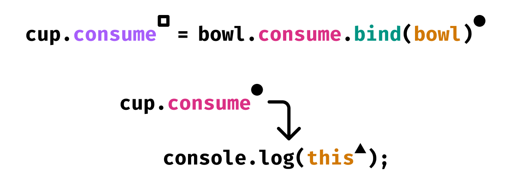

---
{
    title: "Mastering JavaScript's `this` keyword using `bind`",
    description: "JavaScript's `this` keyword is imperative when dealing with classes in JavaScript, but can introduce some headaches. Let's solve that using the `bind` method",
    published: '2023-03-16T21:52:59.284Z',
    tags: ['javascript'],
    license: 'cc-by-4'
}
---

In JavaScript, you're able to use a `class` as a template for your objects:

```javascript
class Car {
    wheels = 4;
    
    honk() {
        console.log("Beep beep!");
    }
}

// `fordCar` is an "instance" of Car
const fordCar = new Car();
console.log(fordCar.wheels); // 4
fordCar.honk();
```

As shown above, a class can have a collection of properties and methods. In addition to stateless methods, you can also reference the class instance and store state within the class object itself:

```javascript
class Car {
	// Gallons
	gasTank = 12;
    
    // Default MPG to 30
    constructor(mpg = 30) {
        this.mpg = mpg;
    }
    
    drive(miles = 1) {
        // Subtract from gas tank
        this.gasTank -= miles / this.mpg;
    }
}

const fordCar = new Car(20);
console.log(fordCar.gasTank); // 12
fordCar.drive(30);
console.log(fordCar.gasTank); // 10.5
```

The `this` keyword here allows us to mutate the class' instance and store values. However, the usage of `this` can be dangerous and introduce bugs in unexpected ways, depending on context.

Let's take a look at:

- When `this` doesn't work as expected
- How we can fix `this` with `bind`
- How to solve issues with `this` without using `bind`

# When does `this` not work as expected? {#this-broken}

Take the following two classes:

```javascript
class Cup {
	contents = "water";
    
    consume() {
        console.log("You drink the ", this.contents, ". Hydrating!");
    }
}

class Bowl {
    contents = "chili";
    
    consume() {
        console.log("You eat the ", this.contents, ". Spicy!");
    }
}

cup = new Cup();
bowl = new Bowl();
```

If we run:

```javascript
cup.consume();
```

It will `console.log` "You drink the water. Hydrating!". Meanwhile, if you run:

```javascript
bowl.consume();
```

It will `console.log` "You eat the chili. Spicy!".

Makes sense, right?

Now, what do you think will happen if I do the following?

```javascript
cup = new Cup();
bowl = new Bowl();

cup.consume = bowl.consume;

cup.consume();
```

While you might think that it would log `"You eat the chili. Spicy!"`, it doesn't! Instead, it logs: `"You eat the water. Spicy!"`.

Why?

The `this` keyword isn't bound to the `Bowl` class, like you might otherwise expect. Instead, the `this` keyword searches for the [scope](https://developer.mozilla.org/en-US/docs/Glossary/Scope) of the caller. 

> To explain this better using plain English, this might be reiterated as: "JavaScript looks at the class that uses the `this` keyword, not the class that creates the `this` keyword"

Because of this:

```javascript
cup = new Cup();
bowl = new Bowl();

// This is assigning the `bowl.consume` message
cup.consume = bowl.consume;

// But using the `cup.contents` `this` scoping
cup.consume();
```


# Fix `this` usage with `bind` {#bind}

If we want `bowl.consume` to _always_ reference the `this` scope of `bowl`, then we can use `.bind` to force `bowl.consume` to use the same `this` method.

```javascript
cup = new Cup();
bowl = new Bowl();

// This is assigning the `bowl.consume` message and binding the `this` context to `bowl`
cup.consume = bowl.consume.bind(bowl);

// Because of this, we will now see the output "You eat the chili. Spicy!" again
cup.consume();
```





While `bind`'s functionality follows its namesake, it's not the only way to set the `this` value on a method. You're also able to use `call` to simultaneously call a function and bind the `this` value for a single call:

```javascript
cup = new Cup();
bowl = new Bowl();

cup.consume = bowl.consume;

// "You drink eat the water. Spicy!"
cup.consume();

// "You eat the chili. Spicy!"
cup.consume.call(bowl);
```

JavaScript's `.call` method works like the following:

```javascript
call(thisArg, ...args)
```

Such that you're not only able to `call` a function with the `this` value, but also pass through the arguments of the function as well:

```javascript
fn.call(thisArg, arg1, arg2, arg3)
```

<!-- in-content-ad title="Consider supporting" body="Donating any amount will help towards further development of articles like this." button-text="Visit our Open Collective" button-href="https://opencollective.com/unicorn-utterances" -->

# Can we solve this without `.bind`? {#arrow-functions}

> The `.bind` code looks obtuse and increases the amount of boilerplate in our code. Is there any other way to solve the `this` issue without `bind`?

Yes! Introducing: Arrow functions.

When learning JavaScript, you may have come across an alternative way of creating functions. Sure, there's the original `function` keyword:

```javascript
function SayHi() {
	console.log("Hi");
}
```

But if you wanted to remove a few characters, you could alternatively use an "arrow function" syntax instead:

```javascript
const SayHi = () => {
	console.log("Hi");
}
```

Some people even start explanations by saying that there are no differences between these two methods, but that's not quite right.

Take our `Cup` and `Bowl` example from earlier:

```javascript
class Cup {
	contents = "water";
    
    consume() {
        console.log("You drink the ", this.contents, ". Hydrating!");
    }
}

class Bowl {
    contents = "chili";
    
    consume() {
        console.log("You eat the ", this.contents, ". Spicy!");
    }
}

cup = new Cup();
bowl = new Bowl();

cup.consume = bowl.consume;

cup.consume();
```

We already know that this example will log `"You eat the water. Spicy!"` when `cup.consume()` is called.

But what happens if we instead change `Bowl.consume()` from a class method to an arrow function:

```javascript
class Cup {
	contents = "water";
    
    consume = () => {
        console.log("You drink the ", this.contents, ". Hydrating!");
    }
}

class Bowl {
    contents = "chili";
    
    consume = () => {
        console.log("You eat the ", this.contents, ". Spicy!");
    }
}

cup = new Cup();
bowl = new Bowl();

cup.consume = bowl.consume;

// What will this output?
cup.consume();
```

While it might seem obvious what the output would be, if you thought it was the same `"You eat the water. Spicy!"` as before, you're in for a suprise.

Instead, it outputs: `"You eat the chili. Spicy!"`, as if it were bound to `bowl`.

> Why does an arrow function act like it's bound?

That's the semantic meaning of an arrow function! While `function` (and methods) both implicitly bind `this` to a callee of the function, an arrow function is bound to the original `this` scope and cannot be modified.

Even if we try to use `.bind` on an arrow function to overwrite this behavior, it will never change its scope away from `bowl`.

```javascript
cup = new Cup();
bowl = new Bowl();

// The `bind` does not work on arrow functions
cup.consume = bowl.consume.bind(cup);

// This will still output as if we ran `bowl.consume()`.
cup.consume();
```


# Problems with `this` usage in event listeners {#event-listeners}

Let's build out a basic counter button that shows a button with a number inside. When the user clicks the button, it should increment the number inside of the button's text:

```typescript
// This code doesn't work, we'll explore why soon
class MainButtonElement {
	count = 0;

  constructor(parent) {
    	this.el = document.createElement('button');
		this.updateText();
        this.addCountListeners();
		parent.append(this.el);
	}

	updateText() {
		this.el.innerText = `Add: ${this.count}`
	}

	add() {
		this.count++;
		this.updateText();
	}

	addCountListeners() {
		this.el.addEventListener('click', this.add);
	}

	destroy() {
		this.el.remove();
		this.el.removeEventListener('click', this.add);
	}
}
```

Let's see if this button works by attaching it to the document's `<body>` tag:

```javascript
new MainButtonElement(document.body);
```

It renders!

However, if we try to click the button, we get the following error:

> `Uncaught TypeError: this.updateText is not a function`

Why is this?

We might get a hint if we add a `console.log(this)` inside of our `add()` method:

```javascript
add() {
    console.log(this);
    // ...
}
```

> `<button>Add: 0</button>`

It seems like `this` is being bound to the `button` `HTMLElement` instance! 😱

How did this happen?

Well, remember that `this` is being bound to _something_. In this case, it's being bound through the `addEventListener` to the instance of the element in JavaScript.

We can then think of your browser calling an event on `button` to look something like this:

```javascript
/**
 * This is a representation of what your browser is doing when you click the button.
 * This is NOT how it really works, just an explanatory representation
 */
class HTMLElement {
    constructor(elementType) {
        this.type = elementType;
    }
    
    addEventListener(name, fn) {
        for (let event of this.events) {
	        fn(event)
        }
    }
}

document.createElement("button");
```

Let's chart out what's happening behind-the-scenes:


## Fixing `this` event listener usage {#fix-event-listeners}

To fix the issues with `this` usage in event listeners, we can reuse our existing knowledge from earlier and do one of two things:

1) **`.bind` the usage of `.add` in the event listener:**

```javascript
// This code doesn't work either
class MainButtonElement {
	count = 0;

  constructor(parent) {
    	this.el = document.createElement('button');
		this.updateText();
        this.addCountListeners();
		parent.append(this.el);
	}

	updateText() {
		this.el.innerText = `Add: ${this.count}`
	}

	add() {
		this.count++;
		this.updateText();
	}

	addCountListeners() {
		this.el.addEventListener('click', this.add.bind(this));
	}

	destroy() {
		this.el.remove();
        // This won't remove the listener properly
		this.el.removeEventListener('click', this.add.bind(this));
	}
}
```

However, this has some problems, as two `.bind` functions are not referentially stable:
```javascript
function test() {}

console.log(test.bind(this) === test.bind(this)); // False
```

Which is required for `removeEventListener` usage to remove the event listener properly. This means that we instead have to bind `add` at the function's base:

```javascript
class MainButtonElement {
	count = 0;

  constructor(parent) {
    	this.el = document.createElement('button');
		this.updateText();
        this.addCountListeners();
		parent.append(this.el);
	}

	updateText() {
		this.el.innerText = `Add: ${this.count}`
	}

    // 😖
	add = (function() {
		this.count++;
		this.updateText();
	}).bind(this)

	addCountListeners() {
		this.el.addEventListener('click', this.add);
	}

	destroy() {
		this.el.remove();
		this.el.removeEventListener('click', this.add);
	}
}
```

Alternatively, we can...

2. **Use an arrow function rather than a class method**:

```javascript
class MainButtonElement {
	count = 0;

  constructor(parent) {
    	this.el = document.createElement('button');
		this.updateText();
        this.addCountListeners();
		parent.append(this.el);
	}

	updateText() {
		this.el.innerText = `Add: ${this.count}`
	}

	add = () => {
		this.count++;
		this.updateText();
	}

	addCountListeners() {
		this.el.addEventListener('click', this.add);
	}

	destroy() {
		this.el.remove();
		this.el.removeEventListener('click', this.add);
	}
}
```

# Wrapping it up {#conclusion}

Using the `this` keyword is nearly unavoidable when using class-based JavaScript. It enables you to mutate state within the class to reference for later usage.

While some JavaScript is able to avoid this, it's particularly helpful to know when using frameworks such as [Angular](https://angular.io) which uses classes as the primary means for defining a component.

Speaking of - want to learn how to use Angular? I'm writing [a free book series called "The Framework Field Guide" that teaches React, Angular, and Vue all at once](https://framework.guide). Click the link to learn more about the book and be notified when it launches!

Happy hacking!
