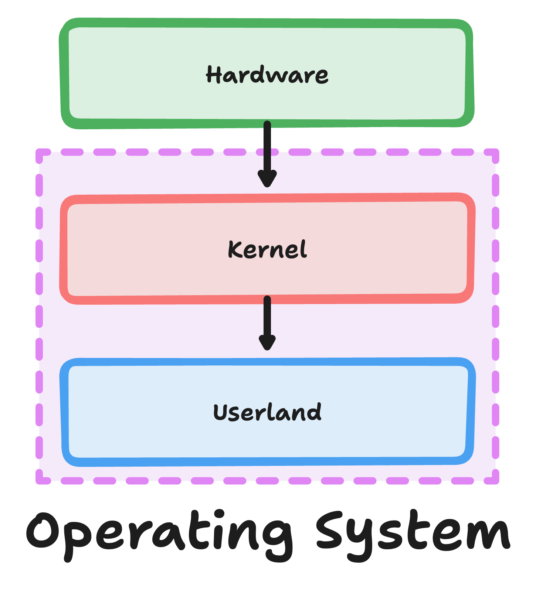
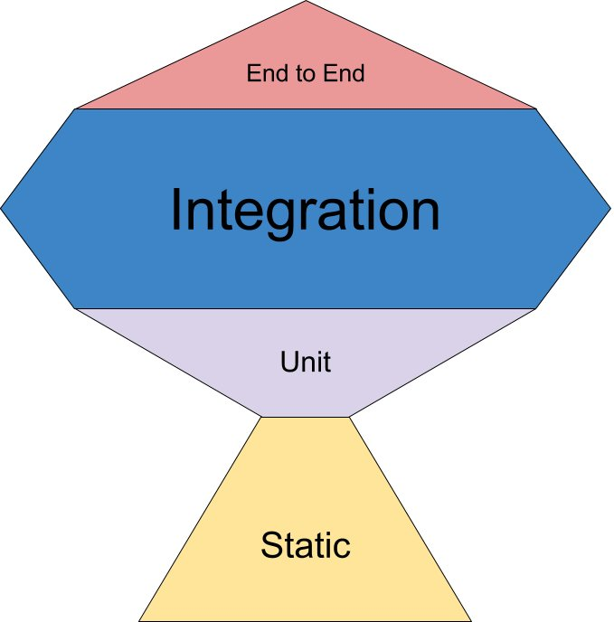
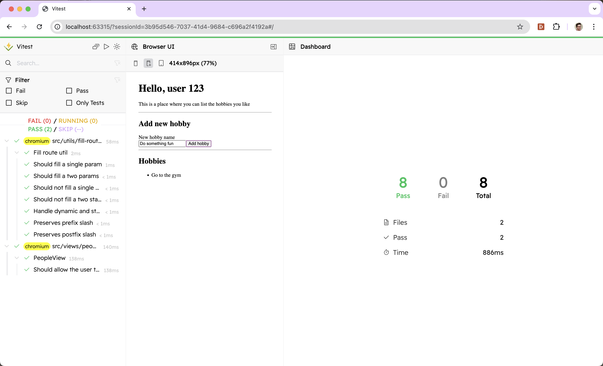
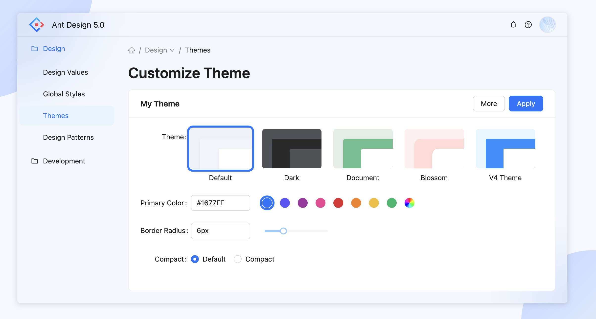

---
{
  title: "Scale Your Project with Layered React Structure",
  description: "Learn how to scale your React project using Layered React Structure (LRS). Take your app from small-time to enterprise grade by organizing your code better.",
  published: '2025-04-09T20:12:03.284Z',
  tags: [ 'react', 'webdev', 'opinion' ],
  license: 'cc-by-4'
}
---

> **Preface:**
>
> When I first started web development, I worked on an Angular 2 project. In Angular there's a [strong, opinionated, and reasonably laid out style guide](https://angular.dev/style-guide) that outlines how you should structure your project. Combined with a list of official tools that built on top of the core, well written Angular apps can feel very consistent from one app to another.
>
> Imagine my surprise when my next work project was in React and I learned how there's few official libraries relevant to most app authors and no codified style guide to reference. This feeling never truly left even after a few React projects under my belt so, when I started working on my own (now defunct) multi-year-long application, I was determined to solve this problem.
>
> This article outlines the solution I came up with after years of experimentation and has been refined after years of production usage after said experimentation.

This article proposes a method of laying out your React project called "**Layered React Structure**", or "**LRS**" for short.

The gist of LRS is that each layer of your application should be able to live independently and compose together to form your application more cleanly. Ultimately, this code organization will allow you to:

- Know where any individual part of your code lives quickly, regardless of your project's scale
- Test your code in a more user-centric and consistent manner
- Introduce less bugs in your system by keeping logic consolidated
- Decrease the complexity of following the flow of any logic
- Allow developers and stakeholders to more rapidly iterate on UI
- Avoid bike-shedding of where code should live, once adopted

# Pre-requisite Concepts {#concepts}

Before diving into LRS itself, there's a few concepts I want to explain in-depth first. Let's dive in and try to understand the mindset I approach building React apps in.

> Understand the concepts at play? [Skip ahead to the filesystem example](#lrs) for a quick glance.

## Defining "Smart" vs "Dumb" Component {#smart-dumb-comps}

Even in React's early days, you may have heard of "Smart" and "Dumb" components. They're so predominant in React's ecosystem in part thank to [this article by Dan Abramov that popularized them back even as far as 2015](https://medium.com/@dan_abramov/smart-and-dumb-components-7ca2f9a7c7d0).

> **Other names:**
>
> This concept has been referred to in a number of ways. Here's a some alternative terms you may hear:
>
> - "Fat" and "Skinny" components
> - "Container" and "Presentational" components
> - "Stateful" and "Pure" components
> - "Screens" and "Components"
>
> And many more.

While Dan has since shifted his mind on this concept, I've learned to embrace the differences between "smart" and "dumb" components.

Without recapping his article entirely, here's the base concept:

**"Smart"** components deal with the business logic of your app:

```jsx
// This is an example of a "smart" component
function UserTable() {
	const {data, error, isLoading} = useQuery(/* ... */)
    
    useEffect(() => {
		if (!error) return;
        logError(error);
    }, [error])
    
    if (isLoading) {
        return <LoadingIndicator/>
    }
    
    if (error) {
		return <ErrorScreen error={error}/>;
    }
    
    return (
    	/* ... */
    )
}
```

"**Dumb**" components, on the other hand, handle the display and styling of your app:

```jsx
// This is an example of a "dumb" component
function LoadingIndicator() {
	return <>
        <p>Loading...</p>    	
    	<svg class="spinner">
            {/* ...*/}
        </svg>
    </>
}
```

### "Smart" vs "Dumb" rules of thumb {#smart-dumb-thumbs}

While many versions of the "Smart" vs "Dumb" component arguments have different rules, here's some general rules of thumb I follow with my component types; I generally suggest these guidelines be followed to ensure LRS is used correctly.

- "Dumb" components _may_ contain state and logic, but _only_ when relevant to the UI, **never** business logic.

    ```jsx
    // This is an example of a "dumb" component with state
    function ErrorScreen({error}) {
        // Can contain state, but only state relevant to the UI
        const [isExpanded, setIsExpanded] = useState(false);

        const handleToggle = (event) => setIsExpanded(event.currentTarget.open);

        return <>
            <p>There was an error</p>
            <details onToggle={handleToggle} open={open}>
                <summary>{isExpanded ? 'Hide error details' : 'Show error details'}</summary>
                <pre style="white-space: pre-wrap">
                    <code>{error.stack}</code>
                </pre>
            </details>
        </>
    }
    ```

- "Dumb" components **must** only ever include other "dumb" components

    ```jsx
    // DO NOT DO THIS
    function UserListItem({user}) {
        /* ... */
        const [isEditDialogOpen, setIsEditDialogOpen] = useState(false);
        
        return <>
        	{/* ... */}
        	<button onClick={() => setIsEditDialogOpen(true)}>Edit</button>
        	{/* This modal contains buisness logic for editing a user */}
    	    {isEditDialogOpen && <EditUserDialog user={user}/>}
    	</>
    }
    
    // Instead, try moving state up to the parent:
    function UserListItem({user, openUserDialog}) {
        /* ... */
        return <>
        	{/* ... */}
        	<button onClick={openUserDialog}>Edit</button>
    	</>
    }
    ```

- "Dumb" components **must** not include a reliance on any context, service, or other application dependency

    ```jsx
    // DO NOT DO THIS
    function ProfileInformation() {
    	const user = use(UserData);
        
        return <>
        	<p>User's name: {user.name}</p>
        	{/* ... */}
        <>
    }
    
    // Instead, move application developers up and pass them down
    function ProfileInformation({user}) {    
        return <>
        	<p>User's name: {user.name}</p>
        	{/* ... */}
        <>
    }
    ```

    > I will note that I've broken this rule before, but only for contexts that contain presentational-focused information such as:
    >
    > - Internationalization/Translation string contexts
    > - Theme value contexts
    > - Feature flags specific to the UI's presentation

- "Dumb" components *should* not care how data is loaded, changed, or accessed

    ```jsx
    // DON'T DO THIS
    function ToggleDisplay({displayInfo}) {
      const [open, setOpen] = displayInfo;
      
      // ...
    }
    
    // Your implementation should not be so tied to the parent's data structure
    function App() {
      const displayInfo = useState(false);
      return <ToggleDisplay displayInfo={displayInfo}/>
    }
    
    // ---------------------------------------------------------------------------------
    
    // Instead, pass individual data items to be more modular and less opinionated
    function ToggleDisplay({open, toggle}) {  
      // ...
    }
    
    // Your implementation should not be so tied to the parent's data structure
    function App() {
      const [open, setOpen] = useState(false);
      return <ToggleDisplay open={open} toggle={() => setOpen(!open)}/>
    }
    
    ```

- "Smart" components _should_ not have any markup and **must** not contain any styling

    ```jsx
    // DO NOT DO THIS
    function App() {
    	return <div style={{minHeight: '100vh'}}>
      	{/* ... */}
      </div>
    }
    
    // Instead, break out styling to dedicated files
    function App() {
      return <Layout>
      	{/* ... */} 
      </Layout>
    }
    ```

## Defining Utilities vs Services {#utils-vs-services}

In 2015 Promises were introduced into JavaScript. While they were a good solution to the problem of [the Christmas tree callback problem](https://playfulprogramming.com/posts/async-and-promises#Callbacks), they weren't intuitive to use until `async` and `await` were implemented in the ecosystem around 2017.

```javascript
function main() {
  return sleep(1)
  	.then(() => {
      console.log("One second has passed");
      return sleep(1);    
	  })
  	.then(() => {
	    console.log("Two seconds have passed");  
	  })
}

// vs

async function main() {
  await sleep(1);
  console.log("One second has passed");
  await sleep(1);
  console.log("Two seconds have passed");
}
```

> Want to learn more about `async`/`await` and promises in JavaScript? [Check out my article on the topic.](/posts/async-and-promises)

One challenge with the introduction of the `async` and `await` API in JavaScript is that you now need to effectively [color-code your functions between asyncronous code and syncronous code.](https://journal.stuffwithstuff.com/2015/02/01/what-color-is-your-function/)

While the author of the article linked above sees this developer color-coding as a bad thing, I once again lean into the paradigm shift and understand the benefits and downsides of each color of code: sync and async.

After all, while syncronous code _can_ introduce a side-effect like so:


It's important to remember that this can be sidestepped and most sync functions can be made pure.

Async functions, on the other hand, are inherently effect-ful; a result of being commonly used to interact with I/O.

> [Learn more about side-effects and their relationship to React in this chapter of my free book.](/posts/ffg-fundamentals-side-effects#whats-a-side-effect)

As such, I find it valuable to make a distinction between our utilities that are syncronous and those which are asyncronous.

As a result, I call syncronous utilities **utils** while I call similar asyncronous functions **services**.

## Understanding filename sensitivities {#case-sensativity}

Very quickly, let's go over how computers handle files:

When you write a program that needs to read a file, it will call down to your operating system's kernel - a bit of code meant to bridge your machine's hardware and software at the lowest level.



This kernel call to write a file will communicate both with your computer's disk drivers and the file structure of the files on the disk.

The structure of the files - often called a **filesystem** - is established by your operating system when you format the disk (either manually or during the operating system's install). Different operating systems have different default filesystems:

| OS      | Default Filesystem                |
| ------- | --------------------------------- |
| Windows | New Technology File System (NTFS) |
| macOS   | Apple File System (APFS)          |
| Linux   | Fourth extended filesystem (EXT4) |

Each of these filesystems come with their own pros and cons, but one distinction between them rises above others for web developers: *filename case sensativity*.

Take the following two file names:

<!-- ::start:filetree -->

- `test.txt`
- `tEsT.txt`

<!-- ::end:filetree -->

While Windows and macOS treat these two files as the same by default, EXT4 - and therefore most Linux installs - does not have the ability to.

This means that on Linux instances you can literally have both of the files exist in the same folder.

> It's worth mentioning that [APFS can be configured to be case-sensitive](https://support.apple.com/lv-lv/guide/disk-utility/dsku19ed921c/mac) and even [modern Windows can enable case-sensativity in some folders through a manual command](https://learn.microsoft.com/en-us/windows/wsl/case-sensitivity).
>
> That said, it's generally understood that most machines will not establish these settings for you out of the box.

As a result, I strongly suggest that you keep _all_ files **lowercased** and in a `kebob-case` naming convention to ensure that files aren't mixed up between your Linux environments and your macOS/Windows developers; which can be challenging to debug between CI/CD and local systems.

---

# Introducing Layered React Structure (LRS) {#lrs}

Now that we've gotten the tiny details out of the way, let's finally outline what LRS is all about.

Here's an example of LRS in action: 

<!-- ::start:filetree -->

- `src/`
	- `assets/{open: false}` Where non-code assets, such as images and fonts, live
		- `logo.png`
	- `components/` Where "dumb" components go
		- `button/`
			- `button.modules.scss`
			- `button.stories.ts` The storybook file for the component
			- `button.spec.tsx` The optional unit test file for the component
			- `button.tsx`
			- `index.ts`
		- `input/{open: false}`
			- `input.modules.scss`
			- `input.tsx`
			- `index.ts`
	- `constants/{open: false}` Where non-logic hard-coded values live
		- `theme.ts`
		- `index.ts`
	- `hooks/{open: false}` Where all non-UI React-specific reusable logic lives
		- `use-android-permissions.ts`
		- `index.ts`
	- `services/{open: false}` Where all I/O code logic lives
		- `people.ts`
		- `index.ts`
	- `types/{open: false}` Where non-JS TypeScript types and interfaces live
		- `svg.d.ts`
		- `address.ts`
		- `index.ts`
	- `utils/{open: false}` Where non-React JS reusable logic lives
		- `helpers.ts`
		- `index.ts`
	- `views/` Our folder directory to contain views within our app. Also known as "pages", "screens", or "routes"
		- `homescreen/`
			- `components/{open: false}` The view-specific components. These must all be presentational components
				- `homescreen-list/`
					- `homescreen-list.module.scss`
					- `homescreen.tsx`
					- `index.ts`
			- `homescreen.spec.tsx` The integration test for the `.view.tsx` file
			- `homescreen.stories.tsx` The optional storybook file for the `.ui.tsx` file
			- `homescreen.module.scss` The styling for the `.ui.tsx` file
			- `homescreen.ui.tsx` The presentational component for the view, contains all layout for a view
			- `homescreen.view.tsx` The "smart" component for the view, contains all network and buisness logic
			- `index.ts`
	- `app.tsx` Our component entry point. May contain some providers but not much more

<!-- ::end:filetree -->

> In LRS, all non-source code configuration files, such as `.storybook` or `.eslintrc.json` files must live outside of the `src`
> folder.

> What's a `storybook`? What should I use for testing? What about my UI components?

<p class="text-style-headline-4">Don't worry!</p>

Some of you may have already gotten used to React or have knowledge of the same issues I've discussed and addressed, as well as the tools used with LSR. 

***For those who haven't***, now that we've shown the full structure of LSR, let's dive a bit deeper into why it works the way it does.

In the following paragraphs, we'll get to learn more about the tools used in our configuration.

- [**Shared Code with LRS**](#shared-code)
- [**File-based Routing with LRS**](#filebased-routing)
- [**What to use with LRS**](#lrs-tools)
  - Testing:
    - [**Logic Testing**](#testing-library)
    - [**Test Runner**](#vitest)
  - UI:
    - [**UI Testing**](#storybook)
    - [**UI Styling**](#styling)

## LRS: Shared Code {#shared-code}

You may notice that in LRS we tend to have many root directories for different purposes. However, it should be noted that these same folders can (and should) exist inside of a given `view` folder as well:

<!-- ::start:filetree -->

- `views/`
	- `homescreen/`
		- `components/{open: false}`
			- `...`
		- `utils/{open: false}`
			- `...`
		- `services/{open: false}`
			- `...`
		- `homescreen.ui.tsx`
		- `homescreen.view.tsx`
		- `...`

<!-- ::end:filetree -->

This enables you to feature-scope a given set of `utils` and `services`, while keeping the root directory for any `utils`, `services`, `components`, and other tools that are used in more than one screen.

## LRS: File-based Routing {#filebased-routing}

> The idea of `views` seems nice, but I work in [Next.js](https://nextjs.org/)/[TanStack Router](https://tanstack.com/router/latest) where I need to keep my routes in a specific folder - how do I handle that?

Luckily, there's a simple solution: Make your `pages`/`app` directory a shell for the `views` folder:

```tsx
// app/page.tsx
import {Homescreen} from "../views/homescreen/homescreen.view";

export default function HomescreenPage() {
  return <Homescreen/>
}
```

That's all you need to add! 😄

# What to use with LRS {#lrs-tools}

Let's explore some of the tools I typically suggest to use alongside LRS. These are libraries that either help you save time or make your development pipeline more efficient.

> **Note:**
> This section is much more opinionated than the rest of the article. While I stand by these suggestions, it's very possible to implement a sufficiently well-structured React app using LRS without these specific tools.

## Logic Testing {#testing-library}

If you've been in the React world for long, you're likely to know the works of [Kent C Dodds](https://kentcdodds.com/). He's a prolific educator, creating [Epic React](https://www.epicreact.dev/), [Epic Web](https://www.epicweb.dev/), and [Testing JavaScript](https://www.testingjavascript.com/) courses, to name a few.

One of his most popular articles, titled ["Write tests. Not too many. Mostly integration."](https://kentcdodds.com/blog/write-tests), walks through why you'd want to prioritize writing integration tests using his "Testing Trophy":



Through most of Kent's writings about tests, he typically reaches for a tool called ["Testing Library"](https://testing-library.com/); a suite of tools that enable better integration testing approaches in your frontend projects.

It's here that, Kent shows another side of himself as well; a well regarded webdev tooling creator. See, [Kent is the original author of "Testing Library".](https://kentcdodds.com/blog/introducing-the-react-testing-library)

While today Testing Library includes adapters for many frameworks, **I suggest using the following tools for your React testing suite**:

- [Vitest](http://vitest.dev/)
- [DOM Testing Library](https://testing-library.com/docs/dom-testing-library/intro)
- [React Testing Library](https://testing-library.com/docs/react-testing-library/intro/)
- [User Event](https://testing-library.com/docs/user-event/intro)
- [Jest DOM](https://github.com/testing-library/jest-dom)
  - Supports [Vitest](http://vitest.dev/) as well
- [MSW](https://mswjs.io/)

> **Warning:**
>
> While you _can_ test React Hooks independently from your code using [React Hooks Testing Library](https://github.com/testing-library/react-hooks-testing-library), I strongly suggest staying away from it. Not only has maintainance on the project been stiffled, but it encourages bad testing practices for most applications.

With this, you can write tests that follow user behavior like so:

```tsx
import { describe, expect, it, afterEach, beforeAll } from "vitest";

import { render, screen, waitFor } from "@testing-library/react";
import userEvent from '@testing-library/user-event'

import { http } from "msw";
import { setupWorker } from 'msw/browser'

import { PeopleView } from "./people.view";
import { createPersonHobbiesUrl } from "../../services/people";

const user = userEvent.setup();
const worker = setupWorker()

beforeAll(() => worker.start());

afterEach(() => worker.resetHandlers());

describe("PeopleView", () => {
    it("Should allow the user to add a hobby to their person", async () => {
        worker.use(http.post(createPersonHobbiesUrl, () => HttpResponse.json({
            hobbies: [{
                id: "0",
                name: "Go to the gym"
            }]
        }))

        render(<PeopleView />)

        expect(screen.getByText("There are no hobbies")).toBeInTheDocument();

        await user.type(screen.getByLabelText("New hobby name"), "Do something fun");

        await user.click(screen.getByText("Add hobby"));

        await waitFor(() => expect(screen.getByText("Go to the gym")).toBeInTheDocument())
    })
})
```

This setup enables you to validate actual user behavior rather than testing implementation details.

> Want to learn more about best testing practices? [See our article for 5 suggestions to write the best tests you can.](https://playfulprogramming.com/posts/five-suggestions-for-simpler-tests)

## Test Runner {#vitest}

While looking through that list, you may have wondered why I suggested using [Vitest](http://vitest.dev/) rather than [Jest](https://jestjs.io/).

Well, while there's a number of reasons I'd go with Vitest over Jest the biggest one is a single feature:

[**Vitest's browser mode**](https://vitest.dev/guide/browser/)



See, while Testing Library and MSW allow you to focus on the user-experience in your tests, using something like [JSDom](https://github.com/jsdom/jsdom) - common in Jest UI testing - makes debugging those tests much harder since you're not using a real browser.

With Vitest browser mode, you run your tests in a real browser quickly; making debugging much easier.

## UI Testing {#storybook}

While the idea of vendoring your own UI library may sound unappealing and unproductive early on, I've found that it quickly becomes a reality for all production apps, regardless of original intent.

This doesn't mean that you write all of your UI components from scratch; maybe you use a UI library like [MUI](https://mui.com/) or [Ant Design](https://ant.design/), but in the end you _will_ end up with your own set of in-house re-useable components.



Despite the down-ladden tone I've used in the last two paragraphs, I think this is great news for you! Knowing what will come enables you to prepare for it. Further, having a consistent set of components allows you to document and enforce more consistency in your apps.

However, the problem comes when you don't have documentation or a good reference of what UI components are available to you as a developer on the team.

**This is why I suggest using [Storybook](https://storybook.js.org/) for all of your shared components**. It allows you to have a centralized view of your UI elements and document them as-needed as you grow and scale:


Luckily, Storybook is simple to use. Here's an example Storybook story file for React:

```tsx
import type { Meta, StoryObj } from '@storybook/react';

import { Button } from './Button';

const meta: Meta<typeof Button> = {
  component: Button,
};

export default meta;
type Story = StoryObj<typeof Button>;

export const Primary: Story = {
  args: {
    primary: true,
    label: 'Button',
  },
};
```

## Styling {#styling}

Less of a tooling suggestion and more of a holdover from my days working with Angular; **I suggest keeping your styling in a different file as your markup**.

This can be done with, ideally, [**CSS/SCSS Modules**](https://css-tricks.com/css-modules-part-1-need/), [**Vanilla Extract**](https://vanilla-extract.style/), or similar. However, even [**Tailwind**](https://tailwindcss.com/) can work, so long as you extract your classes to a string template literal in a different file.

The reason for this is that by splitting it out, you're able to keep files more cleanly organized, small, and composable as-needed.

# Conclusion

I know that many of you will look through this layout and assume that this was trivial knowledge to come up with. After all, after putting this into place I found some alternatives like [Bulletproof React](https://github.com/alan2207/bulletproof-react/blob/master/docs/project-structure.md) that outlines similar.

But I didn't start with Bulletproof React or any other baseline - most of this was came up with on-the-fly during rapid prototype implementation after seeing some challenges in other React codebases I'd worked in. It was only through experimentation, trial and error, and experience that I came to the patterns outlined here.

Despite the long road to a short story, I'm grateful to've thought of this pattern. After all, [Steve Jobs himself said in 1998](https://www.bbc.com/news/world-us-canada-15195448):

> That's been one of my mantras - focus and simplicity. Simple can be harder than complex: you have to work hard to get your thinking clean to make it simple. But it's worth it in the end because once you get there, you can move mountains.

Hopefully this has been helpful to you and your teams after reading through this, however.

And hey, if you liked this writing style, check out [my totally free and in-depth book on React, Angular, and Vue](https://framework.guide):

[](https://framework.guide)

Until next time!