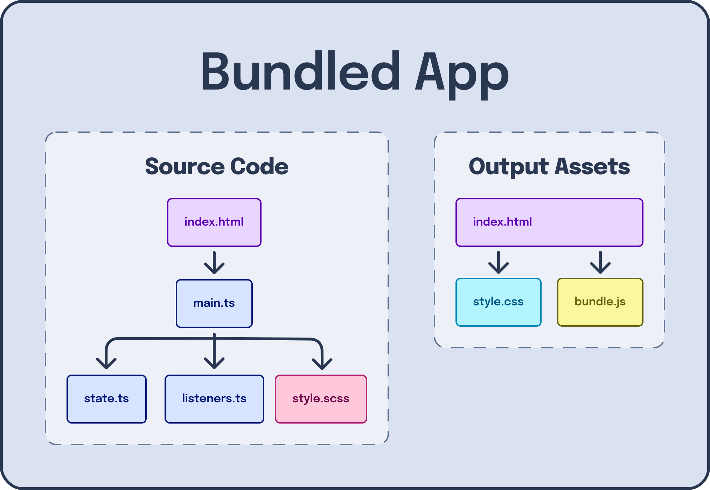

---
{
  title: "Writing Modern JavaScript without a Bundler",
  description: "",
  published: "2024-11-18T21:52:59.284Z",
  tags: ["javascript", "webdev"],
  license: "cc-by-4",
}
---

Modern web development is awesome. We've never had a period of time where our tools enable us to move faster, ship less bugs, and make great web apps.

But while tools like Vite and Webpack are extremely powerful and can provide a better user experience (UX), they can often feel like they're getting in the way of rapid prototyping.

Let's explore how we can build a website using many of the conveniences of a Vite app while remaining buildless.

In this article, we'll learn how to:

- [Set up pre-requisites for local web development](#pre-req)
- [Import JavaScript files from a script tag](#import-js)
- [Adding a flavor of "hot module reloading" (HMR) to reload our code in development for better developer experience (DX)](#hmr)
- [Import libraries from CDNs](#cdn)
- [Move away from CDNs and leverage NPM to install modules](#npm)
- [Use dependencies that might otherwise not work through micro-bundling](#bundle-modules)
- [Pick a framework that supports no-build environments](#frameworks)
- [Use tools like Prettier, ESLint, and TypeScript without adding a build step](#tooling)

Without further ado, let's dive in!

# Setting up Pre-Requisites {#pre-req}

Let's first set up the initial bit of tooling required to run a webpage locally. We'll start with a `package.json` file:

```json
{
	"name": "your-name-here",
	"private": true,
	"version": "0.0.0",
	"scripts": {
		"start": "http-server -c-1 src"
	},
	"devDependencies": {
		"http-server": "^14.1.1"
	}
}
```

> We're adding `-c-1` to disable caching. This means that you can refresh the page when you've made changes and it'll automatically show the newest results instead of caching them for an hour.

Then create a `src` folder so we don't mix up our source code files with other files we'll add later:

<!-- ::start:filetree -->

- `src/`
  - `index.html`
- `package.json`

<!-- ::end:filetree -->

And finally, we'll create our `index.html` file with a `Hello world` message:

```html
<!doctype html>
<html lang="en">
	<head>
		<meta name="viewport" content="width=device-width" />
		<meta charset="utf-8" />
		<title>Basic Setup</title>
	</head>

	<body>
		<p>Hello, world!</p>
	</body>
</html>
```

Now we can `npm run start` from root and get a basic web server at `http://127.0.0.1:8080/`.

<iframe data-frame-title="Basic Setup - StackBlitz" src="pfp-code:./basic-setup?template=node&embed=1&file=src%2Findex.html"></iframe>

> Remember, when you make changes you'll need to refresh the page to see them loaded. We'll explore how to fix that in a later section of this article.

# Import JS files From a Script Tag {#import-js}

Managing multiple files in older vanilla JavaScript projects used to be a pain. Luckily, modern browsers support the `import "something.js"` syntax that we can now use to manage multiple files.

To use this, we need to denote our `script` tag (from our HTML file) as `type="module"`:

```html
<script type="module" src="script.js"></script>
```

Once this is done, we can add `import` statements in our JS files:

```javascript
// script.js
import template from "./template.js";

const root = document.getElementById("root");
root.innerHTML = template;
```

> Something worth noting is that you need to have the `.js` identifier at the end of your `import` statement, otherwise the browser will not know where to look.

<iframe data-frame-title="JS Files Script Tag - StackBlitz" src="pfp-code:./js-files-script-tag?template=node&embed=1&file=src%2Fscript.js"></iframe>

# Introducing HMR for Vanilla JavaScript Apps {#hmr}

It's neat that we're able to load JavaScript files without a bundler, but if you spend much time in our environment you'll likely yearn for a solution that reloads the page whenever you modify the files in use.

Luckily for us, there's a different web server that can handle this for us: `browser-sync`.

Let's change it in our `package.json`:

```json
{
	"name": "your-name-here",
	"private": true,
	"version": "0.0.0",
	"scripts": {
		"start": "browser-sync start --server \"src\" --watch --no-ui"
	},
	"devDependencies": {
		"browser-sync": "^3.0.3"
	}
}
```

And see as the page refreshed while we modify any of the files in `src`:

<iframe data-frame-title="HMR - StackBlitz" src="pfp-code:./hmr?template=node&embed=1&file=src%2Fscript.js"></iframe>

# Using CDNs to load libraries {#cdn}

Most apps require a fair number of libraries to get up-and-running. Let's load in a date library, [Luxon](https://moment.github.io/luxon/), to handle our dates in a nicer way.

To do this, we can use a CDN like [unpkg.com](https://unpkg.com/) to load in the files required to run the library in our app.

If we go to [https://unpkg.com/luxon](https://unpkg.com/luxon), we'll see a loaded bit of JavaScript:


However, this isn't the format we need the library in. Remember, we need to have `import` and `export` lines, ideally without any additional `import` statements for ease-of-setup (more on that later in the article).

To find this, we're looking for files labeled something like `ES6` or `ESM` or `BROWSER`, like so:

[https://unpkg.com/browse/luxon@3.5.0/build/es6/luxon.js](https://unpkg.com/browse/luxon@3.5.0/build/es6/luxon.js)

To find these files, you can use the `browse` feature of Unpkg by adding `browse` at the start of the URL:


> Not all libraries are bundled to support ESM in this way as a single file. If it does not, you can add compile the dependency to support it, as we'll touch on later.

Once we find the right file, we need to make sure to use the raw file:

[https://unpkg.com/luxon@3.5.0/build/es6/luxon.js](https://unpkg.com/luxon@3.5.0/build/es6/luxon.js)

Instead of:

[https://unpkg.com/browse/luxon@3.5.0/build/es6/luxon.js](https://unpkg.com/browse/luxon@3.5.0/build/es6/luxon.js)

Then we can import from this URL like any other import:

```javascript
// script.js
import { DateTime } from "https://unpkg.com/luxon@3.5.0/build/es6/luxon.js";

const root = document.getElementById("root");

const date = DateTime.now()
	.setZone("America/New_York")
	.minus({ weeks: 1 })
	.endOf("day")
	.toISO();

root.innerText = date;
```

<iframe data-frame-title="CDN - StackBlitz" src="pfp-code:./cdn?template=node&embed=1&file=src%2Fscript.js"></iframe>

# Aliasing modules {#importmap}

The `script.js` file above works in-browser, but doesn't look quite right to anyone that's done modern JS. Moreover, if you wanted to use a different version of `luxon`, you'd have to track all imports from this URL and update them one-by-one.

Let's instead alias that URL to be imported when we `import "luxon"`. To do this, we'll leverage an `importmap`:

```html
<!doctype html>
<html lang="en">
	<head>
		<meta name="viewport" content="width=device-width" />
		<meta charset="utf-8" />
		<title>Import Map</title>
		<script type="importmap">
			{
				"imports": {
					"luxon": "https://unpkg.com/luxon@3.5.0/build/es6/luxon.js"
				}
			}
		</script>
	</head>

	<body>
		<div id="root"></div>
		<script type="module" src="/script.js"></script>
	</body>
</html>
```

And modify our `script.js` file to import from that path:

```javascript
// script.js
import { DateTime } from "luxon";

const root = document.getElementById("root");

const date = DateTime.now()
	.setZone("America/New_York")
	.minus({ weeks: 1 })
	.endOf("day")
	.toISO();

root.innerText = date;
```

<iframe data-frame-title="Import Map - StackBlitz" src="pfp-code:./importmap?template=node&embed=1&file=src%2Fscript.js"></iframe>

# Installing Libraries from NPM {#npm}

While using a CDN can be convinient, it comes with a number of problems:

- Reliance on someone else's uptime
- Trusting a third-party's security to not replace modules later
- IDE and tooling issues

To sidestep this, it would be ideal for us to use the NPM registry to load our modules in our apps manually.

However, if we were to `npm install` normally, it would place our installs inside of `node_modules`. Instead, we need our installs to go into `src` so that our web server is able to reference those files using the public server URL.

As the NPM CLI doesn't allow us to change the directory of `node_modules`, we'll use [PNPM](https://pnpm.io/) as our NPM install CLI:

```shell
npm i -g pnpm
```

> There are other ways to install PNPM; [Check their docs for other methods of installing PNPM](https://pnpm.io/installation).

Now we have PNPM installed, we can configure it using a root file of `.npmrc`:

```
# Move all dependencies to src/vendor so we can use import maps
modules-dir = src/vendor
# Hoist all dependencies to the top level so to avoid symbolic links, which won't work well with import maps
node-linker = hoisted
# Change the virtual store location so we can symbolically link node_modules to src/vendor
virtual-store-dir = .pnpm
```

Here, we're telling our package manager to install all dependencies into `src/vendor` rather than `node_modules`, avoiding symbolic links, and to move PNPM's internal instances to the `.pnpm` folder (more on that in a moment).

> If you have a `.gitignore` file, make sure to add these items to it:
>
> ```
> # Our custom PNPM settings
> .pnpm
> # Our custom node_modules path
> src/vendor/
> ```

Now, we'll want to create a symbolic link from `node_modules` that points to `src/vendor` so our IDEs can track our deps better:

<!-- ::start:tabs -->

## Windows {#win-symlink}

```shell
mklink /D node_modules src/vendor
```

## macOS / Linux {#nix-symlink}

```shell
ln -s src/vendor node_modules
```

<!-- ::end:tabs -->

Now, we'll update our  `package.json` to include the deps we want to use:

```json
{
	"name": "your-name-here",
	"private": true,
	"version": "0.0.0",
	"scripts": {
		"start": "browser-sync start --server \"src\" --watch --no-ui"
	},
	"devDependencies": {
		"browser-sync": "^3.0.3"
	},
	"dependencies": {
		"luxon": "^3.5.0"
	}
}
```

> As a helpful tip, [we can use `devDependencies` to track the tools we don't need to ship to the browser and `dependencies` as the libraries we need in production](https://playfulprogramming.com/posts/how-to-use-npm#dev-deps).

And install them using `pnpm`:

```shell
pnpm install
```

This finally enables us to reference our modules from our `importmap` but using a local URL instead of a remote one:

```html
<!doctype html>
<html lang="en">
	<head>
		<meta name="viewport" content="width=device-width" />
		<meta charset="utf-8" />
		<title>Import Map</title>
		<script type="importmap">
			{
				"imports": {
					"luxon": "./vendor/luxon/build/es6/luxon.js"
				}
			}
		</script>
	</head>

	<body>
		<div id="root"></div>
		<script type="module" src="/script.js"></script>
	</body>
</html>
```

And without modifying the JavaScript file from before, we should be up-and-running!

<iframe data-frame-title="NPM - StackBlitz" src="pfp-code:./npm?template=node&embed=1&file=src%2Findex.html"></iframe>

# Adding support for incompatible modules {#bundle-modules}

While many libraries are properly packaged to be bundled in a single ESM file, others are not. Let's take `lodash-es` as an example:

```shell
pnpm install lodash-es
```

This gives us a `src/vendor/lodash-es` folder that looks like this:

<!-- ::start:filetree -->

- `add.js`
- `...`
- `lodash.js`
- `...`
- `zipWith.js`
- `package.json`
- `README.md`

<!-- ::end:filetree -->

With every single method as a dedicated file that imports from other individual files.

This becomes tricky because, while `importmap`s support relative links:

```javascript
// src/vendor/lodash-es/lodash.js
export { default as add } from './add.js';
// ...
```

````html
<script type="importmap">
  {
    "imports": {
      "lodash": "/vendor/lodash-es/lodash.js",
      "./add.js": "/vendor/lodash-es/attempt.js",
    }
  }
</script>
````

The `lodash-es` main import file has **hundreds** of these relative imports, making this nearly impossible to manage long-term.

-----

To solve for this, we can do something a bit silly: We can bundle our dependencies that have this problem.

We'll use `esbuild` for this solution, since it's lightweight and can be script-able using a straightforward API:

```shell
pnpm i -D esbuild
```

To do this, let's add a `scripts/bundle-deps.js` file:

```javascript
import esbuild from "esbuild";

Promise.all([
	esbuild.build({
		format: "esm",
		entryPoints: ["./src/vendor/lodash-es/lodash.js"],
		bundle: true,
		platform: "browser",
		outfile: "./src/vendor_bundled/lodash-es.js",
	}),
  // Add other `esbuild.build` commands here
]).catch(console.error);
```

And run the script from `pnpm`'s `postinstall` step, so that it autogenerates after each `pnpm i` usage.

```json
{
	"name": "your-name-here",
	"private": true,
	"version": "0.0.0",
	"type": "module",
	"scripts": {
		"start": "browser-sync start --server \"src\" --watch --no-ui",
		"postinstall": "node scripts/bundle-deps.js"
	},
	"devDependencies": {
		"browser-sync": "^3.0.3",
		"esbuild": "^0.24.0"
	},
	"dependencies": {
		"lodash-es": "^4.17.21"
	}
}
```

> If you get the error:
> ```
> import esbuild from "esbuild";
> ^^^^^^
> 
> SyntaxError: Cannot use import statement outside a module
> ```
>
> Make sure to add the `"type": "module"` to your `package.json` file.

Now when you `pnpm i` you'll see the `src/vendor_bundled/lodash-es.js` generated and containing a single list of exports at the bottom of the file:

```javascript
// ...

export {
  add_default as add,
  // ...
  zipWith_default as zipWith
};
```

This enables us to update our `importmap`:

```html
<script type="importmap">
  {
    "imports": {
      "lodash-es": "./vendor_bundled/lodash-es.js"
    }
  }
</script>
```

And use the new module in `script.js`:

```javascript
import { add } from "lodash-es";

const root = document.getElementById("root");

const val = add(1, 2);

root.innerText = val;
```

<iframe data-frame-title="Bundle Modules - StackBlitz" src="pfp-code:./bundle-modules?template=node&embed=1&file=src%2Fscript.js"></iframe>

> Don't forget to add `src/vendor_bundled` to your `.gitignore`!

# Picking the right framework {#frameworks}

While its possible to avoid a framework and still have a good website, it's undeniably become a part of modern web development, so I wanted to touch on that here.

Fortunately, for some tools it's as easy to use a buildless version as the built version.

Unfortunately, it's impossible to use other tools without a build step.

Let's explore and see which is which:

<!-- ::start:tabs -->

## React {#react}

While it's technically possible to use React without JSX:

```javascript
React.createElement(Element, propsObject, childrenArray)
```

It's not a pretty API at scale; using React without a bundler is practically infeasible.

## Vue {#vue}

Vue comes with a few limitations to use it without a build step:

- Cannot use SFCs
- Must add components via `components: {}` property

However, outside of this limitation, Vue is actually quite nice to use bundle-less:

```javascript
// script.js
import { createApp, ref } from "vue";

const OtherComponent = {
	template: `<div>{{ message }}</div>`,
	setup() {
		const message = ref("Hello vue!");
		return {
			message,
		};
	},
};

const App = {
	components: {
		OtherComponent,
	},
	template: `
		<div>
			<OtherComponent />
		</div>
	`,
};

createApp(App).mount("#app");
```

<iframe data-frame-title="Vue - StackBlitz" src="pfp-code:./vue?template=node&embed=1&file=src%2Fscript.js"></iframe>

## Lit {#lit}

To use Lit in a bundle-less scenario, you:

- Must bundle Lit to avoid many relative imports in your `importmap`
- Cannot use decorators, must be replaced with `static get` properties
- Must call `customElements.define` manually

Let's see it in action:

```javascript
import { html, css, LitElement } from "lit";

export class SimpleGreeting extends LitElement {
	static get styles() {
		return css`
			p {
				color: blue;
			}
		`;
	}

	static get properties() {
		return {
			name: { type: String },
		};
	}

	constructor() {
		super();
		this.name = "Somebody";
	}

	render() {
		return html`<p>Hello, ${this.name}!</p>`;
	}
}

customElements.define("simple-greeting", SimpleGreeting);
```

<iframe data-frame-title="Lit - StackBlitz" src="pfp-code:./lit?template=node&embed=1&file=src%2Fscript.js"></iframe>

<!-- ::end:tabs -->


# Using Prettier, ESLint, and TypeScript {#tooling}

Using Prettier and ESLint in a buildless system have nearly identical setup processes as they would in a bundled situation.

You can use ESLint's CLI to setup ESLint:

```shell
npm init @eslint/config@latest
```

> When prompted, these should be your answers:
> 
> ```
> ✔ How would you like to use ESLint? · problems
> ✔ What type of modules does your project use? · esm
> ✔ Which framework does your project use? · none
> ✔ Does your project use TypeScript? · javascript
> ✔ Where does your code run? · browser
> The config that you've selected requires the following dependencies:
> 
> eslint, globals, @eslint/js
> ✔ Would you like to install them now? · No / Yes
> ✔ Which package manager do you want to use? · pnpm
> ```

And even `pnpm install -D prettier` to add Prettier, only needing a single `script` configuration in your `package.json` to run:

```json
{
	"name": "@playfulprogramming/eslint",
	"private": true,
	"version": "0.0.0",
	"type": "module",
	"scripts": {
		"start": "browser-sync start --server \"src\" --watch --no-ui",
		"lint": "eslint .",
		"format": "prettier --write ."
	},
	"devDependencies": {
		"@eslint/js": "^9.14.0",
		"browser-sync": "^3.0.3",
		"eslint": "^9.14.0",
		"globals": "^15.12.0",
		"prettier": "^3.3.3"
	}
}
```

The only hiccup is that you'll need to:

- Add `src/vendor` and `src/vendor_bundled` as ignored paths to ESLint
- Add `pnpm-lock.yaml` as an ignored path to Prettier

By changing your `eslint.config.mjs` file to:

```javascript
import globals from "globals";
import pluginJs from "@eslint/js";

/** @type {import('eslint').Linter.Config[]} */
export default [
	{ languageOptions: { globals: globals.browser } },
	pluginJs.configs.recommended,
	{
		ignores: ["src/vendor", "src/vendor_bundled"],
	},
];
```

And your `.prettierignore` file to include:

```
pnpm-lock.yaml
```

Now you can `pnpm format` and `pnpm lint` to your heart's content!

```javascript
// script.js
// This code is broken, but would be caught by a linter like ESLint
for (let i = 0; i < 10; i--) {
	console.log(i);
}
```

```
> eslint .

/src/script.js
  2:1  error  The update clause in this loop moves the variable in the wrong direction  for-direction

✖ 1 problem (1 error, 0 warnings)
```

> **Note:**
>
> If you get errors like this:
>
> ```shell
> > eslint .
> 
> Oops! Something went wrong! :(
> 
> ESLint: 9.14.0
> 
> Error: Cannot find module 'ajv/lib/refs/json-schema-draft-04.json'
> ```
>
> It's because you've forgotten to alias `node_modules` using a symbolic link. ESLint doesn't know how to import from `src/vendor` and instead looks to `node_modules` for the `ajv` internal package.

## TypeScript {#typescript}

While ESLint and Prettier don't _really_ require different usages in a buildless system, TypeScript most certainly does.

See, in most TypeScript usages, you have `.ts` and `.d.ts` (and maybe even `.tsx`) files that compile into `.js` files during a build pipeline:



But this goes against what we're trying to do; we want to eliminate the need for a build pipeline and ship what we've written directly.

Luckily for us, this is where [TypeScript's JSDoc support](https://www.typescriptlang.org/docs/handbook/jsdoc-supported-types.html) comes in. JSDoc is a markup extension to JavaScript where you can add metadata about your code through JavaScript comments:

```javascript
/**
 * Add two numbers
 * @param {number} a
 * @param {number} b
 * @returns {number}
 */
function add(a, b) {
	return a + b;
}
```

These comments then can:

- Highlight usage comments to your IDE
- Inform your IDE and tooling about the metadata associated with the code

For example, we can run TypeScript over this `add` function's usage:

```javascript
add(1, "2");
```

And get the expected error of:

```
Argument type string is not assignable to parameter type number
```

-----

To setup TypeScript with our JSDoc setup we will install the `typescript` package:

```shell
pnpm i -D typescript
```

Then configure it to check JavaScript files by modifying our `tsconfig.json` file to:

```json
{
	"compilerOptions": {
		"target": "es2022",
		"allowJs": true,
		"checkJs": true,
		"noEmit": true,
		"strict": true,
		"skipLibCheck": true
	},
	"exclude": ["src/vendor", "src/vendor_bundled"]
}
```

Now if we run `tsc` we get:

```
↳ pnpm tsc
src/script.js:11:8 - error TS2345: Argument of type 'string' is not assignable to parameter of type 'number'.

11 add(1, "2");
          ~~~


Found 1 error in src/script.js:11
```

