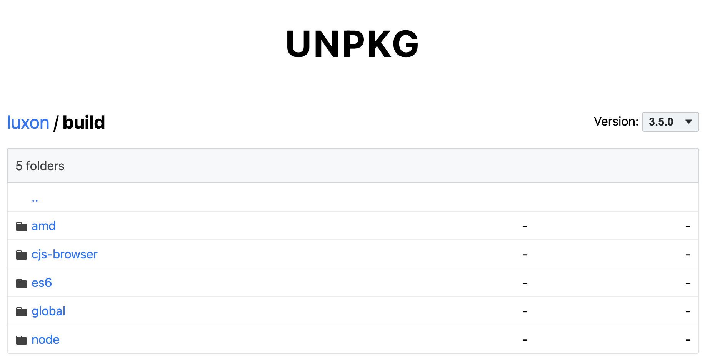

---
{
  title: "Writing Modern JavaScript without a Bundler",
  description: "",
  published: "2024-11-18T21:52:59.284Z",
  tags: ["javascript", "webdev"],
  license: "cc-by-4",
}
---

Modern web development is awesome. We've never had a period of time where our tools enable us to move faster, ship less bugs, and make great web apps.

But while tools like Vite and Webpack are extremely powerful and can provide a better user experience (UX), they can often feel like they're getting in the way of rapid prototyping.

Let's explore how we can build a website using many of the conveniences of a Vite app while remaining buildless.

In this article, we'll learn how to:

- Set up pre-requisites for local web development
- Import JavaScript files from a script tag
- Adding a flavor of "hot module reloading" (HMR) to reload our code in development for better developer experience (DX)
- Import libraries from CDNs
- Move away from CDNs and leverage NPM to install modules
- Pick a framework that supports no-build environments
- Use dependencies that might otherwise not work through micro-bundling
- Use tools like TypeScript and ESLint without adding a build step

Without further ado, let's dive in!

# Setting up Pre-Requisites

Let's first set up the initial bit of tooling required to run a webpage locally. We'll start with a `package.json` file:

```json
{
	"name": "your-name-here",
	"private": true,
	"version": "0.0.0",
	"scripts": {
		"start": "http-server -c-1 src"
	},
	"devDependencies": {
		"http-server": "^14.1.1"
	}
}
```

> We're adding `-c-1` to disable caching. This means that you can refresh the page when you've made changes and it'll automatically show the newest results instead of caching them for an hour.

Then create a `src` folder so we don't mix up our source code files with other files we'll add later:

<!-- ::start:filetree -->

- `src/`
  - `index.html`
- `package.json`

<!-- ::end:filetree -->

And finally, we'll create our `index.html` file with a `Hello world` message:

```html
<!doctype html>
<html lang="en">
	<head>
		<meta name="viewport" content="width=device-width" />
		<meta charset="utf-8" />
		<title>Basic Setup</title>
	</head>

	<body>
		<p>Hello, world!</p>
	</body>
</html>
```

Now we can `npm run start` from root and get a basic web server at `http://127.0.0.1:8080/`.

<iframe data-frame-title="Basic Setup - StackBlitz" src="pfp-code:./basic-setup?template=node&embed=1&file=src%2Findex.html"></iframe>

> Remember, when you make changes you'll need to refresh the page to see them loaded. We'll explore how to fix that in a later section of this article.

# Import JS files From a Script Tag

Managing multiple files in older vanilla JavaScript projects used to be a pain. Luckily, modern browsers support the `import "something.js"` syntax that we can now use to manage multiple files.

To use this, we need to denote our `script` tag (from our HTML file) as `type="module"`:

```html
<script type="module" src="script.js"></script>
```

Once this is done, we can add `import` statements in our JS files:

```javascript
// script.js
import template from "./template.js";

const root = document.getElementById("root");
root.innerHTML = template;
```

> Something worth noting is that you need to have the `.js` identifier at the end of your `import` statement, otherwise the browser will not know where to look.

<iframe data-frame-title="JS Files Script Tag - StackBlitz" src="pfp-code:./js-files-script-tag?template=node&embed=1&file=src%2Fscript.js"></iframe>

# Introducing HMR for Vanilla JavaScript Apps

It's neat that we're able to load JavaScript files without a bundler, but if you spend much time in our environment you'll likely yearn for a solution that reloads the page whenever you modify the files in use.

Luckily for us, there's a different web server that can handle this for us: `browser-sync`.

Let's change it in our `package.json`:

```json
{
	"name": "your-name-here",
	"private": true,
	"version": "0.0.0",
	"scripts": {
		"start": "browser-sync start --server \"src\" --watch --no-ui"
	},
	"devDependencies": {
		"browser-sync": "^3.0.3"
	}
}
```

And see as the page refreshed while we modify any of the files in `src`:

<iframe data-frame-title="HMR - StackBlitz" src="pfp-code:./hmr?template=node&embed=1&file=src%2Fscript.js"></iframe>

# Using CDNs to load libraries

Most apps require a fair number of libraries to get up-and-running. Let's load in a date library, [Luxon](https://moment.github.io/luxon/), to handle our dates in a nicer way.

To do this, we can use a CDN like [unpkg.com](https://unpkg.com/) to load in the files required to run the library in our app.

If we go to [https://unpkg.com/luxon](https://unpkg.com/luxon), we'll see a loaded bit of JavaScript:


However, this isn't the format we need the library in. Remember, we need to have `import` and `export` lines, ideally without any additional `import` statements for ease-of-setup (more on that later in the article).

To find this, we're looking for files labeled something like `ES6` or `ESM` or `BROWSER`, like so:

[https://unpkg.com/browse/luxon@3.5.0/build/es6/luxon.js](https://unpkg.com/browse/luxon@3.5.0/build/es6/luxon.js)

To find these files, you can use the `browse` feature of Unpkg by adding `browse` at the start of the URL:



> Not all libraries are bundled to support ESM in this way as a single file. If it does not, you can add compile the dependency to support it, as we'll touch on later.

Once we find the right file, we need to make sure to use the raw file:

[https://unpkg.com/luxon@3.5.0/build/es6/luxon.js](https://unpkg.com/luxon@3.5.0/build/es6/luxon.js)

Instead of:

[https://unpkg.com/browse/luxon@3.5.0/build/es6/luxon.js](https://unpkg.com/browse/luxon@3.5.0/build/es6/luxon.js)

Then we can import from this URL like any other import:

```javascript
// script.js
import { DateTime } from "https://unpkg.com/luxon@3.5.0/build/es6/luxon.js";

const root = document.getElementById("root");

const date = DateTime.now()
	.setZone("America/New_York")
	.minus({ weeks: 1 })
	.endOf("day")
	.toISO();

root.innerText = date;
```

<iframe data-frame-title="CDN - StackBlitz" src="pfp-code:./cdn?template=node&embed=1&file=src%2Fscript.js"></iframe>

# Aliasing modules

The `script.js` file above works in-browser, but doesn't look quite right to anyone that's done modern JS. Moreover, if you wanted to use a different version of `luxon`, you'd have to track all imports from this URL and update them one-by-one.

Let's instead alias that URL to be imported when we `import "luxon"`. To do this, we'll leverage an `importmap`:

```html
<!doctype html>
<html lang="en">
	<head>
		<meta name="viewport" content="width=device-width" />
		<meta charset="utf-8" />
		<title>Import Map</title>
		<script type="importmap">
			{
				"imports": {
					"luxon": "https://unpkg.com/luxon@3.5.0/build/es6/luxon.js"
				}
			}
		</script>
	</head>

	<body>
		<div id="root"></div>
		<script type="module" src="/script.js"></script>
	</body>
</html>
```

And modify our `script.js` file to import from that path:

```javascript
// script.js
import { DateTime } from "luxon";

const root = document.getElementById("root");

const date = DateTime.now()
	.setZone("America/New_York")
	.minus({ weeks: 1 })
	.endOf("day")
	.toISO();

root.innerText = date;
```

<iframe data-frame-title="Import Map - StackBlitz" src="pfp-code:./importmap?template=node&embed=1&file=src%2Fscript.js"></iframe>

# Installing Libraries from NPM

// TODO: Write


# Adding support for incompatible modules

// TODO: Migrate to loads

While many libraries are properly packaged to be bundled in a single ESM file, others are not. Let's take `lodash-es` as an example:

```shell
pnpm install lodash-es
```

This gives us a `src/vendor/dayjs` folder that looks like this:

<!-- ::start:filetree -->

- `esm/`
	- `locale/`
		- `en.js`
		- `es.js`
		- `fr.js`
		- `...`
	- `plugin/`
	- `constant.js`
	- `index.d.ts`
	- `index.js`
	- `utils.js`
- `locale`
- `CHANGELOG.md`
- `dayjs.min.js`
- `index.d.ts`
- `package.json`
- `README.md`

<!-- ::end:filetree -->


While we could importmap all of the relative imports: TODO: SHOW THAT AND EXPLAIN WHY BAD

# Picking the right framework

<!-- ::start:tabs -->

## Angular

Not possible without a compiler to bundle the template.

## React

Technically possible to use without JSX:

```
React.createElement(Element, propsObject, childrenArray)
```

// TODO: Add iframe

But it's not a pretty API at scale; practically infeasible.

## Vue

- Cannot use SFCs
- Must add components via `components: {}` property

## Lit

- Cannot use decorators, must be replaced with `static get` properties
- Must call `customElements.define` manually

<!-- ::end:tabs -->


# Using TypeScript and ESlint

// TODO: Write
