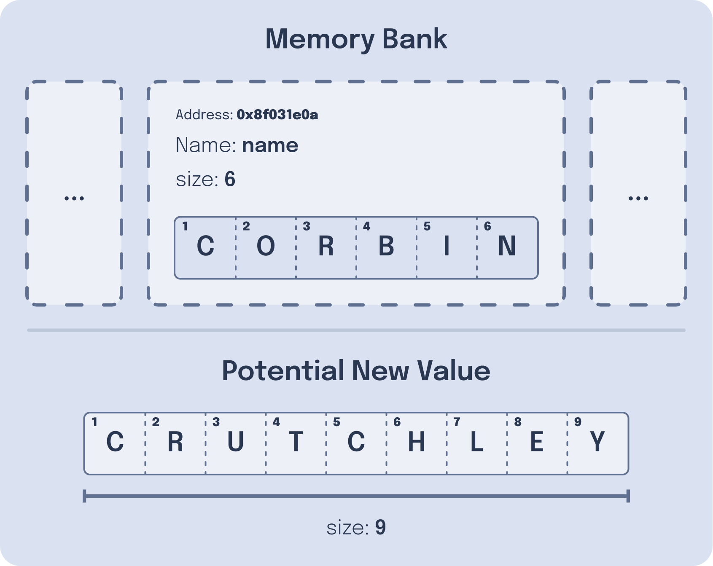
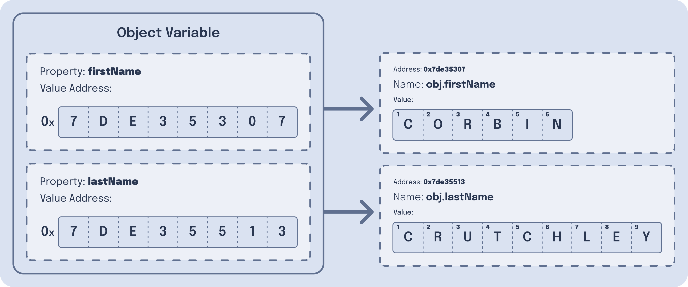

---
{
	title: "What is Object Mutation in JavaScript?",
	description: 'When working with objects, you may hear the term "mutation". What is that? How does it work? How do let and const REALLY differ from each other? This and more:',
    published: '2023-03-25T19:12:03.284Z',
    edited: '2023-12-14T19:12:03.284Z',
	tags: ['javascript'],
	license: 'cc-by-nc-sa-4'
}
---

Recently, we rewrote [our community blog for "Unicorn Utterances"](/) to use [Astro, a static site generator framework](https://astro.build). One of the fan-favorite features of the site is its dark mode toggle, which enables dark mode purists to gloat over the light mode plebians (like myself).

<video src="./theme_toggle.mp4" title="Toggling the dark mode theme on the Unicorn Utterances site"></video>

> For real though, support light mode in your sites and make them the default setting - [it's a major accessibility concern](https://www.vice.com/en/article/ywyqxw/apple-dark-mode-eye-strain-battery-life).

In the migration, I wrote some code to trigger a dark mode toggle:

```javascript
// ...
const initialTheme = document.documentElement.className;
toggleButtonIcon(initialTheme);

themeToggleBtn.addEventListener('click', () => {
  const currentTheme = document.documentElement.className;
  document.documentElement.className =
              currentTheme === 'light' ? 'dark' : 'light';

  const newTheme = document.documentElement.className;
  toggleButtonIcon(newTheme);
})
```

While writing this, I thought:

> That's an awful lot of `document.documentElement.className` repeated. What if we consolidated it to a single variable of `className`?

```javascript
// ...
let theme = document.documentElement.className;
toggleButtonIcon(theme);

themeToggleBtn.addEventListener('click', () => {
  theme = theme === 'light' ? 'dark' : 'light';

  toggleButtonIcon(theme);
});
```

Awesome! Code looks a lot cleaner, now to go and test it...

<video src="./no_theme_toggle.mp4" title="Suddenly, toggling the dark mode theme doesn't work, no matter how much I click"></video>

Uh oh. It's not toggling anymore! 😱

> Why did that code break? We made such a simple refactor?!

This migration of code broke our theme switching thanks to the underlying properties of "object mutation".

> What's "object mutation"?

Let's talk about that. Along the way, we'll touch on:

- [How memory addresses are stored in-memory](#variable-storage)
- [The differences between `let` and `const` (including one you might not expect)](#let-vs-const)
- [How to perform memory mutation](#mutation)
- [How to fix our code](#code-impact)


# How variables are assigned to memory addresses {#variable-storage}

To understand object mutation, we first need to conceptualize how JavaScript handles variable creation.

In one of my blog posts called ["Functions are values", I talk about how variables are stored in memory](/posts/javascript-functions-are-values). In that article, I specifically talk about how, when you create JavaScript variables, they create a new space in memory.

Say that we wanted to initialize two variables:

```javascript
var helloMessage = "HELLO";
var byeMessage = "SEEYA";
```

When we run this code, it will create two "blocks" of memory to store these values [into our RAM, the short-term memory of our computer](/posts/how-computers-speak#ram). This might be visualized like so:


These memory blocks then can be referenced in our code by using their variable name (`helloMessage` and `byeMessage` respectively). It is important to note, however, a few things about these memory blocks:

1. They have a size.

   Each of these memory blocks has an amount of system memory they consume. It can be a very small amount of data (like storing a small string as we're doing here), or a huge amount of data (such as keeping a movie's video file in memory)

2. They have a lookup address.

   Very generally, this lookup address is simply the memory location of where a variable starts. This lookup address may be called a "memory address" and may be represented as a number of bits counting up from `0`.

3. These memory addresses can be re-used.
   If explicitly told to, a computer can change the values of an existing memory block.

4. These memory addresses/blocks can also be freed up when they're no longer needed.
   In some languages, this is done manually while other languages do this (mostly) automatically.

5. Once freed, these memory addresses/blocks can be re-used.

## Reassigning variables

Let's say we want to reassign the variable of `helloMessage` to `'HEYYO'`:

```javascript
var helloMessage = "HELLO";
var byeMessage = "SEEYA";

helloMessage = "HEYYO";
```

In this code sample, the first two lines:

1) Creates a `helloMessage` variable.
   - Which, in turn, creates a memory block (say, `0x7de35306`)
   - The characters that make up the string `"HELLO"` are placed in this memory block
2) Creates a `byeMessage` variable.
   - This also creates a memory block (`0x7de35307`)
   - Which contains the string `"SEEYA"`

After these two instructions are executed, we find ourselves reassigning the variable of `helloMessage` to `HEYYO`. While it might be reasonable to assume that the existing `helloMessage` memory block is changed to reflect the new string, that's not the case.

Instead, the reassignment of `helloMessage` creates a _new_ memory block, adds it to the end of the memory stack, and removes the old memory block.

<video loop="false" title="When reassigning a variable, you pop off the old value from the memory stack and assign the new value to a different memory address" src="./let-reassign-variable.mp4"></video>

Once this is done, the `helloMessage` variable points to a new memory address entirely, despite being called the same variable name.

This may seem unintuitive at first until we remember: memory addresses have sizes.

> What does this mean for us?

Think about how the above memory is aligned in the above chart; Ideally, to utilize as much memory in your machine as possible, data should be side-by-side in your RAM. This means that if you have a memory address starting at memory address `10` and it takes up `13` bytes, the next memory address should start at `23`.

If you change the length of one memory block, you may have to shift over other blocks or rearrange their positioning. This can be a very expensive operation for your computer.

Since they're the same length strings, we could theoretically just reassign our `HELLO` memory block to say `HEYYO`. This isn't always the case, however, since strings can vary in length.

While `HELLO` and `HEYYO` are the same length, what happens if we tried to do this?

```javascript
var helloMessage = "HELLO";
helloMessage = "THIS IS A LONG HELLO";
```

 In this example we would need to create a new memory block _anyway_, since it doesn't hold the same value length as before.

> But why doesn't our computer check if it's the same length before and decide to reassign the memory block or create a new one?  

Well, as mentioned previously, your computer doesn't _inherently_ know what the size of `helloMessage` is. After all, the variable simply points to a memory address. To get the length of the memory block, you need to read the value and return the length to the rest of the computer.

So, in order to re-use existing blocks you would need to:

1. Read the value of the existing `helloMessage` memory block.
2. Calculate the length of said memory block.
3. Compare it against the new value's length.
4. If they're the same, reuse the existing block.
5. If not, then create a new block and cleanup the old one.

Remember, each of these executions takes time. While they're inexpensive on their own, if ran extremely frequently, even tiny fractions of time can add up.

Compare that list of 5 items against the "create a new block every time" implementation:

1. Create a new block of memory and clean up the old one.

A much smaller list, right? This means that our computer is able to execute this faster than the other implementation.


# `let` vs `const` {#let-vs-const}

If you've spent much time with the JavaScript ecosystem, you'll know that there are a few different ways of assigning a variable. Among these are the `let` and `const` keywords. Both of these are perfectly valid variable declarations:

```javascript
const number = 1;
let otherNumber = 2;
```

 But what's the difference between these two types of variables?

Now, you might assume that `const` stands for `constant`, and you'd be right! We can easily check this by running the following:

```
const val = 1;
val = 2;
```

Will yield you an error:

> Uncaught TypeError: invalid assignment to const 'val'

This differs from the behavior of `let`, which lets you reassign a variable's value to your heart's content:

```javascript
let val = 1;
// This is valid
val = 2;
val = 3;
```

After seeing this behavior with `const`, you might think that you can't change data within a `const`, but (surprisingly), you'd be wrong. The following creates an object and then reassigns the value of one of the properties, despite the variable being a `const`:

```javascript
const obj = {val: 1};
// This is valid?! 😱
obj.val = 2;
```

Why is this? Isn't `const` supposed to prevent reassignments of a variable?!

The reason we're able to change the value of `obj.val` is because we're not reassigning the `obj` variable; we're mutating it.

# Variable Mutation {#mutation}

> What is mutation?

Mutation is the act of replacing a variable's value in-place as opposed to changing the memory reference.

> What. 😵‍💫

OK so picture this:

You have a string variable called "name" that has a memory address at `0x8f031e0a`.

```javascript
let name = "Corbin"; // 0x8f031e0a
```

When you reassign this variable to "Crutchley", it will change the memory address, as we've established before:

```javascript
name = "Crutchley"; // Changed to 0x8f031e0b
```

But what if, instead, you could simply tell JavaScript to change the value within the _existing_ memory block instead:

```javascript
// This code doesn't work - it's for demonstration purposes of what a theoretical JavaScript syntax could look like

const name = "Corbin"; // 0x8f031e0a
*name = "Crutchley"; // Still 0x8f031e0a
```

JavaScript could theoretically even use a syntax like this to expose a variable's memory address:

```javascript
// This code doesn't work - it's for demonstration purposes of what a theoretical JavaScript syntax could look like
const name = "Corbin"; // A const string variable, creates a new memory block, but at what address?

// Outputs: `0x8f031e0a`
console.log(&name); // Prefixing & could show the memory address `name` was assigned to!
```

> Some languages, [such as Rust](https://doc.rust-lang.org/std/primitive.pointer.html) and C++ _do_ have this feature, it's called a "pointer" and allows you to change the value of a memory block rather than create a new memory block with the new value you'd like to assign.

<!-- in-content-ad title="Consider supporting" body="Donating any amount will help towards further development of articles like this." button-text="Visit our Open Collective" button-href="https://opencollective.com/unicorn-utterances" -->

This is essentially what's happening with our `const obj` mutation from the previous section. Instead of creating a new memory space for `obj`, it's reusing the existing memory block it already has assigned to `obj` and is simply changing the values within it.

```javascript
// This creates a memory block to place `obj` into
const obj = {a: 123};
// This keeps the same memory block of "obj", but changes the value of "a" in place*
obj.a = 345;
```

There's one small problem with the example we used in this section, however; you cannot mutate strings.

```javascript
const name = "Corbin";
// This does not work, and will throw an error
name = "Crutchley";
```


## Why can't you mutate strings? {#no-mutate-primitives}

Consider what's happening inside of a JavaScript engine when we execute the following code:

```javascript
const name = "Corbin";
```

In this code, we're creating a variable with the length of 6 characters. These characters are then assigned to a memory address, say, `0x8f031e0a`. Because your computer wants to preserve as much memory as possible, it will create a memory address just large enough for 6 characters to be stored in `name`'s memory block of `0x8f031e0a`.

> Remember, while we tend to think of strings in JavaScript as a single value - not all strings have the same size when stored!
>
> A string with a length of 6 characters is going to take up less space than a string with 900,000 characters.

Now, let's try to assign the string "Crutchley", which has a length of 9 characters, into that same memory block:



Oh no! Here, we can see that the new value we'd like to store is too large to exist in the current memory space!

This is the key reason we can't mutate strings like we can objects; **To reuse an existing memory block, you have to make sure that the new value is the same size as the existing memory block**, and strings cannot assure this truth like objects can.

This rule holds true for all [JavaScript primitives](https://developer.mozilla.org/en-US/docs/Glossary/Primitive) as well.

## Object Mutation {#obj-mutation}

> Wait, if you can't quickly change the size of a memory block, why can we mutate objects?

Well, you see, objects in JavaScript are typically\* stored as a mapping of property names and the associated variable's memory address.

Image we have the object of `user` like so:
```javascript
{
    firstName: "CORBIN",
    lastName: "CRUTCHLEY"
}
```

This object might look something like the under-the-hood:



This means that when we change `user.firstName`, we're actually constructing a new "hidden" variable, then assigning that new variable's memory address to the `firstName` property on the object:

```js
// This will create a new variable internally
// Then assign the new variables' version to the `user` field
user.firstName = "Cornbin";
```

By doing so, we're able to create new variables with different memory sizes but still keep the object's member location referentially stable. 

> This is a lot of handwaving going on and is more complex then this when adding or removing properties dynamically. The problem with getting more in-depth than this is that it gets complicated **fast**.
>
> If you still want to learn more, I recommend checking out [this deep dive in V8's (Chrome and Node.js's JS engine) internals.](https://mrale.ph/blog/2015/01/11/whats-up-with-monomorphism.html)

## Arrays are objects too! {#arrays}

It's worth highlighting that the same rules of object mutation apply to arrays as well! After all, in [JavaScript arrays are a wrapper around the `Object` type](https://developer.mozilla.org/en-US/docs/Web/JavaScript/Reference/Global_Objects/Array). We can see this by running `typeof` over an array:

```javascript
typeof []; // "object"
```

This means that we can run operations like `push` that mutate our arrays, even with `const` variables:

```javascript
const arr = [];
// This is valid
arr.push(1);
arr.push(2);
arr.push(3);

// Even though this is not
const otherArr = [];
otherArr = [1, 2, 3];
```

# Why did this impact our code? {#code-impact}

Let's look back at the original problem this article posed. When we changed out code from this:

```javascript
// ...
const initialTheme = document.documentElement.className;
toggleButtonIcon(initialTheme);

themeToggleBtn.addEventListener('click', () => {
  const currentTheme = document.documentElement.className;
  document.documentElement.className =
              currentTheme === 'light' ? 'dark' : 'light';

  const newTheme = document.documentElement.className;
  toggleButtonIcon(newTheme);
})
```

To this:

```javascript
// ...
let theme = document.documentElement.className;
toggleButtonIcon(theme);

themeToggleBtn.addEventListener('click', () => {
  theme = theme === 'light' ? 'dark' : 'light';

  toggleButtonIcon(theme);
});
```

Our theme toggle selector broke. Why? Well, it has to do with object mutation.

When our original code did this:
```javascript
document.documentElement.className = currentTheme === 'light' ? 'dark' : 'light';
```

We're explicitly telling `document.documentElement` object map to change the variable location of `className`.

However, when we changed this to:

```javascript
let theme = document.documentElement.className;
// ...
theme = theme === 'light' ? 'dark' : 'light';
```

We're creating a _new_ variable called `theme` and changing the location of `theme` based on the new value. Because `className` is a string, [which is a JavaScript primitive and not an object](https://developer.mozilla.org/en-US/docs/Glossary/Primitive), it won't mutate `document.documentElement` and therefore won't change the `HTML` tag's class.

To solve this, we should revert our code to mutate `document.documentElement` once again.

# Conclusion

Hopefully this has been an insightful look into how JavaScript's `let`, `const`, and object mutations work.

If this article has been helpful, maybe you'd like [my upcoming book called "The Framework Field Guide", which teaches React, Angular, and Vue all at once (for free!)](https://framework.guide).

Either way, I hope you enjoyed the post and I'll see you next time!
