---
{
	title: "How we built our custom semantic search page",
	description: "",
	published: '2024-11-04T13:45:00.284Z',
	tags: ['webdev', 'javascript']
}
---

> As part of our partnership with Orama, this blog post was sponsored and financially compensated for by Orama. This doesn't invalidate our learnings from this post, but if you'd like to read more, you can [check our disclosure of our partnership with Orama to learn more.](#)

On [October 20th, 2023 we launched a major redesign](https://github.com/playfulprogramming/playfulprogramming/pull/497). Not only did this redesign massively facelift all of the pages we had built previously:

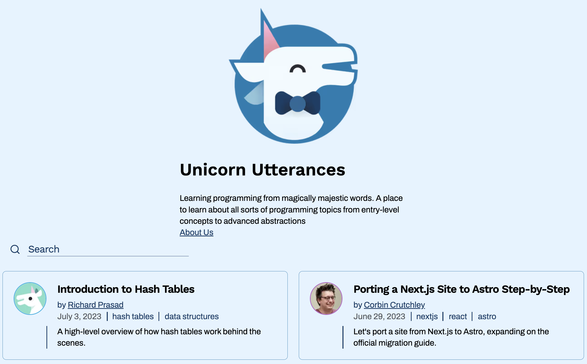

> [Unicorn Utterances was our old name, which you can learn more about here.](/posts/rebrand-to-playful-programming)

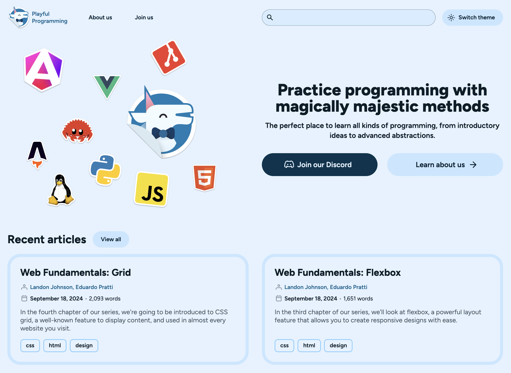

But during this process we decided to flesh out some functionality we had previously. For example, while our old site had the concept of a "collection", they weren't exposed anywhere on our site; not on the homepage, not via search, etc.

In the new site, we have this banner of collections on the homepage and they show up in our searches (more on that later):

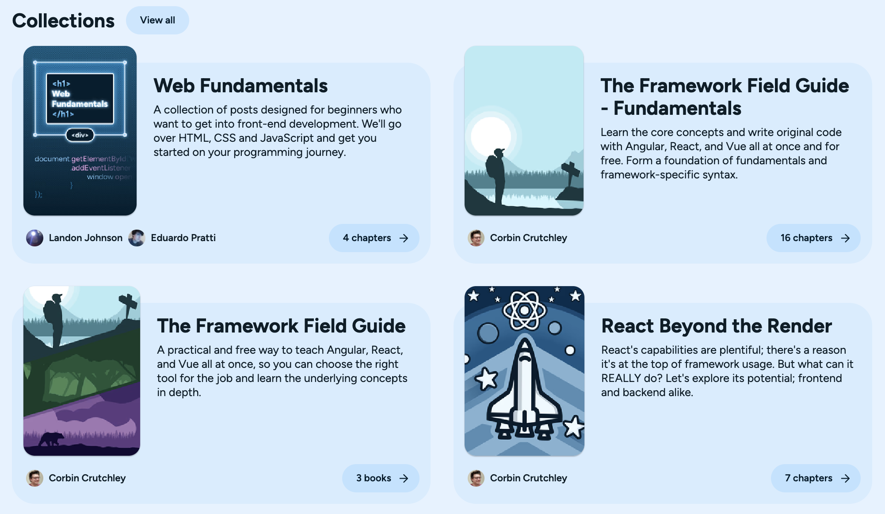

One of the features we embarked on improving was search.

# Improving search UX

On the previous site, you could only make a search on the homepage. It was clunky, didn't have many of the features people wanted (like tags filtering), and wasn't scalable.

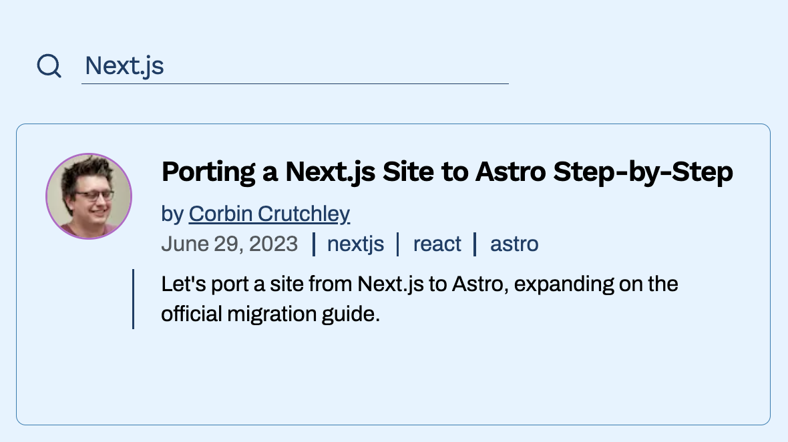

> Yup, that was the entire search experience.

To solve this, we worked hard on a new search experience with a dedicated search page powered by [Preact](https://preactjs.com/), [React Aria](https://react-spectrum.adobe.com/react-aria/), and [TanStack Query](https://tanstack.com/query/). It featured:

- A brand new design
- Ability to sort by date
- Collections in search
- Filters on tags and authors
- Mobile view

And more.

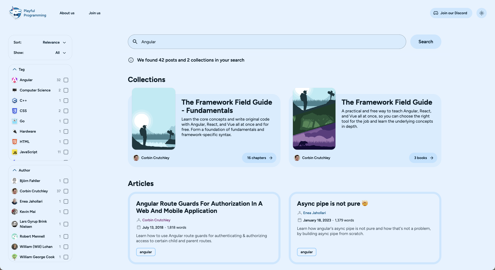

# Scalability Concerns

Earlier, we mentioned that the old search page wasn't scalable.

The reason it wasn't scalable was because we were using a JavaScript package fully on the client-side via [Lunr.js](https://lunrjs.com/). This meant that as we added articles to the site, the more JavaScript we had to download on each client-load to index all of the articles. We even did this if you didn't use search yet.

To solve this, we both:

- Migrated to a slightly heavier package with better search results (in our experience): [Fuse.js](https://www.fusejs.io/)
- Moved the searching to the server via a simple Vercel serverless function

 This alliviated our scalability concerns, since we were only needing to ship the required information down to the search page based on the request.

We did this through a faily trivial pipeline:

1) Store all of our content in markdown in our Git repository
2) During the build of the static parts of the Playful Programming site, build a `searchIndex.json` file that acts as a database of our articles
3) Consume the `searchIndex.json` file via a `fs.readFile` method in our serverless function
4) Deploy the static file and serverless functions via Vercel

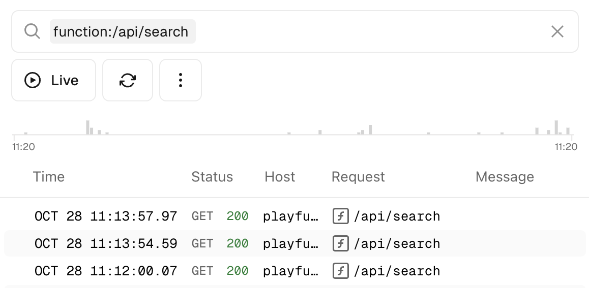

This worked well for an initial implementation, but to keep things simple for an MVP, we initially avoided:

- Sever-side pagination
- Server-side filtering
- Counting article results on the server

We knew we could fix this in a follow-up, but this would've required more work.

In addition, we weren't entirely happy with the search results. For example, searching `"AST"` showed unrelated articles instead of Corbin's article of ["How Computers Speak: Assembly to AST"](/posts/how-computers-speak)

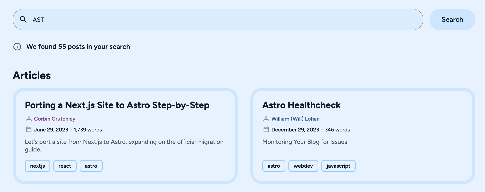

Similarly, any searches that include a more conversational tone, like `"articles that explain how effects work in React"` would either return unrelated items or nothing at all:

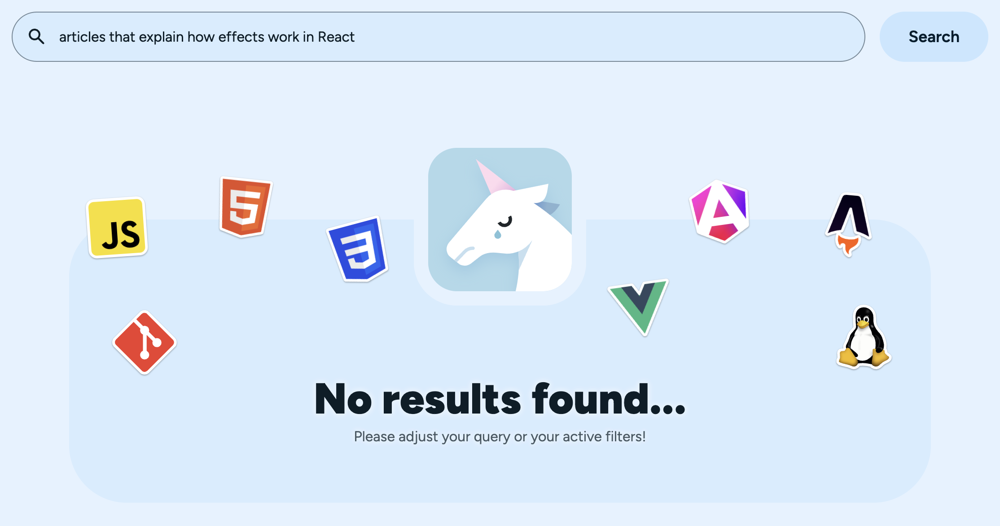

# Fixing Search Results

To solve these issues, we reached out to [Orama](https://orama.com/). Corbin had worked with them previously with his work on [the TanStack docs site](https://tanstack.com/) and knew that they could solve the challenges we were facing.

While Orama has an incredibly powerful built-in UI:

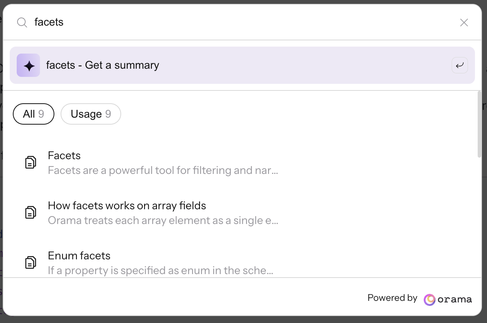

We didn't want to give up on the custom UI we'd built.

Luckily, [Orama provides a great JavaScript SDK that we could utilize for our needs: `@oramacloud/client`](https://docs.orama.com/cloud/integrating-orama-cloud/javascript-sdk).

To use it, we exposed our database of articles via a remote JSON that's deployed via CI/CD:

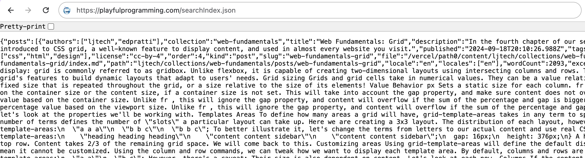

We point Orama at this JSON endpoint:

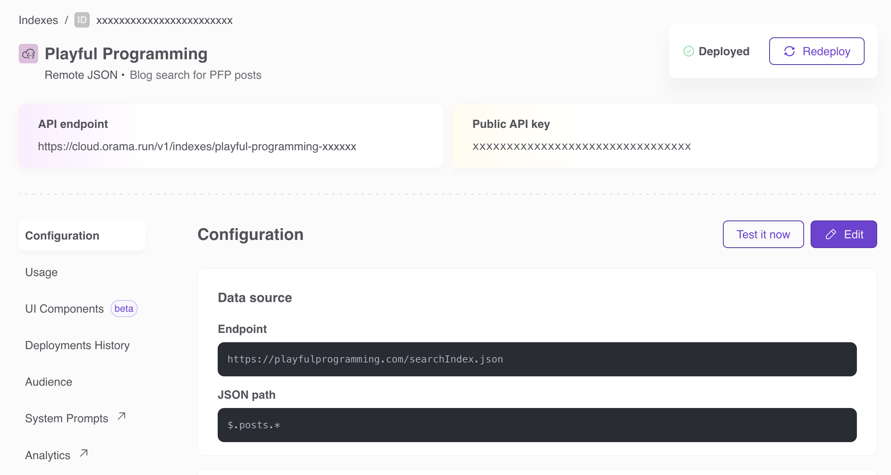

> Orama will regularly check this remote JSON endpoint of ours to make sure that it's the most up-to-date data as needed.

Then, we initialize the Orama client like so:

````javascript
const postClient = new OramaClient({
    endpoint: ORAMA_POSTS_ENDPOINT,
    api_key: ORAMA_POSTS_API_KEY
});
````

And can call this client with a simple search term, complete with pagination and more:

````javascript
postClient.search(
    {
        term: "articles that explain how effects work in React",
        limit: 6,
        offset: 6 * pageIndex,
    },
);
````

Once this was done in our codebase, our search results were immediately improved:

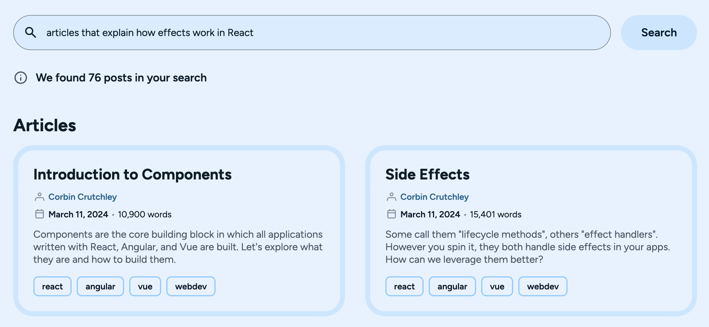