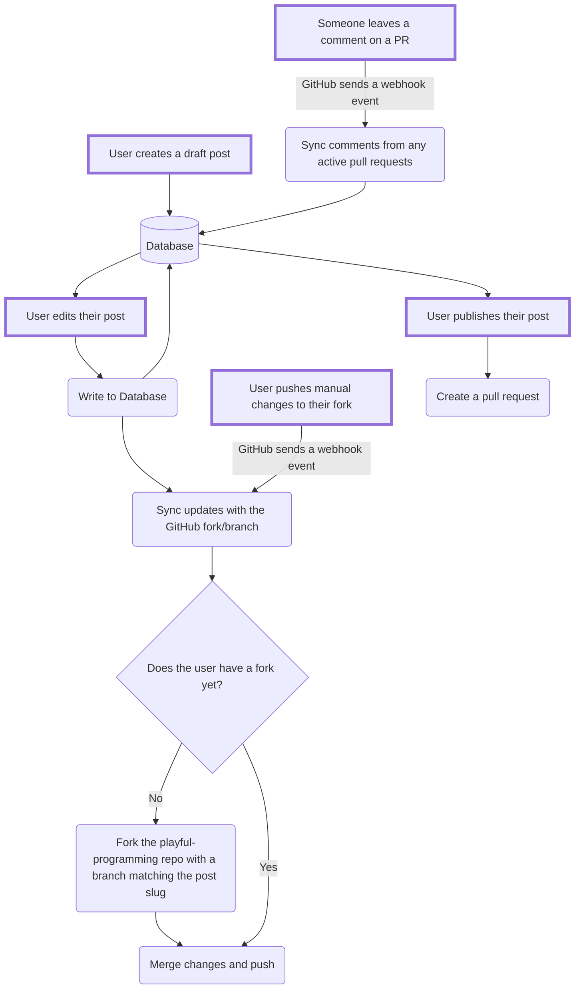

---
{
	title: "Building a CMS for Playful Programming",
	description: "",
	published: '1999-09-19',
	tags: [],
	license: 'cc-by-nc-sa-4',
	noindex: true
}
---

Today, to write an article for Playful Programming, [you have to make a pull-request against our codebase with valid markdown](https://github.com/playfulprogramming/playfulprogramming/blob/main/CONTRIBUTING.md#writing-a-new-post). 

Put frankly, this isn't very accessible for many folks. Even if you are familiar with Git, there's something to be said about having a nice GUI experience that requires less work than making a pull request, committing, and more.

Made worse, while we support [custom components](https://github.com/playfulprogramming/playfulprogramming/blob/main/FEATURES.md), their syntax can be hard to remember and there's no clear indication until build-time that the syntax for them is correct.

To solve this, we're building our own CMS to improve our post authoring experience.

# Why build your own CMS?!

> Whoa whoa whoa. Building a CMS is a huge endeavor. There's a ton of good CMSes out there. Why build your own?

While, yes, there are many good picks for a CMS; we've found that none quite fit the bill for us (more on that soon).

Here's what we're primarily looking for and why:

- Git-first (Git as source of truth)
  - We never want to vendor-lock-in any of our authors to our platform. This means that their data has to be publicly visible in case something ever happens to our relationship.
- Markdown-first (no MDX or others)
  - Likewise, we want to keep our contents markdown-compliant so you're able to copy+paste contents from Playful to another platform and retain the core contents (sans custom components).
- Custom components support.
  - Making our posts interactive and fun is one of the main objectives of Playful Programming.

- Support non-approved authors.
  - We can't have a strict allow-list of who we want to write for us; we want to open it up to anyone to join us.

- Require approval before publishing
  - We don't want to allow trolls or drastically increase the amount of required moderation needed for what's on the site. 

While most of this can be done fairly easily with Git-first CMSes, we also have some other requirements we want to add in the future as well:

- Multiplayer
- Offline editing

Which are more commonly found in API-first CMSes.

We want the best of both worlds.

> You can [read more about the differences between Git-first and API-first CMSes in this article](https://strapi.io/blog/git-based-vs-api-first-cms).

# What other options have you explored?

We aren't kicking off our project without looking into other tools. Let's look at some of the other CMSes we've looked into from most in-depth researched to the options we researched the least:

## Decap CMS

Previously called Netlify CMS, Decap CMS fits the bill for most of the things we've looked at.

Not only does it support Git-based markdown content, but it has a feature called ["open-authoring" - a Git-based way to allow third-party authors](https://decapcms.org/docs/open-authoring/).

We got so far into looking into Decap CMS that [we previewed it in a branch off of our website.](https://github.com/playfulprogramming/playfulprogramming/compare/main...decap-cms)

-----------

However, it's not all perfect. Namely, Decap CMS doesn't seem to have good support for custom-components; especially not using the same Markdown-comment-style syntax we'd like to use.

> While it's clear that no solution is going to fit your bill 100%, maybe Decap would be a good base to fork from? It's [MIT](LINK TO THEIR REPO) after all.

Well, after looking into it, no.

All of their main components (GH interop, Local Git stuff, FE, et al) appear to be at least 2 years old

The FE is not the most modern (JS, not TS, Emotion, Redux **4**, et al)

And while the frontend seems sorta big (15K LOC at a **super** rough glance), the BE comparatively doesn't:

- 4K for their GH interop
- 1.5K for other Git glue
- 2K for their local Git interop

## Tina CMS

https://tina.io/

**Pros**:

- Git-based
- Open-source
- Good auth provider selection
  - Useful for our needs of non-GitHub permitted users needing to authenticate

**Cons**:

- UI relies heavily on "see what you edit"; good for sites - not for blogs.
- Uses MDX for custom components
- Doesn't allow external authors
- No CRDT usage

Given how heavily we'd need to rework the frontend to match our blog-first needs, we'd probably start from scratch.

The primary part of the backend, despite having lots of good, is only about 9k LOC and doesn't include much of the infrastructure for features we'd want to add or even have for `v1`.

## Keystatic

**Pros**:

- Git-based
- MIT Licensed
- Support for both MDX and ???
- Incredibly up-to-date and polished codebase
- Good UI
  - Doesn't matter - we'd reskin it for our needs
- Immensely flexible data schema customization
- Pre-built Astro support

**Cons**:

- No backend
  - This makes the `fork our repo from our singleton CMS instance` is a no-go

https://keystatic.com/

## Keystone

**Pros**:

- MIT Licensed
- Amazing rich-text editor 
- Good UI
  - Doesn't matter - we'd reskin it for our needs
- Immensely flexible data schema customization

**Cons**:

- No Git backing
- No ability to save output to files instead of `db` tables/schema
- No support for non-approved authors

## Ghost CMS

**Pros**:

- MIT Licensed

**Cons**:

- Using [a very old version of Ember for most of its frontend](https://github.com/TryGhost/Ghost/issues/21692)
- Not Git-based
- No external user permissions

## Payload CMS

**Pros**:

- MIT Licensed

**Cons**:

- Not Git-based
- Permissions issues

## Strapi

**Cons**:

- [Questionable OSS license](https://github.com/strapi/strapi/blob/develop/LICENSE)
  - Changes license based on folder you're in, includes important parts of the codebase
- Not Git-based
- Permissions issues

# What are you building?

## `v1`

- Drafts (in git) are *indexed* in a db (postgres or mysql or whatever TBD)
- Either: 
  - Keep a CRDT in the db (with Redis cache?) for persistence
  - Store CRDT for active "editor sessions" in Redis -> commit to local git once closed?
- Intermittently push updates to an upstream github repository/fork
- Pulling updates to draft/edited posts from the repo back into currently-drafted posts
- Live in-CMS preview
- Creating a PR (from local git to GitHub) through GH sign-in

## `v2`

- Multi-user editing
- UI for feedback comments
- Editing existing posts by pulling them from the repo
- Offline support: https://docs.yjs.dev/ecosystem/database-provider/y-indexeddb
- Stored draft editor history: https://docs.yjs.dev/api/undo-manager

# How will it work?

Here's a rough flow chart of the planned functionality:

-------

- Decided to explore https://docs.yjs.dev/ as a CRDT/merge implementation - https://github.com/y-crdt/y-crdt is its wasm/rust port vs. https://automerge.org/
- Using a CRDT only for active "editor sessions" and storing one copy (+ syncing to git) might be preferable? The use-cases where the *server* would need to interact with the CRDT itself would be minimal. In which case I believe it could be client-only?
- If a git update occurs in the upstream GitHub repo, it can simply overwrite the local draft - assuming it was previously up to date with the repo. (i.e. its revision history would be saved)
- If a git update occurs from upstream when an editor session is active, there could be a prompt on the client(similar interactions in vscode/intellij when the filesystem changes with an open editor)
- TBD: I still think that placing revisions in local git repos when on the CMS is unnecessary. These could be stored in a database (with revisions) and synced with the remote (github). This could take advantage of search indexing, reliability of database transactions, consolidated backups, etc.