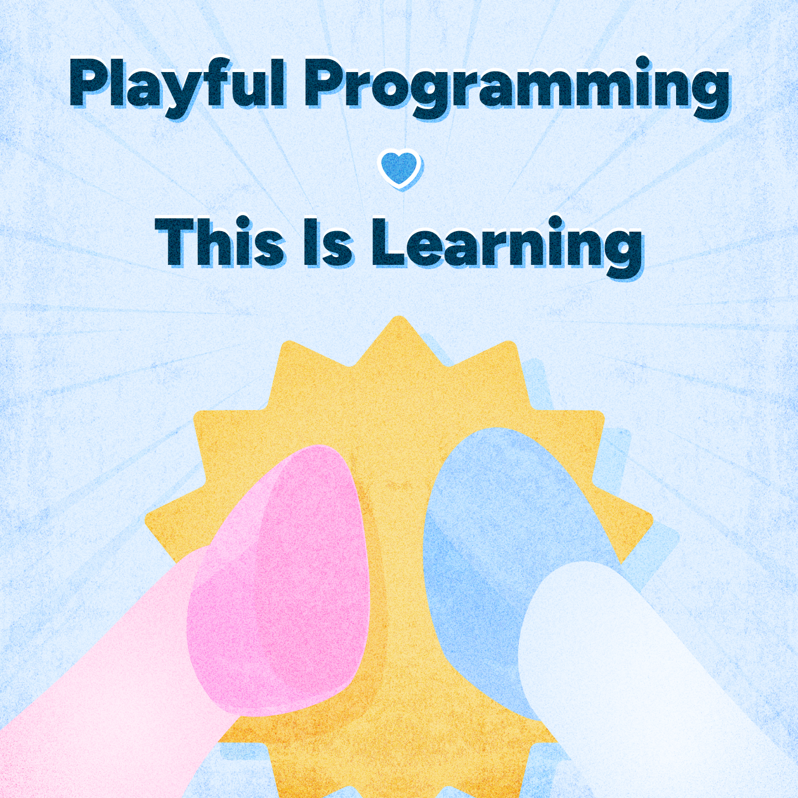
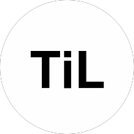
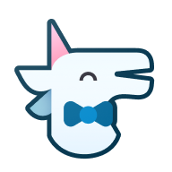
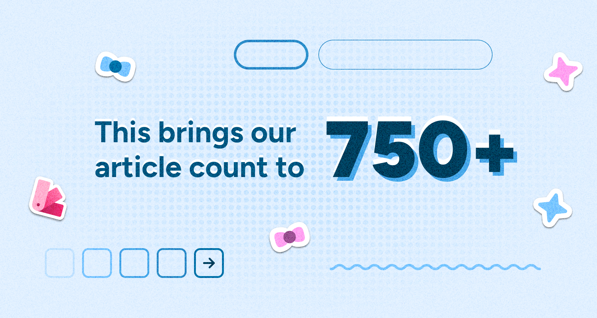
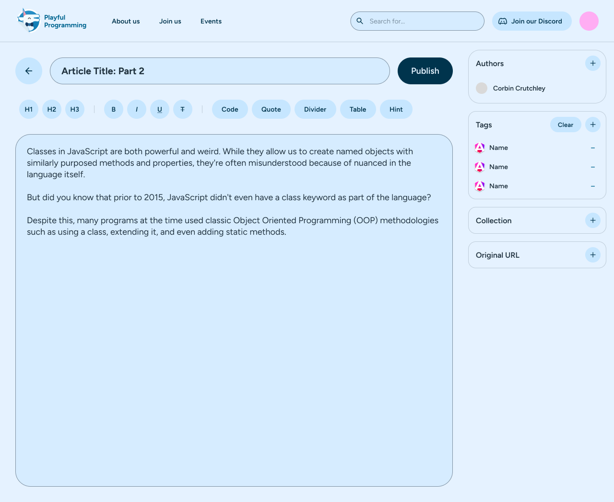

---
{
    title: "Merging the \"This Is\" Community into \"Playful Programming\"",
    description: "// TODO: Write this",
    published: '2026-02-09T20:12:03.284Z',
    tags: ['announcements'],
    license: 'cc-by-4'
}
---

Today's an exciting day; **Two programming communities are coming together** to help re-enforce one another's goals in educating others.

The two communities in question?

1) ["This is Learning"](https://x.com/Thisis_Learning) (and the sub-project of ["This is Angular"](https://x.com/Thisis_Angular))

2) [Playful Programming](https://playfulprogramming.com)

Let's introduce each community and explain what this means for both communities.

# Introducing "This is Learning" (TiL)

"This is Learning" (TiL) was originally created in 2020 by [Santosh Yadav](https://www.santoshyadav.dev/) and [Lars Gyrup Brink Nielsen](https://github.com/layzeedk) to bring together authors and share software development knowledge.

Santosh and Lars are both highly accomplished engineers and community leaders. Both receiving multi-year awards from prestigious organizations like GitHub, Microsoft, Google, and Nx for their efforts on "This is" as well as many other open-source projects.

It's no wonder, then, that since they started their project they've:

- [Had over 1480 articles released on their Dev.to community by over 175 authors](https://dev.to/this-is-learning) ([including 650 articles specifically about Angular](https://dev.to/this-is-angular))
- [Created 100 videos on their YouTube channel](https://www.youtube.com/c/ThisisTechTalks)
- [Ran a successful virtual conference in 2024](https://til-conf.netlify.app/)
- Created two courses for [NgRx](https://this-is-angular.github.io/ngrx-essentials-course/) and [RxJS](https://this-is-learning.github.io/rxjs-fundamentals-course/)
- [Sent out 50+ issues of their newsletter](https://thisislearning.substack.com/archive)

> As we migrate these resources to "Playful Programming" branding and our main website, these links may break over time. We will leave them as-is for historical context.

Throughout it all, they always remained strictly "not for profit" and encouraged cross-posting, self-controlled content ownership, and community wellbeing over all else.

# Introducing "Playful Programming" (PFP)

"Playful Programming" (PFP) was started by [James Fenn](http://jfenn.me/), [Evelyn Hathaway](https://playfulprogramming.com/people/evelynhathaway), and [myself (Corbin Crutchley)](https://github.com/crutchcorn) in [2019](https://playfulprogramming.com/posts/uttering-hello-introduction-post/).

Playful Programming (originally called ["Unicorn Utterances"](https://playfulprogramming.com/posts/rebrand-to-playful-programming/)) started as an alternative to a bootcamp that I worked in that I felt was acting predatory to the students in my area. Knowing that James and Evelyn were all-star engineers, I asked for their help to propel our mission — of teaching others in a transparent and helpful way — forward. 

> **More history:**
>
> Want to learn more about Playful Programming's origins? [When we rebranded from "Unicorn Utterances" we wrote a historical article on our project that you can read on our site.](https://playfulprogramming.com/posts/a-complete-history-of-uu/)

Since then, we as a community have:

- [Had over 230 articles released on our site from over 60 contributors](https://playfulprogramming.com/search/?q=*)
- [Ran a Discord community with 2700 members ](https://discord.gg/FMcvc6T)

- [Made a bespoke highly performant and accessible website](https://playfulprogramming.com) 
  - [The site was built along the timeline of 7000+ commits](https://github.com/playfulprogramming/playfulprogramming)
  - [Begun to introduce a dedicated backend and complex deployment infrastructure to make our site more scalable in the long-run](https://github.com/playfulprogramming/hoof)
  - [Created a robust design system with hundreds of design components and 300+ variables alone](https://www.figma.com/design/Ul8KB1Sc6etCNTRCRSc27z/Playful-Programming---Website?m=auto&t=jtN97SD9KIA9GZ09-6)
- [Had a mailing list with over 1500 subscribers](https://mailinglist.playfulprogramming.com/)
- [Started a **free** 12-week coding bootcamp teaching web development using our resources](https://playfulprogramming.com/events/sacramento-bootcamp/)
- [Became a California non-profit](https://playfulprogramming.com/posts/playful-programming-non-profit/)

That last item is one I'm particularly proud of. It continually reminds (and enforces) our goals to keep our content accessible and driven towards the community; not towards profits.

# Details about the merger

As both organizations have scaled, we've faced different challenges:

- For TiL, they've remained focused on the content. This has meant that they have a strong repertoire of content, but have focused less on other avenues of growth: branding, a custom website, and non-authoring community outreach.

- Contrarily, PFP has developed a powerful brand, a "uniquely ours" website, and a larger community in our Discord. We're proud of what we've put out, but it does mean that our content catalog is comparatively weak.

After some discussion between Lars, Santosh, and myself, we realized that we'd be able to grow a substantially healthier community with a joint effort.

As such, **we will be doing the following** going forward:

- Retain Playful Programming's name, branding, and structure
- Keeping our board of directors as-is
- Rename This is Learning's Dev.to blog to "Playful Programming" and their Angular specific blog to "Playful Programming Angular"
- Merging This is Learning's community Discord server into Playful Programming's Discord server
- Continuing to run the "This is Tech Talks" podcast under Playful Programming (and possibly renaming it)
- Reposting authors of This is Learning's existing content to opt-into reposting their content to the Playful Programming website

Again, it's that last point that we've spent a considerable amount of time enabling. 20 TiL authors agreed for us to port hundreds of their posts to our site. This required us to develop many new features for our site, but has resulted in **our site having 750+ articles present today!**

# Our future

But this isn't all we have planned! We also intend on:

- Migrating TiL's RxJS and NgRx courses into Playful Programming's collections feature
- Creating topic-specific pages to explore content of (like "This is Angular" provided for the broader "This is Learning" community)
- Building out integrations with social media feeds to automatically promote authors' works

----

One concern we've already heard from authors, however, is ease of posting to Playful's site. Today, [writing a post for our site includes making a pull request to our GitHub repo](https://github.com/playfulprogramming/playfulprogramming/blob/main/CONTRIBUTING.md). While we've tried to reduce friction with that process as much as we can, we know that writing for Dev.to using a GUI is much easier to navigate.

As such, we're working incredibly hard on building out a custom CMS for our site. Here's a small mockup preview of such:

> Why build out a custom CMS?

While there's [a long and well-researched answer to that question](https://github.com/playfulprogramming/playfulprogramming/pull/1297), the long-story short is that we haven't found a CMS that allows our content to be stored in a Git repository with the features we want to support in the long run.

> Why do you want to store content in Git?

The biggest reason for wanting to store authors' contents in Git is that it's a systemic answer to our goals of remaining maximally transparent. If our values are ever mismatched from authors', we want an easy way for authors to take their whole dataset with them without needing to access an account or API token.

And while radical transparency is our primary motivator, creating our own CMS allows us to add features in the future like:

- Cross-posting to Dev.to instantly
- Social media feed promotion of our authors' material
- Additional components that markdown doesn't provide out-of-the-box
- Revision history from the editor itself
- Multi-player editing

And much more.

> **Join us:**
>
> Sound like a project you might want to help build? [Come join us and help us build it out!](https://playfulprogramming.com/join-us/)

\- Corbin Crutchley, Executive Director of Playful Programming  
