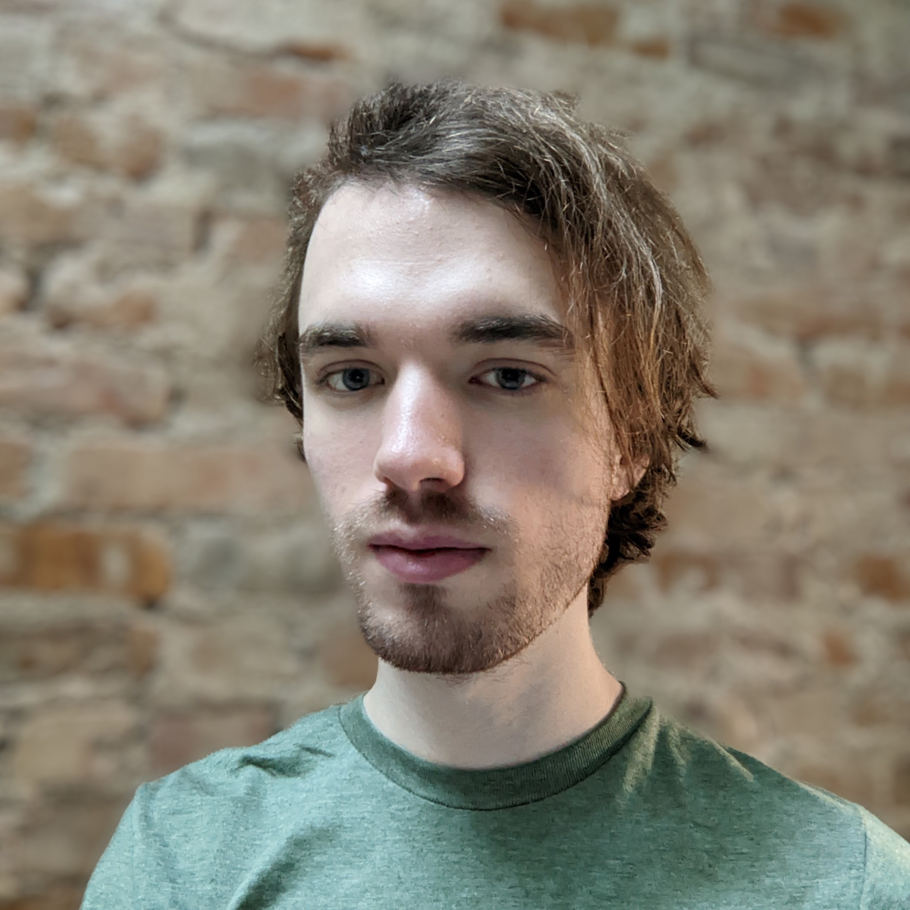
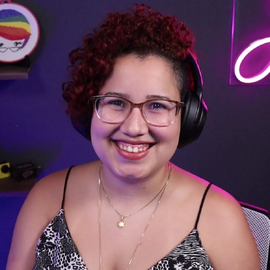
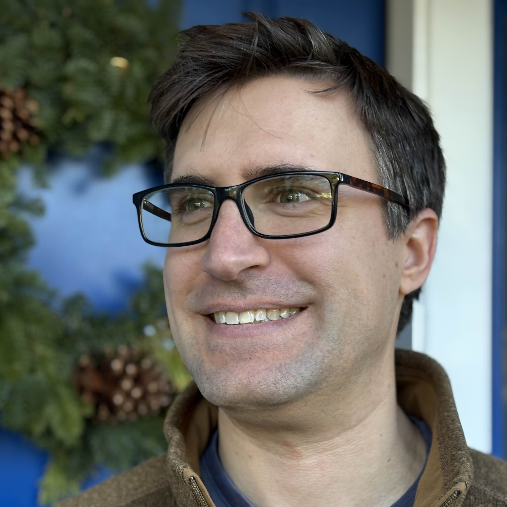
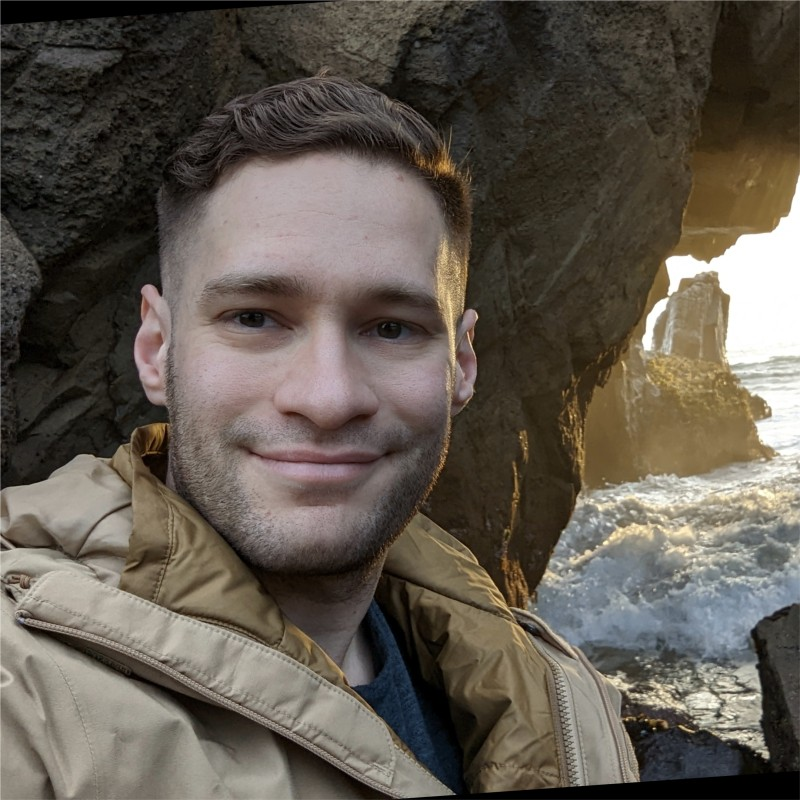

---
{
    title: "Announcing Playful Programming's Non-Profit Status",
    description: "",
    published: '2025-01-27T20:12:03.284Z',
    tags: ['announcements'],
    license: 'cc-by-4'
}
---

It's true; after many years as operating without a formal organization backing our efforts: **Playful Programming is now a California Non-Profit.**

// TODO: Graphic from Ed

# Why are we doing this?

From [our early inception under our older name, "Unicorn Utterances"](/posts/a-complete-history-of-uu) to [our modern revamp and rebrand to "Playful Programming"](/posts/rebrand-to-playful-programming), we've always had the same goal:

"Create engaging learning resources to bring others into software development and grow their skills to the next level."

This goal has enabled us to stay focused while building out our suite of teaching tools for others to benefit from.

However, while many organizations' goals often start ambitiously and with positive intent, it's far too often to see a well-meaning group end up fighting against their own cause. And regardless of the reasons, the result is often the same: The end user suffers.

We believe education, formal or otherwise, can enable an individual to escape bad scenarios they are often placed within due to systemic reasons. Even [I myself remember a time when I couldn't afford groceries consistently. It wasn't until many years (and learning resources) later that I can now help myself and my family stay afloat](/collections/framework-field-guide#why-free-story).

This is why we're moving towards a more accountable system of governance. Now, not only do our [core values](https://github.com/playfulprogramming/playfulprogramming/blob/main/CORE_VALUES.md) guide us towards enabling transparency and well-doing for the general community, but we have a legal requirement to comply with our own objectives and key success metrics.

# What does this mean?

When we say we're a "California Non-Profit", what we mean is that we're a **California Public Benefit Corporation**.

A Public Benefit Corporation is a type of legal entity that incorporates us, helps us to structure our organization in a more balanced way, and gives us legal protection.

It's worth noting that when many hear "non-profit", they often think of a 501(c)(3) organization, which we are not yet.

> 501(c)(3) is a federal tax designation that allows us to treat donations as charitable and tax-deductible.

Today, we are a public benefit corporation aiming to become a 501(c)(3) in the near future.

# How does this work?

A non-profit has three different kind of important people to know about:

- Executives
- Officers
- Board members

The executive side of things includes a: **Executive Director** (AKA CEO). They handle  and run day-to-day operations.

The three ***required*** officers are:

1. Chairperson: leads meetings, sets agendas
2. Secretary: takes meeting minutes and is responsible for record keeping
3. Treasurer: responsible for financial records

# Who's involved?

I'm beyond elated to share our board with you all; it's filled with many industry titans and some of the downright best humans I've ever had the pleasure of interacting with.

Going alphabetically, we have seven board members:

- [Adeyemi "Ade" Ritchards](/people/whatade)
- [Corbin Crutchley](/people/crutchcorn)
- Jacob Walker
- [James Fenn](/people/fennifith)
- [Jessica "Jess" Temporal](/people/jtemporal)
- [Micah Dutro](/people/MDutro)
- [Obi Baratt](/people/obibaratt)

Of these seven board members, three are officers:

- Chairperson: [James Fenn](/people/fennifith)
- Secretary: [Micah Dutro](/people/MDutro)
- Treasurer: [Obi Baratt](/people/obibaratt)

While I, [Corbin Crutchley](/people/crutchcorn), am our Executive Director.

I've asked our board to introduce ourselves so you can get to know us all:

## Ade Ritchards

Hello\! I am a I'm the Founding Engineer at TenYour.com and I have a passion for learning down. Meaning that I want to understand, consider and talk about the imperative implementations that power all of our favorite abstractions\! Beyond writing code, I play basketball and {{fake\_hobby\_2}}\!

## Corbin Crutchley

Hey all, I'm Corbin Crutchley; Playful Programming Co-Founder, GitHub Star, and Microsoft MVP. You can find me hanging out in our Discord, maintaining far too many GitHub repos and trying to talk myself back into finishing Elden Ring.

## Jacob Walker

// TODO: Add image

// TODO: Add bio

## James Fenn

Hi, I'm James Fenn! I'm a Backend Engineer by profession, and the other co-founder of Playful Programming. I enjoy all kinds of programming, music production, Minecraft modding, and recently baking cookies!

## Jess Temporal

Jessica Temporal is a Senior Developer Advocate at Auth0 and co-founder of the first Brazilian data science podcast called [Pizza de Dados](https://pizzadedados.com/). She’s the author of [The Big Git Microbook](https://www.amazon.com/dp/B0CDNX6NS7/ref=sr_1_1?&_encoding=UTF8&tag=jesstempora0e-20&linkCode=ur2&linkId=efc4229f6b816609dfce4f185781d99a&camp=1789&creative=9325), creator of [GitFichas.com](http://GitFichas.com), and a part of [LinkedIn Learning](https://www.linkedin.com/learning/instructors/jessica-temporal) instructors team. GitHub Star and awarded the Dorneles Tremea | Jean Ferri for her contributions to the Brazilian Python community, Jessica helped develop the AI that identifies possible unlawful expenses from Brazilian politicians. She is part of the Pyladies initiative that works to improve diversity and inclusion in technology.

## Micah Dutro

// TODO: Add bio

## Obi Barett

Obi is a software engineer building businesses, communities, and the ecosystems that connect them. He runs a development agency & startup studio, and co-organizes the Sacramento JavaScript Meetup, SacTech Social, and the Sacramento Startup Tech Connect meetups.

# What's next?

As we grow our non-profit further than it is today, we have a lot ahead of us. From aiming towards 501(c)(3) status to refining our policies and procedures, it's going to be a fun and wild ride getting everything set up.

Beyond our non-profit goals, we have **huge** plans for 2025 and after. While there's some stuff we're able to talk about:

1) Continuing and growing our weekly Discord Book Club, where we talk about a new programming article every week
2) [Inviting and finding new authors and contributors to join us](/join-us)
3) Publishing the second and third books of "[The Framework Field Guide](https://framework.guide/)"
4) Investigating the possibility of building out video content for our site
5) Developing a new in-house Content Management System (CMS) to make article publication easier

There's even more that we have in the works that we're not yet ready to share publicly.

# How you can help

If you're interested in helping, we have a myriad of ways you can get involved.

**First** and foremost, we're always looking for other volunteers. Whether you want to:

- Write blog posts of any skill level (newcomer content is welcome\!)
- Implement code on our website and upcoming endeavors
- Provide graphic design for a new feature or graphic
- Help us improve our accessibility and user experience via testing
- Starting conversations and engaging with others in our community Discord
- Spread the word via social media

Or anything else, [we'd love to have you on board.](/join-us)

---

**Second**: We are consistently looking for partners, sponsors, and donations.

<!-- ::in-content-ad title="Consider supporting" body="Donating any amount will help towards further development of our non-profit." button-text="Visit our Open Collective" button-href="https://opencollective.com/playfulprogramming" -->

Funding Playful Programming will help us:

- Pay for hosting fees, services, and more
- Compensate our contributors when possible
- Grow into new avenues for our content, both in quantity and quality

For interested parties, we're willing to:

- Host in-content banner ads
- Build out sidebar ads
- Add inclusion in our newsletter, Discord, and other social media announcements.
- Build out partnered content
- Offer other bespoke benefits

You can reach out [via email](mailto:contact@playfulprogramming.com), [our Discord](https://discord.gg/FMcvc6T), or donate via our [Open Collective](https://opencollective.com/playfulprogramming).

---

**Last**, but not least, there's one more huge way you're able to help us: By reading and sharing our content.

We rely on our community to see what they're interested in, what they want to learn, and how we can help on that journey. Engaging in our content is a huge part of that.

# A note before we leave

It's been quite the adventure to get where we are today. It's only through the immense support of many wonderful people, like yourself, that have provided (and continue to provide) the fuel for our rocketship.

While we've landed many projects we're proud of, we're not done yet. Along our longer-term voyage, we vouch to continue our good work and remain transparent and vigilant to grow alongside our readers in a way we think you'll be proud of as well.

I don't know about you, but I'm beyond excited to see what the future holds.

See you among the stars,

\- Corbin Crutchley, Executive Director of Playful Programming  
