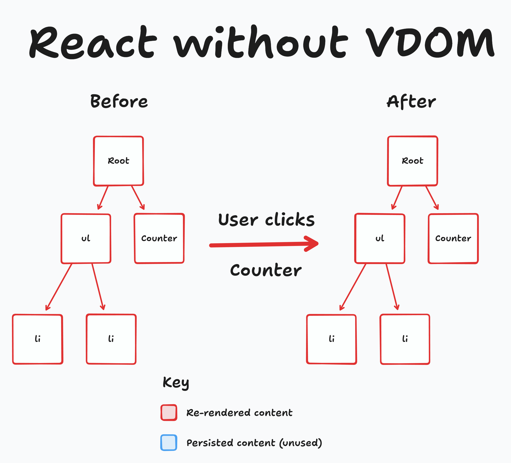
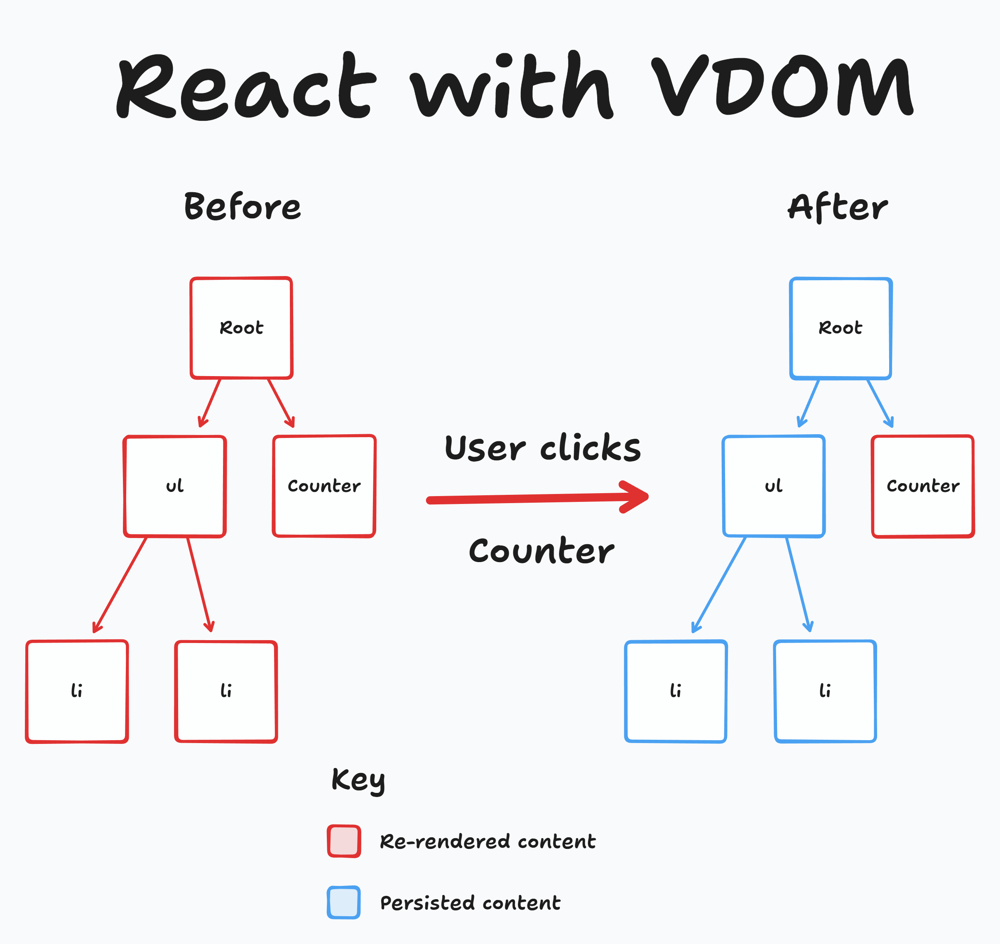
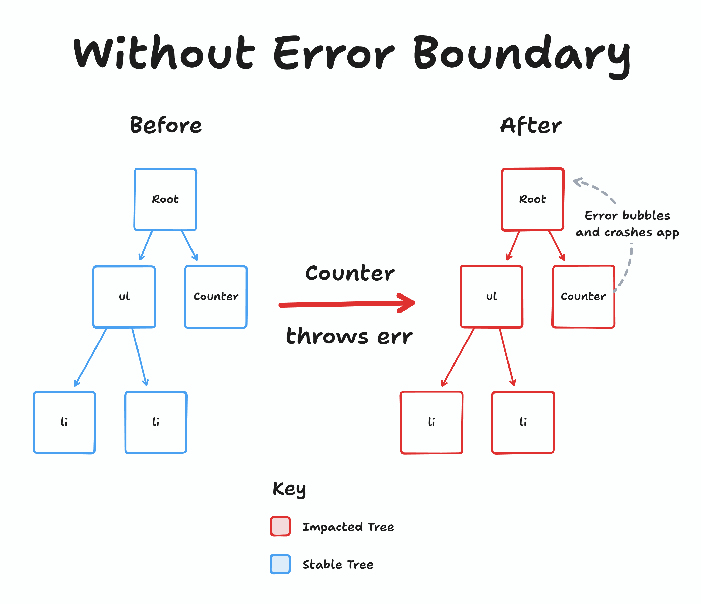
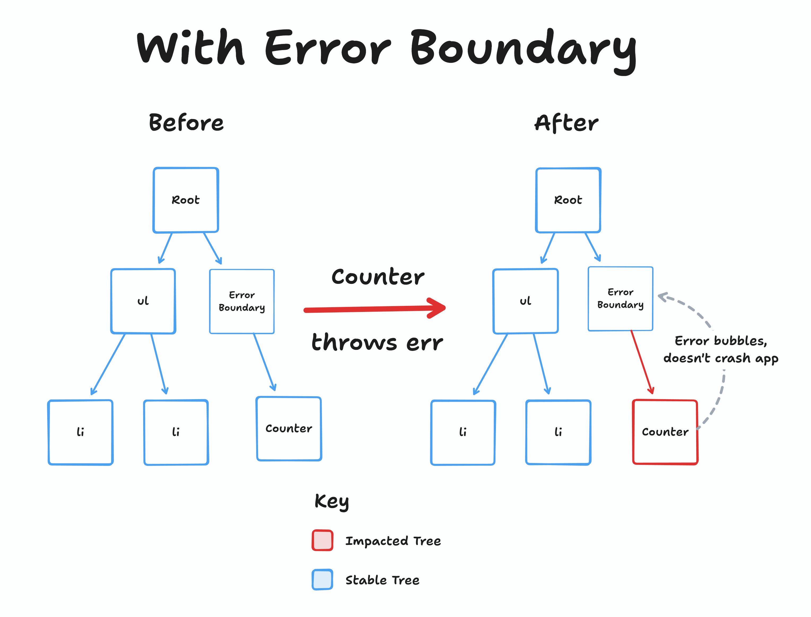
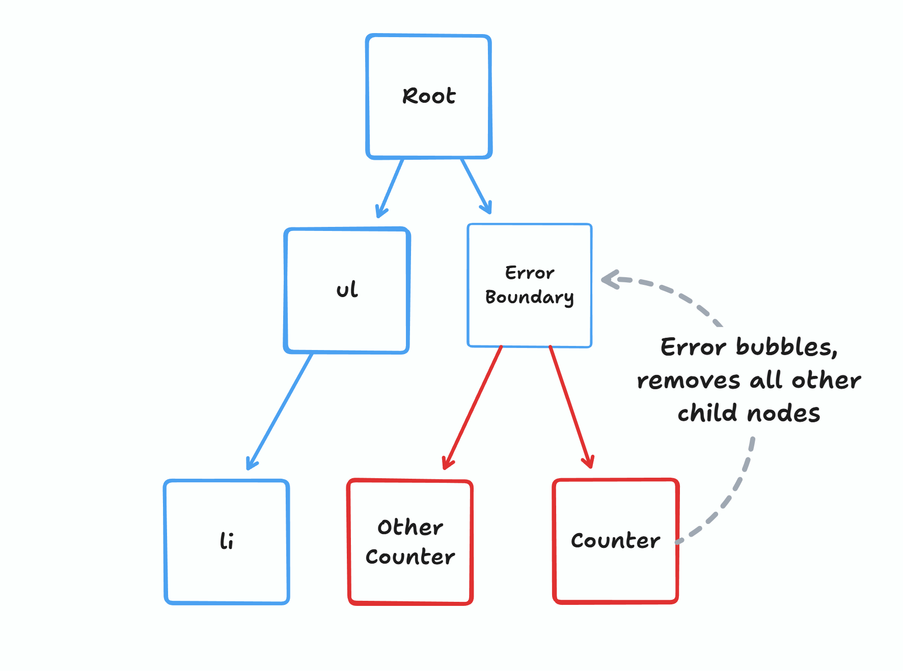

---
{
	title: "React: Consistent by Design",
	description: "TODO: Write this",
	published: '2025-07-01T05:12:03.284Z',
	tags: ['react', 'javascript', 'webdev'],
	license: 'cc-by-nc-sa-4'
}
---

React isn't a frontend framework: It's a web framework. While this distinction might seem narrow, the impact of it enables a shift in how your mental model of React that explains many of their design systems from day one.

In this article, we'll explore the concepts React has introduced along the way and potentially build out a new mental model for the framework as we go. 

While things may get fairly technical, I'll make sure to keep things relatively beginner-friendly and even leverage visuals as much as possible. Let's dive in.

# JSX

Even in the earliest days of React, the idea of representing your HTML code in a JavaScript file was established.

This provided a large amount of flexibility for the early framework; not only did it enable the ability to sidestep custom
template tags for things like conditional rendering logic and loops, but it was fun to work with and allowed fast iteration of
UI code.

This meant that code that might've otherwise looked like this:

```html
<div>
    <!-- This is psuedo-syntax of a theoretical framework's template code -->
    <some-tag data-if="someVar"></some-tag>
    <some-item-tag data-for="let someItem of someList"></some-item-tag>
</div>
```

It could instead look like this:

```jsx
<div>
	{someVar && <some-tag/>}
	{someList.map(someItem => <some-item-tag/>)}
</div>
```

This also enables the template to JavaScript transform to stay extremely lightweight.

Instead of having to rely on some kind of HTML to JavaScript compiler, the tags of the JSX are able to be trivially transformed to JavaScript functions:

```jsx
// The following JSX
function App() {
	return <ul role="list"><li>Test</li></ul>
}

// Turns into a straightforward transform to function calls to run on the browser
function App() {
	return React.createElement("ul", {
		role: 'list'
    }, [
			React.createElement("li", {}, [
				"Test"
            ])
    ]);
}
```

# The Virtual DOM (VDOM)

While JSX allowed for lots of flexibility, it meant that templates that needed [reactivity](/posts/what-is-reactivity) required
a re-execution of all template nodes to construct [the DOM](/posts/understanding-the-dom) with new values.



To solve this, the team used a concept of a "virtual DOM" (VDOM). This VDOM was a copy of the browser's DOM stored in JavaScript; When React constructed a node in the DOM, it made a copy into its own copy of the DOM.

Then, when a given component needed to update the DOM, it would check against this VDOM and only localize the re-render to the specific node.



This was a huge optimization that allowed for much more performant React applications to scale outward.

# Error Components

Now that we had a component tree, there was a bit of a challenge.

See, because of the nature of the VDOM, whenever a component threw an error it would crash the entire React tree.



However, because components are laid out hierarchically, we can establish a boundary between a component that might potentially throw an error and the rest of the application state.



Not only does this work with single nodes, but because components are grouped by their parents we can remove a group of impacted nodes at once by wrapping them in a shared `ErrorBoundary`:

```jsx
import React, { useState } from 'react';

class ErrorBoundary extends React.Component {
    constructor(props) {
        super(props);
        this.state = { hasError: false };
    }

    static getDerivedStateFromError(error) {
        return { hasError: true };
    }

    render() {
        if (this.state.hasError) {
            return <h1>Something went wrong.</h1>;
        }

        return this.props.children; 
    }
}

function App() {
    return (
        <div>
            {/* When an error is thrown in the ErrorBoundary, it will catch it, remove all child nodes, and render the fallback UI */}
            <ErrorBoundary>
                <ErrorCounter />
                <OtherCounter />
            </ErrorBoundary>
            {/* However, these nodes will be left unaffected */}
            <ul>
                <li>Item 1</li>
            </ul>
        </div>
    );
}
```



# Component Composition

Coming into 2018, React had a bit of a problem to solve: A class-based component's internal logic was extremely challenging to compose.

> **Note:**
>
> Remember, hooks were not part of the framework yet.

See, a core tennant of components is that they're able to compose; meaning that **we can build a new component from existing components**:

```jsx
// Existing components
class Button extends React.Component {
    // ...
}

class Title extends React.Component {
    // ...
}

class Surface extends React.Component {
    // ...
}

// Can be reused and merged into a
// newly created broader component
class Card extends React.Component {
  render() {
    return (
      <Surface>
        <Title/>
        <Button/>
      </Surface>
    )
  }
}
```

Without this ability, React would be extremely hard to scale in larger applications. However, the same ability to compose could not (at that time) be said for the internal logic of class-based components.

Take the following example:

```jsx
class WindowSize extends React.Component {
  state = {
    width: window.innerWidth,
    height: window.innerHeight,
  }; 

  handleResize = () => {
    this.setState({
      width: window.innerWidth,
      height: window.innerHeight,
    });
  }

  componentDidMount() {
    window.addEventListener('resize', this.handleResize);
  }

  componentWillUnmount() {
    window.removeEventListener('resize', this.handleResize);
  }

  render() {
    // ...
  }
}
```

This `WindowSize` component gets the size of the browser window, stores it in `state`, and triggers a re-render of the component when this occurs.

Now let's say that we want to reuse this logic between components. If you've studied Object-Oriented Programming - where classes come from - you'll realize that there's a good way to do so: [**Class inheritence**](https://developer.mozilla.org/en-US/docs/Web/JavaScript/Guide/Inheritance_and_the_prototype_chain).

## Class components inheritence

Without changing the code for `WindowSize` components, we can use [the `extends` keyword](https://developer.mozilla.org/en-US/docs/Web/JavaScript/Reference/Classes/extends) in JavaScript to allow a new class to inherit methods and properties from another class.

```jsx
class MyComponent extends WindowSize {
  render() {
    const { windowWidth, windowHeight } = this.state;

    return (
      <div>
        The window width is: {windowWidth}
        <br />
        The window height is: {windowHeight}
      </div>
    );
  }
}
```

While this simple example works, it's certainly not without its downsides. This especially becomes a problem when `MyComponent` becomes more complex; we need to use [the `super` keyword](https://developer.mozilla.org/en-US/docs/Web/JavaScript/Reference/Operators/super) to allow the base class to continue behaving as it once was:

```jsx
class MyComponent extends WindowSize {
  state = {
    // Required with a base class
    ...this.state,
    counter: 0,
  };

  intervalId = null;
  
  componentDidMount() {
    // Required with a base class
    super.componentDidMount();

    this.intervalId = setInterval(() => {
      this.setState(prevState => ({ counter: prevState.counter + 1 }));
    }, 1000);
  }

  componentWillUnmount() {
    // Required with a base class
    super.componentWillUnmount();

    clearInterval(this.intervalId);
  }

  render() {
    const { windowWidth, windowHeight, counter } = this.state;

    return (
      <div>
        The window width is: {windowWidth}
        <br />
        The window height is: {windowHeight}
        <br />
        The counter is: {counter}
      </div>
    )
  }
}
```

However, miss a `super()` call or anything between, and you'll end up with behavior problems, memory leaks, or more.

To solve this, many apps and libraries reached for a pattern called "**Higher ordered Components**" (HoC).

## Higher ordered Components (HoC)

```jsx
const withWindowSize = (WrappedComponent) => {
  return class WithWindowSize extends React.Component {
    state = {
      width: window.innerWidth,
      height: window.innerHeight,
    };

    handleResize = () => {
      this.setState({
        width: window.innerWidth,
        height: window.innerHeight,
      });
    }

    componentDidMount() {
      window.addEventListener('resize', this.handleResize);
    }

    componentWillUnmount() {
      window.removeEventListener('resize', this.handleResize);
    }

    render() {
      return <WrappedComponent {...this.props} windowWidth={this.state.width} windowHeight={this.state.height} />;
    }
  }
}

class MyComponentBase extends React.Component {
  render() {
    const { windowWidth, windowHeight } = this.props;

    return (
      <div>
        The window width is: {windowWidth}
        <br />
        The window height is: {windowHeight}
      </div>
    );
  }
}

const MyComponent = withWindowSize(MyComponentBase);
```


# Introducing Hooks


// TODO: Talk about the composition of hooks, how they're more similar to components in that way
// TODO: Talk about the rules of React and how it helps keeps components pure
// TODO: Talk about useEffect and the need for a more 1:1 mapped system for effect cleanup

# `<StrictMode>` Effect Changes

// TODO: Talk about how this is consistent with Hooks, despite the perceived changeup

# Suspense Boundaries & `use`

// TODO: Talk about how `use` throwing up, required state to be lifted up (consistent with messaging from React for years)
// TODO: Talk about waterfalling
// TODO: Talk about how this introduced the ideas of boundaries in the VDOM

# JSX over the wire

/
Even in the earliest days of React the idea of representing your HTML code in a JavaScript file was established.


/ TODO: Talk about Next.js' pre-RSC SSR story and how shipping VDOM state enabled
// TODO: Talk about how this is powered by a similar boundary system as Suspense (only between loading states and not) 

# Async components

// TODO: Talk about how, once we have a loading pattern and a designation between the client and server, it enables a lot of cool data loading mechanisms

# `<Activity>`

// TODO: Talk about how we can lean into the VDOM state system to allow for preserving state between unrenders and re-renders
