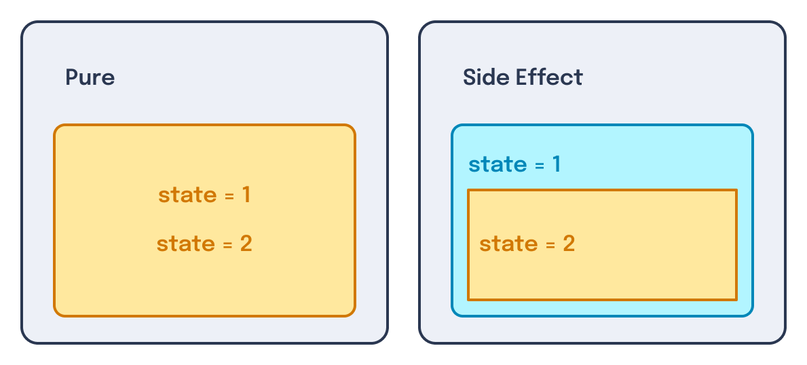
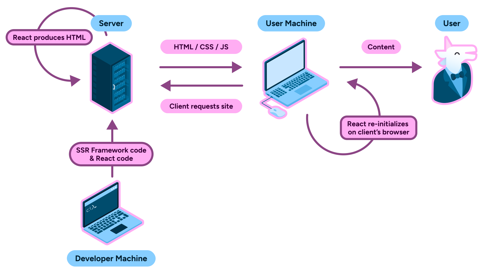

---
{
	title: "React: Consistent by Design",
	description: "TODO: Write this",
	published: '2025-07-01T05:12:03.284Z',
	tags: ['react', 'javascript', 'webdev'],
	license: 'cc-by-nc-sa-4'
}
---

I've often heard qualms from the broader developer community lamenting the perceived shift in React towards the backend.

But here's the thing; React isn't a frontend framework, it's a web framework. While this distinction might seem narrow, the impact of it enables a shift in how your mental model of React that explains many of their design systems from day one.

> **Semantics:**
>
> Many, including the React team themselves, call React a "library". While there's validity there, I gesture towards the ever expanding set of primitives - which now include data fetching and error handling - as evidence for my usage of the term "framework".

Moreover, I'd argue that **React has been aiming in this direction for many many years and its "movement towards the backend" has been a natural evolution of patterns established from day one of the framework.** In fact, I'd go even further and say that: **React today has had an incredibly consistent set of architectural designs, spanning from the server-side to the client-side.**

In this article, we'll explore the concepts React has introduced along the way and potentially build out a new mental model for the framework as we go. 

While things may get fairly technical, I'll make sure to keep things relatively beginner-friendly and even leverage visuals as much as possible. Let's dive in.

# The problems of markup

Even in the earliest days of React, the idea of representing your HTML code in a JavaScript file was established.

This provided a large amount of flexibility for the early framework; not only did it enable the ability to sidestep custom
template tags for things like conditional rendering logic and loops, but it was fun to work with and allowed fast iteration of
UI code.

This meant that code that might've otherwise looked like this:

```html
<div>
    <!-- This is psuedo-syntax of a theoretical framework's template code -->
    <some-tag data-if="someVar"></some-tag>
    <some-item-tag data-for="let someItem of someList"></some-item-tag>
</div>
```

It could instead look like this:

```jsx
<div>
	{someVar && <some-tag/>}
	{someList.map(someItem => <some-item-tag/>)}
</div>
```

This also enables the template to JavaScript transform to stay extremely lightweight.

Instead of having to rely on some kind of HTML to JavaScript compiler, the tags of the JSX are able to be trivially transformed to JavaScript functions:

```jsx
// The following JSX
function App() {
	return <ul role="list"><li>Test</li></ul>
}

// Turns into a straightforward transform to function calls to run on the browser
function App() {
	return React.createElement("ul", {
		role: 'list'
    }, [
			React.createElement("li", {}, [
				"Test"
            ])
    ]);
}
```

# Making markup reactive

While JSX allowed for lots of flexibility, it meant that templates that needed [reactivity](/posts/what-is-reactivity) required
a re-execution of all template nodes to construct [the DOM](/posts/understanding-the-dom) with new values.


To solve this, the team used a concept of a "virtual DOM" (VDOM). This VDOM was a copy of the browser's DOM stored in JavaScript; When React constructed a node in the DOM, it made a copy into its own copy of the DOM.

Then, when a given component needed to update the DOM, it would check against this VDOM and only localize the re-render to the specific node.


This was a huge optimization that allowed for much more performant React applications to scale outward.

# Solving error handling

Now that we had a component tree, there was a bit of a challenge.

See, because of the nature of the VDOM, whenever a component threw an error it would crash the entire React tree.


However, because components are laid out hierarchically, we can establish a boundary between a component that might potentially throw an error and the rest of the application state.


Not only does this work with single nodes, but because components are grouped by their parents we can remove a group of impacted nodes at once by wrapping them in a shared `ErrorBoundary`:

```jsx
import React, { useState } from 'react';

class ErrorBoundary extends React.Component {
    constructor(props) {
        super(props);
        this.state = { hasError: false };
    }

    static getDerivedStateFromError(error) {
        return { hasError: true };
    }

    render() {
        if (this.state.hasError) {
            return <h1>Something went wrong.</h1>;
        }

        return this.props.children; 
    }
}

function App() {
    return (
        <div>
            {/* When an error is thrown in the ErrorBoundary, it will catch it, remove all child nodes, and render the fallback UI */}
            <ErrorBoundary>
                <ErrorCounter />
                <OtherCounter />
            </ErrorBoundary>
            {/* However, these nodes will be left unaffected */}
            <ul>
                <li>Item 1</li>
            </ul>
        </div>
    );
}
```


# Early developer experience

Coming into 2018, React had a bit of a problem to solve: A class-based component's internal logic was extremely challenging to compose.

> **Note:**
>
> Remember, hooks were not part of the framework yet.

See, a core tennant of components is that they're able to compose; meaning that **we can build a new component from existing components**:

```jsx
// Existing components
class Button extends React.Component {
    // ...
}

class Title extends React.Component {
    // ...
}

class Surface extends React.Component {
    // ...
}

// Can be reused and merged into a
// newly created broader component
class Card extends React.Component {
  render() {
    return (
      <Surface>
        <Title/>
        <Button/>
      </Surface>
    )
  }
}
```

Without this ability, React would be extremely hard to scale in larger applications. However, the same ability to compose could not (at that time) be said for the internal logic of class-based components.

Take the following example:

```jsx
class WindowSize extends React.Component {
  state = {
    width: window.innerWidth,
    height: window.innerHeight,
  }; 

  handleResize = () => {
    this.setState({
      width: window.innerWidth,
      height: window.innerHeight,
    });
  }

  componentDidMount() {
    window.addEventListener('resize', this.handleResize);
  }

  componentWillUnmount() {
    window.removeEventListener('resize', this.handleResize);
  }

  render() {
    // ...
  }
}
```

This `WindowSize` component gets the size of the browser window, stores it in `state`, and triggers a re-render of the component when this occurs.

Now let's say that we want to reuse this logic between components. If you've studied Object-Oriented Programming - where classes come from - you'll realize that there's a good way to do so: [**Class inheritence**](https://developer.mozilla.org/en-US/docs/Web/JavaScript/Guide/Inheritance_and_the_prototype_chain).

## The intuitive short-term solution

Without changing the code for `WindowSize` components, we can use [the `extends` keyword](https://developer.mozilla.org/en-US/docs/Web/JavaScript/Reference/Classes/extends) in JavaScript to allow a new class to inherit methods and properties from another class.

```jsx
class MyComponent extends WindowSize {
  render() {
    const { windowWidth, windowHeight } = this.state;

    return (
      <div>
        The window width is: {windowWidth}
        <br />
        The window height is: {windowHeight}
      </div>
    );
  }
}
```

While this simple example works, it's certainly not without its downsides. This especially becomes a problem when `MyComponent` becomes more complex; we need to use [the `super` keyword](https://developer.mozilla.org/en-US/docs/Web/JavaScript/Reference/Operators/super) to allow the base class to continue behaving as it once was:

```jsx
class MyComponent extends WindowSize {
  state = {
    // Required with a base class
    ...this.state,
    counter: 0,
  };

  intervalId = null;
  
  componentDidMount() {
    // Required with a base class
    super.componentDidMount();

    this.intervalId = setInterval(() => {
      this.setState(prevState => ({ counter: prevState.counter + 1 }));
    }, 1000);
  }

  componentWillUnmount() {
    // Required with a base class
    super.componentWillUnmount();

    clearInterval(this.intervalId);
  }

  render() {
    const { windowWidth, windowHeight, counter } = this.state;

    return (
      <div>
        The window width is: {windowWidth}
        <br />
        The window height is: {windowHeight}
        <br />
        The counter is: {counter}
      </div>
    )
  }
}
```

However, miss a `super()` call or anything between, and you'll end up with behavior problems, memory leaks, or more.

To solve this, many apps and libraries reached for a pattern called "**Higher ordered Components**" (HoC).

## The adopted community solution

With higher-ordered components, you're able to avoid requiring your users to have `super` calls across their codebase and instead recieve arguments from the base class as `props` to the extending class:

```jsx
const withWindowSize = (WrappedComponent) => {
  return class WithWindowSize extends React.Component {
    state = {
      width: window.innerWidth,
      height: window.innerHeight,
    };

    handleResize = () => {
      this.setState({
        width: window.innerWidth,
        height: window.innerHeight,
      });
    }

    componentDidMount() {
      window.addEventListener('resize', this.handleResize);
    }

    componentWillUnmount() {
      window.removeEventListener('resize', this.handleResize);
    }

    render() {
      return <WrappedComponent {...this.props} windowWidth={this.state.width} windowHeight={this.state.height} />;
    }
  }
}

class MyComponentBase extends React.Component {
  render() {
    const { windowWidth, windowHeight } = this.props;

    return (
      <div>
        The window width is: {windowWidth}
        <br />
        The window height is: {windowHeight}
      </div>
    );
  }
}

const MyComponent = withWindowSize(MyComponentBase);
```

Prior to hooks, this was the state-of-the-art when it came to component logic reuse in React.

Unfortunately, this required knowledge of what `props` to expect from the parent component, was challenging to allow [TypeScript](/posts/introduction-to-typescript) and other type-checker usage, and ultimately felt like an addon pattern rather than a clean, built-in composition pattern from React itself.

This is why **Hooks** were introduced into React.

# Maturing the developer experience

React's Hooks were introduced in React 16.8. With them, the baseline for future React features was established.

While previous ["smart" components](/posts/layered-react-structure#smart-dumb-comps) were written using classes and special methods and properties to manage state and [side effects](/posts/ffg-fundamentals-side-effects):

```jsx
class WindowSize extends React.Component {
  state = {
    width: window.innerWidth,
    height: window.innerHeight,
  }; 

  handleResize = () => {
    this.setState({
      width: window.innerWidth,
      height: window.innerHeight,
    });
  }

  componentDidMount() {
    window.addEventListener('resize', this.handleResize);
  }

  componentWillUnmount() {
    window.removeEventListener('resize', this.handleResize);
  }

  render() {
    // ...
  }
}
```

With hooks, all of your components - both "smart" and "dumb" - could be written with functions and specially imported functions:

```jsx
function WindowSize() {
	const [size, setSize] = React.useState({
    width: window.innerWidth,
    height: window.innerHeight,
  })
  
  const {height, width} = size;

  useEffect(() => {
    const handleResize = () => {
      setSize({
        width: window.innerWidth,
        height: window.innerHeight,
      });
    }

    window.addEventListener('resize', this.handleResize);

    return () => window.removeEventListener('resize', this.handleResize);
  }, []);

  return (
  	// ...
  )
}
```

This had a number of benefits, the biggest of which going back to the concept of composition.

## Adopting components' strengths in the logic layer

Whereas with class components the convention for composition (say that 10 times fast!) was higher-ordered components, hooks have.... 🥁

Other hooks. 😐

This might sound obvious, but its this obvious-nature that allows for Hook's superpowers, both current and future.

Let's look at a custom `useWindowSize` hook:

```javascript
function useWindowSize() {
	const [size, setSize] = React.useState({
    width: window.innerWidth,
    height: window.innerHeight,
  })
  
  const {height, width} = size;

  useEffect(() => {
    const handleResize = () => {
      setSize({
        width: window.innerWidth,
        height: window.innerHeight,
      });
    }

    window.addEventListener('resize', this.handleResize);

    return () => window.removeEventListener('resize', this.handleResize);
  }, []);

	return {height, width}
}
```

> **Note:**
> Notice how we had to change very little code from the `WindowSize` component itself; this flavor of logic composition allows us to avoid changing much of the code between the intial authoring and the rewrite to abstract this logic out to a custom hook.

This custom hook can then be reused in as many function components as we'd like:

```jsx
function MyComponent() {
	const {height, width} = useWindowSize();
		
  return (
    <div>
      The window width is: {windowWidth}
      <br />
      The window height is: {windowHeight}
    </div>
  )
}
```

## Enforcing rules for consistency

This doesn't mean that authoring your own custom hooks is a free-for-all, however. All hooks follow a consistent set of rules:

- All hooks are functions
- The function names must start with `use`
- [Hooks cannot be called conditionally](https://react.dev/reference/rules/rules-of-hooks)
- They must be called at the top-level of a component
- [Dynamic usage of hooks is not allowed](https://react.dev/reference/rules/react-calls-components-and-hooks#dont-dynamically-use-hooks)
- [Properties passed to hooks must not be mutated](https://react.dev/reference/rules/components-and-hooks-must-be-pure#return-values-and-arguments-to-hooks-are-immutable)

Regardless of if a hook is custom or imported from React, regardless of when a hook was introduced, whether from the start with `useState` or much later with [the `useActionState` hook](https://playfulprogramming.com/posts/what-is-use-action-state-and-form-status), these rules are to be followed.

```jsx
// ✅ Allowed usages
function AllowedHooksUsage() {
	const [val, setVal] = React.useState(0);
	const {height, width} = useWindowSize();
	
	return <>{/* ... */}</>
}

// ❌ Dis-allowed usages
function DisallowedHooksUsage() {
	const obj = {};
    
    useObj(obj);
    
    // Not allowed to mutate objects after being passed to a hook
    obj.key = (obj.key ?? 0) + 1;    
    
    if (bool) {
		const [val, setVal] = React.useState(0);        
    }

    if (other) {
        return null;
    }
    
    // While otherwise valid, can't be after a return
    const {height, width} = useWindowSize();
	
    for (let i = 0; i++; i < 10) {
        const ref = React.useRef();
    }
    
	return <>{/* ... */}</>
}
```

> These rules enforced here are present due to thoughtful design of how to enable React to own dataflow more. [We'll learn more about what this means in our Hooks + the VDOM section](#TODO_ADD).

## Continuing consistency in I/O handling

[I could talk about side effects in programming for hours](/posts/ffg-fundamentals-side-effects). As a short recap of an introductory view of effects:

- A "side effect" is the idea of mutating state from some external boundary.

  

- As a result of this, all I/O is a "side effect" since the user is external to the system executing the code

- Most I/O requires some flavor of cleanup: either to stop listening for user input or to reset state set during an output before the next iteration

- As a result, [side effects need a good way to cleanup, otherwise your application will suffer from bugs and memory leaks.](/posts/ffg-fundamentals-side-effects#cleaning-event-listeners)

Following this thought process, we can see how React's `useEffect` hook enables us to follow better side effect cleanup patterns.

Let's look at how classes handled side effects:

```jsx
class Listener extends React.Component {
  // Requires us to register a method on the `this` boundary
  // to reference in both places
  componentDidMount() {
    window.addEventListener('resize', this.handleResize);
  }

  // There may be many lines between the mount and unmount
    
  componentWillUnmount() {
    window.removeEventListener('resize', this.handleResize);
  }

  // Methods added to `window` via `addEventListener` needed to use
  // arrow functions, as otherwise `this` would be bound to `window`.
  handleResize = () => {
    // ...
  }
}
```

> **Note:**
>
> Confused about why `this` would be `window` when `handleResize` isn't an arrow function?
>
> We cover this and more in [our article covering the `this` keyword in JavaScript.](/posts/javascript-bind-usage)

Compare this to how side effects are registered and cleaned up using `useEffect`:

```jsx
function Listener() {
	useEffect(() => {
		// Method colocated next to the listeners
        const handleResize = () => {
			// ...
		}
		window.addEventListener('resize', handleResize);
        // Cleanup in same scope as the effect
		return () => window.removeEventListener('resize', handleResize);
	}, []);
    
    // ...
}
```


## Bringing it back to markup

I hear you, React-Senior-Team-Lead-a-tron:

> This is all recap for me. How does this pertain to your thesis of React's consistency?

Well, while it may be obvious that React Hooks were a shift in how we author components, what may not have been obvious was the back-work that led to being able to implement Hooks.

See, to make this magic works, Hooks doesn't just *work alongside* the VDOM, the method of persisting data in a component from a function **requires** the VDOM.

After all, React doesn't transform a function component in any way, so how does `useState` persist its value internally?

Were we to try this without `useState`, we'd notice quickly how this behavior differs from a normal JavaScript function:

``` jsx
function Test() {
  const a = 1;
  console.log(a);
  a++;
}

Test() // 1
Test() // 1
Test() // 1
```

Here's one way we could persist state using a naïve implementation of hooks storage using an array:

```javascript
const state = [];

/**
 * React "increments" this internally
 * for each hook it runs into.
 * We won't for now, for simplicity.
 */
let idx = 0;

function useState(init) {
    state[idx] = state[idx] ?? {val: init};

    return [
        state[idx].val,
        (data => state[idx].val = data)
    ]
}

function Test() {
    const [data, setData] = useState(1);

    console.log(data);

    setData(data + 1)
}

Test() // 1
Test() // 2
Test() // 3
```
While it may seem silly to use an array to store a Hook's state in a component, this is exactly how the React team teaches early insider knowledge about Hooks publicly:

- [Swyx's "Getting Closure on React Hooks" article](https://www.swyx.io/hooks) 
- [Dan Abramov's "Why Do React Hooks Rely on Call Order?"](https://overreacted.io/why-do-hooks-rely-on-call-order/)

> **Aside:**
>
> It's because a Hook's state is stored in an array - or, in reality, a linked list - that explains why you can't conditionally call a hook, by the way.
>
> If you were to conditionally call a hook, it would shift the index:
>
> ```javascript
> // First render
> let bool = true;
> function App() {
> 	if (bool) useState("some"); // Idx 1
> 	useState("val"); // Idx 2
> }
> 
> // Second render
> let bool = false;
> function App() {
> 	if (bool) useState("some"); // Skipped
> 	useState("val"); // Idx 1 - recieves the "some" val from prior hook
> }
> ```

Let's expand this idea out a bit and store the array state in an abstract representation of the component via an internal `Component` class:

```jsx
// Global reference to current component
let currentComponent = null;

// Component class to hold hook state array
class Component {
  constructor() {
    this.state = [];
    this.currentHookIndex = 0;
  }

  render(renderFn) {
    // Reset state for this render
    currentComponent = this;
    
    // Reset hook index for this render
    this.currentHookIndex = 0;
    
    // Call the component function
    const result = renderFn();
    
    return result;
  }
}

function useState(init) {
    const component = currentComponent;
    const idx = component.currentHookIndex;
    
    component.state[idx] = component.state[idx] ?? {val: init};
    
    // Increment for next hook call
    component.currentHookIndex++;

    return [
        component.state[idx].val,
        (data => component.state[idx].val = data)
    ]
}

function Test() {
    const [data, setData] = useState(1);

    console.log(data);

    setData(data + 1)
}

// Create component and run renders
const component = new Component();

component.render(Test); // 1
component.render(Test); // 2
component.render(Test); // 3
```

See, this internal `Component` class isn't just an idea I came up with; it's more representative of how state is stored in a VDOM node in React. When React decides it's time to render a given component, it pulls up the Hook state from the node.

# Solving React's consistency problems

When React 18 was released, many were suprised to find that various parts of their apps seemingly broke out of nowhere, but only in dev mode. I even wrote an article at the time explaining the phenomenon called ["Why React 18 Broke Your App"](/posts/why-react-18-broke-your-app).

What _actually_ had happened is that [React intentionally introduced a change](https://github.com/reactwg/react-18/discussions/19) to the dev-only helper `<StrictMode>` component that was included in most React app templates.

Previously, [`<StrictMode>` was mostly used to warn developers when a deprecated API or lifecycle was being used](https://legacy.reactjs.org/blog/2018/03/29/react-v-16-3.html#strictmode-component).

Now `<StrictMode>` is mostly known for the following:

```jsx
function App() {
	useEffect(() => {
		// Runs twice on dev with StrictMode, once on prod
		console.log("Mounted");
	}, []);
  
  return <>{/* ... */}</>
}
```

> Why was this change made?

The simple answer to this question is that the React team wanted to ensure that you were [cleaning up side effects in your components to avoid memory leaks and bugs.](/posts/ffg-fundamentals-side-effects#ensuring-effect-cleanup).

But the longer answer is that they wanted to keep component rendering behavior idempotent.

### The inner workings of consistency: Idempotence

To explain idempotence let's use an analogy and then dive into the real deal.

Pretend you're working a factory line and you've been given a task: Press a button to drop an empty box from a chute above you onto a conveyor belt to move the boxes into a packaging machine. This machine will place an item in the box and seal it up for you.


However, you've been warned by your supervisor: Don't press the button a second time until the first box has been fully packaged. If you do so, the second box will jam the conveyor belt as the machine in the middle of packaging the first box.


An **idempotent** button would behave differently: It would only trigger the box to enter the factory line once the previous box had gone through the machine, **regardless of how many times you pressed the button**.

----

> What does this analogy have to do with React rendering and `useEffect`?

Well, let's consider the following code:

```jsx
function BoxAddition() {
	useEffect(() => {
		window.addBox();
	}, []);
  
  return null;
}
```

Let's consider each render of "BoxAddition" to be akin to pressing the button on the factory line. If we want to show 10 `BoxAddition`s, then we should have 10 boxes coming down the pipeline.

But the global box count should remain consistent if we then render and unrender the `BoxAddition` component. With the code above, this doesn't happen. This means that if we do something like:

```jsx
function CheckBoxAddsOnce() {
  const [bool, setBool] = useState(true);
  
  useEffect(() => {
    setInterval(() => setBool(v => !v), 0);
    setInterval(() => setBool(v => !v), 100);
    setInterval(() => setBool(v => !v), 200);
  })

  if (bool) return null;
  return <BoxAddition></BoxAddition>
}
```

Because of this, the `BoxAddition` component wouldn't be considered idempotent; its behavior causes inconsistencies depending on how many times it's been rendered. This aligns with how the button could be considered idempotent **only if** the button doesn't cause inconsistencies depending on how many times it's been pressed.

To fix this, we'd need some kind of cleanup on our `BoxAddition` component:

```jsx
function BoxAddition() {
	useEffect(() => {
		window.addBox();
		return () => window.removeBox();
	}, []);
  
  return null;
}
```

These problematic behaviors on a non-idempotent component is why `StrictMode` was changed to enforce this behavior.

# React Fiber, Concurrent Features, and more

In our story thus far, we've managed to make it to "React 18" and the changes it brought; But before we look forward, we must look back. Let's rewind back to 2016. At [ReactNext 2016, Andrew Clark gave a talk titled "What's Next for React"](https://www.youtube.com/watch?v=aV1271hd9ew). In it, he shares how the team has been working on an experiment called "Fiber".

> **Notice that?**
>
> In Andrew's talk, he references posts from **2014** about what React had planned - it's remarkably similar to the endevors they published with Fiber! More on that soon.

Despite Andrew's warnings that "this experiment might not work", we can [fast forward to 2017 with the release of React 16](https://legacy.reactjs.org/blog/2017/09/26/react-v16.0.html#new-core-architecture) and see that it was released as the new stable engine of React. It was even one of the few React releases to get [a blog post on Facebook's engineering blog](https://engineering.fb.com/2017/09/26/web/react-16-a-look-inside-an-api-compatible-rewrite-of-our-frontend-ui-library/).

While I'll leave the nuances of how Fiber works [in this GitHub repo by Andrew](https://github.com/acdlite/react-fiber-architecture), the broad idea is that it enabled React to:

- Pause work and come back to it later.
- Assign priority to different types of work.
- Reuse previously completed work.
- Abort work if it's no longer needed.

> This list is taken directly from [Andrew's GitHub explainer](https://github.com/acdlite/react-fiber-architecture).

So what does this mean for users? While the React team could articulate some justification for these changes, the most direct answer came in the form of the React 18 release.

It's in that release that React introduced a slew of new APIs they called "concurrent features":

- `useTransition`
- `useOptimistic`
- `useDefferedValue`
- `startTransition`

These features build on top of the work done back in Fiber and allow us to more directly interface with the new rendering behaviors.

Let's look at one of these APIs to understand what it does better: `useTransition`.

## `useTransition`

Let's assume that we have a large list of elements we want to mirror some user inputted text onto:

```jsx
// An artificially slow component to render the list.
// In a real app, this might be a complex chart or a large data grid.
const SlowList = ({ text }) => {
  // We use useMemo to only re-calculate the list when the text changes.
  const items = useMemo(() => {
    // This is an artificially expensive calculation to simulate a slow render.
    // We are creating a large list and performing some work for each item.
    let list = [];
    for (let i = 0; i < 20000; i++) {
        list.push(`Item ${i} - includes '${text}'`);
    }
    return list.filter(item => item.toLowerCase().includes(text.toLowerCase()));
  }, [text]);

  return (
    <ul>
      {items.map((item, index) => (
        <li key={index}>{item}</div>
      ))}
    </ul>
  );
};
```

Intuitively, we might pass our controlled input state to this `SlowList` element:

```jsx
const LegacyDemo = () => {
  const [inputText, setInputText] = useState("");
  const [filterTerm, setFilterTerm] = useState("");

  const handleChange = (e) => {
    const value = e.target.value;
    setInputText(value);
    // This state update causes an immediate, blocking re-render of the SlowList component.
    setFilterTerm(value);
  };

  return (
    <div>
      <input
        type="text"
        value={inputText}
        onChange={handleChange}
        placeholder="Type here to filter..."
      />
      <SlowList text={filterTerm} />
    </div>
  );
};
```

However, if we do this, we'll find that when the user types it will lag the input box as the list re-renders:

<video src="./legacy_demo.mp4" title="TODO: Write alt"></video>

This occurs because the rendering of the list takes longer than the user can type each individual character. To solve this, we'd need a way to tell React to defer updates to the list in favor of the changes to the input element. Luckily for us, this is what Fiber was written to enable. We can interface with Fiber to fix this using the `useTransition` API:

```jsx {7-14}
const LegacyDemo = () => {
  const [inputText, setInputText] = useState("");
  const [filterTerm, setFilterTerm] = useState("");

  const handleChange = (e) => {
    const value = e.target.value;
    // The input text updates immediately - this is an urgent update.
    setInputText(value);

    // We wrap the slow state update in startTransition.
    // React now knows this update is non-urgent and can be interrupted.
    startTransition(() => {
      setFilterTerm(value);
    });
  };

  return (
    <div>
      <input
        type="text"
        value={inputText}
        onChange={handleChange}
        placeholder="Type here to filter..."
      />
      <SlowList text={filterTerm} />
    </div>
  );
};
```

This change now results in a smoother text update experience:

<video src="./concurrent_demo.mp4" title="TODO: Write alt"></video>

// TODO: iframe the example

# Lazy Components

In [React 16.6](https://legacy.reactjs.org/blog/2018/10/23/react-v-16-6.html), the React team introduced us to the concept of lazy loading components:

```jsx
import React, {lazy, Suspense} from 'react';
const LargeBundleComponent = lazy(() => import('./LargeBundleComponent'));

function MyComponent() {
  return (
    <LargeBundleComponent />
  );
}
```

Lazy loading components enable React to tree-shake away the bundled code relevant to only the imported component such that the `lazy` wrapped component code wouldn't be imported into the browser until the component was rendered:


> **Further reading:**
>
> Confused by what a "bundle" is in this context? Worry not! [I've written a guide to bundling (the process of generating a bundle) in React inside of my free book "Framework Field Guide: Ecosystem"](posts/ffg-ecosystem-bundling).

This enabled further usage of the VDOM as a representation of complex state by loading in a component and its associated code over the network (in this case `LargeBundleComponent`).

## Suspense Boundaries

> But wait, if the component is being loaded over the network that means there's latency involved. What does the user see when the component is being loaded?

This is where `Suspense` boundaries come into play. Introduced at [JSConf Iceland 2018](https://legacy.reactjs.org/blog/2018/03/01/sneak-peek-beyond-react-16.html), `Suspense` allowed you to handle loading states in your UI as a fallback during high latency scenarios - like a `lazy` component mentioned above:

```jsx
import React, {lazy, Suspense} from 'react';
const LargeBundleComponent = lazy(() => import('./LargeBundleComponent'));

function MyComponent() {
  return (
    <Suspense fallback={<div>Loading...</div>}>
      <LargeBundleComponent />
    </Suspense>
  );
}
```

Just like the `ErrorBoundary` component API was able to handle upward sent errors, the `Suspense` component API handled upward sent loading mechanisms; allowing even more flexibility with how and where the VDOM handled asynchronous effects.

This stacked well with other problems you might face with loading states like how to handle multiple async sibling components:

``` jsx
import React, {lazy, Suspense} from 'react';
const LargeBundleComponent = lazy(() => import('./LargeBundleComponent'));
const AnotherLargeComponent = lazy(() => import('./AnotherLargeComponent'));

function MyComponent() {
  return (
    // Only resolves once both components are loaded
    <Suspense fallback={<div>Loading...</div>}>
      <LargeBundleComponent />
      <AnotherLargeComponent />
    </Suspense>
  );
}

// OR

function MyOtherComponent() {
  return (
    // Show two loading states for each
    <Suspense fallback={<div>Loading...</div>}>
      <LargeBundleComponent />
    </Suspense>
    <Suspense fallback={<div>Loading...</div>}>
      <AnotherLargeComponent />
    </Suspense>
  );
}
```

But that's not all `Suspense` was promised to do for us... There were hints even in its introduction that it would eventually lead to data fetching primitives in React...

# Data fetching & the `use` API

[React 19](https://react.dev/blog/2024/12/05/react-19#new-feature-use) added an incredible addition to usage on the Suspense APIs: Data fetching.

Here's how it works:

- Create a stable reference to a promise in a parent component
- Pass the promise to a child component via props
- Utilize the new `use` hook to recieve the data from the promise

```jsx
function Child({promise}) {
  const data = use(promise);
  return <p>{data}</p>
}

function App() {
  // useMemo is needed here, otherwise it will generate a new promise
  // for each render and cause an infinite loop
  const promise = useMemo(() => fakeFetch());
  
  return <Child promise={promise}/>
}

const fakeFetch = () => {
  return new Promise((resolve) => {
    setTimeout(() => {
      resolve(1000);
    }, 1000);
  });
}
```

This is awesome! This code will run but, uh...

// TODO: Add iframe

Oh, there's no loading state... Now if only we had a mechanism in React already to handle loading state...

👀

```jsx
function Child({promise}) {
  const data = use(promise);
  return <p>{data}</p>
}

function App() {
  const promise = useMemo(() => fakeFetch());
  
  return (
    // This acts as our loading state for the promise above
    <Suspense fallback={<p>Loading...</p>}>
      <Child promise={promise}/>
	  </Suspense>
  )
}

const fakeFetch = () => {
  return new Promise((resolve) => {
    setTimeout(() => {
      resolve(1000);
    }, 1000);
  });
}
```

// TODO: Add iframe


As we can see, using `use` forces us to raise our data fetching to a parent component. This does two things for us:

1) Re-enforces the concepts we've already learned in regards to data moving up the VDOM tree
2) Helps solve waterfalling and real-world user experience problems

> **Further reading**:
>
> If `use`'s API still feels foreign to you, I might recommend reading through [my series on React 19 features, including the `use` API](/posts/what-is-react-suspense-and-async-rendering#What-is-the-React-use-Hook) 

## Advantages of `use`

> But Corbin, data fetching mechanisms have existed in React for some time! What makes `use` different?

Well, dear reader, while `use` is the newest kid on the block for data fetching in React its API has two main advantages:

1) It forces you to raise your fetching logic, helping avoid waterfall data fetching
2) It makes consolidating multiple loading states together becomes much more trivial

I've talked about the concept of raising data fetching too much at this point to not dive in further; let's do that.

Let's use this code sample as an example of a problematic data fetching pattern:

```jsx
// DO NOT USE THIS CODE IN PRODUCTION, IT IS INEFFECIENT - more on that soon
import { useState, useEffect } from 'react';

// Child component that fetches posts after receiving userId
function UserPosts({ userId }) {
  const { data: posts, loading, error } = useFetch(userId ? `/users/${userId}/posts` : null);

  if (loading) return <div>Loading posts...</div>;
  if (error) return <div>Error loading posts: {error}</div>;

  return (
    <div>
      <h3>Posts</h3>
      {posts?.map(post => (
        <div key={post.id} style={{ marginBottom: '1rem', padding: '1rem', border: '1px solid #ccc' }}>
          <h4>{post.title}</h4>
          <p>{post.content}</p>
        </div>
      ))}
    </div>
  );
}

// Parent component that fetches user profile first
function UserProfile({ userId }) {
  const { data: profile, loading, error } = useFetch(`/users/${userId}/profile`);

  if (loading) return <div>Loading profile...</div>;
  if (error) return <div>Error loading profile: {error}</div>;

  return (
    <div>
      <h2>User Profile</h2>
      <div style={{ marginBottom: '2rem', padding: '1rem', border: '2px solid #333' }}>
        <h3>{profile.name}</h3>
        <p>Email: {profile.email}</p>
        <p>Bio: {profile.bio}</p>
      </div>
      
      {/* Posts component only renders after profile is loaded */}
      <UserPosts userId={userId} />
    </div>
  );
}

// Main component
export default function App() {
  return (
    <div style={{ padding: '2rem' }}>
      <h1>Waterfall Requests Example</h1>
      <UserProfile userId="123" />
    </div>
  );
}
```

<details>
<summary>Code for <code>useFetcher</code></summary>


```jsx
// This is wildly incomplete; you should use something like TanStack Query for real-world applications
function useFetch(url) {
  const [data, setData] = useState(null);
  const [loading, setLoading] = useState(true);
  const [error, setError] = useState(null);

  useEffect(() => {
    if (!url) return;

    const fetchData = async () => {
      try {
        setLoading(true);
        const response = await fetch(url);
        if (!response.ok) throw new Error('Failed to fetch data');
        const result = await response.json();
        setData(result);
      } catch (err) {
        setError(err.message);
      } finally {
        setLoading(false);
      }
    };

    fetchData();
  }, [url]);

  return { data, loading, error };
}
```

</details>

> I don't see the problem with this code?

Well, while this code is syntatically correct, its got a major flaw hidden within: The data fetches in a waterfall pattern. The user's blog posts can't load until the profile is finished loading:


Compare and contrast to a refactored version of this app to use the `use` API:

```jsx
import { use, Suspense } from 'react';

// Child component that uses the use API
function UserPosts({ postsPromise }) {
  const posts = use(postsPromise);

  return (
    <div>
      <h3>Posts</h3>
      {posts?.map(post => (
        <div key={post.id} style={{ marginBottom: '1rem', padding: '1rem', border: '1px solid #ccc' }}>
          <h4>{post.title}</h4>
          <p>{post.content}</p>
        </div>
      ))}
    </div>
  );
}

// Parent component that uses the use API
function UserProfile({ profilePromise, children }) {
  const profile = use(profilePromise);

  return (
    <div>
      <h2>User Profile</h2>
      <div style={{ marginBottom: '2rem', padding: '1rem', border: '2px solid #333' }}>
        <h3>{profile.name}</h3>
        <p>Email: {profile.email}</p>
        <p>Bio: {profile.bio}</p>
      </div>
      
      {children}
    </div>
  );
}

// Main component that creates promises and uses Suspense
export default function App() {
  const userId = "123";
  const profilePromise = useMemo(() => fetchData(`/users/${userId}/profile`), [userId]);
  const postsPromise = useMemo(() => fetchData(`/users/${userId}/posts`), [userId]);

  return (
    <div style={{ padding: '2rem' }}>
      <Suspense fallback={<div>Loading profile...</div>}>
        <UserProfile profilePromise={profilePromise}>
          <Suspense fallback={<div>Loading posts...</div>}>
            <UserPosts postsPromise={postsPromise} />
          </Suspense>
        </UserProfile>
      </Suspense>
    </div>
  );
}

// Helper function to create fetch promises
function fetchData(url) {
  return fetch(url).then(response => {
    if (!response.ok) throw new Error('Failed to fetch data');
    return response.json();
  });
}
```

Here, we can see that we managed to make our API calls in parallel, cutting down the time until the app is finally ready:


### Consolidated Loading States

> But wait! You can raise your data fetching using your `useFetcher` as well!

Quite astute! You can indeed!

Let's do that here:

```jsx
import { useState, useEffect } from 'react';

// Child component that receives posts as props
function UserPosts({ posts, loading, error }) {
  if (loading) return <div>Loading posts...</div>;
  if (error) return <div>Error loading posts: {error}</div>;

  return (
    <div>
      <h3>Posts</h3>
      {posts?.map(post => (
        <div key={post.id} style={{ marginBottom: '1rem', padding: '1rem', border: '1px solid #ccc' }}>
          <h4>{post.title}</h4>
          <p>{post.content}</p>
        </div>
      ))}
    </div>
  );
}

// Parent component that receives profile as props
function UserProfile({ profile, loading, error, children }) {
  if (loading) return <div>Loading profile...</div>;
  if (error) return <div>Error loading profile: {error}</div>;

  return (
    <div>
      <h2>User Profile</h2>
      <div style={{ marginBottom: '2rem', padding: '1rem', border: '2px solid #333' }}>
        <h3>{profile.name}</h3>
        <p>Email: {profile.email}</p>
        <p>Bio: {profile.bio}</p>
      </div>
      
      {children}
    </div>
  );
}

// Main component that fetches both resources in parallel
export default function App() {
  const userId = "123";
  const { data: profile, loading: profileLoading, error: profileError } = useFetch(`/users/${userId}/profile`);
  const { data: posts, loading: postsLoading, error: postsError } = useFetch(`/users/${userId}/posts`);

  return (
    <div style={{ padding: '2rem' }}>
      <UserProfile profile={profile} loading={profileLoading} error={profileError}>
        <UserPosts posts={posts} loading={postsLoading} error={postsError} />
      </UserProfile>
    </div>
  );
}
```

This works reasonably well, but now we've introduced a new problem: Loading states are tied more closely to the implementation of our `useFetcher` API.

Not only are a lot of props passed around, but if we wanted to have one loading state instead of two distinct ones, it would require us to do some decently sized refactor work.

-----

With the `use` API, this is solved by allowing the user to move their `Suspense` component usage to anywhere above the `use` API and have the rest handled by React itself.

> **Further reading:**
> Looking to understand how `use` is able to impart better loading pattern behaviors in your apps? [Take a look at my buddy Dev's talk from Stir Trek 2025](https://www.youtube.com/watch?v=N1wSVaUdV_U).

## Error Boundaries & `use`

Something often missed is how updating the screen (called "rendering" in the context of React) is itself a form of a side effect. After all, if all I/O is considered a "side effect", then surely the most predominant form of "output" (updating the screen) is a side effect!

This is true! So true, in fact, that the same mechanism we used earlier (error boundary components) are able to be reused for data fetching errors.

As we can see from this example, our `ErrorBoundary` component will catch all rejected promises passed to the `use` API:

```jsx
class ErrorBoundary extends React.Component {
  constructor(props) {
    super(props);
    this.state = { hasError: false };
  }

  static getDerivedStateFromError(error) {
    return { hasError: true };
  }

  render() {
    if (this.state.hasError) {
      return <h1>Something went wrong.</h1>;
    }

    return this.props.children;
  }
}

function Load({ promise }) {
  const data = React.use(promise);

  return <p>Success</p>;
}

function App() {
  const promise = React.useMemo(
    () =>
      new Promise((resolve, reject) => {
        setTimeout(() => {
          reject();
        }, 1000);
      }),
    []
  );

  return (
    <div>
      {/* When an error is thrown in the ErrorBoundary, it will catch it, remove all child nodes, and render the fallback UI */}
      <ErrorBoundary>
        <React.Suspense fallback={<p>Loading..</p>}>
          <Load promise={promise} />
        </React.Suspense>
      </ErrorBoundary>
    </div>
  );
}
```

## `use` and React's Design

For as long as I can remember, the React team has provided guidance to "lift state" in your components to avoid headaches with data sharing. [They turned it into an official docs page in 2017](https://web.archive.org/web/20180128174149/https://reactjs.org/docs/lifting-state-up.html) and [Dan even referenced this problem in a GitHub comment from 2015](https://github.com/facebook/react/issues/4595#issuecomment-129786951).

What serendipity, then, that the data fetching solution that would come many years later should rely on this lifted state philosophy?

While this alone could be taken as proof of React's vision reaching far into the future, there's another major piece of evidence that the `use` API - in one form or another - was planned years prior: the work done on React's Fiber reconciliation.

If we go back to [our section on React Fiber](#TODO_LINK_INTERNALLY), we can see that two of the rationales for the restructuring was to enable React to:

> - Pause work and come back to it later.
> - Reuse previously completed work.

Well, let's look at how `use` works internally. According to [the RFC the React team introduced for `use`]( https://github.com/acdlite/rfcs/blob/first-class-promises/text/0000-first-class-support-for-promises.md):

> If a promise passed to `use` hasn't finished loading, `use` suspends the component's execution by throwing an exception. When the promise finally resolves, React will replay the component's render.

> The first thing React will try is to check if the promise was read previously, either by a different `use` call or a different render attempt. If so, React can reuse the result from last time, synchronously, without suspending.

Knowing what we know now about how `use` works internally, I think it's safe to say that `use` wouldn't be able to function the way it does today without the Fiber rewrite's prerequisite capacities.

# JSX over the wire

Server-side rendering, as a practice, has been around for... Well, as long as the web. To write your template in one language and compile it into the primitives the web understands (HTML, CSS, JS) is the core model for everything from Wordpress, Ruby on Rails, and - yes - React server-side solutions such as Next.js.

> **Further reading:**
>
> Unfamiliar with what server-side rendering is? [Check out our guide on SSR in React.](/posts/what-is-ssr-and-ssg#ssr)

But just because Next.js was doing server-side rendering doesn't mean that React itself had strong primitives for the story.

See, from [Next.js' inception in 2016](https://github.com/vercel/next.js/releases/tag/1.0.0) all the way until [Next's adoption of React Server Components in 2023](https://nextjs.org/blog/next-13-4#nextjs-app-router), Next.js had a problem: React would re-render every component from the server once it hit the client.




It wasn't until React 19 when RSCs were made stable that Next.js had a clear solution for this problem.

> **Historical note:**
>
> Next.js 13.4 (May 4th, 2023) was released before React 19's stable release (December 5th, 2024). While React 19 stabilized the APIs for RSCs, [Next.js' "app router" relied on an experimental version of React dubbed at the time "18.3.0-canary"](https://github.com/vercel/next.js/commit/d543fd19db19d506f7155dd649f8b2462b1404a7). This version, not to be confused with [the stable `18.3` version](https://github.com/facebook/react/blob/main/CHANGELOG.md#1830-april-25-2024) acted as [the undocumented early releases for React 19](https://x.com/lubieowoce/status/1784579444302045315).
>
> This meant that, until React 19 was marked as stable, whenever you used Next.js' app router your code was being remapped to React 19 canary releases.
>
> While this led to short-term stability headaches for some app router users, this enabled React and other vendors - like Vercel who makes Next.js - to cooperate on the RSC APIs. And no, [Vercel did not take over React](https://blog.isquaredsoftware.com/2025/06/react-community-2025/#concern-vercel-next-and-react).

See, RSCs enabled React to have a different execution path for client and server code. This execution path allowed the client to intelligently skip over the reconciliation process for nodes that didn't require additional work from what the server had sent:


This optimization of avoiding re-rendering server-only components is done by:

- Implementing a distinction between components that need to be interactive on the client ([`"use client"`](https://react.dev/reference/rsc/use-client)) and server-only components (the default for components authored without `"use client"`)
- Serializing the state of the VDOM on the server
- Sending the serialized state to the client alongside the hydrated HTML
- Intelligently injesting the server-sent VDOM on the client

> **Further reading:**
>
> The concept of JSX over the wire is a complex one. Some learning resources I'd suggest following to understand them better:
>
> - ["JSX Over The Wire" by Dan Abramov](https://overreacted.io/jsx-over-the-wire/)
> - ["And Now You Understand React Server Components" by Kent C Dodds](https://www.youtube.com/watch?v=B4wr-kDdBAs)

---

To get this to work, however, it required many building blocks of React to come together:

- The VDOM's ability to display a mirrored representation of the browser's document while remaining runtime agnostic.
- React's idempotency guarantees to avoid untintentional behavior between client and server.
- Fiber's ability to bail out of work on already-completed nodes.
- The ability to establish boundaries within the VDOM; whether it be for errors, loading states, or client/server distinctions.

# Async components, server actions, and beyond

While RSC's ability to serialize JSX and send it over the wire is undoubtedly cool, it's not the only superpower that RSC has.

Since we finally had an officiated way of operating React on the server, the React team expanded their focus beyond the client-side experience of React and introduced methods of sending and receiving data from the server. These methods came in the form of two new APIs: Async Components and React Server Actions.

## Async components

[While the React team ultimately decided against using `await` on the client for nuanced technical reasoning](https://github.com/acdlite/rfcs/blob/first-class-promises/text/0000-first-class-support-for-promises.md#why-cant-client-components-be-async-functions); there's nothing to prevent, say, a backend from the same. As such, this is all it takes to load data from a server component:

```jsx
async function UserProfile({userId}) {
  const data = await getUserFromDb(userId);
  
  return <UserProfileClient data={data}/>
}
```

That's right! No wrapping our `await` in a cache (after all, the server component doesn't re-run after initial execution) and no special wrapper around server-specific code.

> **Further reading:**
>
> If you want to learn more in-depth information about async components in React, [our React Suspense and Async Rendering guide covers everything you'd need to know.](/posts/what-is-react-suspense-and-async-rendering)

## Server actions

Async components may have solved the problem of data going from the server to the client, but it only solved it in one way.

We still needed a way to send data to the server; this would come in the flavor of "server actions".

To define a server action, we'd combine [the `"use server"` directive](https://react.dev/reference/rsc/use-server) and [the new React `action` property on vanilla HTML `<form>` elements](https://react.dev/reference/react-dom/components/form):

```jsx
import { redirect } from 'next/navigation'
import { getAllPosts, likePost } from '../services/posts.js';
import { formatDate } from '../utils/formatDate.js';
import styles from './page.module.css';

// Server action for liking posts
async function handleLikePost(formData) {
  'use server';

  const postId = formData.get('postId');
  const userId = formData.get('userId') || 'anonymous-user'; // Simple user simulation

    await likePost(postId, userId);
    // Reload the page to reflect changes
    redirect("/")
}

export default async function Home() {
  const posts = await getAllPosts();

  return (
    <form action={handleLikePost}>
      <input type="hidden" name="postId" value={post[0].id} />
      <input type="hidden" name="userId" value="anonymous-user" />
      <button type="submit">
        {post.likes} likes
      </button>
    </form>
  );
}

```

// TODO: Iframe server-actions

----

Under-the-hood, this relied on [the browser's own built in `action` API](https://developer.mozilla.org/en-US/docs/Web/HTML/Reference/Elements/form#action). While React's version of this API allowed functions to be passed, the browser API expects a URL of the backend endpoint to be called with the relevant `formData`.

And because this is a server component (due to the lack of `"use client"`), this server action will work the same regardless of if the user has JavaScript enabled in their browser or not.

We can see how the browser's built-in capabilities helped inform the API for server actions - enabling more functionality than if the React team had scaffolided their own solution without this consideration.

## Bi-directional Server State

// TODO: point out problems with this being a required refresh of the page

```jsx
'use client';

import { useActionState } from 'react';
import { handleLikePost } from '../services/posts.js';
import { formatDate } from '../utils/dates.js';
import styles from './page.module.css';

const userId = 'anonymous-user'; // Simulated user ID for likes

export default function Post({ post }) {
  const [state, action, isPending] = useActionState(handleLikePost, {
    postId: post.id,
    liked: !post.likedBy.includes(userId),
    totalLikes: post.likes
  });

  return (
      <form action={action} className={styles.likeForm}>
        <input type="hidden" name="postId" value={post.id} />
        <input type="hidden" name="userId" value={userId} />
        <button type="submit" disabled={isPending}>
          {state.totalLikes} likes
        </button>
      </form>
  );
}
```

```jsx
// Server action for liking posts
// This cannot live in a `"use client"` file for security purposes
export async function handleLikePost(_prevState, formData) {
	"use server"
  const postId = formData.get('postId');
  const userId = formData.get('userId') || 'anonymous-user';

  return await likePost(postId, userId);
}
```

// TODO: Iframe server-actions-state

// TODO: Talk about how, once we have a loading pattern and a designation between the client and server, it enables a lot of cool data loading mechanisms

// TODO: Talk about the server-only `cache` API

## Beyond

// TODO: Talk about serializing state like promises

// TODO: https://x.com/crutchcorn/status/1754174851936629225

// TODO: https://x.com/gs_porto/status/1754568585551200337

# `<Activity>`

// TODO: Talk about how we can lean into the VDOM state system to allow for preserving state between unrenders and re-renders

# React Compiler

// TODO: Talk about how allowing React to control the dataflow of components and strict rules around said dataflow allows a compiler to optimize things further
