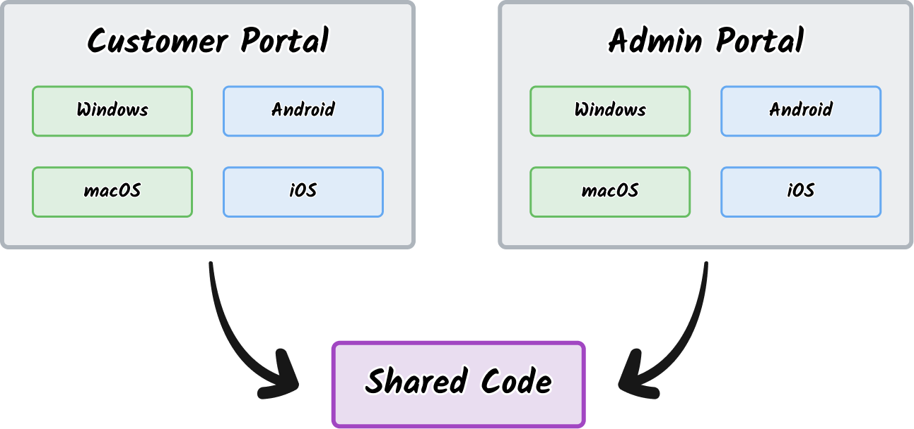

---
{
  title: "Set up a React Native Web Project in a Monorepo",
  description: "",
  published: '2024-04-05T13:45:00.284Z',
  tags: ['react', 'react native'],
  license: 'cc-by-nc-sa-4',
  originalLink: "https://example.com",
  collection: "React Native Monorepo",
  order: 2
}
---

In our last blog post, we took a look at how to scaffold a React Native monorepo. We explained how some of the benefits were not only code sharing between native apps, but that it enabled us to have different types of applications share the same code:



Here, we showed a Windows, macOS, Android, and iOS app that all share from the same codebase in a monorepo.

What if I told you that this isn't where things stopped?

Let's look at how each of these platforms are supported in React Native:

- [iOS (maintained from Meta)](https://reactnative.dev/)
- [Android (maintained by Meta)](https://reactnative.dev/)
- [Windows (maintained by Microsoft)](https://microsoft.github.io/react-native-windows/)
- [macOS (maintained by Microsoft)](https://microsoft.github.io/react-native-windows/)
- [Web (maintained by ecosystem)](https://necolas.github.io/react-native-web/)

> Wait, what?! We can build web apps using React Native?!

It's true! While this might seem backwards at first, it's a superpower to get a React Native app ported to the web quickly.

So, how do we do this?

## Setting Up the Initial Vite Project

So, let's take the file structure from the last article and add a `websites/admin-portal` folder:

<!-- ::start:filetree -->

- `apps/`
  - `customer-portal/`
  - `admin-portal/`
- `packages/`
  - `shared-elements/`
- `websites/`
  - `admin-portal/`
    - `package.json`
    - `vite.config.ts`
    - `index.html`
    - `src/`
        - `main.tsx`
    - `tsconfig.json`
- `package.json`

<!-- ::end:filetree -->

This `package.json` will include the basics to get a Vite site up-and-running:

```typescript
{
  "name": "vite-project",
  "private": true,
  "version": "0.0.0",
  "type": "module",
  "scripts": {
    "dev": "vite",
    "build": "tsc && vite build",
    "lint": "eslint . --ext ts,tsx --report-unused-disable-directives --max-warnings 0",
    "preview": "vite preview"
  },
  "dependencies": {
    "react": "^18.2.0",
    "react-dom": "^18.2.0"
  },
  "devDependencies": {
    "@types/react": "^18.2.66",
    "@types/react-dom": "^18.2.22",
    "@typescript-eslint/eslint-plugin": "^7.2.0",
    "@typescript-eslint/parser": "^7.2.0",
    "@vitejs/plugin-react": "^4.2.1",
    "eslint": "^8.57.0",
    "eslint-plugin-react-hooks": "^4.6.0",
    "eslint-plugin-react-refresh": "^0.4.6",
    "typescript": "^5.2.2",
    "vite": "^5.2.0"
  }
}
```

As well as a `vite.config.ts` file:

```typescript
import { defineConfig } from 'vite'
import react from '@vitejs/plugin-react'

export default defineConfig({
  plugins: [react()],
})
```

This allows us to have our `index.html` file act as our web app's entry point:

```html
<!doctype html>
<html lang="en">
  <head>
    <meta charset="UTF-8" />
    <meta name="viewport" content="width=device-width, initial-scale=1.0" />
    <title>Your App Name Here</title>
  </head>
  <body>
    <div id="root"></div>
    <script type="module" src="/src/main.tsx"></script>
  </body>
</html>
```

Finally, the `<script>` tag allows us to run and import `main.tsx` from `src` to run React:

```tsx
import React from 'react'
import ReactDOM from 'react-dom/client'

function App() {
  return <p>Hello, world!</p>
}

ReactDOM.createRoot(document.getElementById('root')!).render(
  <React.StrictMode>
    <App />
  </React.StrictMode>,
)
```

# Adding React Native Web Support

Now, to run React Native in the Vite project, we'll add a few new packages:

```shell
yarn add react-native react-native-web
```

Then, we can tell Vite that "whenever you see `react-native`, replace it with `react-native-web`" by updating our `vite.config.ts` file:

```typescript
import { defineConfig } from 'vite'
import react from '@vitejs/plugin-react'

export default defineConfig({
  plugins: [react()],
  resolve: {
    alias: [
      { find: /^react-native\/(.*)/, replacement: "react-native-web/$1" },
      {
        find: /^react-native$/,
        replacement: "react-native-web",
      },
    ]
  }
})
```

Now we can use `react-native` imports in our app:

```tsx
import {Text} from "react-native";

function App() {
  return <Text>Hello, world!</Text>
}
```

# Resolving Web Modules First

In React Native's default bundler, Metro, it's able to select which files should be imported based on which platform you're building for.

IE:

<!-- ::start:filetree -->

- `main.tsx`
- `main.ios.tsx`
- `main.android.tsx`

<!-- ::end:filetree -->

Will import from `main.tsx` if you're not using React Native, `main.ios.tsx` if you are and are building for iOS apps, and `main.android.tsx` if you're targeting Android.

IE - Building for iOS will select the following file when importing `main`:

<!-- ::start:filetree -->

- `main.tsx`
- **`main.ios.tsx`**
- `main.android.tsx`

<!-- ::end:filetree -->

This feature extends to React Native Web support as well. Many libraries rely on this functionality to resolve a `.web.tsx` or `.web.js` extension before other prefixed paths.

-------

To add support for this into Vite, we'll need to add the following to our Vite config:

```typescript
const defaultExtensions = [
  ".mjs",
  ".js",
  ".mts",
  ".ts",
  ".jsx",
  ".tsx",
  ".json",
];

const allExtensions = [
  ...defaultExtensions.map((ext) => ext.replace(/^\./, ".web.")),
  // For AWS
  ...defaultExtensions.map((ext) => ext.replace(/^\./, ".browser.")),
  ...defaultExtensions,
];

export default defineConfig({
  // ...
  optimizeDeps: {
    esbuildOptions: {
      loader: {
        ".js": "jsx",
        ".ts": "tsx",
      },
      mainFields: ["module", "main"],
      resolveExtensions: [".web.js", ".js", ".ts"],
    },
  },
  resolve: {
    extensions: allExtensions,
    // ...
  },
});
```

# Handle JSX in JS Files 

Some packages do not bundle their JSX in `.jsx` file extensions and instead have their JSX in `.js` files. [Vite does not support this and requires all JSX syntax to be in `.jsx` or `.tsx` files](https://github.com/vitejs/vite/discussions/3112). 

To sidestep this, we'll add a custom Vite plugin that transfoms 

```javascript
{
  name: "load-js-files-as-jsx",
  async load(id) {
    if (
      !id.match(
        /node_modules\/(?:react-native-reanimated|react-native-vector-icons)\/.*.js$/,
      )
    ) {
      return;
    }

    const file = await fs.promises.readFile(id, "utf-8");
    return esbuild.transformSync(file, { loader: "jsx" });
  },
}
```

This means that if you see an error like this:

```
[commonjs--resolver] Unexpected token (58:16) in /websites/web-portal/node_modules/react-native-elements/dist/input/Input.js
file: /websites/web-portal/node_modules/react-native-elements/dist/input/Input.js:58:16
56:         });
57:         const hideErrorMessage = !renderErrorMessage && !errorMessage;
58:         return (<View style={StyleSheet.flatten([styles.container, containerStyle])}>
                    ^
59:         {renderText(label, Object.assign({ style: labelStyle }, labelProps), Object.assign({ fontSize: 16, color: (_a...
60:                 android: Object.assign({}, fonts.android.bold),
error during build:
SyntaxError: Unexpected token (58:16) in /websites/web-portal/node_modules/react-native-elements/dist/input/Input.js
```

You should add the dependency throwing the error (in this case, `react-native-elements`) to the regex above.


--------

--------

--------

----------------

--------

--------

--------

--------

# Add Font Icons (`react-native-vector-icons`)

- Copy plugin
- Stylesheet


# Styled Components

```jsx
optimizeDeps: {
  esbuildOptions: {
    loader: {
      ".js": "jsx",
      ".ts": "tsx",
    },
    mainFields: ["module", "main"],
    resolveExtensions: [".web.js", ".js", ".ts"],
  },
  include: [
    "react",
    "react/jsx-runtime",
    "react/jsx-dev-runtime",
    "react-dom",
    "styled-components",
    "styled-components/native",
    "use-sync-external-store-shim",
    "use-sync-external-store",
  ],
},
```

