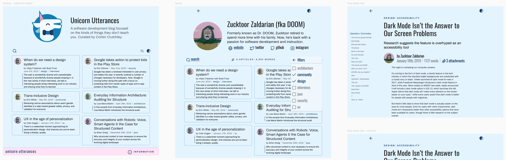
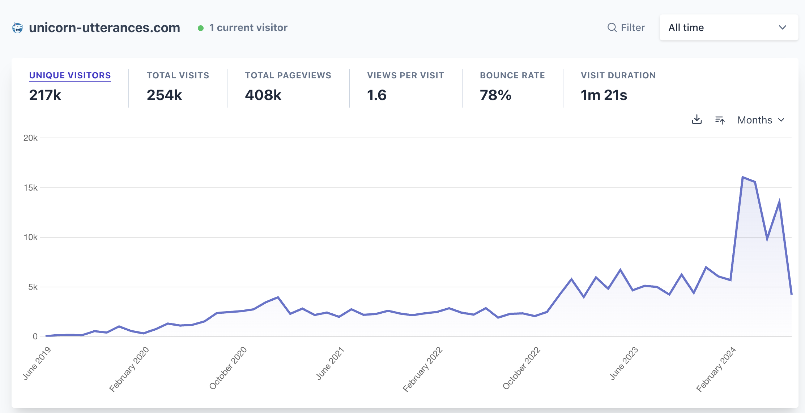
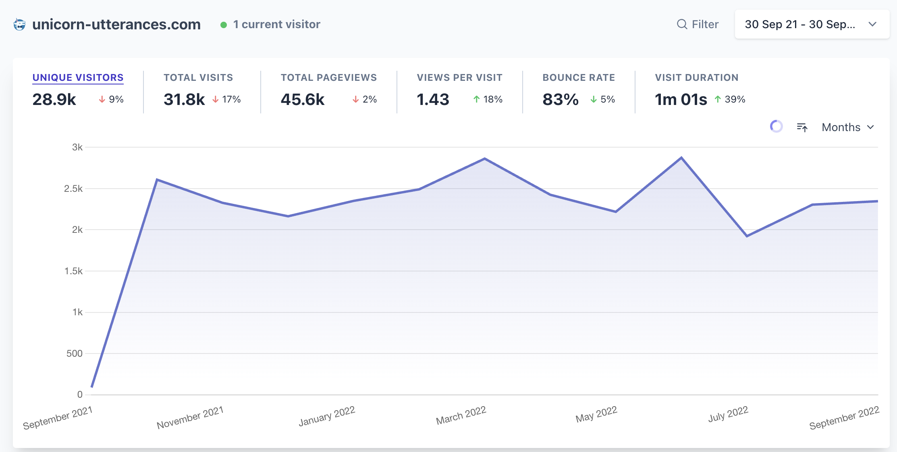
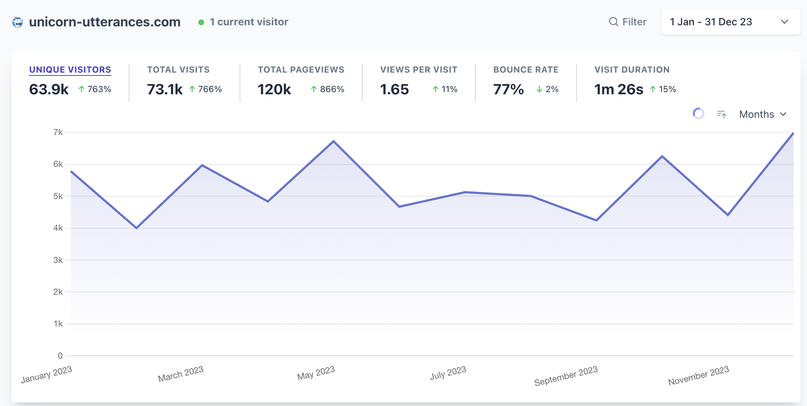
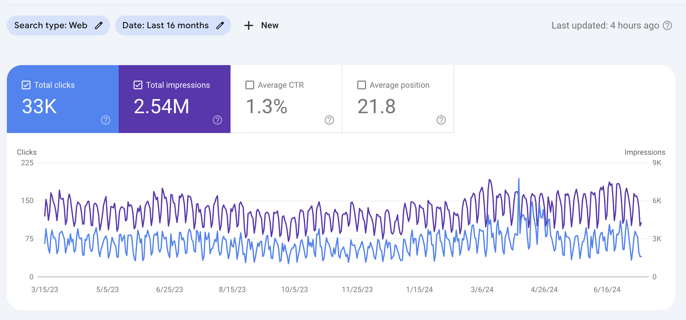
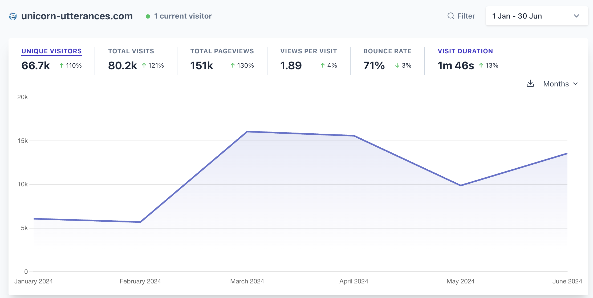
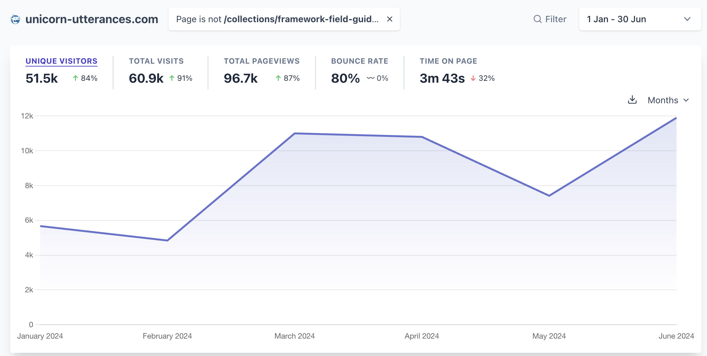
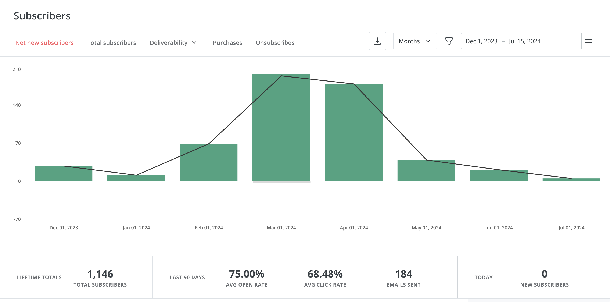
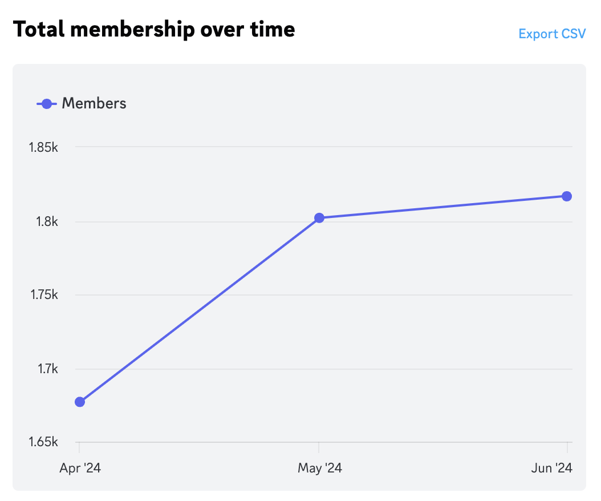

---
{
    title: "It's Time For A Change: Rebranding Our Platform",
    description: "\"Unicorn Utterances\" is now \"Playful Programming\". Let's talk about why, what's different, what's the same, and what's next.",
    published: '2024-07-29',
    tags: ['announcements'],
    license: 'cc-by-4'
}
---

Today's a big day. After 5 years of this platform being called "Unicorn Utterances", **we're rebranding to "Playful Programming"**.

> What? Why? What does this mean?

Let's talk about it.

# The Timeline

While Unicorn Utterances has always been a volunteer-ran platform, let's a look at our history as a whole:

- October 2014: [Corbin Crutchley](/unicorns/crutchcorn) (cofounder of the platform; author of this post) turns 16. Not only are they a year older; they started working at an adult high school as their only tech person. This role required them to learn Python and Bash; starting their career early on.

  Partly due to the new job, partly due to an overarching interest in tech; Corbin joined the [social media platform Google+](https://en.wikipedia.org/wiki/Google%2B) (remember that?) and started talking with other people on the platform.

  The list of people they met would eventually be a whos-who of Unicorn Utterances alumni:

  - [James Fenn](/unicorns/fennifith) (cofounder)
  - [Evelyn Hathaway](/unicorns/evelynhathaway) (cofounder)
  - [Vukašin Anđelković](https://unicorn-utterances.com/unicorns/zavukodlak) (logo designer)
  - [Tom Wellington](/unicorns/tommyemo) (initial design lead)
  - [Eduardo Pratti](/unicorns/edpratti) (future/present design lead)
  - [Alex Dueppen](/unicorns/adueppen) (developer, moderator)
  - [Kevin Aguilar](/unicorns/kevttob) (designer)

- May 2018: Corbin starts working in person at a bootcamp nearby them. While they adored the students, peers, and process of teaching others - they found the high up-front cost and promises of work post-graduation (an impossible promise given the industry's volatility) to be arguably predatory. As a result, Corbin quits the bootcamp after only 5 months.

  After quitting the bootcamp, Corbin speaks with many of the students. They encourage Corbin to keep teaching and point out that there's nothing preventing them from doing so in their own context; outside of any other organization.

- Early 2019: Inspired by the bootcamp students, Corbin approaches James Fenn and Evelyn Hathaway to help kickstart a platform where they're all able to teach people how to program.

- May 19th, 2019: Evelyn Hathaway proposes the name for this new platform to include the word "Unicorn"; to ensure playfulness in the site. "Unicorn Utterances" is selected as the name for its alliteration and fun.

  Vukašin is approached to make a logo for the platform given the name.

  With a name selected and a logo on the way, the `unicorn-utterances.com` domain was registered.

- May 20th, 2019: Vukašin provides the initial sketches that would turn into the Unicorn Utterances logo.
  

- May 23rd, 2019: Vukašin iterates on the logo further in Figma:

  

  Corbin proposes adding an accessory that personalizes the Unicorn without making it too much of a nerd cliché; a bowtie.

  

  The logo is then finalized into what was shipped with the website for 5 years:

  

- May 30th, 2019: Tom Wellington is approached to design the initial UI for the site.

- May 31st, 2019: [The initial commit of Unicorn Utterances is made](https://github.com/unicorn-utterances/unicorn-utterances/commit/567f3d32b3c2a1bdeca95f2b3c16026901b539cb), starting development in [Gatsby](https://web.archive.org/web/20190625131121/https://www.gatsbyjs.com/).

- June 5th, 2019: Tom provides the first mockups for the site:

  

  Tom spends an inordinate amount of time [iterating on this design in Figma](https://www.figma.com/design/di3zKgJCj264nqN9g3UCSLwP/crutchcorn-%E2%80%93-unicorn-utterances), but ultimately lands on the following design for the initial launch:

  

  > Tom did an amazing job on the initial design. I (Corbin) never fully followed this design pattern due to a lack of attention to detail.
  >
  > As a result, [the initial launch of the site](https://web.archive.org/web/20200513225405/https://unicorn-utterances.com/) lacked much of the polish and features that Tom's designs demonstrated. Sorry about that, Tommy! 😅

- June 29th, 2019; [A blog post is written to test the development of and announce the website to the public](/posts/uttering-hello-introduction-post)

- July 11th, 2019: [The inaugural programming blog post is written about Angular templates](/posts/angular-templates-start-to-source)

- August 8th, 2019: [The Unicorn Utterances Discord server](https://discord.gg/FMcvc6T) is launched.

  > Fun fact: Corbin initially proposed for Slack, but James Fenn (correctly) suggested Discord for the shared social aspects.

- February 2nd, 2020: [Corbin starts streaming regularly on Twitch](https://www.twitch.tv/crutchcorn) to help others learn and have fun.

- November 29th, 2021: [The site begins its rewrite to Next.js](https://github.com/unicorn-utterances/unicorn-utterances/pull/289) due to buggy customization in Gatsby interrupting site development. 

- January 9th 2022: Corbin starts work on [The Framework Field Guide](https://framework.guide) privately; aiming to be the platform's first book published.

- January 16th, 2022: The Next.js site rewrite is completed, enabling significantly better customization for our Markdown content.

- June 11th, 2022: [The initial announcement for "The Framework Field Guide" is launched](https://github.com/unicorn-utterances/unicorn-utterances/pull/367)

- July 9th, 2022: [The site begins its rewrite to Astro](https://github.com/unicorn-utterances/unicorn-utterances/pull/386) due to performance problems in the Next.js site.

- August 2nd, 2022: Corbin approaches Eduardo Pratti with a request to redesign "The Framework Field Guide"'s website.

  His very first mockup was presented the same day:

  

- August 24th, 2022: Eduardo Pratti showcases an initial proposal to redesign the main Unicorn Utterances site:

  

- November 8th, 2022: [The new landing page for "The Framework Field Guide" starts development.](https://github.com/unicorn-utterances/unicorn-utterances/pull/436)

- December 3rd, 2022: The site's migration to Astro is finalized, original design in place. The lighthouse score on every page is improved; on some pages it is even doubled.

- December 6th, 2022: The new landing page for "The Framework Field Guide" launches

- March 3rd, 2022: [The site's redesign, led by Eduardo Pratti and James Fenn, launches](https://github.com/unicorn-utterances/unicorn-utterances/pull/497)

  > Fun fact, this redesign was codenamed "UwU" as joke amongst the team.

- October 20th, 2023: The redesign is finished and launched to production.

- March 11th, 2024: ["The Framework Field Guide, Fundamentals" is launched to the public](/collections/framework-field-guide-fundamentals).

- June 2024: The 5 year anniversary of "Unicorn Utterances" occurs:

  

# Measuring Our Impact

Whew! What a wild 5 years. What started as a humble project of a few friends has since grown to:

- [400,000 lifetime pageviews to our site](https://plausible.io/unicorn-utterances.com/unicorn-utterances.com/unicorn-utterances.com/?period=all&with_imported=true)
- [333,000 words written on our blog](/search?q=*)
- [217,000 unique visitors to our site](https://plausible.io/unicorn-utterances.com/unicorn-utterances.com/unicorn-utterances.com/?period=all&with_imported=true)
- [52,000 messages sent in our Discord](https://discord.gg/FMcvc6T)
- [4,800 commits to our site's codebase](https://github.com/unicorn-utterances/unicorn-utterances)
- [2000 Discord members](https://discord.gg/FMcvc6T)
- 1000 members of our mailing list
- [156 blog posts written on our blog](/search?q=*)
- [45 contributors](/about)
- [1 book published](/collections/framework-field-guide-fundamentals)

From the bottom of our hearts; wow. Thank you. Thank you for contributing, for asking questions, for talking with us, and for supporting us through the years.

Most exciting of all has been seeing our platform grow over that time:

But while all of this is exciting when put into the right perspective, I can't help shake a feeling: Is this a healthy growth curve?

To be clear; this isn't a rhetorical question - I authentically do not know; I'm not a subject matter expert in blog growth metrics or SEO.

But, if I'm being vulnerable for a moment, I'm worried that the answer might be "no, your growth is slower than it should be given the amount of effort going into it."

After all, we migrated from Google Analytics to [Plausible](https://plausible.io/) in October 2022. As a result of this migration and some tricks we utilize to maximize our analytics tracking since then, metrics looked like they doubled overnight when they hadn't.

Let's take a look at a year of data prior to the migration and a year of data after the migration.

Here's our data imported from Google Analytics to Plausible from September 2021 to September 2022:

> In September 2021, we had an outage of our analytics data thanks to some misconfiguration on our end.

And here's our Plausible data from Jan 1st 2023 to December 31st 2023:

Moreover, if we do the math and:

- Add an extra month (~2.2K visitors) of data from the missing September 2021 dataset
- Multiply that data by 2x to reduce the difference in our analytics hosting providers' reporting

We can see that growth from September 2021 to December 2023 went from:

- ~62.2k visitors from September 2021 - September 2021

To:

- ~63.9k visitors from Janurary 2023 to December 2023

That's only a growth of `0.9%` in over 2 years 😬

> This ignores some details such as the exact deviation of Google Anaylitics from Plausible reporting to December historically being a bad month for tech readership as industry knowledge. That said, this still demonstrates the point that we've struggled to see much growth on our site.

Needless to say, it appears that we have a problem with growth. Google Search analytics seem to back this hypothesis up:

In the past 16 months, our click-through rate (CTR) is lower than usual as far as I can tell looking at other tech blogs, and it's been challenging to get folks to click on our site when it's shown to them as an option.

## Breaking From The Expected Patterns

This all looks rather bleak until you move the sethoscope of our project's health to today:

As you can see, looking halfway through the year and it seems like we've already passed the traffic of last year's entire visiter count. Our launch of "The Framework Field Guide" seems to have gone well!

Not only is the unique visitor count higher, our bounce rate is only at ~70%, which is better than some tech blogs I've seen.

Finally, if we remove our marketing sites (which are often only glanced at, even outside of our organization) and look only at articles themselves, we find ourselves with a time-on-page of nearly 4 minutes:

These are great indicators that people are eager to consume our educational materials and want enough of it that they'd continue to sign up for our newsletter to be notified for more of it:

And even join our Discord to discuss our content further:

# Conclusions From Our Data

So, if we have a problem with growth but people are eager to read our content once they find us; **that's a discoverability problem.**

Our "top-of-funnel", so to speak, is broken. Let's not mince words or confuse responsibility, however; This is solely my (Corbin's) fault.

While others have had a massive role in other aspects of Unicorn Utterances, I've been responsible for managing our social media and promoting the brand. As far as I know, nobody else even has access to our social media account.

However, while there's some things I can do to offload this onus and improve my throughput on social media engagement, there's some repeated bits of feedback we've gotten a few times:

1) What is an "Utterance"?
2) What do y'all do?
3) How do you fund yourselves?

While these three questions may seem disjointed, there's a throughline in it; **brand confusion.** 

After all, the word "Unicorn" often refers to [a company evaluated for more than billion dollars](https://en.wikipedia.org/wiki/Unicorn_(finance)) and "Utterances" is often misheard as "Udderances", which leads some to sheepishly ask if we pertain to dairy work in any way.

Moreover, since our redesign launched this year, I've been asked repeatedly what's our "company"'s funding source and what our main product is.

But instead of a highly profit-driven dairy company, we're a volunteer-based developer education platform aimed at migrating people into the industry and improving their skillsets in a fun way.

Given this confusion, what can we do to improve our problem of ambiguous motivation and goals?

# Looking Forward

First and foremost, we took a look at our naming and realized while it has a certain charm once you're used to it; it was time for a change.

After hours and hours of searching (no joke!) we landed on something that we thought captured our brand well: **Playful Programming** (PFP for short).

Not only is it more directly linked to programming and software engineering, but it keeps our long-standing obsession with alliteration; all while keeping things fun and delightful for newcomers to discover us and feel welcomed.

-----

Second: We're often mistaken for a for-profit group. We're not. While we haven't (yet?) decided to be an official non-profit, **we're a volunteer based collective**. As of today, all of the funds from Playful Programming have been sponsored either by myself (Corbin) or by my own consulting agency, [OceanBit](https://oceanbit.dev/).

The problem with this is that when people assume we're a company, they miss out on the fact that **we're actively and consistently looking for contributors**.

To help make this more evident, we've designed and developed [a new page on the site with a call to action to "Get Involved"](/get-involved). Here, we outline what benefits volunteering for our group brings and what we're looking for.

--------

Third: Contributors aren't the only thing we're looking for. I mentioned that all funding has come from me or my company; that's not sustainable.

Today, our spend can be broken down by:

- ConvertKit newsletter hosting ($490/yr)
- Vercel hosting ($240/yr)
- Plausible analytics ($190/yr)
- Domain costs ($80/yr)

> While there are some things we could do to bring this cost down, we're happy with our setup and would like to keep it. Moreover, we'd like to expand it in many ways that are not financially viable today.

**We need sponsors** to continue supporting us as we grow. We offer in-banner content ads like this one:

<!-- *::in-content-ad title="Consider supporting" body="Donating any amount will help towards further development of articles like this." button-text="Visit our Open Collective" button-href="https://opencollective.com/unicorn-utterances"* -->

As well as sidebar ads, inclusion in our newsletter, Discord, and other social media announcements. We'd even be willing to consider partnered content if we found the conditions acceptable.

[We also accept donations through our Open Collective](https://opencollective.com/unicorn-utterances), and any money donated will go directly to growing our project. We'd love to get to a point where we can even compensate our contributors.

--------

Finally, **we're determined to continue making great content for everyone to enjoy**. Our upcoming books in "[The Framework Field Guide](/collections/framework-field-guide)" have many folks excited to learn more about each framework's internals, and we're always writing smaller content along the way.

We never want to turn into a sloppy content farm or reduce the quality of our work to garner more attention. We'll continue our high bar for quality as we always have.

We look forward to sharing more with you; whether that be via email, a Discord message, or a new post.

Thank you for joining us along this journey as we move into the next chapter of Playful Programming.

Best,

\- Corbin Crutchley and the Unicorn Utterances Crew
