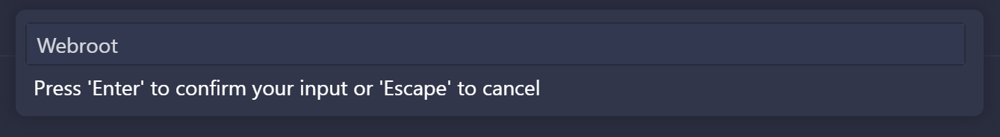

---
{
    title: "Setup Adobe ColdFusion in Docker",
    description: "Adobe ColdFusion can feel daunting to set up. Luckily for us, there's an easy method of getting up and running using Docker. Let's explore that option!",
    published: '2025-03-01T20:12:03.284Z',
    tags: ['coldfusion'],
    license: 'cc-by-4'
}
---

[Adobe ColdFusion](https://www.adobe.com/products/coldfusion-family.html) just saw it's newest release hit the scene: ColdFusion 2025. This release continues a trend that's been occuring for the past few years; encouraging growth and continual improvements.

One area where ColdFusion has seen intense growth is in local developer experience.

Nowadays, you can setup a Visual Studio Code environment and run a ColdFusion server in Docker to easily manage a free and easy to configure programming environment.

Let's explore how to set that up.

# Docker

We'll first start with a pretty fundamental prerequisite: Installing Docker.

You can choose between [Docker Desktop GUI](https://www.docker.com/products/docker-desktop/) and the [Docker Engine CLI](https://docs.docker.com/engine/install/). Follow the installation steps for one of the tools to get started.

-----

Regardless of the tool you have selected, you should be able to access the `docker` CLI command.

We can use this `docker` utility to create a container for ColdFusion using the following command:

```shell
docker container create --name coldfusion -p 8500:8500 -p 7071:7071 -p 45564:45564 -p 8122:8122 -e acceptEULA=YES -e password=YOUR_PASSWORD_HERE -v LOCAL_PATH_HERE:/app adobecoldfusion/coldfusion:latest
```

<details>
<summary>Example Command</summary>

```shell
docker container create --name coldfusion -p 8500:8500 -p 7071:7071 -p 45564:45564 -p 8122:8122 -e acceptEULA=YES -e password=ColdFusion123 -v C:\Users\crutchcorn\git\ColdFusion\webroot:/app adobecoldfusion/coldfusion:latest
```

</details>


This command:

- Names the created container `coldfusion`
- Forwards four ports needed for ColdFusion from the container to the host operating system
- Accepts the EULA for ColdFusion
- Sets `YOUR_PASSWORD_HERE` as the password for the admin account you'll use to configure the ColdFusion dashboard 
- Exposes the host machine's `LOCAL_PATH_HERE` folder as an empty folder you'll use to upload files to your ColdFusion instance.

------

Now that we have our container created, we can start it using the command:

```shell
docker start coldfusion
```

> You can configure much more on the ColdFusion container. To do this, [please follow the ColdFusion docs for Docker Images](https://helpx.adobe.com/coldfusion/using/docker-images-coldfusion.html)

# Looking at the ColdFusion Dashboard

Once the container is started you can go to [`localhost:8050`](https://localhost:8050) to see a directory listing of the ColdFusion server:


While this isn't overly helpful on its own, it tells you that ColdFusion is running properly.

From there, you can access [http://localhost:8500/CFIDE/administrator/](http://localhost:8500/CFIDE/administrator/) to get to the admin portal.


On this screen, you'll type in the password you passed to the `docker create` command earlier.

This will show the rest of the dashboard for you to configure ColdFusion with:


> While you can deep-dive into configuring ColdFusion, we'll leave the settings all as defaults for now. [For more information on configuring ColdFusion, refer to the official docs](https://helpx.adobe.com/coldfusion/configuring-administering/using-the-coldfusion-administrator.html)

# Visual Studio Code

To use ColdFusion with Visual Studio Code (VSCode), we'll:

- [Install VSCode from their site](https://code.visualstudio.com/)
- [Install Java 18 from their site](https://www.oracle.com/java/technologies/downloads/)
- [Set the `JAVA_HOME` environmental variable](https://helpx.adobe.com/coldfusion/coldfusion-builder-extension-for-visual-studio-code/get-started-coldfusion-builder-extension-visual-studio-code.html)
- [Install the "Adobe ColdFusion Builder" extension](https://marketplace.visualstudio.com/items?itemName=com-adobe-coldfusion.adobe-cfml-lsp)


Once this is configured, we should see the "Cf" logo in our VSCode's sidebar:


## Adding a server

Once the extension is installed, we'll press "`Add Server`" to add a reference to our local ColdFusion Docker installation:


While this might look daunting at first, the only things we'll need to configure are:

- Server Name: A nickname for our server
- Host Name: Set it to `localhost`
- `WebServer Port`: Set it to `8500`
- Application Server: Leave it as "CF+Tomcat Bundle"
- RDS User Name: Set it to `admin`
- RDS Password: Set it to the password we passed to the Docker container (`YOUR_PASSWORD_HERE`)
- Type: Set to "`Is Remote`"

Once completed, our "General Settings" page should look like this:


We can verify that the setup is done properly by pressing `Test Connection`. If successful, we'll see a prompt that "Test connection was successful":


Once verified, we can press "Finish" and see the following:


## Opening a workspace

To start working on our ColdFusion project, we'll need to click on `Create Project` in the ColdFusion Builder extension:


This will prompt you to create a name for the workspace - we'll call ours "Webroot":



Finally, it will ask you to select a folder. Select the path we originally passed to Docker (`LOCAL_PATH_HERE`).

Once this is done, it will open the folder you selected in VSCode and generate a few required files for you:


# Uploading Files

To run your first program with ColdFusion, let's add an `index.cfm` file to the root of the folder we referenced in our `docker create` command:

```html
<!-- index.cfm -->
<cfscript>
function testStuff(){
    writeOutput(NOW());
}

testStuff();
</cfscript>
```

Then reload [`localhost:8050`](https://localhost:8050) to see the current date displayed to the server.


> **Hint:**
> Make sure to open the `LOCAL_PATH_HERE` folder in VSCode so you can see the syntax highlighting applied properly!