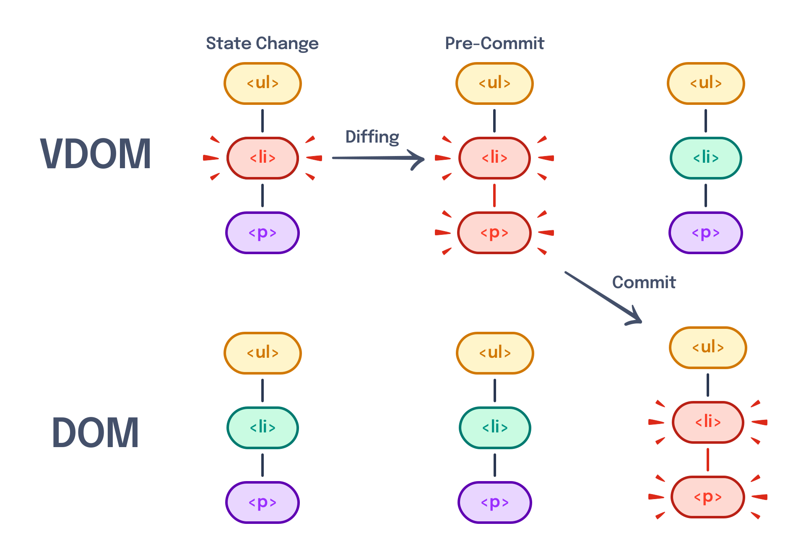
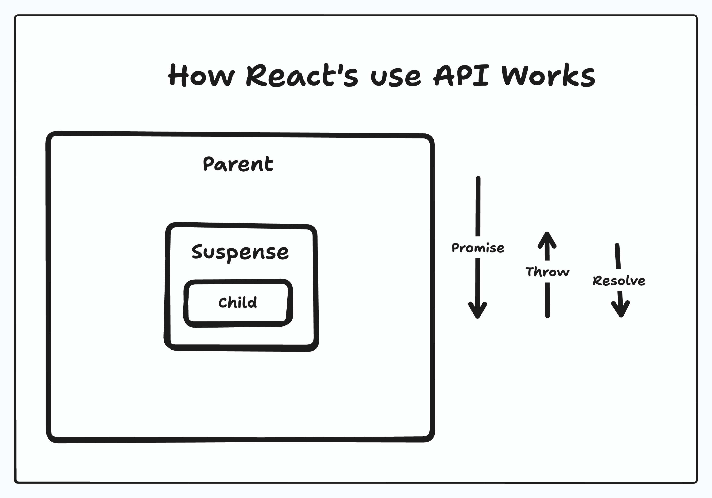
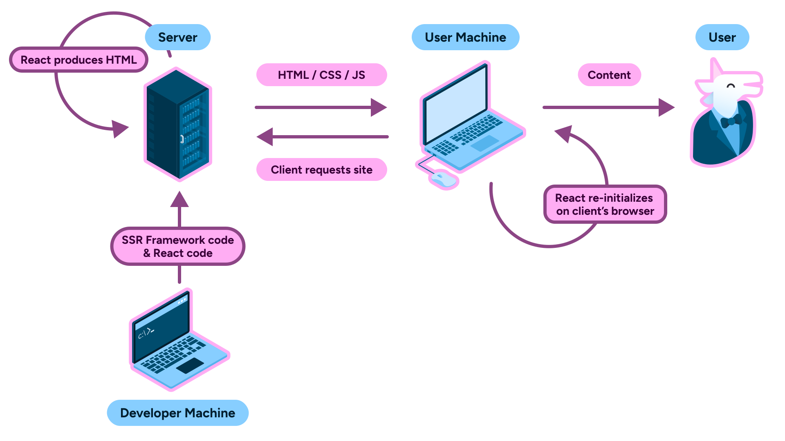
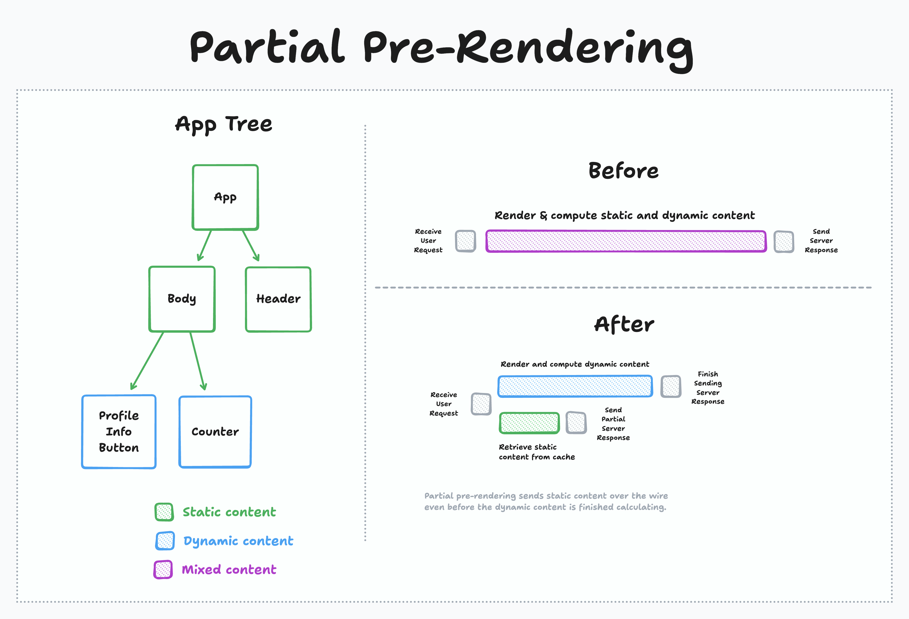
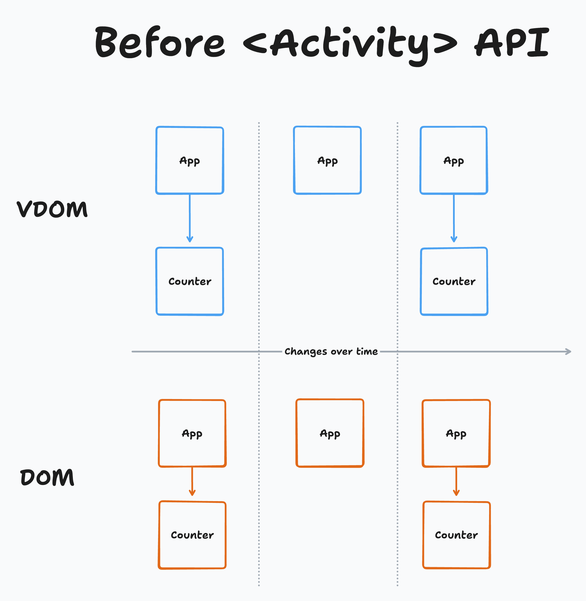
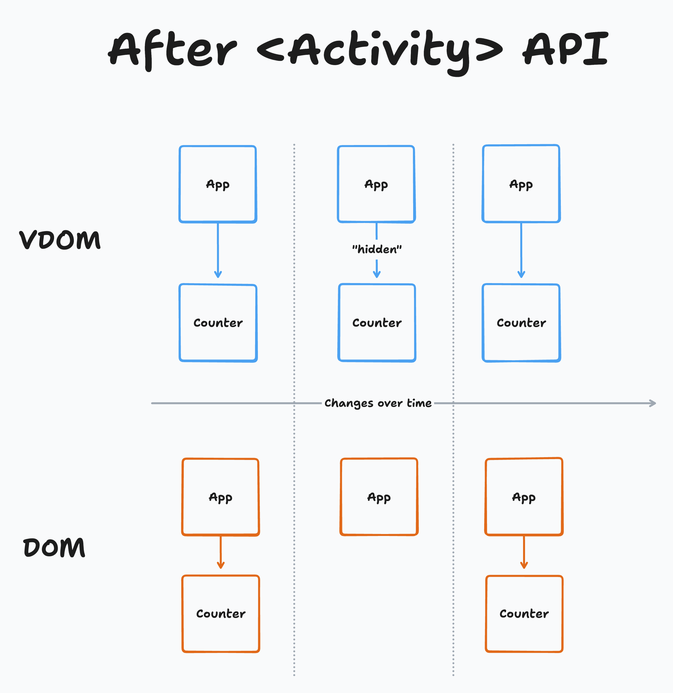

---
{
	title: "Stop Outsourcing Your React Opinions",
	description: "TODO: Write this",
	published: '2025-08-01T05:12:03.284Z',
	tags: ['react', 'javascript', 'webdev', 'opinion'],
	license: 'cc-by-nc-sa-4'
}
---

Look, I get it. Tech content creators are fun. But seriously, you've **got** to stop letting others think for you.

I've heard it all over the years:

> Separations of concerns don't work with JSX

> Class-components can't compose

> Hooks should have had a 1:1 mapping with class component's lifecycle methods

> It's silly that function components re-run the function itself

> Hooks are so fragile that they don't even allow conditional usage

> React changes every year; way to fatigue the ecosystem

> StrictMode breaks my app because React doesn't work right

> Vercel took over React to build RSC to sell more servers 

> React's so slow it needs a compiler to behave properly

These takes? Yeah, they're wrong. Maybe some flavor of them has enough nuances to get close to being right, but if you're being shilled a take like this from Theo or Prime? Unlikely.

I'll be honest, it's not really their fault. Hot takes are part of the game — you're actively incentivized to get content out as quickly as possible in that world. The faster you are, the more clicks you get, the more money it generates.

In ["Thinking, Fast and Slow"](https://en.wikipedia.org/wiki/Thinking,_Fast_and_Slow), this kind of "fast thinking" is almost automatic; purely driven by emotion and mentally easy-to-reach experience.

But c'mon, we're adults, surely we can take our time to digest the work being done for us and try to understand a different perspective?

**React can absolutely be validly criticized, but to do so we should take a closer look at the decision-making matrix the team has employed while building out React over the past ten plus years**.

Because here's my thing: I think that **a majority of hot takes about React are wrong** and stem from kneejerk reactions that don't take the broader scope of things into mind.

In fact, I'll go further:

Whether or not you agree with the tradeoffs that were made, **React's decision-making has been remarkably consistent and broadly has your best interests in mind**.

To present my case, we'll explore the concepts React has introduced along the way and potentially build out a new mental model for the framework as we go.

# The first days of React

The year is 2011; Facebook has a problem. They've got an in-house framework, "[BoltJS](https://web.archive.org/web/20130608154901/http://shaneosullivan.github.io/boltjs/intro.html)" that they're using in-house on their "ads" team. It's _working_, but there are problems in the code. While ~90% of the problems on the ads product can be written in Bolt, there are instances in the project that the team has had to eject from their own framework and use less declarative solutions.

While this isn't a problem to tackle instantly, it poses a new set of problems for the rampantly growing team at Facebook; 10% applied across a large group quickly becomes a problem in consistency, training, and overall developer experience. Left unchecked, this will inevitably impact their ability to ship as quickly as they'd like.

The problems with BoltJS didn't sit right with one of the members of the ads team — Jordan Walke; few programming paradigms did. In a community interview, Jordan would outline:

> Even as I was first learning how to program, the old MVC style of programming with data binding and mutation just never felt right to me, even when I didn't have the technical terminology to describe things like "mutation", or "functional programming".

> My code would usually look really weird to other people [...]. For the longest time I just assumed "welp, I guess I'm just a weird programmer". Then I finally took a course on programming language fundamentals [...] and I finally had some basic terminology to be able [to] describe how I wanted to build applications.

So Jordan began to experiment with his own solutions to many of the problems he perceived Bolt and other frameworks had at the time. This experimentation began life as a personal project of "[FaxJS](https://github.com/jordwalke/FaxJs)". FaxJS would go on to be shortly renamed to "FBolt" (Functional Bolt) before making its way to being called "React." A small team begins developing around the virgining tool.

------

Fast-forward to 2012; Facebook is doing great. So well, in fact, that they've just [acquired Instagram for one billion dollars](https://archive.nytimes.com/dealbook.nytimes.com/2012/04/09/facebook-buys-instagram-for-1-billion/).

Instagram has a mobile app for Android and iOS, but no web presence. The new team at Facebook is tasked with building out their solution to this problem, but with a constraint of their new parent company: Use one of our existing tech stacks to do so.

After some time evaluating both Bolt and React, the team makes a decision; they're going to be the first production codebase to use React.

The team quickly realizes they have something special on their hands; they're shipping quickly, performance seems to be handled well, and the developers love working in their newfound system. A group begins conversations around open-sourcing the project, even from early days.

But now they have a new problem: Facebook now has two solutions for browser rendering between the incumbent Bolt and the up-and-coming React.

The teams of both sit down, discuss heavily, and realize the challenge expands past their wheelhouse. [Facebook's IPO is down](https://en.wikipedia.org/wiki/Initial_public_offering_of_Facebook#Subsequent_days) and the ads product was their big moneymaker; the very team that had just recently moved a large project to use Bolt. It would take them four months to migrate to React; no new features in that time.

Just when it looked like an impossibility for React's adoption inside Facebook, the CTO came into the picture: ["Make the right technical choice, and make the right long-term choice — and if there are short-term consequences, I’ll back you up. If you need months to do a rewrite, do it."](https://x.com/schrep/status/1625917218809868288)

------

The React migration of the ads platform was another win for the team as they saw similar successes as the Instagram adoption.

As 2013 came in, the team that had been pushing for React's open-sourcing would become more and more prevalent in conversation. Eventually they would win the internal battle. Finally, after all that time, React was ready to open-source: [At JSConfUS 2013, Tom Occhino and Jordan Walke publicly announced the project alongside the release of code and docs.](https://www.youtube.com/watch?v=GW0rj4sNH2w)

> **Further reading:**
>
> Eager to learn more of React's early history? Check out [the official blog post outlining much of the technical history of React](https://legacy.reactjs.org/blog/2016/09/28/our-first-50000-stars.html), or maybe [the React Documentary from CultRepo](https://www.youtube.com/watch?v=8pDqJVdNa44)

Even then, the first release of React was [heavily criticized](https://news.ycombinator.com/item?id=5789055). Amongst the concerns? Their newly introduced method of writing markup: JSX.

## The problems of markup

[Even in the earliest days of React, the idea of representing your HTML code in a JavaScript file was established.](https://www.youtube.com/watch?v=x7cQ3mrcKaY)

This provided a large amount of flexibility for the early framework; not only did it enable the ability to sidestep custom template tags for things like conditional rendering logic and loops, but it was fun to work with and allowed fast iteration of UI code.

This meant that code that might've otherwise looked like this:

```html
<!-- This code is expected to live in another file or be a static string of some kind -->
<div>
    <!-- This is psuedo-syntax of a theoretical framework's template code -->
    <some-tag data-if="someVar"></some-tag>
    <some-item-tag data-for="let someItem of someList"></some-item-tag>
</div>
```

It could instead look like this:

```jsx
const data = <div>
	{someVar && <some-tag/>}
	{someList.map(someItem => <some-item-tag/>)}
</div>
```

This came with some major benefits:

- Template compilation could occur before runtime — allowing errors to be caught earlier in the development lifecycle
- Since JSX was not a string, it had better XSS protections out of the box without having to require a specific API to do so
- Reuse of JavaScript for flow-control; no need to reinvent the expressiveness of JavaScript in another string-based language

The API for JSX also enabled the "template to JavaScript" transform to stay extremely lightweight. Instead of having to rely on some kind of HTML to JavaScript compiler, the tags of the JSX are able to be trivially transformed to JavaScript functions:

```jsx
// The following JSX
function App() {
	return <ul role="list"><li>Test</li></ul>
}

// Turns into a straightforward transform to function calls to run on the browser
function App() {
	return React.createElement("ul", {
		role: 'list'
    }, [
			React.createElement("li", {}, [
				"Test"
      ])
    ]);
}
```

This also meant that even across code transforms the line of code, an error was thrown could map one-to-one with the final output ran in the browser; great for debugging!

But these improvements didn't make for a smooth ship for the React team. As mentioned earlier, JSX came heavily criticized, for one reason predominantly...

### "Separation of concerns" doesn't mean what you think it means

> Separation of concerns is a pretty core tenant of CS. React just seems wrongity wrong wrong wrong. #jsconf

\- [A Twitter post from 2013 about React's introduction](https://x.com/nickcrohn/status/339855304160329728).

They weren't alone. One of the common cries against JSX was the idea that it broke "separation of concerns." See, most projects broke apart their code based on the language and type of code that was being used early on:

<!-- ::start:filetree -->

- `src/`
    - `html/`
        - `button.html`
        - `card.html`
        - `dropdown.html`
    - `css/`
        - `button.css`
        - `card.css`
        - `dropdown.css`
    - `js/`
        - `button.js`
        - `card.js`
        - `dropdown.js`
    

<!-- ::end:filetree -->

But here's the thing: This is an arbitrary distinction between different parts of the code. Using this system, it quickly becomes a challenge to track down related code.

Instead, the React team proposed (and most modern codebases continue to back) that you should instead split your code based on features:

<!-- ::start:filetree -->

- `src/`
    - `button/`
        - `button.html`
        - `button.css`
        - `button.js`
    - `card/`
        - `card.html`
        - `card.css`
        - `card.js`
    - `dropdown/`
        - `dropdown.html`
        - `dropdown.css`
        - `dropdown.js`

<!-- ::end:filetree -->

By doing so, it becomes much easier to follow the pattern of code and aligns more closely with the ideal React code structure.

> **Further reading**:
> Want to learn the best way to structure your React projects? [I outlined my philosophy more in the "Layered React Structure" (LRS) system.](/posts/layered-react-structure)

## Resembling state over all points in time

Before React there was Backbone.js. Let's look at a simple counter component:

```html
<!-- index.html, shortened for brevity -->
<div id="counter-app"></div>

<script type="text/template" id="counter-template">
    <p>Count: <%= count %></p>
    <button>Add 1</button>
</script>

<script>
/* app.js */
$(function() {
    var CounterModel = Backbone.Model.extend({
        defaults: {
            count: 0
        }
    });

    var CounterView = Backbone.View.extend({
        el: '#counter-app',
        template: _.template($('#counter-template').html()),
        events: {
            'click button': 'increment'
        },
        initialize: function() {
            this.listenTo(this.model, 'change', this.render);
            this.render();
        },
        render: function() {
            var html = this.template(this.model.toJSON());
            this.$el.html(html);
            return this;
        },
        increment: function() {
            var currentCount = this.model.get('count');
            this.model.set('count', currentCount + 1);
        }
    });

    var counterModel = new CounterModel();
    new CounterView({ model: counterModel });
});
</script>
```

Here, we're doing a number of things:

- Reading the initial template from a script tag containing a string representing our template
- Defining the data model of the component to be used in the template

- Manually binding to events and reconstructing the template to HTML on request

This is _okay_, but due to the manual nature of the "Counter" event/data sync, it's easy to accidentally decouple something not intended to be decoupled.

Compare this to an equivalent React's counter from the era:

```html
<div id="root"></div>

<script type="text/babel">
    var Counter = React.createClass({
        getInitialState: function() {
            return {
                count: 0
            };
        },
        increment: function() {
            this.setState({
                count: this.state.count + 1
            });
        },
        render: function() {
            return (
                <div>
                    <p>Count: {this.state.count}</p>
                    <button onClick={this.increment}>
                        Add 1
                    </button>
                </div>
            );
        }
    });

    ReactDOM.render(<Counter />, document.getElementById('root'));
</script>
```

While `this.setState` is in a way an explicit update to the template, a major shift has occurred between Backbone.js:

**The template in React's `render` method isn't just the initial template for the component; it's the template used across time**. 

In pragmatic terms, this means that we do not need to track what component is being rendered and where when updating app data. In philosophical terms, this can be viewed as a ["reconciliation"](/posts/what-is-reconciliation-and-the-vdom) process rather than a "mutation" of the DOM. This idea comes straight from Jordan's learnings from the functional programming world where data must always be [immutable](/posts/new-post-mutable-vs-immutable).

And this data isn't static, either! Click the button to trigger the state change of `count` and your `render` function will execute immediately; giving you a quick and convenient method of [reactivity](/posts/what-is-reactivity).

But this idea of "render everything for every state change" came with its own set of difficulties...

## Making markup reactive

While JSX allowed for lots of flexibility, it meant that templates required a re-execution of all template nodes to construct [the DOM](/posts/understanding-the-dom) with new values.


While smaller scale applications wouldn't likely run into challenges with this approach, large DOM trees would incur massive performance implications as a result of this decision.

To solve this, the team used a concept of a "virtual DOM" (VDOM). This VDOM was a copy of the browser's DOM stored in JavaScript; When React constructed a node in the DOM, it made a copy into its own copy of the DOM.

Then, when a given component needed to update the DOM, it would check against this VDOM and only localize the re-render to the specific node.


This was a huge optimization that allowed for much more performant React applications to scale outward.

Internally, this worked by introducing a diffing stage to the "reconciliation" step of React. It's worth mentioning that [even early React builds had optimized much of the diffing process of the VDOM](https://calendar.perfplanet.com/2013/diff/).



> **Further reading**:
>
> Want to learn more about the reconciliation process? [Here's a resource I wrote to explain the process more in-depth](/posts/ffg-fundamentals-side-effects#rendering-committing-painting).

# Early developer experience

React launched in 2013 with the concept of class-based components; Hooks wouldn't be released until 2019. But class-based components themselves, were not universally loved.

See, a core tennant of components is that they're able to compose; meaning that **we can build a new component from existing components**:

```jsx
// Existing components
class Button extends React.Component {
    // ...
}

class Title extends React.Component {
    // ...
}

class Surface extends React.Component {
    // ...
}

// Can be reused and merged into a
// newly created broader component
class Card extends React.Component {
  render() {
    return (
      <Surface>
        <Title/>
        <Button/>
      </Surface>
    )
  }
}
```

Without this ability, React would be extremely hard to scale in larger applications. However, the same ability to compose could not (at that time) be said for the internal logic of class-based components.

Take the following example:

```jsx
class WindowSize extends React.Component {
  state = {
    width: window.innerWidth,
    height: window.innerHeight,
  }; 

  handleResize = () => {
    this.setState({
      width: window.innerWidth,
      height: window.innerHeight,
    });
  }

  componentDidMount() {
    window.addEventListener('resize', this.handleResize);
  }

  componentWillUnmount() {
    window.removeEventListener('resize', this.handleResize);
  }

  render() {
    // ...
  }
}
```

This `WindowSize` component gets the size of the browser window, stores it in `state`, and triggers a re-render of the component when this occurs.

Now let's say that we want to reuse this logic between components. If you've studied Object-Oriented Programming - where classes come from — you'll realize that there's a good way to do so: [**Class inheritance**](https://developer.mozilla.org/en-US/docs/Web/JavaScript/Guide/Inheritance_and_the_prototype_chain).

## The intuitive short-term solution

Without changing the code for `WindowSize` components, we can use [the `extends` keyword](https://developer.mozilla.org/en-US/docs/Web/JavaScript/Reference/Classes/extends) in JavaScript to allow a new class to inherit methods and properties from another class.

```jsx
class MyComponent extends WindowSize {
  render() {
    const { windowWidth, windowHeight } = this.state;

    return (
      <div>
        The window width is: {windowWidth}
        <br />
        The window height is: {windowHeight}
      </div>
    );
  }
}
```

While this simple example works, it's certainly not without its downsides. This especially becomes a problem when `MyComponent` becomes more complex; we need to use [the `super` keyword](https://developer.mozilla.org/en-US/docs/Web/JavaScript/Reference/Operators/super) to allow the base class to continue behaving as it once was:

```jsx
class MyComponent extends WindowSize {
  state = {
    // Required with a base class
    ...this.state,
    counter: 0,
  };

  intervalId = null;
  
  componentDidMount() {
    // Required with a base class
    super.componentDidMount();

    this.intervalId = setInterval(() => {
      this.setState(prevState => ({ counter: prevState.counter + 1 }));
    }, 1000);
  }

  componentWillUnmount() {
    // Required with a base class
    super.componentWillUnmount();

    clearInterval(this.intervalId);
  }

  render() {
    const { windowWidth, windowHeight, counter } = this.state;

    return (
      <div>
        The window width is: {windowWidth}
        <br />
        The window height is: {windowHeight}
        <br />
        The counter is: {counter}
      </div>
    )
  }
}
```

However, miss a `super()` call or anything between, and you'll end up with behavior problems, memory leaks, or more.

To solve this, many apps and libraries reached for a pattern called "**Higher ordered Components**" (HoC).

## The adopted community solution

With higher-ordered components, you're able to avoid requiring your users to have `super` calls across their codebase and instead receive arguments from the base class as `props` to the extending class:

```jsx
const withWindowSize = (WrappedComponent) => {
  return class WithWindowSize extends React.Component {
    state = {
      width: window.innerWidth,
      height: window.innerHeight,
    };

    handleResize = () => {
      this.setState({
        width: window.innerWidth,
        height: window.innerHeight,
      });
    }

    componentDidMount() {
      window.addEventListener('resize', this.handleResize);
    }

    componentWillUnmount() {
      window.removeEventListener('resize', this.handleResize);
    }

    render() {
      return <WrappedComponent {...this.props} windowWidth={this.state.width} windowHeight={this.state.height} />;
    }
  }
}

class MyComponentBase extends React.Component {
  render() {
    const { windowWidth, windowHeight } = this.props;

    return (
      <div>
        The window width is: {windowWidth}
        <br />
        The window height is: {windowHeight}
      </div>
    );
  }
}

const MyComponent = withWindowSize(MyComponentBase);
```

Prior to hooks, this was the state-of-the-art when it came to component logic reuse in React.

Unfortunately, this required knowledge of what `props` to expect from the parent component, was challenging to allow [TypeScript](/posts/introduction-to-typescript) and other type-checker usage, and ultimately felt like an addon pattern rather than a clean, built-in composition pattern from React itself.

While there were ways around this, it was clear that class-based components needed an alternative...

## Early alternatives to class-components

[In 2015, React 0.14 was released.](https://legacy.reactjs.org/blog/2015/10/07/react-v0.14.html#stateless-function-components) This release brought an alternative to class-based components: Function components.

See, class components were described by the React team as "a render function with an added state container." What if we just removed the state container but kept the render function?

This meant that we could take this:

```jsx
var Aquarium = React.createClass({
  render: function() {
  	var fish = getFish(this.props.species);
	  return <Tank>{fish}</Tank>;
  }
});
```

And simplify it to this:

```jsx
var Aquarium = (props) => {
  var fish = getFish(props.species);
  return <Tank>{fish}</Tank>;
};
```

This was cleaner in many ways, but came with a major caveat: Function components couldn't contain their own state.

This limited its functionality in real-world codebases and, to help avoid a split in code usage, many decided to stick with class-based components for all of their components.

It wouldn't be until much later when this problem would be solved...

# Maturing the developer experience

[React's Hooks were introduced in React 16.8](/blog/2019/02/06/react-v16.8.0.html). With them, a solution to the stateless function components was solved and the baseline for future React features was established.

While previous ["smart" components](/posts/layered-react-structure#smart-dumb-comps) were written using classes and special methods and properties to manage state and [side effects](/posts/ffg-fundamentals-side-effects):

```jsx
class WindowSize extends React.Component {
  state = {
    width: window.innerWidth,
    height: window.innerHeight,
  }; 

  handleResize = () => {
    this.setState({
      width: window.innerWidth,
      height: window.innerHeight,
    });
  }

  componentDidMount() {
    window.addEventListener('resize', this.handleResize);
  }

  componentWillUnmount() {
    window.removeEventListener('resize', this.handleResize);
  }

  render() {
    // ...
  }
}
```

With hooks, all of your components - both "smart" and "dumb" - could be written with functions and specially imported functions:

```jsx
function WindowSize() {
	const [size, setSize] = React.useState({
    width: window.innerWidth,
    height: window.innerHeight,
  })
  
  const {height, width} = size;

  useEffect(() => {
    const handleResize = () => {
      setSize({
        width: window.innerWidth,
        height: window.innerHeight,
      });
    }

    window.addEventListener('resize', this.handleResize);

    return () => window.removeEventListener('resize', this.handleResize);
  }, []);

  return (
  	// ...
  )
}
```

This came with a number of criticisms;

- Migrating from class-based components was harder because of a lack of lifecycle methods
- Effects became harder to manage because the whole component would re-render instead of "just" the `render` method
- Hooks came with their own rules that many found obnoxious

But despite this, it had a number of benefits, the biggest of which going back to the concept of composition.

## Adopting components' strengths in the logic layer

Whereas with class components the convention for composition (say that 10 times fast!) was higher-ordered components, hooks have... 🥁

Other hooks. 😐

This might sound obvious, but its this obvious-nature that allows for Hook's superpowers, both current and future.

Let's look at a custom `useWindowSize` hook:

```javascript
function useWindowSize() {
	const [size, setSize] = React.useState({
    width: window.innerWidth,
    height: window.innerHeight,
  })
  
  const {height, width} = size;

  useEffect(() => {
    const handleResize = () => {
      setSize({
        width: window.innerWidth,
        height: window.innerHeight,
      });
    }

    window.addEventListener('resize', this.handleResize);

    return () => window.removeEventListener('resize', this.handleResize);
  }, []);

	return {height, width}
}
```

> **Note:**
> Notice how we had to change very little code from the `WindowSize` component itself; this flavor of logic composition allows us to avoid changing much of the code between the initial authoring and the rewrite to abstract this logic out to a custom hook.

This custom hook can then be reused in as many function components as we'd like:

```jsx
function MyComponent() {
	const {height, width} = useWindowSize();
		
  return (
    <div>
      The window width is: {windowWidth}
      <br />
      The window height is: {windowHeight}
    </div>
  )
}
```

## Continuing consistency in I/O handling

[I could talk about side effects in programming for hours](/posts/ffg-fundamentals-side-effects). As a short recap of effects at a high level:

- A "side effect" is the idea of mutating state from some external boundary.

  

- As a result of this, all I/O is a "side effect" since the user is external to the system executing the code

- Most I/O requires some flavor of cleanup: either to stop listening for user input or to reset state set during an output before the next iteration

- As a result, [side effects need a good way to cleanup; otherwise your application will suffer from bugs and memory leaks.](/posts/ffg-fundamentals-side-effects#cleaning-event-listeners)

Following this thought process, we can see how React's `useEffect` hook enables us to follow better side effect cleanup patterns.

Let's look at how classes handled side effects:

```jsx
class Listener extends React.Component {
  // Requires us to register a method on the `this` boundary
  // to reference in both places
  componentDidMount() {
    window.addEventListener('resize', this.handleResize);
  }

  // There may be many lines between the mount and unmount
    
  componentWillUnmount() {
    window.removeEventListener('resize', this.handleResize);
  }

  // Methods added to `window` via `addEventListener` needed to use
  // arrow functions, as otherwise `this` would be bound to `window`.
  handleResize = () => {
    // ...
  }
}
```

> **Note:**
>
> Confused about why `this` would be `window` when `handleResize` isn't an arrow function?
>
> We cover this and more in [our article covering the `this` keyword in JavaScript.](/posts/javascript-bind-usage)

Compare this to how side effects are registered and cleaned up using `useEffect`:

```jsx
function Listener() {
	useEffect(() => {
		// Method colocated next to the listeners
        const handleResize = () => {
			// ...
		}
		window.addEventListener('resize', handleResize);
        // Cleanup in same scope as the effect
		return () => window.removeEventListener('resize', handleResize);
	}, []);
    
    // ...
}
```

This is a major reason why React never introduced a 1:1 mapping of the old class-component lifecycle to function components; They enabled superior handling of effect management and cleanup.

Now if only we could have a way to force this cleanup...

## Solving React's consistency problems

[When React 18 was released](https://react.dev/blog/2022/03/29/react-v18#new-strict-mode-behaviors), many were surprised to find that various parts of their apps seemingly broke out of nowhere, but only in dev mode. I even wrote an article at the time explaining the phenomenon called ["Why React 18 Broke Your App"](/posts/why-react-18-broke-your-app).

What _actually_ had happened is that [React intentionally introduced a change](https://github.com/reactwg/react-18/discussions/19) to the dev-only helper `<StrictMode>` component that was included in most React app templates.

Previously, [`<StrictMode>` was mostly used to warn developers when a deprecated API or lifecycle was being used](https://legacy.reactjs.org/blog/2018/03/29/react-v-16-3.html#strictmode-component).

Now `<StrictMode>` is mostly known for the following:

```jsx
function App() {
	useEffect(() => {
		// Runs twice on dev with StrictMode, once on prod
		console.log("Mounted");
	}, []);
  
  return <>{/* ... */}</>
}
```

> Why was this change made?

The simple answer to this question is that the React team wanted to ensure that you were [cleaning up side effects in your components to avoid memory leaks and bugs.](/posts/ffg-fundamentals-side-effects#ensuring-effect-cleanup).

But the longer answer is that they wanted to keep component rendering behavior idempotent.

-------

To explain idempotence, let's use an analogy and then dive into the real deal.

Pretend you're working a factory line, and you've been given a task: Press a button to drop an empty box from a chute above you onto a conveyor belt to move the boxes into a packaging machine. This machine will place an item in the box and seal it up for you.


However, you've been warned by your supervisor: Don't press the button a second time until the first box has been fully packaged. If you do so, the second box will jam the conveyor belt as the machine in the middle of packaging the first box.


An **idempotent** button would behave differently: It would only trigger the box to enter the factory line once the previous box had gone through the machine, **regardless of how many times you pressed the button**.

----

> What does this analogy have to do with React rendering and `useEffect`?

Well, let's consider the following code:

```jsx
function BoxAddition() {
	useEffect(() => {
		window.addBox();
	}, []);
  
  return null;
}
```

Let's consider each render of "BoxAddition" to be akin to pressing the button on the factory line. If we want to show 10 `BoxAddition`s, then we should have 10 boxes coming down the pipeline.

But the global box count should remain consistent if we then render and unrender the `BoxAddition` component. With the code above, this doesn't happen. This means that if we do something like:

```jsx
function CheckBoxAddsOnce() {
  const [bool, setBool] = useState(true);
  
  useEffect(() => {
    setInterval(() => setBool(v => !v), 0);
    setInterval(() => setBool(v => !v), 100);
    setInterval(() => setBool(v => !v), 200);
  })

  if (bool) return null;
  return <BoxAddition></BoxAddition>
}
```

Because of this, the `BoxAddition` component wouldn't be considered idempotent; its behavior causes inconsistencies depending on how many times it's been rendered. This aligns with how the button could be considered idempotent **only if** the button doesn't cause inconsistencies depending on how many times it's been pressed.

To fix this, we'd need some kind of cleanup on our `BoxAddition` component:

```jsx
function BoxAddition() {
	useEffect(() => {
		window.addBox();
		return () => window.removeBox();
	}, []);
  
  return null;
}
```

These problematic behaviors on a non-idempotent component is why `StrictMode` was changed to enforce this behavior.

And this wasn't some bolted-on idea after React 18 or something; Idempotency is so important to React, in fact, that [it was mentioned as a core design decision in the second ever talk about React from the Facebook team](https://youtu.be/x7cQ3mrcKaY?si=I_fB-AZckPFB0MM8&t=1046).

## Enforcing rules for consistency

This doesn't mean that authoring your own custom hooks is a free-for-all, however. All hooks follow a consistent set of rules:

- All hooks are functions
- The function names must start with `use`
- [Hooks cannot be called conditionally](https://react.dev/reference/rules/rules-of-hooks)
- They must be called at the top-level of a component
- [Dynamic usage of hooks is not allowed](https://react.dev/reference/rules/react-calls-components-and-hooks#dont-dynamically-use-hooks)
- [Properties passed to hooks must not be mutated](https://react.dev/reference/rules/components-and-hooks-must-be-pure#return-values-and-arguments-to-hooks-are-immutable)

Regardless of if a hook is custom or imported from React, regardless of when a hook was introduced, whether from the start with `useState` or much later with [the `useActionState` hook](https://playfulprogramming.com/posts/what-is-use-action-state-and-form-status), these rules are to be followed.

```jsx
// ✅ Allowed usages
function AllowedHooksUsage() {
	const [val, setVal] = React.useState(0);
	const {height, width} = useWindowSize();
	
	return <>{/* ... */}</>
}

// ❌ Dis-allowed usages
function DisallowedHooksUsage() {
	const obj = {};
    
    useObj(obj);
    
    // Not allowed to mutate objects after being passed to a hook
    obj.key = (obj.key ?? 0) + 1;    
    
    if (bool) {
		const [val, setVal] = React.useState(0);        
    }

    if (other) {
        return null;
    }
    
    // While otherwise valid, can't be after a return
    const {height, width} = useWindowSize();
	
    for (let i = 0; i++; i < 10) {
        const ref = React.useRef();
    }
    
	return <>{/* ... */}</>
}
```

Many found these rules frustrating, but they were present for a good reason: It was required so that React's VDOM could reach its full potential...

## Bringing it back to markup

Before we dive into how the rules of Hooks helped enable React's future, let's first explore the internals of React Hooks and understand the code behind them.

After all, React doesn't transform a function component in any way, so how does `useState` persist its value internally?

Were we to try this without `useState`, we'd notice quickly how this behavior differs from a normal JavaScript function:

``` jsx
function Test() {
  const a = 1;
  console.log(a);
  a++;
}

Test() // 1
Test() // 1
Test() // 1
```

See, to make the magic of a function remembering state to work, Hooks don't just *work alongside* the VDOM, the method of persisting data in a component from a function **requires** the VDOM.

Here's one way we could persist state using a naïve implementation of hooks storage using an array:

```javascript
const state = [];

/**
 * React "increments" this internally
 * for each hook it runs into.
 * We won't for now, for simplicity.
 */
let idx = 0;

function useState(init) {
    state[idx] = state[idx] ?? {val: init};

    return [
        state[idx].val,
        (data => state[idx].val = data)
    ]
}

function Test() {
    const [data, setData] = useState(1);

    console.log(data);

    setData(data + 1)
}

Test() // 1
Test() // 2
Test() // 3
```
While it may seem silly to use an array to store a Hook's state in a component, this is exactly how the React team teaches early insider knowledge about Hooks publicly:

- [Swyx's "Getting Closure on React Hooks" article](https://www.swyx.io/hooks) 
- [Dan Abramov's "Why Do React Hooks Rely on Call Order?"](https://overreacted.io/why-do-hooks-rely-on-call-order/)

> **Aside:**
>
> It's because a Hook's state is stored in an array — or, in reality, a linked list — that explains why you can't conditionally call a hook, by the way.
>
> If you were to conditionally call a hook, it would shift the index:
>
> ```javascript
> // First render
> let bool = true;
> function App() {
> 	if (bool) useState("some"); // Idx 1
> 	useState("val"); // Idx 2
> }
> 
> // Second render
> let bool = false;
> function App() {
> 	if (bool) useState("some"); // Skipped
> 	useState("val"); // Idx 1 - recieves the "some" val from prior hook
> }
> ```

Let's expand this idea out a bit and store the array state in an abstract representation of the component via an internal `Component` class:

```jsx
// Global reference to current component
let currentComponent = null;

// Component class to hold hook state array
class Component {
  constructor() {
    this.state = [];
    this.currentHookIndex = 0;
  }

  render(renderFn) {
    // Reset state for this render
    currentComponent = this;
    
    // Reset hook index for this render
    this.currentHookIndex = 0;
    
    // Call the component function
    const result = renderFn();
    
    return result;
  }
}

function useState(init) {
    const component = currentComponent;
    const idx = component.currentHookIndex;
    
    component.state[idx] = component.state[idx] ?? {val: init};
    
    // Increment for next hook call
    component.currentHookIndex++;

    return [
        component.state[idx].val,
        (data => component.state[idx].val = data)
    ]
}

function Test() {
    const [data, setData] = useState(1);

    console.log(data);

    setData(data + 1)
}

// Create component and run renders
const component = new Component();

component.render(Test); // 1
component.render(Test); // 2
component.render(Test); // 3
```

See, this internal `Component` class isn't just an idea I came up with; it's more representative of how state is stored in a VDOM node in React. When React decides it's time to render a given component, it pulls up the Hook state from the node.

Now if only there was an explanation of _why_ this was needed...

# Leveraging the VDOM's full potential {#fiber}

In our story thus far, we've managed to make it to "React 18" and the changes it brought; But before we look forward, we must look back. Let's rewind back to 2016. At [ReactNext 2016, Andrew Clark gave a talk titled "What's Next for React"](https://www.youtube.com/watch?v=aV1271hd9ew). In it, he shares how the team has been working on an experiment called "Fiber."

> **Notice that?**
>
> In Andrew's talk, he references posts from **2014** about what React had planned — it's remarkably similar to the endeavors they published with Fiber! More on that soon.

Despite Andrew's warnings that "this experiment might not work," we can [fast-forward to 2017 with the release of React 16](https://legacy.reactjs.org/blog/2017/09/26/react-v16.0.html#new-core-architecture) and see that it was released as the new stable engine of React. It was even one of the few React releases to get [a blog post on Facebook's engineering blog](https://engineering.fb.com/2017/09/26/web/react-16-a-look-inside-an-api-compatible-rewrite-of-our-frontend-ui-library/).

While I'll leave the nuances of how Fiber works [in this GitHub repo by Andrew](https://github.com/acdlite/react-fiber-architecture), the broad idea is that it enabled React to:

- Pause work and come back to it later.
- Assign priority to different types of work.
- Reuse previously completed work.
- Abort work if it's no longer needed.

> This list is taken directly from [Andrew's GitHub explainer](https://github.com/acdlite/react-fiber-architecture).

These abilities required Hooks to operate with the limits they have today, but unblocked a slew of features and set the stage for the future...

> **Further reading:**
>
> Are you a visual learner and want to understand Fiber better? [Take a look at Lin Clark's intro to Fiber talk from React Conf 2017](https://www.youtube.com/watch?v=ZCuYPiUIONs). It's incredibly in-depth and well-explained.

## Solving error handling

[The first feature that Fiber unblocked in the React 16 release was error handling.](https://legacy.reactjs.org/blog/2017/07/26/error-handling-in-react-16.html) Getting [a revamp in React 16.6](https://legacy.reactjs.org/docs/react-component.html#static-getderivedstatefromerror), built-in error handling solved a long-standing problem with React apps.

See, because of the nature of the VDOM, whenever a component threw an error, it would crash the entire React tree.


However, because components are laid out hierarchically, we can establish a boundary between a component that might potentially throw an error and the rest of the application state.


Not only does this work with single nodes, but because components are grouped by their parents we can remove a group of impacted nodes at once by wrapping them in a shared `ErrorBoundary`:

```jsx
import React, { useState } from 'react';

class ErrorBoundary extends React.Component {
    constructor(props) {
        super(props);
        this.state = { hasError: false };
    }

    static getDerivedStateFromError(error) {
        return { hasError: true };
    }

    render() {
        if (this.state.hasError) {
            return <h1>Something went wrong.</h1>;
        }

        return this.props.children; 
    }
}

function App() {
    return (
        <div>
            {/* When an error is thrown in the ErrorBoundary, it will catch it, remove all child nodes, and render the fallback UI */}
            <ErrorBoundary>
                <ErrorCounter />
                <OtherCounter />
            </ErrorBoundary>
            {/* However, these nodes will be left unaffected */}
            <ul>
                <li>Item 1</li>
            </ul>
        </div>
    );
}
```


This work would not have been possible without the ability to abort work in Fiber's new reconciliation pipeline.

## Solving bundle splitting

But error handling updates weren't the only thing [introduced in React 16.6](https://legacy.reactjs.org/blog/2018/10/23/react-v-16-6.html); it was here that the React team introduced us to the concept of lazy loading components:

```jsx
import React, {lazy, Suspense} from 'react';
const LargeBundleComponent = lazy(() => import('./LargeBundleComponent'));

function MyComponent() {
  return (
    <LargeBundleComponent />
  );
}
```

Lazy loading components enable React to tree-shake away the bundled code relevant to only the imported component such that the `lazy` wrapped component code wouldn't be imported into the browser until the component was rendered:


> **Further reading:**
>
> Confused by what a "bundle" is in this context? Worry not! [I've written a guide to bundling (the process of generating a bundle) in React inside my free book "Framework Field Guide: Ecosystem"](posts/ffg-ecosystem-bundling).

This enabled further usage of the VDOM as a representation of complex state by loading in a component and its associated code over the network (in this case `LargeBundleComponent`).

## Solving loading states

> But wait, if the component is being loaded over the network, that means there's latency involved. What does the user see when the component is being loaded?

This is where `Suspense` boundaries come into play. Introduced at [JSConf Iceland 2018](https://legacy.reactjs.org/blog/2018/03/01/sneak-peek-beyond-react-16.html), `Suspense` allowed you to handle loading states in your UI as a fallback during high-latency scenarios - like a `lazy` component mentioned above:

```jsx
import React, {lazy, Suspense} from 'react';
const LargeBundleComponent = lazy(() => import('./LargeBundleComponent'));

function MyComponent() {
  return (
    <Suspense fallback={<div>Loading...</div>}>
      <LargeBundleComponent />
    </Suspense>
  );
}
```

Just like the `ErrorBoundary` component API was able to handle upward sent errors, the `Suspense` component API handled upward sent loading mechanisms; allowing even more flexibility with how and where the VDOM handled asynchronous effects.

This stacked well with other problems you might face with loading states like how to handle multiple async sibling components:

``` jsx
import React, {lazy, Suspense} from 'react';
const LargeBundleComponent = lazy(() => import('./LargeBundleComponent'));
const AnotherLargeComponent = lazy(() => import('./AnotherLargeComponent'));

function MyComponent() {
  return (
    // Only resolves once both components are loaded
    <Suspense fallback={<div>Loading...</div>}>
      <LargeBundleComponent />
      <AnotherLargeComponent />
    </Suspense>
  );
}

// OR

function MyOtherComponent() {
  return (
    // Show two loading states for each
    <Suspense fallback={<div>Loading...</div>}>
      <LargeBundleComponent />
    </Suspense>
    <Suspense fallback={<div>Loading...</div>}>
      <AnotherLargeComponent />
    </Suspense>
  );
}
```

While there were hints that `Suspense` would eventually lead to other features — like data fetching maybe? 👀 — I want to wrap up the work Fiber did for React's future.

## Exploring concurrency

While the React's Fiber rewrite enabled a number of features, it was challenging to explain many of the concepts leveraged without abstract examples. It wasn't until React 18 that we saw a slew of new APIs introduced that would allow us to more directly interface with the new rendering behaviors.

These new APIs were called "concurrent features" and included the following APIs:

- `useTransition`
- `useOptimistic`
- `useDeferedValue`
- `startTransition`

Let's dive into `startTransition` and see where it leads us.

-----

Let's assume that we have a large list of elements we want to mirror some user-input text onto:

```jsx
// An artificially slow component to render the list.
// In a real app, this might be a complex chart or a large data grid.
const SlowList = ({ text }) => {
  // We use useMemo to only re-calculate the list when the text changes.
  const items = useMemo(() => {
    // This is an artificially expensive calculation to simulate a slow render.
    // We are creating a large list and performing some work for each item.
    let list = [];
    for (let i = 0; i < 20000; i++) {
        list.push(`Item ${i} - includes '${text}'`);
    }
    return list.filter(item => item.toLowerCase().includes(text.toLowerCase()));
  }, [text]);

  return (
    <ul>
      {items.map((item, index) => (
        <li key={index}>{item}</div>
      ))}
    </ul>
  );
};
```

Intuitively, we might pass our controlled input state to this `SlowList` element:

```jsx
const LegacyDemo = () => {
  const [inputText, setInputText] = useState("");
  const [filterTerm, setFilterTerm] = useState("");

  const handleChange = (e) => {
    const value = e.target.value;
    setInputText(value);
    // This state update causes an immediate, blocking re-render of the SlowList component.
    setFilterTerm(value);
  };

  return (
    <div>
      <input
        type="text"
        value={inputText}
        onChange={handleChange}
        placeholder="Type here to filter..."
      />
      <SlowList text={filterTerm} />
    </div>
  );
};
```

However, if we do this, we'll find that when the user types, it will lag the input box as the list re-renders:

<video src="./legacy_demo.mp4" title="TODO: Write alt"></video>

This occurs because the rendering of the list takes longer than the user can type each individual character. To solve this, we'd need a way to tell React to defer updates to the list in favor of the changes to the input element. Luckily for us, this is what Fiber was written to enable. We can interface with Fiber to fix this using the `useTransition` API:

```jsx {7-14}
const LegacyDemo = () => {
  const [inputText, setInputText] = useState("");
  const [filterTerm, setFilterTerm] = useState("");

  const handleChange = (e) => {
    const value = e.target.value;
    // The input text updates immediately - this is an urgent update.
    setInputText(value);

    // We wrap the slow state update in startTransition.
    // React now knows this update is non-urgent and can be interrupted.
    startTransition(() => {
      setFilterTerm(value);
    });
  };

  return (
    <div>
      <input
        type="text"
        value={inputText}
        onChange={handleChange}
        placeholder="Type here to filter..."
      />
      <SlowList text={filterTerm} />
    </div>
  );
};
```

This change now results in a smoother text update experience:

<video src="./concurrent_demo.mp4" title="TODO: Write alt"></video>

// TODO: iframe the example

# The big play: First-class data fetching

The Fiber was a massive boon to React's future, no doubt. But it felt like everything that came before [React 19](https://react.dev/blog/2024/12/05/react-19#new-feature-use) was building towards something bigger; some way to leverage all of the experience that the React team had been preparing for after all this time.

While there are a few APIs that one could assume I'm talking about, the one I have in my mind is data fetching.

See, even externally to the work on Fiber, there had been hints it was coming. For as long as I can remember, the React team had provided guidance to "lift state" in your components to avoid headaches with data sharing. [They turned it into an official docs page in 2017](https://web.archive.org/web/20180128174149/https://reactjs.org/docs/lifting-state-up.html) and [Dan even referenced this problem in a GitHub comment from 2015](https://github.com/facebook/react/issues/4595#issuecomment-129786951).

This "lifted state" is how their data fetching APIs would eventually work in React 19; using the new `use` API and the existing `Suspense` API.

Here's how it works:

- Create a stable reference to a promise in a parent component
- Pass the promise to a child component via props
- Utilize the new `use` hook to receive the data from the promise

```jsx
function Child({promise}) {
  const data = use(promise);
  return <p>{data}</p>
}

function App() {
  // useMemo is needed here, otherwise it will generate a new promise
  // for each render and cause an infinite loop
  const promise = useMemo(() => fakeFetch());
  
  return <Child promise={promise}/>
}

const fakeFetch = () => {
  return new Promise((resolve) => {
    setTimeout(() => {
      resolve(1000);
    }, 1000);
  });
}
```

This is awesome! This code will run but, uh...

// TODO: Add iframe

Oh, there's no loading state... Now if only we had a mechanism in React already to handle loading state...

👀

```jsx
function Child({promise}) {
  const data = use(promise);
  return <p>{data}</p>
}

function App() {
  const promise = useMemo(() => fakeFetch());
  
  return (
    // This acts as our loading state for the promise above
    <Suspense fallback={<p>Loading...</p>}>
      <Child promise={promise}/>
	  </Suspense>
  )
}

const fakeFetch = () => {
  return new Promise((resolve) => {
    setTimeout(() => {
      resolve(1000);
    }, 1000);
  });
}
```

// TODO: Add iframe

Let's take a moment to look at how `use` works internally. According to [the RFC the React team introduced for `use`]( https://github.com/acdlite/rfcs/blob/first-class-promises/text/0000-first-class-support-for-promises.md):

> If a promise passed to `use` hasn't finished loading, `use` suspends the component's execution by throwing an exception. When the promise finally resolves, React will replay the component's render.

> The first thing React will try is to check if the promise was read previously, either by a different `use` call or a different render attempt. If so, React can reuse the result from last time, synchronously, without suspending.



> **Fiber enables yet another feature:**
>
> Knowing what we know now about how `use` works internally, I think it's safe to say that `use` wouldn't be able to function the way it does today without the Fiber rewrite's prerequisite capacities. The ability to "suspend" a subtree of nodes to wait for data to fetch is almost identical to the stated goals of Fiber from day one.

------

And as we can see, using `use` forces us to raise our data fetching to a parent component. This does two things for us:

1) Re-enforces the concepts we've already learned in regard to data moving up the VDOM tree
2) Helps solve waterfalling and real-world user experience problems

> **Further reading**:
>
> If `use`'s API still feels foreign to you, I might recommend reading through [my series on React 19 features, including the `use` API](/posts/what-is-react-suspense-and-async-rendering#What-is-the-React-use-Hook) 

## Advantages of React's approach

> But Corbin, unofficial data fetching mechanisms have existed in React for some time! What makes `use` different?

Well, dear reader, while `use` is the newest kid on the block for data fetching in React its API has two main advantages:

1) It forces you to raise your fetching logic, helping avoid waterfall data fetching
2) It makes consolidating multiple loading states together become much more trivial

I've talked about the concept of raising data fetching too much at this point to not dive in further; let's do that.

Let's use this code sample as an example of a problematic data fetching pattern:

```jsx
// DO NOT USE THIS CODE IN PRODUCTION, IT IS INEFFECIENT - more on that soon
import { useState, useEffect } from 'react';

// Child component that fetches posts after receiving userId
function UserPosts({ userId }) {
  const { data: posts, loading, error } = useFetch(userId ? `/users/${userId}/posts` : null);

  if (loading) return <div>Loading posts...</div>;
  if (error) return <div>Error loading posts: {error}</div>;

  return (
    <div>
      <h3>Posts</h3>
      {posts?.map(post => (
        <div key={post.id} style={{ marginBottom: '1rem', padding: '1rem', border: '1px solid #ccc' }}>
          <h4>{post.title}</h4>
          <p>{post.content}</p>
        </div>
      ))}
    </div>
  );
}

// Parent component that fetches user profile first
function UserProfile({ userId }) {
  const { data: profile, loading, error } = useFetch(`/users/${userId}/profile`);

  if (loading) return <div>Loading profile...</div>;
  if (error) return <div>Error loading profile: {error}</div>;

  return (
    <div>
      <h2>User Profile</h2>
      <div style={{ marginBottom: '2rem', padding: '1rem', border: '2px solid #333' }}>
        <h3>{profile.name}</h3>
        <p>Email: {profile.email}</p>
        <p>Bio: {profile.bio}</p>
      </div>
      
      {/* Posts component only renders after profile is loaded */}
      <UserPosts userId={userId} />
    </div>
  );
}

// Main component
export default function App() {
  return (
    <div style={{ padding: '2rem' }}>
      <h1>Waterfall Requests Example</h1>
      <UserProfile userId="123" />
    </div>
  );
}
```

<details>
<summary>Code for <code>useFetcher</code></summary>


```jsx
// This is wildly incomplete; you should use something like TanStack Query for real-world applications
function useFetch(url) {
  const [data, setData] = useState(null);
  const [loading, setLoading] = useState(true);
  const [error, setError] = useState(null);

  useEffect(() => {
    if (!url) return;

    const fetchData = async () => {
      try {
        setLoading(true);
        const response = await fetch(url);
        if (!response.ok) throw new Error('Failed to fetch data');
        const result = await response.json();
        setData(result);
      } catch (err) {
        setError(err.message);
      } finally {
        setLoading(false);
      }
    };

    fetchData();
  }, [url]);

  return { data, loading, error };
}
```

</details>

> I don't see the problem with this code?

Well, while this code is syntactically correct, it's got a major flaw hidden within: The data fetches in a waterfall pattern. The user's blog posts can't load until the profile is finished loading:


Compare and contrast to a refactored version of this app to use the `use` API:

```jsx
import { use, Suspense } from 'react';

// Child component that uses the use API
function UserPosts({ postsPromise }) {
  const posts = use(postsPromise);

  return (
    <div>
      <h3>Posts</h3>
      {posts?.map(post => (
        <div key={post.id} style={{ marginBottom: '1rem', padding: '1rem', border: '1px solid #ccc' }}>
          <h4>{post.title}</h4>
          <p>{post.content}</p>
        </div>
      ))}
    </div>
  );
}

// Parent component that uses the use API
function UserProfile({ profilePromise, children }) {
  const profile = use(profilePromise);

  return (
    <div>
      <h2>User Profile</h2>
      <div style={{ marginBottom: '2rem', padding: '1rem', border: '2px solid #333' }}>
        <h3>{profile.name}</h3>
        <p>Email: {profile.email}</p>
        <p>Bio: {profile.bio}</p>
      </div>
      
      {children}
    </div>
  );
}

// Main component that creates promises and uses Suspense
export default function App() {
  const userId = "123";
  const profilePromise = useMemo(() => fetchData(`/users/${userId}/profile`), [userId]);
  const postsPromise = useMemo(() => fetchData(`/users/${userId}/posts`), [userId]);

  return (
    <div style={{ padding: '2rem' }}>
      <Suspense fallback={<div>Loading profile...</div>}>
        <UserProfile profilePromise={profilePromise}>
          <Suspense fallback={<div>Loading posts...</div>}>
            <UserPosts postsPromise={postsPromise} />
          </Suspense>
        </UserProfile>
      </Suspense>
    </div>
  );
}

// Helper function to create fetch promises
function fetchData(url) {
  return fetch(url).then(response => {
    if (!response.ok) throw new Error('Failed to fetch data');
    return response.json();
  });
}
```

Here, we can see that we managed to make our API calls in parallel, cutting down the time until the app is finally ready:


### Consolidating loading states

> But wait! You can raise your data fetching using your `useFetcher` as well!

Quite astute! You can indeed!

Let's do that here:

```jsx
import { useState, useEffect } from 'react';

// Child component that receives posts as props
function UserPosts({ posts, loading, error }) {
  if (loading) return <div>Loading posts...</div>;
  if (error) return <div>Error loading posts: {error}</div>;

  return (
    <div>
      <h3>Posts</h3>
      {posts?.map(post => (
        <div key={post.id} style={{ marginBottom: '1rem', padding: '1rem', border: '1px solid #ccc' }}>
          <h4>{post.title}</h4>
          <p>{post.content}</p>
        </div>
      ))}
    </div>
  );
}

// Parent component that receives profile as props
function UserProfile({ profile, loading, error, children }) {
  if (loading) return <div>Loading profile...</div>;
  if (error) return <div>Error loading profile: {error}</div>;

  return (
    <div>
      <h2>User Profile</h2>
      <div style={{ marginBottom: '2rem', padding: '1rem', border: '2px solid #333' }}>
        <h3>{profile.name}</h3>
        <p>Email: {profile.email}</p>
        <p>Bio: {profile.bio}</p>
      </div>
      
      {children}
    </div>
  );
}

// Main component that fetches both resources in parallel
export default function App() {
  const userId = "123";
  const { data: profile, loading: profileLoading, error: profileError } = useFetch(`/users/${userId}/profile`);
  const { data: posts, loading: postsLoading, error: postsError } = useFetch(`/users/${userId}/posts`);

  return (
    <div style={{ padding: '2rem' }}>
      <UserProfile profile={profile} loading={profileLoading} error={profileError}>
        <UserPosts posts={posts} loading={postsLoading} error={postsError} />
      </UserProfile>
    </div>
  );
}
```

This works reasonably well, but now we've introduced a new problem: Loading states are tied more closely to the implementation of our `useFetcher` API.

Not only are a lot of props passed around, but if we wanted to have one loading state instead of two distinct ones, it would require us to do some decently sized refactor work.

-----

With the `use` API, this is solved by allowing the user to move their `Suspense` component usage to anywhere above the `use` API and have the rest handled by React itself.

> **Further reading:**
> Looking to understand how `use` is able to impart better loading pattern behaviors in your apps? [Take a look at my buddy Dev's talk from Stir Trek 2025](https://www.youtube.com/watch?v=N1wSVaUdV_U).

## Merging the old and the new: Error handling and data fetching

Something often missed is how updating the screen (called "rendering" in the context of React) is itself a form of a side effect. After all, if all I/O is considered a "side effect," then surely the most predominant form of "output" (updating the screen) is a side effect!

This is true! So true, in fact, that the same mechanism we used earlier (error boundary components) is able to be reused for data fetching errors.

As we can see from this example, our `ErrorBoundary` component will catch all rejected promises passed to the `use` API:

```jsx
class ErrorBoundary extends React.Component {
  constructor(props) {
    super(props);
    this.state = { hasError: false };
  }

  static getDerivedStateFromError(error) {
    return { hasError: true };
  }

  render() {
    if (this.state.hasError) {
      return <h1>Something went wrong.</h1>;
    }

    return this.props.children;
  }
}

function Load({ promise }) {
  const data = React.use(promise);

  return <p>Success</p>;
}

function App() {
  const promise = React.useMemo(
    () =>
      new Promise((resolve, reject) => {
        setTimeout(() => {
          reject();
        }, 1000);
      }),
    []
  );

  return (
    <div>
      {/* When an error is thrown in the ErrorBoundary, it will catch it, remove all child nodes, and render the fallback UI */}
      <ErrorBoundary>
        <React.Suspense fallback={<p>Loading..</p>}>
          <Load promise={promise} />
        </React.Suspense>
      </ErrorBoundary>
    </div>
  );
}
```

# A "move" to the server

Server-side rendering, as a practice, has been around for... Well, as long as the web. To write your template in one language and compile it into the primitives the web understands (HTML, CSS, JS) is the core model for everything from WordPress, Ruby on Rails, and — yes — React server-side solutions.

> **Further reading:**
>
> Unfamiliar with what server-side rendering is? [Check out our guide on SSR in React.](/posts/what-is-ssr-and-ssg#ssr)

In fact, while there were more out-of-the-box solutions that streamlined React's SSR usage — like [Next.js in 2016](https://github.com/vercel/next.js/releases/tag/1.0.0) — [React has had the ability to server-side render all the way back in its second-ever public release of 0.4.](https://legacy.reactjs.org/blog/2013/07/17/react-v0-4-0.html#react). It was even highlighted [how to use React and Rails together](https://legacy.reactjs.org/blog/2013/07/30/use-react-and-jsx-in-ruby-on-rails.html) and [even in Python](https://legacy.reactjs.org/blog/2013/08/19/use-react-and-jsx-in-python-applications.html) on React's official blog shortly after.

Despite this early adoption of SSR, however, React's support for server-centric coding seems to have sparked some controversy in recent years, largely in part due to [the React team's relationship with Vercel](https://blog.isquaredsoftware.com/2025/06/react-community-2025/#concern-vercel-next-and-react).

But the idea that Vercel has "taken over" React is silly for a few reasons:

1) You can still use React just as well using client-side rendering in 2025 as 2013.
2) The server-side story of React predates Vercel's (then called [ZEIT](https://github.com/zeit)) founding (and therefore, Next.js) by many years. 
   - [ZEIT was founded in 2015](https://www.infoworld.com/article/2334531/vercel-netlify-and-the-new-era-of-serverless-paas.html#vercel-a-cdn-for-front-end-developers) and [React's SSR usage](https://github.com/petehunt/react-server-rendering-example/tree/c2e6093a0868fb9f22d4f73e3538b6dde73957f9) predates it being open-sourced.
3) Even the earliest prototypes of FaxJS (Jordan Walke's initial prototype of React) cited [Facebook's own server-side renderer — XHP](https://www.facebook.com/notes/10158791323777200/) — as inspiration.
   - Fun fact; XHP, itself was inspired by [a JavaScript XML interop story called "ECMAScript for XML", or "E4X"](https://en.wikipedia.org/wiki/ECMAScript_for_XML).
4) [RSCs had been discussed internally at Facebook since 2016 with an internal document titled "What comes after GraphQL"](https://youtu.be/Fctw7WjmxpU?si=vepJN5ctLoQ38cyf&t=67)

Now that we've gotten that out of the way, let's explore how even React's server support has deeply nested roots into React's history and previously built feature set.

## Solving the two-computers problems

From React's 0.4 release all the way until [React's announcement of the then experimental "React Server Components"](https://legacy.reactjs.org/blog/2020/12/21/data-fetching-with-react-server-components.html), server-side rendering in React led to a problem: React would re-render every component from the server once it hit the client.




It wasn't until [Next's adoption of React Server Components in 2023](https://nextjs.org/blog/next-13-4#nextjs-app-router) (and later with React 19 when RSCs were made stable) that we had a clear solution for this problem.

> **Historical note:**
>
> Next.js 13.4 (May 4th, 2023) was released before React 19's stable release (December 5th, 2024). While React 19 stabilized the APIs for RSCs, [Next.js' "app router" relied on an experimental version of React dubbed at the time "18.3.0-canary"](https://github.com/vercel/next.js/commit/d543fd19db19d506f7155dd649f8b2462b1404a7). This version, not to be confused with [the stable `18.3` version](https://github.com/facebook/react/blob/main/CHANGELOG.md#1830-april-25-2024) acted as [the undocumented early releases for React 19](https://x.com/lubieowoce/status/1784579444302045315).
>
> This meant that, until React 19 was marked as stable, whenever you used Next.js' app router your code was being remapped to React 19 canary releases.
>
> While this led to short-term stability headaches for some app router users, this enabled React and other vendors — like Vercel who makes Next.js — to cooperate on the RSC APIs.

See, RSCs enabled React to have a different execution path for client and server code. This execution path allowed the client to intelligently skip over the reconciliation process for nodes that didn't require additional work from what the server had sent:


This optimization of avoiding re-rendering server-only components is done by:

- Implementing a distinction between components that need to be interactive on the client ([`"use client"`](https://react.dev/reference/rsc/use-client)) and server-only components (the default for components authored without `"use client"`)
- Serializing the state of the VDOM on the server
- Sending the serialized state to the client alongside the hydrated HTML
- Intelligently ingesting the server-sent VDOM on the client

> **Further reading:**
>
> The concept of JSX over the wire is a complex one. Some learning resources I'd suggest following to understand them better:
>
> - ["JSX Over The Wire" by Dan Abramov](https://overreacted.io/jsx-over-the-wire/)
> - ["And Now You Understand React Server Components" by Kent C Dodds](https://www.youtube.com/watch?v=B4wr-kDdBAs)

---

To get this to work, however, it required many building blocks of React to come together:

- The VDOM's ability to display a mirrored representation of the browser's document while remaining runtime agnostic.
- React's idempotency guarantees to avoid unintentional behavior between client and server.
- Fiber's ability to bail out of work on already-completed nodes.
- The ability to establish boundaries within the VDOM; whether it be for errors, loading states, or client/server distinctions.

-------

But while RSC's ability to serialize JSX and send it over the wire is undoubtedly cool, it's not the only superpower that RSC has.

Since we finally had an officiated way of operating React on the server, the React team expanded their focus beyond the client-side experience of React and introduced methods of sending and receiving data from the server...

## Loading server data

[While the React team ultimately decided against using `await` on the client for nuanced technical reasoning](https://github.com/acdlite/rfcs/blob/first-class-promises/text/0000-first-class-support-for-promises.md#why-cant-client-components-be-async-functions); there's nothing to prevent, say, a backend from the same. As such, this is all it takes to load data from a server component:

```jsx
async function UserProfile({userId}) {
  const data = await getUserFromDb(userId);
  
  return <UserProfileClient data={data}/>
}
```

That's right! No wrapping our `await` in a cache (after all, the server component doesn't re-run after initial execution) and no special wrapper around server-specific code.

> **Further reading:**
>
> If you want to learn more in-depth information about async components in React, [my React Suspense and Async Rendering guide covers everything you'd need to know.](/posts/what-is-react-suspense-and-async-rendering)

This ability to `await` in a component at all was only enabled by the React's past decisions:

- The VDOM to represent state on the server rather than relying on a browser's DOM
- Fiber's ability to pause, halt, error, and prioritize work

## Sending data to the server

Async components may have solved the problem of data going from the server to the client, but it only solved it in one way.

We still needed a way to send data to the server; this would come in the flavor of "server actions."

To define a server action, we'd combine [the `"use server"` directive](https://react.dev/reference/rsc/use-server) and [the new React `action` property on vanilla HTML `<form>` elements](https://react.dev/reference/react-dom/components/form):

```jsx
import { redirect } from 'next/navigation'
import { getAllPosts, likePost } from '../services/posts.js';
import { formatDate } from '../utils/formatDate.js';
import styles from './page.module.css';

// Server action for liking posts
async function handleLikePost(formData) {
  'use server';

  const postId = formData.get('postId');
  const userId = formData.get('userId') || 'anonymous-user'; // Simple user simulation

    await likePost(postId, userId);
    // Reload the page to reflect changes
    redirect("/")
}

export default async function Home() {
  const posts = await getAllPosts();

  return (
    <form action={handleLikePost}>
      <input type="hidden" name="postId" value={post[0].id} />
      <input type="hidden" name="userId" value="anonymous-user" />
      <button type="submit">
        {post.likes} likes
      </button>
    </form>
  );
}

```

// TODO: Iframe server-actions

----

Under-the-hood, this relied on [the browser's own built in `action` API](https://developer.mozilla.org/en-US/docs/Web/HTML/Reference/Elements/form#action). While React's version of this API allowed functions to be passed, the browser API expects a URL of the backend endpoint to be called with the relevant `formData`.

And because this is a server component (due to the lack of `"use client"`), this server action will work the same regardless of if the user has JavaScript enabled in their browser or not.

We can see how the browser's built-in capabilities helped inform the API for server actions — enabling more functionality than if the React team had scaffolded their own solution without this consideration.

## Handling bi-directional server state

While it's cool that we can now send and receive data from the server, this introduces a new problem; To get the results of an action updated we're hard-refreshing the page. This goes against React's defaulted behavior of not refreshing the page to get a reactive result.

So let's fix that by using [React's `useActionState` hook](/posts/what-is-use-action-state-and-form-status) to get a reactive value from the server:

```jsx
'use client';

import { useActionState } from 'react';
import { handleLikePost } from '../services/posts.js';
import { formatDate } from '../utils/dates.js';
import styles from './page.module.css';

const userId = 'anonymous-user'; // Simulated user ID for likes

export default function Post({ post }) {
  const [state, action, isPending] = useActionState(handleLikePost, {
    postId: post.id,
    liked: !post.likedBy.includes(userId),
    totalLikes: post.likes
  });

  return (
      <form action={action} className={styles.likeForm}>
        <input type="hidden" name="postId" value={post.id} />
        <input type="hidden" name="userId" value={userId} />
        <button type="submit" disabled={isPending}>
          {state.totalLikes} likes
        </button>
      </form>
  );
}
```

```jsx
// Server action for liking posts
// This cannot live in a `"use client"` file for security purposes
export async function handleLikePost(_prevState, formData) {
	"use server"
  const postId = formData.get('postId');
  const userId = formData.get('userId') || 'anonymous-user';

  return await likePost(postId, userId);
}
```

// TODO: Iframe server-actions-state

## Interweaving client and server concepts

OK, as a short break, can I show you something cool? 

```jsx
import {Suspense} from "react";

// Simulate an async data fetching function
function fetchUser() {
  return new Promise((resolve) => {
    setTimeout(() => {
      resolve({name: "Corbin Crutchley"});
    }, 2000);
  });
}

// Race the passed promise against a timeout of 1 second
function race(promise) {
  return Promise.any([
    promise,
    new Promise((resolve) => setTimeout(() => resolve(), 1000))
  ])
}

async function UserDisplay({promise}) {
  const user = await promise;
  return <div>{user.name}</div>;
}

export default async function Page() {
  // Start fetching user data
  const userPromise = fetchUser();

  // If the user data takes longer than 1 second, we will not wait for it
  // and instead render a fallback UI.
  await race(userPromise);

  return (
    <Suspense fallback={<div>Loading...</div>}>
      <UserDisplay promise={userPromise} />
    </Suspense>
  );
}
```

// TODO: iframe `server-race`

This, to me, is the single code sample that demonstrates the long-term play React has had on both the server and client. Not only do we get to use previously client-only APIs like `Suspense` to handle data loading, but we're able to leverage the existing powers of JavaScript's promise handling like `Promise.any` and `await` using the new server paradigm.

Not only do React's client and server APIs marry in this code sample, but even the ideas behind JSX-over-the-wire are on full display here: We're _[serializing](https://playfulprogramming.com/posts/intro-to-web-components-vanilla-js#Serializability) a promise to send over the wire_. **Conditionally**.

Pretty cool, right?

Alright, alright, back to the feature showcase.

## Beyond basic SSR

OK, while there's a bunch of other features to showcase between React and the server, like [the `cache` API](/posts/explaining-reacts-cache-function), I instead want to talk about a feature that's _not_ part of React's core: Next.js' partial pre-rendering API.

What if I told you that, without touching any of your SSR-focused React code that you could shorten the time it took for your React app to ship to the client?

Well, this is what [Next.js' "Partial Pre-rendering" (PPR)](https://nextjs.org/docs/app/getting-started/partial-prerendering) promises to deliver on.

The way that it works is that Next.js will detect the static content in a given route, cache the results of the static content, and then deliver it in parallel to the computation of the dynamic content on subsequent invocations:



> **Further reading:**
>
> [Debla over on YouTube has a fantastic video explaining PPR in-depth.](https://www.youtube.com/watch?v=MTcPrTIBkpA)

So why am I talking about a Next-specific feature in a React-only article? Well, it's proof at how React's decision to mark client and server boundaries has played out well since its inception; this feature wouldn't work if it weren't for the distinction from the code of which code is static and which is dynamic.

# React's future

While we've covered everything released that's stable as of the release of this article, there's still more we know about React's future that I'd like to talk about. I think they help continue the story of React's consistency and willingness to improve your experiences with it through decisions made in the past.

## Preserving off-screen state in the VDOM

While still experimental, [the `<Activity>` API](https://react.dev/reference/react/Activity) is another feature that leans into the VDOM and provides value that would be challenging or otherwise impossible without other React APIs at play.

Here's how it works:

- You pass a component with state as the child of the `<Activity>` component
- You use the `mode` property on `<Activity>` to mark it as `'visible'` or `'hidden'`
- React then removes the relevant DOM nodes while retaining the state of the children in the VDOM when the children are `'hidden'`

```jsx
import { unstable_Activity as Activity, useState } from 'react';

function Counter() {
  const [count, setCount] = useState(0);
  return (
    <button onClick={() => setCount(count + 1)}>
      Count: {count}
    </button>
  );
}

export default function App() {
  const [hideCount, setHideCount] = useState(false);
  return (
    <>
      <button onClick={() => setHideCount(v => !v)}>
        Toggle Count
      </button>
      <br/>
      <Activity mode={hideCount ? 'hidden' : 'visible'}>
        <Counter />
      </Activity>
    </>
  );
}
```

// TODO: Add iframe activity-example






This is particularly useful in applications where you need to hide some of the UI, like apps with tabbed content or specific routing.

## Optimizing code automatically

How appropriate that we'd leave arguably the biggest feature in React's development until the end of the article.

You may know it by now; maybe you don't. React is getting a compiler to optimize your code using memoization and other techniques.


> The output code may look like nonsense to you or I, but it's much faster to your machine.

This compilation requires that your code strictly follow the rules of React Hooks, behaves well with StrictMode, and broadly follows any other React rules that have been outlined in [their ESLint rules](https://react.dev/learn/react-compiler#installing-eslint-plugin-react-compiler).

This move has shown [huge improvements for large-scale projects](https://youtu.be/lyEKhv8-3n0?si=4oUjrIoztcW-X70C&t=3296), but has also come with criticisms.

Once again, though, the criticisms often come with a misunderstanding of React's history and stated goals.

See, the React Compiler wasn't the first JavaScript compiler project Facebook has undertaken: [as far back as 2017](https://github.com/facebookarchive/prepack/releases/tag/v0.2.6) Facebook was working on ["Prepack"](https://prepack.io/), a generalized JavaScript compiler to take code and try to resolve as much logic as it could ahead-of-time:


While this project never left the experimental phase, it was clear that Facebook's engineering teams were considering this kind of route years ahead of the curve.

In face, [in an interview with Dominic Gannaway, an ex-React core team member](https://www.youtube.com/live/N54FZtNvk_A?t=2318s), he outlined that the history of investigations around the React Compiler _predates Hooks_. Yes, that's right, the rules of Hooks were not just created for the code at the time, but were a massive future-think from the team to enable functionalities like the current React Compiler.

And it's not like React is the only framework with required performance optimizations. Between [Angular's `runOutsideAngular` from its Zone.js days](posts/angular-internals-zonejs) to [its modern `OnPush` detection strategies](https://angular.dev/best-practices/skipping-subtrees), [Vue's `v-memo` and `v-once`](https://angular.dev/best-practices/skipping-subtrees), [Lit's `shouldUpdate`](https://lit.dev/docs/components/lifecycle/#shouldupdate), and even [Solid.js' `createMemo`](https://docs.solidjs.com/reference/basic-reactivity/create-memo), it's clear that there's no silver bullet to performance, regardless of [reactivity mechanism](/posts/what-is-reactivity).

# Takeaways

> I read this whole thing and I still don't agree!

Great! That's fine! Look, the goal of this article was two-fold:

1) Force you to rethink critical opinions you may have held about React for a while
2) Teach you enough to help inform your opinions with additional context I feel most have missed

I never said React was unable to be validly criticized. Hell, it's not even my favorite web framework! 

But even with that said, I **do** stand by my belief that:

- The React team has remained the most consistent of any web framework I've ever heard of
- They have the best interest of their users at heart
- The future of React remains bright as they enter into a new era for the tool

And if I've managed to convince even a small subsection of readers on _some_ of these facts, then I've done my job well enough.

----

Still wanting more, somehow??

Well, I've written a free book series teaching React, Angular, and Vue all at once:

<!-- ::start:link-preview -->

[The Framework Field Guide](https://framework.guide)

<!-- ::end:link-preview -->
