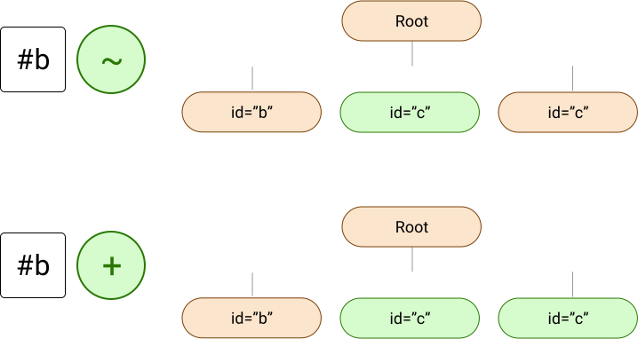
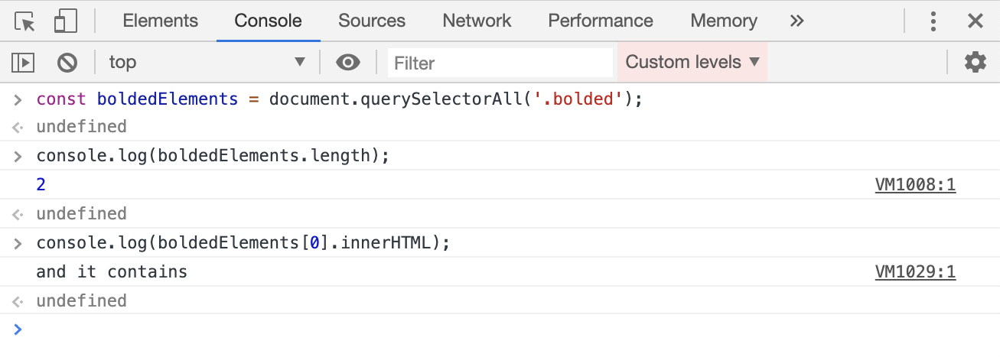
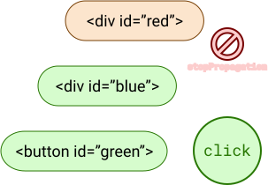

---
{
	title: 'Understanding The DOM: How Browsers Show Content On-Screen',
	description: 'Learn how the browser internally handles HTML and CSS to show the user webpages on-screen',
	published: '2019-11-26T22:12:03.284Z',
	tags: ['webdev', 'css', 'javascript', 'html'],
	license: 'cc-by-nc-sa-4'
}
---

Any web application relies on some fundamental technologies: HTML, CSS, and JavaScript. Even advanced front-end JavaScript frameworks such as Angular, React, or Vue will utilize some level of HTML to load the JavaScript. That said, how the browser handles HTML and CSS under-the-hood can be quite the mystery. In this article, I'm going to explain what the browser does to understand what it should show to the user.

> If you're unfamiliar with HTML, CSS, or JavaScript, you may want to take a look at [our post that introduces these three items](/posts/intro-to-html-css-and-javascript). They'll provide a good foundation for this article for newcomers to the programming scene or folks who may not be familiar with what those languages do.

# The DOM {#the-dom}

Just as the source code of JavaScript programs are broken down to abstractions that are more easily understood by the computer, so too is HTML. HTML, initially being derived from [SGML (the basis for XML as well)](https://en.wikipedia.org/wiki/Standard_Generalized_Markup_Language), actually _forms a tree structure in memory_ in order to [describe the relationships, layout, and executable tasks for items in the tree](#how-the-browser-uses-the-dom). This tree structure in memory is _called the Document Object Model_ (or _DOM_ for short).

For example, when you load a file similar to this:

```html
<!-- index.html -->
<!-- ids are only added for descriptive purposes -->
<main id="a">
	<ul id="b">
		<li id="c">Item 1</li>
		<li id="d">Item 2</li>
	</ul>
	<p id="e">Text here</p>
</main>
```

_The browser takes the items defined in the HTML and turns them into a tree that the browser understands how to lay out and draw on the screen_. That tree, internally, might look something like this:


> This is an oversimplified example of how the browser interprets HTML, but gets the job done to convey introductory information.

Let's see how this is done.

At the root of any HTML file, you have three things: tags, attributes, and text content.

```html
<!-- A "header" tag -->
<header>
  <!-- An "a" tag with an "href" attribute -->
  <a href="example.com">
    <!-- A text node -->
    Example Site
  </a>
</header>
```

When you type a tag, like `<header>` or `<a>`, you're creating an _element node_. These nodes are then composed to create _"leaves"_ on the DOM tree. Attributes are then able to manually add information to these nodes. When you have one element node inside of a separate one, you add a _"child"_ to said node. The relationship between the nodes allows metadata, CSS properties, and more to be preserved.

There's also the idea of a _"sibling"_ node. When a node's parent has more than one child, those other nodes are that child node's _"siblings"_.


Altogether, the terminology used to refer to the nodes and their various relationships is extremely similar to the terminology often used with family trees.

There are some rules for the tree that's created from these nodes:

- There must be one "root" or "trunk" node, and there cannot be more than one root
- There must be a one-to-many relationship with parents and children. A node:
	- May have many children
	- Cannot have more than one parent
- A non-root node may have many siblings as a result of the parent having many children


### How It's Used By The Browser {#how-the-browser-uses-the-dom}

This tree tells the browser all of the information it needs to execute tasks in order to display and handle interaction with the user. For example, when the following CSS is applied to this HTML file:

```css
// index.css
#b li {
	background: red;
}
```

```html
<!-- index.html -->
<main id="a">
	<p id="e"></p>
  <ul id="b">
    <li id="c"></li>
    <li id="d"></li>
  </ul>
</main>
```

While moving through the tree, the browser can keep track of the fact that it needs to find an element with the `ID` of `b` and then mark its `<li>` children with a red background. They're "children" because the DOM tree preserves the relationship defined by the HTML.


> The `<ul>` element is marked as green just to showcase that it is the element being marked by the first part of the selector.

Typically, the browser will "visit" it's nodes in a specific order. For example, in the above chart, the browser might start at the `<main>` tag, then go to the `<p>` tag, then visit the `<ul>` tag, and finally the two children in order from left-to-right (`<li id="c">` , `<li id="d">`).

The browser, knowing what CSS to look for, is able to see the `<ul>` with the correct ID and know to mark its children with the correct metadata that matches the selector with the relevant CSS.

This tree relationship also enables CSS selectors such as the [general sibling selector (`~`)](https://developer.mozilla.org/en-US/docs/Web/CSS/General_sibling_combinator) or the [adjacent sibling selector (`+`)](https://developer.mozilla.org/en-US/docs/Web/CSS/Adjacent_sibling_combinator) of find siblings to a given selector.



> Interestingly, one of the questions that I've often heard asked concerns a "parent selector". The idea behind the question is that the [direct child selector (`>`)](https://developer.mozilla.org/en-US/docs/Web/CSS/Child_combinator) exists, so why not have the ability to select any parent of `.classname` selectors?
>
> The answer behind that? Performance. The [W3 Consortium](https://www.w3.org/Style/CSS/#specs) (the organization that maintains the HTML and CSS standard specifications) points to the tree structure of the DOM and the algorithm used by the browser to traverse the DOM (or, "visit" the nodes in order to figure out what CSS to apply) as not being performant when allowing parent selectors.
>
> This happens because browsers read from top-to-bottom in the DOM and apply CSS as they find matching nodes; CSS doesn't command the browser to do anything to the DOM, but rather provides the metadata for the DOM to apply the relevant CSS when the browser comes across that specific node.
>
> As mentioned before, they start at the root node, keep notes on what they've seen, then move to children. Then, they move to siblings, etc. Specific browsers may have slight deviations on this algorithm, but for the most part, they don't allow for upwards vertical movement of nodes within the DOM.


# Using The Correct Tags {#accessibility}

HTML, as a specification, has tons of tags that are able to be used at one's disposal. These tags contain various pieces of metadata internally to provide information to the browser about how they should be rendered in the DOM. This metadata can then be handled by the browser how it sees fit; it may apply default CSS styling, it may change the default interaction the user has with it, or even what behavior that element has upon clicking on it (in the case of a button in a form).

<!-- ::in-content-ad title="Consider supporting" body="Donating any amount will help towards further development of articles like this." button-text="Visit our Open Collective" button-href="https://opencollective.com/playfulprogramming" -->

Some of these tag defaults are part of the specification, while others are left up to the browser vendor to decide. This is why, in many instances, developers may choose to use something like [`normalize.css`](https://github.com/necolas/normalize.css/) to set all of the element CSS defaults to an explicit set of defaults. Doing so can avoid having the UI of a webpage look different from browser to browser thanks to deviations on default CSS styling on specific tags.

This metadata is also why it's so important that your application utilizes the expected HTML tags and not simply default to `<div>`s with CSS or JavaScript applied to simulate other items. Two of the biggest advantages to responsibly utilizing the metadata system the browser has built into it by using the correct tags are search engine optimization (SEO) and accessibility.

Take the following example:

```html
<div>
	<div>Bananas</div>
	<div>Apples</div>
	<div>Oranges</div>
</div>
```

In this example, your browser only knows that you're looking to display text on-screen. If someone utilizing a screen reader reaches the site, the browser doesn't know that it should inform them that there are three items in a list (something that people with low vision would greatly value to know, in order to tab through the list effectively) as you've done nothing to inform the user that it is a list of items: only that it's a set of `<div>` generic containers.

Likewise, when Google's robots walk through your site, they won't be able to parse that you're displaying lists to your users. As a result, your search rating for "list of best places" might be impacted since the site doesn't appear to contain any list at all.

What can be done to remediate this? Well, by utilizing the proper tags, of course!

```html
<ol>
	<li>Bananas</li>
	<li>Apples</li>
	<li>Oranges</li>
</ol>
```

In this example, both the browsers as well as Google's scraper bots are able to discern that this is a list with three list items within it.

> While there ARE tags that may potentially impact SEO somewhat significantly, it's unlikely `<ul>` and `<li>` would significantly impact your SEO scores.
>
> Needless to say, it's still good to use semantic (correctly tagged) HTML as people that use screen-readers and other assistive technologies benefit greatly from these minor changes. Additionally, it can make code more readable and parsable with automated tools.

We're able to even add further metadata to an element by using attributes. For example, let's say that I want to add a title to the list to be read upon a screen reader gaining focus on the element; we could use the `aria-label` attribute:

```html
<ol aria-label="My favorite fruits">
	<li>Bananas</li>
	<li>Apples</li>
	<li>Oranges</li>
</ol>
```

In fact, the metadata that specific tags have by default can be manually applied to an element of a different type. The metadata that is passed to the browser when using `<li>` is typically involving that element pertaining to a `listitem`, using the `role` attribute, we can add that information to a `<div>` itself.

```html
<ol>
	<div role="listitem">Bananas</div>
	<div role="listitem">Apples</div>
	<div role="listitem">Oranges</div>
</ol>
```

> It's worth mentioning that this example is generally considered malpractice. While you may have been able to preserve _some_ of the metadata from a `<li>` tag in a `<div>` element, it's extremely difficult to catch all of the defaults a browser might apply to the original tag that may enhance the experience of someone that uses a screen-reader.
>
> This is all to say, unless you have a **really** good reason for using `role` rather than an appropriate tag, stick with the related tag. Just as any other form of engineering, properly employing HTML requires nuance and logic to be deployed at the hand of the implementing developer.

# Element Metadata {#interacting-with-elements-using-js}

If you've ever written a website that had back-and-forth communication between HTML and JavaScript, you're likely aware that you can access DOM elements from JavaScript: modifying, reading, and creating them to your heart's content.

Let's look at some of the built-in utilities at our disposal for doing so:

- [The `document` global object](#document-global-object)
- [The `Element` base class](#element-class)
- [The event system](#events)

## Document Global Object {#document-global-object}

[As mentioned before, the DOM tree must contain one root node](#the-dom). This node, for any instance of the DOM, is the document entry point. When in the browser, this entry point is exposed to the developer with [the global object `document`](https://developer.mozilla.org/en-US/docs/Web/API/Document). This object has various methods and properties to assist in a meaningful way. For example, given a standard HTML5 document:

```html
<!DOCTYPE html>
<html>
<head>
	<title>This is a page title</title>
</head>
<body>
	<p id="mainText">
    This is the page body
		<span class="bolded">and it contains</span>
		a lot of various content within
    <span class="bolded">the DOM</span>
	</p>
</body>
</html>
```

The `document` object has the ability to get the `<body>` node ([`document.body`](https://developer.mozilla.org/en-US/docs/Web/API/Document/body)), the `<head>` node ([`document.head`](https://developer.mozilla.org/en-US/docs/Web/API/Document/head)), and even the doctype ([`document.doctype`](https://developer.mozilla.org/en-US/docs/Web/API/Document/doctype)).


### Querying Elements

Besides containing static references to `<body>` and `<head>`, there is also a way to query any element by using CSS selectors. For example, if we wanted to get a reference to the single element with the `id` of `mainText`, we could use the CSS selector for an id, combined with [the `querySelector` method on the `document`](https://developer.mozilla.org/en-US/docs/Web/API/Document/querySelector):

```javascript
const mainTextElement = document.querySelector('#mainText');
```

> The `#` in the `#mainText` is the CSS selector syntax for selecting an element based on its `id`. If you had a CSS selector of `#testing`, you'd be looking for an element with the following attribute value:
>
> ```
> id="testing"
> ```

This method will return a reference to the element as rendered in the DOM. [While we'll be covering more of what this reference is able to do later](#element-class), for now we can execute this quick bit of code to show that it's the element we intended to query:

```javascript
console.log(mainTextElement.innerHTML); // This will output the HTML that we used to write this element
```


We also have the ability to gain a reference to many elements at once. Given the same HTML document as before, let's say we want to see how many elements have the `bolded` class applied to it. We're able to do so using [the `querySelectorAll` method on the `document`](https://developer.mozilla.org/en-US/docs/Web/API/Document/querySelectorAll).

```javascript
const boldedElements = document.querySelectorAll('.bolded');
console.log(boldedElements.length); // Will output 2
console.log(boldedElements[0].innerHTML); // Will output the HTML for that element
```



> It's worth mentioning that the way `querySelector` works is not the same [way that the browser checks a node against the CSS selector data when the browser "visits" that node](#how-the-browser-uses-the-dom). `querySelector` and `querySelectorAll` work from a more top-down perspective where it searches the elements one-by-one against the query. First, it finds the top-most layer of the CSS selector. Then it will move to the next item and so-on-so forth until it returns the expected results.

## Element Base Class {#element-class}

While `innerHTML` has been used to demonstrate that the element that's gathered is in fact the element that was queried, there are many _many_ more properties and methods that can be run on an element reference.

When an element is queried and returned, you're given a reference to that element through the [`Element` base class](https://developer.mozilla.org/en-US/docs/Web/API/Element). This class is what contains the properties and methods that you can use to access and modify the element's metadata.

For example, let's say that I wanted to see the width and height an element has when rendered on screen. [Using the `Element.prototype.getBoundingClientRect` method](https://developer.mozilla.org/en-US/docs/Web/API/Element/getBoundingClientRect), you can get all of that information and more:

```javascript
const mainTextElement = document.querySelector('#mainText');
console.log(mainTextElement.getBoundingClientRect());
// Will output: DOMRect {x: 8, y: 16, width: 638, height: 18, top: 16, …}
```

> While the explanation behind the `Element.prototype` is a lengthy one (an article on its own to be sure), suffice it to say that there's a base class for all element references found using `querySelector`. This base class contains a myriad of methods and properties. The `.prototype` loosely refers to those properties and methods in question.
>
> This means that all queried elements will have their own `getBoundingClientRect` methods.

### Attributes {#html-attributes}

[As covered earlier, elements are able to have _attributes_ that will apply metadata to an element for the browser to utilize.](#accessibility) However, what I may not have mentioned is that you're able to read and write that metadata, as well as applying new metadata, using JavaScript.

Let's take a slightly modified example from [the correct tags section](#accessibility) to demonstrate:

```html
<div id="divToList">
	<div>Bananas</div>
	<div>Apples</div>
	<div>Oranges</div>
</div>
```

We could update this list to include the `role`s and `aria-label`s in order to make this non-semantic HTML more relevant in terms of how it reflects its metadata to the browser.

This metadata that we place directly on the elements themselves are called `attributes` and are part of the HTML specification (also referred to as the HTML API in this document). This metadata can be accessed and modified from JavaScript by using the `Element`'s [`getAttribute`](https://developer.mozilla.org/en-US/docs/Web/API/Element/getAttribute) to read the key-value pairing and [`setAttribute`](https://developer.mozilla.org/en-US/docs/Web/API/Element/setAttribute) to set the value to that attribute on an element.

Let's look at how we can set the `role` and `aria-label`s in the DOM using JavaScript:

```javascript
const divToListEl = document.querySelector('#divToList');
// Get the `role` attribute to demonstrate that there's no currently present role
console.log(divToListEl.getAttribute('role')); // `null`
// Let's set a role that emulates a `list`
// Set the value from the HTML API using the Element method `setAttribute`
divToListEl.setAttribute('role', 'list');
// And let's add an aria-label, for good measure
divToListEl.setAttribute('aria-label', 'My favorite fruits');
// Get the value from the HTML API using the Element method `getAttribute`
console.log(divToListEl.getAttribute('role')); // `'list'`

// Using the CSS selector to get the children of the divs
const listItems = document.querySelectorAll('#divToList > *');

// Now, for all of the items in that list, let's use an aria `role` to make them reflect as listitems in their metadata to the browser
for (var i = 0; i < listItems.length; i++) {
	listItems[i].setAttribute('role', 'listitem');
}
```

Once this is run, if you inspect the elements tab in your debugger, you should be left with HTML that looks like this:

```html
<div id="divToList" role="list" aria-label="My favorite fruits">
	<div role="listitem">Bananas</div>
	<div role="listitem">Apples</div>
	<div role="listitem">Oranges</div>
</div>
```

... which is significantly more accessible for users that utilize screen readers, [as mentioned previously](#accessibility). You'll notice that despite not having any of the ARIA attributes prior, the `setAttribute` was able to implicitly create them with the newly placed values.

### Properties {#element-properties}

[As mentioned in a prior section, elements also have properties and methods associated with the instance of the underlying base class](#element-class). These properties are different from attributes as they are not part of the HTML specification. Instead, they're standardized JavaScript `Element` API additions. Some of these properties are able to be exposed to HTML and provide a two-way binding to-and-from the HTML API and the JavaScript `Element` API.

> Unfortunately, for various historical reasons, the list of properties that support this bi-directional mapping between the `Element` API and the HTML API is sporadic and inconsistent. Some elements that support a mapping between the two APIs even only support uni-directional mapping where updating one will not update another.
>
> This is a round-about way of saying, "It is confusing and complicated what properties have attribute bindings and which don't and why. It's okay if you don't get it right away". Even seasoned developers might not be aware of some of the limitations. That all said, let's continue on with some examples that _do_ follow the bi-directional implicit API mapping to showcase how it works and learn more about properties.

For example, if you have [the style attribute](https://developer.mozilla.org/en-US/docs/Web/HTML/Global_attributes/style) associated with an element you're working with, you're able to read the values of the element:

```html
<!-- index.html -->
<div style="background-color: green; color: white; width: 200px; height: 400px;" id="greenEl">
  This element is green
</div>
```

```javascript
// index.js
const greenElement = document.querySelector('#greenEl');
console.log(greenElement.style.backgroundColor); // 'green'
```


Not only are you able to read the value in question, but you can write and edit them as well:

```javascript
greenElement.style.backgroundColor = 'red';
```

Will turn the element's background color red, for example.


Somewhat silly, seeing as how the `<div>` is no longer green. 🤭

#### Limitations {#attribute-limitations}

While attributes can be of great use to store data about an element, there's a limitation: Values are always stored as strings. This means that objects, arrays, and other non-string primitives must find a way to go to and from strings when being read and written.

> While you've seen `style` attribute be read and written to by an object interface, if you inspect the element or use the `getAttribute` to access the attribute's HTML API value, you'll find that it's really a string with a pleasant API wrapped around it that lets you use an object to interface with the attribute value.
>
> ```javascript
> console.log(mainTextElement.getAttribute('style')); // This will return a string value, despite the API that lets you use an object to read and write
> ```
>
> The reasoning behind this incongruity is due to [the implicit mapping of the HTML API and the `Element` API, as mentioned at the start of the previous section](#element-properties). The limitations described here will also apply to the HTML API of those types of properties.

For example, we can [use `data` attributes](https://developer.mozilla.org/en-US/docs/Learn/HTML/Howto/Use_data_attributes) in order to read and write values via attributes to any given element.

```html
<!-- index.html -->
<ul id="list" data-listitems="2">
  <li>List item 1</li>
  <li>List item 2</li>
</ul>
```

```javascript
// index.js
const listEl = document.querySelector('#list');
console.log(listEl.dataset.listitems); // '2'
listEl.dataset.listitems = 3;
console.log(listEl.dataset.listitems); // '3'
```


Note that I wrote the string `'3'` instead of the numerical value `3` in the code sample's outputs in the comments despite using the numerical `3` to set the value. This behavior is due to how default non-string values are saved to attributes.

By default, the primitive's `toString` will be called to store values.

```javascript
element.dataset.userInfo = {name: "Tony"};
console.log(element.dataset.userInfo); // "[object Object]"
/**
 * "[object Object]" is because it's running `Object.prototype.toString()`
 * to convert the object to a string to store on the attribute
 */
```

> If you're having a difficult time understanding why `toString` is bring run or what `prototype` is doing here, don't worry; you're in good company. The JavaScript prototype system is complex and can be difficult to follow.
>
> For now, it will suffice just to know that you're only able to store strings in an element attribute.


## Events {#events}

Just as your browser uses the DOM to handle on-screen content visibility, your browser also utilizes the DOM for knowing how to handle user interactions. The way your browser handles user interaction is by listening for _events_ that occur when the user takes action or when other noteworthy changes occur.

For example, say you have a form that includes a default `<button>` element. When that button is pressed, it fires a `submit` event that then _bubbles_ up the DOM tree until it finds a [`<form>` element](https://developer.mozilla.org/en-US/docs/Web/HTML/Element/form). By default, this `<form>` element sends a [`GET` HTML request](https://developer.mozilla.org/en-US/docs/Web/HTTP/Methods/GET) to the server once it receives the `submit` event.


_Bubbling_, as shown here, is the default behavior of any given event. Its behavior is to move an event up the DOM tree to the nodes above it, moving from child to parent until it hits the root. Parent nodes can respond to these events as expected, stop their upward motion on the tree, and more.

### Event Listening {#event-bubbling}

Much like many of the other internal uses of the DOM discussed in this article, you're able to hook into this event system to handle user interaction yourself.

Let's look at an example of some code doing so:

```html
<!DOCTYPE html>
<html>
<head>
	<title>This is a page title</title>
</head>
<body>
	<div id="red" style="height: 400px; width: 400px; background: red;">
		<div id="blue" style="height: 300px; width: 300px; background: blue;">
			<div id="green" style="height: 200px; width: 200px; background: green;"></div>
		</div>
	</div>
	<script>
		const redEl = document.querySelector('#red');
		const blueEl = document.querySelector('#blue');
		const greenEl = document.querySelector('#green');

		redEl.addEventListener('click', () => {
			console.log("A click handled on red using bubbling");
			// This is set to false in order to use bubbling. We'll cover the `true` case later on
		}, false);

		blueEl.addEventListener('click', (event) => {
			// Stop the click event from moving further up in the bubble
			event.stopPropagation();
			console.log("A click handled on blue using bubbling");
		}, false);


		greenEl.addEventListener('click', () => {
			console.log("A click handled on green using bubbling");
		}, false);
	</script>
</body>
</html>
```


In this example, we're adding click listeners to three squares, each one smaller than their parent square. This allows us to see the effect of bubbling in our console. If you click on the red square, you'd expect the event to bubble up to `<body>`, but not down to `#green`. Likewise, if you clicked on the green square, you'd expect the event to bubble up to both `#blue` and `#red` as well as `<body>`.

However, as you can see, we're running `stopPropagation` on the event in the blue square. This will make the click event stop bubbling. This means that any click events that are called on `#green` will not make it to `#red` as they will be stopped at `#blue`.



You can see a running example of this here:

<iframe src="https://stackblitz.com/edit/event-bubbling-demo?embed=1&file=index.js&hideExplorer=1&hideNavigation=1" sandbox="allow-modals allow-forms allow-popups allow-scripts allow-same-origin"></iframe>

### Capturing {#event-capturing}

Bubbling isn't the only way events are able to move. Just as they can move up from the bottom, they can also move from the top down. This method of emitting events is known as _capture mode_.

Let's take the a look at some example code, with the same HTML as before but a new set of JavaScript:

```javascript
redEl.addEventListener('click', () => {
  console.log("A click handled on red using capturing");
  // Setting true here will switch to capture mode
}, true);

blueEl.addEventListener('click', (event) => {
  // Stop the click event from moving further down in the bubble
  event.stopPropagation();
  console.log("A click handled on blue using capturing");
}, true);


greenEl.addEventListener('click', () => {
  console.log("A click handled on green using capturing");
}, true);
```

As demonstrated by the code above, `stopPropagation` works as you might expect it to in capture mode as well!


This means that when the user clicks on the red square, you'll see the following in your console:

```
"A click handled on red using capturing"
"A click handled on blue using capturing"
```

You won't see anything from the green square's `eventListener`, however.

<iframe src="https://stackblitz.com/edit/event-capture-demo-jxb7wg?embed=1&file=index.js&hideExplorer=1&hideNavigation=1" sandbox="allow-modals allow-forms allow-popups allow-scripts allow-same-origin"></iframe>

You'll also notice that if you click on the green square, you'll never see the `"A click handled on green using capture"` message. This is due to the `stopPropagation`, as mentioned before. The click is being registered on the red square first and then stopped on the blue square.

# Conclusion

This post is filled to the brim with information. 😵 Even I, the author, had a few amazing folks give it a re-read to confirm what I've written. Please don't be afraid or ashamed to re-read anything that might not have made sense or to revisit the post whenever a question arises. Hopefully, this has been a helpful exploration of the DOM and the ways you interact with it using code.

Please ask any questions or comments in our comments section and remember that we have [a Discord](https://discord.gg/FMcvc6T) for further conversation, including any questions!
