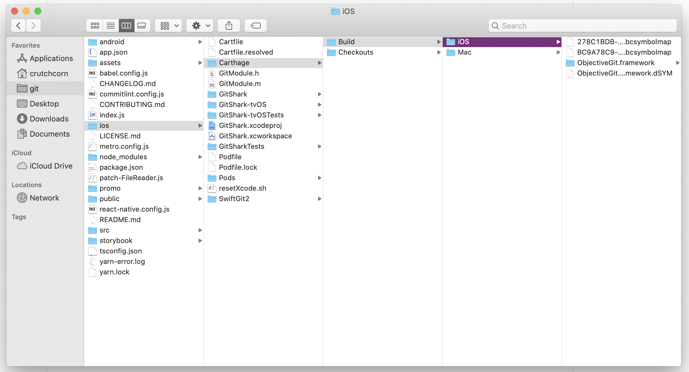
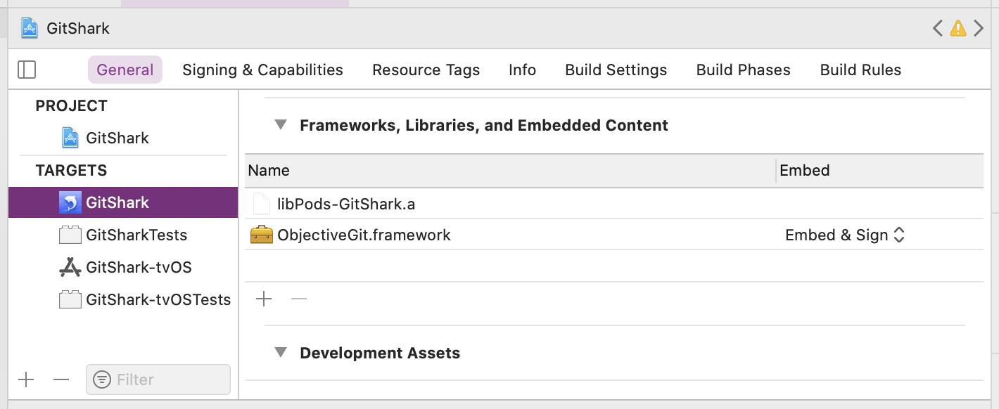
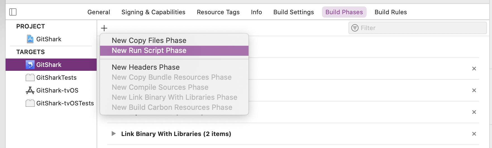
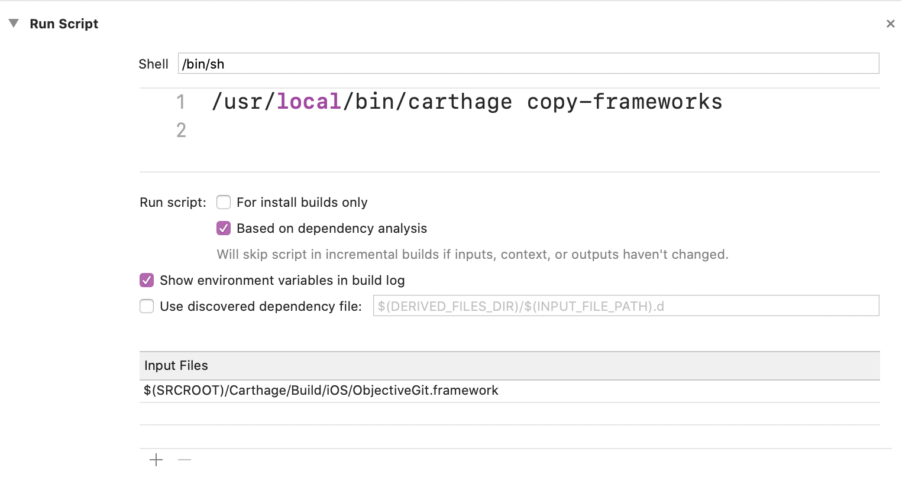

---
{
    title: "Adding Carthage Dependencies into React Native",
    description: "CocoaPods is a great dependency manager, but some need Carthage still. Let's walk through how to integrate Carthage with React Native!",
    published: '2020-10-13T22:12:03.284Z',
    tags: ['ios', 'react native'],
    license: 'cc-by-4'
}
---

As with anything in engineering, picking the right package manager for a project can be highly situational. Even in the webdev space: we have the mainstream appeal of [`npm`](https://www.npmjs.com/), the feature-rich [`yarn`](https://yarnpkg.com/), and others. Even moderately sized web applications need to face this question at some point in their development — The answer isn't always straightforward. However, React Native applications have the added complexity of needing to manage native dependencies as well as web dependencies.

For iOS dependency management, there are two major players: [Cocoapods](https://cocoapods.org/) and [Carthage](https://github.com/Carthage/Carthage/).

While React Native ships with Cocoapods support out-of-the-box, it's not immediately clear how to add Carthage packages to your project.

# Install

Let's start with a caveat to adding Carthage to your projects: You cannot migrate your entire app's dependencies to use it. This is because React Native's dependencies [have not been packaged for usage in Carthage](https://github.com/facebook/react-native/issues/13835). 

As such, you will always have an additional package manager to consider with your native dependencies.

Now that we have that disclaimer out-of-the-way let's look into how to install Carthage so that you can use it in your projects.

There are three main methods you may use to install Carthage:

1. [Downloading the Installer directly from GitHub releases](https://github.com/Carthage/Carthage/releases). Once you download the `.pkg` file, run it to start the installer
2. If you have Homebrew installed, you can run `brew install carthage`
3. Lastly, if you use MacPorts, you can run `sudo port install carthage`

Now that you have Carthage installed, you can start using it in your projects.

<!-- ::in-content-ad title="Consider supporting" body="Donating any amount will help towards further development of articles like this." button-text="Visit our Open Collective" button-href="https://opencollective.com/playfulprogramming" -->

# Usage

Just as npm has the `package.json` file, Carthage has the `Cartfile`. You'll want to create a file named `Cartfile` next to your `.xcworkspace` file. If your project was configured with the [React Native CLI](https://github.com/react-native-community/cli), this folder would be your `:projectRoot/ios` directory. 

Once this file is created, you want to store your dependencies in the `ios/Cartfile` file. For [my React Native Git Client](https://gitshark.dev), we wanted to add a dependency called [Objective-Git](https://github.com/libgit2/objective-git) to our project. As such, our `Cartfile` looks like the following:

```
github "libgit2/objective-git"
```

Once you've added your dependency, you'll want to `cd` into the `ios` directory run `carthage update` to install the dependency:

```
cd ios
carthage update
```

Once this is done, you'll be left with a new folder and file:

- `Cartfile.resolved` - File
- `Carthage` - Folder

> What is the `Cartfile.resolved` file? What does the `Cartfile.resolved` file do?

You can think of `Cartfile.resolved` as the `package-lock.json` file - it tells the package manager which version of the dependencies to use when running the package installation command (`carthage update`). As such, just like the `package-lock.json`, you'll want to commit this to your project's Git repo.

The `Carthage` folder, on the other hand, is similar to your `node_modules`. It's the downloaded dependencies that are resolved from the `Cartfile.resolved` file. As such, you may choose to `gitignore` the `Carthage` folder. However, [the Carthage official documentation](https://github.com/Carthage/Carthage/blob/master/Documentation/Artifacts.md) leaves a note regarding this decision:

> You are not required to commit this folder to your repository, but you may wish to if you want to guarantee that the built versions of each dependency will always be accessible at a later date.

For [my company](https://oceanbit.dev), we ultimately decided to follow the web's standard and not commit our `Carthage` folders. As such, we needed to add the following line to our project's `.gitignore` file:

```
ios/Carthage/Checkouts/
ios/Carthage/Build/
```

However, just as [npm suggests you commit the `package-lock.json` file](https://github.com/npm/cli/blob/release-6.14.7/docs/content/configuring-npm/package-lock-json.md), you should commit the `Cartfile.resolved` file as well, to ensure consistency in package version resolution.

# Project Configuration

There are some final steps that're needed when utilizing Carthage for your package manager. All of these changes will be made in XCode to support building your project with your new dependencies.

- Go into your `ios/Carthage/Build` folder. You should see a collection of folders for your dependencies that have built `.framework` files. I have dedicated `Mac` and `iOS` folders for my dependency, but yours may not.
  

- First, go to your app's "target." Then, go to the "General" tab and find the "Frameworks, Libraries, and Embedded Content" section. Drag and drop the `.framework` file from your dependency into the said section.

- Next, navigate to the "Build Phases" tab. In the top left corner, click the “+” icon and choose “New Run Script Phase”
  

- Leave the "shell" as `/bin/sh`, but set the contents of the run script to:

  ```
  /usr/local/bin/carthage copy-frameworks
  ```

  
  Finally, add the path to your dependencies' `.framework` files, like this:

  ```
  $(SRCROOT)/Carthage/Build/iOS/ObjectiveGit.framework
  ```

Please keep in mind that there may be additional steps that some dependencies want you to move forward with to integrate with your projects. Refer to the documentation for the dep for more information.

# Conclusion

As with any decision made in engineering, the choice to add Carthage as a secondary native dependency for your React Native projects is a high contextual one. However, I hope that with the information on utilizing it properly, it alleviates some of the stress in integrating it.

If you run into any problems integrating Carthage, you can always ask for help in the comments down below or [join our Discord](https://discord.gg/FMcvc6T) and ask for help there as well.

