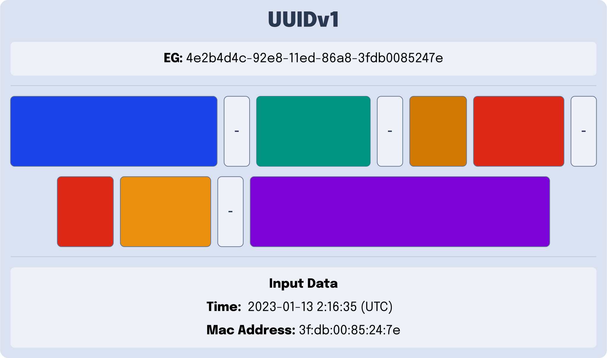

---
{
    title: "UUIDv6, UUIDv7, and UUIDv8; what are they?",
    description: "",
    published: '2024-11-20T21:52:59.284Z',
    tags: ['computer science'],
    license: 'cc-by-4',
    collection: "Explaining UUIDs",
    order: 3
}
---

[In our first article explaining what UUIDs are](/posts/what-are-uuids), we explored a few different variants of UUID:

- [UUIDv1](/posts/what-are-uuids#UUIDv1)
  - A machine's network card information + a timestamp
- [UUIDv2](/posts/what-are-uuids#UUIDv2)
  - [It's a long story.](/posts/what-happened-to-uuid-v2)
- [UUIDv3](/posts/what-are-uuids#UUIDv3and5)
  - Encode a string using MD5
- [UUIDv4](/posts/what-are-uuids#UUIDv4)
  - Random UUID with effectively zero chance of producing the same number twice
- [UUIDv5](/posts/what-are-uuids#UUIDv3and5)
  - UUIDv3 but more secure (uses SHA-1)

Since that time, however, there [was an RFC that was accepted](https://www.ietf.org/archive/id/draft-peabody-dispatch-new-uuid-format-04.html) which added 3 new standard UUID types:

- [UUIDv6](#UUIDv6)
  - UUIDv1 but better for database indexes
- [UUIDv7](#UUIDv7)
  - UUIDv1 without network card information and with a more standard timestamp
- [UUIDv8](#UUIDv8)
  - An intentionally broad UUID spec for all non-standard UUIDs - make up your own UUIDs

Let's explore each of these UUID systems individually to understand them better.

# Create a Database Index with UUIDv6 {#UUIDv6}

If you've worked much with UUIDv1 UUIDs, you'll see a pattern in the new UUIDv6 mechanism. If we look at the UUIDv1 example:

And compare it to the UUIDv6 example:

We can see how the order of the UUIDv6 is "just" a rearrangement of the bytes presented in a UUIDv1.

Why is this?

Well, this reorder allows multiple UUIDs to be sorted without having to parse them more in-depth. This helps makes databases of UUIDv6s easier to index as opposed to UUIDv1s while retaining the same base information.

> [Read more about the specifics of UUIDv6's sorting improvements in their draft RFC.](https://ietf-wg-uuidrev.github.io/rfc4122bis/draft-00/draft-ietf-uuidrev-rfc4122bis.html#section-6.10)

**Why UUIDv6?**

This is useful if your projects are already using UUIDv1 and you need a drop-in replacement with better database indexing.

**Why not UUIDv6?**

[According to the RFC that introduces v6, v7, and v8](https://ietf-wg-uuidrev.github.io/rfc4122bis/draft-00/draft-ietf-uuidrev-rfc4122bis.html#name-uuid-version-6): 

> Systems that do not involve legacy UUIDv1 SHOULD consider using UUIDv7 instead.

Let's explore why that is by taking a look at UUIDv7 next.

# More Standard Timestamps with UUIDv7 {#UUIDv7}

If we look at the byte order of UUIDv7 without any additional context, it might start to look familiar to UUIDv1 and v6:

However, if we note the `input data` section of this graph, the distinction becomes clear.

While UUIDv1, v6, and v7 all track time; v1 and v6 use "a count of 100- nanosecond intervals since 00:00:00.00, 15 October 1582" as their time-keeping mechanism.

Compare and contrast that to UUIDv7 utilizing the far more standard ["Epoch time", or, "Unix time"](https://en.wikipedia.org/wiki/Unix_time).

See, Epoch time is broadly used in nearly every computer system that needs to keep track of time. This makes v7 the superior choice over v6 and v1 for most usages, since encoding and decoding date logic becomes far more standardized.

# Make your own UUID rules with UUIDv8 {#UUIDv8}

https://blog.devgenius.io/analyzing-new-unique-identifier-formats-uuidv6-uuidv7-and-uuidv8-d6cc5cd7391a

https://ietf-wg-uuidrev.github.io/rfc4122bis/draft-00/draft-ietf-uuidrev-rfc4122bis.html#name-uuid-version-8

