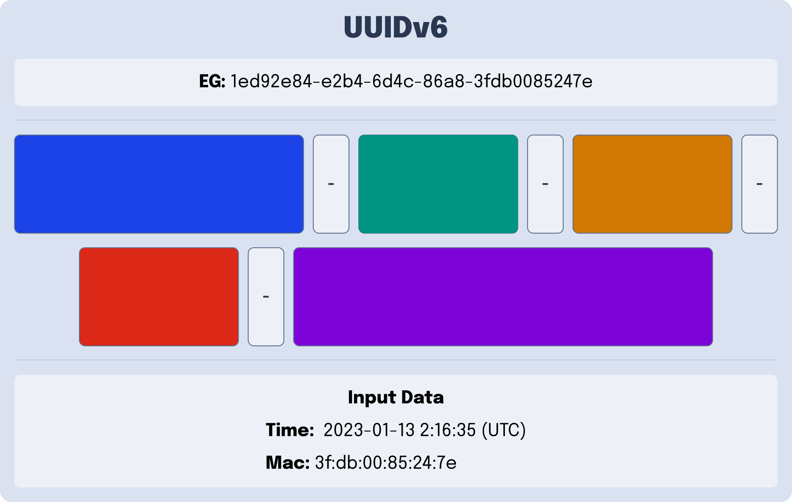
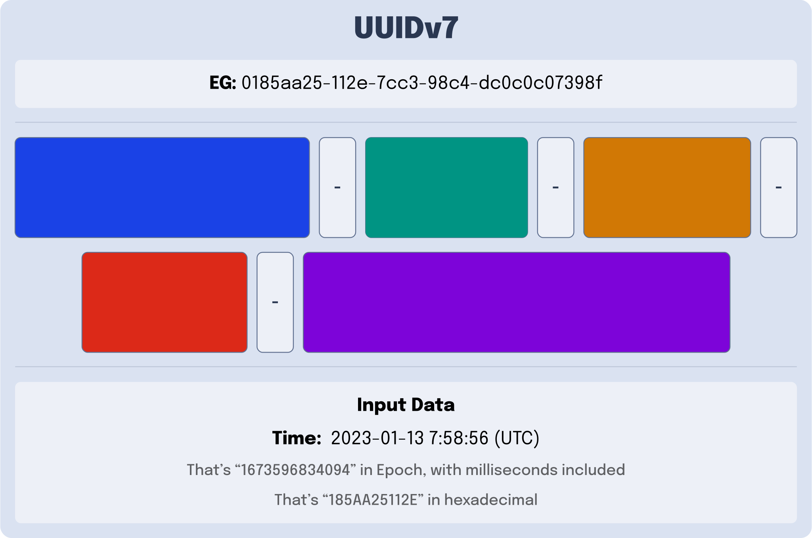
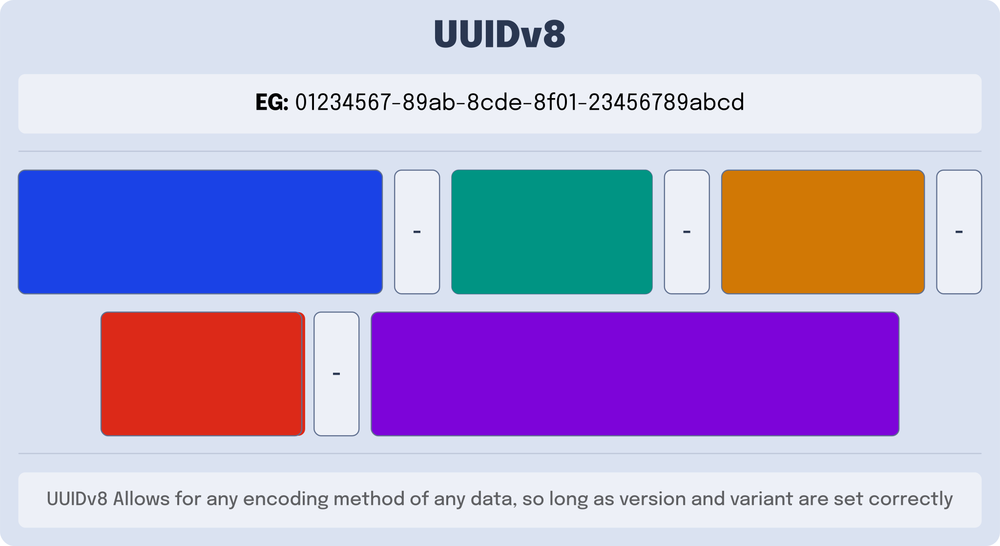

---
{
    title: "UUIDv6, UUIDv7, and UUIDv8; what are they?",
    description: "",
    published: '2023-02-20T21:52:59.284Z',
    authors: ['crutchcorn'],
    tags: ['computer science'],
    attached: [],
    license: 'cc-by-4'
}
---

In addition, there are 3 additional types of UUIDs that are part of [a proposal to extend the UUID specification](https://datatracker.ietf.org/wg/uuidrev/about/):

- [UUIDv6](#UUIDv6)
  - UUIDv1 but better for database indexes
- [UUIDv7](#UUIDv7)
  - UUIDv1 without network card information and with a more standard timestamp
- [UUIDv8](#UUIDv8)
  - An intentionally broad UUID spec for all non-standard UUIDs - make up your own UUIDs

Let's explore each of these UUID systems individually to understand them better.

# Create a Database Index with UUIDv6 {#UUIDv6}

https://blog.devgenius.io/analyzing-new-unique-identifier-formats-uuidv6-uuidv7-and-uuidv8-d6cc5cd7391a

https://ietf-wg-uuidrev.github.io/rfc4122bis/draft-00/draft-ietf-uuidrev-rfc4122bis.html#name-uuid-version-6

[Better for database indexes](](https://ietf-wg-uuidrev.github.io/rfc4122bis/draft-00/draft-ietf-uuidrev-rfc4122bis.html#section-6.10))

# More Standard Timestamps with UUIDv7 {#UUIDv7}

https://blog.devgenius.io/analyzing-new-unique-identifier-formats-uuidv6-uuidv7-and-uuidv8-d6cc5cd7391a

https://ietf-wg-uuidrev.github.io/rfc4122bis/draft-00/draft-ietf-uuidrev-rfc4122bis.html#name-uuid-version-7

https://ietf-wg-uuidrev.github.io/rfc4122bis/draft-00/draft-ietf-uuidrev-rfc4122bis.html#name-example-of-a-uuidv7-value

# Make your own UUID rules with UUIDv8 {#UUIDv8}

https://blog.devgenius.io/analyzing-new-unique-identifier-formats-uuidv6-uuidv7-and-uuidv8-d6cc5cd7391a

https://ietf-wg-uuidrev.github.io/rfc4122bis/draft-00/draft-ietf-uuidrev-rfc4122bis.html#name-uuid-version-8

