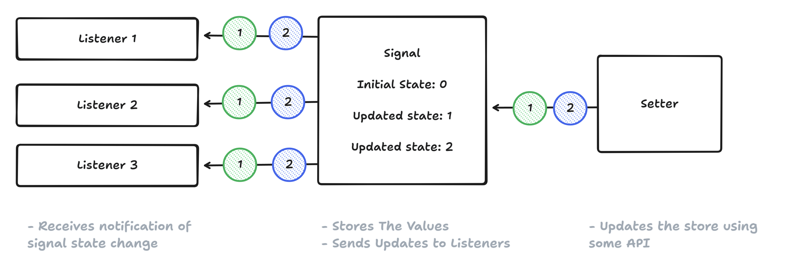
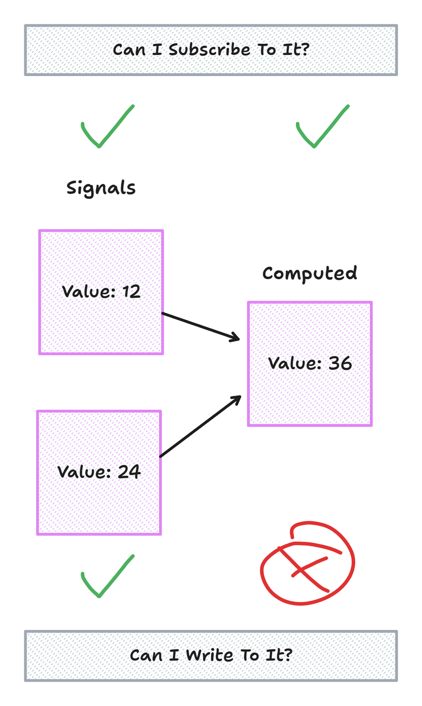
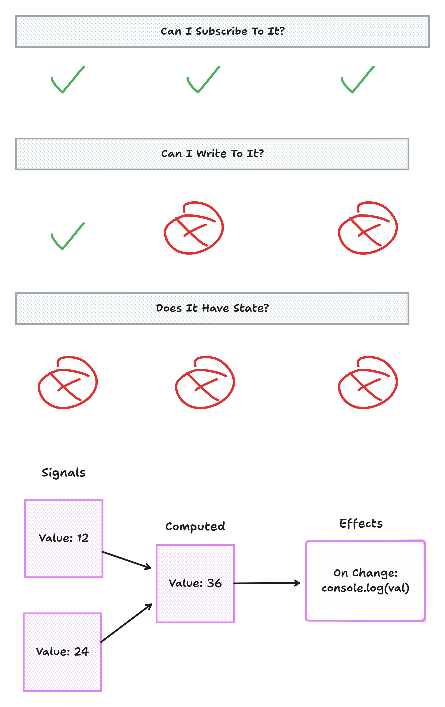
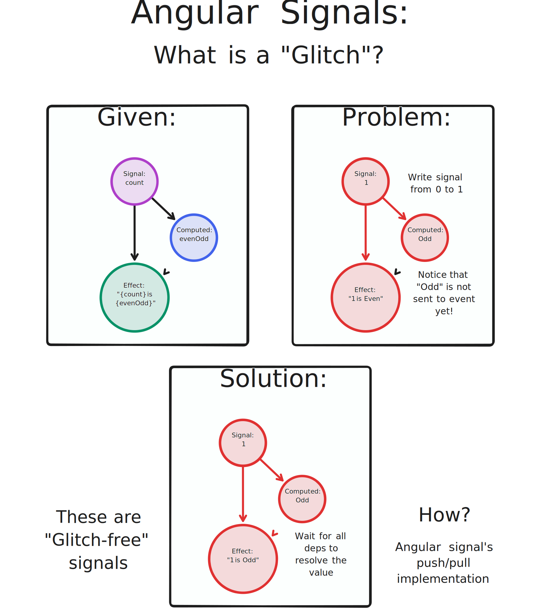
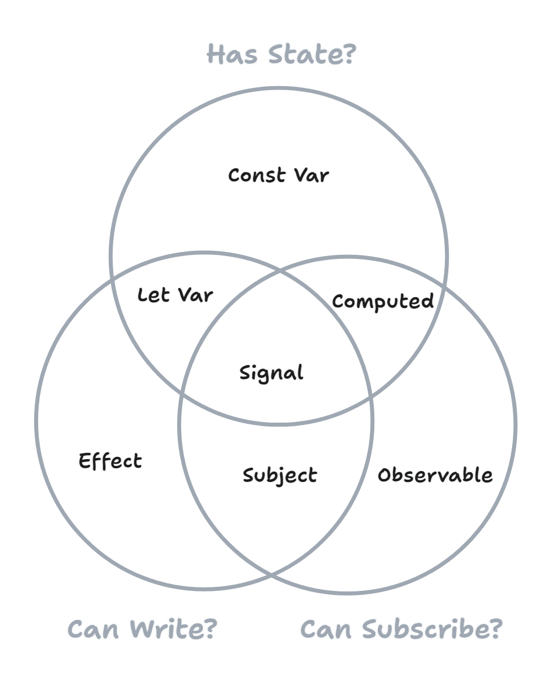

---
{
    title: "What are Signals?",
    description: "",
    published: '2024-09-26T21:52:59.284Z',
    tags: ['javascript','angular'],
    license: 'cc-by-4'
}
---

Signals are seemingly everywhere today. Among others, there's some flavor of signals in:

- [Angular](https://angular.dev/guide/signals)
- [Vue](https://vuejs.org/guide/extras/reactivity-in-depth.html#connection-to-signals)
- [Preact](https://preactjs.com/guide/v10/signals/)
- [Solid.js](https://www.solidjs.com/docs/latest/api#createsignal)
- [Svelte](https://svelte.dev/blog/runes)
- [Qwik](https://qwik.dev/docs/components/state/#usesignal)
- [And many more](https://dev.to/this-is-learning/the-evolution-of-signals-in-javascript-8ob)

There's even [efforts to bring signals into JavaScript itself](https://github.com/tc39/proposal-signals).

Given this explosion of popularity, many are left wondering:

> What even **are** signals?!

It's a good question! Let's explore signals, how they operate under-the-hood, and how we can use them in our libraries today.

# Signals Basics

In their most basic form, signals are a method of having some state and a way of subscribing to that state.

```javascript
// This is psuedo code. This API is possible, but not
// representative of any of the tools we're looking at today.
const counter = signal(0);

// This will re-run whenever `counter` updates
counter.subscribe(() => {
	console.log(counter.get());
})

// We can call it once 
counter.set(1);

// Or any number of times
setInterval(() => {
    counter.set(count.get() + 1);
}, 1000);
```

There's a few ways to implement this, but here's a basic implementation of the API above:

```javascript
function signal(initialValue) {
    let value = initialValue;
    const subscribers = new Set();

    return {
        get: () => value,
        set: (newValue) => {
            value = newValue;
            subscribers.forEach(fn => fn());
        },
        subscribe: (listener) => {
            subscribers.add(listener);
            return () => subscribers.delete(listener);
        }
    }
}
```

> You can see another basic variant of a signals implementation in [a 5 minute lightning talk I gave at ngConf 2024](https://www.youtube.com/watch?v=cJ7AuQUBmA4).



Here, we can see how a signal has:

- An initial value
- A getter to retrieve the value
- A setter to update the value and notify subscribers
- A way to subscribe to the signal

This is incredibly useful for being able to run one bit of code when your state changes, like binding the text value of a DOM node to some JavaScript state:

```html
<button id="clicker">0</button>

<script>
	const clickerBtn = document.getElementById("clicker");
    
    const countSignal = signal(0);
    
    countSignal.subscribe(() => {
        clickerBtn.innerText = countSignal.get();
    });
    
    clickerBtn.addEventListener("click", () => {
       countSignal.set(countSignal.get() + 1); 
    });

    // ...
</script>
```

// TODO: Add iframe

Here, we can see how a signal acts as a primitive for recreating [JavaScript Reactivity](/posts/what-is-reactivity) to sync state between the DOM and JS.

# Computed Properties

```javascript
function computed(fn, signals) {
    let value = fn();
    for (let signal of signals) {
        signal.subscribe(() => {
            value = fn();
        });
    }
    return {
        get: () => value
    }
}
```


Now, we can have a bit of state that derives another:

```javascript
const a = signal(1);
const b = signal(2);
const sum = computed(() => a.get() + b.get(), [a, b]);

console.log(sum.get()); // 3
a.set(3);
console.log(sum.get()); // 5
```



Which we can apply to our document once more for a basic adder:

```html
<label>
  <div>Number 1:</div>
  <input id="num1" type="number" value="0" />
</label>
<label>
  <div>Number 2:</div>
  <input id="num2" type="number" value="0" />
</label>
<p>The sum of these numbers is: <span id="output">0</span></p>

<script>
  const num1 = document.getElementById('num1');
  const num2 = document.getElementById('num2');
  const output = document.getElementById('output');

  const num1Signal = signal(0);
  const num2Signal = signal(0);
  const outputSignal = computed(
    () => num1Signal.get() + num2Signal.get(),
    [num1Signal, num2Signal]
  );

  num1.addEventListener('input', (e) => {
    num1Signal.set(e.target.valueAsNumber);
  });

  num2.addEventListener('input', (e) => {
    num2Signal.set(e.target.valueAsNumber);
  });

  outputSignal.subscribe(() => {
    output.innerText = outputSignal.get();
  });

  // ...
</script>
```

// TODO: Add iframe

## Computed with a Signal internally

> But wait! Aren't we already keeping track of state and a list of subscribers inside of `signal`? Can't we reuse that in `computed`?

We can indeed, astute reader! Let's simplify our usage of `computed` to have a `signal` as our primitive data storage:

```javascript
function computed(fn, signals) {
    const valueSignal = signal(fn());

    for (let signal of signals) {
      signal.subscribe(() => {
        valueSignal.set(fn());
      });
    }

    return {
      get: valueSignal.get,
      subscribe: valueSignal.subscribe,
    };
}
```

In fact, this idea that a `computed` signal is just a normal `signal` but in read-only mode is one which is critical to understanding much of the underlying optimizations for many signals implementations.

# Effects



// An example of an observable is `addEventListener`


```javascript
function effect(fn, signals) {
    for (let signal of signals) {
      signal.subscribe(() => {
        fn();
      });
    }
}
```

```javascript

const a = signal(1);
const b = signal(2);
const sum = computed(() => a.get() + b.get(), [a, b]);

effect(() => {
    console.log(sum.get());
}, [sum]);

a.set(2);
// "4" is logged to the console
b.set(3);
// "5" is logged to the console
```

Now we can get rid of `subscribe`-ing manually in our previous addition sample all-together:

```javascript
const num1 = document.getElementById('num1');
const num2 = document.getElementById('num2');
const output = document.getElementById('output');

const num1Signal = signal(0);
const num2Signal = signal(0);
const outputSignal = computed(
	() => num1Signal.get() + num2Signal.get(),
	[num1Signal, num2Signal]
);

num1.addEventListener('input', (e) => {
	num1Signal.set(e.target.valueAsNumber);
});

num2.addEventListener('input', (e) => {
	num2Signal.set(e.target.valueAsNumber);
});

effect(() => {
	output.innerText = outputSignal.get();
}, [outputSignal]);
```

## Effects in Computed

Now that we've removed manual `subscribe`-ing from our usage of `signal`s, let's remove it from our internal `computed` example as well:

```javascript
function computed(fn, signals) {
    const valueSignal = signal(fn());

    effect(() => {
      valueSignal.set(fn());
    }, signals);

    return {
      get: valueSignal.get,
      subscribe: valueSignal.subscribe,
    };
}
```

Now the only place we use `.subscribe` is inside of `effect`.

# Auto-tracking


```javascript
var Listener = null;

function signal(initialValue) {
  let value = initialValue;
  const subscribers = new Set();

  return {
    get: () => {
      if (Listener) {
        subscribers.add(Listener);
      }
      return value;
    },
    set: (newValue) => {
      value = newValue;
      subscribers.forEach((fn) => fn());
    },
  };
}

function computed(fn) {
  const valueSignal = signal(fn());

  effect(() => {
    valueSignal.set(fn());
  });

  return {
    get: valueSignal.get,
  };
}

function effect(fn) {
  Listener = fn;
  fn();
  Listener = null;
}
```


# Glitches




```javascript
var Listener = null;
var accessedSignals = new Set();
var writingSignal = null;

function signal(initialValue) {
  let value = initialValue;
  const subscribers = new Set();

  const obj = {
    get: () => {
      if (Listener) {
        subscribers.add(Listener);
        accessedSignals.add(obj);
      }
      return value;
    },
    set: (newValue) => {
      // A computed value should not update `writingSignal`, as its state is purely internal and should be marked as "read-only"
      const isInsideAComputed = !!obj.__trackedSignals;
      value = newValue;
      if (!isInsideAComputed) {
        writingSignal = obj;
      }
      subscribers.forEach((fn) => fn(obj));
      if (!isInsideAComputed) {
        writingSignal = null;
      }
    },
  };
  return obj;
}

function computed(fn) {
  const valueSignal = signal(fn());

  const {__trackedSignals} = effect(() => {
    valueSignal.set(fn());
  });

  // Assign the tracked signals to the value signal so it can be used in the `Listener` of the effect,
  // and avoid updating the `writingSignal` when the value signal is updated
  Object.assign(valueSignal, {
    __trackedSignals
  })

  return {
    get: valueSignal.get,
    __trackedSignals,
  };
}

function effect(fn) {
  let trackedSignals = new Set();
  let seen = new Set();
  let relatedSignals = null;
  // Setup the listener that will be called when a signal is accessed
  Listener = (signal) => {
    // We have "seen" this signal
    seen.add(signal);

    // Check to see if we need to "see" any related signals before running the function
    // and cache the results until the next run
    if (!relatedSignals) {
      relatedSignals = new Set();
      trackedSignals.forEach(
        signalLike => {
          if (signalLike.__trackedSignals?.has(writingSignal)) {
            relatedSignals.add(signal);
          } else if (signalLike === writingSignal) {
            relatedSignals.add(signalLike);
          }
        }
      );
    }

    // Have we seen all the signals we need to? If so, run the function and cleanup
    if (seen.size === relatedSignals?.size) {
      fn();
      seen = new Set();
      relatedSignals = null;
    }dz
  }
  // Trigger the effect for the first time. This also starts auto-tracking and stores vars in `accessedSignals`
  fn();
  // Keep a copy of the accessed signals for reference in the `Listener` later
  trackedSignals = new Set(accessedSignals);
  // Cleanup
  Listener = null;
  accessedSignals = new Set();

  // Return the tracked signals for the effect so it can be used in the `Listener` later
  return {
    __trackedSignals: trackedSignals,
  }
}

// ................

const a = signal(1);
const b = signal(2);
const c = computed(() => a.get() + b.get());

// Notice how this effect only runs once, even though it depends on `a` and `c`
effect(() => {
  const newVal = c.get() * a.get();
  console.log({newVal});
});

a.set(2);
a.set(123);
```

-----


