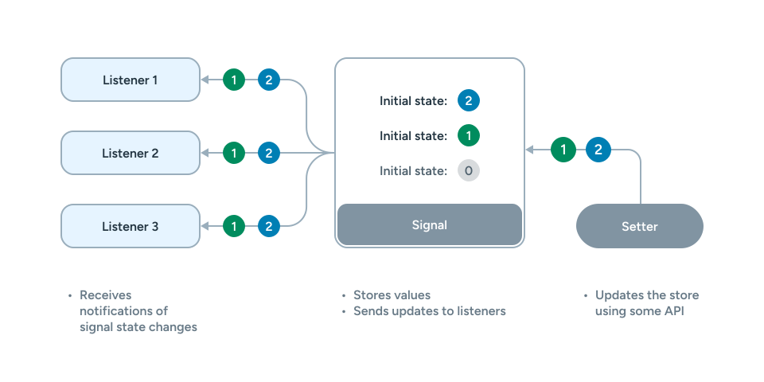
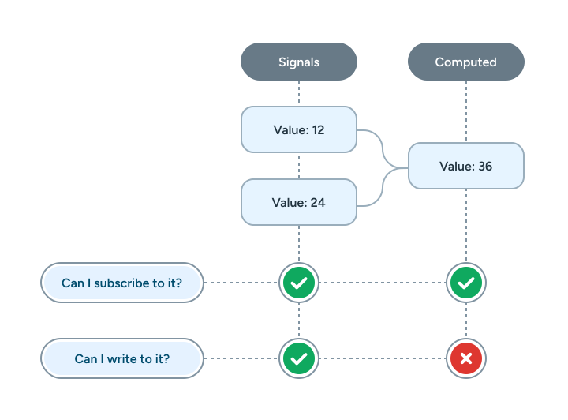
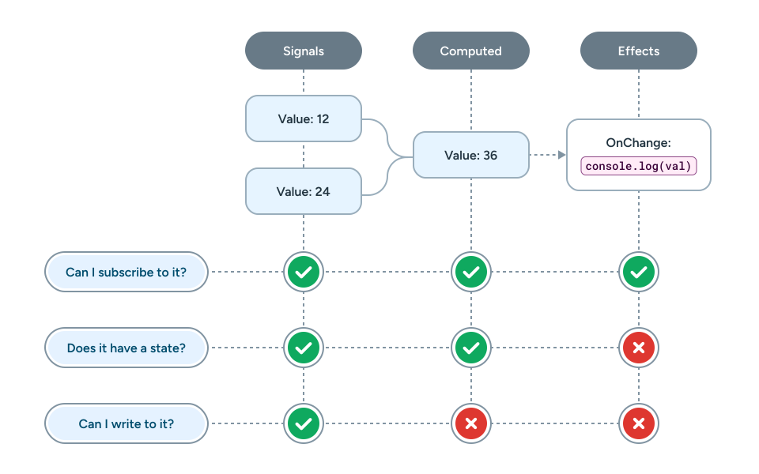

---
{
    title: "What are Signals?",
    description: "",
    published: '2024-09-26T21:52:59.284Z',
    tags: ['javascript','angular'],
    license: 'cc-by-4'
}
---

Signals are seemingly everywhere today. Among others, there's some flavor of signals in:

- [Angular](https://angular.dev/guide/signals)
- [Vue](https://vuejs.org/guide/extras/reactivity-in-depth.html#connection-to-signals)
- [Preact](https://preactjs.com/guide/v10/signals/)
- [Solid.js](https://www.solidjs.com/docs/latest/api#createsignal)
- [Svelte](https://svelte.dev/blog/runes)
- [Qwik](https://qwik.dev/docs/components/state/#usesignal)
- [And many more](https://dev.to/this-is-learning/the-evolution-of-signals-in-javascript-8ob)

There's even [efforts to bring signals into JavaScript itself](https://github.com/tc39/proposal-signals).

Given this explosion of popularity, many are left wondering:

> What even **are** signals?!

It's a good question! Let's explore signals, how they operate under-the-hood, and how we can use them in our libraries today.

# Signals Basics

In their most basic form, signals are a method of having some state and a way of subscribing to that state.

```javascript
// This is psuedo code. This API is possible, but not
// representative of any of the tools we're looking at today.
const counter = signal(0);

// This will re-run whenever `counter` updates
counter.subscribe(() => {
	console.log(counter.get());
})

// We can call it once 
counter.set(1);

// Or any number of times
setInterval(() => {
    counter.set(count.get() + 1);
}, 1000);
```

There's a few ways to implement this, but here's a basic implementation of the API above:

```javascript
function signal(initialValue) {
    let value = initialValue;
    const subscribers = new Set();

    return {
        get: () => value,
        set: (newValue) => {
            value = newValue;
            subscribers.forEach(fn => fn());
        },
        subscribe: (listener) => {
            subscribers.add(listener);
            return () => subscribers.delete(listener);
        }
    }
}
```

> You can see another basic variant of a signals implementation in [a 5 minute lightning talk I gave at ngConf 2024](https://www.youtube.com/watch?v=cJ7AuQUBmA4).

</img>

Here, we can see how a signal has:

- An initial value
- A getter to retrieve the value
- A setter to update the value and notify subscribers
- A way to subscribe to the signal

This is incredibly useful for being able to run one bit of code when your state changes, like binding the text value of a DOM node to some JavaScript state:

```html
<button id="clicker">0</button>

<script>
	const clickerBtn = document.getElementById("clicker");
    
    const countSignal = signal(0);
    
    countSignal.subscribe(() => {
        clickerBtn.innerText = countSignal.get();
    });
    
    clickerBtn.addEventListener("click", () => {
       countSignal.set(countSignal.get() + 1); 
    });

    // ...
</script>
```

// TODO: Add iframe

Here, we can see how a signal acts as a primitive for recreating [JavaScript Reactivity](/posts/what-is-reactivity) to sync state between the DOM and JS.

# Computed Properties

It's a regular occurance to derive state from other pieces of state in software engineering.

Take a `sum` function for example:

```javascript
function sum(a, b) {
	return a + b;
}

const num1 = 12;
const num2 = 24;
const output = sum(a, b);
```

Having the ability to have `output` auto-calculated when `num1` or `num2` changed would be a gamechanger for derived state.

Luckily for us, we can build a basic API for derived state relatively trivially based on our signals implementation:

```javascript
function computed(fn, signals) {
    let value = fn();
    for (let signal of signals) {
        signal.subscribe(() => {
            value = fn();
        });
    }
    return {
        get: () => value
    }
}
```

Now we can derive signals in a nicer way using `computed`:

```javascript
const num1 = signal(1);
const num2 = signal(2);
const output = computed(() => num1.get() + num2.get(), [num1, num2]);

console.log(output.get()); // 3
num1.set(3);
console.log(output.get()); // 5
```

We can even add in the ability to subscribe to the state updates of `computed`, much like a `signal`:

```javascript
function computed(fn, signals) {
    let value = fn();
    const subscribers = new Set();

    for (let signal of signals) {
        signal.subscribe(() => {
            value = fn();
            subscribers.forEach(sub => sub());
        });
    }

    return {
        get: () => value,
        subscribe: (listener) => {
            subscribers.add(listener);
            return () => subscribers.delete(listener);
        }
    }
}
```

```javascript
const num1 = signal(1);
const num2 = signal(2);
const output = computed(() => num1.get() + num2.get(), [num1, num2]);

output.subscribe(() => {
  console.log(output.get())
});

num1.set(3); // Logs "5"
```

This `computed` method is is much like a `signal` but instead of having its own writable state, creates state by reading from the base signals:

</img>


With this API we can apply to our document once more for a basic adder:

```html
<label>
  <div>Number 1:</div>
  <input id="num1" type="number" value="0" />
</label>
<label>
  <div>Number 2:</div>
  <input id="num2" type="number" value="0" />
</label>
<p>The sum of these numbers is: <span id="output">0</span></p>

<script>
  const num1 = document.getElementById('num1');
  const num2 = document.getElementById('num2');
  const output = document.getElementById('output');

  const num1Signal = signal(0);
  const num2Signal = signal(0);
  const outputSignal = computed(
    () => num1Signal.get() + num2Signal.get(),
    [num1Signal, num2Signal]
  );

  num1.addEventListener('input', (e) => {
    num1Signal.set(e.target.valueAsNumber);
  });

  num2.addEventListener('input', (e) => {
    num2Signal.set(e.target.valueAsNumber);
  });

  outputSignal.subscribe(() => {
    output.innerText = outputSignal.get();
  });

  // ...
</script>
```

// TODO: Add iframe

## Computed with a Signal internally

> But wait! Aren't we already keeping track of state and a list of subscribers inside of `signal`? Can't we reuse that in `computed`?

We can indeed, astute reader! Let's simplify our usage of `computed` to have a `signal` as our primitive data storage:

```javascript
function computed(fn, signals) {
    const valueSignal = signal(fn());

    for (let signal of signals) {
      signal.subscribe(() => {
        valueSignal.set(fn());
      });
    }

    return {
      get: valueSignal.get,
      subscribe: valueSignal.subscribe,
    };
}
```

In fact, this idea that a `computed` signal is just a normal `signal` but in read-only mode is one which is critical to understanding much of the underlying optimizations for many signals implementations.

# Effects

To track a signal or computed value, you can use the `subscribe` method. But if we look at the other APIs, they're functions, not methods.

To keep our APIs consistent (and to add features later-on), let's create a way to subscribe to signals without using `subscribe` itself.

To do this, we can just wrap `subscribe` in an API not dissimilar from how `computed` looks:

```javascript
function effect(fn, signals) {
    for (let signal of signals) {
      signal.subscribe(() => {
        fn();
      });
    }
}
```

```javascript
const num1 = signal(1);
const num2 = signal(2);
const output = computed(() => num1.get() + b.get(), [num1, num2]);

effect(() => {
    console.log(output.get());
}, [output]);

num1.set(2); // "4" is logged to the console
num2.set(3); // "5" is logged to the console
```

This completes our base signals API trio:

- Signals can be subscribed to, has state, and can be written to.
- Computed values can be subscribed to and has state.
- Effects can be subscribed to.

</img>

With `effect` we can get rid of `subscribe`-ing manually in our previous addition sample all-together:

```javascript
const num1 = document.getElementById('num1');
const num2 = document.getElementById('num2');
const output = document.getElementById('output');

const num1Signal = signal(0);
const num2Signal = signal(0);
const outputSignal = computed(
	() => num1Signal.get() + num2Signal.get(),
	[num1Signal, num2Signal]
);

num1.addEventListener('input', (e) => {
	num1Signal.set(e.target.valueAsNumber);
});

num2.addEventListener('input', (e) => {
	num2Signal.set(e.target.valueAsNumber);
});

effect(() => {
	output.innerText = outputSignal.get();
}, [outputSignal]);
```

## Effects in Computed

Now that we've removed manual `subscribe`-ing from our usage of `signal`s, let's remove it from our internal `computed` example as well:

```javascript
function computed(fn, signals) {
    const valueSignal = signal(fn());

    effect(() => {
      valueSignal.set(fn());
    }, signals);

    return {
      get: valueSignal.get,
      subscribe: valueSignal.subscribe,
    };
}
```

Now the only place we use `.subscribe` is inside of `effect`.

> This is not often how `computed` is implemented, but simplies code for our usecase going forward.

# Auto-tracking

Our current signals API looks something like this:

```javascript
signal(init);
computed(fn, deps);
effect(fn, deps);
```

This works, but having `deps` be an explicit array brings a set of challenges and downsides:

- It's more verbose
- `computed` and `effect` s need a dependency array but `signal` does not
- It's easy to accidentally forget a signal in the deps array

What if we could eliminate the need for the array while still tracking the internal signals used inside of `computed` and `effect`?

This idea of invisibly tracking dependencies is called "Auto-tracking" and can be implemented by replacing our `subscribe` internal methods with usage of a `Listener` singleton.

```javascript
var Listener = null;

function signal(initialValue) {
  let value = initialValue;
  const subscribers = new Set();

  return {
    get: () => {
      if (Listener) {
        subscribers.add(Listener);
      }
      return value;
    },
    set: (newValue) => {
      value = newValue;
      subscribers.forEach((fn) => fn());
    },
  };
}

function computed(fn) {
  const valueSignal = signal(fn());

  effect(() => {
    valueSignal.set(fn());
  });

  return {
    get: valueSignal.get,
  };
}

function effect(fn) {
  Listener = fn;
  fn();
  Listener = null;
}
```

This works because `effect` updates the `Listener` and then the signals inside of `effect` are reading the initial value:

```javascript
effect(() => {
	// Inside of `signal.get` there's a check for `Listener`
	// which is now this function. It's then added as a subscriber
	// to `signal` which, on write, will retrigger this.
    //
    // It doesn't get added twice because the `Listener` is only set on the
    // first call of `fn`
	signal.get();
})
```

This behavior is then propagated into `computed` since it uses `effect` internally.

-----

Now let's see our previous code sample with the new API:

```javascript
const num1 = document.getElementById('num1');
const num2 = document.getElementById('num2');
const output = document.getElementById('output');

const num1Signal = signal(0);
const num2Signal = signal(0);
const outputSignal = computed(() => num1Signal.get() + num2Signal.get());

num1.addEventListener('input', (e) => {
	num1Signal.set(e.target.valueAsNumber);
});

num2.addEventListener('input', (e) => {
	num2Signal.set(e.target.valueAsNumber);
});

effect(() => {
	output.innerText = outputSignal.get();
});
```

Cleaner, right?

# Glitches

Friends, I have something to admit; we have a fatal flaw in our signals implementation we've been building to this point.

Namely, it's possible to create a value that's incorrect for a temporary period of time before it's corrected.

This occurs because of how we've built out our subscriptions in a naive way, allowing one subscriber to receive a value earlier than the other dependencies are finished resolving the values.

Take the following code:

```javascript
const count = signal(0);
const evenOdd = computed(() => count.get() % 2 ? "Even" : "Odd");

effect(() => {
	console.log(`${count} is ${evenOdd}`);
})
```

</img>

While this code is valid, our implementation lets it down. It will in fact emit `0 is even` at first, but once you update `count` you'll get `1 is even`, which is clearly incorrect.

</img>

Now, this value eventually reconciles back to `1 is odd` after emitting the incorrect value, but this could lead to a number of problems if left as-is:

- Incorrect logging behavior
- Jumpy UIs
- Wrong data sent to the server

And more.

This rapid shift from an incorrect value to a correct value is called a "glitch".

> How do we make our signals "glitch-free"? 

Well, we can do this by having the last `effect` wait for all the depended upon values to resolve before running.

</img>

------

Let's see how this glitch fixing looks like in code:


```javascript
var Listener = null;
// Track what signals are accessed in the Listener
var accessedSignals = new Set();
// Track what current signal is being written to
var writingSignal = null;

function signal(initialValue) {
  let value = initialValue;
  const subscribers = new Set();

  const obj = {
    get: () => {
      if (Listener) {
        subscribers.add(Listener);
        accessedSignals.add(obj);
      }
      return value;
    },
    set: (newValue) => {
      // A computed value should not update `writingSignal`, as its state is purely internal and should be marked as "read-only"
      const isInsideAComputed = !!obj.__trackedSignals;
      value = newValue;
      if (!isInsideAComputed) {
        writingSignal = obj;
      }
      subscribers.forEach((fn) => fn(obj));
      if (!isInsideAComputed) {
        writingSignal = null;
      }
    },
  };
  return obj;
}

function computed(fn) {
  const valueSignal = signal(fn());

  const {__trackedSignals} = effect(() => {
    valueSignal.set(fn());
  });

  // Assign the tracked signals to the value signal so it can be used in the `Listener` of the effect,
  // and avoid updating the `writingSignal` when the value signal is updated
  Object.assign(valueSignal, {
    __trackedSignals
  })

  return {
    get: valueSignal.get,
    __trackedSignals,
  };
}

function effect(fn) {
  let trackedSignals = new Set();
  let seen = new Set();
  let relatedSignals = null;
  // Setup the listener that will be called when a signal is accessed
  Listener = (signal) => {
    // We have "seen" this signal
    seen.add(signal);

    // Check to see if we need to "see" any related signals before running the function
    // and cache the results until the next run
    if (!relatedSignals) {
      relatedSignals = new Set();
      trackedSignals.forEach(
        signalLike => {
          if (signalLike.__trackedSignals?.has(writingSignal)) {
            relatedSignals.add(signal);
          } else if (signalLike === writingSignal) {
            relatedSignals.add(signalLike);
          }
        }
      );
    }

    // Have we seen all the signals we need to? If so, run the function and cleanup
    if (seen.size === relatedSignals?.size) {
      fn();
      seen = new Set();
      relatedSignals = null;
    }
  }
  // Trigger the effect for the first time. This also starts auto-tracking and stores vars in `accessedSignals`
  fn();
  // Keep a copy of the accessed signals for reference in the `Listener` later
  trackedSignals = new Set(accessedSignals);
  // Cleanup
  Listener = null;
  accessedSignals = new Set();

  // Return the tracked signals for the effect so it can be used in the `Listener` later
  return {
    __trackedSignals: trackedSignals,
  }
}
```

Here, we're keeping track of what signal is currently writing state. We're then checking what variables are relative to the `Listener` when we run `fn` inside of our `effect`.

Finally, we cross-reference how many variables depend on the written signal and wait for that number of subscription calls are ran and only execute the `effect` when we've seen the right number of updates.

```javascript
const count = signal(0);
const evenOdd = computed(() => count.get() % 2 ? "Even" : "Odd");

// Notice how this effect only runs once, even though it depends
// on both `count` and `evenOdd`
effect(() => {
	console.log(`${count} is ${evenOdd}`);
})

count.set(2);
count.set(123);
```

// TODO: Add iframe

# Where do Signals fit in?

Before we wrap up, let's talk about where signals fit into the broader scope of the JavaScript ecosystem.

If we take a venn diagram of whether a primitive:

1) Has state
2) Can be written to
3) Can be subscribed to

It might look something like this:


> You may not be familiar with what an observable or `Subject` are. These terms [come from RxJS](https://rxjs.dev/), which is a library that provides an event system in your codebase.
>
> However, we can see examples of observables in [`EventTarget`](https://developer.mozilla.org/en-US/docs/Web/API/EventTarget) when you run [`addEventListener`](https://developer.mozilla.org/en-US/docs/Web/API/EventTarget/addEventListener) to a `<button>`.
>
> The event target itself doesn't have permanent state but will pass a value to a subscriber when an in-transit value comes through. However, you're unable to write values to that event stream.
>
> Compare and contrast to, say, a `Subject` that extends an observable with the capabilities of being able to emit your own events. A good example of this might be emitting your own [`CustomEvent`](https://developer.mozilla.org/en-US/docs/Web/API/CustomEvent) on the `document` object.

Here, we can see that signals are a powerful primitive that takes ownership over multiple areas of the reactivity story.

