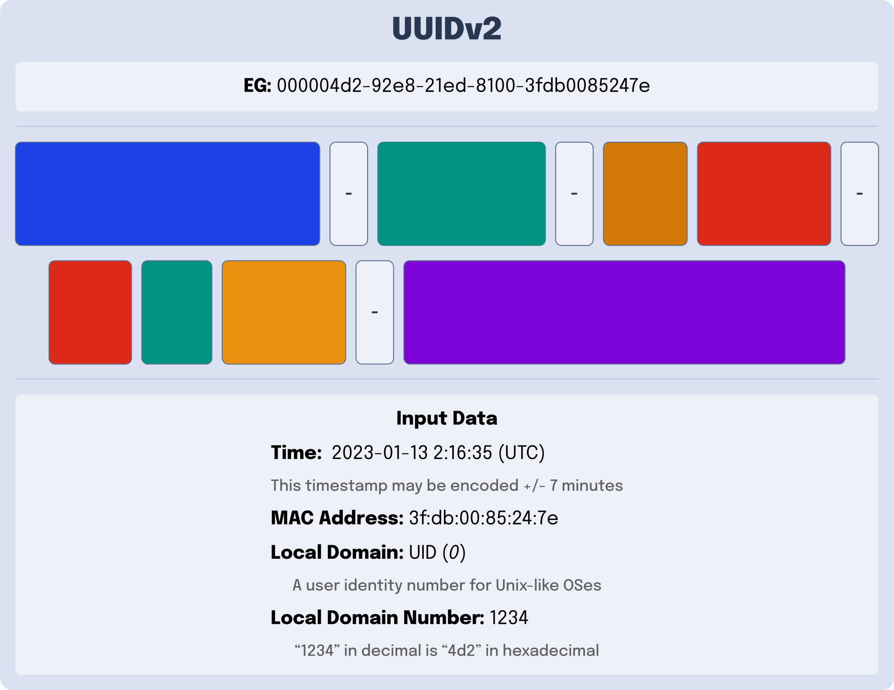
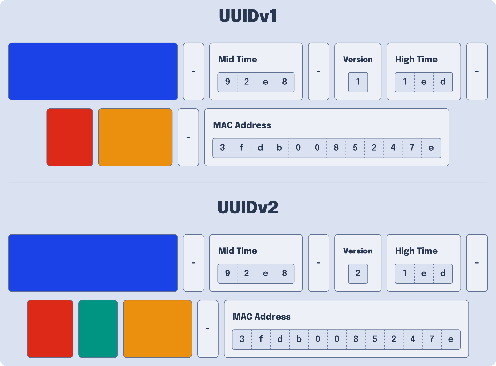

---
{
    title: "What Happened to UUIDv2?",
    description: "You may have heard that \"UUIDv2 is bad\". Maybe you've never even heard of them and thought UUIDs went from v1 to v3. Why is that? What did UUIDv2 do wrong?",
    published: '2023-01-15T21:52:59.284Z',
    tags: ['computer science'],
    license: 'cc-by-4',
    collection: "Explaining UUIDs",
    order: 2
}
---

If you read [my last post introducing UUIDs](/posts/what-are-uuids), you'll remember that I said:

> UUIDv2 is _weird_.

After this, [I left a very short (one or two sentences) explanation of what a UUIDv2 is](/posts/what-are-uuids#UUIDv2).

Why would I do that [when UUIDv3 and UUIDv5 got four whole headers worth of explanation](/posts/what-are-uuids#UUIDv3and5)? What makes UUIDv2 different or "weird," as I put it?

The answer is that while UUID _is_ a form of UUID by some definitions, it effectively is not in others.

> What?!

I know... It's a bit jarring. What's worse, even within the definitions of UUIv2 we have, it is deeply flawed, enough so that most are comfortable leaving it in the past.

To figure out how UUIDv2 became this way, let's explore the following:

- [What makes a UUID a UUID?](#specs)
- [How is UUIDv2 defined?](#uuidv2-definition)
- [What was UUIDv2 supposed to be used for?](#posix-data)
- [What are the problems with UUIDv2?](#problems-with-uuidv2)

# What makes a UUID a UUID? {#specs}

As you may have noticed, UUIDs aren't a free-for-all. There are specific rules that apply to UUID that come from a document released in 2005 by the "[Internet Engineering Task Force](https://www.ietf.org/)" (IETF). This document is known as [`RFC 4122`](https://datatracker.ietf.org/doc/html/rfc4122) and acts as the de-facto UUID specification.

This is all [the official UUID specification has to say about UUIDv2](https://datatracker.ietf.org/doc/html/rfc4122#section-4.1.3): 

> Description: DCE Security version, with embedded POSIX UIDs.

That's it.

Even in a proposal to update RFC 4122	

This makes the UUIDv2 the only official version of UUID that does not have an explicit definition as part of the 2005 specification.

This doesn't mean that it doesn't have rules, however; The UUIDv2 specification can be found in an older standard set for UUIDs. This older standard was created by an organizational body then called the "Open Software Foundation" (OSF), now called "The Open Group."

This older specification, which outlined the rules for UUIDv2 and was released in 1997, is called [the DCE 1.1 Authentication and Security Services specification](https://pubs.opengroup.org/onlinepubs/9696989899/toc.htm).

> Interesting in more history of UUIDs? [Twilio Segment's blog has an amazing history lesson about how they came to be](https://segment.com/blog/a-brief-history-of-the-uuid/). 

# How is UUIDv2 Defined? {#uuidv2-definition}

While the DCE specification is happy to go in-depth about [the fine-grained details of UUIDv2](https://pubs.opengroup.org/onlinepubs/9696989899/chap5.htm#tagcjh_08_02_01_01), let's take a more zoomed-out look at it:

UUIDv2 is almost identical to [UUIDv1](/posts/what-are-uuids#UUIDv1). It contains most of the same components:

- A timestamp
- A version
- A variant
- A clock sequence
- A Mac address

However, there are a few small differences. Namely:

- The "Clock Sequence" from UUIDv1 is changed from 3 characters to 1 as the last 2 characters are replaced with a new "Local Domain" enum value.

- The "Low Time" is replaced with a "Local Domain Number."




> Wait, what is a "Local Domain" or "Local Domain Number"?

Well, to answer this, we have to take a short detour to explain what UUIDv2 was supposed to be used for.

# What was UUIDv2 Supposed to Be Used for? {#posix-data}

In [Unix-like operating systems](https://en.wikipedia.org/wiki/Unix-like) such as Linux and macOS, your machine needs a way to keep track of the users on its system. The primary way computers in this family of OSes do this is by assigning you a ["User ID", or "UID"](https://en.wikipedia.org/wiki/User_identifier).

<!-- ::in-content-ad title="Consider supporting" body="Donating any amount will help towards further development of articles like this." button-text="Visit our Open Collective" button-href="https://opencollective.com/unicorn-utterances" -->

This is what the "Local Domain" refers to. The `0` in the "Local Domain" field says that the "Local Domain Number" is tracking the UID of a Unix-like system's user. The "Local Domain Number" is the UID itself.

> But wait, why would we need a "Local Domain" field anyway?

Well, as it turns out, Unix-like systems track more data on the user than a single number. Consider the following use case for a Linux-based school server:

You want to provide permissions to all teachers to access the `Homework Answers` directory, but not the student users. Wouldn't it be nice to have a "group" of users that you could assign specific permissions to?

It was with this thought process that the concept of a ["Group ID" or "GID"](https://en.wikipedia.org/wiki/Group_identifier) was invented. Similar to UIDs, GIDs are a number that keeps information about a group of users on the system.

UUIDv2s are able to track a GID rather than a UID by changing the `Local Domain` to the number `1`. 

> Are those the only two "Local Domains"?

Alas, they are not. Let's continue our example of a school Linux server once more to explain why. Assume you're the [University of California system of schools](https://en.wikipedia.org/wiki/University_of_California) and want to create a directory that allows for emails to be sent to everyone on the [UC Davis campus](https://en.wikipedia.org/wiki/University_of_California,_Davis). That's where an organization might come into play.

This organization would relate to a collection of groups, which in turn relates to a collection of users. This would be tracked with an "organization ID" and assigned a `Local Domain` of `2`.

**This was UUIDv2's original purpose: Encoding of POSIX data in a unique ID**: There are application instances where having the user's operating system information easily accessible would be handy in the resource's ID.

# Why do UUIDv2s suck? {#problems-with-uuidv2}

UUIDv2 has a lot of problems today:

- **Few implementations**: Because of the scarcity of UUIDv2 usage and the lack of formal specification in RFC 4122, there are very few implementations of UUIDv2 in most languages and libraries. This may make implementing them more challenging than other versions of UUID.
- **Difficult to research**: Because there are few implementations of UUIDv2, it's challenging to learn about this version of UUIDs. Most articles ([including my own introduction to UUIDs](/posts/what-are-uuids)) leave a single paragraph (if even!) about the subject.

Both of these feel a bit more like symptoms of a deeper-rooted problem. Dig deep enough, and you'll end up finding what this problem is: **UUIDv2 has a very high likelihood of ID collision**.

This means that if you run UUIDv2 multiple times in rapid succession, you're very likely to get the exact same ID.

This is an absolute showstopper for most applications, as the entire idea behind UUIDv1 (which, remember, UUIDv2 is based on) is to generate unique IDs for each generation.

Let's explain why this occurs in UUIDv2 but not in UUIDv1. To explain this, let's explore the difference in how UUIDv1 handles input dates.

## Explaining How UUIDv1 Handles Dates

Let's look back at the previous article to see how UUIDv1 is structured:


Here, we use a timestamp of 15 byes. Let's take the example UUIDv1 from that image:

```
4e2b4d4c-92e8-11ed-86a8-3fdb0085247e
```

And strip out just the `time` data:

```
4e2b4d4c-92e8-1ed
```

Now, we can sort them from `High Time`, `Mid Time`, then `Low Time`:

```
1ed-92e8-4e2b4d4c
```

Let's remove the dashes, leaving us with the following:

```
1ed92e84e2b4d4c
```

Now we can convert this [from a hex number to a decimal number](/posts/non-decimal-numbers-in-tech/):

```
138928689959882060
```

> What do we do with this number?

Well, this is a timestamp. Namely, this is the number of 100 nanoseconds intervals since October 15, 1582 at midnight UTC.

> This date may seem arbitrary, but this is the date of Gregorian reform to the Christian calendar.

Let's use [`dayjs`](https://day.js.org) to see what this equates to:

```javascript
// Convert timestamp to milliseconds and add it to the start date
dayjs("15 October 1582").add(138928689959882060 / 10000, 'milliseconds').toString();
// This outputs Fri, 13 Jan 2023 10:09:33 GMT
```

This is the same date as the input value! Because of the precision of 12 characters, we're able to track the input time down to the closest 100th-nanosecond.

## How does UUIDv2 Handle Dates?

Now that we've seen how UUIDv1 handles date values let's look one more time at UUIDv2:


Here, once again, we can take the original UUID:

```
000004d2-92e8-21ed-8100-3fdb0085247e
```

Grab the time values:

```
92e8-1ed
```

Sort them:

```
1ed-92e8
```

Remove the dashes:

```
1ed92e8
```

Notice how we only have 7 digits here. Compare this to UUIDv1's 15 digits of timestamp. **Here's where things get tricky**.

If we attempt to convert this number to a decimal value, we get the following:

```
32346856
```

**This isn't correct**. The number we have should start with `1` in order to properly add it to the `1582` date to get the UUID's timestamp.

To solve this, we need to add back the missing 8 digits of the timestamp to our hexadecimal number:

```
1ed92e800000000
```

Only after we've added these `0`s can we convert to decimal:

```
138928688648421376
```

And add this number to the previous `1582` date:

```javascript
dayjs("15 October 1582").add(138928688648421376 / 10000, 'milliseconds').toString();
// This outputs Fri, 13 Jan 2023 10:07:22 GMT
```

## How do UUIDv1 and UUIDv2 Dates Differ?

Compare the UUIDv1 parsed date:

```
Fri, 13 Jan 2023 10:09:33 GMT
```

To the UUIDv2 parsed date:

```
Fri, 13 Jan 2023 10:07:22 GMT
```

What's interesting here is that we passed the same timestamp to both UUIDs. The reason for the time difference is that UUIDv2 does not have the same level of granularity as UUIDv1.

Instead of UUIDv1's **100-nanosecond** tracking of the input timestamp, UUIDv2 only tracks up to segments of **7 minutes** at a time.

This means that if you have an input date to UUIDv2, the encoded value can be up to 7 minutes ahead or behind the encoded value.

## Why do UUIDv2 Collisions Occur?

So what does this time encoding have to do with UUID collision?

Well, let's take one last look between UUIDv1 and UUIDv2:



While the change between `Low Time` and `Local Domain Number` is the most obvious difference between these two - there's one more significant difference:

UUIDv1 has 3 characters for `Clock`, and UUIDv2 has only 1 characters for `Clock`. The remaining two characters of `Clock` have been reallocated to `Local Domain` in UUIDv2.

If you recall, the `Clock` is short for "Clock Sequence" and is a random number generated by the system's clock.

In UUIDv1, a clock sequence is a 14-bit number, which can host a value from `0` to `16,383`.

This is a contrast from the clock sequence in a version 2 UUID, which is a 6-bit number. This 6-bit number supports values from `0` to `63`.

This means that **UUIDv1 generators can create `16,384` unique IDs until the timestamp increments, while UUIDv2 generators can only generate `64` unique IDs until the timestamp increments**.

This is made substantially worse when you remember that _UUIDv1 generators increment their timestamps every 100 nanoseconds while UUIDv2 increments every 7 minutes._

This difference of "16,384 unique IDs every 100 nanoseconds" vs "64 unique IDs every 7 minutes" is why UUIDv2 has so many issues with collisions.

# Conclusion

Hopefully, this has been insightful as to why most people tend to avoid UUIDv2 in production applications. Collisions are the bane of every unique ID system, and UUIDv2 has a pretty rough time mitigating that.

In the next article, we'll take a look at what future versions of UUID (v6, 7, and 8) will look like and how they'll be utilized in applications in the near future.

Until then, go forth and ~~prosper~~ be your unique self!
