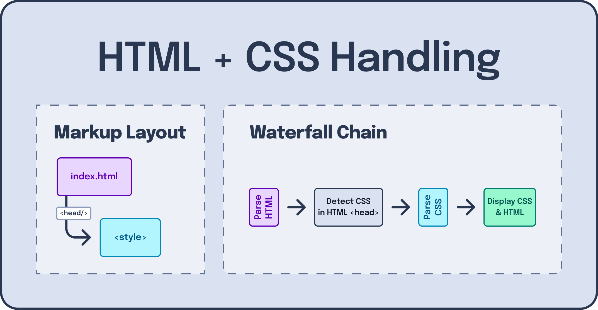

---
{
    title: "Why is CSS-in-JS slow?",
    description: "",
    published: '2024-08-26T10:12:03.284Z',
    tags: ['webdev', 'css'],
    license: 'cc-by-4'
}
---

If you've worked with frameworks like React, Angular, or Vue in the past you'll likely have used (or heard of) a CSS-in-JS solution like [Styled Components](https://styled-components.com/), [Emotion CSS](https://emotion.sh/docs/introduction), or [JSS](https://cssinjs.org/).

While these frameworks have the superpower of being able to reuse existing knowledge of JavaScript to generate complex stylesheets, they come with their fair share of downsides.

Many detractors of CSS-in-JS have a common qualm with the concept of the tooling as a whole:

> **CSS-in-JS is slow**.

Here's the unfortunate truth: That's correct.

Don't get me wrong, I like CSS-in-JS for certain projects; but it's challenging (or often impossible) to make a CSS-in-JS solution be as fast as vanilla CSS.

Let's explore why that is, what some libraries have done to sidestep the problem, and more.

# How CSS is parsed

Like any other high-level language, CSS is written in plain text. While we have special syntax highlighting in our IDEs for CSS, there's no reason you couldn't write CSS in `Notepad.exe` and have it function the same.

For example:

```css
p {
    color: red;
}
```

Is still constructed using [ASCII characters](/posts/non-decimal-numbers-in-tech#ascii). `p` is still a string of `"p"` regardless of it's in a `.css` file or if it's in a `.txt` file.

To **really** drive the point home, you can even point to a `.txt` file (with valid CSS syntax) in a `<link>` element to link it to an HTML file as a stylesheet:

```html
<!-- This is valid and works -->
<link rel="stylesheet" href="styles.txt" />
```

> "So why is this?"

Well, this is because the CSS is "parsed" into a machine readable language via an "Abstract Syntax Tree" (AST).


While the exact semantics of this aren't _too_ important right now, just know that this process - while quick - isn't free and might take some cycles of your CPU to process. In fact, the larger your stylesheet, the more time this parsing takes before the CSS can be processed and used to style your markup.


> [You can learn more about how our source code is transformed into machine understandable runnable codes in our "How Computers Speak" article.](/posts/how-computers-speak)

# Waterfalls

<!-- ::in-content-ad title="Consider supporting" body="Donating any amount will help towards further development of articles like this." button-text="Sponsor my work" button-href="https://github.com/sponsors/crutchcorn/" -->

> Why does CSS parsing matter to me?

Well, it matters because this parsing is how your browser figures out how it wants to style things.

Let's zoom out for a moment and think about how CSS makes it on our screen using traditional CSS loading mechanisms. Say we have a `<style>` tag loaded in an HTML file like so:

```html {5}
<!-- index.html -->
<!doctype html>
<html>
	<head>
		<style>
        	/* ... */
        </style>
	</head>
	<body>
		<!-- ... -->
	</body>
</html>
```

When this stylesheet is detected in our HTML file, it will block displaying the contents of the HTML file until the CSS is finished parsing and is ready to style the page synchronously before the browser can show its contents (or, "paint").



This ability to block the HTML from displaying to the user allows us to avoid scenarios where we want to hide contents on initial load but, because styling hasn't loaded yet, is shown anyway:

```html
<p class="hide-me">Shh, it's a secret!</p>
<style>
    .hide-me {
        display: none;
    }
</style>
```

<video src="./display_none_fail.mp4"></video>

> **Note:**
>
> This video is slowed down for demonstrative effect. This is not how the above code sample would function in a typical HTML file.

This flashing of content is often called a "Flash of unstyled content" or "FOUC" for short.

## `<head>` CSS-in-JS

Now let's look at that same waterfall chain if we move our CSS generation into a `<script>` tag:

```html
<!DOCTYPE html>
<html lang="en">
  <head>
    <script>
      const styleTag = document.createElement('style');
      styleTag.innerText = `
  p {
    display: none;
  }
`;
      document.head.append(styleTag);
    </script>
  </head>
  <body>
    <p class="hide-me">Shh, it's a secret!</p>
  </body>
</html>
```

Here, we load in a `<style>` tag in the `<head>` via a JavaScript snippet also loaded in the `<head>`. This means that the JS will need to be parsed before it can run the code to generate the CSS, then _that_ CSS needs to be parsed until finally it can be displayed all-together.


This isn't ideal, but isn't the worst either. Unfortunately, however, it's not representative of how CSS-in-JS _really_ works.

After all, most framework-based projects don't have their `<script>` tags in `<head>`. Instead, they might opt to do something akin to:

```html
<!DOCTYPE html>
<html lang="en">
  <body>
    <div id="root"></div>
    <script>
      render(document.querySelector('#root'));
    </script>
  </body>
</html>
```

This allows us to wait until the `root` element has been created before it's able to inject the framework's markup into it.

Let's explore how this chain evolves when we move our `<script>` tag into the `<body>`, then.

## `<body>` CSS-in-JS

By moving our code to the body:

```html
<!DOCTYPE html>
<html lang="en">
  <body>
    <p class="hide-me">Shh, it's a secret!</p>
    <script>
      const styleTag = document.createElement('style');
      styleTag.innerText = `
  p {
    display: none;
  }
`;
      document.head.append(styleTag);
    </script>
  </body>
</html>
```

We introduce another step to our little waterfall chain: Now the browser displays the DOM before parsing the JS.


This isn't ideal, but is _still_ missing another step we need to make before it's emblematic of framework CSS-in-JS usage.

## Framework CSS-in-JS

See, while our code before immediately executes the `document.createElement('style')` logic, the same can't be said for all frameworks using this solution.

Your framework needs to create the markup for the `<App/>` entrypoint component and render it. Depending on your framework, this might happen asynchronously from the parsing of the JS.

Likewise, your CSS-in-JS library might not render the CSS synchronously with the first render of your component. As a result, you might get _two_ FOUCs; once when the HTML is downloaded without the framework markup rendered, the second when framework renders without the CSS injected yet. 


# Compiled CSS-in-JS

> "But not all CSS-in-JS solutions are slow!"

This is true. If you're using solutions like [StyleX](https://stylexjs.com/), [PandaCSS](https://panda-css.com/), or [Vanilla Extract](https://vanilla-extract.style/), you're not likely to run into these same performance problems of JS to CSS waterfalling.

However, the reason these frameworks aren't slow are because they sidestep the "JavaScript" part of the problem almost entirely.

See, these tools all utilize a compiler of some kind to compile away from runtime JavaScript into compiled CSS. For example, this PandaCSS code:

```jsx
import { css } from './styled-system/css'
 
export function App() {
  return <div className={css({ bg: 'red.400' })} />
}
```

Might compile to something like this **during your site's compilation, on your developer machine**:


```html
<!DOCTYPE html>
<html lang="en">
    <head>
        <style>
        .bg_red\.400 {
            background: var(--colors-red-400);
        }
        </style>
    </head>
    <body>
        <!-- ... -->
    </body>
</html>
```

```jsx
// App.jsx
import { css } from './styled-system/css'
 
export function App() {
  return <div className={"bg_red.400"} />
}
```

This takes our problem back from this:


To the original problem space like this:


> **Not just these tools:**
>
> Earlier I mentioned a list of CSS-in-JS libraries that were slow and ones that compiled to CSS. While this is _generally_ true, it's not always so black and white.
>
> After all, some libraries have plugins or [SSR](https://playfulprogramming.com/posts/what-is-ssr-and-ssg) compatibility to either reduce or solve the problems with CSS-in-JS as outlined.

# Conclusion

Hopefully this has been an insightful look into how different CSS-in-JS solutions work under-the-hood and why you might or might not want to select one  library over another.

Want to learn more about styling options in your framework? Check out [the second book in The Framework Field Guide series](https://framework.guide#ecosystem-title).

[](https://framework.guide#ecosystem-title)

The book is in beta and will have a chapter all about styling options in your framework. This article was actually originally part of the book until I broke it out into something new.

Thanks for reading!
