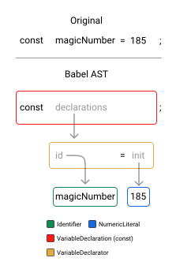

---
{
    title: "Why is CSS-in-JS slow?",
    description: "",
    published: '2024-09-01T10:12:03.284Z',
    tags: ['webdev', 'css'],
    license: 'cc-by-4'
}
---

If you've worked with frameworks like React, Angular, or Vue in the past you'll likely have used (or heard of) a CSS-in-JS solution like [Styled Components](https://styled-components.com/), [Emotion CSS](https://emotion.sh/docs/introduction), or [JSS](https://cssinjs.org/).

While these frameworks have the superpower of being able to reuse existing knowledge of JavaScript to generate complex stylesheets, they come with their fair share of downsides.

Many detractors of CSS-in-JS have a common qualm with the concept of the tooling as a whole:

> **CSS-in-JS is slow**.

Here's the unfortunate truth: It's true.

Don't get me wrong, I like CSS-in-JS for certain projects; but it's challenging (or often impossible) to make a CSS-in-JS solution be as fast as vanilla CSS.

Let's explore why that is, what some libraries have done to sidestep the problem, and more.

# How CSS is parsed

Like any other high-level language, CSS is written in plain text. While we have special syntax highlighting in our IDEs for CSS, there's no reason you couldn't write CSS in `Notepad.exe` and have it function the same.

For example:

```css
p {
    color: red;
}
```

Is still constructed using [ASCII characters](/posts/non-decimal-numbers-in-tech#ascii). `p` is still a string of `"p"` regardless of it's in a `.css` file or if it's in a `.txt` file.

To **really** drive the point home, you can even point to a `.txt` file (with valid CSS syntax) in a `<link>` element to link it to an HTML file as a stylesheet:

```html
<!-- This is valid and works -->
<link rel="stylesheet" href="styles.txt" />
```

> So why is this?

Well, this is because the CSS is "parsed" into a machine readable language via an "Abstract Syntax Tree" (AST).



While the exact semantics of this aren't _too_ important right now, just know that this process - while quick - isn't free and might take some cycles of your CPU to process. In fact, the larger your stylesheet, the more time this parsing takes before the CSS can be processed and used to style your markup.


> [You can learn more about how our source code is transformed into machine understandable runnable codes in our "How Computers Speak" article.](/posts/how-computers-speak)

# Waterfalls

> Why does CSS parsing matter to me?

Well, it matters because this parsing is how your browser figures out how it wants to style things.

Let's zoom out for a moment and think about how CSS makes it on our screen using traditional CSS loading mechanisms. Say we have a `<style>` tag loaded in an HTML file like so:

```html {5}
<!-- index.html -->
<!doctype html>
<html>
	<head>
		<style>
        	/* ... */
        </style>
	</head>
	<body>
		<!-- ... -->
	</body>
</html>
```

When this stylesheet is detected in our HTML file, it will block displaying the contents of the HTML file until the CSS is finished parsing and is ready to style the page synchronously before the browser can show its contents (or, "paint").


This ability to block the HTML from displaying to the user allows us to avoid scenarios where we want to hide contents on initial load but, because styling hasn't loaded yet, is shown anyway:

```html
<p class="hide-me">Shh, it's a secret!</p>
<style>
    .hide-me {
        display: none;
    }
</style>
```

<video src="./display_none_fail.mp4"></video>

> **Note:**
>
> This video is slowed down for demonstrative effect. This is not how the above code sample would function in a typical HTML file.


## `<head>` CSS-in-JS

Now let's look at that same waterfall chain if we move our CSS generation into a `<script>` tag:

```html
<!DOCTYPE html>
<html lang="en">
  <head>
    <script>
      const styleTag = document.createElement('style');
      styleTag.innerText = `
  p {
    display: none;
  }
`;
      document.head.append(styleTag);
    </script>
  </head>
  <body>
    <p class="hide-me">Shh, it's a secret!</p>
  </body>
</html>
```

Here, we load in a `<style>` tag in the `<head>` via a JavaScript snippet also loaded in the `<head>`. This means that the JS will need to be parsed before it can run the code to generate the CSS, then _that_ CSS needs to be parsed until finally it can be displayed all-together.


This isn't ideal, but isn't the worst either. Unfortunately, however, it's not representative of how CSS-in-JS _really_ works.

After all, most framework-based projects don't have their `<script>` tags in `<head>`. Instead, they might opt to do something akin to:

```html
<!DOCTYPE html>
<html lang="en">
  <body>
    <div id="root"></div>
    <script>
      render(document.querySelector('#root'));
    </script>
  </body>
</html>
```

This allows us to wait until the `root` element has been created before it's able to inject the framework's markup into it.

Let's explore how this chain evolves when we move our `<script>` tag into the `<body>`, then.

## `<body>` CSS-in-JS


## Framework CSS-in-JS


// TODO: Fill in


// TODO: Fill in


