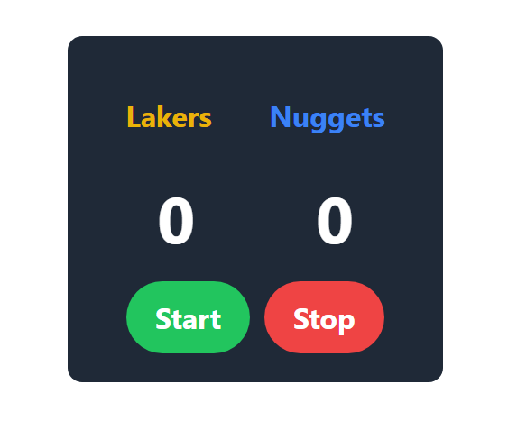
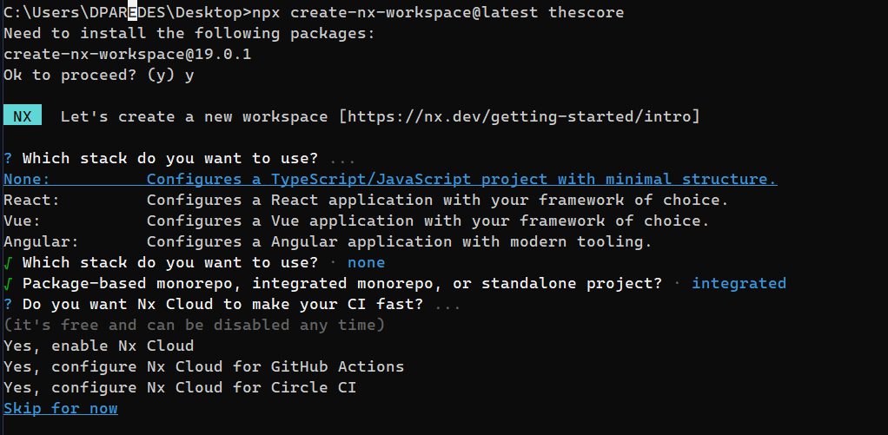
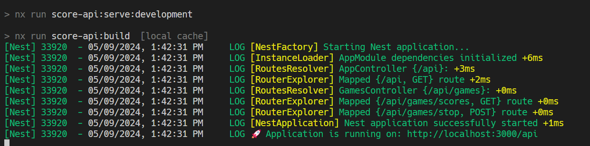
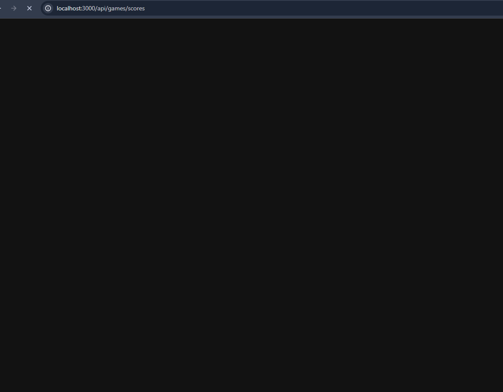
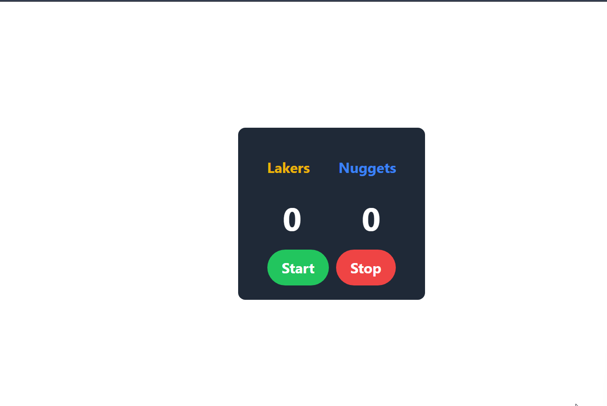
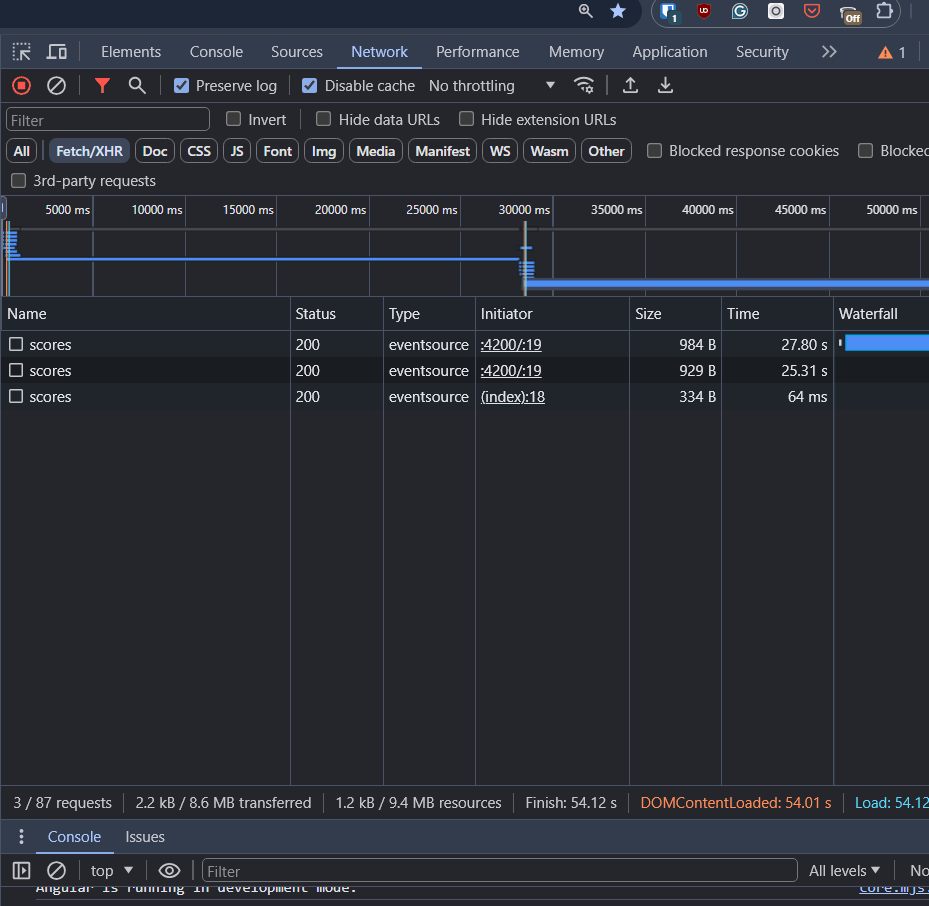

---
{
title: "Building Real-Time Boards with Angular and NestJS Using Server-Sent Events",
published: "2024-05-10T06:39:52Z",
edited: "2024-05-14T12:33:25Z",
tags: ["angular", "javascript", "typescript"],
description: "When I need to build real-time apps with Angular, most of the time I use SignalR, but a few days ago,...",
originalLink: "https://www.danywalls.com/building-real-time-boards-with-angular-and-nestjs-using-server-sent-events",
coverImage: "cover-image.png",
socialImage: "social-image.png"
}
---

When I need to build real-time apps with Angular, most of the time I use SignalR, but a few days ago, a friend mentioned SSE. I had never heard about it or had the opportunity to hear someone mention it, so I started to find out about it and was surprised by how easy and powerful it is in some scenarios.

Server-Sent Events (SSE) allow us to send updates or a data stream to the browser via HTTP. It works through an [EventSource](https://developer.mozilla.org/en-US/docs/Web/API/EventSource) API in JavaScript and allows us to send data from the server to the client over HTTP.

### **How does it work?**

First, the client initiates the connection by sending an HTTP request, and the server responds with the headers `text/event-stream` and `transfer-encoding: chunked` to indicate that the connection will stay open. This setup allows the server to send events as a text stream to the client, with the properties `data` and an optional `id`.

For example, we can use SSE to send notifications from the server to the client easy, but Okay, we already know what SSE is and why to use SSE, so let's start to play with SSE with a basic real scenario.

## Scenario

We want to create a scoreboard to show a game streamed by the server, with an option to stop receiving updates, something like this:



The easy way is to combine Angular and NestJS, using Nx.

- Angular: the client app to show the dasboard and connect to realtime API.

- NestJS: allows us to create an SSE endpoint easily by using the `@sse` decorator.

- Nx: allows us to configure Angular and NestJS in a single monorepo.

Ready! Let's go!

## Setup The Project

First, use nx to create an empty workspace **thescore** by running the command `npx create-nx-workspace@latest thescore`. After initializing, it will ask a question about the stack, but choose none, and select the integrated monorepo type.

Why choose none? Well, because we are using nx, I prefer to install the schematics and generators manually for NestJS and Angular.



We are ready with the workspace, let's move to create the API.

## The API with NextJS

First, we add the nx generator for NestJS using `nx add @nx/nest` and generate the API score-api by running `nx g @nx/nest:app score-api`.

```bash
nx add @nx/nest
nx g @nx/nest:app score-api
```

Next, generate the controller `games` by running the command `nx g @nx/nest:controller src/app/controllers/games`.

```bash
nx g @nx/nest:controller src/app/controllers/games
√ Where should the controller be generated? · score-api/src/app/controllers/games.ts
CREATE score-api/src/app/controllers/games.controller.ts
CREATE score-api/src/app/controllers/games.controller.spec.ts
UPDATE score-api/src/app/app.module.ts
```

Open the `games.controller.ts`, before the controller, define a type for the game score:

```typescript
type GameScore = { data: { game: { lakers: number; denver: number } } };
```

In the `GameController` class, declare a subject `actionSubject` and an `action$` Observable to stop the emission. Define the method `scores` with the `@Sse` decorator and return an Observable of `GameScore`.

```typescript
@Controller('games')
export class GamesController {
  private actionSubject = new Subject<boolean>();
  private action$ = this.actionSubject.asObservable();

  @Sse('scores')
  scores(): Observable<GameScore> {
  }
}
```

We are going to declare an initial value for our game. Using the `interval` observable, we will emit the game every 2 second. In the observable, we'll use the `tap` operator to update the game with random values to increase the score. We'll chain this with `takeUntil` to stop the emission when an action is emitted, and use the `map` operator to return the value.

The final code looks like:

```typescript
  @Sse('scores')
  scores(): Observable<GameScore> {
    const game = {
      lakers: 0,
      denver: 0,
    };
    return interval(2000).pipe(
      tap(() => {
        game.lakers += Math.floor(Math.random() * 4) + 1;
        game.denver += Math.floor(Math.random() * 4) + 1;
      }),
      takeUntil(this.action$),
      map(() => ({ data: { game } }))
    );
  }
```

To stop the emission, create the method `stopCounter` with the `@Post` decorator and use the `actionSubject` to emit the value.

```typescript
  @Post('stop')
  @HttpCode(HttpStatus.OK)
  stopCounter() {
    this.actionSubject.next(false);
  }
```

> Before to start to api, open `main.ts` and enable cors in the app calling the method `app.enableCors()` in the bootstrap.

From the terminal run the Nestjs API with the command `nx run score-api:serve`


Open the browser and go to `http://localhost:300/api`.



Okay, we have the server-sent event API ready, but now it's time to use it in our Angular app! Let's get started!

### Consuming Server Events in Angular

It's time to consume the event in an Angular app. We need to do the same as before but add support for Angular. Run the command `nx add @nx/angular` and generate the `score-live` Angular app by running the `nx g @nx/nest:app score-api` command.

```bash
$ nx add @nx/angular
$ nx g @nx/angular:app score-live
```

Next, create the score service to interact with the API by running the command `nx g @nx/angular:service src/app/services/score`.

```typescript
$ nx g @nx/angular:service src/app/services/score
NX  Generating @nx/angular:service
CREATE score-live/src/app/services/score.service.spec.ts
CREATE score-live/src/app/services/score.service.ts
```

Before starting, to make the HTTP request to the `API`, we must `provideHttp` in `app.config`.

```typescript
import { ApplicationConfig } from '@angular/core';
import { provideRouter } from '@angular/router';
import { appRoutes } from './app.routes';
import {provideHttpClient} from "@angular/common/http";

export const appConfig: ApplicationConfig = {
  providers: [provideRouter(appRoutes), provideHttpClient()],
};
```

Open the `score.service.ts` file and define the `GameScore` type with the following properties.

```typescript
export type GameScore = {
  lakers: number;
  denver: number;
};
```

Next, add the following properties to the ScoreService class:

- **API**: the URL for the `API`.

- **ssSource**: `EventSource` to receive server updates.

- **http**: inject the `httpClient` to make requests to the API.

- **scoreSubject**: `Subject` to emit values.

- **scores$**: Observable with the `GameScore` value, using the `startWith` operator to set the default value.

The code looks like this:

```typescript

export class ScoreService {
  private API = 'http://localhost:3000/api/games/scores';
  private sseSource = new EventSource(`${this.API}`);
  private http = inject(HttpClient);
  private scoreSubject$ = new Subject<GameScore>();
  public scores$ = this.scoreSubject$.asObservable().pipe(
    startWith({
      lakers: 0,
      denver: 0,
    })
  );
}
```

Next, define the `getFeed` method, bind the `addEventListener` event of `sseSource` to receive data when `EventSource` emits data, and use `scoreSubject` to emit the game scores.

Also, bind the `onerror` method to handle errors by displaying them in the console.

```typescript
  private getFeed(): void {
    this.sseSource.addEventListener('message', (e: MessageEvent) => {
      const { game } = JSON.parse(e.data);

      this.scoreSubject$.next(game);
    });

    this.sseSource.onerror = () => {
      console.error('😭 sse error');
    };
  }
```

The next step is to enable the component to communicate with the service using two methods: `start`, which calls `getFeed()`, and `stop`, which makes a POST request to the stop `API`.

The final code looks like this:

```typescript
  public start(): void {
    this.getFeed();
  }
  public stop(): void {
    this.http.post(`${this.API}/stop`, {});
  }
```

It's time to use the data from `app.component.ts`. Inject the `ScoreService` and declare an observable `gameScore$`. Also, add two methods, `start` and `stop`, to begin and end the stream from the service.

```typescript
export class AppComponent {
  private scoreService = inject(ScoreService);
  public gameScore$ = this.scoreService.scores$;

  public stop(): void {
    this.scoreService.stop();
  }
  public start(): void {
    this.scoreService.start();
  }
}
```

In the HTML, subscribe to the `gameScore$` using the `async` directive and bind the data within the HTML markup.

```xml
<div class="flex justify-center items-center h-screen">
  <div class="bg-gray-800 text-white p-4 rounded-lg text-center">
    <div class="flex justify-between mb-2">
      <span class="flex-grow font-bold text-yellow-500 p-4">Lakers</span>
      <span class="flex-grow font-bold text-blue-500 p-4">Nuggets</span>
    </div>
    <div class="flex justify-between">
      @if (gameScore$ | async; as score) {
      <span class="text-4xl font-bold w-1/2">{{score.lakers}}</span>
      <span class="text-4xl font-bold w-1/2">{{score.denver}}</span>
      }
    </div>
    <div class="mt-4">
      <button class="bg-green-500 hover:bg-green-700 text-white font-bold py-2 px-4 rounded-full mr-2"
        (click)="start()">Start</button>
      <button class="bg-red-500 hover:bg-red-700 text-white font-bold py-2 px-4 rounded-full"
        (click)="stop()">Stop</button>
    </div>
  </div>
</div>
```

Save the changes, reload, and voilà! We now have our scoreboard with real-time data! 🎉



If you open the network tab, you can see the socket sending data to the client!!!



## Conclusion

We've covered a basic overview of SSE and its straightforward implementation with NestJS, along with how to consume the event using Angular. Compared to SignalR, SSE does not support two-way binding, but we can find methods to instruct the server to stop the emission.

- Source code: <https://github.com/danywalls/sse-with-angular-nestjs>

- Server Sent Events: <https://developer.mozilla.org/en-US/docs/Web/API/Server-sent_events>

- NestJS: <https://docs.nestjs.com/techniques/server-sent-events>

Photo by <a href="https://unsplash.com/@jcgellidon?utm_content=creditCopyText&utm_medium=referral&utm_source=unsplash">JC Gellidon</a> on <a href="https://unsplash.com/photos/people-inside-the-basketball-court-XmYSlYrupL8?utm_content=creditCopyText&utm_medium=referral&utm_source=unsplash">Unsplash</a>
