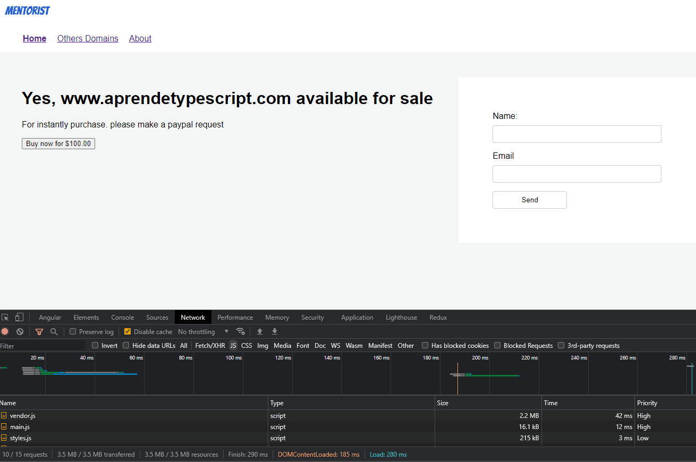

---
{
title: "Head Start With Standalone Components In Angular",
published: "2022-11-03T07:32:11Z",
edited: "2022-11-24T07:34:04Z",
tags: ["angular", "javascript", "frontend", "webdev"],
description: "Since version 14, we can play with Standalone Components as an easy way to build module-less...",
originalLink: "https://www.danywalls.com/head-start-with-angular-14-and-standalone-components",
coverImg: "cover-image.png",
socialImg: "social-image.png"
}
---

Since version 14, we can play with Standalone Components as an easy way to build module-less applications. One benefit of Standalone components is to make Angular easy for new joins to learn and play with Angular without requiring an understanding `ngModule` concept.

> Note: Standalone Components are under the [developer preview](https://angular.io/guide/releases#developer-preview) label, so don't use them in production (yet).

## The Scenario

Today, we will build a standard module Angular app using CLI/14  to learn the following points.

- Create standalone components.
- Use standalone components in the `app.module`.
- Use standalone components with a child's standalone.
- Use Modules inside a standalone component.
- Routing and Lazy loading with Standalone Components.
- Convert to modules-less apps.

## Setup The Project

First, we create a project with Angular 14, but using `npx`, we create a new project with the last version of angular/cli without installing globally.

```bash
npx @angular/cli new landing-page
```

It generates a standard angular application with the app.module and app.component.ts.

The file structure is as follows:

```bash
src
	app/
		components/
		pages/
		app.component.css
		app.component.ts
		app.component.html
		app.module.ts
		app.routes.ts
	assets
	enviroments
	favicon.ico
	index.html
	main.ts
	polyfills.ts
	styles.css
	and more files.
```

## Create Your First Standalone Components

The Angular/cli support generates standalone components using a special flag `--standalone`.

For example, we will generate the container layout by running the following command.

```bash
ng g c components/container-layout --standalone
CREATE src/app/components/container-layout/container-layout.component.html (31 bytes)
CREATE src/app/components/container-layout/container-layout.component.spec.ts (658 bytes)
CREATE src/app/components/container-layout/container-layout.component.ts (409 bytes)
CREATE src/app/components/container-layout/container-layout.component.css (0 bytes)
```

The component has two new properties,  but with some points.

```typescript
import { Component } from '@angular/core';
import { CommonModule } from '@angular/common';

@Component({
  selector: 'app-container-layout',
  standalone: true,
  imports: [CommonModule],
  templateUrl: './container-layout.component.html',
  styleUrls: ['./container-layout.component.css']
})
export class ContainerLayoutComponent  { }

```

- The CLI doesn't add to the  `app.module`.
- The imports property section allows adding other modules like `HttpClientModule`, and `FormsModule`. By default, import the `CommonModule`.
- The `standalone` property is set as `true` to mark the component as standalone.

Add the following html to provide a layout for the app.

```html
<div class="container">
    <ng-content></ng-content>
</div>
<footer>2022</footer>
```

## Register and Use Standalone Components

The `container-layout` component is not part of the app.module; to use in the app.component to open the app.module and include it in the imports section.

> Similar as we work with modules.

```typescript
import { NgModule } from '@angular/core';
import { BrowserModule } from '@angular/platform-browser';
import { AppComponent } from './app.component';
import { ContainerLayoutComponent } from './components/container-layout/container-layout.component';

@NgModule({
  declarations: [
    AppComponent
  ],
  imports: [
    BrowserModule,
    ContainerLayoutComponent
  ],
  providers: [],
  bootstrap: [AppComponent]
})
export class AppModule { }

```

Open the `app.component.html` and use the component.

```html
<app-container-layout>
</app-container-layout>
```

Save the app is ready to use container-layout standalone components. The next step is to use a standalone child component.

## Use Standalone Child Components

Similarly, as we did with `container-layout`,  generate a new standalone component  `logo ` component with the cli using the flag `--standalone`.

```bash
ng g c logo --standalone
CREATE src/app/logo/logo.component.html (19 bytes)
CREATE src/app/logo/logo.component.spec.ts (580 bytes)
CREATE src/app/logo/logo.component.ts (362 bytes)     
CREATE src/app/logo/logo.component.css (0 bytes)   
```

The logo component shows the image in the container-layout component.

```typescript
import { Component, Input, OnInit } from '@angular/core';
import { CommonModule } from '@angular/common';

@Component({
  selector: 'app-logo',
  standalone: true,
  imports: [CommonModule],
  templateUrl: './logo.component.html',
  styleUrls: ['./logo.component.css']
})
export class LogoComponent  {
  @Input() logoName = 'https://avatars.dicebear.com/api/adventurer-neutral/mail%40ashallendesign.co.uk.svg'
}

```

```html

```

Add the logo component inside the `layout` to the imports section.

```typescript
import { Component } from '@angular/core';
import { CommonModule } from '@angular/common';
import { LogoComponent } from '../logo/logo.component';

@Component({
  selector: 'app-container-layout',
  standalone: true,
  imports: [CommonModule, LogoComponent],
  templateUrl: './container-layout.component.html',
  styleUrls: ['./container-layout.component.css']
})
export class ContainerLayoutComponent  {
}

```

Use the `<app-logo>` component in the layout component template.

```html
<app-logo></app-logo>
<div class="container">
    <ng-content></ng-content>
</div>
<footer>2022</footer>
```

Save changes,  and the `app.component` will shows the layout with the logo in the app.

## Use External Modules with Standalone Components

We to learn how to use external modules like `ReactiveForms` in the standalone component.  First create a new standalone component registration using the CLI.

```bash
ng g c register --standalone
CREATE src/app/register/register.component.html (23 bytes)
CREATE src/app/register/register.component.spec.ts (608 bytes)
CREATE src/app/register/register.component.ts (378 bytes)   
CREATE src/app/register/register.component.css (0 bytes)   
```

Next, import the `ReactiveFormsModule`  in the imports section to create the form. Using the `FormGroup` ,`FormControl` declare with fields name and email.

```typescript
import { Component } from '@angular/core';
import { CommonModule } from '@angular/common';
import { FormControl, FormGroup, ReactiveFormsModule } from '@angular/forms';

@Component({
  selector: 'app-register',
  standalone: true,
  imports: [CommonModule,  ReactiveFormsModule],
  templateUrl: './register.component.html',
  styleUrls: ['./register.component.css']
})
export class RegisterComponent  {

  registerForm = new FormGroup({
    name: new FormControl(''),
    email: new FormControl(''),
  });


  sendForm() {
    console.log(this.registerForm.value);
  }
```

Finally, add the `sendForm` method to show the form values in the html. Add the markup HTML to the form linking the ngSubmit with the `sendForm` method.

```html
<form [formGroup]="registerForm" (ngSubmit)="sendForm()">

  <label for="first-name">Name: </label>
  <input id="first-name" type="text" formControlName="name">

  <label for="email">Email</label>
  <input id="email" type="email" formControlName="email">
  <button type="submit">Send</button>
</form>

```

> Read more about [Reactive forms. ](https://angular.io/guide/reactive-forms)

Perfect! We are using ReactiveForms Module in the standalone components; our next stop is routing with standalone components.

## The Navigation and Routing To Standalone Components

The Navigation and the Routing makes we use external modules like `RouterModule`, we going start with the navigation.

First, Create a standalone navigation component using Angular CLI.

```bash
 ng g c navigation --standalone
CREATE src/app/components/navigation/navigation.component.html (25 bytes)
CREATE src/app/components/navigation/navigation.component.spec.ts (622 bytes)
CREATE src/app/components/navigation/navigation.component.ts (386 bytes)
CREATE src/app/components/navigation/navigation.component.css (0 bytes)
```

Because the navigation needs to access the `routerLink` and `routerLinkActive` directives, import the RouterModule in the navigation component.

```typescript
import { Component, OnInit } from '@angular/core';
import { CommonModule } from '@angular/common';
import { RouterModule } from '@angular/router';

@Component({
  selector: 'app-navigation',
  standalone: true,
  imports: [CommonModule, RouterModule],
  templateUrl: './navigation.component.html',
  styleUrls: ['./navigation.component.css']
})
export class NavigationComponent {

}
```

Update the HTML with the following markup with the navigation menu using router directives.

```html
<ul class="navigation">
  <li>
    <a routerLink="/home" routerLinkActive="active">Home</a>
  </li>
  <li>
    <a routerLink="/domains" routerLinkActive="active">Others Domains</a>
  </li>
  <li>
 <a routerLink="/about" routerLinkActive="active">About</a>
  </li>
</ul>

```

The navigation must be part of the `container-layout` component import and use in the html.

```typescript
import { Component } from '@angular/core';
import { CommonModule } from '@angular/common';
import {LogoComponent} from "../logo/logo.component";
import {NavigationComponent} from "../navigation/navigation.component";


@Component({
  selector: 'app-container-layout',
  standalone: true,
  imports: [CommonModule, LogoComponent, NavigationComponent],
  templateUrl: './container-layout.component.html',
  styleUrls: ['./container-layout.component.css']
})
export class ContainerLayoutComponent  { }
```

```html
<app-logo></app-logo>
<app-navigation></app-navigation>
<div class="container">
    <ng-content></ng-content>
</div>
<footer>2022</footer>
```

The navigation is ready, so we need to create the navigation pages and routes.

Next, create the component's home and domains, and using the Angular CLI, these components work as pages for the routing.

```bash

ng g c domains --standalone   
CREATE src/app/pages/domains/domains.component.html (22 bytes)
CREATE src/app/pages/domains/domains.component.spec.ts (601 bytes)
CREATE src/app/pages/domains/domains.component.ts (374 bytes)
CREATE src/app/pages/domains/domains.component.css (0 bytes)
ng g c about --standalone  
CREATE src/app/pages/about/about.component.html (20 bytes)
CREATE src/app/pages/about/about.component.spec.ts (587 bytes)
CREATE src/app/pages/about/about.component.ts (366 bytes)
CREATE src/app/pages/about/about.component.css (0 bytes)
```

Add the following HTML to the components of the page:

domains:

```html
<h2>Other domains</h2>
<ul>
  <li>www.aprendetesting.com</li>
  <li>www.aprende-singlespa.com</li>
</ul>

```

About:

```html
<h1>About</h1>
  <p>Lorem ipsum dolor sit amet consectetur adipisicing elit. Facilis perspiciatis, sunt laudantium architecto repellendus illo aspernatur minus tenetur consequuntur facere vitae natus molestiae, in, ad et. Laborum sed amet adipisci et recusandae, illo perferendis quae deleniti id modi laboriosam ullam nulla expedita sit labore. Odit, vel exercitationem iure vitae dolores sequi labore quasi nemo, non optio rem totam obcaecati aspernatur culpa nihil perferendis itaque corporis in maxime dolorem quidem magni? Facere cupiditate fuga sunt quam praesentium. Dicta id explicabo obcaecati.
</p>
```

The home component will use the register standalone inside, so like we did before, add the registration form in the imports section.

```typescript
import { Component } from '@angular/core';
import { CommonModule } from '@angular/common';
import { RegisterComponent } from '../../components/register/register.component';

@Component({
  selector: 'app-home',
  standalone: true,
  imports: [CommonModule,  RegisterComponent ],
  templateUrl: './home.component.html',
  styleUrls: ['./home.component.css']
})
export class HomeComponent  {
  domainName = "www.aprendetypescript.com";
  price = 100;
}

```

Use add the markup with the `app-register` component.

```
<div class="sections">
  <div class="welcome">
    <h1>Yes, {{domainName}} available for sale</h1>
    <p>For instant purchase. please make a PayPal request</p>
    <button>Buy now for {{price | currency}}</button>
  </div>
  <app-register></app-register>
</div>

```

### Configure Routing

Like we always do with routing,  nothing is different. We declare an array of routes with a path and component to load.

> Learn more about [Routing in Angular](https://angular.io/guide/router)

```typescript
import { Routes } from '@angular/router';
import { AboutComponent } from './pages/about/about.component';
import { DomainsComponent } from './pages/domains/domains.component';
import { HomeComponent } from './pages/home/home.component';

export const routes: Routes = [
  {
    path: '',
    redirectTo: 'home',
    pathMatch: 'full'
  },
  {
    path: 'home',
    component: HomeComponent,
  },
  {
    path: 'domains',
    component: DomainsComponent
  },
  {
    path: 'about',
    component: AboutComponent
  }
]
```

In the `app.module`, import the `RouterModule` passing the routes.

```typescript
 @NgModule({
   declarations: [
     AppComponent
   ],
   imports: [
     BrowserModule,
     ContainerLayoutComponent,
     RouterModule.forRoot(routes)
   ],
   providers: [],
   bootstrap: [AppComponent]
 })
export class AppModule { }
```

Edit the app.component.html and add the router outlet to show the  components.

```
<app-container-layout>
  <router-outlet></router-outlet>
</app-container-layout>

```

Perfect, we Open the app and navigate to the pages using the navigation.

## Add Lazy loading Standalone Components.

Like we work lazy loading modules, we have a slight change for standalone components to the  `loadComponent` function.

Change the component to the `loadComponent()` function, passing the function to load the component.

```typescript
import { Routes } from '@angular/router';

export const routes: Routes = [
  {
    path: '',
    redirectTo: 'home',
    pathMatch: 'full'
  },
  {
    path: 'home',
    loadComponent: () => import('./pages/home/home.component').then(m => m.HomeComponent)
  },
  {
    path: 'domains',
    loadComponent: () => import('./pages/domains/domains.component').then(m => m.DomainsComponent)
  },
  {
    path: 'about',
    loadComponent: () => import('./pages/about/about.component').then(m => m.AboutComponent)
  }
]
```

Save the changes, reload and navigate to each section and the chunked return for each component.



## Convert Module-Less Application

We are in the final step with standalone components. To convert the to module-less, we need to make some changes.

First, convert the` app.component.ts` to standalone components. Add the standalone property to true and import the required components or modules.

```
import { Component } from '@angular/core';
import {CommonModule} from "@angular/common";
import {RouterModule} from "@angular/router";
import {ContainerLayoutComponent} from "./components/container-layout/container-layout.component";


@Component({
  selector: 'app-root',
  standalone: true,
  imports: [CommonModule, RouterModule, ContainerLayoutComponent],
  templateUrl: './app.component.html',
  styleUrls: ['./app.component.css']
})
export class AppComponent {
  title = 'landing-page';
}
```

Open the `main.ts` and use two main functions, `bootstrapApplication` and `importProvidersFrom`.

First remove the platformBrowserDynamic, ti make reference to AppModule.

```typescript
platformBrowserDynamic().bootstrapModule(AppModule)
```

Use the bootstrapApplication function, it expect two parameters, the main or root component in our case `AppComponent` and as second parameter  configuration object with for example the providers.

The providers we use the funcion `importProvidersFrom` to use the for example the RouterModule. The RouterModule need the routes declared before.

The final code looks like:

```typescript
import {enableProdMode, importProvidersFrom} from '@angular/core';
import { environment } from './environments/environment';
import {bootstrapApplication} from "@angular/platform-browser";
import {AppComponent} from "./app/app.component";
import {RouterModule} from "@angular/router";
import {routes} from "./app/routes";

if (environment.production) {
  enableProdMode();
}

bootstrapApplication(AppComponent, {
    providers:[
        importProvidersFrom(RouterModule.forRoot(routes))
    ]

})
  .catch(err => console.error(err));

```

Finally, remove the `app.module.ts,` and convert our app to a module-less app with lazy loading, routing, and using external modules like dynamic forms.

## Recap

We learn how to create standalone components, load modules, use standalone components, routing, and lazy loading. I hope its help you to build your module-less app.

[Source Code](https://github.com/danywalls/learn-standalone-components).

Read more about Standalone Components:

- <https://angular.io/guide/standalone-components>
- [Learn Standalone Components](https://www.youtube.com/watch?v=x5PZwb4XurU)
- [Angular Standalone Components and their Impact on Modularity](https://www.youtube.com/watch?v=rproG1_TCek\&t=1s)
